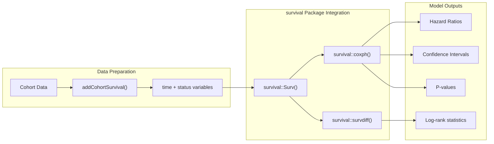
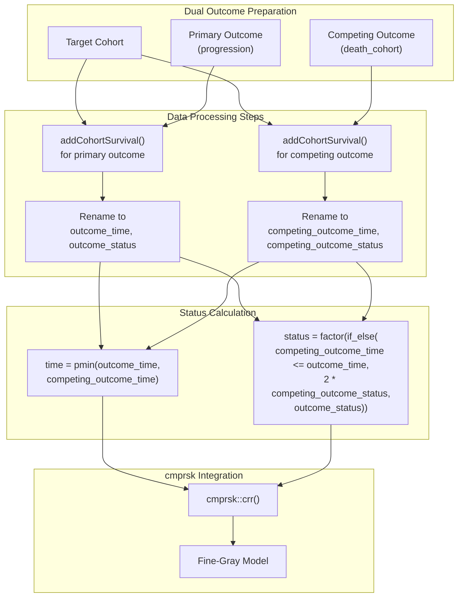
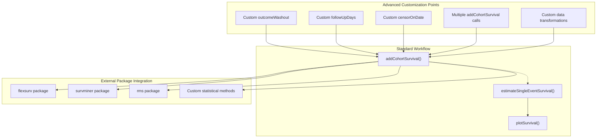

# Page: Advanced Analysis Techniques

# Advanced Analysis Techniques

<details>
<summary>Relevant source files</summary>

The following files were used as context for generating this wiki page:

- [R/mockMGUS2cdm.R](R/mockMGUS2cdm.R)
- [vignettes/a03_Further_survival_analyses.Rmd](vignettes/a03_Further_survival_analyses.Rmd)

</details>


This page covers advanced survival analysis techniques that extend beyond the core CohortSurvival functionality. It focuses on integrating CohortSurvival with external statistical packages like `survival` and `cmprsk` to perform sophisticated analyses such as Cox Proportional Hazards modeling and Fine-Gray competing risk models. For basic survival estimation, see [Single Event Survival Analysis Tutorial](#5.1) and [Competing Risk Analysis Tutorial](#5.2).

## Integration with External Survival Packages

While CohortSurvival provides built-in Kaplan-Meier and Aalen-Johansen estimators, it primarily serves as a data preparation layer for more advanced statistical methods available in specialized R packages. The package transforms OMOP CDM cohort data into formats required by external survival analysis functions.

```mermaid
flowchart TD
    subgraph "OMOP CDM Data"
        TC["Target Cohort<br/>(mgus_diagnosis)"]
        OC["Outcome Cohort<br/>(death_cohort)"]
        CC["Competing Cohort<br/>(progression)"]
    end
    
    subgraph "CohortSurvival Data Preparation"
        ACS["addCohortSurvival()<br/>Add time/status columns"]
        DM["Data Manipulation<br/>Competing risk formatting"]
    end
    
    subgraph "External Statistical Packages"
        SP["survival package"]
        CP["cmprsk package"]
    end
    
    subgraph "Advanced Models"
        COX["survival::coxph()<br/>Cox Proportional Hazards"]
        SD["survival::survdiff()<br/>Log-rank tests"]
        FG["cmprsk::crr()<br/>Fine-Gray models"]
    end
    
    TC --> ACS
    OC --> ACS
    CC --> ACS
    
    ACS --> DM
    ACS --> COX
    ACS --> SD
    
    DM --> FG
    
    SP -.-> COX
    SP -.-> SD
    CP -.-> FG
    
    COX --> "Cox regression results"
    SD --> "Log-rank test results"
    FG --> "Competing risk regression results"
```

**Advanced Analysis Integration Workflow**

Sources: [vignettes/a03_Further_survival_analyses.Rmd:35-36]()

## Single Event Advanced Analysis

The `addCohortSurvival` function prepares cohort data with the required `time` and `status` variables for external survival functions. This enables seamless integration with the `survival` package for advanced modeling.

### Cox Proportional Hazards Modeling



**Cox Regression Analysis Pipeline**

The basic workflow involves calling `addCohortSurvival` to add survival variables, then using these with `survival` package functions:

| Parameter | Purpose | Example Usage |
|-----------|---------|---------------|
| `outcomeCohortTable` | Defines outcome events | `"death_cohort"` |
| `outcomeWashout` | Excludes recent outcomes | `180` (days) |
| `followUpDays` | Limits follow-up period | `365` (1 year) |
| `censorOnDate` | Administrative censoring | `as.Date("1994-01-01")` |

Sources: [vignettes/a03_Further_survival_analyses.Rmd:39-81]()

### Advanced Parameter Configuration

The `addCohortSurvival` function offers several parameters for customizing the survival analysis setup:

```mermaid
graph TD
    subgraph "addCohortSurvival Parameters"
        OWT["outcomeWashout<br/>Exclude recent outcomes"]
        FUD["followUpDays<br/>Limit follow-up time"]
        ODV["outcomeDateVariable<br/>Custom outcome date"]
        COD["censorOnDate<br/>Administrative censoring"]
    end
    
    subgraph "Data Transformations"
        TE["Time Calculation<br/>min(follow-up, outcome)"]
        SC["Status Calculation<br/>Event vs censored"]
        FC["Follow-up Constraints<br/>Apply time limits"]
    end
    
    OWT --> TE
    FUD --> TE
    ODV --> SC
    COD --> SC
    
    TE --> FC
    SC --> FC
    
    FC --> "Prepared survival data"
```

**Parameter Configuration Effects**

Sources: [vignettes/a03_Further_survival_analyses.Rmd:53-74]()

## Competing Risk Advanced Analysis

For competing risk scenarios, the data preparation process is more complex, requiring integration of multiple outcome types and specialized formatting for the `cmprsk` package.

### Fine-Gray Model Implementation



**Competing Risk Data Preparation Workflow**

The competing risk analysis requires careful coordination of multiple outcome types and status encoding:

| Status Value | Interpretation |
|--------------|----------------|
| `0` | Censored (no event) |
| `1` | Primary outcome occurred |
| `2` | Competing outcome occurred |

Sources: [vignettes/a03_Further_survival_analyses.Rmd:84-128]()

### Data Structure Requirements

The competing risk analysis workflow involves specific data transformations to create the required input format:

```mermaid
graph TD
    subgraph "Input Cohorts"
        MGD["mgus_diagnosis<br/>(Target cohort)"]
        PROG["progression<br/>(Primary outcome)"]
        DEATH["death_cohort<br/>(Competing outcome)"]
    end
    
    subgraph "First addCohortSurvival Call"
        ACS1["addCohortSurvival(cdm, 'progression')"]
        OT["outcome_time"]
        OS["outcome_status"]
    end
    
    subgraph "Second addCohortSurvival Call"  
        ACS2["addCohortSurvival(cdm, 'death_cohort')"]
        COT["competing_outcome_time"]
        COS["competing_outcome_status"]
    end
    
    subgraph "Final Transformation"
        COLLECT["dplyr::collect()"]
        MUTATE["Calculate final time/status"]
        SELECT["Remove intermediate columns"]
    end
    
    MGD --> ACS1
    PROG --> ACS1
    ACS1 --> OT
    ACS1 --> OS
    
    OT --> ACS2
    OS --> ACS2
    DEATH --> ACS2
    ACS2 --> COT
    ACS2 --> COS
    
    COT --> COLLECT
    COS --> COLLECT
    COLLECT --> MUTATE
    MUTATE --> SELECT
    SELECT --> "cmprsk-ready data"
```

**Competing Risk Data Structure Pipeline**

Sources: [vignettes/a03_Further_survival_analyses.Rmd:88-111]()

## Mock Data Infrastructure

The `mockMGUS2cdm` function provides a comprehensive testing environment for advanced analysis techniques, creating realistic OMOP CDM structures from the `survival::mgus2` dataset.

### MGUS2 CDM Structure

```mermaid
graph LR
    subgraph "survival::mgus2 Source Data"
        MGU2["mgus2 dataset<br/>Original survival data"]
    end
    
    subgraph "Generated OMOP Tables"
        PERS["person table<br/>Demographics"]
        OP["observation_period<br/>Follow-up windows"]
        VO["visit_occurrence<br/>Clinical encounters"]
    end
    
    subgraph "Generated Cohort Tables"
        DIAG["mgus_diagnosis<br/>Target cohort"]
        PROG["progression<br/>Primary outcome"]
        PROGTYP["progression_type<br/>Multiple outcomes"]
        DEATH["death_cohort<br/>Competing outcome"]
    end
    
    MGU2 --> PERS
    MGU2 --> OP
    MGU2 --> VO
    MGU2 --> DIAG
    MGU2 --> PROG
    MGU2 --> PROGTYP
    MGU2 --> DEATH
    
    DIAG --> "Target for analysis"
    PROG --> "Single/competing outcomes"
    DEATH --> "Competing risk analysis"
```

**MGUS2 Mock CDM Architecture**

The mock CDM includes comprehensive demographic and clinical variables suitable for advanced modeling:

| Variable | Type | Purpose |
|----------|------|---------|
| `age` | Numeric | Continuous covariate |
| `sex` | Factor | Categorical covariate |
| `hgb` | Numeric | Hemoglobin level |
| `creat` | Numeric | Creatinine level |
| `mspike` | Numeric | M-spike measurement |

Sources: [R/mockMGUS2cdm.R:27-192]()

## Custom Analysis Workflows

Advanced users can leverage the data preparation capabilities for custom analysis pipelines beyond the standard survival and competing risk packages.

### Workflow Customization Points



**Custom Analysis Extension Points**

The flexibility of `addCohortSurvival` enables integration with various advanced survival analysis packages and custom statistical methods while maintaining OMOP CDM compliance and standardized data preparation workflows.

Sources: [vignettes/a03_Further_survival_analyses.Rmd:35-36](), [R/mockMGUS2cdm.R:17-26]()