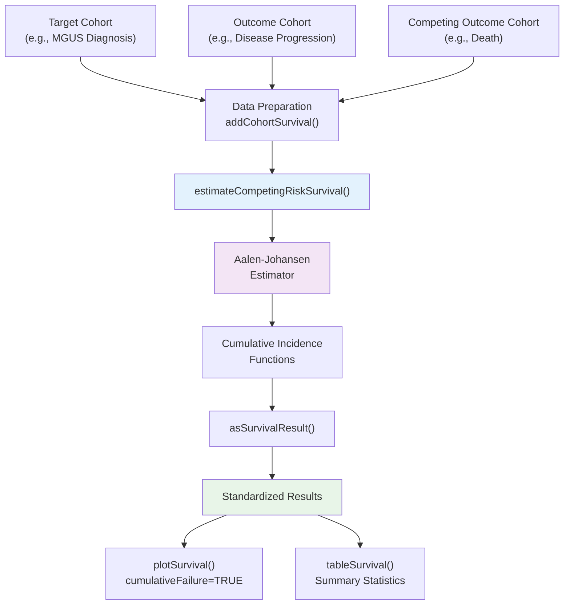
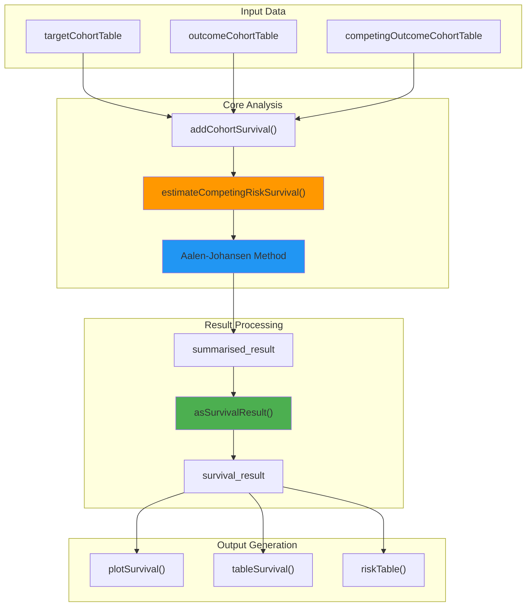
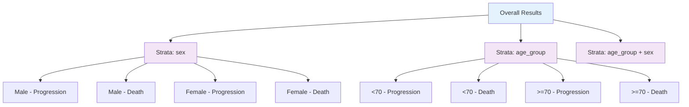

# Page: Competing Risk Analysis Tutorial

# Competing Risk Analysis Tutorial

<details>
<summary>Relevant source files</summary>

The following files were used as context for generating this wiki page:

- [README.Rmd](README.Rmd)
- [README.md](README.md)
- [tests/testthat/test-addCohortSurvival.R](tests/testthat/test-addCohortSurvival.R)
- [vignettes/a02_Competing_risk_survival.Rmd](vignettes/a02_Competing_risk_survival.Rmd)

</details>


## Purpose and Scope

This tutorial provides a comprehensive guide to performing competing risk survival analysis using the CohortSurvival package. Competing risk analysis is used when multiple events can occur to the same individual, but the occurrence of one event prevents the occurrence of others. This tutorial covers the practical implementation of competing risk methods using the Aalen-Johansen estimator within the OMOP CDM framework.

For basic single event survival analysis, see [Single Event Survival Analysis Tutorial](#5.1). For advanced analysis techniques and integration with external packages, see [Advanced Analysis Techniques](#5.3).

## Understanding Competing Risk Analysis

Competing risk analysis differs from standard survival analysis by acknowledging that multiple types of events can occur, where experiencing one event precludes experiencing others. In healthcare research, common examples include studying disease progression while accounting for death from other causes, or analyzing treatment response while considering treatment discontinuation.

### Competing Risk Analysis Workflow



**Sources:** [README.Rmd:106-136](), [vignettes/a02_Competing_risk_survival.Rmd:52-66]()

### Core Function Architecture



**Sources:** [README.Rmd:111-119](), [vignettes/a02_Competing_risk_survival.Rmd:57-66]()

## Data Setup and Requirements

Competing risk analysis requires three cohort tables in your CDM reference:

| Cohort Type | Purpose | Example |
|-------------|---------|---------|
| Target | Baseline population entering follow-up | MGUS diagnosis cohort |
| Outcome | Primary event of interest | Disease progression cohort |
| Competing Outcome | Alternative event that precludes primary outcome | Death cohort |

The MGUS2 dataset provides an ideal example for competing risk analysis, examining progression to multiple myeloma (outcome) versus death without progression (competing outcome).

**Sources:** [README.Rmd:37-69](), [vignettes/a02_Competing_risk_survival.Rmd:29-50]()

## Basic Competing Risk Analysis

### Core Function Usage

The `estimateCompetingRiskSurvival()` function is the primary interface for competing risk analysis. It requires specification of both the primary outcome and competing outcome cohorts:

```r
MGUS_death_prog <- estimateCompetingRiskSurvival(
  cdm,
  targetCohortTable = "mgus_diagnosis",
  outcomeCohortTable = "progression", 
  competingOutcomeCohortTable = "death_cohort"
)
```

### Key Parameters

| Parameter | Purpose | Default |
|-----------|---------|---------|
| `targetCohortTable` | Name of target cohort table | Required |
| `outcomeCohortTable` | Primary outcome cohort | Required |
| `competingOutcomeCohortTable` | Competing outcome cohort | Required |
| `targetCohortId` | Target cohort definition ID | 1 |
| `outcomeCohortId` | Outcome cohort definition ID | 1 |
| `competingOutcomeCohortId` | Competing outcome cohort definition ID | 1 |
| `strata` | Stratification variables | NULL |

### Result Structure

The function returns a `summarised_result` object containing cumulative incidence functions for both the primary outcome and competing outcome. Each result includes time points, estimates, and confidence intervals.

**Sources:** [README.Rmd:111-119](), [vignettes/a02_Competing_risk_survival.Rmd:57-66]()

## Stratified Competing Risk Analysis

### Stratification Implementation

Stratification variables must be present as columns in the target cohort table before analysis. Multiple stratification schemes can be specified simultaneously:

```r
MGUS_death_prog <- estimateCompetingRiskSurvival(
  cdm,
  targetCohortTable = "mgus_diagnosis",
  outcomeCohortTable = "progression",
  competingOutcomeCohortTable = "death_cohort",
  strata = list(c("sex"), c("age_group"), c("age_group", "sex"))
)
```

### Stratification Results Structure



**Sources:** [README.Rmd:124-136](), [vignettes/a02_Competing_risk_survival.Rmd:84-92]()

## Visualization and Interpretation

### Cumulative Incidence Plots

Competing risk analysis results are best visualized using cumulative incidence functions rather than survival curves. The `plotSurvival()` function with `cumulativeFailure = TRUE` displays the probability of experiencing each event over time:

```r
plotSurvival(MGUS_death_prog, 
             cumulativeFailure = TRUE,
             colour = "variable_level")
```

### Plot Customization Options

| Parameter | Purpose | Competing Risk Usage |
|-----------|---------|---------------------|
| `cumulativeFailure` | Show cumulative incidence instead of survival | `TRUE` (recommended) |
| `colour` | Color mapping variable | `"variable_level"` for outcomes |
| `facet` | Faceting variable | `"strata_level"` for stratification |
| `ribbon` | Show confidence intervals | `TRUE` (default) |

### Interpretation Guidelines

1. **Cumulative Incidence**: Represents the probability of experiencing each specific event by time t
2. **Competing Events**: Sum of all cumulative incidences approaches 1 as time increases
3. **Relative Risk**: Compare incidence curves between strata to assess differential risk

**Sources:** [README.Rmd:117-119](), [README.Rmd:131-135](), [vignettes/a02_Competing_risk_survival.Rmd:71-74](), [vignettes/a02_Competing_risk_survival.Rmd:98-104]()

## Summary Tables and Risk Tables

### Summary Statistics

The `tableSurvival()` function generates comprehensive summary statistics for competing risk analysis, including separate rows for each outcome:

- Number of records and events
- Median time to event
- Restricted mean survival time  
- Time-specific incidence estimates

### Risk Table Generation

The `riskTable()` function provides numbers at risk over time, accounting for both types of events and censoring patterns specific to competing risk scenarios.

**Sources:** [vignettes/a02_Competing_risk_survival.Rmd:78-80](), [vignettes/a02_Competing_risk_survival.Rmd:108-110]()

## Advanced Considerations

### Data Preparation Options

The underlying `addCohortSurvival()` function supports several options relevant to competing risk analysis:

- `censorOnCohortExit`: Controls censoring at cohort exit
- `censorOnDate`: Implements administrative censoring
- `followUpDays`: Limits follow-up duration
- `outcomeWashout`: Defines outcome washout periods

### Statistical Methods

The implementation uses the Aalen-Johansen estimator, which provides unbiased estimates of cumulative incidence functions in the presence of competing risks. This approach properly handles the interdependence between competing events.

### Integration with OMOP Ecosystem

Competing risk analysis integrates seamlessly with other OMOP packages:

- Results conform to `omopgenerics` standards
- Export/import functionality via `exportSummarisedResult()`
- Compatible with `visOmopResults` for advanced visualization

**Sources:** [tests/testthat/test-addCohortSurvival.R:166-277](), [tests/testthat/test-addCohortSurvival.R:385-495]()