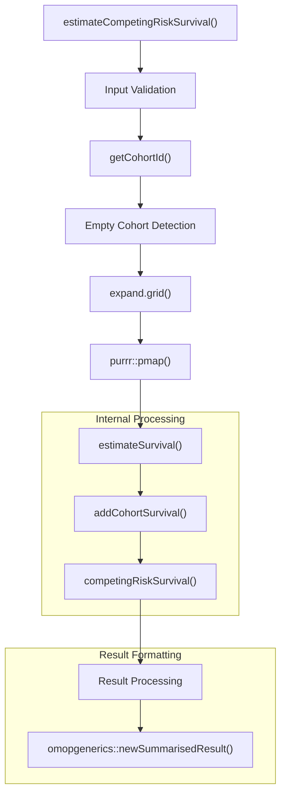
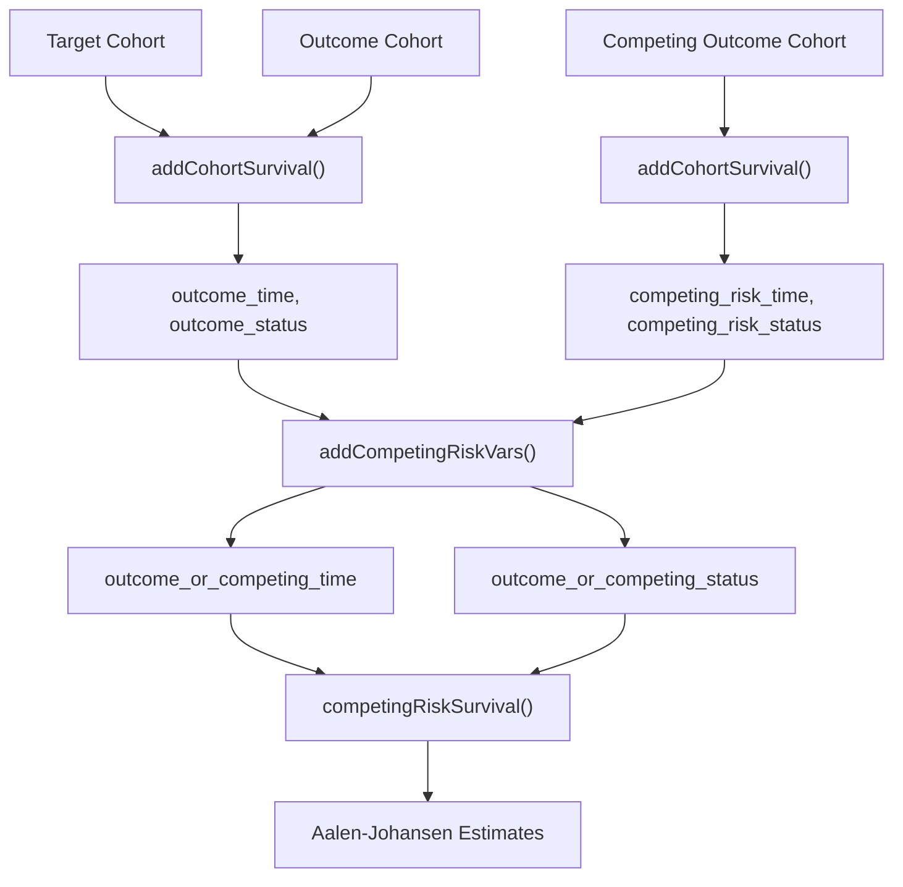
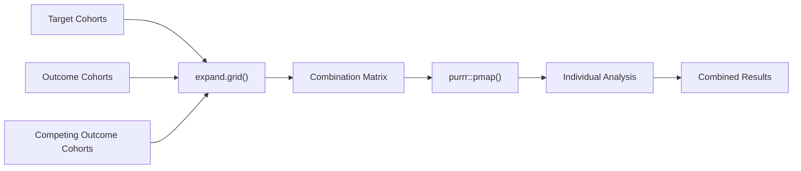
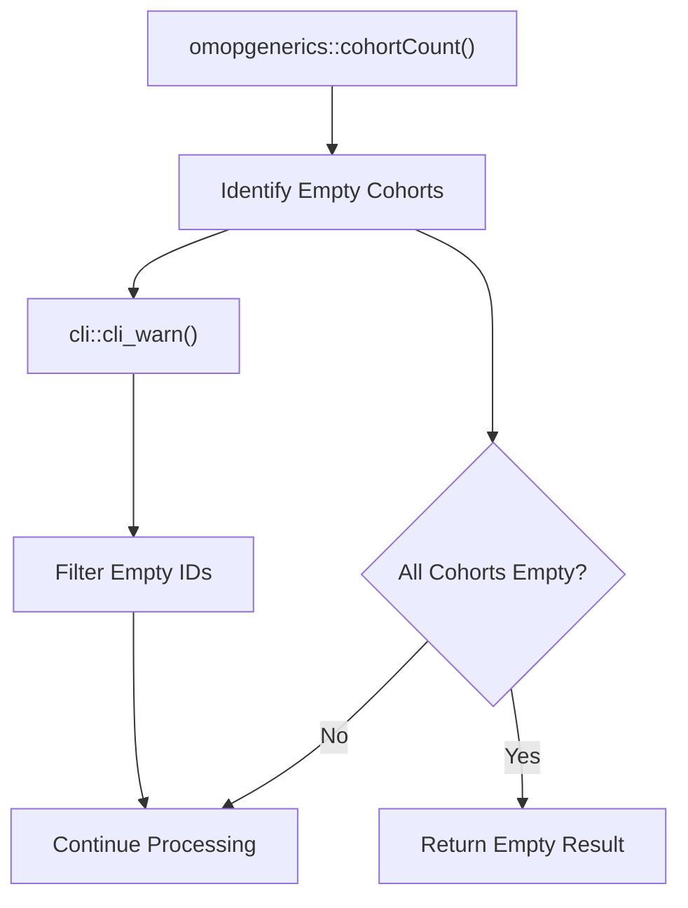
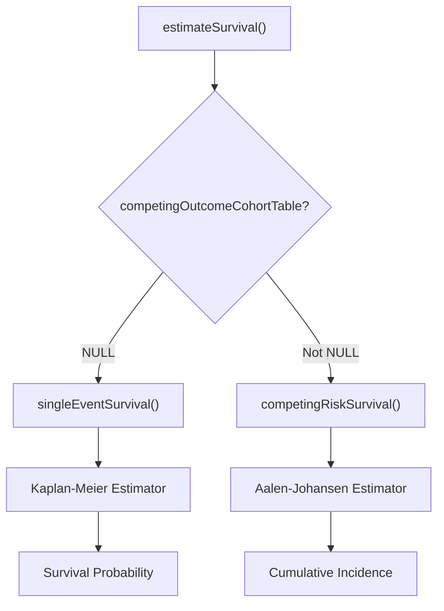
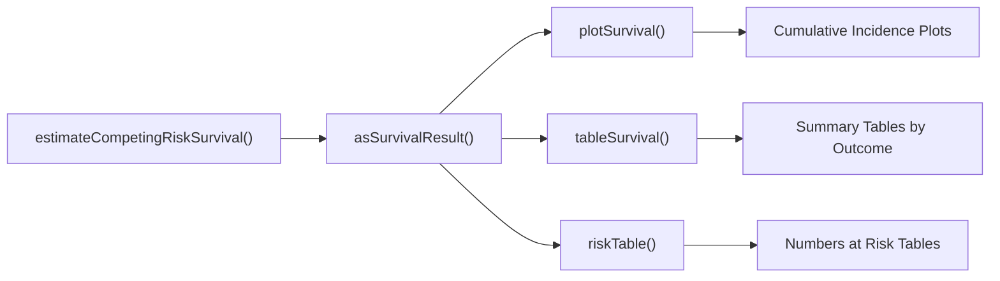

# Page: Competing Risk Survival Estimation

# Competing Risk Survival Estimation

<details>
<summary>Relevant source files</summary>

The following files were used as context for generating this wiki page:

- [R/estimateSurvival.R](R/estimateSurvival.R)
- [man/estimateCompetingRiskSurvival.Rd](man/estimateCompetingRiskSurvival.Rd)
- [man/estimateSingleEventSurvival.Rd](man/estimateSingleEventSurvival.Rd)
- [tests/testthat/test-addCohortSurvival.R](tests/testthat/test-addCohortSurvival.R)
- [vignettes/a02_Competing_risk_survival.Rmd](vignettes/a02_Competing_risk_survival.Rmd)

</details>


This document covers the competing risk survival estimation functionality in CohortSurvival, specifically the `estimateCompetingRiskSurvival` function. This function performs survival analysis when multiple competing events can occur, where the occurrence of one event prevents others from happening (e.g., disease progression vs. death from other causes).

For single event survival analysis without competing risks, see [Single Event Survival Estimation](#2.1). For data preparation that underlies both approaches, see [Data Preparation with addCohortSurvival](#2.3).

## Overview

Competing risk survival analysis addresses scenarios where subjects can experience one of several mutually exclusive events. The `estimateCompetingRiskSurvival` function uses the Aalen-Johansen estimator to calculate cumulative incidence functions for each competing event, providing more accurate estimates than treating competing events as simple censoring.

**Sources**: [R/estimateSurvival.R:429-768](), [man/estimateCompetingRiskSurvival.Rd:1-106]()

## Function Architecture



**Function Call Flow for Competing Risk Analysis**

The function follows a systematic workflow where input validation leads to cohort combination processing, which then delegates to the internal `estimateSurvival` function for the actual statistical computation.

**Sources**: [R/estimateSurvival.R:429-557]()

## Core Parameters

| Parameter | Type | Default | Description |
|-----------|------|---------|-------------|
| `competingOutcomeCohortTable` | character | Required | Table containing competing outcome cohort |
| `competingOutcomeCohortId` | integer | NULL | ID of competing event cohorts |
| `competingOutcomeDateVariable` | character | "cohort_start_date" | Date variable for competing outcome |
| `competingOutcomeWashout` | numeric | Inf | Washout period for competing outcome |

These parameters extend the standard survival analysis parameters to accommodate the additional competing risk dimension.

**Sources**: [R/estimateSurvival.R:429-447](), [man/estimateCompetingRiskSurvival.Rd:30-79]()

## Data Flow for Competing Risks



**Competing Risk Data Processing Pipeline**

The data preparation involves calculating time-to-event for both the primary outcome and competing outcome, then combining them into unified time and status variables for the Aalen-Johansen estimator.

**Sources**: [R/estimateSurvival.R:808-843]()

## Cohort Combination Processing

The function processes all combinations of target cohorts, outcome cohorts, and competing outcome cohorts:



**Multi-Cohort Analysis Strategy**

The function uses `expand.grid()` to create all possible combinations, then processes each combination independently using `purrr::pmap()` for parallel processing capability.

**Sources**: [R/estimateSurvival.R:499-557]()

## Empty Cohort Handling

The function includes robust handling for empty cohorts:



**Empty Cohort Detection and Warning System**

Empty cohorts are detected through count validation and appropriate warnings are issued while filtering out empty cohort IDs from further processing.

**Sources**: [R/estimateSurvival.R:465-496]()

## Statistical Implementation

The competing risk analysis delegates to the internal `competingRiskSurvival` function when a competing outcome cohort table is specified:



**Statistical Method Selection**

The presence of a competing outcome cohort table determines whether Kaplan-Meier (single event) or Aalen-Johansen (competing risk) estimation is used.

**Sources**: [R/estimateSurvival.R:874-878]()

## Result Structure

The function returns a `summarised_result` object with standardized structure:

| Component | Description | Analysis Type |
|-----------|-------------|---------------|
| `estimates` | Survival/cumulative incidence estimates | "competing_risk" |
| `events` | Event count data by time intervals | "competing_risk" |
| `summary` | Restricted mean and median estimates | "competing_risk" |
| `attrition` | Subject flow through analysis steps | "competing_risk" |

The `analysis_type` field is set to "competing_risk" to distinguish from single event analysis.

**Sources**: [R/estimateSurvival.R:588-602]()

## Usage Example

```r
# Basic competing risk analysis
result <- estimateCompetingRiskSurvival(
  cdm = cdm,
  targetCohortTable = "mgus_diagnosis",
  outcomeCohortTable = "progression", 
  competingOutcomeCohortTable = "death_cohort",
  targetCohortId = 1,
  outcomeCohortId = 1,
  competingOutcomeCohortId = 1
)
```

This example analyzes progression to multiple myeloma as the primary outcome with death as a competing risk in MGUS patients.

**Sources**: [man/estimateCompetingRiskSurvival.Rd:91-103](), [vignettes/a02_Competing_risk_survival.Rmd:57-61]()

## Integration with Analysis Pipeline

The competing risk function integrates seamlessly with the broader CohortSurvival analysis pipeline:



**Downstream Processing Integration**

Results from competing risk analysis can be processed using the same visualization and tabulation functions as single event analysis, with automatic handling of the competing risk structure.

**Sources**: [vignettes/a02_Competing_risk_survival.Rmd:70-80]()