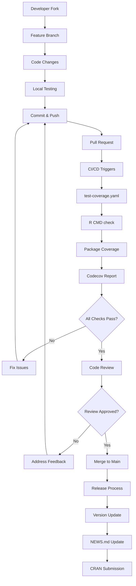
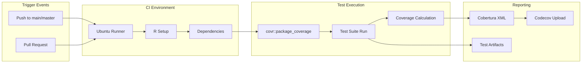
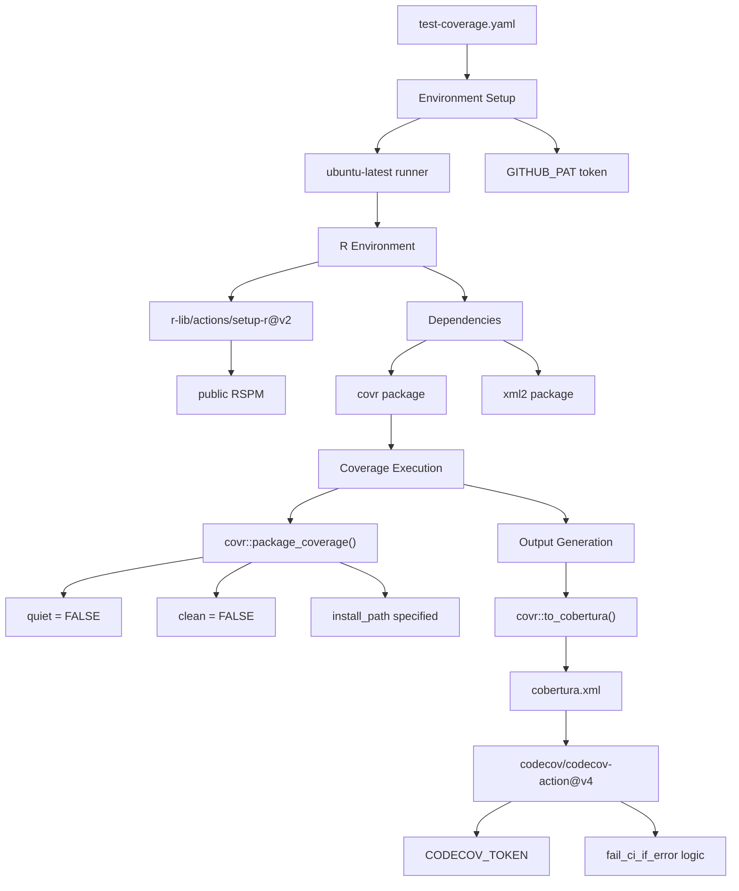
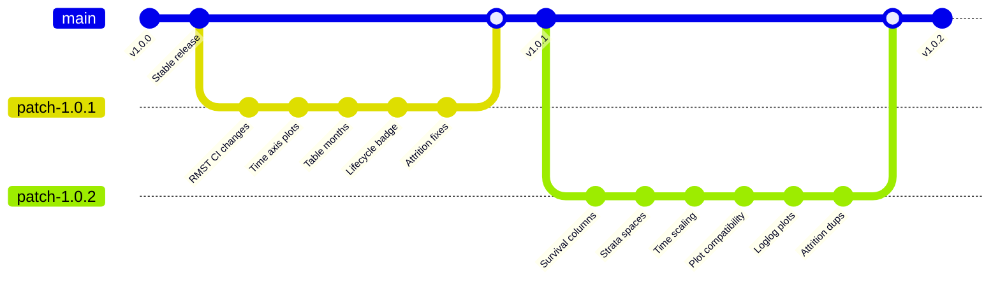
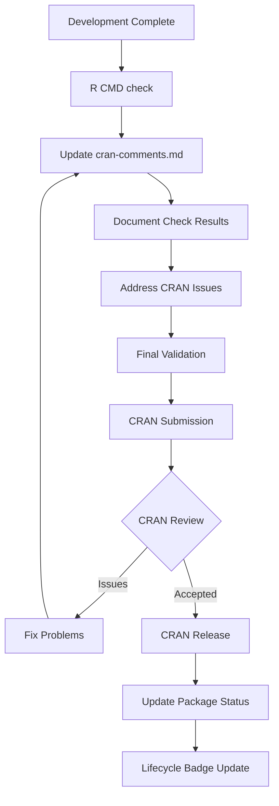

# Page: Contributing and CI/CD

# Contributing and CI/CD

Relevant source files

The following files were used as context for generating this wiki page:

- [.github/workflows/test-coverage.yaml](.github/workflows/test-coverage.yaml)
- [NEWS.md](NEWS.md)
- [cran-comments.md](cran-comments.md)

This document covers the development workflow, contribution guidelines, and automated CI/CD processes for the CohortSurvival package. It provides information for developers who want to contribute to the package or understand how code changes are tested, validated, and released.

For information about the package structure and dependencies, see [Package Structure and Dependencies](#7.2). For details about the testing framework itself, see [Testing Framework](#7.1).

## Purpose and Scope

This page documents the technical processes for contributing code to CohortSurvival, including:

- Development workflow and contribution guidelines
- GitHub Actions CI/CD pipelines
- Automated testing and coverage reporting
- Release management and versioning
- CRAN submission process

## Contributing Workflow

The CohortSurvival package follows a standard GitHub-based contribution model with automated quality assurance through CI/CD pipelines.

### Development Process Flow

Sources: [.github/workflows/test-coverage.yaml:1-62](), [NEWS.md:1-25]()

### Contribution Guidelines

Contributors should follow these practices based on the established patterns in the repository:

| Aspect | Requirement | Evidence |
|--------|-------------|----------|
| **Issue References** | Link commits to GitHub issues | Pull requests reference issue numbers (e.g., #335, #333) |
| **Attribution** | Credit contributors in NEWS.md | Contributors credited with GitHub handles (@KimLopezGuell, @catalamarti) |
| **Semantic Versioning** | Follow semver (major.minor.patch) | Version progression: 1.0.0 → 1.0.1 → 1.0.2 |
| **Testing** | Ensure tests pass | CI/CD runs comprehensive test suite |
| **Coverage** | Maintain test coverage | Automated coverage reporting via codecov |

Sources: [NEWS.md:4-11](), [NEWS.md:15-19]()

## CI/CD Pipeline Architecture

### GitHub Actions Workflow

The package uses GitHub Actions for continuous integration, specifically focusing on test coverage and quality assurance.

Sources: [.github/workflows/test-coverage.yaml:3-7](), [.github/workflows/test-coverage.yaml:13-18]()

### Coverage Pipeline Configuration

The test coverage workflow implements comprehensive testing with the following specifications:

Sources: [.github/workflows/test-coverage.yaml:16-17](), [.github/workflows/test-coverage.yaml:22-29](), [.github/workflows/test-coverage.yaml:32-39]()

### Error Handling and Artifacts

The CI pipeline includes robust error handling and artifact collection:

| Component | Configuration | Purpose |
|-----------|---------------|---------|
| **Failure Detection** | `fail_ci_if_error: ${{ github.event_name != 'pull_request' && true \|\| false }}` | Different failure behavior for PRs vs pushes |
| **Test Output** | Find and display `testthat.Rout*` files | Debug test failures |
| **Artifact Upload** | Upload test failures to `coverage-test-failures` | Preserve failure state for analysis |
| **Token Security** | `${{ secrets.CODECOV_TOKEN }}` | Secure codecov integration |

Sources: [.github/workflows/test-coverage.yaml:43](), [.github/workflows/test-coverage.yaml:49-54](), [.github/workflows/test-coverage.yaml:57-61]()

## Release Management

### Versioning Strategy

The package follows semantic versioning with structured release notes:

Sources: [NEWS.md:21-24](), [NEWS.md:13-20](), [NEWS.md:2-11]()

### Release Notes Structure

Each release in `NEWS.md` follows a consistent format:

| Element | Pattern | Example |
|---------|---------|---------|
| **Version Header** | `# CohortSurvival X.Y.Z` | `# CohortSurvival 1.0.2` |
| **Change Entry** | `* Description by @contributor #issue` | `* Survival result keeps distinctive columns by @KimLopezGuell #335` |
| **Attribution** | GitHub handle with @ prefix | `@KimLopezGuell`, `@catalamarti` |
| **Issue Reference** | Hash followed by issue number | `#335`, `#333`, `#331` |

Sources: [NEWS.md:2](), [NEWS.md:4]()

## CRAN Submission Process

### Submission Preparation

The package maintains CRAN submission documentation through `cran-comments.md`:

Sources: [cran-comments.md:1-2](), [NEWS.md:18]()

### Quality Assurance Checklist

Before CRAN submission, the following automated and manual checks are performed:

| Check Type | Tool/Process | Status Location |
|------------|--------------|-----------------|
| **R CMD check** | GitHub Actions CI | `cran-comments.md` |
| **Test Coverage** | `covr` package + codecov | CI dashboard |
| **Dependencies** | Package imports/suggests | `DESCRIPTION` file |
| **Documentation** | roxygen2 + R CMD check | Build logs |
| **Lifecycle Status** | Badge updates | README and documentation |

Sources: [NEWS.md:18](), [.github/workflows/test-coverage.yaml:32-39]()

## Integration Points

### Code Quality Gates

The CI/CD system enforces quality through multiple integration points:

```mermaid
graph LR
    subgraph "Pre-merge Validation"
        A["Pull Request"]
        B["CI Trigger"]
        C["Test Execution"]
        D["Coverage Report"]
    end
    
    subgraph "Post-merge Actions"
        E["Main Branch Update"]
        F["Full Test Suite"]
        G["Coverage Upload"]
        H["Release Preparation"]
    end
    
    subgraph "Release Gates"
        I["Version Update"]
        J["NEWS.md Update"]
        K["CRAN Validation"]
        L["Publication"]
    end
    
    A --> B
    B --> C
    C --> D
    D --> E
    E --> F
    F --> G
    G --> H
    H --> I
    I --> J
    J --> K
    K --> L
```

Sources: [.github/workflows/test-coverage.yaml:4-7](), [NEWS.md:1-25]()

This comprehensive CI/CD setup ensures that all contributions maintain the package's quality standards while providing clear pathways for feature development, bug fixes, and stable releases to the CRAN repository.