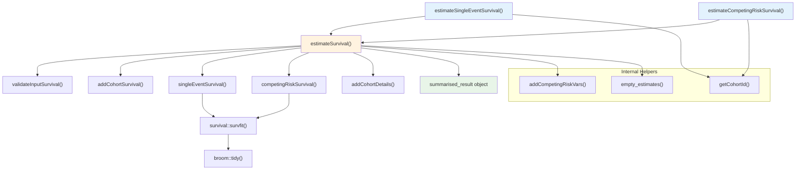
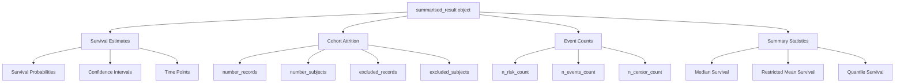
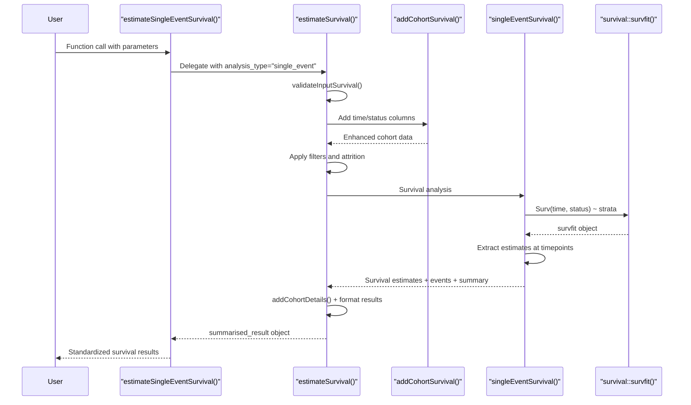

# Page: Core Analysis Functions

# Core Analysis Functions

<details>
<summary>Relevant source files</summary>

The following files were used as context for generating this wiki page:

- [R/estimateSurvival.R](R/estimateSurvival.R)
- [man/estimateCompetingRiskSurvival.Rd](man/estimateCompetingRiskSurvival.Rd)
- [man/estimateSingleEventSurvival.Rd](man/estimateSingleEventSurvival.Rd)

</details>


This page provides complete reference documentation for the primary survival estimation functions that form the analytical core of the CohortSurvival package. These functions perform survival analysis on OMOP CDM cohorts and return standardized `summarised_result` objects.

For step-by-step usage tutorials, see [Single Event Survival Analysis Tutorial](#5.1) and [Competing Risk Analysis Tutorial](#5.2). For information about data preparation, see [Data Preparation with addCohortSurvival](#2.3). For result processing and formatting, see [SurvivalResult Objects](#3.1).

## Function Overview

The core analysis functions provide two primary survival analysis methods:

| Function | Analysis Type | Use Case |
|----------|--------------|----------|
| `estimateSingleEventSurvival()` | Kaplan-Meier | Standard survival analysis with one outcome of interest |
| `estimateCompetingRiskSurvival()` | Aalen-Johansen | Survival analysis with competing events that prevent the outcome |

Both functions are wrappers around the internal `estimateSurvival()` function, which handles the core survival computation logic.

Sources: [R/estimateSurvival.R:65-372](), [R/estimateSurvival.R:429-768]()

## Core Function Architecture



**Core Function Relationships**: This diagram shows how the user-facing functions delegate to internal components and external survival packages.

Sources: [R/estimateSurvival.R:771-1048](), [R/estimateSurvival.R:1061-1311](), [R/estimateSurvival.R:1313-1627]()

## estimateSingleEventSurvival()

Performs Kaplan-Meier survival analysis for a single outcome event using OMOP CDM cohorts.

### Function Signature

```r
estimateSingleEventSurvival(
  cdm,
  targetCohortTable,
  outcomeCohortTable,
  targetCohortId = NULL,
  outcomeCohortId = NULL,
  outcomeDateVariable = "cohort_start_date",
  outcomeWashout = Inf,
  censorOnCohortExit = FALSE,
  censorOnDate = NULL,
  followUpDays = Inf,
  strata = NULL,
  eventGap = 30,
  estimateGap = 1,
  restrictedMeanFollowUp = NULL,
  minimumSurvivalDays = 1
)
```

### Core Parameters

| Parameter | Type | Default | Description |
|-----------|------|---------|-------------|
| `cdm` | CDM reference | Required | Database connection object from CDMConnector |
| `targetCohortTable` | character | Required | Name of target cohort table in CDM |
| `outcomeCohortTable` | character | Required | Name of outcome cohort table in CDM |
| `targetCohortId` | integer | NULL | Target cohort ID(s). If NULL, uses all cohorts |
| `outcomeCohortId` | integer | NULL | Outcome cohort ID(s). If NULL, uses all cohorts |

### Time and Censoring Parameters

| Parameter | Type | Default | Description |
|-----------|------|---------|-------------|
| `outcomeDateVariable` | character | "cohort_start_date" | Column name for outcome event date |
| `outcomeWashout` | numeric | Inf | Washout period in days before outcome |
| `censorOnCohortExit` | logical | FALSE | Censor follow-up at cohort exit |
| `censorOnDate` | Date | NULL | Fixed censoring date |
| `followUpDays` | numeric | Inf | Maximum follow-up period in days |
| `minimumSurvivalDays` | numeric | 1 | Minimum survival time required |

### Analysis Parameters

| Parameter | Type | Default | Description |
|-----------|------|---------|-------------|
| `strata` | character | NULL | Variables for stratified analysis |
| `eventGap` | numeric | 30 | Interval for event reporting in days |
| `estimateGap` | numeric | 1 | Interval for probability estimates in days |
| `restrictedMeanFollowUp` | numeric | NULL | Time horizon for restricted mean survival |

Sources: [R/estimateSurvival.R:65-79](), [man/estimateSingleEventSurvival.Rd:7-28]()

## estimateCompetingRiskSurvival()

Performs Aalen-Johansen competing risk survival analysis when multiple outcomes can prevent the event of interest.

### Function Signature

```r
estimateCompetingRiskSurvival(
  cdm,
  targetCohortTable,
  outcomeCohortTable,
  competingOutcomeCohortTable,
  targetCohortId = NULL,
  outcomeCohortId = NULL,
  outcomeDateVariable = "cohort_start_date",
  outcomeWashout = Inf,
  competingOutcomeCohortId = NULL,
  competingOutcomeDateVariable = "cohort_start_date",
  competingOutcomeWashout = Inf,
  censorOnCohortExit = FALSE,
  censorOnDate = NULL,
  followUpDays = Inf,
  strata = NULL,
  eventGap = 30,
  estimateGap = 1,
  restrictedMeanFollowUp = NULL,
  minimumSurvivalDays = 1
)
```

### Additional Competing Risk Parameters

| Parameter | Type | Default | Description |
|-----------|------|---------|-------------|
| `competingOutcomeCohortTable` | character | Required | Name of competing outcome cohort table |
| `competingOutcomeCohortId` | integer | NULL | Competing outcome cohort ID(s) |
| `competingOutcomeDateVariable` | character | "cohort_start_date" | Column for competing outcome date |
| `competingOutcomeWashout` | numeric | Inf | Washout period for competing outcome |

The function inherits all other parameters from `estimateSingleEventSurvival()` with identical behavior.

Sources: [R/estimateSurvival.R:429-447](), [man/estimateCompetingRiskSurvival.Rd:8-28]()

## Return Value Structure

Both functions return a `summarised_result` object containing survival estimates with the following structure:



**Return Object Structure**: Components of the `summarised_result` object returned by survival analysis functions.

### Result Types by Analysis

| Analysis Type | Result Components | Estimate Names |
|--------------|------------------|----------------|
| Single Event | `survival_probability`, `survival_events`, `survival_summary`, `survival_attrition` | `estimate`, `estimate_95CI_lower`, `estimate_95CI_upper` |
| Competing Risk | `cumulative_failure_probability`, `survival_events`, `survival_summary`, `survival_attrition` | `estimate`, `estimate_95CI_lower`, `estimate_95CI_upper` |

Sources: [R/estimateSurvival.R:881-912](), [R/estimateSurvival.R:313-319]()

## Internal Analysis Workflow



**Analysis Execution Flow**: Sequence of operations from user function call to final results.

### Internal Function Responsibilities

| Function | Lines | Responsibility |
|----------|-------|---------------|
| `validateInputSurvival()` | [R/estimateSurvival.R:792-798]() | Parameter validation and type checking |
| `addCohortSurvival()` | [R/estimateSurvival.R:803-806]() | Calculate survival time and event status |
| `singleEventSurvival()` | [R/estimateSurvival.R:1061-1311]() | Kaplan-Meier estimation with stratification |
| `competingRiskSurvival()` | [R/estimateSurvival.R:1313-1627]() | Aalen-Johansen competing risk estimation |
| `addCohortDetails()` | [R/estimateSurvival.R:882-884]() | Add metadata and cohort information |

Sources: [R/estimateSurvival.R:771-1048](), [R/estimateSurvival.R:115-161](), [R/estimateSurvival.R:499-557]()

## Error Handling and Edge Cases

### Empty Cohort Handling

The functions include comprehensive checks for empty cohorts and provide informative warnings:

- Empty outcome cohorts: [R/estimateSurvival.R:92-100]()
- Empty target cohorts: [R/estimateSurvival.R:102-110]() 
- Empty competing outcome cohorts: [R/estimateSurvival.R:466-483]()

### Insufficient Data Conditions

When survival analysis cannot be performed due to insufficient data:

1. **No individuals available**: Returns `empty_estimates()` with attrition only [R/estimateSurvival.R:859-870]()
2. **Competing risk insufficient levels**: Requires exactly 3 outcome levels [R/estimateSurvival.R:1315-1327]()
3. **Single stratum values**: Skips stratified analysis with informative message [R/estimateSurvival.R:1142-1146]()

### Return Value Handling

Functions ensure consistent return structure regardless of data availability:
- Empty results return valid `summarised_result` objects [R/estimateSurvival.R:367-369]()
- Partial results include available components [R/estimateSurvival.R:322-365]()

Sources: [R/estimateSurvival.R:859-871](), [R/estimateSurvival.R:1315-1327](), [R/estimateSurvival.R:1344-1355]()