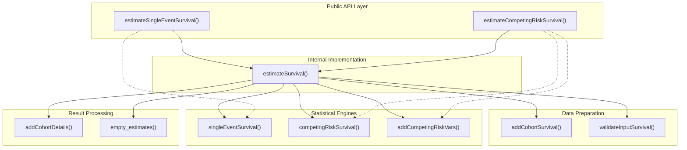
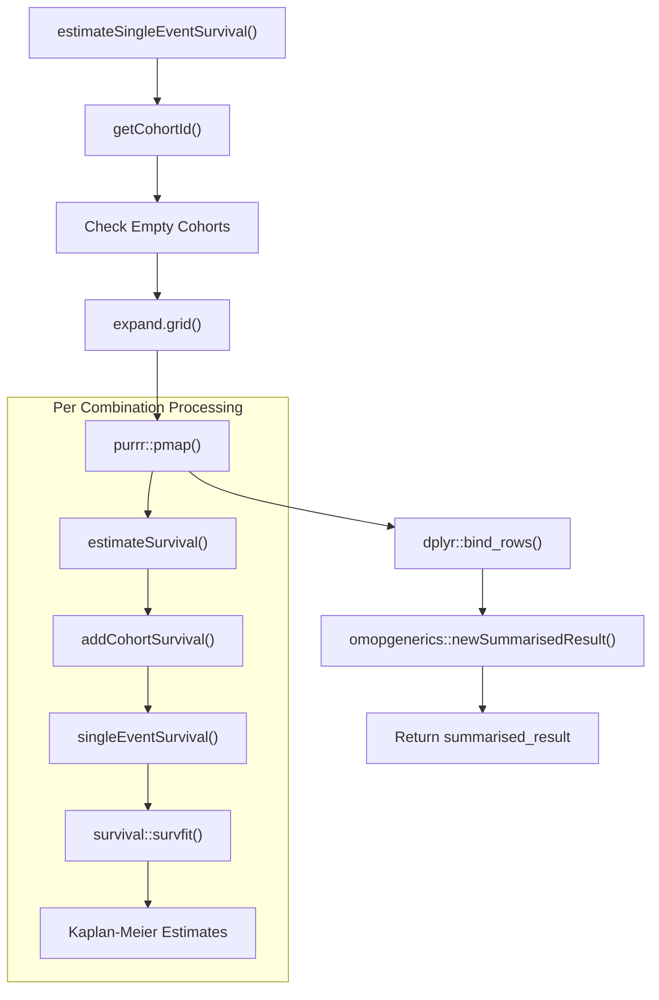
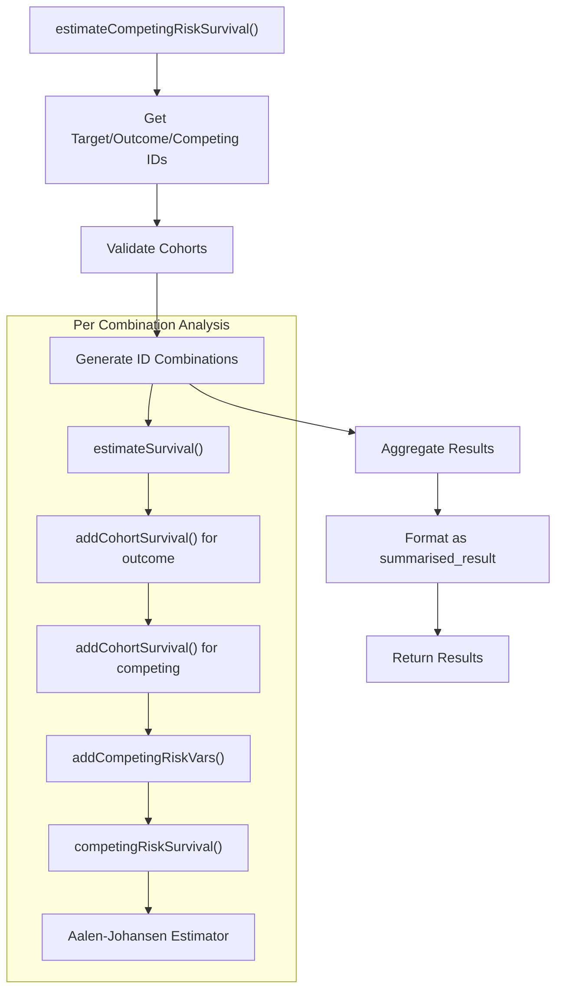
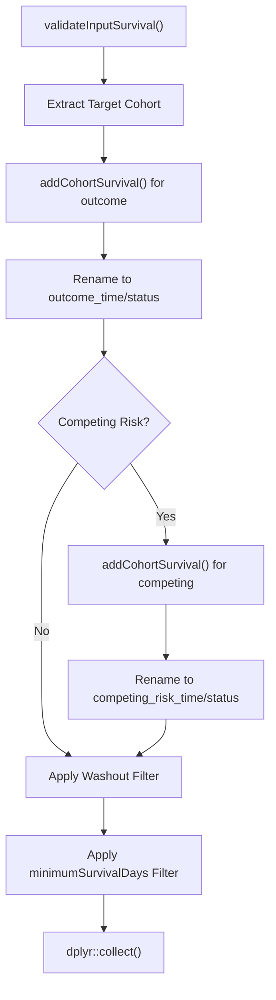

# Page: Core Survival Analysis Functions

# Core Survival Analysis Functions

Relevant source files

The following files were used as context for generating this wiki page:

- [R/estimateSurvival.R](R/estimateSurvival.R)
- [man/estimateCompetingRiskSurvival.Rd](man/estimateCompetingRiskSurvival.Rd)
- [man/estimateSingleEventSurvival.Rd](man/estimateSingleEventSurvival.Rd)
- [tests/testthat/test-estimateSurvival.R](tests/testthat/test-estimateSurvival.R)

This document covers the primary survival estimation functions that form the analytical engine of the CohortSurvival package. These functions transform OMOP CDM cohort data into standardized survival analysis results using established statistical methods.

For information about data preparation before survival analysis, see [Data Preparation with addCohortSurvival](#2.3). For result processing and formatting after analysis, see [Result Processing and Formatting](#3).

## Function Architecture Overview

The core survival analysis functions follow a layered architecture with two public interfaces and one internal implementation function:

**Sources:** [R/estimateSurvival.R:65-372](), [R/estimateSurvival.R:429-768](), [R/estimateSurvival.R:771-1048]()

## Function Signatures and Parameters

The survival estimation functions share common parameter structures while having specific requirements for their analysis types:

| Parameter | Single Event | Competing Risk | Description |
|-----------|--------------|----------------|-------------|
| `cdm` | ✓ | ✓ | CDM reference object |
| `targetCohortTable` | ✓ | ✓ | Target cohort table name |
| `outcomeCohortTable` | ✓ | ✓ | Primary outcome cohort table |
| `competingOutcomeCohortTable` | ✗ | ✓ | Competing outcome cohort table |
| `targetCohortId` | ✓ | ✓ | Target cohort IDs (NULL = all) |
| `outcomeCohortId` | ✓ | ✓ | Outcome cohort IDs (NULL = all) |
| `competingOutcomeCohortId` | ✗ | ✓ | Competing outcome IDs (NULL = all) |
| `outcomeDateVariable` | ✓ | ✓ | Date column for outcome events |
| `competingOutcomeDateVariable` | ✗ | ✓ | Date column for competing events |
| `outcomeWashout` | ✓ | ✓ | Washout period in days |
| `competingOutcomeWashout` | ✗ | ✓ | Competing outcome washout |
| `censorOnCohortExit` | ✓ | ✓ | Censor at cohort end date |
| `censorOnDate` | ✓ | ✓ | Fixed censoring date |
| `followUpDays` | ✓ | ✓ | Maximum follow-up duration |
| `strata` | ✓ | ✓ | Stratification variables |
| `eventGap` | ✓ | ✓ | Event reporting intervals |
| `estimateGap` | ✓ | ✓ | Estimate reporting intervals |
| `restrictedMeanFollowUp` | ✓ | ✓ | Restricted mean survival time |
| `minimumSurvivalDays` | ✓ | ✓ | Minimum survival requirement |

**Sources:** [R/estimateSurvival.R:65-79](), [R/estimateSurvival.R:429-447]()

## Single Event Survival Analysis

The `estimateSingleEventSurvival` function performs traditional time-to-event analysis using Kaplan-Meier estimation. It handles scenarios where individuals experience a single type of outcome event or are censored.

### Function Processing Flow

### Key Processing Steps

1. **Cohort ID Resolution**: The function resolves target and outcome cohort IDs if not explicitly provided [R/estimateSurvival.R:81-86]()

2. **Empty Cohort Handling**: Identifies and warns about empty cohorts, removing them from analysis [R/estimateSurvival.R:92-113]()

3. **Combination Processing**: Uses `expand.grid` and `purrr::pmap` to process all combinations of target and outcome cohorts [R/estimateSurvival.R:115-161]()

4. **Statistical Analysis**: Delegates to `estimateSurvival` which calls `singleEventSurvival` for Kaplan-Meier estimation [R/estimateSurvival.R:130-149]()

5. **Result Standardization**: Transforms results into `omopgenerics::summarised_result` format [R/estimateSurvival.R:313-314]()

**Sources:** [R/estimateSurvival.R:65-372]()

## Competing Risk Survival Analysis

The `estimateCompetingRiskSurvival` function extends survival analysis to scenarios where multiple mutually exclusive events can occur. It uses cumulative incidence functions rather than Kaplan-Meier estimation.

### Competing Risk Processing Pipeline

### Competing Risk Variables

The function creates additional variables to handle competing events using `addCompetingRiskVars`:

- **Combined Time**: `pmin(outcome_time, competing_risk_time)` [R/estimateSurvival.R:1056]()
- **Combined Status**: Factor encoding (0=censored, 1=outcome, 2=competing) [R/estimateSurvival.R:1057]()

The status encoding logic uses: `factor(if_else(competing_time <= outcome_time, 2 * competing_status, outcome_status))` [R/estimateSurvival.R:1057]()

**Sources:** [R/estimateSurvival.R:429-768](), [R/estimateSurvival.R:1050-1059]()

## Internal Estimation Pipeline

The core `estimateSurvival` function implements the shared processing logic for both single event and competing risk analyses:

### Data Preparation Phase

### Statistical Analysis Phase

The function then branches based on analysis type:

1. **Single Event Path**: Calls `singleEventSurvival` which uses `survival::survfit(Surv(outcome_time, outcome_status) ~ strata)` [R/estimateSurvival.R:1069-1071]()

2. **Competing Risk Path**: Calls `competingRiskSurvival` which adds competing risk variables and uses cumulative incidence estimation [R/estimateSurvival.R:877]()

### Result Attributes

The function attaches multiple attributes to the returned estimates:

- **`events`**: Event counts and risk set sizes at specified intervals [R/estimateSurvival.R:915-944]()
- **`summary`**: Summary statistics including median survival and restricted mean [R/estimateSurvival.R:947-1037]()
- **`cohort_attrition`**: Cohort attrition information tracking exclusions [R/estimateSurvival.R:945]()

**Sources:** [R/estimateSurvival.R:771-1048]()

## Error Handling and Edge Cases

The functions implement comprehensive error handling for common edge cases:

### Empty Cohort Handling

When cohorts contain no records, the functions:

1. Issue warnings using `cli::cli_warn` [R/estimateSurvival.R:98-100]()
2. Remove empty cohort IDs from processing [R/estimateSurvival.R:112]()
3. Return appropriate empty results if no valid combinations remain [R/estimateSurvival.R:366-369]()

### No Survivors Edge Case

When no individuals survive past `minimumSurvivalDays`, the function:

1. Issues specific warnings about unavailable individuals [R/estimateSurvival.R:859-867]()
2. Returns `empty_estimates()` with preserved attrition information [R/estimateSurvival.R:868-870]()

### Result Processing

Both functions implement identical result processing logic:

1. Combine estimates, events, and summary data [R/estimateSurvival.R:176-179]()
2. Clean and standardize attrition data [R/estimateSurvival.R:182-220]()  
3. Create settings metadata [R/estimateSurvival.R:224-276]()
4. Generate `omopgenerics::summarised_result` object [R/estimateSurvival.R:313-314]()

**Sources:** [R/estimateSurvival.R:92-113](), [R/estimateSurvival.R:846-871](), [R/estimateSurvival.R:176-314]()