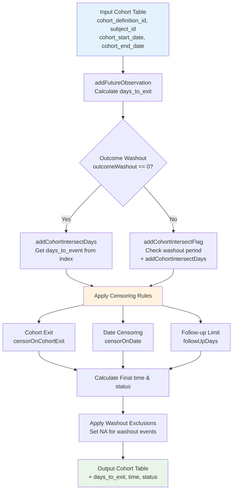
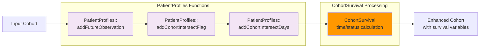
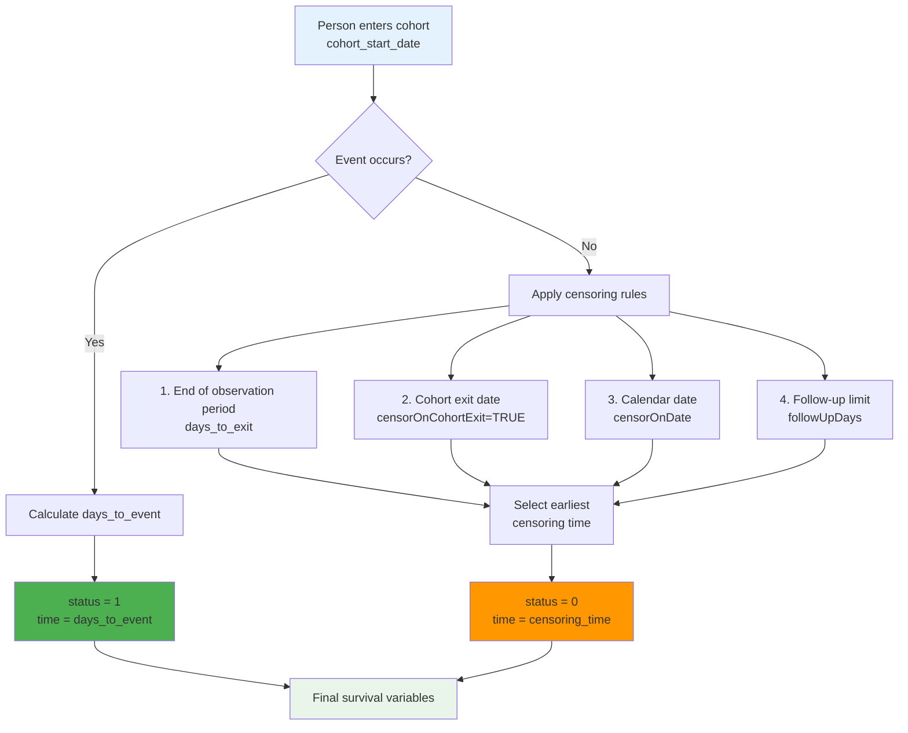
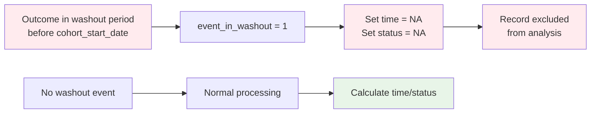
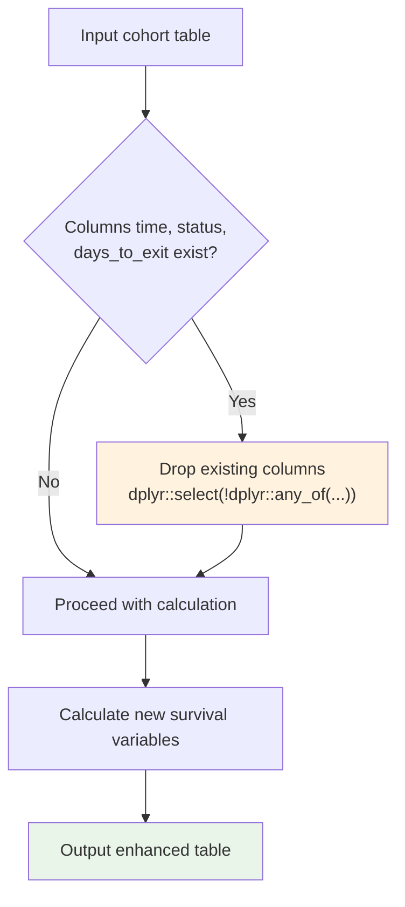
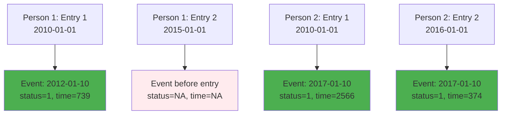

# Page: Data Preparation with addCohortSurvival

# Data Preparation with addCohortSurvival

<details>
<summary>Relevant source files</summary>

The following files were used as context for generating this wiki page:

- [NAMESPACE](NAMESPACE)
- [R/addCohortSurvival.R](R/addCohortSurvival.R)
- [man/addCohortSurvival.Rd](man/addCohortSurvival.Rd)
- [tests/testthat/test-addCohortSurvival.R](tests/testthat/test-addCohortSurvival.R)
- [vignettes/a02_Competing_risk_survival.Rmd](vignettes/a02_Competing_risk_survival.Rmd)

</details>


## Purpose and Scope

The `addCohortSurvival` function transforms OMOP CDM cohort tables into survival analysis-ready datasets by calculating time-to-event and censoring status for each cohort record. This function serves as the foundational data preparation step that precedes survival analysis estimation. For information about performing survival analysis using the prepared data, see [Single Event Survival Estimation](#2.1) and [Competing Risk Survival Estimation](#2.2).

The function enriches cohort tables with standardized survival analysis columns (`time`, `status`, `days_to_exit`) that can be consumed by downstream survival estimation functions or external survival analysis packages.

## Function Overview and Data Flow

The `addCohortSurvival` function implements a comprehensive time-to-event calculation pipeline that handles multiple censoring scenarios and outcome linkage patterns.

### Core Data Transformation Process



**Data Transformation Process**: The function systematically processes cohort data through observation period calculation, outcome linkage, censoring application, and final survival variable generation.

Sources: [R/addCohortSurvival.R:51-219](), [R/addCohortSurvival.R:82-86](), [R/addCohortSurvival.R:179-185]()

### PatientProfiles Integration



**PatientProfiles Integration**: The function leverages PatientProfiles package functions for core OMOP CDM data operations, then applies CohortSurvival-specific survival analysis transformations.

Sources: [R/addCohortSurvival.R:82-86](), [R/addCohortSurvival.R:92-118]()

## Core Parameters and Configuration

### Essential Parameters

| Parameter | Type | Default | Purpose |
|-----------|------|---------|---------|
| `x` | cohort_table | required | Target cohort table to enhance |
| `cdm` | cdm_reference | required | CDM database connection |
| `outcomeCohortTable` | character | required | Name of outcome cohort table |
| `outcomeCohortId` | numeric | 1 | Specific outcome cohort ID |
| `outcomeDateVariable` | character | "cohort_start_date" | Date column to use for outcome |

### Censoring and Follow-up Controls

| Parameter | Type | Default | Purpose |
|-----------|------|---------|---------|
| `censorOnCohortExit` | logical | FALSE | Censor at cohort_end_date |
| `censorOnDate` | Date | NULL | Censor at specific calendar date |
| `followUpDays` | numeric | Inf | Maximum follow-up duration |
| `outcomeWashout` | numeric | Inf | Washout period before cohort_start_date |

Sources: [man/addCohortSurvival.Rd:6-18](), [R/addCohortSurvival.R:51-60]()

## Censoring Mechanisms

The function implements multiple censoring strategies that can be applied simultaneously, with the earliest censoring event taking precedence.

### Censoring Priority Hierarchy



**Censoring Hierarchy**: Multiple censoring mechanisms operate in parallel, with the earliest event determining the final time and status values.

Sources: [R/addCohortSurvival.R:120-127](), [R/addCohortSurvival.R:128-142](), [R/addCohortSurvival.R:144-160]()

### Washout Period Handling



**Washout Exclusion**: Records with outcome events during the washout period are retained in the dataset but marked with NA values to exclude them from survival analysis.

Sources: [R/addCohortSurvival.R:188-200](), [R/addCohortSurvival.R:101-118]()

## Output Format and Variables

### Added Columns

The function adds three key columns to the input cohort table:

| Column | Type | Description | Values |
|--------|------|-------------|---------|
| `days_to_exit` | numeric | Days from cohort_start_date to end of observation/censoring | Positive integer or Inf |
| `time` | numeric | Days to event (if status=1) or censoring (if status=0) | Positive integer or NA |
| `status` | integer | Event indicator | 1 = event occurred, 0 = censored, NA = excluded |

### Column Overwriting Behavior



**Column Management**: Existing survival-related columns are automatically removed before recalculation, allowing the function to be re-run on previously processed tables.

Sources: [R/addCohortSurvival.R:75-79](), [tests/testthat/test-addCohortSurvival.R:683-768]()

## Common Usage Patterns

### Basic Event Analysis

```r
# Simple time-to-death analysis
cdm$target_cohort <- cdm$target_cohort %>%
  addCohortSurvival(
    cdm = cdm,
    outcomeCohortTable = "death_cohort",
    outcomeCohortId = 1
  )
```

### Competing Risk Preparation

```r
# Prepare for competing risk analysis
cdm$drug_cohort <- cdm$drug_cohort %>%
  addCohortSurvival(
    cdm = cdm,
    outcomeCohortTable = "primary_outcome",
    outcomeCohortId = 1
  ) %>%
  addCohortSurvival(
    cdm = cdm,
    outcomeCohortTable = "competing_outcome", 
    outcomeCohortId = 1,
    name = "drug_cohort_prepared"
  )
```

### Limited Follow-up Analysis

```r
# 30-day outcome analysis with cohort exit censoring
cdm$exposure_cohort <- cdm$exposure_cohort %>%
  addCohortSurvival(
    cdm = cdm,
    outcomeCohortTable = "adverse_event",
    followUpDays = 30,
    censorOnCohortExit = TRUE
  )
```

Sources: [tests/testthat/test-addCohortSurvival.R:63-68](), [tests/testthat/test-addCohortSurvival.R:450-466](), [vignettes/a02_Competing_risk_survival.Rmd:154-159]()

### Multiple Records Per Person Handling

The function correctly processes cohort tables with multiple records per person, calculating survival variables independently for each cohort entry:



**Multiple Records**: Each cohort entry is processed independently, with events linked to the appropriate time windows relative to each entry's cohort_start_date.

Sources: [tests/testthat/test-addCohortSurvival.R:770-878]()