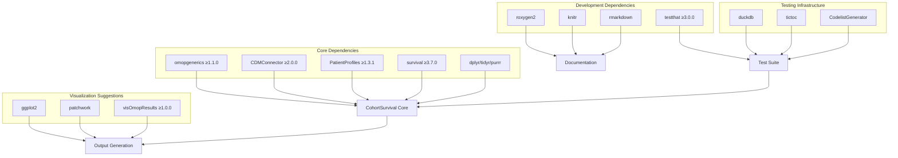
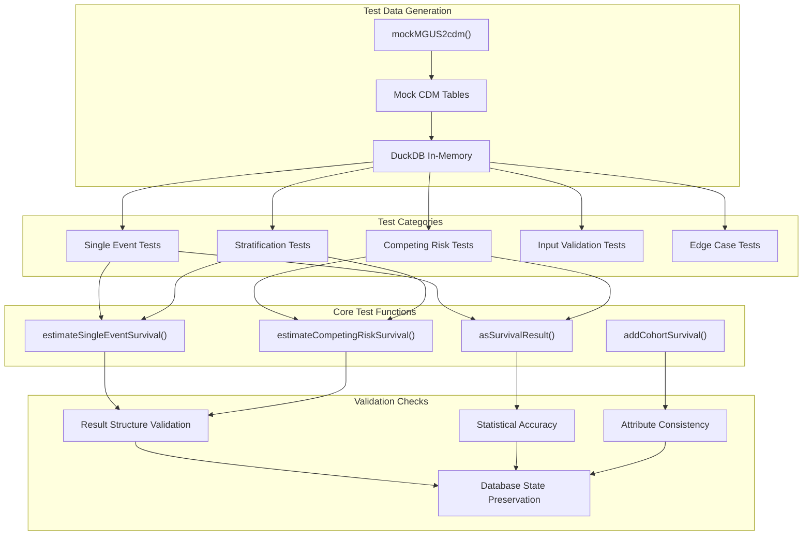
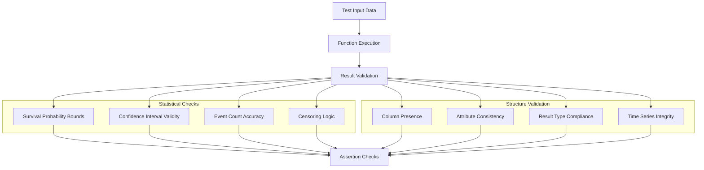
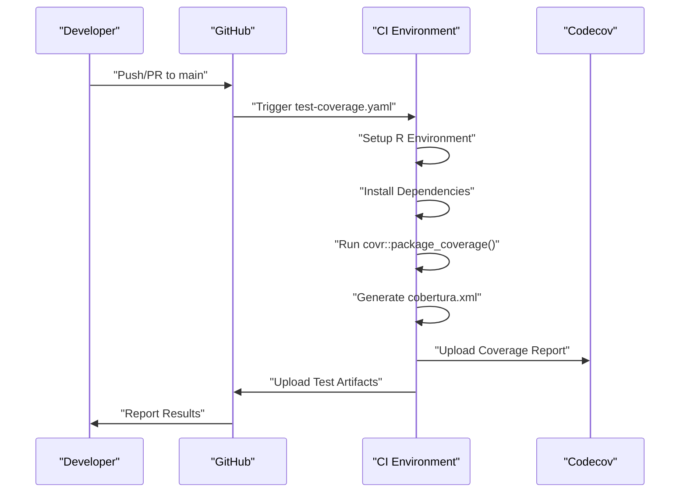
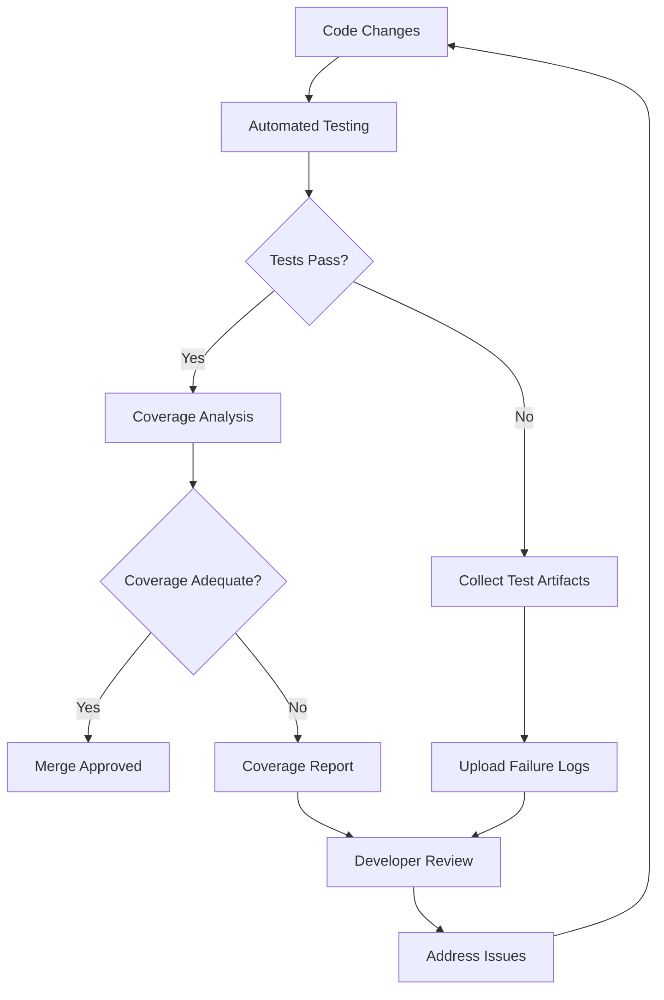
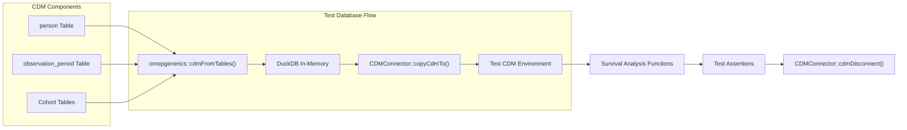
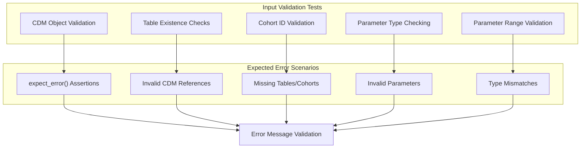

# Page: Development and Testing

# Development and Testing

Relevant source files

The following files were used as context for generating this wiki page:

- [.github/workflows/test-coverage.yaml](.github/workflows/test-coverage.yaml)
- [DESCRIPTION](DESCRIPTION)
- [tests/testthat/test-estimateSurvival.R](tests/testthat/test-estimateSurvival.R)

This page covers the development infrastructure, testing framework, and quality assurance processes for the CohortSurvival package. It provides technical guidance for contributors and maintainers working on package development, testing, and continuous integration workflows.

For information about using the package's core functionality, see [Core Survival Analysis Functions](#2). For testing-specific reference documentation, see [Testing Framework](#7.1).

## Package Development Structure

The CohortSurvival package follows standard R package development conventions with specific configurations for survival analysis in the OMOP ecosystem. The package structure emphasizes robust dependency management and comprehensive testing infrastructure.

### Development Dependencies and Configuration

The package maintains a clear separation between core dependencies and development/testing tools:

**Development Configuration Structure**

Sources: [DESCRIPTION:28-64]()

The package uses testthat edition 3 with parallel testing enabled for improved performance. Key development configurations include:

| Configuration | Value | Purpose |
|---------------|-------|---------|
| `Config/testthat/edition` | 3 | Modern testthat framework |
| `Config/testthat/parallel` | true | Parallel test execution |
| `VignetteBuilder` | knitr | Documentation generation |
| `Roxygen` | list(markdown = TRUE) | Markdown documentation support |

Sources: [DESCRIPTION:62-64]()

## Testing Framework Architecture

The testing infrastructure provides comprehensive coverage of survival analysis functionality through mock data generation, database testing, and statistical validation.

### Test Organization and Mock Data System

**Mock Data Generation System**

Sources: [tests/testthat/test-estimateSurvival.R:8-83]()

The testing framework relies on `mockMGUS2cdm()` to generate realistic survival analysis datasets. This function creates a complete CDM environment with:

- Target cohorts (`mgus_diagnosis`)
- Outcome cohorts (`death_cohort`, `progression`) 
- Competing outcome cohorts for complex scenarios
- Realistic temporal relationships and survival patterns

### Test Coverage Categories

The test suite covers comprehensive scenarios across survival analysis functionality:

| Test Category | Function Coverage | Validation Focus |
|---------------|-------------------|------------------|
| **Basic Functionality** | `estimateSingleEventSurvival()` | Core survival estimation |
| **Competing Risks** | `estimateCompetingRiskSurvival()` | Multiple outcome handling |
| **Stratification** | Both functions with `strata` parameter | Subgroup analysis |
| **Multiple Cohorts** | Multiple target/outcome IDs | Batch processing |
| **Edge Cases** | Empty cohorts, no outcomes | Error handling |
| **Database Integrity** | CDM table preservation | State management |

Sources: [tests/testthat/test-estimateSurvival.R:85-196](), [tests/testthat/test-estimateSurvival.R:364-576]()

### Statistical Validation Framework

**Example Statistical Validation Pattern**

Sources: [tests/testthat/test-estimateSurvival.R:27-38](), [tests/testthat/test-estimateSurvival.R:821-833]()

The testing framework validates statistical accuracy through assertions like:
- Survival probability bounds (0 ≤ S(t) ≤ 1)
- Confidence interval consistency
- Event count verification against input data
- Time series monotonicity for cumulative functions

## CI/CD Development Workflow

The package implements automated quality assurance through GitHub Actions workflows that ensure code quality, test coverage, and integration reliability.

### Test Coverage Workflow Architecture

**Coverage Workflow Configuration**

Sources: [.github/workflows/test-coverage.yaml:1-62]()

The test coverage workflow executes on every push and pull request to main branches, providing comprehensive quality metrics:

| Workflow Step | Purpose | Configuration |
|---------------|---------|---------------|
| **Environment Setup** | R environment preparation | `r-lib/actions/setup-r@v2` |
| **Dependency Installation** | Package dependencies | `extra-packages: any::covr, any::xml2` |
| **Coverage Generation** | Test coverage analysis | `covr::package_coverage()` |
| **Report Upload** | Coverage reporting | Codecov integration |
| **Artifact Collection** | Failure diagnostics | Test output preservation |

### Quality Gates and Failure Handling

**Failure Diagnostics and Artifact Collection**

Sources: [.github/workflows/test-coverage.yaml:49-61]()

The workflow includes comprehensive failure handling:
- Automatic test output collection (`testthat.Rout*` files)
- Coverage failure artifact upload
- Conditional CI failure based on event type (stricter for main branch)

## Development Environment Setup

### Database Testing Infrastructure

The testing framework uses DuckDB for in-memory database testing, providing realistic CDM environments without external dependencies:

**Database Connection Pattern**

Sources: [tests/testthat/test-estimateSurvival.R:260-278](), [tests/testthat/test-estimateSurvival.R:804-811]()

Standard test database setup follows this pattern:
1. Create tables with `omopgenerics::cdmFromTables()`
2. Establish DuckDB connection with `DBI::dbConnect(duckdb::duckdb(), ":memory:")`
3. Copy CDM to database with `CDMConnector::copyCdmTo()`
4. Set schema attributes for write operations
5. Execute tests and disconnect with `CDMConnector::cdmDisconnect()`

### Error Handling and Input Validation Testing

**Input Validation Test Examples**

Sources: [tests/testthat/test-estimateSurvival.R:1382-1402]()

The package includes comprehensive input validation testing for scenarios such as:
- Invalid CDM object types
- Non-existent table references
- Invalid cohort ID ranges
- Incorrect parameter types and values
- Missing required parameters

## Package Maintenance Guidelines

### Test Development Standards

When developing new functionality, tests must follow established patterns:

1. **Mock Data Usage**: Use `mockMGUS2cdm()` or create equivalent mock environments
2. **Database Cleanup**: Always disconnect CDM connections with `CDMConnector::cdmDisconnect()`
3. **Statistical Validation**: Verify mathematical properties of survival estimates
4. **Attribute Testing**: Validate result object attributes and structure
5. **Edge Case Coverage**: Test empty cohorts, no outcomes, and boundary conditions

### Continuous Integration Best Practices

The package maintains high quality standards through:

- **Parallel Testing**: Enabled for faster CI execution
- **Coverage Reporting**: Codecov integration for transparency
- **Artifact Collection**: Comprehensive failure diagnostics
- **Branch Protection**: Stricter requirements for main branch merges

Sources: [DESCRIPTION:62-63](), [.github/workflows/test-coverage.yaml:14-47]()

This development and testing infrastructure ensures reliable, well-tested survival analysis functionality within the OMOP CDM ecosystem while maintaining compatibility with the broader R statistical computing environment.