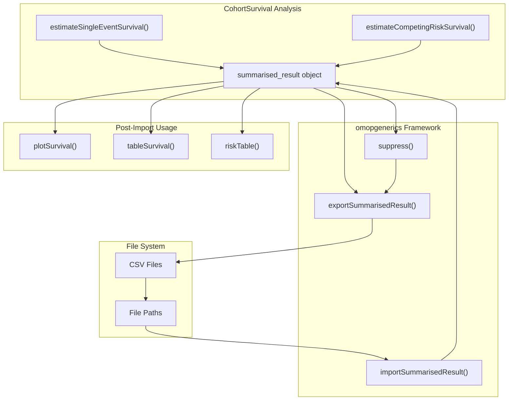
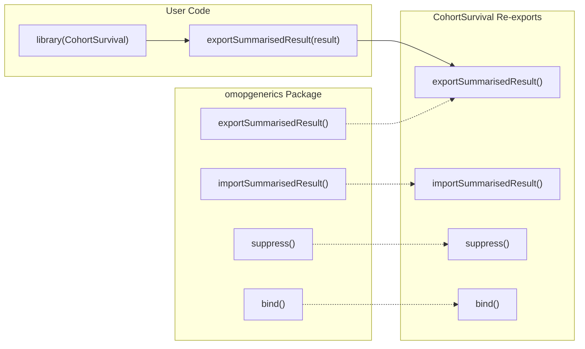
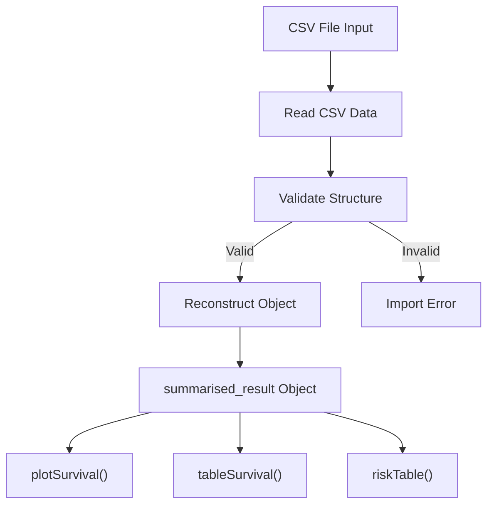
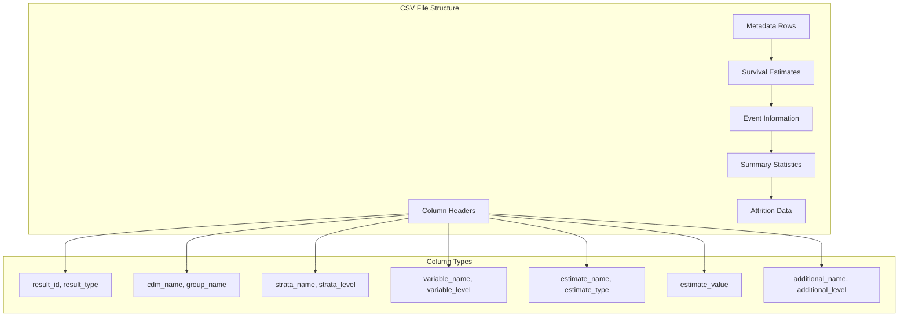
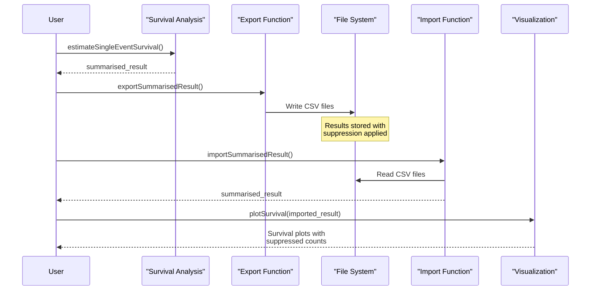

# Page: Export and Import Functions

# Export and Import Functions

<details>
<summary>Relevant source files</summary>

The following files were used as context for generating this wiki page:

- [.Rbuildignore](.Rbuildignore)
- [man/reexports.Rd](man/reexports.Rd)
- [tests/testthat/test-reexports-omopgenerics.R](tests/testthat/test-reexports-omopgenerics.R)
- [vignettes/a01_Single_event_of_interest.Rmd](vignettes/a01_Single_event_of_interest.Rmd)

</details>


This page documents the export and import functionality for persisting and sharing survival analysis results from the CohortSurvival package. These functions enable researchers to save survival analysis outputs to files and reload them for further analysis, visualization, or sharing with collaborators.

The export and import functions are re-exported from the `omopgenerics` package, ensuring consistency with the broader OMOP ecosystem. For information about generating survival analysis results, see [Core Survival Analysis Functions](#2). For details about result formatting and standardization, see [SurvivalResult Objects](#3.1).

## Export and Import System Overview

The CohortSurvival package leverages the standardized export/import framework from `omopgenerics` to persist `summarised_result` objects containing survival analysis outputs. This system ensures that all survival estimates, events, summaries, and attrition information are preserved during the export/import process.



**Export/Import Data Flow**

Sources: [vignettes/a01_Single_event_of_interest.Rmd:332-359](), [tests/testthat/test-reexports-omopgenerics.R:15-20](), [man/reexports.Rd:12-13]()

## Function Re-exports from omopgenerics

CohortSurvival re-exports key data persistence functions from the `omopgenerics` package, providing direct access to standardized export/import capabilities without requiring users to load additional packages.



**Re-exported Function Architecture**

Sources: [man/reexports.Rd:12-13](), [R/reexport-omopgenerics.R]()

## Exporting Survival Results

The `exportSummarisedResult()` function saves survival analysis results to CSV format files. The function automatically handles the complex structure of `summarised_result` objects, preserving all survival estimates, event counts, summary statistics, and attrition information.

### Basic Export Usage

```r
# Export survival results to CSV
x <- tempdir()
exportSummarisedResult(MGUS_death, path = x, fileName = "result.csv")
```

### Export Parameters

| Parameter | Description | Default |
|-----------|-------------|---------|
| `x` | The `summarised_result` object to export | Required |
| `path` | Directory path for output files | Required |
| `fileName` | Base name for CSV files | `"summarised_result.csv"` |
| `minCellCount` | Minimum count threshold for suppression | `5` |

The export process creates structured CSV files that maintain the integrity of the original `summarised_result` object, including all metadata and settings information.

Sources: [vignettes/a01_Single_event_of_interest.Rmd:336-339](), [tests/testthat/test-reexports-omopgenerics.R:17]()

## Importing Survival Results

The `importSummarisedResult()` function reconstructs `summarised_result` objects from previously exported CSV files. The imported objects retain full compatibility with CohortSurvival visualization and table functions.

### Basic Import Usage

```r
# Import previously exported results
MGUS_death_imported <- importSummarisedResult(path = file.path(x, "result.csv"))
```

### Import Validation

The import process automatically validates the structure and content of imported results, ensuring they conform to `summarised_result` specifications:



**Import Validation Process**

Sources: [vignettes/a01_Single_event_of_interest.Rmd:342-343](), [tests/testthat/test-reexports-omopgenerics.R:18-20]()

## Data Suppression and Privacy Protection

The export function automatically applies data suppression to protect patient privacy by replacing small counts with `NA` values. This suppression occurs during export and affects visualizations of imported results.

### Suppression Mechanism

| Count Value | Export Behavior |
|-------------|-----------------|
| < `minCellCount` | Replaced with `NA` |
| ≥ `minCellCount` | Preserved as-is |

### Configuring Suppression

```r
# Export with custom suppression threshold
exportSummarisedResult(result, path = x, minCellCount = 10)

# Export with no suppression (use with caution)
exportSummarisedResult(result, path = x, minCellCount = 0)
```

### Impact on Visualizations

Suppressed results affect risk tables and event counts in plots, with suppressed values appearing as gaps or missing data points in visualizations.

Sources: [vignettes/a01_Single_event_of_interest.Rmd:347-351](), [tests/testthat/test-reexports-omopgenerics.R:26-36]()

## File Format and Structure

Exported survival results are stored in CSV format with a standardized structure that preserves all `summarised_result` components:



**CSV File Structure for Survival Results**

Sources: [tests/testthat/test-reexports-omopgenerics.R:17-20](), [vignettes/a01_Single_event_of_interest.Rmd:342-343]()

## Integration with Analysis Workflow

The export/import functions integrate seamlessly with the complete CohortSurvival analysis workflow, enabling persistent storage at any stage of the analysis process:



**Complete Export/Import Workflow**

### Post-Import Functionality

Imported survival results maintain full compatibility with all CohortSurvival functions:

- `plotSurvival()` generates survival curves with suppressed risk tables
- `tableSurvival()` produces summary statistics tables
- `riskTable()` displays numbers at risk with suppression applied
- `asSurvivalResult()` converts to survival-specific format

Sources: [vignettes/a01_Single_event_of_interest.Rmd:347-351](), [tests/testthat/test-reexports-omopgenerics.R:19]()