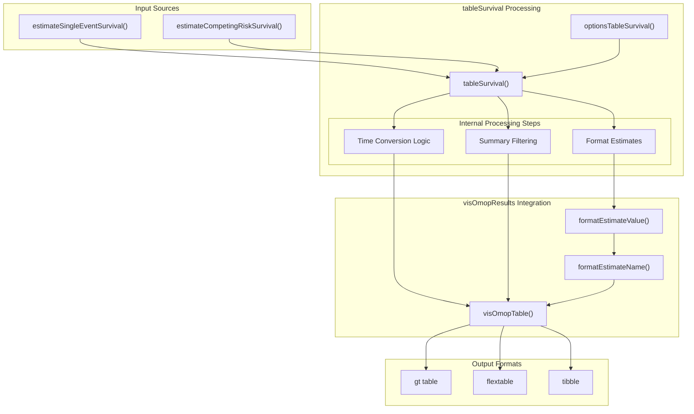
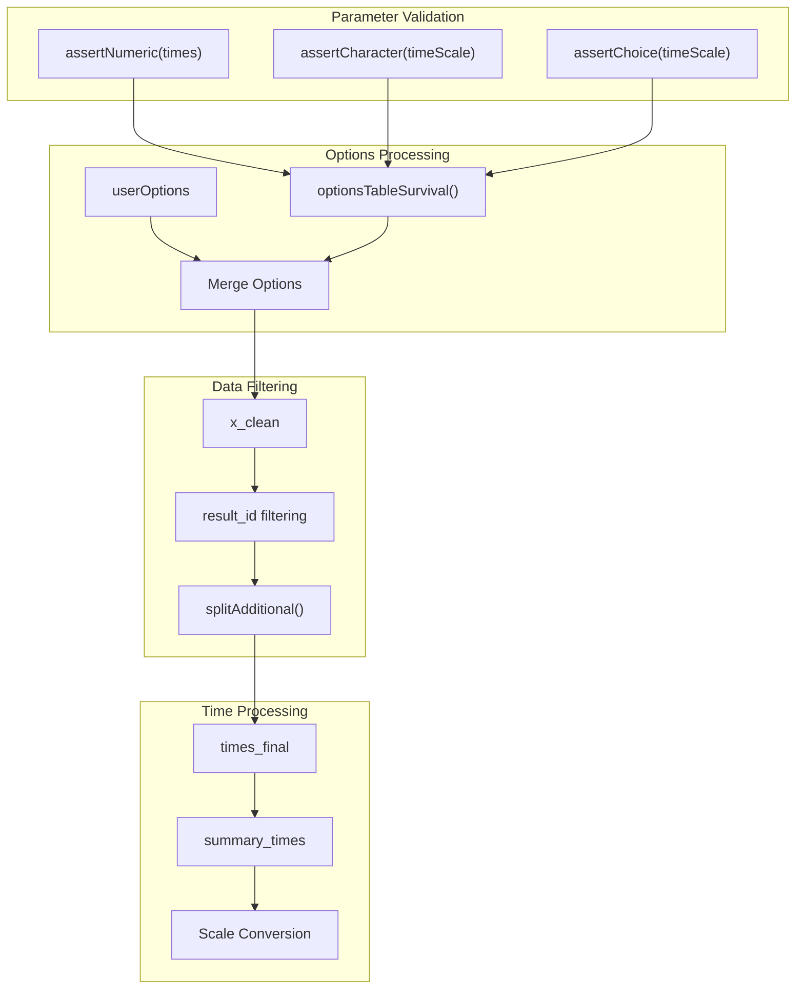
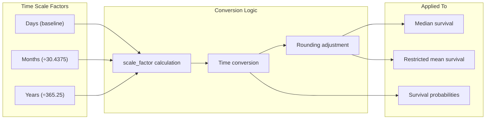
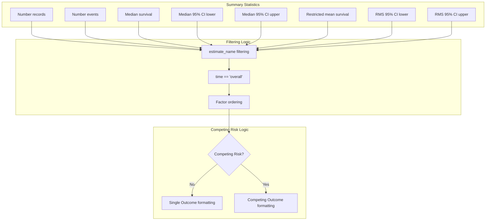
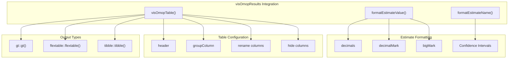
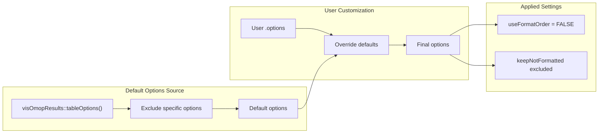

# Page: Generating Summary Tables

# Generating Summary Tables

Relevant source files

The following files were used as context for generating this wiki page:

- [R/tableSurvival.R](R/tableSurvival.R)
- [tests/testthat/test-tableSurvival.R](tests/testthat/test-tableSurvival.R)

This document covers the generation of formatted summary tables from survival analysis results using the `tableSurvival()` function. Summary tables provide key survival statistics including median survival times, restricted mean survival, event counts, and survival probabilities at specified time points. For information about plotting survival curves, see [Plotting Survival Curves](#4.1). For risk tables showing numbers at risk over time, see [Risk Tables and Event Counts](#4.3).

## Function Overview

The `tableSurvival()` function transforms survival analysis results into formatted summary tables suitable for publication or reporting. It processes results from both single-event and competing-risk survival analyses, providing flexibility in time scales, output formats, and statistical presentations.

**Summary Table Generation Flow**

Sources: [R/tableSurvival.R:18-276]()

## Core Parameters and Configuration

The `tableSurvival()` function accepts several key parameters that control the content and format of generated tables:

| Parameter | Type | Description | Default |
|-----------|------|-------------|---------|
| `x` | `summarised_result` | Survival analysis results | Required |
| `times` | `numeric` | Specific time points for survival estimates | `NULL` |
| `timeScale` | `character` | Time unit: "days", "months", "years" | `"days"` |
| `header` | `character` | Elements for table header | `c("estimate")` |
| `type` | `character` | Output format: "gt", "flextable", "tibble" | `"gt"` |
| `groupColumn` | `character` | Columns for group labels | `NULL` |
| `.options` | `list` | Additional formatting options | `list()` |

**Parameter Processing Pipeline**

Sources: [R/tableSurvival.R:44-65](), [R/tableSurvival.R:295-299]()

## Time Scale Conversion and Handling

The function supports three time scales with automatic conversion between them. Time conversion logic ensures proper scaling of survival times, median survival, and restricted mean survival values.

**Time Scale Conversion System**

The conversion handles edge cases where requested times don't exactly match available data points through rounding adjustments:

- Years: ±0.001 tolerance with 3 decimal places
- Months: ±0.01 tolerance with 2 decimal places  
- Days: Direct matching

Sources: [R/tableSurvival.R:79-131](), [R/tableSurvival.R:199-214]()

## Summary Statistics Processing

The function extracts and formats key survival statistics from the analysis results. Different statistics are handled based on whether the analysis involves competing risks.

**Summary Statistics Processing Flow**

Sources: [R/tableSurvival.R:168-257]()

## Output Format Integration

The function leverages `visOmopResults::visOmopTable()` for consistent formatting across different output types. The integration handles estimate name formatting, confidence intervals, and table structure.

**Output Format Integration Architecture**

The function creates specific estimate name formats:
- Single event: `"Median survival (95% CI)" = "<median_survival> (<median_survival_95CI_lower>, <median_survival_95CI_higher>)"`
- Competing risk: `"Restricted mean survival" = "<restricted_mean_survival>"`

Sources: [R/tableSurvival.R:145-165](), [R/tableSurvival.R:264-275]()

## Column Management and Display Logic

The function dynamically manages which columns to display, rename, or exclude based on the analysis type and user preferences.

| Analysis Type | Rename Columns | Exclude Columns |
|---------------|----------------|-----------------|
| Single Event | `"Outcome name" = "variable_level"` | `"result_id"`, `"estimate_type"`, `"variable_name"`, `"time"`, `"reason_id"`, `"reason"` |
| Competing Risk | `"Outcome type" = "variable_name"`, `"Outcome name" = "variable_level"` | `"time"`, `"reason_id"`, `"reason"` |

Sources: [R/tableSurvival.R:230-250]()

## Options and Customization

The `optionsTableSurvival()` function provides default formatting options that can be overridden through the `.options` parameter:

**Options Configuration System**

The function explicitly sets `useFormatOrder = FALSE` to maintain the factor ordering established during processing, ensuring statistics appear in the intended sequence.

Sources: [R/tableSurvival.R:295-299](), [R/tableSurvival.R:59-64](), [R/tableSurvival.R:272]()