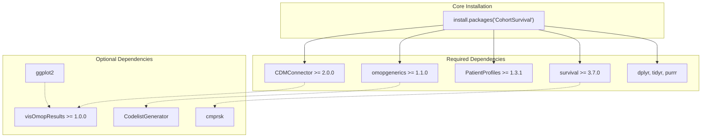
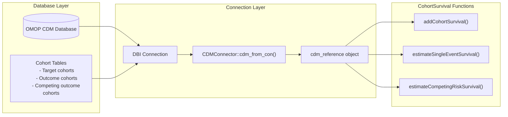
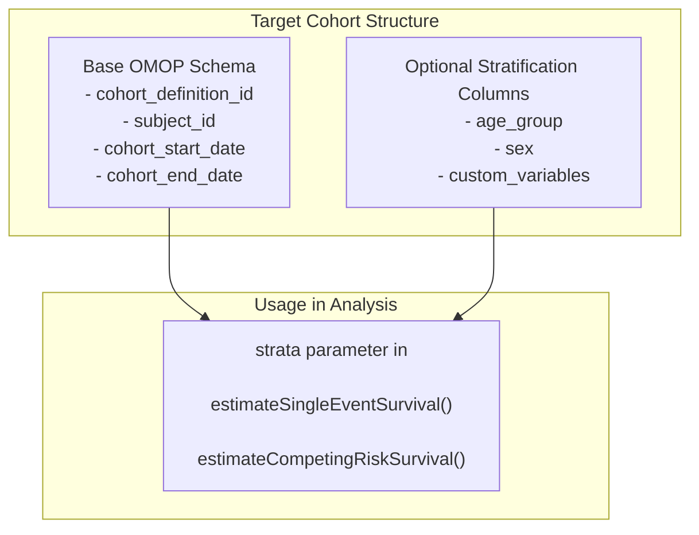
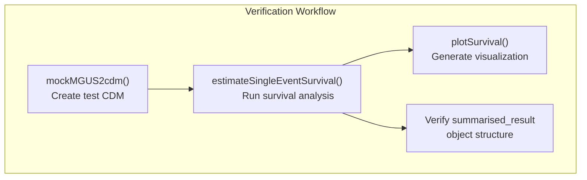

# Page: Installation and Setup

# Installation and Setup

<details>
<summary>Relevant source files</summary>

The following files were used as context for generating this wiki page:

- [DESCRIPTION](DESCRIPTION)
- [README.Rmd](README.Rmd)
- [README.md](README.md)

</details>


This document covers the installation of the CohortSurvival package and the initial setup required to perform survival analysis with OMOP CDM data. It includes package installation, dependency management, CDM connection configuration, and verification steps.

For detailed usage tutorials and analysis examples, see [Single Event Survival Analysis Tutorial](#5.1) and [Competing Risk Analysis Tutorial](#5.2). For comprehensive API documentation, see [API Reference](#6).

## Installation Methods

### CRAN Installation

CohortSurvival is available on CRAN and can be installed using the standard R package installation method:

```r
install.packages("CohortSurvival")
```

This installs the stable release version along with all required dependencies automatically.

### Development Installation

For the latest development version with cutting-edge features:

```r
# Install from GitHub (requires devtools)
devtools::install_github("darwin-eu/CohortSurvival")
```

**Sources:** [README.Rmd:27-29](), [DESCRIPTION:1-3]()

## Package Dependencies

### Required Dependencies

The following table summarizes the core dependencies that are automatically installed:

| Package | Minimum Version | Purpose |
|---------|----------------|---------|
| `CDMConnector` | ≥ 2.0.0 | Database interface for OMOP CDM |
| `omopgenerics` | ≥ 1.1.0 | Standard OMOP objects and methods |
| `PatientProfiles` | ≥ 1.3.1 | Patient data processing utilities |
| `survival` | ≥ 3.7.0 | Core survival analysis functions |
| `dplyr`, `tidyr`, `purrr` | Latest | Data manipulation framework |

### Optional Enhanced Functionality

| Package | Minimum Version | Enhanced Capability |
|---------|----------------|-------------------|
| `visOmopResults` | ≥ 1.0.0 | Advanced OMOP visualization |
| `ggplot2` | Latest | Custom plot generation |
| `cmprsk` | Latest | Competing risk analysis |
| `CodelistGenerator` | Latest | Cohort definition assistance |

**Installation Dependency Flow:**



**Sources:** [DESCRIPTION:28-46](), [DESCRIPTION:47-61]()

## CDM Connection Setup

### Database Connection Requirements

CohortSurvival requires a connection to an OMOP CDM database through `CDMConnector`. The database must contain properly structured cohort tables with the standard OMOP cohort schema.

**CDM Connection Architecture:**



### Basic CDM Connection

```r
library(CDMConnector)
library(CohortSurvival)

# Example connection setup
con <- DBI::dbConnect(duckdb::duckdb(), dbdir = "path/to/cdm.db")
cdm <- cdm_from_con(
  con = con,
  cdm_schema = "main",
  cohort_tables = c("target_cohort", "outcome_cohort")
)
```

### Mock Data Setup for Testing

For development and testing purposes, CohortSurvival provides the `mockMGUS2cdm()` function:

```r
# Create mock CDM with MGUS2 survival data
cdm <- CohortSurvival::mockMGUS2cdm()

# Verify cohort tables are available
names(cdm)
# Expected: "mgus_diagnosis", "progression", "death_cohort"
```

**Sources:** [README.Rmd:35-46](), [README.Rmd:39-69]()

## Required Cohort Table Structure

### Standard OMOP Cohort Schema

All cohort tables must follow the OMOP cohort table specification:

| Column | Type | Description |
|--------|------|-------------|
| `cohort_definition_id` | INTEGER | Identifier for cohort definition |
| `subject_id` | INTEGER | Person identifier from CDM |
| `cohort_start_date` | DATE | Entry date into cohort |
| `cohort_end_date` | DATE | Exit date from cohort |

### Target Cohort Extensions

Target cohorts may include additional stratification variables as columns:



**Example Target Cohort with Strata:**

```r
# Target cohort with stratification variables
cdm$mgus_diagnosis %>%
  glimpse()
# Columns: cohort_definition_id, subject_id, cohort_start_date, 
#          cohort_end_date, age, sex, age_group, ...
```

**Sources:** [README.Rmd:52-64](), [README.Rmd:96-99]()

## Installation Verification

### Package Loading Test

```r
# Verify package loads correctly
library(CohortSurvival)
library(CDMConnector)

# Check key functions are available
exists("estimateSingleEventSurvival")
exists("estimateCompetingRiskSurvival") 
exists("plotSurvival")
exists("mockMGUS2cdm")
```

### End-to-End Functionality Test



**Complete verification script:**

```r
# Create mock CDM data
cdm <- CohortSurvival::mockMGUS2cdm()

# Run basic survival analysis
result <- estimateSingleEventSurvival(
  cdm,
  targetCohortTable = "mgus_diagnosis",
  outcomeCohortTable = "death_cohort"
)

# Verify result structure
class(result)  # Should be "summarised_result"
nrow(result) > 0  # Should have results

# Test visualization
plot <- plotSurvival(result)
class(plot)  # Should be "ggplot"

# Clean up
cdmDisconnect(cdm)
```

**Sources:** [README.Rmd:75-88](), [README.Rmd:140-142]()

## Configuration and Environment Setup

### Database-Specific Considerations

Different database backends may require specific configuration:

| Database | R Package | Connection Notes |
|----------|-----------|------------------|
| DuckDB | `duckdb` | Local file-based, good for testing |
| PostgreSQL | `RPostgres` | Production OMOP databases |
| SQL Server | `odbc` | Windows environments |
| BigQuery | `bigrquery` | Cloud-based CDM |

### Memory and Performance Settings

For large CDM databases, configure appropriate settings:

```r
# Increase memory limits for large datasets
options(scipen = 999)  # Avoid scientific notation
options(dplyr.summarise.inform = FALSE)  # Reduce verbose output

# Configure CDMConnector for performance
cdm <- cdm_from_con(
  con = con,
  cdm_schema = "cdm",
  cohort_tables = cohort_tables,
  achilles_schema = "results"  # Optional: for data quality
)
```

**Sources:** [DESCRIPTION:30-46]()