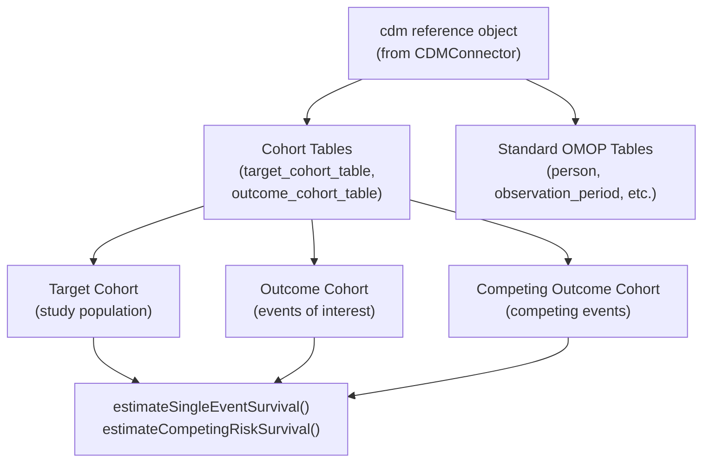
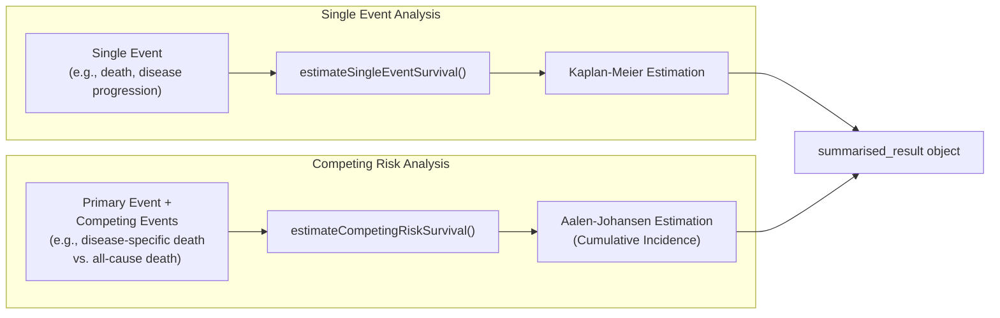
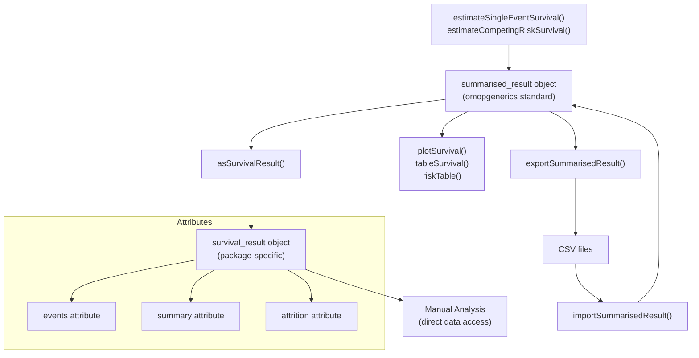
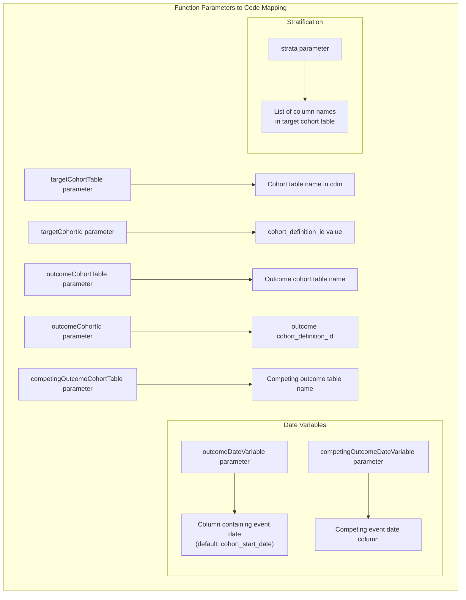
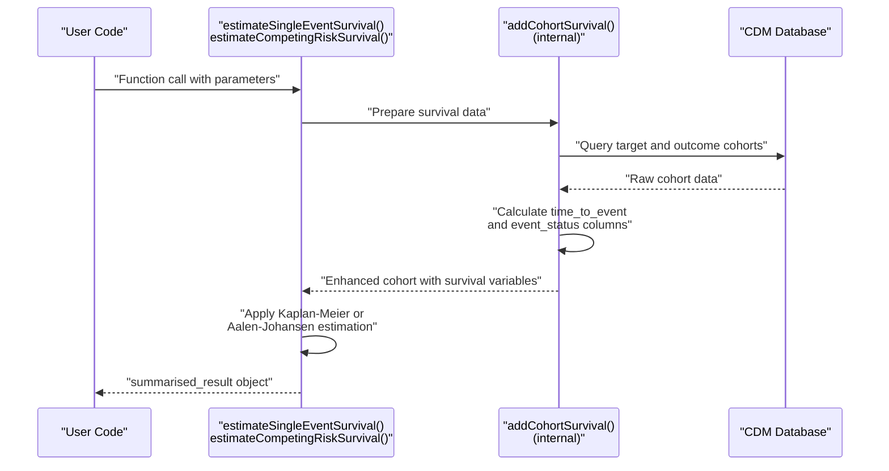

# Page: Key Concepts and Terminology

# Key Concepts and Terminology

Relevant source files

The following files were used as context for generating this wiki page:

- [DESCRIPTION](DESCRIPTION)
- [man/estimateCompetingRiskSurvival.Rd](man/estimateCompetingRiskSurvival.Rd)
- [man/estimateSingleEventSurvival.Rd](man/estimateSingleEventSurvival.Rd)
- [vignettes/a01_Single_event_of_interest.Rmd](vignettes/a01_Single_event_of_interest.Rmd)

This document explains the fundamental concepts, terminology, and data structures used in the CohortSurvival package. It serves as a foundation for understanding how survival analysis is performed within the OMOP Common Data Model ecosystem and how natural language concepts map to specific code entities and functions.

For practical implementation examples, see [Single Event Survival Analysis Tutorial](#5.1) and [Competing Risk Analysis Tutorial](#5.2). For detailed function specifications, see [API Reference](#6).

## OMOP CDM Foundation

The Observational Medical Outcomes Partnership (OMOP) Common Data Model provides the standardized framework that CohortSurvival operates within. Understanding these core concepts is essential for effective use of the package.

### CDM Reference Objects

The `cdm` object serves as the central connection point to OMOP CDM databases through the CDMConnector package. This object provides access to standardized tables containing patient data, observations, and cohort definitions.

**Sources:** [DESCRIPTION:28-46](), [vignettes/a01_Single_event_of_interest.Rmd:29-33]()

### Cohort Structure

Cohorts in CohortSurvival follow the OMOP cohort table standard with required columns `cohort_definition_id`, `subject_id`, `cohort_start_date`, and `cohort_end_date`. Additional stratification variables can be included as supplementary columns.

| Column | Purpose | Usage in Functions |
|--------|---------|-------------------|
| `cohort_definition_id` | Identifies cohort type | `targetCohortId`, `outcomeCohortId` parameters |
| `subject_id` | Patient identifier | Links to OMOP person table |
| `cohort_start_date` | Index date | Start of follow-up period |
| `cohort_end_date` | Exit date | End of follow-up (if `censorOnCohortExit = TRUE`) |
| Custom strata columns | Stratification variables | `strata` parameter in analysis functions |

**Sources:** [vignettes/a01_Single_event_of_interest.Rmd:43-49](), [man/estimateSingleEventSurvival.Rd:25-65]()

## Survival Analysis Concepts

### Time-to-Event Analysis Types

CohortSurvival supports two primary survival analysis paradigms, each implemented by specific functions:

**Sources:** [man/estimateSingleEventSurvival.Rd:5-6](), [man/estimateCompetingRiskSurvival.Rd:5-8]()

### Censoring Mechanisms

The package implements multiple censoring strategies through function parameters:

- **Administrative Censoring**: `followUpDays` parameter limits observation period
- **Date-Based Censoring**: `censorOnDate` parameter sets specific cutoff date  
- **Cohort Exit Censoring**: `censorOnCohortExit` parameter ends follow-up at cohort exit
- **Outcome Washout**: `outcomeWashout` parameter excludes prior events

**Sources:** [man/estimateSingleEventSurvival.Rd:40-47](), [vignettes/a01_Single_event_of_interest.Rmd:198-201]()

### Time Scales and Intervals

The package uses day-based time units with configurable aggregation intervals:

- **`eventGap`**: Days between survival event reporting intervals (default: 30)
- **`estimateGap`**: Days between survival estimate calculations (default: 1)
- **`minimumSurvivalDays`**: Minimum required survival time (default: 1)

**Sources:** [man/estimateSingleEventSurvival.Rd:52-64](), [vignettes/a01_Single_event_of_interest.Rmd:202-209]()

## Package Data Structures

### Result Object Hierarchy

CohortSurvival produces standardized result objects that integrate with the broader OMOP ecosystem:

**Sources:** [vignettes/a01_Single_event_of_interest.Rmd:169-183](), [vignettes/a01_Single_event_of_interest.Rmd:334-343]()

### Content Structure

The `summarised_result` object contains multiple result types accessible through omopgenerics functions:

| Result Type | Content | Access Method |
|-------------|---------|---------------|
| `estimates` | Survival probabilities and confidence intervals | `result_type == "estimates"` filter |
| `events` | Event counts and censoring information | `result_type == "events"` filter |
| `summary` | Median survival and restricted means | `result_type == "summary"` filter |
| `attrition` | Sample size and exclusion information | `result_type == "attrition"` filter |

**Sources:** [vignettes/a01_Single_event_of_interest.Rmd:72-76]()

## Key Parameters and Configuration

### Cohort Specification Parameters

**Sources:** [man/estimateSingleEventSurvival.Rd:25-50](), [man/estimateCompetingRiskSurvival.Rd:30-64]()

### Analytical Configuration

- **Washout Periods**: `outcomeWashout` and `competingOutcomeWashout` exclude individuals with prior events
- **Follow-up Limits**: `followUpDays` parameter caps observation time
- **Restricted Mean**: `restrictedMeanFollowUp` parameter calculates survival means over specified periods

**Sources:** [vignettes/a01_Single_event_of_interest.Rmd:198-201](), [vignettes/a01_Single_event_of_interest.Rmd:124-125]()

## Analysis Workflow Concepts

### Data Preparation Pipeline

The `addCohortSurvival()` function serves as the internal data preparation engine, though users typically interact with higher-level estimation functions:

**Sources:** [man/estimateSingleEventSurvival.Rd:1-24](), [man/estimateCompetingRiskSurvival.Rd:1-29]()

### Result Processing Workflow

The package supports flexible result handling through format conversion and persistence:

1. **Standard Format**: Results default to `summarised_result` for omopgenerics compatibility
2. **Survival Format**: `asSurvivalResult()` converts to survival-specific structure for manual analysis
3. **Persistence**: `exportSummarisedResult()` and `importSummarisedResult()` enable result sharing
4. **Visualization**: Multiple output functions operate on `summarised_result` objects

**Sources:** [vignettes/a01_Single_event_of_interest.Rmd:165-183](), [vignettes/a01_Single_event_of_interest.Rmd:334-350]()