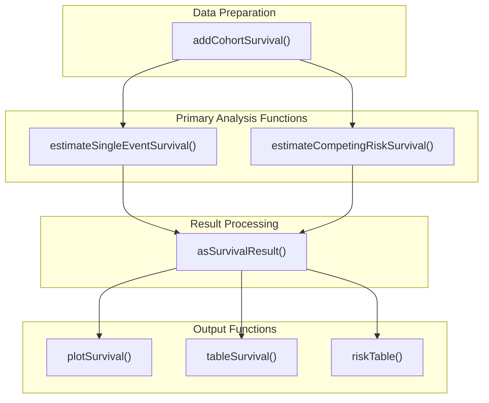
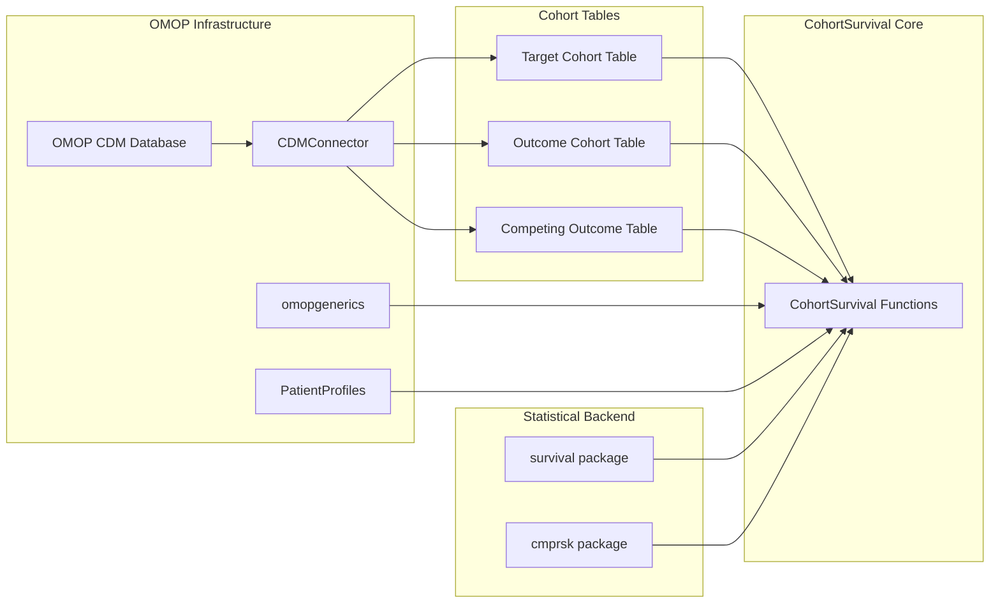
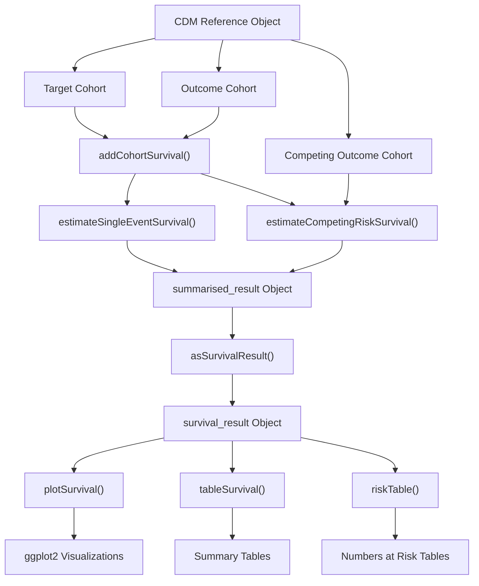
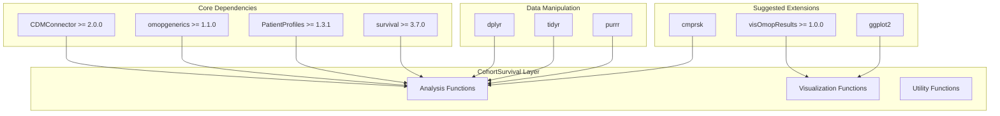
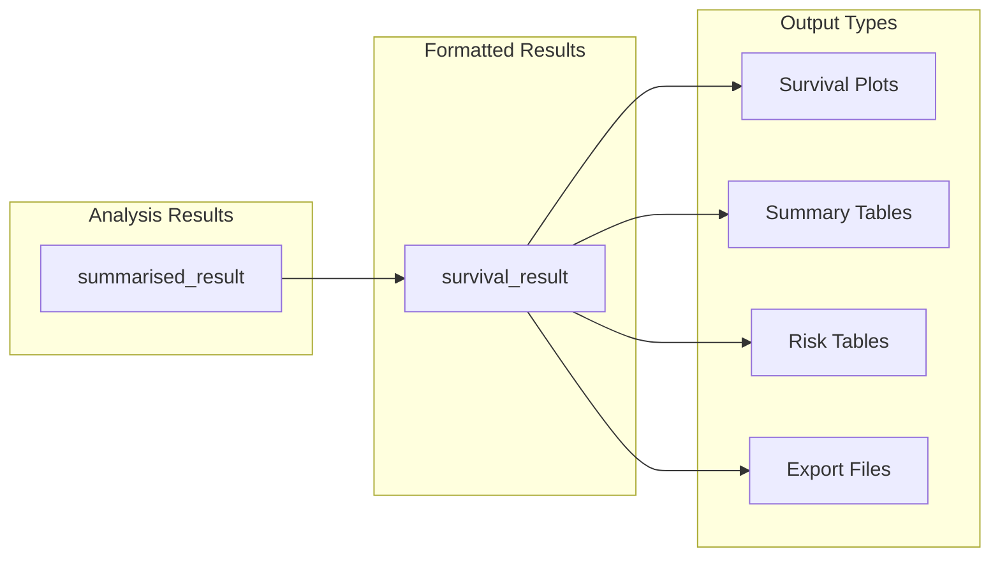

# Page: Overview

# Overview

Relevant source files

The following files were used as context for generating this wiki page:

- [DESCRIPTION](DESCRIPTION)
- [README.Rmd](README.Rmd)
- [README.md](README.md)
- [man/CohortSurvival-package.Rd](man/CohortSurvival-package.Rd)

## Purpose and Scope

This document provides a comprehensive overview of the CohortSurvival package, an R package designed for performing survival analysis on data structured according to the Observational Medical Outcomes Partnership (OMOP) Common Data Model (CDM). The package enables researchers to estimate survival probabilities, generate survival curves, and perform competing risk analyses using standardized cohort data.

For detailed installation instructions, see [Installation and Setup](#1.1). For step-by-step tutorials on performing specific analyses, see [User Guides and Examples](#5). For complete function documentation, see [API Reference](#6).

**Sources**: [DESCRIPTION:1-66](), [README.Rmd:17-22](), [man/CohortSurvival-package.Rd:7-11]()

## Core Functionality Overview

CohortSurvival provides a comprehensive suite of functions for survival analysis within the OMOP CDM ecosystem. The package transforms cohort data into survival estimates and visualizations through a structured pipeline.

### Main Analysis Functions

**Sources**: [README.Rmd:75-79](), [README.Rmd:110-115](), [README.Rmd:86-87]()

### Key Capabilities

| Function Category | Primary Functions | Purpose |
|-------------------|-------------------|---------|
| **Single Event Analysis** | `estimateSingleEventSurvival()` | Kaplan-Meier survival estimation for single outcomes |
| **Competing Risk Analysis** | `estimateCompetingRiskSurvival()` | Aalen-Johansen estimation for competing events |
| **Data Preparation** | `addCohortSurvival()` | Calculate time-to-event and censoring status |
| **Visualization** | `plotSurvival()` | Generate survival curves with confidence intervals |
| **Tabulation** | `tableSurvival()`, `riskTable()` | Summary statistics and risk tables |
| **Result Standardization** | `asSurvivalResult()` | Format results according to omopgenerics standards |

**Sources**: [README.Rmd:75-104](), [README.Rmd:110-136]()

## OMOP CDM Integration Architecture

CohortSurvival operates within the broader OMOP ecosystem, leveraging standardized data structures and interfaces for seamless integration with other OMOP tools.

### OMOP Ecosystem Dependencies

**Sources**: [DESCRIPTION:28-46](), [README.Rmd:35-45]()

### Required Cohort Structure

The package expects cohort tables following OMOP CDM standards with specific columns:

| Table Type | Required Columns | Purpose |
|------------|------------------|---------|
| **Target Cohort** | `cohort_definition_id`, `subject_id`, `cohort_start_date`, `cohort_end_date` | Defines the study population |
| **Outcome Cohort** | `cohort_definition_id`, `subject_id`, `cohort_start_date`, `cohort_end_date` | Defines events of interest |
| **Competing Outcome** | `cohort_definition_id`, `subject_id`, `cohort_start_date`, `cohort_end_date` | Defines competing events (optional) |

**Sources**: [README.Rmd:48-69]()

## Package Architecture and Data Flow

### Core Data Processing Pipeline

**Sources**: [README.Rmd:75-104](), [README.Rmd:110-136]()

### Technical Dependencies

The package builds on established R packages for different functionality layers:

**Sources**: [DESCRIPTION:28-61]()

## Key Analysis Types

### Single Event Survival Analysis

Uses the `estimateSingleEventSurvival()` function to perform Kaplan-Meier survival analysis for scenarios where participants can experience at most one event of interest.

**Typical Use Case**: Time from diagnosis to death, where death is the single event of interest.

**Key Parameters**:
- `targetCohortTable`: Name of the target cohort table
- `outcomeCohortTable`: Name of the outcome cohort table  
- `strata`: List of stratification variables
- `followUpDays`: Maximum follow-up time

**Sources**: [README.Rmd:75-104]()

### Competing Risk Survival Analysis  

Uses the `estimateCompetingRiskSurvival()` function to perform Aalen-Johansen estimation for scenarios where multiple competing events can occur.

**Typical Use Case**: Time from diagnosis to disease progression, where death acts as a competing risk.

**Key Parameters**:
- `targetCohortTable`: Name of the target cohort table
- `outcomeCohortTable`: Name of the primary outcome cohort table
- `competingOutcomeCohortTable`: Name of the competing outcome cohort table
- `strata`: List of stratification variables

**Sources**: [README.Rmd:110-136]()

## Output and Visualization Capabilities

### Standardized Result Objects

All survival analysis functions return `summarised_result` objects that conform to omopgenerics standards, enabling interoperability with other OMOP packages.

### Visualization Features

The `plotSurvival()` function provides flexible visualization options:

- **Survival Curves**: Kaplan-Meier or cumulative incidence curves
- **Confidence Intervals**: Automatic calculation and display
- **Stratification**: Support for multiple grouping variables
- **Faceting**: Multi-panel plots for complex comparisons
- **Customization**: Color schemes, themes, and annotations

**Sources**: [README.Rmd:86-104](), [README.Rmd:131-136]()

### Export and Persistence

Results can be exported using standard omopgenerics functions:
- `exportSummarisedResult()`: Save results to CSV files
- `importSummarisedResult()`: Reload previously saved results

This enables reproducible research workflows and result sharing across teams.

**Sources**: Based on omopgenerics integration patterns referenced in [DESCRIPTION:38]()