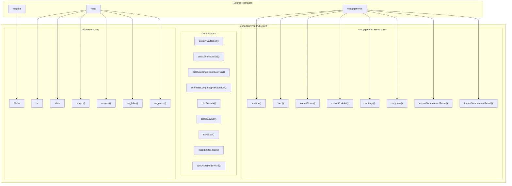
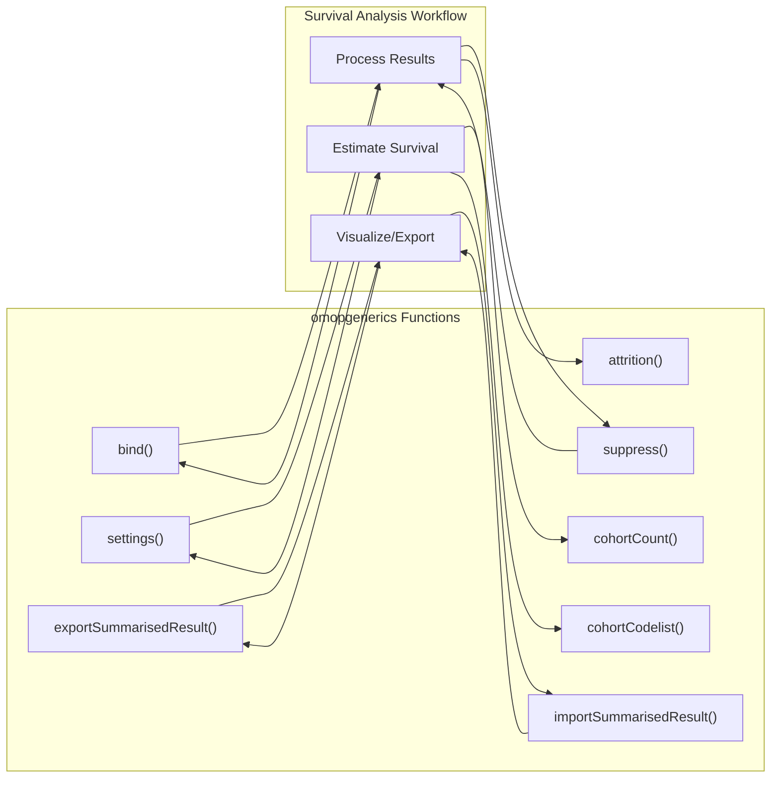
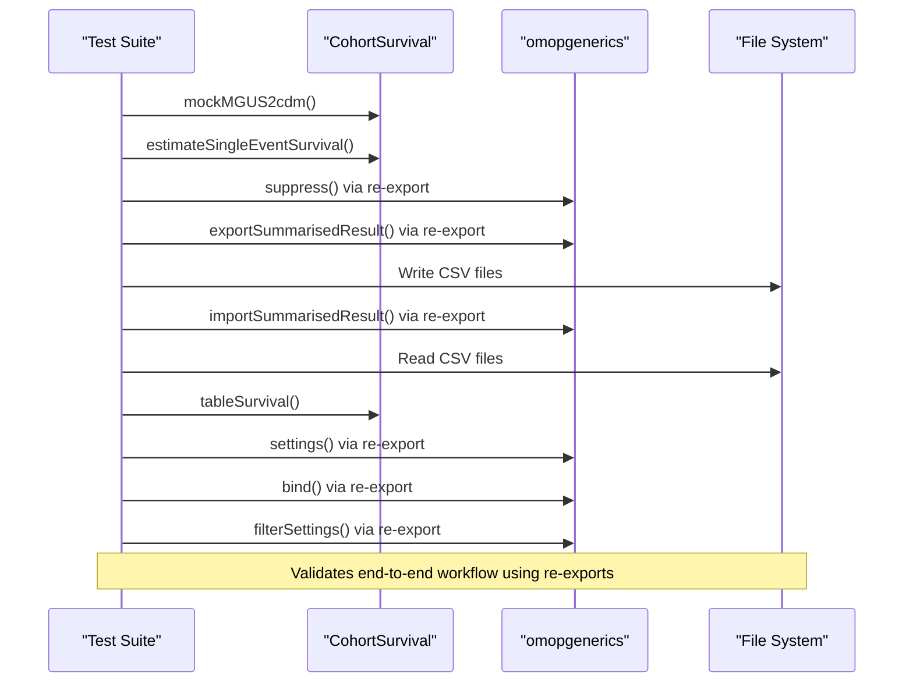

# Page: Package Exports and Re-exports

# Package Exports and Re-exports

<details>
<summary>Relevant source files</summary>

The following files were used as context for generating this wiki page:

- [.Rbuildignore](.Rbuildignore)
- [NAMESPACE](NAMESPACE)
- [R/addCohortSurvival.R](R/addCohortSurvival.R)
- [man/reexports.Rd](man/reexports.Rd)
- [tests/testthat/test-reexports-omopgenerics.R](tests/testthat/test-reexports-omopgenerics.R)

</details>


This document provides a comprehensive reference for all functions and objects that the CohortSurvival package makes available to users through exports and re-exports. It covers the package's own core functions as well as carefully selected functions from dependency packages that are re-exported to provide a cohesive user experience within the OMOP ecosystem.

For detailed documentation of individual core analysis functions, see [Core Analysis Functions](#6.1). For utility and helper functions, see [Utility and Helper Functions](#6.2).

## Overview of Package Interface

The CohortSurvival package follows R package conventions by explicitly exporting functions that form its public API. Additionally, it re-exports key functions from `omopgenerics` and other packages to streamline workflows and reduce the need for users to load multiple packages.



**Export Architecture Overview**
*Sources: [NAMESPACE:1-43](), [man/reexports.Rd:1-24]()*

## Core Package Exports

The package exports its primary survival analysis functions along with supporting utilities that form the core functionality:

| Function | Purpose | Return Type |
|----------|---------|-------------|
| `addCohortSurvival()` | Add time and status columns to cohort data | Enhanced cohort table |
| `estimateSingleEventSurvival()` | Kaplan-Meier survival estimation | `summarised_result` |
| `estimateCompetingRiskSurvival()` | Aalen-Johansen competing risk estimation | `summarised_result` |
| `asSurvivalResult()` | Convert to standardized survival result format | `survival_result` |
| `plotSurvival()` | Generate survival curve plots | `ggplot2` object |
| `tableSurvival()` | Create formatted survival tables | Various table formats |
| `riskTable()` | Generate numbers at risk tables | Various table formats |
| `mockMGUS2cdm()` | Create mock CDM with MGUS data for testing | CDM reference |
| `optionsTableSurvival()` | Configure table formatting options | List of options |

*Sources: [NAMESPACE:6-26](), [R/addCohortSurvival.R:51-60]()*

## Re-exported Functions from omopgenerics

CohortSurvival re-exports essential `omopgenerics` functions to provide seamless integration with the OMOP ecosystem without requiring users to explicitly load multiple packages:



**omopgenerics Integration Workflow**

### Data Management Functions

- **`cohortCount()`**: Extract cohort counts from CDM cohort tables
- **`cohortCodelist()`**: Retrieve concept sets and codelists associated with cohorts  
- **`attrition()`**: Access cohort attrition information
- **`settings()`**: View and manage analysis settings metadata

### Result Processing Functions

- **`suppress()`**: Apply minimum cell count suppression to results
- **`bind()`**: Combine multiple `summarised_result` objects
- **`exportSummarisedResult()`**: Export results to CSV files for sharing
- **`importSummarisedResult()`**: Import previously exported results

*Sources: [NAMESPACE:28-35](), [man/reexports.Rd:14-22](), [tests/testthat/test-reexports-omopgenerics.R:1-80]()*

## Re-exported Utility Functions

The package re-exports key programming utilities from `rlang` and `magrittr` to support modern R programming patterns:

### rlang Functions

| Function | Purpose | Usage Context |
|----------|---------|---------------|
| `:=` | Dynamic assignment operator | Creating columns with computed names |
| `.data` | Data mask pronoun | Referring to columns in dplyr operations |
| `enquo()` | Quote single argument | Non-standard evaluation |
| `enquos()` | Quote multiple arguments | Non-standard evaluation |
| `as_label()` | Convert to string label | Creating readable names from expressions |
| `as_name()` | Convert to string name | Creating valid variable names |

### magrittr Functions

- **`%>%`**: Pipe operator for chaining operations in survival analysis workflows

*Sources: [NAMESPACE:27,36-42](), [R/addCohortSurvival.R:76-79]()*

## Integration Testing Framework

The package includes comprehensive tests to ensure re-exported functions work correctly within survival analysis workflows:



**Re-export Testing Workflow**

Key test scenarios include:

1. **Export/Import Cycle**: Testing `exportSummarisedResult()` and `importSummarisedResult()` with survival results
2. **Result Binding**: Validating `bind()` function with multiple survival analyses  
3. **Suppression**: Ensuring `suppress()` works correctly with survival data
4. **Settings Filtering**: Testing `filterSettings()` for analysis metadata management

*Sources: [tests/testthat/test-reexports-omopgenerics.R:2-80]()*

## NAMESPACE Configuration

The package uses roxygen2-generated NAMESPACE configuration to manage exports and imports:

### Export Declarations
- All core functions are explicitly exported via `@export` roxygen tags
- Re-exports use `@importFrom` combined with `@export` to make functions available

### Import Declarations  
- `@importFrom` statements ensure required functions are available internally
- Selective imports reduce namespace pollution and potential conflicts

*Sources: [NAMESPACE:1-43]()*

## Usage Patterns

The re-exported functions enable streamlined workflows without package qualification:

```r
# Direct usage without library(omopgenerics)
result <- estimateSingleEventSurvival(...) %>%
  suppress(minCellCount = 5) %>%
  bind(other_result)

# Export and reimport workflow  
exportSummarisedResult(result, path = "output/")
imported_result <- importSummarisedResult("output/")

# Access metadata
analysis_settings <- settings(result)
cohort_counts <- cohortCount(cdm$target_cohort)
```

This design provides a cohesive API that integrates survival analysis capabilities with the broader OMOP ecosystem while maintaining compatibility with standard R programming patterns.

*Sources: [tests/testthat/test-reexports-omopgenerics.R:15-38]()*