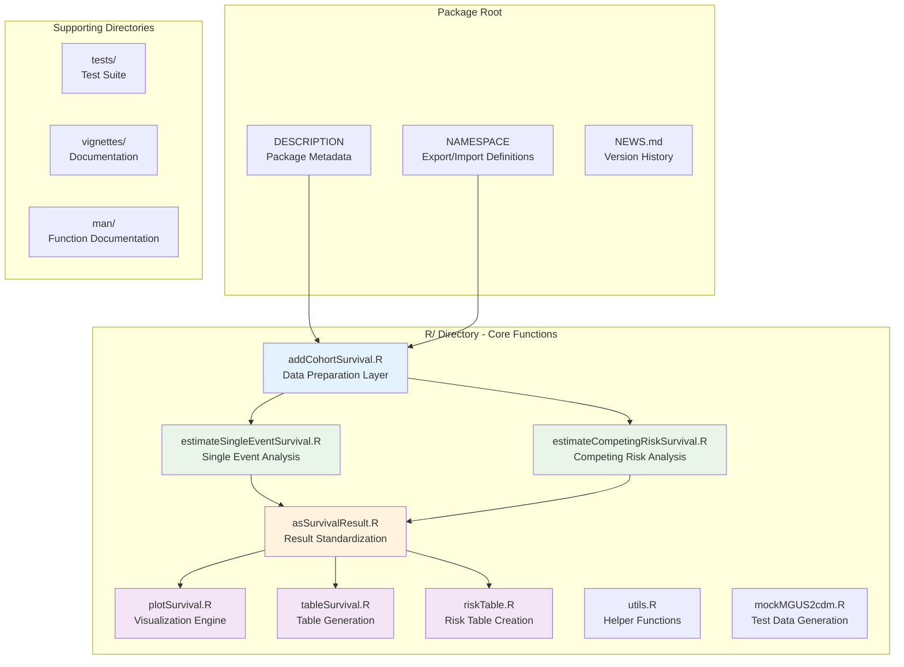
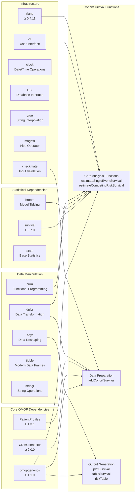
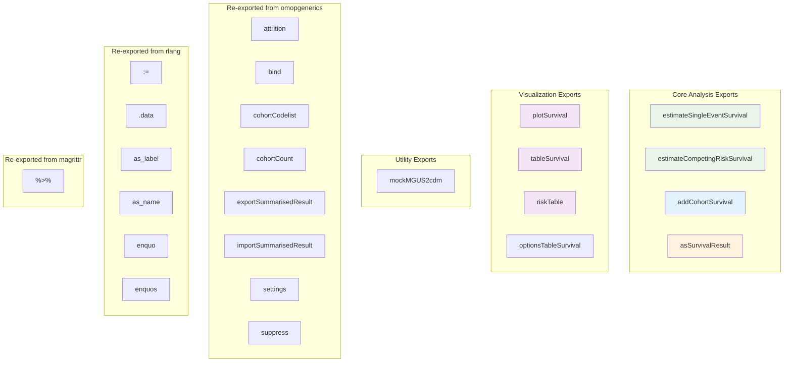
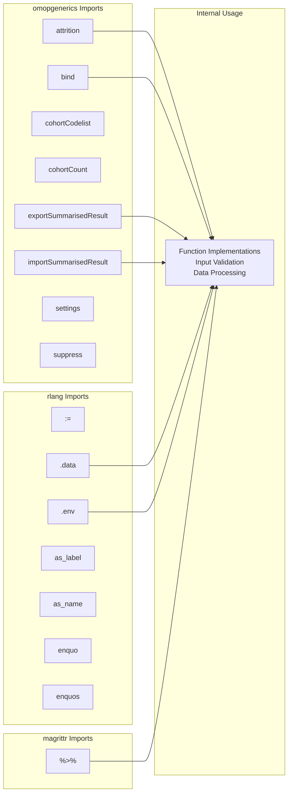
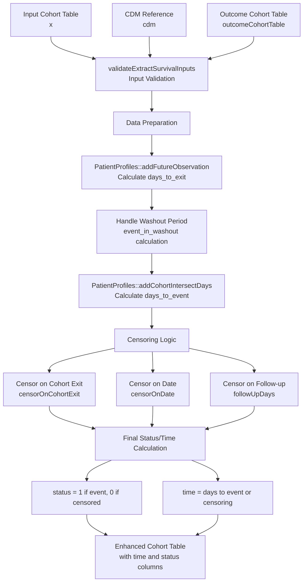

# Page: Package Structure and Dependencies

# Package Structure and Dependencies

Relevant source files

The following files were used as context for generating this wiki page:

- [DESCRIPTION](DESCRIPTION)
- [NAMESPACE](NAMESPACE)
- [NEWS.md](NEWS.md)
- [R/addCohortSurvival.R](R/addCohortSurvival.R)

This document provides a comprehensive overview of the CohortSurvival package architecture, dependency relationships, and internal organization. It covers the core package structure, import/export patterns, and dependency management strategy that enables the package to integrate seamlessly with the OMOP Common Data Model ecosystem.

For information about the testing framework and development workflows, see [Testing Framework](#7.1). For contribution guidelines and CI/CD processes, see [Contributing and CI/CD](#7.3).

## Package Overview and Architecture

CohortSurvival is structured as a specialized R package that bridges survival analysis methodology with the OMOP CDM ecosystem. The package follows standard R package conventions while implementing a layered architecture that separates data preparation, statistical analysis, and result formatting.

### Core Package Structure

**Sources:** [DESCRIPTION:1-66](), [NAMESPACE:1-43](), [R/addCohortSurvival.R:1-262]()

## Dependency Architecture

The package implements a strategic dependency management approach with clear separation between core requirements and optional extensions.

### Import Dependencies

**Sources:** [DESCRIPTION:28-46]()

### Suggested Dependencies

| Category | Package | Version | Purpose |
|----------|---------|---------|---------|
| Testing | `testthat` | ≥ 3.0.0 | Unit testing framework |
| Documentation | `roxygen2` | - | Function documentation |
| Documentation | `knitr` | - | Vignette generation |
| Documentation | `rmarkdown` | - | R Markdown support |
| Visualization | `ggplot2` | - | Advanced plotting |
| Visualization | `patchwork` | - | Plot composition |
| Visualization | `scales` | - | Plot scaling |
| Visualization | `visOmopResults` | ≥ 1.0.0 | OMOP-specific visualization |
| Statistical | `cmprsk` | - | Competing risk analysis |
| Cohort Definition | `CodelistGenerator` | - | Cohort creation utilities |
| Database | `duckdb` | - | Local database testing |
| Table Formatting | `gt` | - | Table generation |
| Table Formatting | `flextable` | - | Flexible table formatting |
| Performance | `tictoc` | - | Performance measurement |

**Sources:** [DESCRIPTION:47-61]()

## Export/Import Pattern Analysis

The package follows a structured export/import pattern that reveals its integration strategy with the OMOP ecosystem.

### Function Exports

**Sources:** [NAMESPACE:3-26]()

### Import Strategy

The package imports selectively from key dependencies:

**Sources:** [NAMESPACE:27-42]()

## Version Management and Constraints

The package implements strict version constraints for critical dependencies:

### Critical Version Dependencies

| Package | Minimum Version | Rationale |
|---------|----------------|-----------|
| `omopgenerics` | ≥ 1.1.0 | Required for updated object structures and validation |
| `CDMConnector` | ≥ 2.0.0 | Major version with breaking changes in CDM interface |
| `PatientProfiles` | ≥ 1.3.1 | Specific functions for patient-level data operations |
| `survival` | ≥ 3.7.0 | Established statistical methods and stability |
| `rlang` | ≥ 0.4.11 | Tidy evaluation support |
| `visOmopResults` | ≥ 1.0.0 | Stable visualization interface |

**Sources:** [DESCRIPTION:28-61]()

## Data Preparation Layer Architecture

The `addCohortSurvival` function represents the core data preparation layer, implementing a sophisticated censoring and time calculation system.

### Data Flow in addCohortSurvival

**Sources:** [R/addCohortSurvival.R:51-219]()

## Package Configuration and Metadata

The package includes several configuration elements that support its integration with the R ecosystem:

### Build Configuration

- **Roxygen Version**: 7.3.2 with markdown support enabled
- **Test Configuration**: testthat edition 3 with parallel testing enabled
- **Vignette Builder**: knitr for documentation generation
- **Encoding**: UTF-8 for international character support

### Licensing and Distribution

- **License**: Apache License (≥ 2) for permissive open-source distribution
- **URL**: Documentation hosted at https://darwin-eu-dev.github.io/CohortSurvival/
- **CRAN Configuration**: Optimized for CRAN submission with proper metadata

**Sources:** [DESCRIPTION:24-66]()

## Integration Points with OMOP Ecosystem

The package's architecture reveals strategic integration points with the broader OMOP ecosystem:

### Key Integration Patterns

1. **Data Model Compliance**: Direct integration with `CDMConnector` for database operations
2. **Object Standardization**: Heavy reliance on `omopgenerics` for consistent object structures
3. **Patient-Level Operations**: Integration with `PatientProfiles` for cohort-level calculations
4. **Result Standardization**: Use of `omopgenerics` export/import functions for data persistence
5. **Visualization Consistency**: Optional integration with `visOmopResults` for standardized plotting

This architectural approach ensures that CohortSurvival functions seamlessly within existing OMOP analytical workflows while providing specialized survival analysis capabilities.

**Sources:** [DESCRIPTION:28-61](), [NAMESPACE:27-42]()