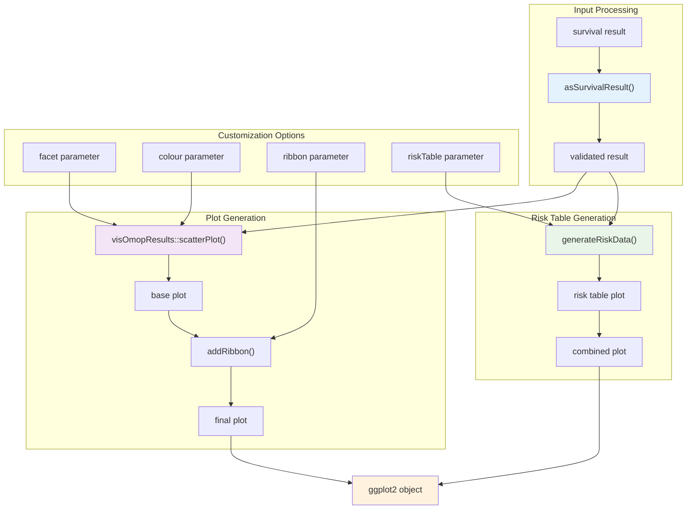
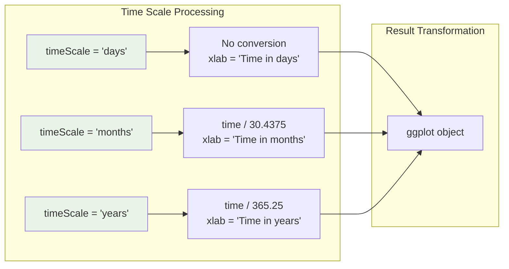
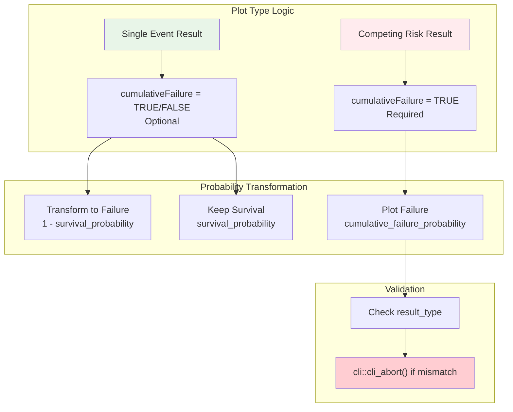
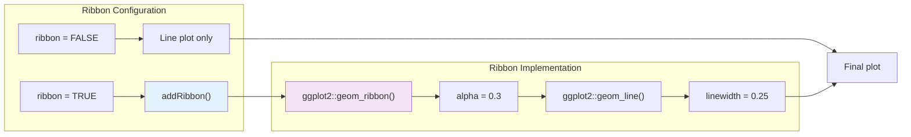
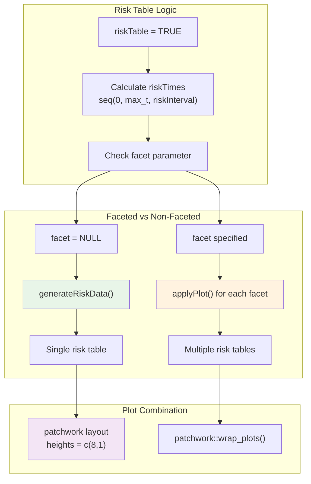
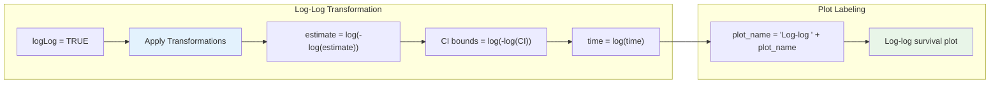
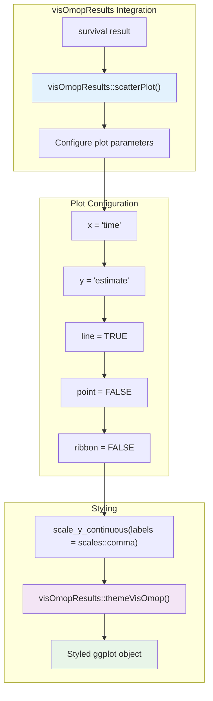
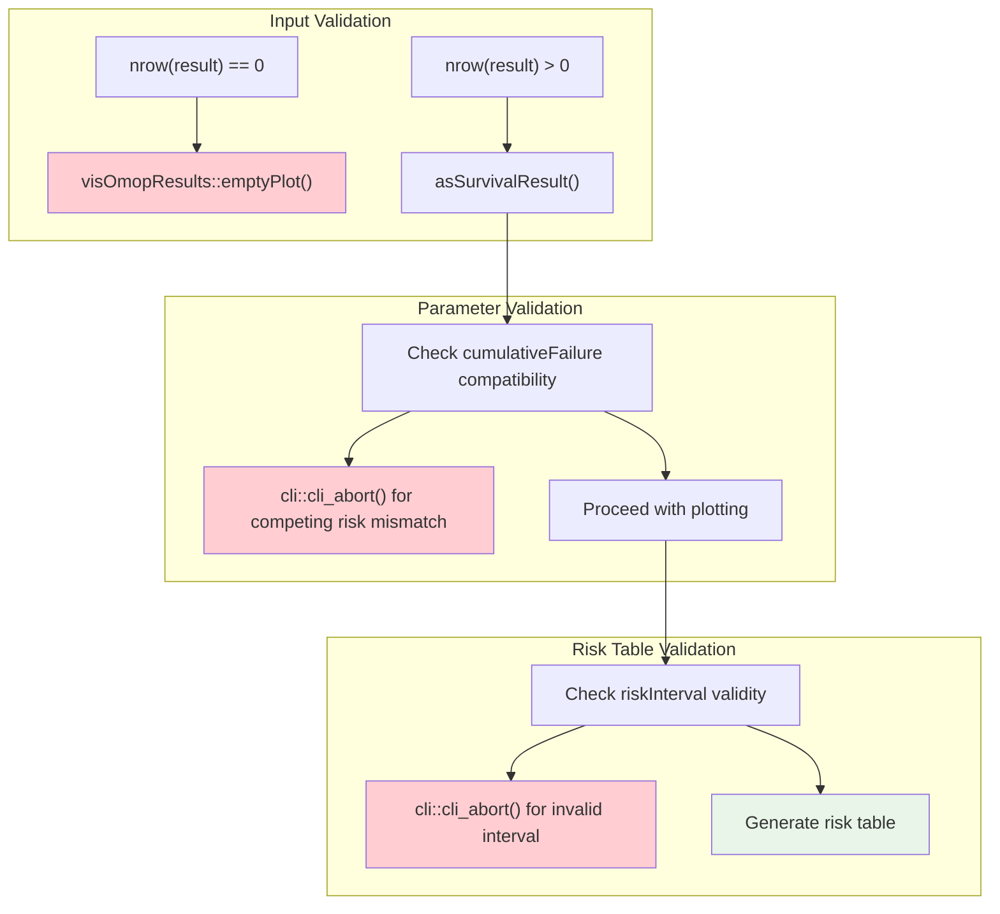

# Page: Plotting Survival Curves

# Plotting Survival Curves

Relevant source files

The following files were used as context for generating this wiki page:

- [R/plotSurvival.R](R/plotSurvival.R)
- [man/plotSurvival.Rd](man/plotSurvival.Rd)
- [tests/testthat/test-plotSurvival.R](tests/testthat/test-plotSurvival.R)

This document covers the visualization capabilities of the CohortSurvival package, specifically the `plotSurvival()` function and its associated plotting utilities. This page focuses on creating publication-ready survival curves, risk tables, and customization options for survival analysis results.

For information about generating survival analysis results that serve as input to these plotting functions, see [Core Survival Analysis Functions](#2). For creating summary tables instead of plots, see [Generating Summary Tables](#4.2).

## Purpose and Scope

The `plotSurvival()` function transforms survival analysis results into publication-ready visualizations using the `visOmopResults` plotting framework. It supports both standard survival probability curves and cumulative failure probability plots, with extensive customization options including faceting, coloring, confidence ribbons, and integrated risk tables.

Sources: [R/plotSurvival.R:17-31](), [man/plotSurvival.Rd:5-17]()

## Core Plotting Architecture

The plotting system builds upon the `visOmopResults` package to create standardized, publication-ready survival visualizations with extensive customization capabilities.

**Plot Generation Flow**

This diagram illustrates how `plotSurvival()` processes survival results through validation, base plot creation, and optional enhancements like ribbons and risk tables.

Sources: [R/plotSurvival.R:42-51](), [R/plotSurvival.R:113-129]()

## Function Interface and Parameters

The `plotSurvival()` function provides comprehensive control over survival curve visualization through its parameter interface:

| Parameter | Type | Default | Description |
|-----------|------|---------|-------------|
| `result` | `summarised_result` | Required | Survival analysis results from `estimateSingleEventSurvival()` or `estimateCompetingRiskSurvival()` |
| `ribbon` | `logical` | `TRUE` | Whether to display confidence interval ribbons |
| `facet` | `character` | `NULL` | Variables for creating subplot facets |
| `colour` | `character` | `NULL` | Variables for curve coloring |
| `cumulativeFailure` | `logical` | `FALSE` | Plot cumulative failure instead of survival probability |
| `riskTable` | `logical` | `FALSE` | Include numbers-at-risk table below plot |
| `riskInterval` | `numeric` | `30` | Time interval for risk table entries |
| `logLog` | `logical` | `FALSE` | Apply log-log transformation to survival probabilities |
| `timeScale` | `character` | `"days"` | Time axis scale: `"days"`, `"months"`, or `"years"` |

Sources: [R/plotSurvival.R:42-50](), [man/plotSurvival.Rd:19-37]()

## Time Scale Transformation

The plotting function supports automatic time scale conversion to improve readability for different follow-up periods:

**Time Scale Conversion Logic**

The conversion factors use standard epidemiological conventions: 30.4375 days per month (365.25/12) and 365.25 days per year to account for leap years.

Sources: [R/plotSurvival.R:64-75]()

## Survival vs Cumulative Failure Visualization

The function can display either survival probabilities or cumulative failure probabilities, with automatic validation for competing risk results:

**Cumulative Failure Mode Selection**

Competing risk analyses require `cumulativeFailure = TRUE` since they produce cumulative failure probabilities rather than survival probabilities.

Sources: [R/plotSurvival.R:77-89]()

## Ribbon and Confidence Interval Display

The `addRibbon()` helper function enhances plots with confidence interval visualization:

**Confidence Interval Ribbon Implementation**

The ribbon uses semi-transparent shading (`alpha = 0.3`) with `estimate_95CI_lower` and `estimate_95CI_upper` as boundaries, overlaid with a thin survival curve line.

Sources: [R/plotSurvival.R:131-133](), [R/plotSurvival.R:304-311]()

## Risk Table Integration

Risk tables display numbers-at-risk at specified time intervals below the survival curves, with support for stratified analyses:

**Risk Table Generation Process**

Risk tables are created using `generateRiskData()` and combined with survival plots using the `patchwork` package, with the survival plot taking 8/9 of the height and risk table taking 1/9.

Sources: [R/plotSurvival.R:135-244](), [R/plotSurvival.R:249-302]()

## Log-Log Transformation

The `logLog` parameter applies the complementary log-log transformation commonly used in survival analysis diagnostics:

**Log-Log Transformation Implementation**

The transformation converts both survival estimates and time values to log scale, producing linearized curves that can help assess proportional hazards assumptions.

Sources: [R/plotSurvival.R:101-109]()

## Integration with visOmopResults

The plotting system leverages `visOmopResults::scatterPlot()` as the foundation for standardized OMOP result visualization:

**visOmopResults Integration Pattern**

The function uses `visOmopResults::scatterPlot()` with specific parameters optimized for survival curves: line plots without points, custom y-axis formatting, and consistent OMOP theming.

Sources: [R/plotSurvival.R:113-129]()

## Error Handling and Validation

The plotting function includes comprehensive validation to ensure proper input formatting and parameter compatibility:

**Validation and Error Handling Flow**

The function validates inputs at multiple stages, providing informative error messages through `cli::cli_abort()` for invalid parameter combinations or data issues.

Sources: [R/plotSurvival.R:57-60](), [R/plotSurvival.R:77-79](), [R/plotSurvival.R:186-191]()