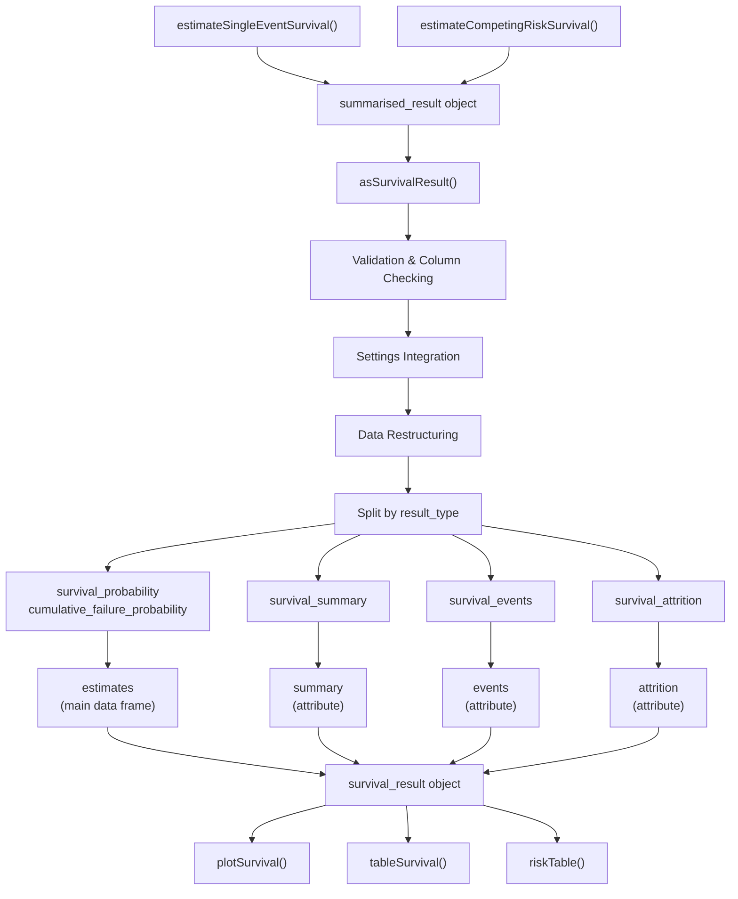
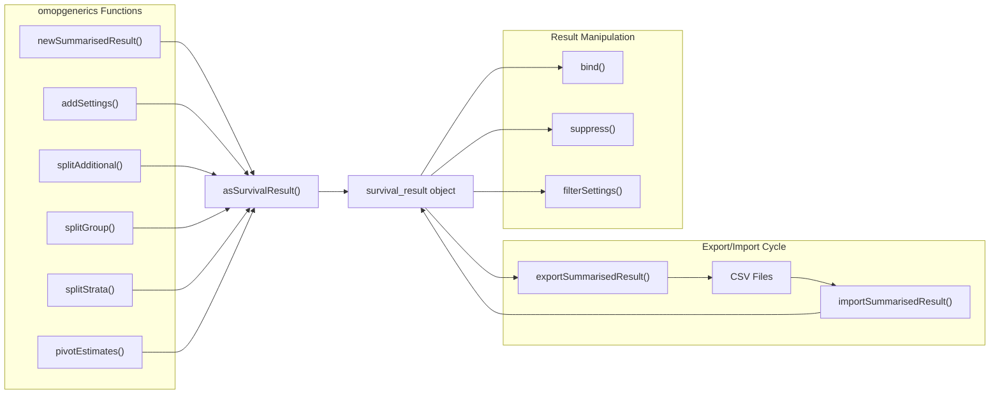
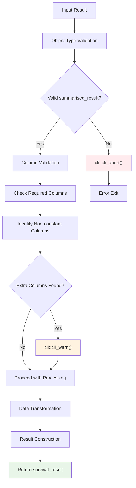

# Page: Result Processing and Formatting

# Result Processing and Formatting

Relevant source files

The following files were used as context for generating this wiki page:

- [NAMESPACE](NAMESPACE)
- [R/addCohortSurvival.R](R/addCohortSurvival.R)
- [R/asSurvivalResult.R](R/asSurvivalResult.R)
- [tests/testthat/test-reexports-omopgenerics.R](tests/testthat/test-reexports-omopgenerics.R)

This section covers how survival analysis results are processed, standardized, and prepared for downstream visualization and tabulation. The result processing layer transforms raw analysis outputs from [`estimateSingleEventSurvival`]() and [`estimateCompetingRiskSurvival`]() into standardized `survival_result` objects that can be consumed by plotting and table generation functions.

For information about the initial survival analysis functions that generate raw results, see [Core Survival Analysis Functions](#2). For details about creating visualizations and tables from processed results, see [Visualization and Output](#4).

## Core Result Processing Function

The primary function for result processing is `asSurvivalResult`, which transforms `summarised_result` objects into structured `survival_result` objects optimized for downstream consumption.

### Data Flow Through Processing Pipeline

Sources: [R/asSurvivalResult.R:40-130]()

### Function Implementation Details

The `asSurvivalResult` function performs several critical processing steps:

**Input Validation**: The function first validates that the input is a proper `summarised_result` object using `omopgenerics::newSummarisedResult()` and inheritance checking.

**Column Requirements**: A set of required columns is defined and validated:

| Column Type | Purpose |
|-------------|---------|
| `result_id`, `cdm_name` | Result identification |
| `group_name`, `group_level` | Grouping variables |
| `strata_name`, `strata_level` | Stratification variables |
| `variable_name`, `variable_level` | Analysis variables |
| `estimate_name`, `estimate_type`, `estimate_value` | Statistical estimates |
| `additional_name`, `additional_level` | Additional metadata |
| `result_type`, `outcome`, `competing_outcome`, `eventgap` | Analysis-specific fields |

**Settings Integration**: The function integrates analysis settings using `omopgenerics::addSettings()` to preserve configuration metadata.

**Dynamic Column Handling**: Non-constant columns beyond the required set are automatically included with a warning to preserve all relevant information.

Sources: [R/asSurvivalResult.R:46-66]()

## Survival Result Object Structure

The processed `survival_result` object has a specific structure optimized for downstream consumption:

```mermaid
graph TB
    subgraph "survival_result Object"
        A["Main Data Frame<br/>(estimates)"]
        B["summary<br/>(attribute)"]
        C["events<br/>(attribute)"] 
        D["attrition<br/>(attribute)"]
    end
    
    subgraph "Main Data Frame Contents"
        A1["survival_probability data"]
        A2["cumulative_failure_probability data"]
        A3["Time series data with CI bounds"]
    end
    
    subgraph "Summary Attribute"
        B1["Aggregate statistics"]
        B2["Survival metrics"]
        B3["Population counts"]
    end
    
    subgraph "Events Attribute"
        C1["Event counts by time"]
        C2["Risk set information"]
        C3["Censoring details"]
    end
    
    subgraph "Attrition Attribute"
        D1["Cohort attrition data"]
        D2["Exclusion reasons"]
        D3["Sample size tracking"]
    end
    
    A --> A1
    A --> A2
    A --> A3
    
    B --> B1
    B --> B2
    B --> B3
    
    C --> C1
    C --> C2
    C --> C3
    
    D --> D1
    D --> D2
    D --> D3
```

Sources: [R/asSurvivalResult.R:73-130]()

### Data Transformation Process

The function performs several data transformation operations:

**Result Type Filtering**: Different result types are filtered and processed separately:
- `survival_probability` and `cumulative_failure_probability` → main estimates data frame
- `survival_summary` → summary attribute  
- `survival_events` → events attribute
- `survival_attrition` → attrition attribute

**Column Restructuring**: Common transformations include:
- Pivoting estimates using `omopgenerics::pivotEstimates()`
- Splitting additional, group, and strata information
- Renaming `variable_level` to `variable`
- Relocating outcome columns for consistent ordering

**Data Type Conversion**: Time variables are converted to numeric format and estimate names are standardized by removing `_count` suffixes.

Sources: [R/asSurvivalResult.R:73-113]()

## Integration with omopgenerics Ecosystem

The result processing layer is tightly integrated with the broader omopgenerics ecosystem for standardization and interoperability:

Sources: [R/asSurvivalResult.R:41-71](), [tests/testthat/test-reexports-omopgenerics.R:15-40]()

### Export and Import Workflow

The processed results support persistence through the omopgenerics export/import mechanism:

**Export Process**: Results can be exported to CSV format using `omopgenerics::exportSummarisedResult()`, which preserves all analysis metadata and settings.

**Import Process**: Previously exported results can be imported using `omopgenerics::importSummarisedResult()` and immediately used with visualization functions without reprocessing.

**Result Binding**: Multiple survival analyses can be combined using `omopgenerics::bind()` to create comprehensive study results.

Sources: [tests/testthat/test-reexports-omopgenerics.R:15-25](), [NAMESPACE:18-19]()

## Validation and Error Handling

The result processing includes comprehensive validation and error handling:

**Input Validation**: The function validates that inputs are proper `summarised_result` objects and aborts with clear error messages if validation fails.

**Column Warnings**: When additional non-standard columns are detected, the function issues warnings but includes them in the output to preserve information.

**Graceful Degradation**: The processing handles missing or malformed data gracefully while maintaining result integrity.

Sources: [R/asSurvivalResult.R:42-44](), [R/asSurvivalResult.R:61-63]()

The result processing layer serves as the critical bridge between raw survival analysis outputs and user-facing visualization and tabulation functions, ensuring consistent data formats while preserving analytical flexibility and metadata integrity.