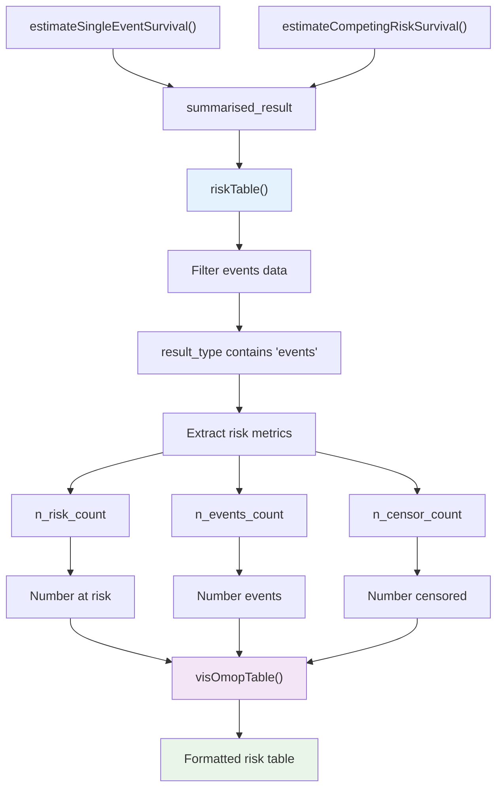
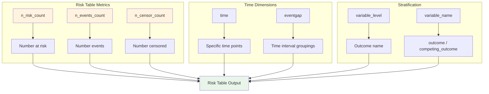
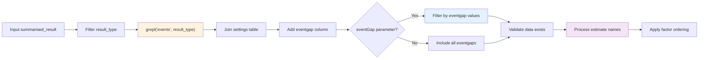
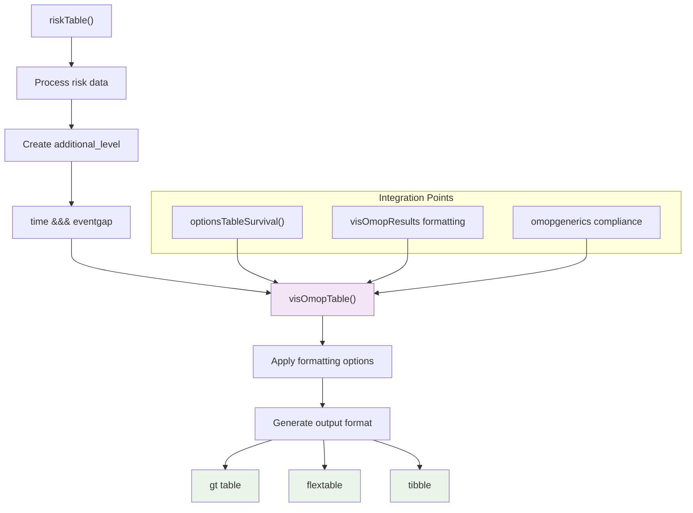

# Page: Risk Tables and Event Counts

# Risk Tables and Event Counts

<details>
<summary>Relevant source files</summary>

The following files were used as context for generating this wiki page:

- [R/tableSurvival.R](R/tableSurvival.R)
- [tests/testthat/test-plotSurvival.R](tests/testthat/test-plotSurvival.R)

</details>


This page documents the `riskTable` function and the generation of risk tables that display numbers at risk, event counts, and censoring information at different time points during survival analysis. Risk tables provide essential contextual information that accompanies survival curves and summary statistics.

For information about generating survival summary tables with statistics like median survival and restricted mean survival, see [Generating Summary Tables](#4.2). For details about plotting survival curves with integrated risk tables, see [Plotting Survival Curves](#4.1).

## Overview

Risk tables are tabular displays that show the number of subjects at risk, number of events, and number of censored observations at specific time intervals during a survival analysis. These tables provide transparency about the underlying data structure and help interpret survival curves by showing how sample sizes change over time.

The CohortSurvival package provides the `riskTable` function to generate formatted risk tables from survival analysis results. These tables can be displayed independently or integrated with survival plots.

## Risk Table Data Flow



**Risk Table Generation Process**: Shows how survival analysis results are processed through the `riskTable` function to produce formatted tables with event count information.

Sources: [R/tableSurvival.R:329-437]()

## The riskTable Function

The `riskTable` function is the primary interface for generating risk tables from survival analysis results. It extracts event-related information from `summarised_result` objects and formats them into readable tables.

### Function Signature and Parameters

| Parameter | Type | Description |
|-----------|------|-------------|
| `x` | `summarised_result` | Result from `estimateSingleEventSurvival` or `estimateCompetingRiskSurvival` |
| `eventGap` | `numeric` | Event gap defining time intervals (must match estimation function input) |
| `header` | `character` | Elements for table header: "cdm_name", "group", "strata", "additional", "variable", "estimate", "settings" |
| `type` | `character` | Output format: "gt", "flextable", or "tibble" |
| `groupColumn` | `character` | Columns to use as group labels |
| `.options` | `list` | Additional formatting options from `optionsTableSurvival()` |

Sources: [R/tableSurvival.R:329-348]()

## Risk Table Data Structure

Risk tables contain three core metrics that are tracked over time:



**Risk Table Data Components**: Illustrates the core metrics and dimensions that comprise risk table information.

Sources: [R/tableSurvival.R:369-387]()

## Event Gap Filtering and Data Processing

The function processes survival results by filtering for event-related data and applying event gap constraints:

### Data Filtering Process



**Event Gap Processing Logic**: Shows how the function filters and processes event data based on time interval specifications.

Sources: [R/tableSurvival.R:349-367]()

## Estimate Name Transformation

The function transforms internal estimate names into user-friendly labels:

| Internal Name | Display Name |
|---------------|--------------|
| `n_risk_count` | "Number at risk" |
| `n_events_count` | "Number events" |
| `n_censor_count` | "Number censored" |

This transformation ensures consistent, readable output while maintaining the underlying data structure required for formatting functions.

Sources: [R/tableSurvival.R:371-387]()

## Competing Risk Support

Risk tables handle both single event and competing risk scenarios with different column structures:

### Single Event Risk Tables

For single event analyses, the table structure includes:
- Outcome name
- Time
- Event gap  
- Risk metrics

### Competing Risk Tables

For competing risk analyses, additional columns distinguish between outcome types:
- Outcome type (outcome/competing_outcome)
- Outcome name
- Time
- Event gap
- Risk metrics

Sources: [R/tableSurvival.R:396-417]()

## Integration with Visualization System

Risk tables integrate with the broader visualization ecosystem through `visOmopResults`:



**Risk Table Formatting Pipeline**: Demonstrates how risk tables integrate with the package's formatting and visualization infrastructure.

Sources: [R/tableSurvival.R:419-436]()

## Usage Examples

### Basic Risk Table Generation

```r
# Generate risk table from survival analysis
cdm <- mockMGUS2cdm()
surv <- estimateSingleEventSurvival(cdm,
                                   targetCohortTable = "mgus_diagnosis",
                                   outcomeCohortTable = "death_cohort")
risk_table <- riskTable(surv)
```

### Filtered by Event Gap

```r
# Generate risk table for specific event gap
risk_table <- riskTable(surv, eventGap = 365)
```

### Integration with Plotting

Risk tables can be embedded directly in survival plots using the `riskTable` parameter in `plotSurvival`:

```r
# Plot with integrated risk table
plot <- plotSurvival(surv, riskTable = TRUE, riskInterval = 10)
```

Sources: [R/tableSurvival.R:322-328](), [tests/testthat/test-plotSurvival.R:79-114]()

## Technical Implementation Details

### Result Structure Processing

The function uses the `omopgenerics` framework to ensure consistent data structure handling:

1. **Settings Integration**: Joins with settings table to access `eventgap` configuration
2. **Additional Level Creation**: Combines time and eventgap into composite keys
3. **Column Standardization**: Applies `resultColumns()` structure for downstream compatibility

### Formatting Options

Risk tables inherit formatting options from `optionsTableSurvival()`, which provides defaults for:
- Decimal places
- Decimal and thousands separators  
- Table styling preferences
- Column visibility and naming

Sources: [R/tableSurvival.R:342-347](), [R/tableSurvival.R:419-433]()