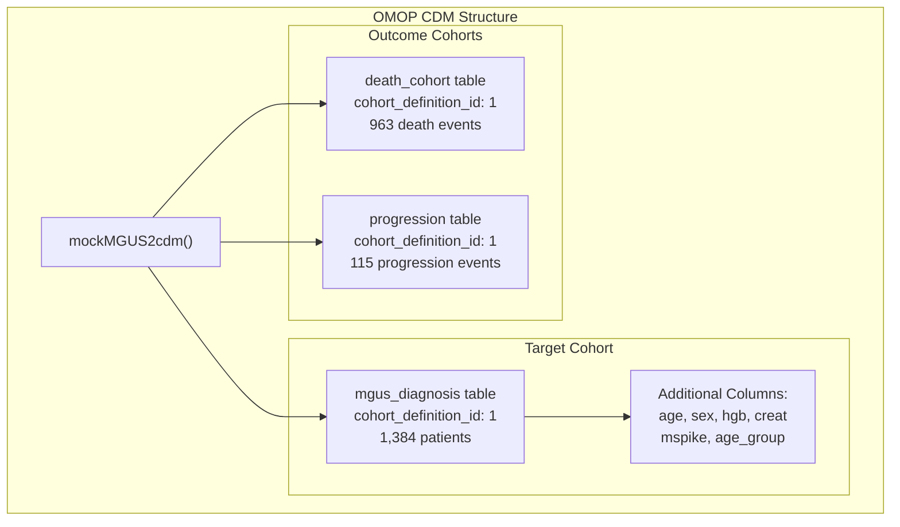
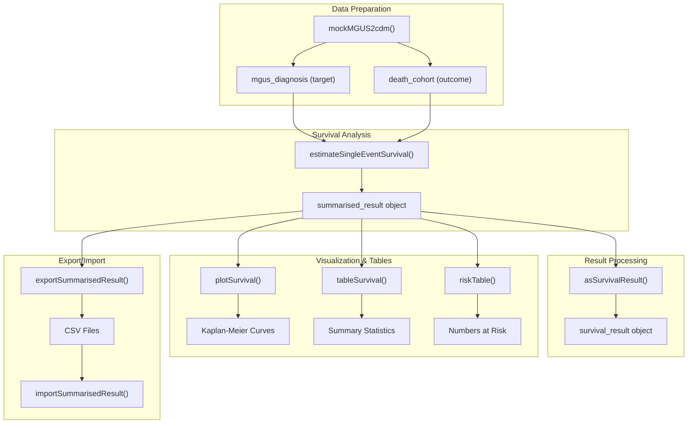
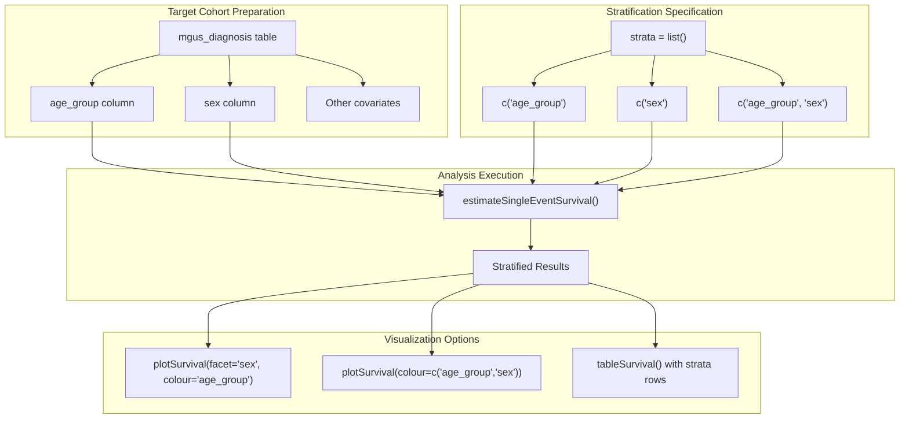

# Page: Single Event Survival Analysis Tutorial

# Single Event Survival Analysis Tutorial

<details>
<summary>Relevant source files</summary>

The following files were used as context for generating this wiki page:

- [README.Rmd](README.Rmd)
- [README.md](README.md)
- [vignettes/a01_Single_event_of_interest.Rmd](vignettes/a01_Single_event_of_interest.Rmd)

</details>


This tutorial provides a comprehensive, step-by-step guide for performing single event survival analysis using the CohortSurvival package with the MGUS dataset example. It covers the complete workflow from data setup through result visualization and export, focusing on practical implementation using the `estimateSingleEventSurvival` function and related visualization tools.

For competing risk analysis with multiple outcomes, see [Competing Risk Analysis Tutorial](#5.2). For advanced integration techniques, see [Advanced Analysis Techniques](#5.3).

## Overview: MGUS2 Dataset and Analysis Workflow

The tutorial uses the MGUS2 dataset containing survival data for 1341 patients with monoclonal gammopathy of undetermined significance (MGUS), transformed into OMOP CDM format. The analysis examines time from MGUS diagnosis to death as the primary outcome.

### MGUS2 Data Structure



Sources: [README.Rmd:32-69](), [vignettes/a01_Single_event_of_interest.Rmd:29-49]()

### Core Analysis Workflow



Sources: [vignettes/a01_Single_event_of_interest.Rmd:62-120](), [README.Rmd:75-88]()

## Step 1: Environment Setup and Data Loading

Begin by loading required packages and creating the CDM reference:

```r
library(CDMConnector)
library(CohortSurvival)
library(dplyr)
library(ggplot2)

cdm <- CohortSurvival::mockMGUS2cdm()
```

The `mockMGUS2cdm()` function creates a mock CDM reference containing three cohort tables: `mgus_diagnosis` (target cohort), `death_cohort` (outcome cohort), and `progression` (competing outcome cohort).

Sources: [vignettes/a01_Single_event_of_interest.Rmd:22-33](), [README.Rmd:40-46]()

## Step 2: Basic Survival Analysis

### Running estimateSingleEventSurvival

Execute the core survival analysis function with minimal parameters:

```r
MGUS_death <- estimateSingleEventSurvival(
  cdm,
  targetCohortTable = "mgus_diagnosis",
  outcomeCohortTable = "death_cohort"
)
```

This function performs Kaplan-Meier survival estimation and returns a `summarised_result` object containing survival estimates, confidence intervals, and event information at regular time intervals (default: every 30 days).

| Parameter | Purpose | Default Value |
|-----------|---------|---------------|
| `cdm` | CDM reference object | Required |
| `targetCohortTable` | Name of target cohort table | Required |
| `outcomeCohortTable` | Name of outcome cohort table | Required |
| `eventGap` | Time interval for estimates (days) | 30 |
| `outcomeWashout` | Washout period for prior outcomes | Inf |
| `minimumSurvivalDays` | Minimum survival requirement | 1 |
| `followUpDays` | Maximum follow-up period | Inf |

Sources: [vignettes/a01_Single_event_of_interest.Rmd:62-69](), [README.Rmd:76-82]()

### Understanding the Output Structure

The result is a `summarised_result` object with standardized columns:

| Column | Description |
|--------|-------------|
| `result_id` | Unique identifier for the analysis |
| `group_name` / `group_level` | Target cohort information |
| `strata_name` / `strata_level` | Stratification variables |
| `variable_name` / `variable_level` | Outcome information |
| `estimate_name` | Type of estimate (estimate, CI bounds) |
| `estimate_value` | Numerical value |
| `additional_name` / `additional_level` | Time point information |

Sources: [vignettes/a01_Single_event_of_interest.Rmd:67-76]()

## Step 3: Visualization with plotSurvival

### Basic Survival Curves

Create standard Kaplan-Meier plots using the `plotSurvival` function:

```r
plotSurvival(MGUS_death)
```

### Enhanced Visualizations

Add risk tables and customize appearance:

```r
# With risk table
plotSurvival(MGUS_death, riskTable = TRUE)

# Cumulative failure plot
plotSurvival(MGUS_death, cumulativeFailure = TRUE)

# Different time scales
plotSurvival(MGUS_death, timeScale = "years")
plotSurvival(MGUS_death, timeScale = "months")
```

### Customization Options

| Parameter | Purpose | Options |
|-----------|---------|---------|
| `riskTable` | Include numbers at risk | TRUE/FALSE |
| `cumulativeFailure` | Plot cumulative incidence | TRUE/FALSE |
| `timeScale` | Time unit for x-axis | "days", "months", "years" |
| `ribbon` | Show confidence intervals | TRUE/FALSE |
| `colour` | Grouping variable for colors | Column name |
| `facet` | Faceting variable | Column name |

Sources: [vignettes/a01_Single_event_of_interest.Rmd:82-112](), [README.Rmd:87-88]()

## Step 4: Tabular Results

### Summary Statistics with tableSurvival

Generate comprehensive survival summaries:

```r
# Basic summary
tableSurvival(MGUS_death)

# Survival at specific time points
tableSurvival(MGUS_death, times = c(30, 90, 180))

# With formatting options
tableSurvival(MGUS_death, .options = list(
  title = "Survival Summary",
  decimalMark = ",",
  bigMark = "."
))
```

The table includes:
- Number of records (patients in target cohort)
- Number of events (patients experiencing outcome)
- Median survival with 95% CI
- Restricted mean survival with standard error
- Survival estimates at requested time points

Sources: [vignettes/a01_Single_event_of_interest.Rmd:116-156]()

### Risk Tables with riskTable

Display numbers at risk over time:

```r
riskTable(MGUS_death)
```

This function provides detailed information about:
- Number of patients at risk at each time point
- Number of events occurring
- Number of patients censored

Sources: [vignettes/a01_Single_event_of_interest.Rmd:158-162]()

## Step 5: Stratified Analysis

### Adding Stratification Variables

Perform survival analysis stratified by patient characteristics:

```r
MGUS_death_strata <- estimateSingleEventSurvival(
  cdm,
  targetCohortTable = "mgus_diagnosis",
  outcomeCohortTable = "death_cohort",
  strata = list(
    c("age_group"),
    c("sex"),
    c("age_group", "sex")
  )
)
```

### Stratification Analysis Workflow



Sources: [vignettes/a01_Single_event_of_interest.Rmd:245-288](), [README.Rmd:93-104]()

### Stratified Visualization

Plot stratified results with appropriate faceting and coloring:

```r
# Facet by sex, color by age group
plotSurvival(MGUS_death_strata, 
             facet = "sex", 
             colour = "age_group")

# Combined coloring
plotSurvival(MGUS_death_strata, 
             colour = c("age_group", "sex"))
```

Sources: [vignettes/a01_Single_event_of_interest.Rmd:262-288]()

## Step 6: Parameter Customization

### Key Estimation Parameters

Modify analysis parameters for specific research needs:

| Parameter | Purpose | Example Values |
|-----------|---------|----------------|
| `outcomeWashout` | Prior outcome exclusion period | 30, 90, Inf (default) |
| `minimumSurvivalDays` | Minimum follow-up requirement | 1 (default), 7, 30 |
| `followUpDays` | Maximum follow-up period | Inf (default), 365, 730 |
| `eventGap` | Time interval granularity | 30 (default), 7, 14 |

### Example: Custom Follow-up Analysis

```r
# Limited follow-up analysis
MGUS_death_100days <- estimateSingleEventSurvival(
  cdm,
  targetCohortTable = "mgus_diagnosis",
  outcomeCohortTable = "death_cohort",
  followUpDays = 100
)

# Weekly event intervals
MGUS_death_weekly <- estimateSingleEventSurvival(
  cdm,
  targetCohortTable = "mgus_diagnosis", 
  outcomeCohortTable = "death_cohort",
  eventGap = 7
)
```

Sources: [vignettes/a01_Single_event_of_interest.Rmd:192-236]()

## Step 7: Multiple Cohort Analysis

### Combining Multiple Analyses

Analyze multiple target or outcome cohorts by binding results:

```r
# Additional target cohort analysis
MM_death <- estimateSingleEventSurvival(
  cdm, 
  "progression", 
  "death_cohort"
)

# Combine results
MGUS_MM_death <- bind(MGUS_death, MM_death)

# Visualize combined results
plotSurvival(MGUS_MM_death, colour = "target_cohort")
```

### Multiple Outcomes in Single Table

Create unified outcome tables for comprehensive analysis:

```r
# Bind outcome cohorts
cdm <- bind(cdm$progression, cdm$death_cohort, name = "outcome_cohorts")

# Analyze all outcomes simultaneously
MGUS_all_outcomes <- estimateSingleEventSurvival(
  cdm, 
  "mgus_diagnosis", 
  "outcome_cohorts"
)

plotSurvival(MGUS_all_outcomes, colour = "outcome")
```

Sources: [vignettes/a01_Single_event_of_interest.Rmd:291-330]()

## Step 8: Result Processing and Export

### Converting to Survival Format

Transform results for manual inspection using `asSurvivalResult`:

```r
MGUS_death_survresult <- MGUS_death %>% 
  asSurvivalResult()

# Access specific estimates
MGUS_death_survresult %>%
  filter(time %in% c(10:15))

# Access attributes
attr(MGUS_death_survresult, "events")
attr(MGUS_death_survresult, "summary") 
attr(MGUS_death_survresult, "attrition")
```

### Export and Import Functionality

Persist results using omopgenerics export functions:

```r
# Export results
exportSummarisedResult(
  MGUS_death, 
  path = tempdir(), 
  fileName = "mgus_survival.csv"
)

# Import results
MGUS_death_imported <- importSummarisedResult(
  path = file.path(tempdir(), "mgus_survival.csv")
)
```

**Note**: Exported results apply cell suppression (default: counts < 5 become NA) for privacy protection.

Sources: [vignettes/a01_Single_event_of_interest.Rmd:171-351]()

## Summary

This tutorial demonstrated the complete single event survival analysis workflow using CohortSurvival:

1. **Data Setup**: Using `mockMGUS2cdm()` to create OMOP CDM structure
2. **Core Analysis**: `estimateSingleEventSurvival()` for Kaplan-Meier estimation  
3. **Visualization**: `plotSurvival()` with multiple customization options
4. **Tables**: `tableSurvival()` and `riskTable()` for summary statistics
5. **Stratification**: Multi-variable survival analysis by patient characteristics
6. **Customization**: Parameter adjustment for specific research requirements
7. **Export/Import**: Result persistence using omopgenerics standards

The workflow produces standardized `summarised_result` objects compatible with other OMOP ecosystem packages, enabling integration with broader pharmacoepidemiological analyses.

Sources: [vignettes/a01_Single_event_of_interest.Rmd:1-360](), [README.Rmd:1-147]()