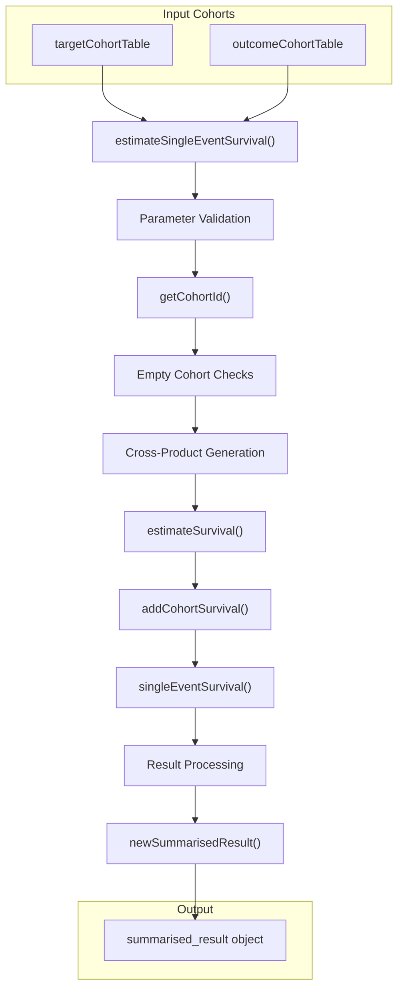
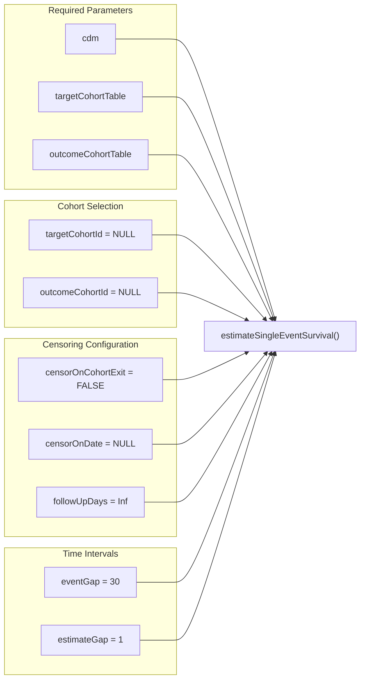
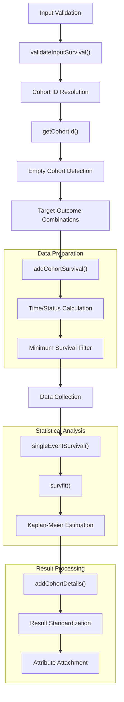
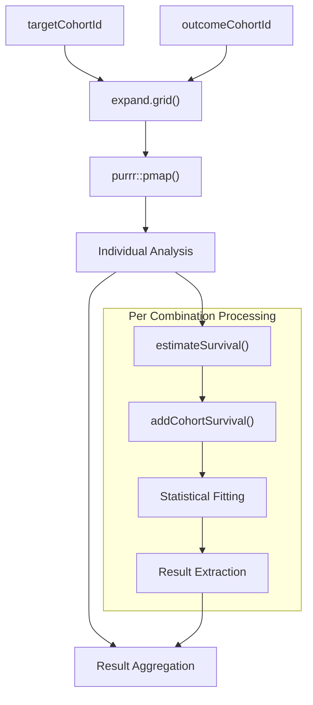
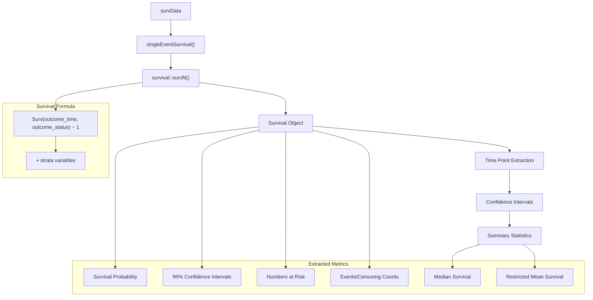
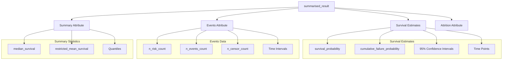
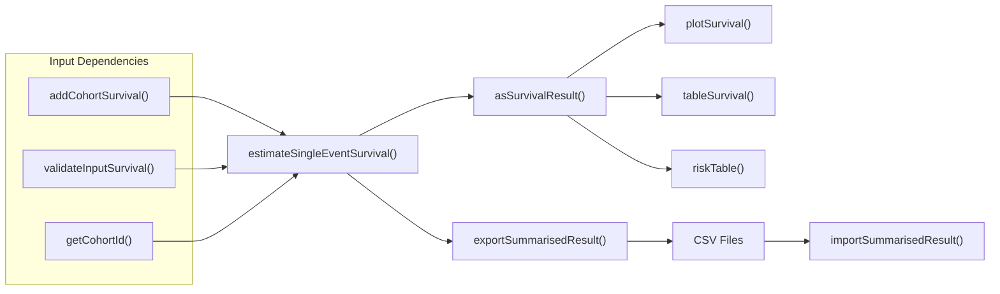

# Page: Single Event Survival Estimation

# Single Event Survival Estimation

<details>
<summary>Relevant source files</summary>

The following files were used as context for generating this wiki page:

- [R/estimateSurvival.R](R/estimateSurvival.R)
- [man/estimateCompetingRiskSurvival.Rd](man/estimateCompetingRiskSurvival.Rd)
- [man/estimateSingleEventSurvival.Rd](man/estimateSingleEventSurvival.Rd)
- [tests/testthat/test-estimateSurvival.R](tests/testthat/test-estimateSurvival.R)

</details>


This document covers the `estimateSingleEventSurvival` function, which performs time-to-event analysis for cohorts in the OMOP Common Data Model using Kaplan-Meier estimation. This function handles scenarios where only one outcome event type is of interest, without competing risks. For competing risk analysis with multiple outcome types, see [Competing Risk Survival Estimation](#2.2). For data preparation requirements, see [Data Preparation with addCohortSurvival](#2.3).

## Function Overview

The `estimateSingleEventSurvival` function serves as the primary interface for single-event survival analysis in the CohortSurvival package. It processes OMOP CDM cohort tables to estimate survival probabilities and related statistics over time.



**Function Data Flow Architecture**

Sources: [R/estimateSurvival.R:65-372](), [tests/testthat/test-estimateSurvival.R:7-83]()

## Parameter Configuration

The function accepts extensive configuration options to control survival analysis behavior:

| Parameter Category | Parameters | Purpose |
|-------------------|------------|---------|
| **Data Sources** | `cdm`, `targetCohortTable`, `outcomeCohortTable` | Define input cohort tables |
| **Cohort Selection** | `targetCohortId`, `outcomeCohortId` | Specify which cohorts to analyze |
| **Outcome Definition** | `outcomeDateVariable`, `outcomeWashout` | Configure outcome event identification |
| **Censoring** | `censorOnCohortExit`, `censorOnDate`, `followUpDays` | Control follow-up termination |
| **Analysis Options** | `strata`, `eventGap`, `estimateGap` | Define stratification and time intervals |
| **Statistical Parameters** | `restrictedMeanFollowUp`, `minimumSurvivalDays` | Set calculation constraints |



**Parameter Structure and Defaults**

Sources: [R/estimateSurvival.R:65-79](), [man/estimateSingleEventSurvival.Rd:7-23]()

## Data Processing Pipeline

The function implements a multi-stage data processing pipeline that transforms raw OMOP CDM cohort data into survival analysis inputs:



**Internal Data Processing Flow**

The pipeline handles multiple target-outcome combinations through a cross-product approach:



**Cross-Product Analysis Pattern**

Sources: [R/estimateSurvival.R:115-162](), [R/estimateSurvival.R:800-807]()

## Statistical Computation

The core statistical analysis employs the `survival` package for Kaplan-Meier estimation:



**Statistical Estimation Architecture**

The function supports stratified analysis through the `strata` parameter:

| Strata Configuration | Example | Usage Pattern |
|---------------------|---------|---------------|
| Single Variable | `list(c("age_group"))` | Age-based stratification |
| Multiple Variables | `list(c("age_group", "sex"))` | Combined stratification |
| Multiple Strata | `list(c("age"), c("sex"), c("age", "sex"))` | Separate and combined analyses |

Sources: [R/estimateSurvival.R:1061-1077](), [tests/testthat/test-estimateSurvival.R:96-103]()

## Output Structure

The function returns a `summarised_result` object containing survival estimates, events data, summary statistics, and attrition information:



**Result Object Structure**

The standardized output follows the `omopgenerics` framework with specific result types:

| Result Type | Variable Names | Estimate Names |
|-------------|---------------|----------------|
| `survival_probability` | `outcome` | `estimate`, `estimate_95CI_lower`, `estimate_95CI_upper` |
| `survival_events` | `outcome` | `n_risk_count`, `n_events_count`, `n_censor_count` |
| `survival_summary` | `outcome` | `median_survival`, `restricted_mean_survival` |
| `survival_attrition` | Various | `number_records`, `number_subjects` |

Sources: [R/estimateSurvival.R:881-912](), [R/estimateSurvival.R:914-944]()

## Usage Examples

### Basic Single Event Analysis

```r
cdm <- mockMGUS2cdm()
surv <- estimateSingleEventSurvival(
  cdm = cdm,
  targetCohortTable = "mgus_diagnosis",
  targetCohortId = 1,
  outcomeCohortTable = "death_cohort",
  outcomeCohortId = 1,
  eventGap = 7
)
```

### Stratified Analysis

```r
surv_stratified <- estimateSingleEventSurvival(
  cdm = cdm,
  targetCohortTable = "mgus_diagnosis",
  targetCohortId = 1,
  outcomeCohortTable = "death_cohort",
  outcomeCohortId = 1,
  strata = list(
    "age_group" = c("age"),
    "sex" = c("sex"),
    "age_and_sex" = c("age", "sex")
  )
)
```

### Multiple Cohort Analysis

```r
# Automatically analyzes all combinations
surv_multiple <- estimateSingleEventSurvival(
  cdm = cdm,
  targetCohortTable = "exposure_cohort",
  outcomeCohortTable = "outcome_cohort"
  # targetCohortId and outcomeCohortId default to all available
)
```

**Function Usage Patterns**

Sources: [tests/testthat/test-estimateSurvival.R:7-15](), [tests/testthat/test-estimateSurvival.R:85-103](), [man/estimateSingleEventSurvival.Rd:76-86]()

## Integration Points

The function integrates with other CohortSurvival components through standardized interfaces:



**Package Integration Architecture**

The function produces `omopgenerics`-compliant outputs that integrate seamlessly with the broader OMOP ecosystem and downstream visualization/analysis tools.

Sources: [R/estimateSurvival.R:313-314](), [tests/testthat/test-estimateSurvival.R:15]()