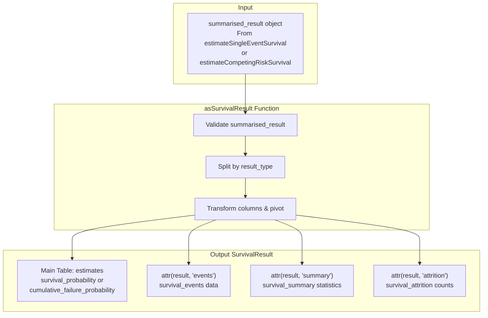
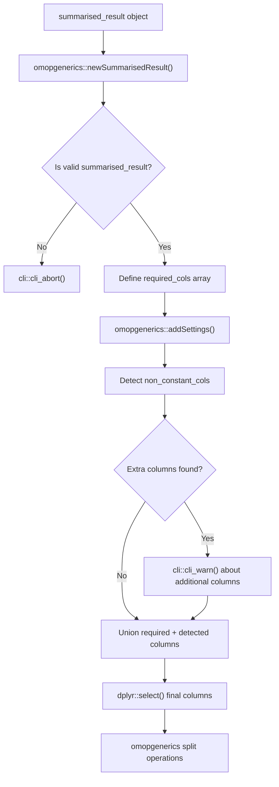
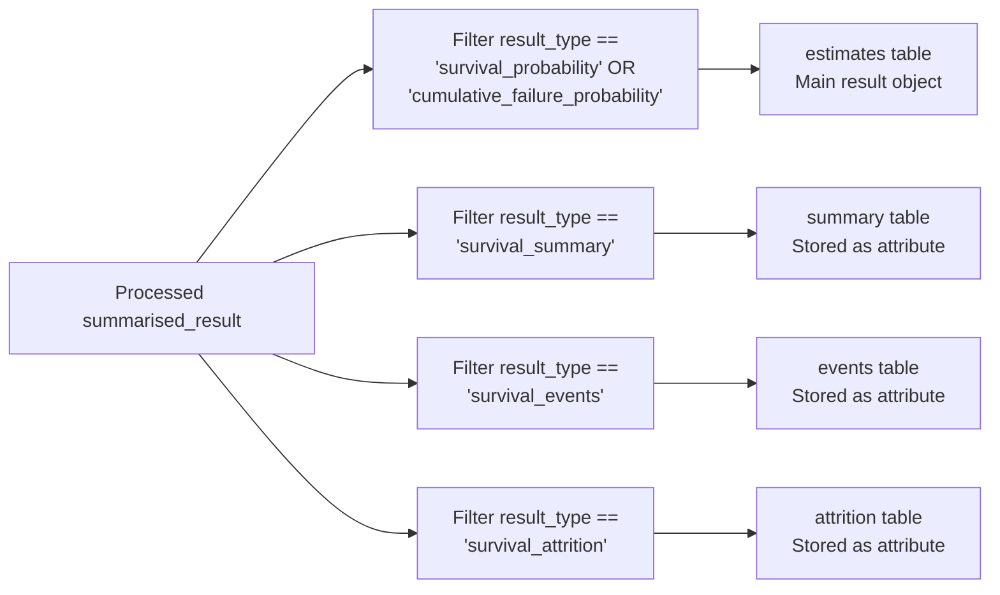

# Page: SurvivalResult Objects

# SurvivalResult Objects

<details>
<summary>Relevant source files</summary>

The following files were used as context for generating this wiki page:

- [R/asSurvivalResult.R](R/asSurvivalResult.R)
- [vignettes/a01_Single_event_of_interest.Rmd](vignettes/a01_Single_event_of_interest.Rmd)

</details>


This document explains the `SurvivalResult` object format and the `asSurvivalResult()` function that converts standardized survival analysis results into a more intuitive structure for manual inspection and specialized survival workflows.

For information about the underlying `summarised_result` format that serves as input, see the omopgenerics documentation. For visualization functions that work with both formats, see [Plotting Survival Curves](#4.1) and [Generating Summary Tables](#4.2).

## Purpose and Scope

The `SurvivalResult` format provides an alternative representation of survival analysis results that prioritizes ease of data inspection and manual analysis over standardization. While the standard `summarised_result` format enables integration with the broader OMOP ecosystem, the `SurvivalResult` format organizes survival-specific data into a more intuitive structure with dedicated components for estimates, events, summary statistics, and attrition information.

## SurvivalResult Object Structure

The `asSurvivalResult()` function transforms a `summarised_result` object into a specialized survival format with the following structure:



**Sources:** [R/asSurvivalResult.R:40-130]()

## Conversion Process

### Input Validation and Column Management

The `asSurvivalResult()` function begins by validating the input and managing column structure:



The function defines a set of required columns and automatically detects additional non-constant columns that contain varying data, warning users about their inclusion.

**Sources:** [R/asSurvivalResult.R:40-71]()

### Data Segmentation by Result Type

The function segments the data into four distinct components based on the `result_type` column:

| Component | Result Type Filter | Purpose |
|-----------|-------------------|---------|
| `estimates` | `survival_probability`, `cumulative_failure_probability` | Main survival/failure curves |
| `summary` | `survival_summary` | Overall statistics (median survival, RMST) |
| `events` | `survival_events` | Event counts and timing |
| `attrition` | `survival_attrition` | Cohort attrition information |



**Sources:** [R/asSurvivalResult.R:73-123]()

### Column Transformations

Each component undergoes specific transformations to improve usability:

- **Time Conversion**: Converts `time` columns to numeric format for estimates and events
- **Column Reorganization**: Moves `outcome` and `competing_outcome` columns after `target_cohort`
- **Estimate Pivoting**: Uses `omopgenerics::pivotEstimates()` to create wide format tables
- **Variable Renaming**: Renames `variable_level` to `variable` for clarity
- **Count Cleaning**: Removes `_count` suffix from estimate names

**Sources:** [R/asSurvivalResult.R:78-113]()

## Usage Examples

### Basic Conversion

The most common usage involves converting results from survival estimation functions:

```r
# From the vignette example
MGUS_death_survresult <- MGUS_death %>% 
  asSurvivalResult()
```

### Accessing Components

The resulting object provides direct access to different data components:

```r
# Main estimates table
head(MGUS_death_survresult)

# Events information
attr(MGUS_death_survresult, "events")

# Summary statistics  
attr(MGUS_death_survresult, "summary")

# Attrition data
attr(MGUS_death_survresult, "attrition")
```

### Filtering and Analysis

The format enables straightforward data filtering and analysis:

```r
# Filter specific time points
MGUS_death_survresult %>%
  filter(time %in% c(10:15))
```

**Sources:** [vignettes/a01_Single_event_of_interest.Rmd:170-190]()

## When to Use SurvivalResult Format

### Advantages
- **Direct Data Access**: Enables straightforward filtering and data manipulation
- **Intuitive Structure**: Separates different types of survival information logically
- **Manual Analysis**: Facilitates custom statistical analysis and data exploration
- **Reduced Complexity**: Simpler column structure compared to `summarised_result`

### Limitations
- **Lost Compatibility**: Visualization functions from CohortSurvival package do not work with this format
- **Reduced Standardization**: Cannot be easily combined with other omopgenerics-compliant results
- **Manual Attribute Management**: Requires explicit handling of attribute data

### Recommended Use Cases
- Manual data inspection and exploration
- Custom statistical analysis workflows
- Integration with non-omopgenerics visualization tools
- Detailed examination of specific time points or strata

**Sources:** [vignettes/a01_Single_event_of_interest.Rmd:164-183](), [R/asSurvivalResult.R:17-37]()

## Function Parameters and Validation

The `asSurvivalResult()` function accepts a single parameter:

| Parameter | Type | Description | Validation |
|-----------|------|-------------|------------|
| `result` | `summarised_result` | Output from survival estimation functions | Must pass `inherits(result, "summarised_result")` |

The function performs comprehensive validation and will abort with clear error messages if the input is not a valid `summarised_result` object.

**Sources:** [R/asSurvivalResult.R:40-44]()