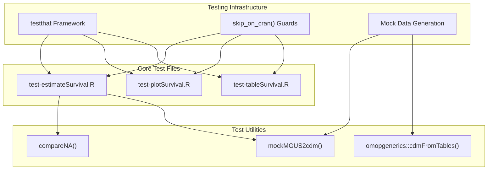
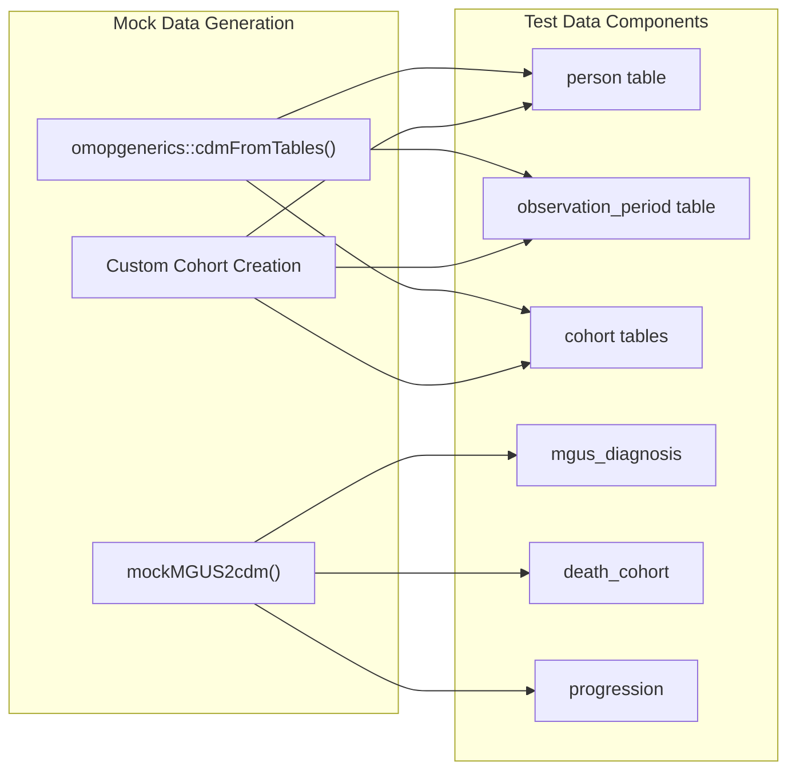
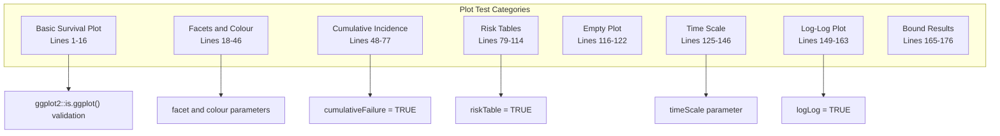
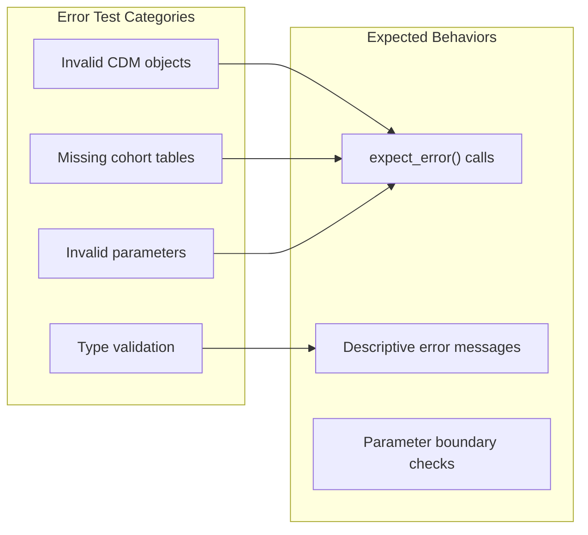

# Page: Testing Framework

# Testing Framework

<details>
<summary>Relevant source files</summary>

The following files were used as context for generating this wiki page:

- [tests/testthat/test-estimateSurvival.R](tests/testthat/test-estimateSurvival.R)
- [tests/testthat/test-plotSurvival.R](tests/testthat/test-plotSurvival.R)
- [tests/testthat/test-tableSurvival.R](tests/testthat/test-tableSurvival.R)

</details>


## Purpose and Scope

This document covers the comprehensive testing framework used in the CohortSurvival package to ensure reliability and correctness of survival analysis functions. The testing suite validates core functionality including single event and competing risk survival estimation, data visualization, and result formatting. For information about package structure and dependencies, see [Package Structure and Dependencies](#7.2). For contribution guidelines and CI/CD processes, see [Contributing and CI/CD](#7.3).

## Testing Framework Overview

The CohortSurvival package uses the `testthat` framework for unit testing, following R package testing best practices. The test suite is organized into focused test files that validate different aspects of the package functionality, from core survival estimation to visualization and table generation.



**Sources:** [tests/testthat/test-estimateSurvival.R:1-1402](), [tests/testthat/test-plotSurvival.R:1-177](), [tests/testthat/test-tableSurvival.R:1-140]()

## Test Organization and Structure

The testing framework is organized into three main test files, each focusing on specific package functionality:

| Test File | Primary Focus | Key Functions Tested |
|-----------|---------------|---------------------|
| `test-estimateSurvival.R` | Core survival analysis | `estimateSingleEventSurvival()`, `estimateCompetingRiskSurvival()` |
| `test-plotSurvival.R` | Visualization | `plotSurvival()` |
| `test-tableSurvival.R` | Table generation | `tableSurvival()` |

Each test file follows a consistent pattern of testing normal operation, edge cases, error conditions, and parameter validation.

**Sources:** [tests/testthat/test-estimateSurvival.R:7-83](), [tests/testthat/test-plotSurvival.R:1-17](), [tests/testthat/test-tableSurvival.R:1-85]()

## Core Survival Estimation Tests

The `test-estimateSurvival.R` file contains the most comprehensive test coverage, validating both single event and competing risk survival analysis scenarios.

```mermaid
graph TD
    subgraph "test-estimateSurvival.R Test Categories"
        mgus_basic["MGUS Basic Tests<br/>Lines 7-83"]
        mgus_strata["MGUS Strata Tests<br/>Lines 85-196"] 
        multi_exposure["Multiple Exposures<br/>Lines 198-362"]
        multi_competing["Multiple Competing<br/>Lines 364-576"]
        estimate_gap["Estimate Gap Tests<br/>Lines 578-727"]
        functionality["Functionality Tests<br/>Lines 729-1259"]
        cohort_ids["Different Cohort IDs<br/>Lines 1261-1380"]
        error_tests["Error Handling<br/>Lines 1382-1402"]
        within_cohort["Within Cohort<br/>Lines 1404-1477"]
        strata_specific["Strata Specific<br/>Lines 1479-1730"]
    end
    
    mgus_basic --> estimateSingleEventSurvival["estimateSingleEventSurvival()"]
    mgus_basic --> estimateCompetingRiskSurvival["estimateCompetingRiskSurvival()"]
    mgus_strata --> asSurvivalResult["asSurvivalResult()"]
    multi_exposure --> mockMGUS2cdm["mockMGUS2cdm()"]
    functionality --> censorOnCohortExit["censorOnCohortExit parameter"]
    functionality --> followUpDays["followUpDays parameter"]
    functionality --> censorOnDate["censorOnDate parameter"]
```



### Key Test Patterns

The tests employ several important patterns for comprehensive validation:

1. **Mock Data Creation**: Uses `mockMGUS2cdm()` and custom cohort definitions to create test scenarios
2. **Result Validation**: Checks survival probabilities, confidence intervals, and time points
3. **Attribute Testing**: Validates attached attributes like events and summary data
4. **Parameter Combinations**: Tests various parameter combinations and edge cases

**Sources:** [tests/testthat/test-estimateSurvival.R:7-83](), [tests/testthat/test-estimateSurvival.R:85-196](), [tests/testthat/test-estimateSurvival.R:729-1259]()

## Mock Data and Test Utilities

The testing framework relies on several utility functions to create consistent and reliable test data:

### Mock Data Functions



### Utility Functions

The tests include helper functions for validation:

- `compareNA()`: Compares vectors handling NA values properly [tests/testthat/test-estimateSurvival.R:1-5]()
- Database connection management with `DBI::dbConnect()` and `CDMConnector::copyCdmTo()`
- Consistent cleanup with `CDMConnector::cdmDisconnect()`

**Sources:** [tests/testthat/test-estimateSurvival.R:1-5](), [tests/testthat/test-estimateSurvival.R:200-270](), [tests/testthat/test-estimateSurvival.R:272-276]()

## Visualization and Output Tests

### Plot Testing

The `test-plotSurvival.R` file validates the `plotSurvival()` function across various scenarios:



### Table Testing

The `test-tableSurvival.R` file focuses on validating table generation functionality:

- Column structure validation for different result types
- Time scale conversions (days, months, years)
- Header and formatting options
- Integration with different output formats (`gt`, `flextable`, `tibble`)

**Sources:** [tests/testthat/test-plotSurvival.R:1-177](), [tests/testthat/test-tableSurvival.R:1-140]()

## Running Tests

### Local Testing

Tests can be run locally using standard R testing commands:

```r
# Run all tests
testthat::test_local()

# Run specific test file
testthat::test_file("tests/testthat/test-estimateSurvival.R")

# Run with coverage
covr::package_coverage()
```

### CRAN Testing Guards

Many tests use `skip_on_cran()` to avoid long-running tests during CRAN checks:

```r
test_that("mgus example: no Competing risk, strata", {
  skip_on_cran()
  # ... test implementation
})
```

This ensures that comprehensive tests run in development environments while keeping CRAN submission tests focused and fast.

**Sources:** [tests/testthat/test-estimateSurvival.R:86](), [tests/testthat/test-plotSurvival.R:2](), [tests/testthat/test-tableSurvival.R:2]()

## Test Categories and Coverage

### Error Handling Tests

The framework includes dedicated error handling tests that validate proper error messages for invalid inputs:



### Edge Case Testing

The test suite includes comprehensive edge case coverage:

- Single-value strata
- Empty results 
- Boundary conditions for time intervals
- Mixed cohort configurations
- Database connection edge cases

**Sources:** [tests/testthat/test-estimateSurvival.R:1382-1402](), [tests/testthat/test-tableSurvival.R:87-105](), [tests/testthat/test-plotSurvival.R:116-122]()

## Test Data Validation Patterns

The testing framework employs consistent patterns for validating survival analysis results:

### Result Structure Validation

```r
# Typical validation pattern
expect_true(tibble::is_tibble(surv))
expect_true(all(c("cdm_name", "result_type", "target_cohort", 
                  "outcome", "variable", "estimate") %in% colnames(surv)))
```

### Statistical Validation

Tests validate statistical correctness by checking:
- Survival probability ranges (0 to 1)
- Monotonic decrease in survival curves
- Confidence interval bounds
- Event counts and censoring patterns

### Attribute Validation

Tests verify that result objects maintain proper attributes:
- `events` attribute with risk tables
- `summary` attribute with statistical summaries
- Consistent column naming across attributes

**Sources:** [tests/testthat/test-estimateSurvival.R:16-38](), [tests/testthat/test-estimateSurvival.R:820-840](), [tests/testthat/test-estimateSurvival.R:988-992]()