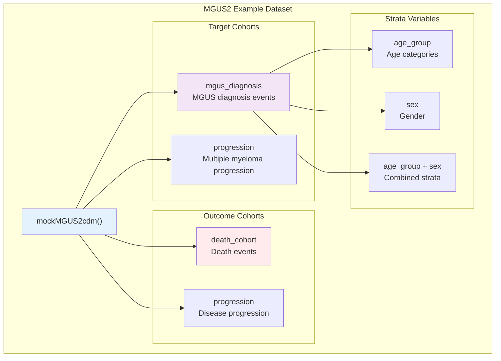
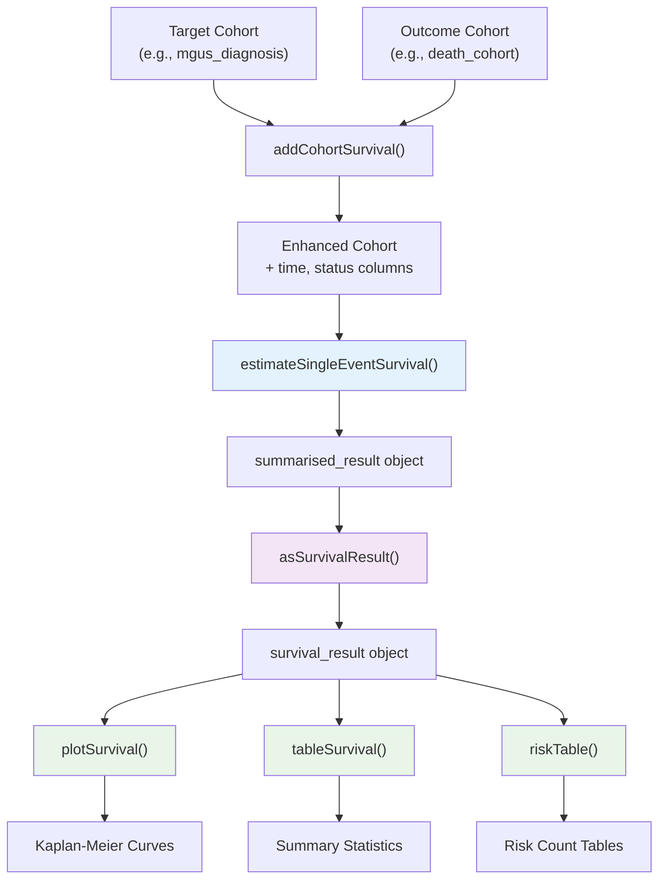
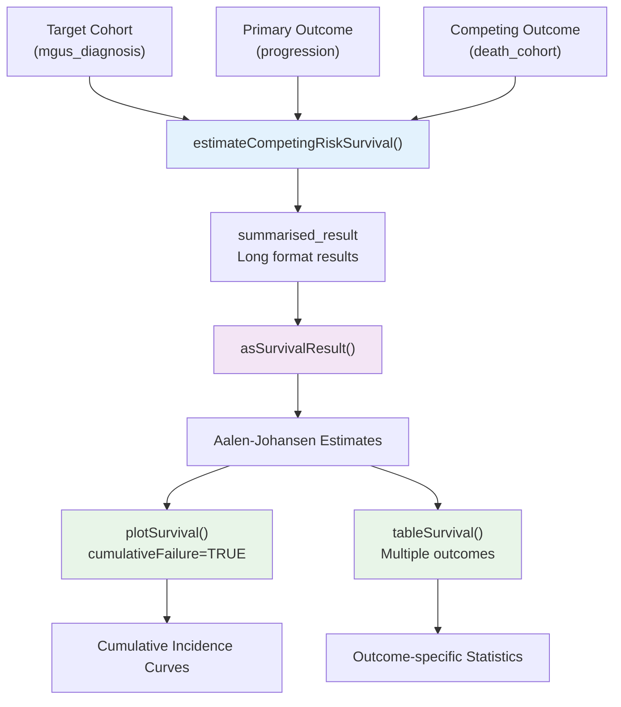
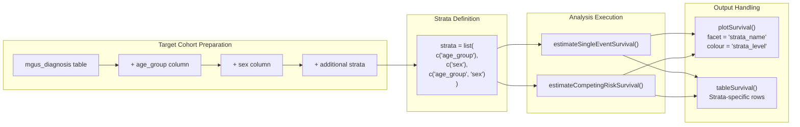
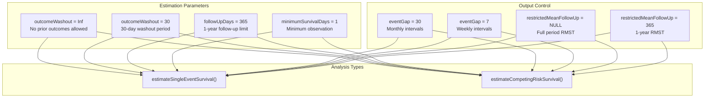
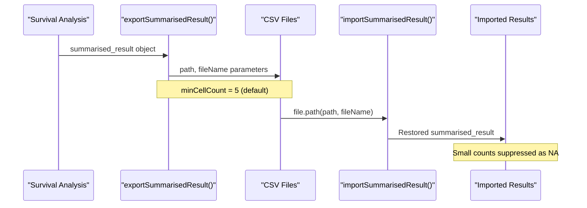

# Page: User Guides and Examples

# User Guides and Examples

Relevant source files

The following files were used as context for generating this wiki page:

- [README.Rmd](README.Rmd)
- [tests/testthat/test-addCohortSurvival.R](tests/testthat/test-addCohortSurvival.R)
- [vignettes/a01_Single_event_of_interest.Rmd](vignettes/a01_Single_event_of_interest.Rmd)
- [vignettes/a02_Competing_risk_survival.Rmd](vignettes/a02_Competing_risk_survival.Rmd)

This page provides practical tutorials and real-world examples demonstrating how to use CohortSurvival for common survival analysis tasks within the OMOP CDM ecosystem. The examples progress from basic single-event survival analysis to more complex competing risk scenarios, using the MGUS2 dataset as a consistent case study.

For detailed API documentation of individual functions, see [Core Analysis Functions](#6.1). For information about visualization options and customization, see [Plotting Survival Curves](#4.1) and [Generating Summary Tables](#4.2).

## Tutorial Approach and Dataset

The user guides utilize a systematic approach centered around the MGUS2 dataset, which contains survival data for 1341 patients with monoclonal gammopathy of undetermined significance. This dataset has been transformed from the original `survival` package format into OMOP CDM-compliant cohort tables for demonstration purposes.

### Tutorial Data Structure

**Dataset Creation and Basic Analysis Workflow**

Sources: [README.Rmd:45-46](), [vignettes/a01_Single_event_of_interest.Rmd:32-33](), [vignettes/a02_Competing_risk_survival.Rmd:32-33]()

## Core Analysis Patterns

The package supports three primary analysis patterns that map directly to specific function calls and data requirements:

### Single Event Survival Analysis

**Basic Single Event Analysis Example**

The fundamental pattern involves connecting a target cohort to an outcome cohort through the `estimateSingleEventSurvival()` function:

Sources: [README.Rmd:75-79](), [vignettes/a01_Single_event_of_interest.Rmd:62-67]()

### Competing Risk Survival Analysis

**Competing Risk Analysis Pattern**

This pattern extends single-event analysis by adding a competing outcome that prevents observation of the primary outcome:

Sources: [README.Rmd:111-115](), [vignettes/a02_Competing_risk_survival.Rmd:57-61]()

## Stratified Analysis Implementation

Stratification allows survival estimation across subgroups defined by cohort characteristics. The strata must exist as columns in the target cohort table before analysis.

### Stratification Setup and Execution

**Multi-level Stratification Example**

The package supports complex stratification patterns including single variables and variable combinations:

Sources: [README.Rmd:93-99](), [vignettes/a01_Single_event_of_interest.Rmd:245-251](), [vignettes/a02_Competing_risk_survival.Rmd:87-92]()

## Data Preparation and Validation Workflow

The `addCohortSurvival()` function performs critical data preparation by calculating survival times and event status indicators before analysis.

### Data Enhancement Process

| Parameter | Purpose | Example Usage |
|-----------|---------|---------------|
| `outcomeCohortTable` | Specifies outcome cohort | `"death_cohort"` |
| `outcomeCohortId` | Identifies specific outcome | `1` |
| `outcomeWashout` | Excludes prior outcomes | `Inf` (default) |
| `followUpDays` | Limits observation period | `365` for 1-year follow-up |
| `censorOnCohortExit` | Censors at cohort end | `TRUE`/`FALSE` |
| `censorOnDate` | Censors at specific date | `as.Date("2021-12-31")` |

**Key Data Preparation Scenarios**

Sources: [tests/testthat/test-addCohortSurvival.R:166-277](), [tests/testthat/test-addCohortSurvival.R:279-383](), [tests/testthat/test-addCohortSurvival.R:385-495]()

## Analysis Parameter Customization

### Common Parameter Combinations

**Parameter Impact on Analysis**

Different parameter combinations enable various study designs and follow-up scenarios:

Sources: [vignettes/a01_Single_event_of_interest.Rmd:196-211](), [vignettes/a01_Single_event_of_interest.Rmd:213-236]()

## Result Export and Import

The package integrates with `omopgenerics` export/import functionality for result persistence and sharing:

### Export/Import Workflow

**Data Persistence Example**

The export process automatically applies cell count suppression (default minimum count = 5) for privacy protection:

Sources: [vignettes/a01_Single_event_of_interest.Rmd:337-351]()

## Multiple Cohort Analysis Patterns

### Combining Multiple Target or Outcome Cohorts

The package supports analysis of multiple cohorts through two approaches:

1. **Separate Analyses with Result Binding**: Run individual analyses and combine using `omopgenerics::bind()`
2. **Unified Cohort Tables**: Create combined cohort tables with different `cohort_definition_id` values

**Multiple Target Cohort Example**

Sources: [vignettes/a01_Single_event_of_interest.Rmd:294-307]()

**Multiple Outcome Cohort Example** 

Sources: [vignettes/a01_Single_event_of_interest.Rmd:313-323]()

## Advanced Analysis Features

### Proportional Hazards Assessment

The `plotSurvival()` function includes a `logLog = TRUE` parameter for visual assessment of proportional hazards assumptions through log-log plots:

Sources: [vignettes/a01_Single_event_of_interest.Rmd:325-330]()

### Within-Cohort Survival Analysis

The package supports survival analysis where the target and outcome cohorts are the same table, using different date variables:

Sources: [tests/testthat/test-addCohortSurvival.R:583-681]()

## Next Steps

For specific implementation details:
- See [Single Event Survival Analysis Tutorial](#5.1) for step-by-step single-event analysis
- See [Competing Risk Analysis Tutorial](#5.2) for comprehensive competing risk examples  
- See [Advanced Analysis Techniques](#5.3) for integration with external packages and custom workflows
- Review [Core Analysis Functions](#6.1) for complete parameter specifications

Sources: [README.Rmd:1-147](), [vignettes/a01_Single_event_of_interest.Rmd:1-360](), [vignettes/a02_Competing_risk_survival.Rmd:1-119]()