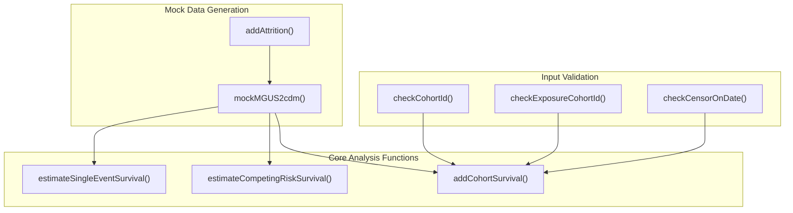
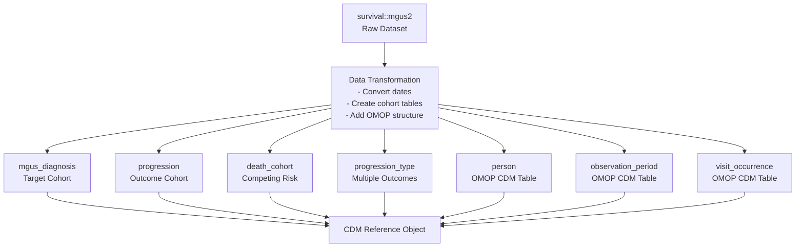
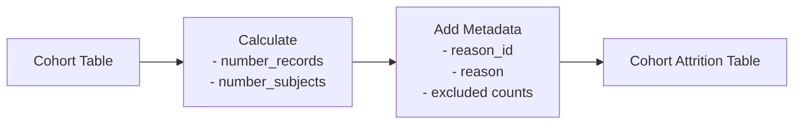
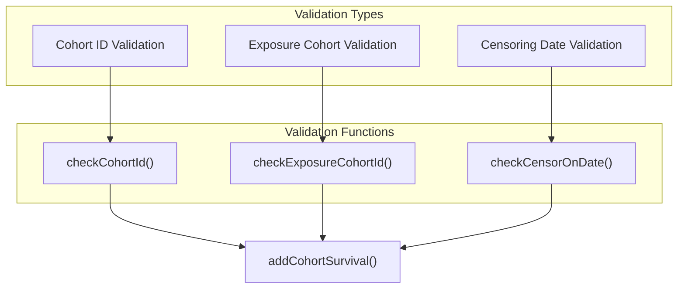
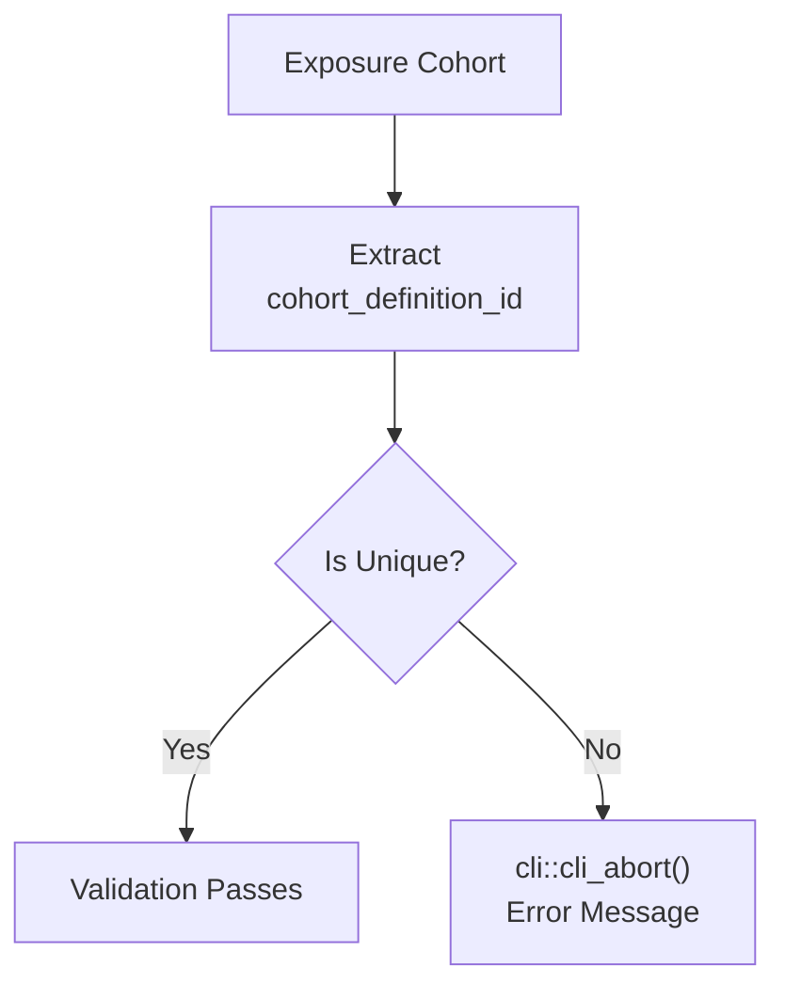
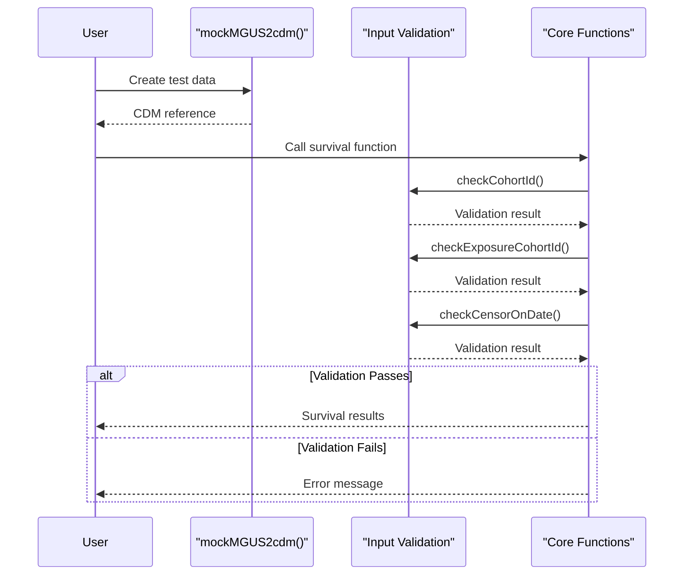
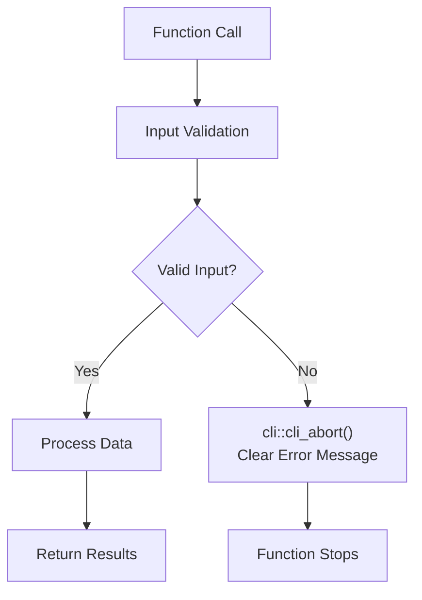

# Page: Utility and Helper Functions

# Utility and Helper Functions

Relevant source files

The following files were used as context for generating this wiki page:

- [R/inputValidation.R](R/inputValidation.R)
- [R/mockMGUS2cdm.R](R/mockMGUS2cdm.R)
- [man/addCohortSurvival.Rd](man/addCohortSurvival.Rd)

This page documents the supporting functions in CohortSurvival that facilitate data validation, mock data generation, and internal processing. These functions work behind the scenes to ensure data integrity and provide testing capabilities for the core survival analysis functions.

For information about the primary survival estimation functions, see [Core Survival Analysis Functions](#2). For details about data preparation with `addCohortSurvival`, see [Data Preparation with addCohortSurvival](#2.3).

## Overview of Utility Function Categories

The CohortSurvival package includes several categories of utility functions that support the main survival analysis workflow:

**Sources**: [R/mockMGUS2cdm.R:1-226](), [R/inputValidation.R:1-53]()

## Mock Data Generation Functions

### mockMGUS2cdm Function

The `mockMGUS2cdm()` function creates a complete CDM reference object using the well-known MGUS (Monoclonal Gammopathy of Undetermined Significance) dataset from the survival package. This function is essential for examples, testing, and demonstrations.

| Function | Purpose | Return Type |
|----------|---------|-------------|
| `mockMGUS2cdm()` | Creates CDM reference with MGUS survival data | CDM reference object |

#### Data Transformation Process

**Sources**: [R/mockMGUS2cdm.R:27-192]()

The function performs several key transformations:

1. **Date Calculations**: Converts the original time variables into proper date columns
2. **Cohort Creation**: Generates multiple cohort tables for different survival scenarios
3. **OMOP Compliance**: Structures data according to OMOP CDM standards
4. **Database Setup**: Creates an in-memory DuckDB database for testing

#### Cohort Tables Generated

| Cohort Table | Description | Cohort IDs |
|--------------|-------------|------------|
| `mgus_diagnosis` | Target cohort with MGUS diagnosis | 1 |
| `progression` | Single progression outcome | 1 |
| `progression_type` | Multiple progression types | 1, 2, 3 |
| `death_cohort` | Death as competing risk | 1 |

**Sources**: [R/mockMGUS2cdm.R:47-124]()

### addAttrition Helper Function

The internal `addAttrition()` function creates cohort attrition tables that comply with omopgenerics standards:

**Sources**: [R/mockMGUS2cdm.R:194-225]()

## Input Validation Functions

The package includes several validation functions that ensure data integrity and prevent common errors during survival analysis.

### Validation Function Overview

**Sources**: [R/inputValidation.R:17-52]()

### checkCohortId Function

Validates that specified cohort IDs exist in the cohort table:

| Parameter | Type | Description |
|-----------|------|-------------|
| `cohort` | cohort table | Cohort table to validate against |
| `cohortId` | integer vector | Cohort IDs to check |

**Validation Logic**:
- Checks that `cohortId` is an integer vector
- Verifies all specified IDs exist in the cohort settings
- Returns boolean indicating validity

**Sources**: [R/inputValidation.R:17-26]()

### checkExposureCohortId Function

Ensures the exposure cohort contains only one unique cohort definition ID:

This validation prevents issues during survival analysis where multiple exposure cohorts could cause ambiguous results.

**Sources**: [R/inputValidation.R:28-39]()

### checkCensorOnDate Function

Validates that the censoring date is appropriate for the cohort data:

| Validation | Logic |
|------------|-------|
| Date comparison | `max(cohort$cohort_start_date) <= censorOnDate` |
| Error condition | Any cohort start date after censor date |

**Sources**: [R/inputValidation.R:41-52]()

## Function Integration in Analysis Workflow

The utility functions integrate seamlessly into the main survival analysis workflow:

**Sources**: [R/mockMGUS2cdm.R:27-192](), [R/inputValidation.R:17-52]()

## Usage Patterns

### Testing and Development

The mock data function is primarily used for:
- **Package Examples**: Providing consistent test data for documentation
- **Unit Testing**: Creating reproducible test scenarios
- **User Experimentation**: Allowing users to explore functionality without their own data

### Input Validation Integration

The validation functions are called internally by core functions to:
- **Prevent Runtime Errors**: Catch invalid inputs before processing
- **Provide Clear Error Messages**: Use `cli::cli_abort()` for user-friendly errors
- **Ensure Data Consistency**: Validate assumptions about cohort structure

### Error Handling Strategy

**Sources**: [R/inputValidation.R:35-37](), [R/inputValidation.R:47-50]()

These utility and helper functions ensure the CohortSurvival package maintains high data quality standards while providing convenient testing capabilities for both developers and users.