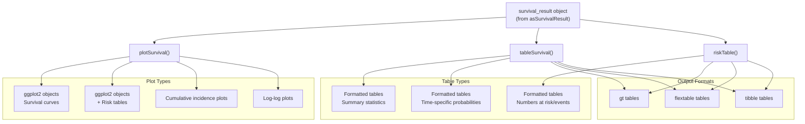
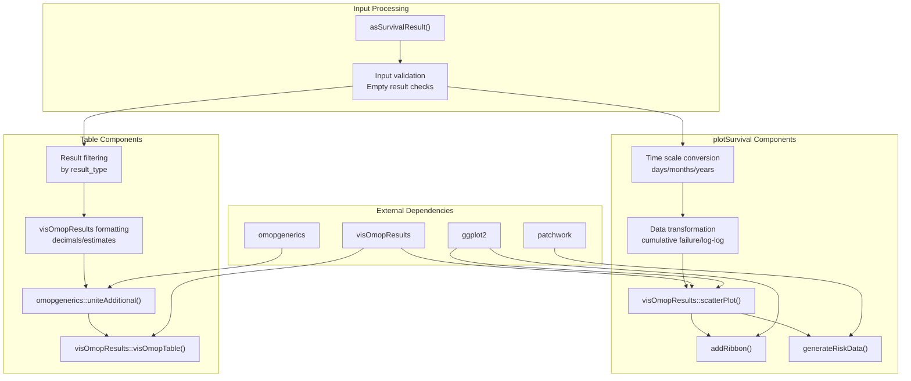
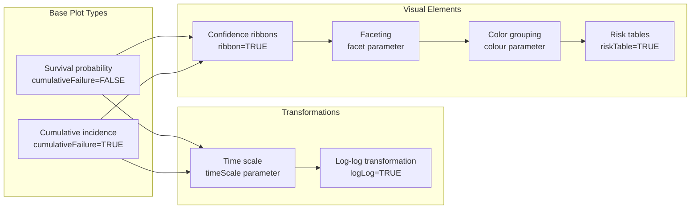
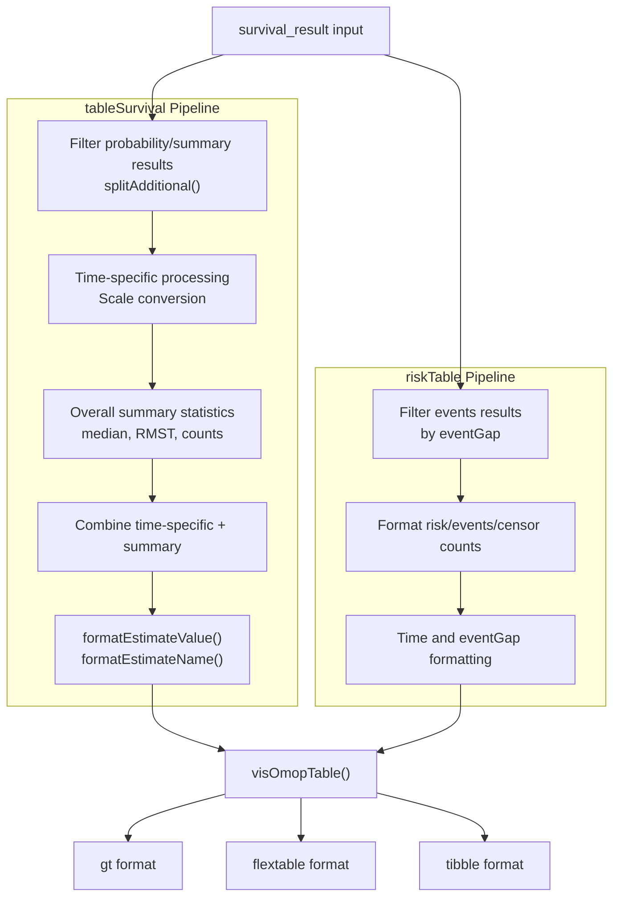
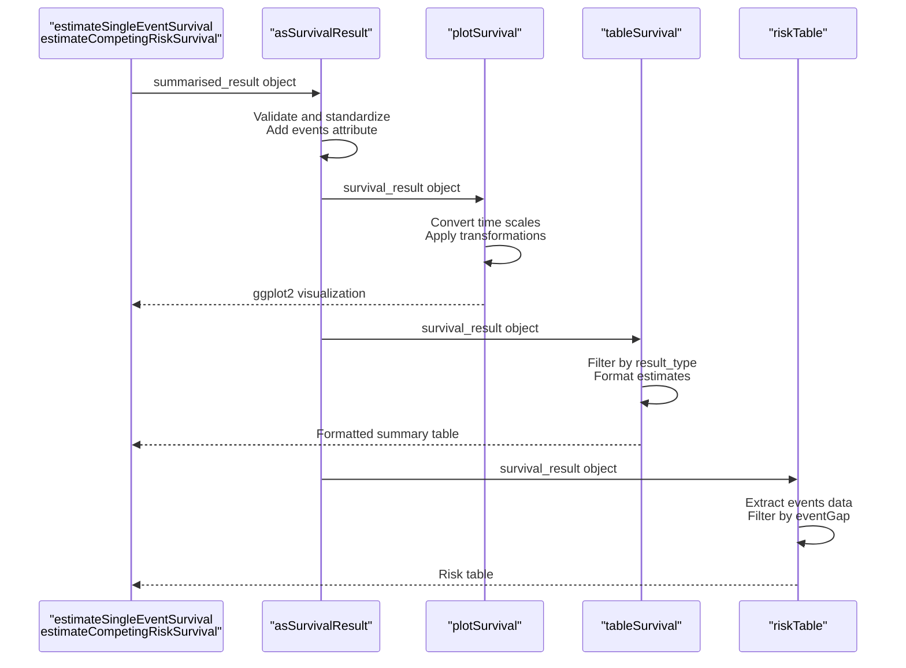

# Page: Visualization and Output

# Visualization and Output

Relevant source files

The following files were used as context for generating this wiki page:

- [R/plotSurvival.R](R/plotSurvival.R)
- [R/tableSurvival.R](R/tableSurvival.R)
- [tests/testthat/test-plotSurvival.R](tests/testthat/test-plotSurvival.R)

This document covers the visualization and output capabilities of CohortSurvival, including survival plot generation, summary table creation, and risk table formatting. These functions transform survival analysis results into publication-ready visualizations and tables for clinical research and reporting.

The three core output functions work with standardized `survival_result` objects to produce different types of outputs: `plotSurvival` creates Kaplan-Meier curves and cumulative incidence plots, `tableSurvival` generates summary statistics tables, and `riskTable` produces numbers-at-risk tables. For detailed usage of individual functions, see [Plotting Survival Curves](#4.1), [Generating Summary Tables](#4.2), and [Risk Tables and Event Counts](#4.3).

## Output Generation Workflow

The visualization and output system follows a standardized pipeline that transforms survival analysis results into various presentation formats:

Sources: [R/plotSurvival.R:42-247](), [R/tableSurvival.R:44-276](), [R/tableSurvival.R:329-437]()

## Core Visualization Functions

The package provides three primary functions for generating outputs from survival analysis results:

| Function | Purpose | Key Parameters | Output Type |
|----------|---------|----------------|-------------|
| `plotSurvival` | Survival curves and plots | `ribbon`, `facet`, `colour`, `cumulativeFailure`, `riskTable`, `timeScale`, `logLog` | ggplot2 objects |
| `tableSurvival` | Summary statistics tables | `times`, `timeScale`, `header`, `type`, `.options` | Formatted tables |
| `riskTable` | Numbers at risk tables | `eventGap`, `header`, `type`, `.options` | Formatted tables |

### Function Integration Architecture

Sources: [R/plotSurvival.R:62-63](), [R/plotSurvival.R:113-129](), [R/tableSurvival.R:67-72](), [R/tableSurvival.R:264-273]()

## Visualization Capabilities

### Plot Types and Transformations

The `plotSurvival` function supports multiple visualization modes through parameter combinations:

Sources: [R/plotSurvival.R:23-24](), [R/plotSurvival.R:27-28](), [R/plotSurvival.R:46-50](), [R/plotSurvival.R:101-109]()

### Parameter Dependencies and Constraints

The visualization functions have specific parameter dependencies and validation rules:

- **Competing Risk Constraint**: When `result_type` is `"cumulative_failure_probability"`, `cumulativeFailure` must be `TRUE` [R/plotSurvival.R:77-79]()
- **Time Scale Conversion**: Automatic conversion between days, months, and years with appropriate axis labeling [R/plotSurvival.R:65-75]()
- **Risk Table Integration**: When `riskTable=TRUE`, generates combined plots using `patchwork` for layout [R/plotSurvival.R:135-244]()
- **Log-Log Transformation**: Applies `log(-log(estimate))` transformation for diagnostic plots [R/plotSurvival.R:102-106]()

## Table Generation System

### Summary Table Architecture

The table generation system processes survival results through a multi-stage pipeline:

Sources: [R/tableSurvival.R:67-72](), [R/tableSurvival.R:168-228](), [R/tableSurvival.R:350-369](), [R/tableSurvival.R:369-387]()

### Table Content Organization

Tables organize survival statistics into standardized categories with specific estimate names and formatting:

| Estimate Type | tableSurvival | riskTable | 
|---------------|---------------|-----------|
| **Summary Statistics** | `"Number records"`, `"Number events"`, `"median_survival"`, `"restricted_mean_survival"` | - |
| **Time-specific Probabilities** | User-defined `times` with confidence intervals | - |
| **Event Counts** | - | `"Number at risk"`, `"Number events"`, `"Number censored"` |

Sources: [R/tableSurvival.R:179-183](), [R/tableSurvival.R:371-376]()

## Integration with Analysis Results

### Data Flow from Analysis to Output

The output functions seamlessly integrate with the broader CohortSurvival analysis pipeline:

Sources: [R/plotSurvival.R:62](), [R/tableSurvival.R:67](), [R/tableSurvival.R:339]()

### Result Type Compatibility

Different analysis types produce specific result types that determine output compatibility:

- **Single Event Analysis**: Produces `"survival_probability"` results, compatible with all output functions
- **Competing Risk Analysis**: Produces `"cumulative_failure_probability"` results, requires `cumulativeFailure=TRUE` in plots
- **Events Data**: All analyses produce `"events"` results for risk table generation

Sources: [R/plotSurvival.R:77-89](), [R/tableSurvival.R:69](), [R/tableSurvival.R:352]()