# Convert JSON results file case — convertJsonResultsFileCase • DataQualityDashboard

Toggle navigation [DataQualityDashboard](../index.html) 2.7.0

  * [ ](../index.html)
  * [Get started](../articles/DataQualityDashboard.html)
  * [Reference](../reference/index.html)
  * Articles 
    * [DQ Check Failure Thresholds](../articles/Thresholds.html)
    * [DQ Check Statuses](../articles/CheckStatusDefinitions.html)
    * [Adding a New Data Quality Check](../articles/AddNewCheck.html)
    * [DQD for Cohorts](../articles/DqdForCohorts.html)
    * [SQL-only Mode](../articles/SqlOnly.html)
  * Data Quality Check Types 
    * [Index](../articles/checkIndex.html)
    * [cdmTable](../articles/checks/cdmTable.html)
    * [cdmField](../articles/checks/cdmField.html)
    * [cdmDatatype](../articles/checks/cdmDatatype.html)
    * [isPrimaryKey](../articles/checks/isPrimaryKey.html)
    * [isForeignKey](../articles/checks/isForeignKey.html)
    * [isRequired](../articles/checks/isRequired.html)
    * [fkDomain](../articles/checks/fkDomain.html)
    * [fkClass](../articles/checks/fkClass.html)
    * [measurePersonCompleteness](../articles/checks/measurePersonCompleteness.html)
    * [measureValueCompleteness](../articles/checks/measureValueCompleteness.html)
    * [isStandardValidConcept](../articles/checks/isStandardValidConcept.html)
    * [standardConceptRecordCompleteness](../articles/checks/standardConceptRecordCompleteness.html)
    * [sourceConceptRecordCompleteness](../articles/checks/sourceConceptRecordCompleteness.html)
    * [sourceValueCompleteness](../articles/checks/sourceValueCompleteness.html)
    * [plausibleAfterBirth](../articles/checks/plausibleAfterBirth.html)
    * [plausibleBeforeDeath](../articles/checks/plausibleBeforeDeath.html)
    * [plausibleStartBeforeEnd](../articles/checks/plausibleStartBeforeEnd.html)
    * [plausibleValueHigh](../articles/checks/plausibleValueHigh.html)
    * [plausibleValueLow](../articles/checks/plausibleValueLow.html)
    * [withinVisitDates](../articles/checks/withinVisitDates.html)
    * [measureConditionEraCompleteness](../articles/checks/measureConditionEraCompleteness.html)
    * [measureObservationPeriodOverlap](../articles/checks/measureObservationPeriodOverlap.html)
    * [plausibleUnitConceptIds](../articles/checks/plausibleUnitConceptIds.html)
    * [plausibleGenderUseDescendants](../articles/checks/plausibleGenderUseDescendants.html)
  * [Changelog](../news/index.html)


  * [](https://ohdsi.github.io/Hades)
  * [ ](https://github.com/OHDSI/DataQualityDashboard/)


# Convert JSON results file case

Source: [`R/convertResultsCase.R`](https://github.com/OHDSI/DataQualityDashboard/blob/HEAD/R/convertResultsCase.R)

`convertJsonResultsFileCase.Rd`

Convert a DQD JSON results file between camelcase and (all-caps) snakecase. Enables viewing of pre-v.2.1.0 results files in later DQD versions, and vice versa
    
    
    convertJsonResultsFileCase(
      jsonFilePath,
      writeToFile,
      outputFolder = NA,
      outputFile = "",
      targetCase
    )

## Arguments

jsonFilePath
    

Path to the JSON results file to be converted

writeToFile
    

Whether or not to write the converted results back to a file (must be either TRUE or FALSE)

outputFolder
    

The folder to output the converted JSON results file to

outputFile
    

(OPTIONAL) File to write converted results JSON object to. Default is name of input file with a "_camel" or "_snake" postfix

targetCase
    

Case into which the results file parameters should be converted (must be either "camel" or "snake")

## Value

DQD results object (a named list)

## Contents

Developed by Katy Sadowski, Clair Blacketer, Maxim Moinat, Ajit Londhe, Anthony Sena, Anthony Molinaro, Frank DeFalco, Pavel Grafkin.

Site built with [pkgdown](https://pkgdown.r-lib.org/) 2.1.2.
# Page: Data Quality Framework

# Data Quality Framework

<details>
<summary>Relevant source files</summary>

The following files were used as context for generating this wiki page:

- [docs/articles/CheckTypeDescriptions.html](docs/articles/CheckTypeDescriptions.html)
- [docs/articles/DataQualityDashboard.html](docs/articles/DataQualityDashboard.html)
- [docs/articles/DqdForCohorts.html](docs/articles/DqdForCohorts.html)
- [docs/articles/Thresholds.html](docs/articles/Thresholds.html)
- [docs/articles/index.html](docs/articles/index.html)
- [docs/news/index.html](docs/news/index.html)
- [docs/pkgdown.yml](docs/pkgdown.yml)
- [inst/csv/OMOP_CDMv5.2_Check_Descriptions.csv](inst/csv/OMOP_CDMv5.2_Check_Descriptions.csv)
- [inst/csv/OMOP_CDMv5.3_Check_Descriptions.csv](inst/csv/OMOP_CDMv5.3_Check_Descriptions.csv)
- [inst/csv/OMOP_CDMv5.4_Check_Descriptions.csv](inst/csv/OMOP_CDMv5.4_Check_Descriptions.csv)
- [inst/sql/sql_server/field_within_visit_dates.sql](inst/sql/sql_server/field_within_visit_dates.sql)

</details>


This document describes the conceptual framework that underpins the DataQualityDashboard's systematic approach to data quality assessment. It covers the Kahn Framework categorization, the three-level check hierarchy, severity classification, and how these concepts map to the actual implementation in code.

For information about specific check implementations, see [Check Types and Categories](#4.1). For details on OMOP CDM integration, see [OMOP CDM Integration](#4.2). For the core execution mechanics, see [Core Execution Engine](#3).

## Kahn Framework Foundation

The DataQualityDashboard implements a systematic approach to data quality assessment based on the Kahn Framework, which provides a standardized taxonomy for categorizing data quality checks. This framework ensures comprehensive coverage of data quality dimensions and enables consistent interpretation of results across different datasets.

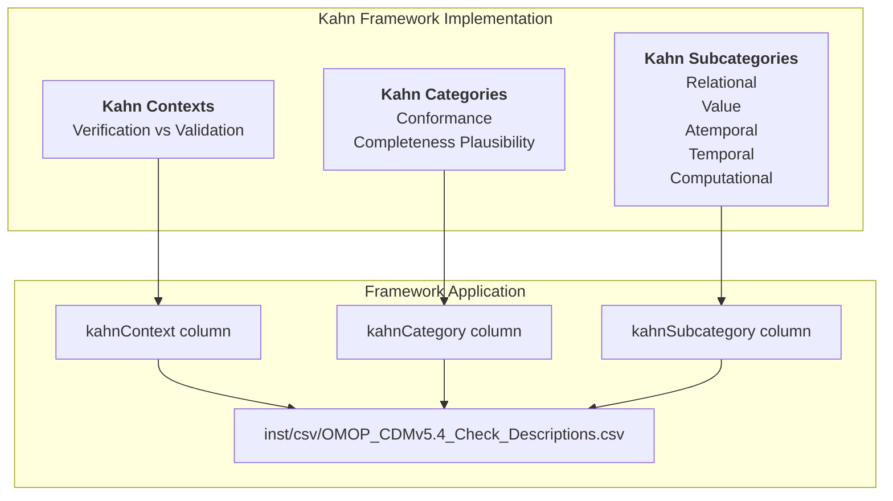
```mermaid
graph TB
    subgraph "Kahn Framework Implementation"
        Context["`**Kahn Contexts**
        Verification vs Validation`"]
        Categories["`**Kahn Categories**
        Conformance
        Completeness  
        Plausibility`"]
        Subcategories["`**Kahn Subcategories**
        Relational
        Value
        Atemporal
        Temporal
        Computational`"]
    end
    
    subgraph "Framework Application"
        CheckDef["inst/csv/OMOP_CDMv5.4_Check_Descriptions.csv"]
        kahnContext["kahnContext column"]
        kahnCategory["kahnCategory column"] 
        kahnSubcategory["kahnSubcategory column"]
    end
    
    Context --> kahnContext
    Categories --> kahnCategory
    Subcategories --> kahnSubcategory
    
    kahnContext --> CheckDef
    kahnCategory --> CheckDef
    kahnSubcategory --> CheckDef
```

**Kahn Context Classification:**
- **Verification**: Checks that validate structural integrity and format compliance (e.g., `cdmTable`, `cdmDatatype`)
- **Validation**: Checks that assess data content accuracy and business rule compliance (e.g., `measurePersonCompleteness`, `plausibleGender`)

**Kahn Category Classification:**
- **Conformance**: Structural and format adherence checks
- **Completeness**: Missing data identification
- **Plausibility**: Reasonable value assessment

Sources: [inst/csv/OMOP_CDMv5.4_Check_Descriptions.csv:1-28](), [inst/csv/OMOP_CDMv5.3_Check_Descriptions.csv:1-28]()

## Three-Level Check Hierarchy

The framework organizes all data quality checks into a three-level hierarchy that corresponds to different granularities of data quality assessment. This hierarchical approach ensures systematic coverage from high-level structural integrity down to specific data value validation.

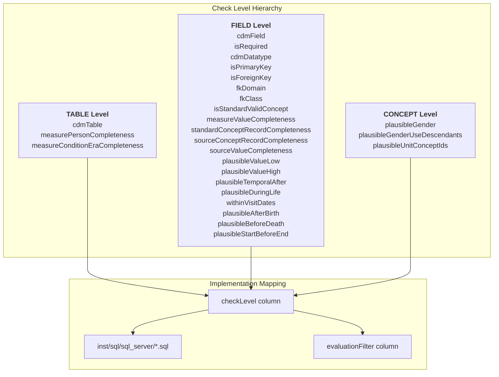
```mermaid
graph TD
    subgraph "Check Level Hierarchy"
        TABLE["`**TABLE Level**
        cdmTable
        measurePersonCompleteness
        measureConditionEraCompleteness`"]
        
        FIELD["`**FIELD Level**
        cdmField
        isRequired
        cdmDatatype
        isPrimaryKey
        isForeignKey
        fkDomain
        fkClass
        isStandardValidConcept
        measureValueCompleteness
        standardConceptRecordCompleteness
        sourceConceptRecordCompleteness
        sourceValueCompleteness
        plausibleValueLow
        plausibleValueHigh
        plausibleTemporalAfter
        plausibleDuringLife
        withinVisitDates
        plausibleAfterBirth
        plausibleBeforeDeath
        plausibleStartBeforeEnd`"]
        
        CONCEPT["`**CONCEPT Level**
        plausibleGender
        plausibleGenderUseDescendants
        plausibleUnitConceptIds`"]
    end
    
    subgraph "Implementation Mapping"
        CheckLevel["checkLevel column"]
        SqlFiles["inst/sql/sql_server/*.sql"]
        FilterLogic["evaluationFilter column"]
    end
    
    TABLE --> CheckLevel
    FIELD --> CheckLevel  
    CONCEPT --> CheckLevel
    
    CheckLevel --> SqlFiles
    CheckLevel --> FilterLogic
```

**Level Characteristics:**
- **TABLE Level**: Evaluates entire tables or cross-table relationships without reference to specific fields
- **FIELD Level**: Focuses on individual field validation within specific tables (majority of checks)
- **CONCEPT Level**: Assesses concept-specific business rules and semantic validity

Sources: [inst/csv/OMOP_CDMv5.4_Check_Descriptions.csv:2-28](), [inst/sql/sql_server/field_within_visit_dates.sql:1-56]()

## Severity Classification System

The framework implements a three-tier severity classification that prioritizes data quality issues based on their impact on data usability and analysis validity. This classification guides remediation efforts and helps users understand the criticality of different check failures.

| Severity Level | Description | Impact | Examples |
|---|---|---|---|
| **fatal** | Critical structural integrity issues that prevent basic data usage | Database unusable for analysis | `cdmTable`, `isRequired`, `cdmDatatype`, `isPrimaryKey`, `isForeignKey` |
| **convention** | OMOP CDM best practice violations that should be resolved when possible | Analysis quality degraded | `measurePersonCompleteness`, `fkDomain`, `fkClass`, `isStandardValidConcept` |
| **characterization** | Data understanding and quality insights | Analysis interpretation affected | `measureValueCompleteness`, `plausibleValueLow`, `plausibleGender` |

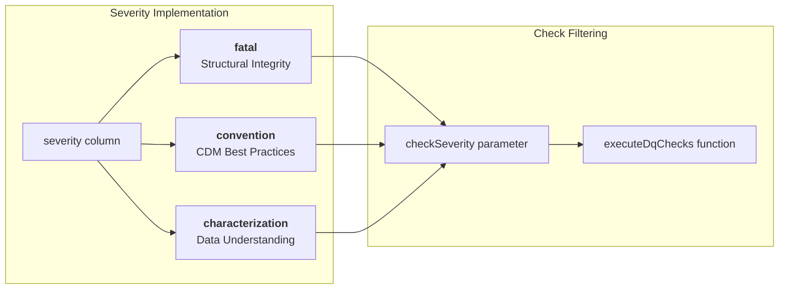
```mermaid
graph LR
    subgraph "Severity Implementation"
        SeverityCol["severity column"]
        Fatal["`**fatal**
        Structural Integrity`"]
        Convention["`**convention** 
        CDM Best Practices`"]
        Characterization["`**characterization**
        Data Understanding`"]
    end
    
    subgraph "Check Filtering"
        checkSeverity["checkSeverity parameter"]
        executeDqChecks["executeDqChecks function"]
    end
    
    SeverityCol --> Fatal
    SeverityCol --> Convention  
    SeverityCol --> Characterization
    
    checkSeverity --> executeDqChecks
    Fatal --> checkSeverity
    Convention --> checkSeverity
    Characterization --> checkSeverity
```

Sources: [inst/csv/OMOP_CDMv5.4_Check_Descriptions.csv:1-28]()

## Framework-to-Implementation Mapping

The conceptual framework translates directly to implementation through a structured metadata system that drives check generation and execution. This mapping ensures that the theoretical framework has concrete operational meaning.

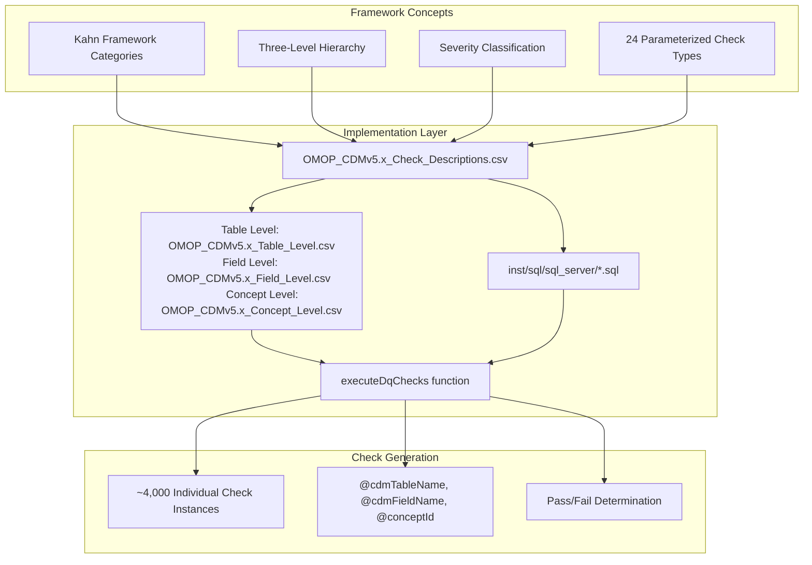
```mermaid
graph TB
    subgraph "Framework Concepts"
        KahnFramework["Kahn Framework Categories"]
        CheckHierarchy["Three-Level Hierarchy"] 
        SeveritySystem["Severity Classification"]
        CheckTypes["24 Parameterized Check Types"]
    end
    
    subgraph "Implementation Layer"
        CheckDescriptions["OMOP_CDMv5.x_Check_Descriptions.csv"]
        ThresholdFiles["`Table Level: OMOP_CDMv5.x_Table_Level.csv
        Field Level: OMOP_CDMv5.x_Field_Level.csv  
        Concept Level: OMOP_CDMv5.x_Concept_Level.csv`"]
        SqlTemplates["inst/sql/sql_server/*.sql"]
        ExecutionEngine["executeDqChecks function"]
    end
    
    subgraph "Check Generation"
        CheckMatrix["~4,000 Individual Check Instances"]
        ParameterSubstitution["@cdmTableName, @cdmFieldName, @conceptId"]
        ThresholdEvaluation["Pass/Fail Determination"]
    end
    
    KahnFramework --> CheckDescriptions
    CheckHierarchy --> CheckDescriptions
    SeveritySystem --> CheckDescriptions
    CheckTypes --> CheckDescriptions
    
    CheckDescriptions --> SqlTemplates
    CheckDescriptions --> ThresholdFiles
    ThresholdFiles --> ExecutionEngine
    SqlTemplates --> ExecutionEngine
    
    ExecutionEngine --> CheckMatrix
    ExecutionEngine --> ParameterSubstitution
    ExecutionEngine --> ThresholdEvaluation
```

**Key Implementation Elements:**
- **Check Descriptions**: Metadata defining each check type's purpose, SQL template, and categorization
- **Threshold Files**: Level-specific configuration controlling which checks run and their failure criteria
- **SQL Templates**: Parameterized queries implementing the actual check logic
- **Parameter Substitution**: Dynamic replacement of placeholders to generate specific check instances

Sources: [inst/csv/OMOP_CDMv5.4_Check_Descriptions.csv:1-28](), [inst/sql/sql_server/field_within_visit_dates.sql:6-13]()

## Check Type Parameterization

The framework's power comes from its parameterized approach, where 24 generic check types expand into thousands of specific check instances through systematic parameter substitution. This approach ensures comprehensive coverage while maintaining manageable complexity.

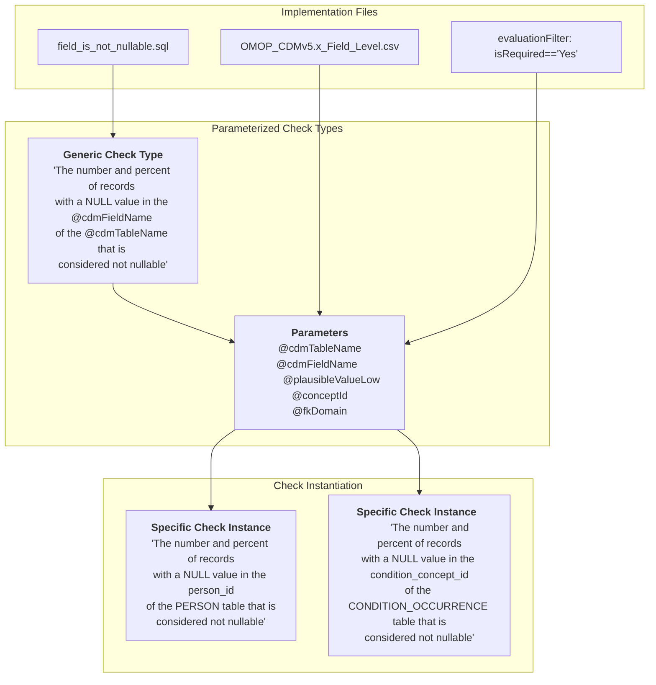
```mermaid
graph TD
    subgraph "Parameterized Check Types"
        Generic["`**Generic Check Type**
        'The number and percent of records 
        with a NULL value in the @cdmFieldName 
        of the @cdmTableName that is 
        considered not nullable'`"]
        
        Parameters["`**Parameters**
        @cdmTableName
        @cdmFieldName  
        @plausibleValueLow
        @conceptId
        @fkDomain`"]
    end
    
    subgraph "Check Instantiation"
        Specific1["`**Specific Check Instance**
        'The number and percent of records
        with a NULL value in the person_id
        of the PERSON table that is
        considered not nullable'`"]
        
        Specific2["`**Specific Check Instance**  
        'The number and percent of records
        with a NULL value in the condition_concept_id
        of the CONDITION_OCCURRENCE table that is
        considered not nullable'`"]
    end
    
    subgraph "Implementation Files"
        SqlFile["field_is_not_nullable.sql"]
        ThresholdFile["OMOP_CDMv5.x_Field_Level.csv"]
        EvaluationFilter["evaluationFilter: isRequired=='Yes'"]
    end
    
    Generic --> Parameters
    Parameters --> Specific1
    Parameters --> Specific2
    
    SqlFile --> Generic
    ThresholdFile --> Parameters
    EvaluationFilter --> Parameters
```

**Parameterization Benefits:**
- **Scalability**: 24 check types generate ~4,000 specific checks across all CDM versions
- **Maintainability**: Single SQL template supports multiple check instances
- **Flexibility**: Parameters allow customization for different CDM configurations
- **Consistency**: Uniform approach ensures comparable results across different contexts

Sources: [inst/csv/OMOP_CDMv5.4_Check_Descriptions.csv:7-8](), [inst/sql/sql_server/field_within_visit_dates.sql:5-13]()# plausibleValueHigh • DataQualityDashboard

Toggle navigation [DataQualityDashboard](../../index.html) 2.7.0

  * [ ](../../index.html)
  * [Get started](../../articles/DataQualityDashboard.html)
  * [Reference](../../reference/index.html)
  * Articles 
    * [DQ Check Failure Thresholds](../../articles/Thresholds.html)
    * [DQ Check Statuses](../../articles/CheckStatusDefinitions.html)
    * [Adding a New Data Quality Check](../../articles/AddNewCheck.html)
    * [DQD for Cohorts](../../articles/DqdForCohorts.html)
    * [SQL-only Mode](../../articles/SqlOnly.html)
  * Data Quality Check Types 
    * [Index](../../articles/checkIndex.html)
    * [cdmTable](../../articles/checks/cdmTable.html)
    * [cdmField](../../articles/checks/cdmField.html)
    * [cdmDatatype](../../articles/checks/cdmDatatype.html)
    * [isPrimaryKey](../../articles/checks/isPrimaryKey.html)
    * [isForeignKey](../../articles/checks/isForeignKey.html)
    * [isRequired](../../articles/checks/isRequired.html)
    * [fkDomain](../../articles/checks/fkDomain.html)
    * [fkClass](../../articles/checks/fkClass.html)
    * [measurePersonCompleteness](../../articles/checks/measurePersonCompleteness.html)
    * [measureValueCompleteness](../../articles/checks/measureValueCompleteness.html)
    * [isStandardValidConcept](../../articles/checks/isStandardValidConcept.html)
    * [standardConceptRecordCompleteness](../../articles/checks/standardConceptRecordCompleteness.html)
    * [sourceConceptRecordCompleteness](../../articles/checks/sourceConceptRecordCompleteness.html)
    * [sourceValueCompleteness](../../articles/checks/sourceValueCompleteness.html)
    * [plausibleAfterBirth](../../articles/checks/plausibleAfterBirth.html)
    * [plausibleBeforeDeath](../../articles/checks/plausibleBeforeDeath.html)
    * [plausibleStartBeforeEnd](../../articles/checks/plausibleStartBeforeEnd.html)
    * [plausibleValueHigh](../../articles/checks/plausibleValueHigh.html)
    * [plausibleValueLow](../../articles/checks/plausibleValueLow.html)
    * [withinVisitDates](../../articles/checks/withinVisitDates.html)
    * [measureConditionEraCompleteness](../../articles/checks/measureConditionEraCompleteness.html)
    * [measureObservationPeriodOverlap](../../articles/checks/measureObservationPeriodOverlap.html)
    * [plausibleUnitConceptIds](../../articles/checks/plausibleUnitConceptIds.html)
    * [plausibleGenderUseDescendants](../../articles/checks/plausibleGenderUseDescendants.html)
  * [Changelog](../../news/index.html)


  * [](https://ohdsi.github.io/Hades)
  * [ ](https://github.com/OHDSI/DataQualityDashboard/)


# plausibleValueHigh

#### Dymytry Dymshyts

#### 2025-08-27

Source: [`vignettes/checks/plausibleValueHigh.Rmd`](https://github.com/OHDSI/DataQualityDashboard/blob/HEAD/vignettes/checks/plausibleValueHigh.Rmd)

`plausibleValueHigh.Rmd`

## Summary

**Level** : FIELD  
**Context** : Verification  
**Category** : Plausibility  
**Subcategory** : Atemporal  
**Severity** : Characterization ✔

## Description

The number and percent of records with a value in the @cdmFieldName field of the @cdmTableName table greater than @plausibleValueHigh.

## Definition

  * _Numerator_ : The number of rows in a table where the checked field value is higher than some expected value.
  * _Denominator_ : The number of rows in a table where the checked field is not null.
  * _Related CDM Convention(s)_ : None. This check evaluates plausibility of values against common sense and known healthcare industry conventions.
  * _CDM Fields/Tables_ : 
    * All date and datetime fields (compared to today’s date + 1 day)
    * `PERSON.day_of_birth` (compared to 31)
    * `PERSON.month_of_birth` (compared to 12)
    * `PERSON.year_of_birth` (compared to this year + 1 year)
    * `DRUG_EXPOSURE.refills` (compared to 24)
    * `DRUG_EXPOSURE.days_supply` (compared to 365)
    * `DRUG_EXPOSURE.quantity` (compared to 1095)
  * _Default Threshold Value_ : 1%


## User Guidance

This check counts the number of records that have a value in the specified field that is higher than some expected value. Failures of this check might represent true data anomalies, but especially in the case when the failure percentage is high, something may be afoot in the ETL pipeline.

Use this query to inspect rows with an implausibly high value:

### Violated rows query
    
    
    SELECT 
      '@cdmTableName.@cdmFieldName' AS violating_field,  
      cdmTable.* 
    FROM @schema.@cdmTableName cdmTable 
    WHERE cdmTable.@cdmFieldName > @plausibleValueHigh 

### ETL Developers

The investigation approach may differ by the field being checked. For example, for `CONDITION_OCURRENCE.condition_start_date` you might look how much it differs in average, to find a clue as to what happened:
    
    
    SELECT 
      MEDIAN(DATEDIFF(day, condition_start_date, current_date)) 
    FROM condition_occurrence
    WHERE condition_start_date > current_date 
    ; 

Or the discrepancy be associated with specific attributes:
    
    
    SELECT 
      co.condition_concept_id, 
      co.condition_type_concept_id, 
      co.condition_status_concept_id, 
      COUNT(1) 
    FROM condition_occurrence co 
    WHERE condition_start_date > current_date  
    GROUP BY co.condition_concept_id, co.condition_type_concept_id, co.condition_status_concept_id 
    ORDER BY COUNT(1) DESC 
    ; 

There might be several different causes of future dates: typos in the source data, wrong data format used in the conversion, timezone issues in the ETL environment and/or database, etc.

For the `DRUG_EXPOSURE` values, there might be be typos, data processing bugs (for example, if days supply is calculated), or rare true cases when a prescription deviated from standard industry practices.

If the issue is determined to be related to ETL logic, it must be fixed. If it’s a source data issue, work with your data partners and users to determine the best remediation approach. `PERSON` rows with invalid birth dates should be removed from the CDM, as any analysis relying on age will be negatively impacted. Other implausible values should be explainable based on your understanding of the source data if they are to be retained. In some cases event rows may need to be dropped from the CDM if the implausible value is unexplainable and could cause downstream quality issues. Be sure to clearly document any data removal logic in your ETL specification.

### Data Users

The implication of a failure of this check depends on the count of errors and your need for the impacted columns. If it’s a small count, it might just be noise in the data which will unlikely impact an analysis. If the count is large, however, proceed carefully - events with future dates will likely be excluded from your analysis, and drugs with inflated supply values could throw off any analysis considering duration or patterns of treatment.

Developed by Katy Sadowski, Clair Blacketer, Maxim Moinat, Ajit Londhe, Anthony Sena, Anthony Molinaro, Frank DeFalco, Pavel Grafkin.

Site built with [pkgdown](https://pkgdown.r-lib.org/) 2.1.2.
# plausibleStartBeforeEnd • DataQualityDashboard

Toggle navigation [DataQualityDashboard](../../index.html) 2.7.0

  * [ ](../../index.html)
  * [Get started](../../articles/DataQualityDashboard.html)
  * [Reference](../../reference/index.html)
  * Articles 
    * [DQ Check Failure Thresholds](../../articles/Thresholds.html)
    * [DQ Check Statuses](../../articles/CheckStatusDefinitions.html)
    * [Adding a New Data Quality Check](../../articles/AddNewCheck.html)
    * [DQD for Cohorts](../../articles/DqdForCohorts.html)
    * [SQL-only Mode](../../articles/SqlOnly.html)
  * Data Quality Check Types 
    * [Index](../../articles/checkIndex.html)
    * [cdmTable](../../articles/checks/cdmTable.html)
    * [cdmField](../../articles/checks/cdmField.html)
    * [cdmDatatype](../../articles/checks/cdmDatatype.html)
    * [isPrimaryKey](../../articles/checks/isPrimaryKey.html)
    * [isForeignKey](../../articles/checks/isForeignKey.html)
    * [isRequired](../../articles/checks/isRequired.html)
    * [fkDomain](../../articles/checks/fkDomain.html)
    * [fkClass](../../articles/checks/fkClass.html)
    * [measurePersonCompleteness](../../articles/checks/measurePersonCompleteness.html)
    * [measureValueCompleteness](../../articles/checks/measureValueCompleteness.html)
    * [isStandardValidConcept](../../articles/checks/isStandardValidConcept.html)
    * [standardConceptRecordCompleteness](../../articles/checks/standardConceptRecordCompleteness.html)
    * [sourceConceptRecordCompleteness](../../articles/checks/sourceConceptRecordCompleteness.html)
    * [sourceValueCompleteness](../../articles/checks/sourceValueCompleteness.html)
    * [plausibleAfterBirth](../../articles/checks/plausibleAfterBirth.html)
    * [plausibleBeforeDeath](../../articles/checks/plausibleBeforeDeath.html)
    * [plausibleStartBeforeEnd](../../articles/checks/plausibleStartBeforeEnd.html)
    * [plausibleValueHigh](../../articles/checks/plausibleValueHigh.html)
    * [plausibleValueLow](../../articles/checks/plausibleValueLow.html)
    * [withinVisitDates](../../articles/checks/withinVisitDates.html)
    * [measureConditionEraCompleteness](../../articles/checks/measureConditionEraCompleteness.html)
    * [measureObservationPeriodOverlap](../../articles/checks/measureObservationPeriodOverlap.html)
    * [plausibleUnitConceptIds](../../articles/checks/plausibleUnitConceptIds.html)
    * [plausibleGenderUseDescendants](../../articles/checks/plausibleGenderUseDescendants.html)
  * [Changelog](../../news/index.html)


  * [](https://ohdsi.github.io/Hades)
  * [ ](https://github.com/OHDSI/DataQualityDashboard/)


# plausibleStartBeforeEnd

#### Maxim Moinat

#### 2025-08-27

Source: [`vignettes/checks/plausibleStartBeforeEnd.Rmd`](https://github.com/OHDSI/DataQualityDashboard/blob/HEAD/vignettes/checks/plausibleStartBeforeEnd.Rmd)

`plausibleStartBeforeEnd.Rmd`

## Summary

**Level** : FIELD  
**Context** : Verification  
**Category** : Plausibility  
**Subcategory** : Temporal  
**Severity** : CDM convention ⚠  


## Description

The number and percent of records with a value in the **cdmFieldName** field of the **cdmTableName** that occurs after the date in the **plausibleStartBeforeEndFieldName**. Note that this check replaces the previous `plausibleTemporalAfter` check.

## Definition

This check is attempting to apply temporal rules within a table, specifically checking that all start dates are before the end dates. For example, in the VISIT_OCCURRENCE table it checks that the VISIT_OCCURRENCE_START_DATE is before VISIT_OCCURRENCE_END_DATE. The start date can be before the end date or equal to the end date. It is applied to the start date field and takes the end date field as a parameter. Both date and datetime fields are checked.

  * _Numerator_ : The number of records where date in **cdmFieldName** is after the date in **plausibleStartBeforeEndFieldName**.
  * _Denominator_ : The total number of records with a non-null start and non-null end date value
  * _Related CDM Convention(s)_ : -Not linked to a convention-
  * _CDM Fields/Tables_ : This check runs on all start date/datetime fields with an end date/datetime in the same table. It also runs on the cdm_source table, comparing `source_release_date` is before `cdm_release_date`.
  * _Default Threshold Value_ : 
    * 0% for the observation_period, vocabulary (valid_start/end_date) and cdm_source tables.
    * 1% for other tables with an end date.


## User Guidance

If the start date is after the end date, it is likely that the data is incorrect or the dates are unreliable.

### Violated rows query
    
    
    SELECT 
      '@cdmTableName.@cdmFieldName' AS violating_field, 
      cdmTable.*
    FROM @schema.@cdmTableName cdmTable
    WHERE cdmTable.@cdmFieldName IS NOT NULL 
    AND cdmTable.@plausibleStartBeforeEndFieldName IS NOT NULL 
    AND cdmTable.@cdmFieldName > cdmTable.@plausibleStartBeforeEndFieldName

### ETL Developers

There main reason for this check to fail is often that the source data is incorrect. If the end date is derived from other data, the calculation might not take into account some edge cases.

Any violating checks should either be removed or corrected. In most cases this can be done by adjusting the end date: - With a few exceptions, the end date is not mandatory and can be left empty. - If the end date is mandatory (notably visit_occurrence and drug_exposure), the end date can be set to the start date if the event. Make sure to document this as it leads to loss of duration information. - If this check fails for the observation_period, it might signify a bigger underlying issue. Please investigate all records for this person in the CDM and source. - If neither the start or end date can be trusted, please remove the record from the CDM.

Make sure to clearly document the choices in your ETL specification.

### Data Users

An start date after the end date gives negative event durations, which might break analyses. Especially take note if this check fails for the `observation_period` table. This means that there are persons with negative observation time. If these persons are included in a cohort, it will potentially skew e.g. survival analyses.

Developed by Katy Sadowski, Clair Blacketer, Maxim Moinat, Ajit Londhe, Anthony Sena, Anthony Molinaro, Frank DeFalco, Pavel Grafkin.

Site built with [pkgdown](https://pkgdown.r-lib.org/) 2.1.2.
# sourceValueCompleteness • DataQualityDashboard

Toggle navigation [DataQualityDashboard](../../index.html) 2.7.0

  * [ ](../../index.html)
  * [Get started](../../articles/DataQualityDashboard.html)
  * [Reference](../../reference/index.html)
  * Articles 
    * [DQ Check Failure Thresholds](../../articles/Thresholds.html)
    * [DQ Check Statuses](../../articles/CheckStatusDefinitions.html)
    * [Adding a New Data Quality Check](../../articles/AddNewCheck.html)
    * [DQD for Cohorts](../../articles/DqdForCohorts.html)
    * [SQL-only Mode](../../articles/SqlOnly.html)
  * Data Quality Check Types 
    * [Index](../../articles/checkIndex.html)
    * [cdmTable](../../articles/checks/cdmTable.html)
    * [cdmField](../../articles/checks/cdmField.html)
    * [cdmDatatype](../../articles/checks/cdmDatatype.html)
    * [isPrimaryKey](../../articles/checks/isPrimaryKey.html)
    * [isForeignKey](../../articles/checks/isForeignKey.html)
    * [isRequired](../../articles/checks/isRequired.html)
    * [fkDomain](../../articles/checks/fkDomain.html)
    * [fkClass](../../articles/checks/fkClass.html)
    * [measurePersonCompleteness](../../articles/checks/measurePersonCompleteness.html)
    * [measureValueCompleteness](../../articles/checks/measureValueCompleteness.html)
    * [isStandardValidConcept](../../articles/checks/isStandardValidConcept.html)
    * [standardConceptRecordCompleteness](../../articles/checks/standardConceptRecordCompleteness.html)
    * [sourceConceptRecordCompleteness](../../articles/checks/sourceConceptRecordCompleteness.html)
    * [sourceValueCompleteness](../../articles/checks/sourceValueCompleteness.html)
    * [plausibleAfterBirth](../../articles/checks/plausibleAfterBirth.html)
    * [plausibleBeforeDeath](../../articles/checks/plausibleBeforeDeath.html)
    * [plausibleStartBeforeEnd](../../articles/checks/plausibleStartBeforeEnd.html)
    * [plausibleValueHigh](../../articles/checks/plausibleValueHigh.html)
    * [plausibleValueLow](../../articles/checks/plausibleValueLow.html)
    * [withinVisitDates](../../articles/checks/withinVisitDates.html)
    * [measureConditionEraCompleteness](../../articles/checks/measureConditionEraCompleteness.html)
    * [measureObservationPeriodOverlap](../../articles/checks/measureObservationPeriodOverlap.html)
    * [plausibleUnitConceptIds](../../articles/checks/plausibleUnitConceptIds.html)
    * [plausibleGenderUseDescendants](../../articles/checks/plausibleGenderUseDescendants.html)
  * [Changelog](../../news/index.html)


  * [](https://ohdsi.github.io/Hades)
  * [ ](https://github.com/OHDSI/DataQualityDashboard/)


# sourceValueCompleteness

#### Jared Houghtaling, Clair Blacketer

#### 2025-08-27

Source: [`vignettes/checks/sourceValueCompleteness.Rmd`](https://github.com/OHDSI/DataQualityDashboard/blob/HEAD/vignettes/checks/sourceValueCompleteness.Rmd)

`sourceValueCompleteness.Rmd`

## Summary

**Level** : FIELD  
**Context** : Verification  
**Category** : Completeness  
**Subcategory** :  
**Severity** : CDM convention ⚠

## Description

The number and percent of distinct source values in the @cdmFieldName field of the @cdmTableName table mapped to 0.

## Definition

  * _Numerator_ : Distinct `_source_value` entries where the corresponding standard `_concept_id` field is 0.
  * _Denominator_ : Total distinct `_source_value` entries, including NULL, in the respective event table.
  * _Related CDM Convention(s)_ : The OMOP Common Data Model specifies that codes that are present in a native database should be mapped to standard concepts using either the intrinsic mappings defined in the standard vocabularies or extrinsic mappings defined by the data owner or ETL development team. Note also that variations of this check logic are also used in the [EHDEN CDM Inspection Report](https://github.com/EHDEN/CdmInspection) package, as well as the [AresIndexer](https://github.com/OHDSI/AresIndexer) package for generating indices of unmapped codes.  

  * _CDM Fields/Tables_ : Runs on all event tables that have `_source_value` fields.
  * _Default Threshold Value_ : 
    * 10% for `_source_value` fields in condition, measurement, procedure, drug, visit.
    * 100% for all other fields


## User Guidance

This check will look at all distinct source values in the specified field and calculate how many are mapped to a standard concept of 0. This check should be used in conjunction with the [standardConceptRecordCompleteness](standardConceptRecordCompleteness.html) check to identify potential mapping issues in the ETL.  


This check is a good measure of the overall mapping rate within each domain. For example, a table may have high standardConceptRecordCompleteness (that is, a large percentage of records with a non-zero standard concept) but a low score on this check. This would indicate that the “long tail” of rarer codes have not been mapped while more common codes have good mapping coverage. It is always important to interrogate the results of these two checks together to ensure complete understanding of vocabulary mapping in your CDM.

The following SQL can be used to summarize unmapped source values by record count in a given CDM table:

### Violated rows query
    
    
    SELECT DISTINCT 
      cdmTable.@cdmFieldName,
      COUNT(*)
    FROM @cdmDatabaseSchema.@cdmTableName cdmTable
    WHERE cdmTable.@standardConceptFieldName = 0
    GROUP BY 1
    ORDER BY 2 DESC

### ETL Developers

Fails of this check are (most often) related directly to semantic mapping. First, the ETL developer should investigate if a source vocabulary is present in the native data that was not accounted for in the ETL document and/or code. This is most likely if the unmapped source values are codes rather than text values. Second, the source-to-concept-map file or table should be updated to link the unmapped source values with domain-appropriate concepts.

### Data Users

When this check fails, source data granularity is being lost; not all of the information related to a particular event or modifier is being captured in OMOP CDM format. Although the information about an event may exist in the source value field, it cannot easily be used in downstream analytics processes that rely on standard OMOP concepts.

**Please see the[standardConceptRecordCompleteness](standardConceptRecordCompleteness.html) page for a much more detailed overview of handling mapping quality issues in your OMOP CDM.**

Developed by Katy Sadowski, Clair Blacketer, Maxim Moinat, Ajit Londhe, Anthony Sena, Anthony Molinaro, Frank DeFalco, Pavel Grafkin.

Site built with [pkgdown](https://pkgdown.r-lib.org/) 2.1.2.
# measureObservationPeriodOverlap • DataQualityDashboard

Toggle navigation [DataQualityDashboard](../../index.html) 2.7.0

  * [ ](../../index.html)
  * [Get started](../../articles/DataQualityDashboard.html)
  * [Reference](../../reference/index.html)
  * Articles 
    * [DQ Check Failure Thresholds](../../articles/Thresholds.html)
    * [DQ Check Statuses](../../articles/CheckStatusDefinitions.html)
    * [Adding a New Data Quality Check](../../articles/AddNewCheck.html)
    * [DQD for Cohorts](../../articles/DqdForCohorts.html)
    * [SQL-only Mode](../../articles/SqlOnly.html)
  * Data Quality Check Types 
    * [Index](../../articles/checkIndex.html)
    * [cdmTable](../../articles/checks/cdmTable.html)
    * [cdmField](../../articles/checks/cdmField.html)
    * [cdmDatatype](../../articles/checks/cdmDatatype.html)
    * [isPrimaryKey](../../articles/checks/isPrimaryKey.html)
    * [isForeignKey](../../articles/checks/isForeignKey.html)
    * [isRequired](../../articles/checks/isRequired.html)
    * [fkDomain](../../articles/checks/fkDomain.html)
    * [fkClass](../../articles/checks/fkClass.html)
    * [measurePersonCompleteness](../../articles/checks/measurePersonCompleteness.html)
    * [measureValueCompleteness](../../articles/checks/measureValueCompleteness.html)
    * [isStandardValidConcept](../../articles/checks/isStandardValidConcept.html)
    * [standardConceptRecordCompleteness](../../articles/checks/standardConceptRecordCompleteness.html)
    * [sourceConceptRecordCompleteness](../../articles/checks/sourceConceptRecordCompleteness.html)
    * [sourceValueCompleteness](../../articles/checks/sourceValueCompleteness.html)
    * [plausibleAfterBirth](../../articles/checks/plausibleAfterBirth.html)
    * [plausibleBeforeDeath](../../articles/checks/plausibleBeforeDeath.html)
    * [plausibleStartBeforeEnd](../../articles/checks/plausibleStartBeforeEnd.html)
    * [plausibleValueHigh](../../articles/checks/plausibleValueHigh.html)
    * [plausibleValueLow](../../articles/checks/plausibleValueLow.html)
    * [withinVisitDates](../../articles/checks/withinVisitDates.html)
    * [measureConditionEraCompleteness](../../articles/checks/measureConditionEraCompleteness.html)
    * [measureObservationPeriodOverlap](../../articles/checks/measureObservationPeriodOverlap.html)
    * [plausibleUnitConceptIds](../../articles/checks/plausibleUnitConceptIds.html)
    * [plausibleGenderUseDescendants](../../articles/checks/plausibleGenderUseDescendants.html)
  * [Changelog](../../news/index.html)


  * [](https://ohdsi.github.io/Hades)
  * [ ](https://github.com/OHDSI/DataQualityDashboard/)


# measureObservationPeriodOverlap

#### Katy Sadowski

#### 2025-08-27

Source: [`vignettes/checks/measureObservationPeriodOverlap.Rmd`](https://github.com/OHDSI/DataQualityDashboard/blob/HEAD/vignettes/checks/measureObservationPeriodOverlap.Rmd)

`measureObservationPeriodOverlap.Rmd`

## Summary

**Level** : Table check  
**Context** : Verification  
**Category** : Plausibility  
**Subcategory** : Temporal  
**Severity** : Fatal 💀  


## Description

The number and percent of persons that have overlapping or back-to-back observation periods.

## Definition

This check verifies that observation periods for each person do not overlap or have gaps of only one day between them. According to the OMOP CDM specification, observation periods should not overlap or be back-to-back to each other.

  * _Numerator_ : The number of persons who have at least one pair of overlapping or back-to-back observation periods
  * _Denominator_ : The total number of persons with observation periods
  * _Related CDM Convention(s)_ : “Any two overlapping or adjacent OBSERVATION_PERIOD records have to be merged into one” from [CDM specification](https://ohdsi.github.io/CommonDataModel/cdm54.html#observation_period)
  * _CDM Fields/Tables_ : `OBSERVATION_PERIOD`
  * _Default Threshold Value_ : 0%


## User Guidance

A failure in this check indicates that there are persons in the database who have overlapping or back-to-back observation periods, which violates the OMOP CDM specification. Such observation periods will lead to critical errors in analytics as all OHDSI tools assume that observation periods do not overlap.

### Violated rows query

You may use the following SQL query to identify the specific persons with overlapping observation periods:
    
    
    SELECT DISTINCT
        cdmTable.person_id,
        cdmTable.observation_period_start_date,
        cdmTable.observation_period_end_date,
        cdmTable2.observation_period_start_date AS overlap_start,
        cdmTable2.observation_period_end_date AS overlap_end,
        CASE 
            WHEN cdmTable.observation_period_start_date <= cdmTable2.observation_period_end_date 
                AND cdmTable.observation_period_end_date >= cdmTable2.observation_period_start_date
            THEN 'Overlapping'
            WHEN DATEADD(day, 1, cdmTable.observation_period_end_date) = cdmTable2.observation_period_start_date
                OR DATEADD(day, 1, cdmTable2.observation_period_end_date) = cdmTable.observation_period_start_date
            THEN 'Back-to-back'
        END AS violation_type
    FROM @cdmDatabaseSchema.observation_period cdmTable
    JOIN @cdmDatabaseSchema.observation_period cdmTable2 
        ON cdmTable.person_id = cdmTable2.person_id
        AND cdmTable.observation_period_id != cdmTable2.observation_period_id
    WHERE (cdmTable.observation_period_start_date <= cdmTable2.observation_period_end_date 
        AND cdmTable.observation_period_end_date >= cdmTable2.observation_period_start_date)
        OR (DATEADD(day, 1, cdmTable.observation_period_end_date) = cdmTable2.observation_period_start_date)
        OR (DATEADD(day, 1, cdmTable2.observation_period_end_date) = cdmTable.observation_period_start_date)
    ORDER BY cdmTable.person_id, cdmTable.observation_period_start_date

### ETL Developers

If this check fails, you should investigate the root cause to determine if the issue originates in the source data or if it is the result of an ETL bug. Logic will need to be added to the ETL to correctly merge overlapping or back-to-back periods of observed time, and/or to handle bad data from the source. This is a fatal check and all failures must be resolved before the CDM can be used.

**Examples of violations:**

  1. **Overlapping periods** : 
     * Period 1: 2020-01-01 to 2020-06-30
     * Period 2: 2020-05-01 to 2020-12-31
     * These overlap from 2020-05-01 to 2020-06-30
  2. **Back-to-back periods** : 
     * Period 1: 2020-01-01 to 2020-06-30  

     * Period 2: 2020-07-01 to 2020-12-31
     * These are back-to-back (one ends exactly one day before the other starts)


Both scenarios should be merged into a single period from 2020-01-01 to 2020-12-31.

### Data Users

An OMOP CDM with overlapping or adjacent observation periods should not be used. OHDSI tools assume that observation periods do not overlap, and as such will return errors or incorrect results; for example, cohort entry criteria and calculation of person-time will be executed incorrectly.

Developed by Katy Sadowski, Clair Blacketer, Maxim Moinat, Ajit Londhe, Anthony Sena, Anthony Molinaro, Frank DeFalco, Pavel Grafkin.

Site built with [pkgdown](https://pkgdown.r-lib.org/) 2.1.2.
# Page: Execution Modes and SQL Generation

# Execution Modes and SQL Generation

<details>
<summary>Relevant source files</summary>

The following files were used as context for generating this wiki page:

- [R/runCheck.R](R/runCheck.R)
- [R/sqlOnly.R](R/sqlOnly.R)
- [docs/articles/AddNewCheck.html](docs/articles/AddNewCheck.html)
- [docs/articles/CheckStatusDefinitions.html](docs/articles/CheckStatusDefinitions.html)
- [docs/articles/SqlOnly.html](docs/articles/SqlOnly.html)
- [docs/reference/dot-writeResultsToCsv.html](docs/reference/dot-writeResultsToCsv.html)
- [docs/reference/writeJsonResultsToCsv.html](docs/reference/writeJsonResultsToCsv.html)
- [man/dot-runCheck.Rd](man/dot-runCheck.Rd)

</details>


This document covers the different execution modes available in the DataQualityDashboard system and how SQL generation works across these modes. The system supports three primary execution modes: live execution, basic SQL-only mode, and incremental insert SQL-only mode. Each mode serves different use cases from immediate database analysis to distributed execution scenarios.

For information about the main execution function and its parameters, see [executeDqChecks Function](#3.1). For details about the underlying check implementation, see [Check Implementation](#5).

## Execution Mode Overview

The DataQualityDashboard system supports three distinct execution modes controlled by the `sqlOnly` and `sqlOnlyIncrementalInsert` parameters:

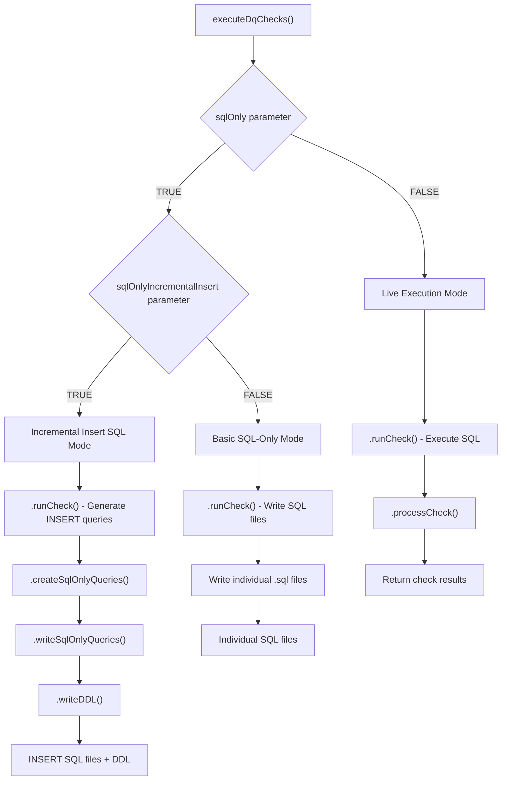
```mermaid
flowchart TD
    START["executeDqChecks()"] --> MODE_CHECK{"sqlOnly parameter"}
    
    MODE_CHECK -->|FALSE| LIVE["Live Execution Mode"]
    MODE_CHECK -->|TRUE| SQL_MODE{"sqlOnlyIncrementalInsert parameter"}
    
    SQL_MODE -->|FALSE| BASIC_SQL["Basic SQL-Only Mode"]
    SQL_MODE -->|TRUE| INCR_SQL["Incremental Insert SQL Mode"]
    
    LIVE --> RUNCHECK_LIVE[".runCheck() - Execute SQL"]
    BASIC_SQL --> RUNCHECK_BASIC[".runCheck() - Write SQL files"]
    INCR_SQL --> RUNCHECK_INCR[".runCheck() - Generate INSERT queries"]
    
    RUNCHECK_LIVE --> PROCESSCHECK[".processCheck()"]
    RUNCHECK_BASIC --> WRITE_FILES["Write individual .sql files"]
    RUNCHECK_INCR --> CREATE_QUERIES[".createSqlOnlyQueries()"]
    
    CREATE_QUERIES --> WRITE_UNION[".writeSqlOnlyQueries()"]
    WRITE_UNION --> DDL_GEN[".writeDDL()"]
    
    PROCESSCHECK --> RESULTS["Return check results"]
    WRITE_FILES --> SQL_FILES["Individual SQL files"]
    DDL_GEN --> INSERT_FILES["INSERT SQL files + DDL"]
```

Sources: [R/runCheck.R:95-134](), [R/sqlOnly.R:33-89](), [R/sqlOnly.R:105-145]()

## Live Execution Mode

Live execution mode (`sqlOnly = FALSE`) is the default behavior where checks are executed immediately against the database and results are processed in memory.

### Live Execution Flow

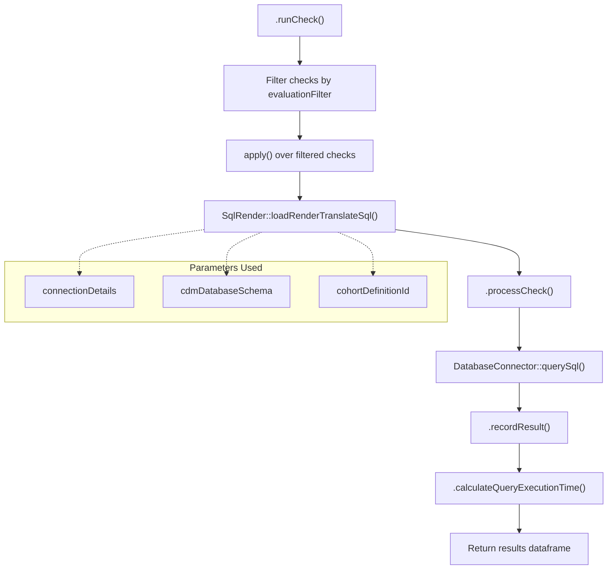
```mermaid
flowchart TD
    RUNCHECK[".runCheck()"] --> FILTER["Filter checks by evaluationFilter"]
    FILTER --> APPLY["apply() over filtered checks"]
    
    APPLY --> RENDER["SqlRender::loadRenderTranslateSql()"]
    RENDER --> PROCESS[".processCheck()"]
    
    PROCESS --> EXECUTE["DatabaseConnector::querySql()"]
    EXECUTE --> RECORD[".recordResult()"]
    RECORD --> STATUS[".calculateQueryExecutionTime()"]
    STATUS --> RETURN["Return results dataframe"]
    
    subgraph "Parameters Used"
        CONN["connectionDetails"]
        SCHEMA["cdmDatabaseSchema"]
        COHORT["cohortDefinitionId"]
    end
    
    RENDER -.-> CONN
    RENDER -.-> SCHEMA
    RENDER -.-> COHORT
```

In live execution mode, the system:
1. Renders SQL templates with actual database parameters
2. Executes queries immediately against the database 
3. Processes results including error handling and timing
4. Returns structured results for threshold evaluation

Sources: [R/runCheck.R:113-122](), [R/runCheck.R:74-94]()

## Basic SQL-Only Mode

Basic SQL-only mode (`sqlOnly = TRUE`, `sqlOnlyIncrementalInsert = FALSE`) generates SQL files without executing them. This mode is useful for manual review, debugging, or execution in external systems.

### Basic SQL Generation Process

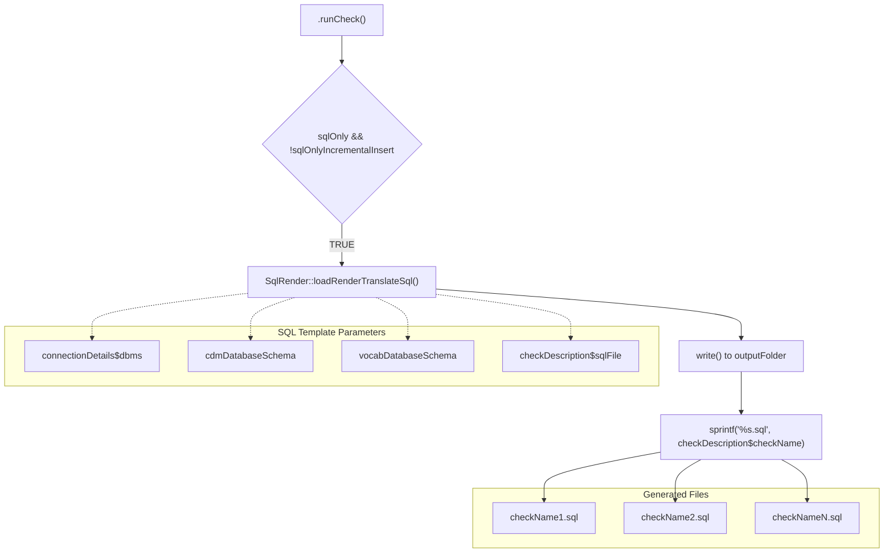
```mermaid
flowchart TD
    RUNCHECK[".runCheck()"] --> CHECK_MODE{"sqlOnly && !sqlOnlyIncrementalInsert"}
    CHECK_MODE -->|TRUE| RENDER["SqlRender::loadRenderTranslateSql()"]
    
    RENDER --> WRITE_FILE["write() to outputFolder"]
    WRITE_FILE --> FILENAME["sprintf('%s.sql', checkDescription$checkName)"]
    
    subgraph "Generated Files"
        FILE1["checkName1.sql"]
        FILE2["checkName2.sql"]
        FILE3["checkNameN.sql"]
    end
    
    FILENAME --> FILE1
    FILENAME --> FILE2
    FILENAME --> FILE3
    
    subgraph "SQL Template Parameters"
        DBMS["connectionDetails$dbms"]
        CDM_SCHEMA["cdmDatabaseSchema"]
        VOCAB_SCHEMA["vocabDatabaseSchema"]
        SQL_FILE["checkDescription$sqlFile"]
    end
    
    RENDER -.-> DBMS
    RENDER -.-> CDM_SCHEMA
    RENDER -.-> VOCAB_SCHEMA
    RENDER -.-> SQL_FILE
```

Each generated SQL file contains:
- Rendered SQL specific to the target database dialect
- Parameterized queries ready for execution
- Comments indicating the check type and purpose

Sources: [R/runCheck.R:107-112](), [R/runCheck.R:79-93]()

## Incremental Insert SQL Mode

Incremental insert mode (`sqlOnly = TRUE`, `sqlOnlyIncrementalInsert = TRUE`) generates SQL INSERT statements that populate a results table. This mode supports performance optimization through query unioning.

### Incremental Insert Architecture

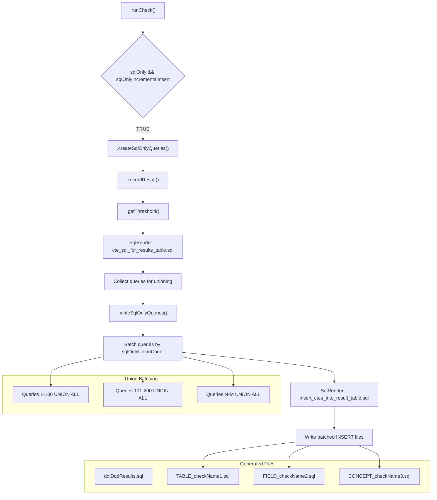
```mermaid
flowchart TD
    RUNCHECK[".runCheck()"] --> INCR_CHECK{"sqlOnly && sqlOnlyIncrementalInsert"}
    INCR_CHECK -->|TRUE| CREATE_QUERY[".createSqlOnlyQueries()"]
    
    CREATE_QUERY --> RECORD_RESULT[".recordResult()"]
    RECORD_RESULT --> GET_THRESHOLD[".getThreshold()"]
    GET_THRESHOLD --> RENDER_CTE["SqlRender - cte_sql_for_results_table.sql"]
    
    RENDER_CTE --> UNION_COLLECT["Collect queries for unioning"]
    UNION_COLLECT --> WRITE_QUERIES[".writeSqlOnlyQueries()"]
    
    WRITE_QUERIES --> BATCH_UNION["Batch queries by sqlOnlyUnionCount"]
    BATCH_UNION --> INSERT_RENDER["SqlRender - insert_ctes_into_result_table.sql"]
    INSERT_RENDER --> WRITE_FILES["Write batched INSERT files"]
    
    subgraph "Union Batching"
        BATCH1["Queries 1-100 UNION ALL"]
        BATCH2["Queries 101-200 UNION ALL"]
        BATCHN["Queries N-M UNION ALL"]
    end
    
    BATCH_UNION --> BATCH1
    BATCH_UNION --> BATCH2
    BATCH_UNION --> BATCHN
    
    subgraph "Generated Files"
        DDL_FILE["ddlDqdResults.sql"]
        INSERT1["TABLE_checkName1.sql"]
        INSERT2["FIELD_checkName2.sql"]
        INSERT3["CONCEPT_checkName3.sql"]
    end
    
    WRITE_FILES --> INSERT1
    WRITE_FILES --> INSERT2
    WRITE_FILES --> INSERT3
```

Sources: [R/runCheck.R:95-106](), [R/runCheck.R:127-131](), [R/sqlOnly.R:33-89](), [R/sqlOnly.R:105-145]()

### SQL Union Optimization

The `sqlOnlyUnionCount` parameter controls performance optimization by batching multiple check queries into single INSERT statements:

| Parameter Value | Behavior | Use Case |
|-----------------|----------|----------|
| 1 | One INSERT per check | Maximum granular control |
| 10-50 | Small batches | Moderate performance gain |
| 100+ | Large batches | Maximum performance on systems like Spark |

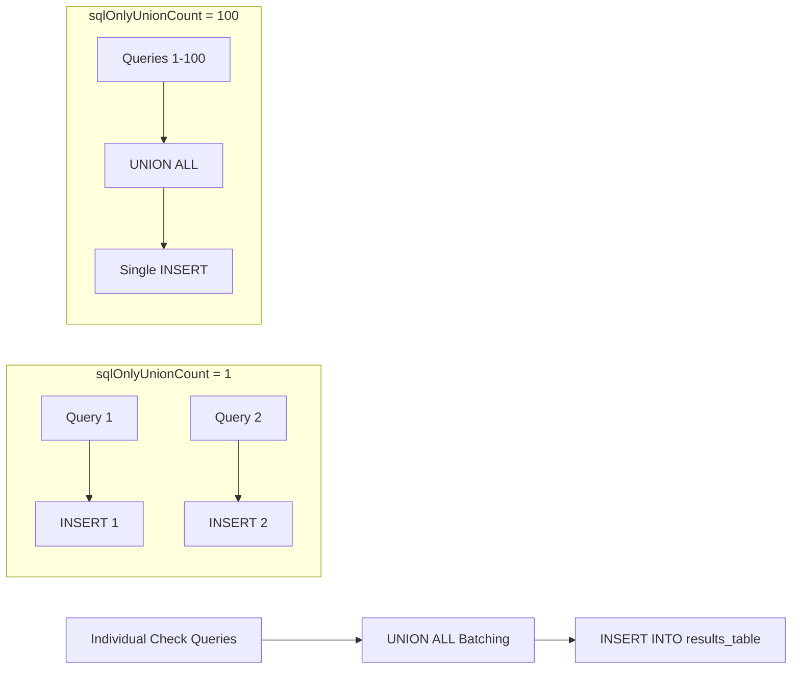
```mermaid
flowchart LR
    QUERIES["Individual Check Queries"] --> UNION["UNION ALL Batching"]
    UNION --> INSERT["INSERT INTO results_table"]
    
    subgraph "sqlOnlyUnionCount = 1"
        Q1["Query 1"] --> I1["INSERT 1"]
        Q2["Query 2"] --> I2["INSERT 2"]
    end
    
    subgraph "sqlOnlyUnionCount = 100"
        Q1_100["Queries 1-100"] --> UNION_100["UNION ALL"]
        UNION_100 --> I_BATCH["Single INSERT"]
    end
```

Sources: [R/sqlOnly.R:122-144](), [R/sqlOnly.R:106-112]()

## SQL Template System

The SQL generation process relies on a template system that parameterizes queries for different execution contexts.

### Template Parameter Injection

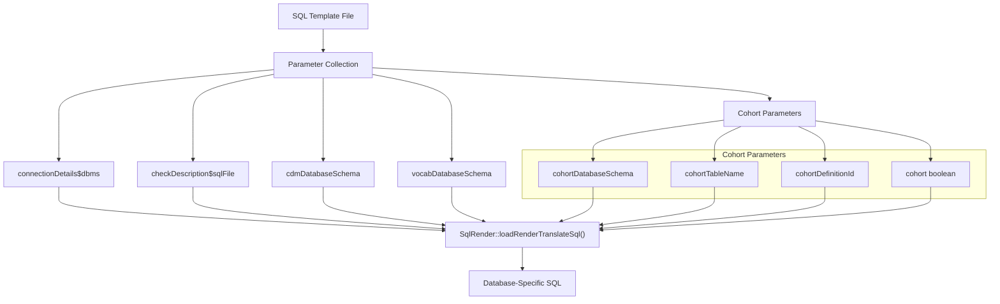
```mermaid
flowchart TD
    TEMPLATE["SQL Template File"] --> PARAMS["Parameter Collection"]
    
    PARAMS --> DBMS["connectionDetails$dbms"]
    PARAMS --> SQL_FILE["checkDescription$sqlFile"]
    PARAMS --> CDM_SCHEMA["cdmDatabaseSchema"]
    PARAMS --> VOCAB_SCHEMA["vocabDatabaseSchema"]
    PARAMS --> COHORT_PARAMS["Cohort Parameters"]
    
    subgraph "Cohort Parameters"
        COHORT_SCHEMA["cohortDatabaseSchema"]
        COHORT_TABLE["cohortTableName"]
        COHORT_ID["cohortDefinitionId"]
        COHORT_FLAG["cohort boolean"]
    end
    
    COHORT_PARAMS --> COHORT_SCHEMA
    COHORT_PARAMS --> COHORT_TABLE
    COHORT_PARAMS --> COHORT_ID
    COHORT_PARAMS --> COHORT_FLAG
    
    DBMS --> RENDER["SqlRender::loadRenderTranslateSql()"]
    SQL_FILE --> RENDER
    CDM_SCHEMA --> RENDER
    VOCAB_SCHEMA --> RENDER
    COHORT_SCHEMA --> RENDER
    COHORT_TABLE --> RENDER
    COHORT_ID --> RENDER
    COHORT_FLAG --> RENDER
    
    RENDER --> TRANSLATED_SQL["Database-Specific SQL"]
```

### Key Template Parameters

| Parameter | Purpose | Example Value |
|-----------|---------|---------------|
| `@cdmDatabaseSchema` | CDM database location | `"my_cdm.dbo"` |
| `@vocabDatabaseSchema` | Vocabulary database location | `"my_vocab.dbo"` |
| `@cohortDatabaseSchema` | Cohort table location | `"results.dbo"` |
| `@cohortTableName` | Cohort table name | `"cohort"` |
| `@cohortDefinitionId` | Specific cohort ID | `1001` |
| `@cdmTableName` | Dynamic table name | `"PERSON"` |
| `@cdmFieldName` | Dynamic field name | `"person_id"` |

Sources: [R/runCheck.R:79-91](), [R/runCheck.R:67-71]()

## Results Table Schema

In incremental insert mode, the system generates DDL for a standardized results table structure:

### Results Table Generation

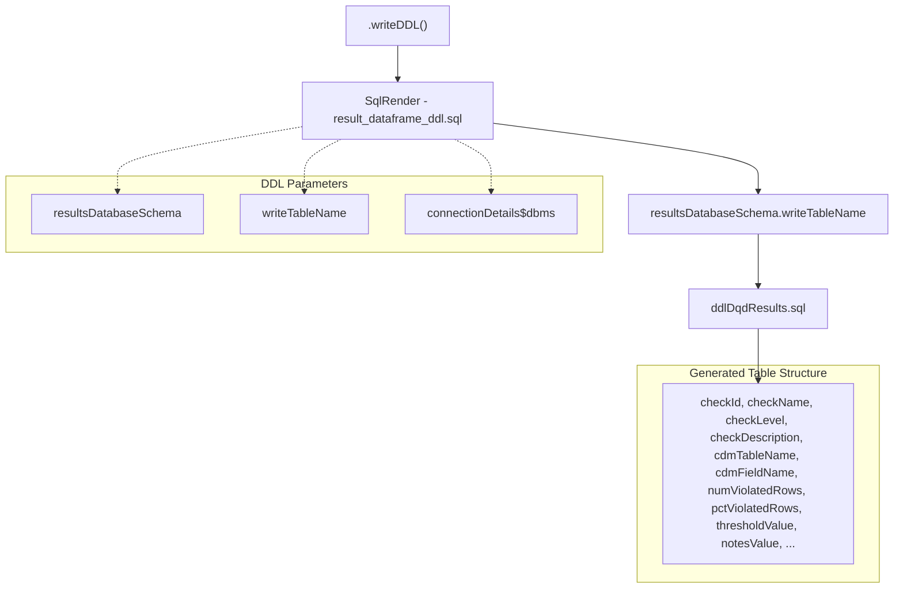
```mermaid
flowchart TD
    WRITE_DDL[".writeDDL()"] --> RENDER_DDL["SqlRender - result_dataframe_ddl.sql"]
    RENDER_DDL --> TABLE_NAME["resultsDatabaseSchema.writeTableName"]
    TABLE_NAME --> DDL_FILE["ddlDqdResults.sql"]
    
    subgraph "DDL Parameters"
        RESULTS_SCHEMA["resultsDatabaseSchema"]
        WRITE_TABLE["writeTableName"]
        TARGET_DBMS["connectionDetails$dbms"]
    end
    
    RENDER_DDL -.-> RESULTS_SCHEMA
    RENDER_DDL -.-> WRITE_TABLE
    RENDER_DDL -.-> TARGET_DBMS
    
    subgraph "Generated Table Structure"
        COLUMNS["checkId, checkName, checkLevel, checkDescription, cdmTableName, cdmFieldName, numViolatedRows, pctViolatedRows, thresholdValue, notesValue, ..."]
    end
    
    DDL_FILE --> COLUMNS
```

Sources: [R/sqlOnly.R:157-178]()

## Threshold Integration

The SQL generation process includes threshold evaluation logic, particularly in incremental insert mode where thresholds must be embedded in the generated SQL.

### Threshold Retrieval Process

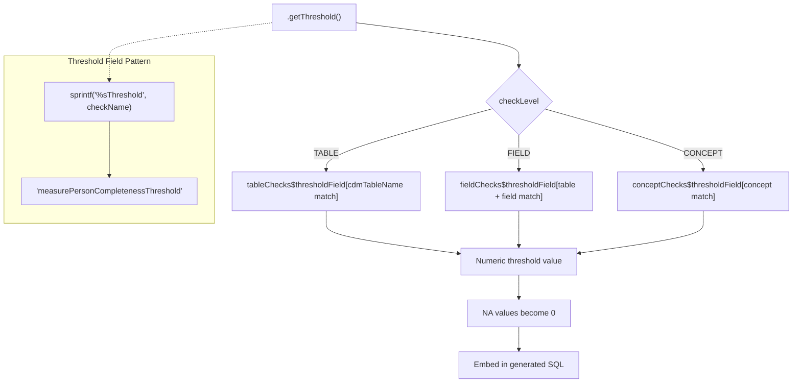
```mermaid
flowchart TD
    GET_THRESHOLD[".getThreshold()"] --> CHECK_LEVEL{"checkLevel"}
    
    CHECK_LEVEL -->|TABLE| TABLE_FILTER["tableChecks$thresholdField[cdmTableName match]"]
    CHECK_LEVEL -->|FIELD| FIELD_FILTER["fieldChecks$thresholdField[table + field match]"]
    CHECK_LEVEL -->|CONCEPT| CONCEPT_FILTER["conceptChecks$thresholdField[concept match]"]
    
    TABLE_FILTER --> THRESHOLD_VALUE["Numeric threshold value"]
    FIELD_FILTER --> THRESHOLD_VALUE
    CONCEPT_FILTER --> THRESHOLD_VALUE
    
    THRESHOLD_VALUE --> DEFAULT_ZERO["NA values become 0"]
    DEFAULT_ZERO --> SQL_EMBED["Embed in generated SQL"]
    
    subgraph "Threshold Field Pattern"
        PATTERN["sprintf('%sThreshold', checkName)"]
        EXAMPLE["'measurePersonCompletenessThreshold'"]
    end
    
    PATTERN --> EXAMPLE
    GET_THRESHOLD -.-> PATTERN
```

Sources: [R/sqlOnly.R:196-279](), [R/sqlOnly.R:47-58]()

This execution mode and SQL generation system provides flexibility for different deployment scenarios while maintaining consistent check logic across all modes.# Package index • DataQualityDashboard

Toggle navigation [DataQualityDashboard](../index.html) 2.7.0

  * [ ](../index.html)
  * [Get started](../articles/DataQualityDashboard.html)
  * [Reference](../reference/index.html)
  * Articles 
    * [DQ Check Failure Thresholds](../articles/Thresholds.html)
    * [DQ Check Statuses](../articles/CheckStatusDefinitions.html)
    * [Adding a New Data Quality Check](../articles/AddNewCheck.html)
    * [DQD for Cohorts](../articles/DqdForCohorts.html)
    * [SQL-only Mode](../articles/SqlOnly.html)
  * Data Quality Check Types 
    * [Index](../articles/checkIndex.html)
    * [cdmTable](../articles/checks/cdmTable.html)
    * [cdmField](../articles/checks/cdmField.html)
    * [cdmDatatype](../articles/checks/cdmDatatype.html)
    * [isPrimaryKey](../articles/checks/isPrimaryKey.html)
    * [isForeignKey](../articles/checks/isForeignKey.html)
    * [isRequired](../articles/checks/isRequired.html)
    * [fkDomain](../articles/checks/fkDomain.html)
    * [fkClass](../articles/checks/fkClass.html)
    * [measurePersonCompleteness](../articles/checks/measurePersonCompleteness.html)
    * [measureValueCompleteness](../articles/checks/measureValueCompleteness.html)
    * [isStandardValidConcept](../articles/checks/isStandardValidConcept.html)
    * [standardConceptRecordCompleteness](../articles/checks/standardConceptRecordCompleteness.html)
    * [sourceConceptRecordCompleteness](../articles/checks/sourceConceptRecordCompleteness.html)
    * [sourceValueCompleteness](../articles/checks/sourceValueCompleteness.html)
    * [plausibleAfterBirth](../articles/checks/plausibleAfterBirth.html)
    * [plausibleBeforeDeath](../articles/checks/plausibleBeforeDeath.html)
    * [plausibleStartBeforeEnd](../articles/checks/plausibleStartBeforeEnd.html)
    * [plausibleValueHigh](../articles/checks/plausibleValueHigh.html)
    * [plausibleValueLow](../articles/checks/plausibleValueLow.html)
    * [withinVisitDates](../articles/checks/withinVisitDates.html)
    * [measureConditionEraCompleteness](../articles/checks/measureConditionEraCompleteness.html)
    * [measureObservationPeriodOverlap](../articles/checks/measureObservationPeriodOverlap.html)
    * [plausibleUnitConceptIds](../articles/checks/plausibleUnitConceptIds.html)
    * [plausibleGenderUseDescendants](../articles/checks/plausibleGenderUseDescendants.html)
  * [Changelog](../news/index.html)


  * [](https://ohdsi.github.io/Hades)
  * [ ](https://github.com/OHDSI/DataQualityDashboard/)


# Reference

## Execution 

Function for running data quality checks  
---  
`[executeDqChecks()](executeDqChecks.html)` | Execute DQ checks  
`[writeJsonResultsToTable()](writeJsonResultsToTable.html)` | Write JSON Results to SQL Table  
  
## View Dashboard 

Function for viewing the data quality dashboard  
`[viewDqDashboard()](viewDqDashboard.html)` | View DQ Dashboard  
  
## Re-evaluate Thresholds 

Function to take a set of DQD results and re-evaluate them against new thresholds  
`[reEvaluateThresholds()](reEvaluateThresholds.html)` | Re-evaluate Thresholds  
  
## List all DQD Checks 

Function to list all checks run by the application  
`[listDqChecks()](listDqChecks.html)` | List DQ checks  
  
## Write DQD results to a CSV 

Function to write the JSON results to a csv file  
`[writeJsonResultsToCsv()](writeJsonResultsToCsv.html)` | Write JSON Results to CSV file  
  
## Convert results JSON file case 

Function to convert the case of a results JSON file between snakecase and camelcase  
`[convertJsonResultsFileCase()](convertJsonResultsFileCase.html)` | Convert JSON results file case  
  
## Write database results to a JSON file 

Function to write DQD results from a database table into a JSON file  
`[writeDBResultsToJson()](writeDBResultsToJson.html)` | Write DQD results database table to json  
  
## Contents

Developed by Katy Sadowski, Clair Blacketer, Maxim Moinat, Ajit Londhe, Anthony Sena, Anthony Molinaro, Frank DeFalco, Pavel Grafkin.

Site built with [pkgdown](https://pkgdown.r-lib.org/) 2.1.2.
# Page: Check Implementation

# Check Implementation

<details>
<summary>Relevant source files</summary>

The following files were used as context for generating this wiki page:

- [inst/sql/sql_server/field_cdm_datatype.sql](inst/sql/sql_server/field_cdm_datatype.sql)
- [inst/sql/sql_server/field_cdm_field.sql](inst/sql/sql_server/field_cdm_field.sql)
- [inst/sql/sql_server/field_concept_record_completeness.sql](inst/sql/sql_server/field_concept_record_completeness.sql)
- [inst/sql/sql_server/field_fk_class.sql](inst/sql/sql_server/field_fk_class.sql)
- [inst/sql/sql_server/field_fk_domain.sql](inst/sql/sql_server/field_fk_domain.sql)
- [inst/sql/sql_server/field_is_not_nullable.sql](inst/sql/sql_server/field_is_not_nullable.sql)
- [inst/sql/sql_server/field_is_primary_key.sql](inst/sql/sql_server/field_is_primary_key.sql)
- [inst/sql/sql_server/field_is_standard_valid_concept.sql](inst/sql/sql_server/field_is_standard_valid_concept.sql)
- [inst/sql/sql_server/field_measure_value_completeness.sql](inst/sql/sql_server/field_measure_value_completeness.sql)
- [inst/sql/sql_server/field_source_value_completeness.sql](inst/sql/sql_server/field_source_value_completeness.sql)
- [inst/sql/sql_server/table_cdm_table.sql](inst/sql/sql_server/table_cdm_table.sql)

</details>


This document covers the technical implementation of data quality checks within the DataQualityDashboard system. It explains how checks are structured at different levels (table, field, concept), the SQL template system, parameter injection mechanisms, and common execution patterns used across all check types.

For information about specific check types and their business logic, see [Check Types and Categories](#4.1). For details about the main execution orchestration, see [Core Execution Engine](#3).

## Check Implementation Architecture

The DataQualityDashboard implements checks through a hierarchical system of parameterized SQL templates. Each check is implemented as a SQL template that follows standardized patterns for counting violations and calculating percentages.

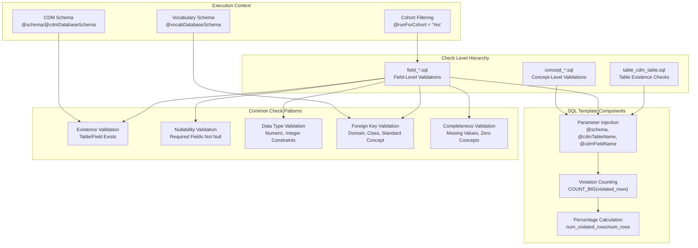
```mermaid
graph TB
    subgraph "Check Level Hierarchy"
        TABLE_LEVEL["table_cdm_table.sql<br/>Table Existence Checks"]
        FIELD_LEVEL["field_*.sql<br/>Field-Level Validations"] 
        CONCEPT_LEVEL["concept_*.sql<br/>Concept-Level Validations"]
    end
    
    subgraph "SQL Template Components"
        PARAM_INJECTION["Parameter Injection<br/>@schema, @cdmTableName, @cdmFieldName"]
        VIOLATION_COUNT["Violation Counting<br/>COUNT_BIG(violated_rows)"]
        PERCENTAGE_CALC["Percentage Calculation<br/>num_violated_rows/num_rows"]
    end
    
    subgraph "Common Check Patterns"
        EXISTENCE_CHECK["Existence Validation<br/>Table/Field Exists"]
        NULLABILITY_CHECK["Nullability Validation<br/>Required Fields Not Null"]
        DATATYPE_CHECK["Data Type Validation<br/>Numeric, Integer Constraints"]
        FK_VALIDATION["Foreign Key Validation<br/>Domain, Class, Standard Concept"]
        COMPLETENESS_CHECK["Completeness Validation<br/>Missing Values, Zero Concepts"]
    end
    
    subgraph "Execution Context"
        COHORT_FILTER["Cohort Filtering<br/>@runForCohort = 'Yes'"]
        VOCAB_SCHEMA["Vocabulary Schema<br/>@vocabDatabaseSchema"]
        CDM_SCHEMA["CDM Schema<br/>@schema/@cdmDatabaseSchema"]
    end
    
    %% Template structure
    TABLE_LEVEL --> PARAM_INJECTION
    FIELD_LEVEL --> PARAM_INJECTION
    CONCEPT_LEVEL --> PARAM_INJECTION
    
    PARAM_INJECTION --> VIOLATION_COUNT
    VIOLATION_COUNT --> PERCENTAGE_CALC
    
    %% Pattern implementation
    FIELD_LEVEL --> EXISTENCE_CHECK
    FIELD_LEVEL --> NULLABILITY_CHECK
    FIELD_LEVEL --> DATATYPE_CHECK
    FIELD_LEVEL --> FK_VALIDATION
    FIELD_LEVEL --> COMPLETENESS_CHECK
    
    %% Context integration
    COHORT_FILTER --> FIELD_LEVEL
    VOCAB_SCHEMA --> FK_VALIDATION
    CDM_SCHEMA --> EXISTENCE_CHECK
```

Sources: [inst/sql/sql_server/table_cdm_table.sql:1-38](), [inst/sql/sql_server/field_cdm_field.sql:1-34](), [inst/sql/sql_server/field_is_not_nullable.sql:1-54]()

## SQL Template Structure

All data quality checks follow a standardized SQL template structure that produces consistent output metrics. The template pattern ensures uniform handling of violation counting, percentage calculations, and denominator management.

### Standard Template Pattern

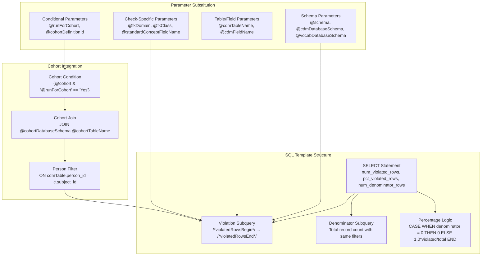
```mermaid
graph TD
    subgraph "SQL Template Structure"
        SELECT_CLAUSE["SELECT Statement<br/>num_violated_rows, pct_violated_rows, num_denominator_rows"]
        VIOLATION_SUBQUERY["Violation Subquery<br/>/*violatedRowsBegin*/ ... /*violatedRowsEnd*/"]
        DENOMINATOR_SUBQUERY["Denominator Subquery<br/>Total record count with same filters"]
        PERCENTAGE_LOGIC["Percentage Logic<br/>CASE WHEN denominator = 0 THEN 0 ELSE 1.0*violated/total END"]
    end
    
    subgraph "Parameter Substitution"
        SCHEMA_PARAMS["Schema Parameters<br/>@schema, @cdmDatabaseSchema, @vocabDatabaseSchema"]
        TABLE_FIELD_PARAMS["Table/Field Parameters<br/>@cdmTableName, @cdmFieldName"]
        CONDITIONAL_PARAMS["Conditional Parameters<br/>@runForCohort, @cohortDefinitionId"]
        CHECK_SPECIFIC_PARAMS["Check-Specific Parameters<br/>@fkDomain, @fkClass, @standardConceptFieldName"]
    end
    
    subgraph "Cohort Integration"
        COHORT_CONDITION["Cohort Condition<br/>{@cohort & '@runForCohort' == 'Yes'}"]
        COHORT_JOIN["Cohort Join<br/>JOIN @cohortDatabaseSchema.@cohortTableName"]
        PERSON_FILTER["Person Filter<br/>ON cdmTable.person_id = c.subject_id"]
    end
    
    SELECT_CLAUSE --> VIOLATION_SUBQUERY
    SELECT_CLAUSE --> DENOMINATOR_SUBQUERY
    SELECT_CLAUSE --> PERCENTAGE_LOGIC
    
    SCHEMA_PARAMS --> VIOLATION_SUBQUERY
    TABLE_FIELD_PARAMS --> VIOLATION_SUBQUERY
    CONDITIONAL_PARAMS --> COHORT_CONDITION
    CHECK_SPECIFIC_PARAMS --> VIOLATION_SUBQUERY
    
    COHORT_CONDITION --> COHORT_JOIN
    COHORT_JOIN --> PERSON_FILTER
    PERSON_FILTER --> VIOLATION_SUBQUERY
```

Sources: [inst/sql/sql_server/field_cdm_datatype.sql:15-46](), [inst/sql/sql_server/field_fk_domain.sql:20-58](), [inst/sql/sql_server/field_measure_value_completeness.sql:18-55]()

## Parameter Injection System

The SQL templates use a sophisticated parameter injection system that allows the same template to be reused across multiple tables, fields, and contexts. Parameters are injected using the `@parameterName` syntax.

### Core Parameter Types

| Parameter Category | Parameters | Purpose |
|-------------------|------------|---------|
| Schema Parameters | `@schema`, `@cdmDatabaseSchema`, `@vocabDatabaseSchema` | Database schema targeting |
| Entity Parameters | `@cdmTableName`, `@cdmFieldName` | Table and field targeting |
| Cohort Parameters | `@cohortDefinitionId`, `@cohortDatabaseSchema`, `@cohortTableName` | Population filtering |
| Check-Specific | `@fkDomain`, `@fkClass`, `@standardConceptFieldName` | Check logic configuration |

### Conditional Parameter Blocks

The templates use conditional parameter blocks to include or exclude code sections based on execution context:

```sql
{@cohort & '@runForCohort' == 'Yes'}?{
    JOIN @cohortDatabaseSchema.@cohortTableName c 
        ON cdmTable.person_id = c.subject_id
        AND c.cohort_definition_id = @cohortDefinitionId
}
```

Sources: [inst/sql/sql_server/field_fk_domain.sql:13-17](), [inst/sql/sql_server/field_fk_class.sql:14-18](), [inst/sql/sql_server/field_is_standard_valid_concept.sql:12-16]()

## Check Implementation Patterns

Different types of checks follow specific implementation patterns based on their validation logic. These patterns are consistently applied across all check templates.

### Existence Validation Pattern

Used by `table_cdm_table.sql` and `field_cdm_field.sql` to verify that database objects exist:

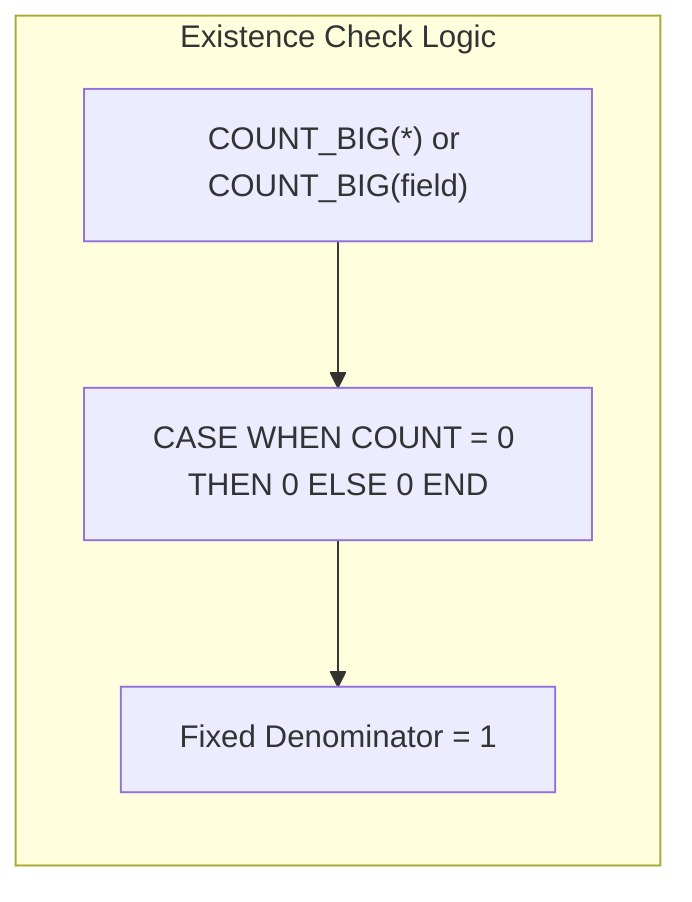
```mermaid
graph LR
    subgraph "Existence Check Logic"
        COUNT_QUERY["COUNT_BIG(*) or COUNT_BIG(field)"]
        CASE_LOGIC["CASE WHEN COUNT = 0 THEN 0 ELSE 0 END"]
        FIXED_DENOMINATOR["Fixed Denominator = 1"]
    end
    
    COUNT_QUERY --> CASE_LOGIC
    CASE_LOGIC --> FIXED_DENOMINATOR
```

Sources: [inst/sql/sql_server/table_cdm_table.sql:27-33](), [inst/sql/sql_server/field_cdm_field.sql:22-29]()

### Nullability Validation Pattern

Used by `field_is_not_nullable.sql` and `field_measure_value_completeness.sql` to check for missing values:

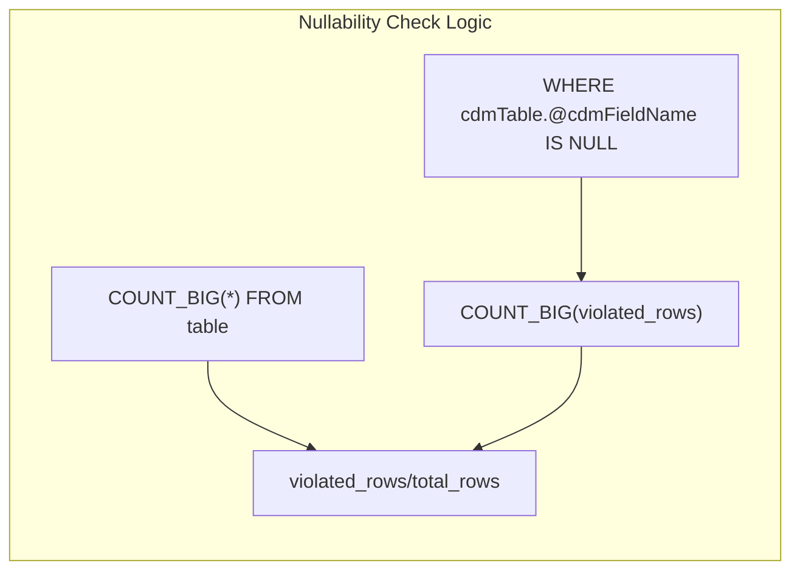
```mermaid
graph LR
    subgraph "Nullability Check Logic"
        NULL_WHERE["WHERE cdmTable.@cdmFieldName IS NULL"]
        VIOLATION_COUNT["COUNT_BIG(violated_rows)"]
        TOTAL_COUNT["COUNT_BIG(*) FROM table"]
        PERCENTAGE["violated_rows/total_rows"]
    end
    
    NULL_WHERE --> VIOLATION_COUNT
    TOTAL_COUNT --> PERCENTAGE
    VIOLATION_COUNT --> PERCENTAGE
```

Sources: [inst/sql/sql_server/field_is_not_nullable.sql:40-53](), [inst/sql/sql_server/field_measure_value_completeness.sql:41-54]()

### Foreign Key Validation Pattern

Used by `field_fk_domain.sql`, `field_fk_class.sql`, and `field_is_standard_valid_concept.sql` for concept validation:

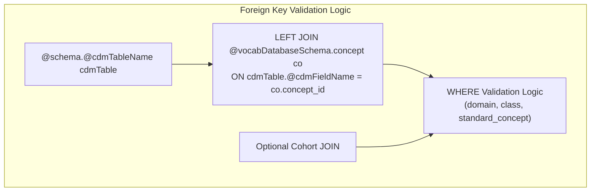
```mermaid
graph TD
    subgraph "Foreign Key Validation Logic"
        CDM_TABLE["@schema.@cdmTableName cdmTable"]
        VOCAB_JOIN["LEFT JOIN @vocabDatabaseSchema.concept co<br/>ON cdmTable.@cdmFieldName = co.concept_id"]
        VALIDATION_WHERE["WHERE Validation Logic<br/>(domain, class, standard_concept)"]
        COHORT_JOIN["Optional Cohort JOIN"]
    end
    
    CDM_TABLE --> VOCAB_JOIN
    VOCAB_JOIN --> VALIDATION_WHERE
    COHORT_JOIN --> VALIDATION_WHERE
```

Sources: [inst/sql/sql_server/field_fk_domain.sql:35-44](), [inst/sql/sql_server/field_fk_class.sql:37-46](), [inst/sql/sql_server/field_is_standard_valid_concept.sql:42-45]()

### Data Type Validation Pattern

Used by `field_cdm_datatype.sql` to validate numeric data types:

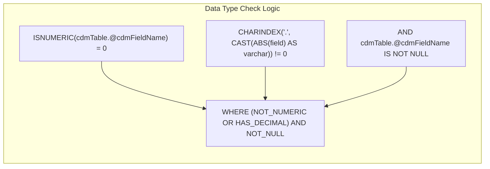
```mermaid
graph LR
    subgraph "Data Type Check Logic"
        ISNUMERIC_CHECK["ISNUMERIC(cdmTable.@cdmFieldName) = 0"]
        DECIMAL_CHECK["CHARINDEX('.', CAST(ABS(field) AS varchar)) != 0"]
        NOT_NULL_FILTER["AND cdmTable.@cdmFieldName IS NOT NULL"]
        COMBINED_WHERE["WHERE (NOT_NUMERIC OR HAS_DECIMAL) AND NOT_NULL"]
    end
    
    ISNUMERIC_CHECK --> COMBINED_WHERE
    DECIMAL_CHECK --> COMBINED_WHERE
    NOT_NULL_FILTER --> COMBINED_WHERE
```

Sources: [inst/sql/sql_server/field_cdm_datatype.sql:34-37]()

## Violation Identification System

Each check template includes a standardized `violatedRowsBegin` and `violatedRowsEnd` block that identifies specific violating records. This allows for detailed debugging and analysis of data quality issues.

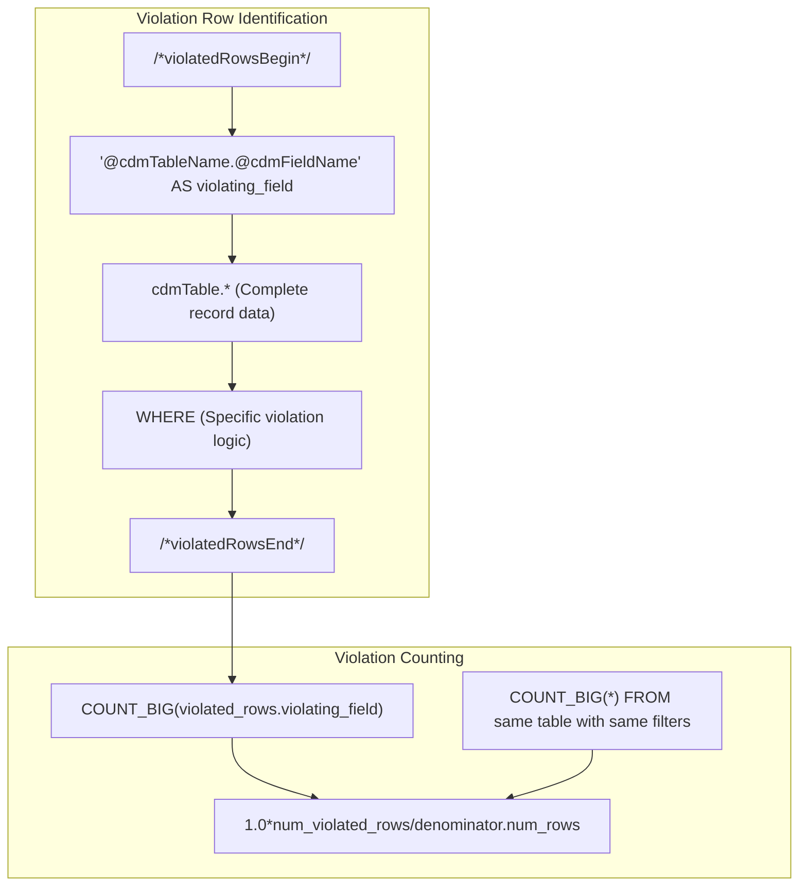
```mermaid
graph TB
    subgraph "Violation Row Identification"
        VIOLATED_ROWS_BEGIN["/*violatedRowsBegin*/"]
        VIOLATING_FIELD["'@cdmTableName.@cdmFieldName' AS violating_field"]
        FULL_RECORD["cdmTable.* (Complete record data)"]
        WHERE_CONDITION["WHERE (Specific violation logic)"]
        VIOLATED_ROWS_END["/*violatedRowsEnd*/"]
    end
    
    subgraph "Violation Counting"
        COUNT_VIOLATIONS["COUNT_BIG(violated_rows.violating_field)"]
        DENOMINATOR_COUNT["COUNT_BIG(*) FROM same table with same filters"]
        PERCENTAGE_CALC["1.0*num_violated_rows/denominator.num_rows"]
    end
    
    VIOLATED_ROWS_BEGIN --> VIOLATING_FIELD
    VIOLATING_FIELD --> FULL_RECORD
    FULL_RECORD --> WHERE_CONDITION
    WHERE_CONDITION --> VIOLATED_ROWS_END
    
    VIOLATED_ROWS_END --> COUNT_VIOLATIONS
    COUNT_VIOLATIONS --> PERCENTAGE_CALC
    DENOMINATOR_COUNT --> PERCENTAGE_CALC
```

Sources: [inst/sql/sql_server/field_fk_domain.sql:31-45](), [inst/sql/sql_server/field_is_standard_valid_concept.sql:32-46](), [inst/sql/sql_server/field_concept_record_completeness.sql:27-38]()

## Cohort Integration Pattern

Many checks support optional cohort-based filtering to restrict analysis to specific patient populations. This is implemented through conditional SQL blocks.

| Check Template | Cohort Support | Implementation |
|---------------|----------------|----------------|
| `field_fk_domain.sql` | Yes | Conditional JOIN with cohort table |
| `field_fk_class.sql` | Yes | Conditional JOIN with cohort table |
| `field_is_standard_valid_concept.sql` | Yes | Conditional JOIN with cohort table |
| `field_concept_record_completeness.sql` | Yes | Conditional JOIN with cohort table |
| `field_measure_value_completeness.sql` | Yes | Conditional JOIN with cohort table |
| `field_is_not_nullable.sql` | Yes | Conditional JOIN with cohort table |
| `field_is_primary_key.sql` | Yes | Conditional JOIN with cohort table |
| `table_cdm_table.sql` | No | Table-level check, no person filtering |
| `field_cdm_field.sql` | No | Field existence check, no person filtering |

Sources: [inst/sql/sql_server/field_fk_domain.sql:38-42](), [inst/sql/sql_server/field_concept_record_completeness.sql:32-36](), [inst/sql/sql_server/field_measure_value_completeness.sql:36-40]()# plausibleBeforeDeath • DataQualityDashboard

Toggle navigation [DataQualityDashboard](../../index.html) 2.7.0

  * [ ](../../index.html)
  * [Get started](../../articles/DataQualityDashboard.html)
  * [Reference](../../reference/index.html)
  * Articles 
    * [DQ Check Failure Thresholds](../../articles/Thresholds.html)
    * [DQ Check Statuses](../../articles/CheckStatusDefinitions.html)
    * [Adding a New Data Quality Check](../../articles/AddNewCheck.html)
    * [DQD for Cohorts](../../articles/DqdForCohorts.html)
    * [SQL-only Mode](../../articles/SqlOnly.html)
  * Data Quality Check Types 
    * [Index](../../articles/checkIndex.html)
    * [cdmTable](../../articles/checks/cdmTable.html)
    * [cdmField](../../articles/checks/cdmField.html)
    * [cdmDatatype](../../articles/checks/cdmDatatype.html)
    * [isPrimaryKey](../../articles/checks/isPrimaryKey.html)
    * [isForeignKey](../../articles/checks/isForeignKey.html)
    * [isRequired](../../articles/checks/isRequired.html)
    * [fkDomain](../../articles/checks/fkDomain.html)
    * [fkClass](../../articles/checks/fkClass.html)
    * [measurePersonCompleteness](../../articles/checks/measurePersonCompleteness.html)
    * [measureValueCompleteness](../../articles/checks/measureValueCompleteness.html)
    * [isStandardValidConcept](../../articles/checks/isStandardValidConcept.html)
    * [standardConceptRecordCompleteness](../../articles/checks/standardConceptRecordCompleteness.html)
    * [sourceConceptRecordCompleteness](../../articles/checks/sourceConceptRecordCompleteness.html)
    * [sourceValueCompleteness](../../articles/checks/sourceValueCompleteness.html)
    * [plausibleAfterBirth](../../articles/checks/plausibleAfterBirth.html)
    * [plausibleBeforeDeath](../../articles/checks/plausibleBeforeDeath.html)
    * [plausibleStartBeforeEnd](../../articles/checks/plausibleStartBeforeEnd.html)
    * [plausibleValueHigh](../../articles/checks/plausibleValueHigh.html)
    * [plausibleValueLow](../../articles/checks/plausibleValueLow.html)
    * [withinVisitDates](../../articles/checks/withinVisitDates.html)
    * [measureConditionEraCompleteness](../../articles/checks/measureConditionEraCompleteness.html)
    * [measureObservationPeriodOverlap](../../articles/checks/measureObservationPeriodOverlap.html)
    * [plausibleUnitConceptIds](../../articles/checks/plausibleUnitConceptIds.html)
    * [plausibleGenderUseDescendants](../../articles/checks/plausibleGenderUseDescendants.html)
  * [Changelog](../../news/index.html)


  * [](https://ohdsi.github.io/Hades)
  * [ ](https://github.com/OHDSI/DataQualityDashboard/)


# plausibleBeforeDeath

#### Maxim Moinat

#### 2025-08-27

Source: [`vignettes/checks/plausibleBeforeDeath.Rmd`](https://github.com/OHDSI/DataQualityDashboard/blob/HEAD/vignettes/checks/plausibleBeforeDeath.Rmd)

`plausibleBeforeDeath.Rmd`

## Summary

**Level** : FIELD  
**Context** : Verification  
**Category** : Plausibility  
**Subcategory** : Temporal  
**Severity** : Characterization ✔

## Description

The number and percent of records with a date value in the **cdmFieldName** field of the **cdmTableName** table that occurs more than 60 days after death. Note that this check replaces the previous `plausibleDuringLife` check.

## Definition

A record violates this check if the date is more than 60 days after the death date of the person, allowing administrative records directly after death.

  * _Numerator_ : The number of records where date in **cdmFieldName** is more than 60 days after the persons’ death date.
  * _Denominator_ : Total number of records of persons with a death date, in the **cdmTableName**.
  * _Related CDM Convention(s)_ : -Not linked to a convention-
  * _CDM Fields/Tables_ : This check runs on all date and datetime fields.
  * _Default Threshold Value_ : 1%


## User Guidance

Events are expected to occur between birth and death. The check `plausibleAfterbirth` checks for the former, this check for the latter. The 60-day period is a conservative estimate of the time it takes for administrative records to be updated after a person’s death. By default, both start and end dates are checked.

### Violated rows query
    
    
    SELECT 
        '@cdmTableName.@cdmFieldName' AS violating_field, 
        cdmTable.*
    FROM @cdmDatabaseSchema.@cdmTableName cdmTable
    JOIN @cdmDatabaseSchema.death de 
        ON cdmTable.person_id = de.person_id
    WHERE cdmTable.@cdmFieldName IS NOT NULL 
        AND CAST(cdmTable.@cdmFieldName AS DATE) > DATEADD(day, 60, de.death_date)

### ETL Developers

Start dates after death are likely to be source data issues, and failing this check should trigger investigation of the source data quality. End dates after death can occur due to derivation logic. For example, a drug exposure can be prescribed as being continued long after death. In such cases, it is recommended to update the logic to end the prescription at death.

### Data Users

For most studies, a low number of violating records will have limited impact on data use as it could be caused by lagging administrative records. However, it might signify a larger data quality issue. Note that the percentage violating records reported is among records from death persons and such might be slightly inflated if comparing to the overall population.

Developed by Katy Sadowski, Clair Blacketer, Maxim Moinat, Ajit Londhe, Anthony Sena, Anthony Molinaro, Frank DeFalco, Pavel Grafkin.

Site built with [pkgdown](https://pkgdown.r-lib.org/) 2.1.2.
# isForeignKey • DataQualityDashboard

Toggle navigation [DataQualityDashboard](../../index.html) 2.7.0

  * [ ](../../index.html)
  * [Get started](../../articles/DataQualityDashboard.html)
  * [Reference](../../reference/index.html)
  * Articles 
    * [DQ Check Failure Thresholds](../../articles/Thresholds.html)
    * [DQ Check Statuses](../../articles/CheckStatusDefinitions.html)
    * [Adding a New Data Quality Check](../../articles/AddNewCheck.html)
    * [DQD for Cohorts](../../articles/DqdForCohorts.html)
    * [SQL-only Mode](../../articles/SqlOnly.html)
  * Data Quality Check Types 
    * [Index](../../articles/checkIndex.html)
    * [cdmTable](../../articles/checks/cdmTable.html)
    * [cdmField](../../articles/checks/cdmField.html)
    * [cdmDatatype](../../articles/checks/cdmDatatype.html)
    * [isPrimaryKey](../../articles/checks/isPrimaryKey.html)
    * [isForeignKey](../../articles/checks/isForeignKey.html)
    * [isRequired](../../articles/checks/isRequired.html)
    * [fkDomain](../../articles/checks/fkDomain.html)
    * [fkClass](../../articles/checks/fkClass.html)
    * [measurePersonCompleteness](../../articles/checks/measurePersonCompleteness.html)
    * [measureValueCompleteness](../../articles/checks/measureValueCompleteness.html)
    * [isStandardValidConcept](../../articles/checks/isStandardValidConcept.html)
    * [standardConceptRecordCompleteness](../../articles/checks/standardConceptRecordCompleteness.html)
    * [sourceConceptRecordCompleteness](../../articles/checks/sourceConceptRecordCompleteness.html)
    * [sourceValueCompleteness](../../articles/checks/sourceValueCompleteness.html)
    * [plausibleAfterBirth](../../articles/checks/plausibleAfterBirth.html)
    * [plausibleBeforeDeath](../../articles/checks/plausibleBeforeDeath.html)
    * [plausibleStartBeforeEnd](../../articles/checks/plausibleStartBeforeEnd.html)
    * [plausibleValueHigh](../../articles/checks/plausibleValueHigh.html)
    * [plausibleValueLow](../../articles/checks/plausibleValueLow.html)
    * [withinVisitDates](../../articles/checks/withinVisitDates.html)
    * [measureConditionEraCompleteness](../../articles/checks/measureConditionEraCompleteness.html)
    * [measureObservationPeriodOverlap](../../articles/checks/measureObservationPeriodOverlap.html)
    * [plausibleUnitConceptIds](../../articles/checks/plausibleUnitConceptIds.html)
    * [plausibleGenderUseDescendants](../../articles/checks/plausibleGenderUseDescendants.html)
  * [Changelog](../../news/index.html)


  * [](https://ohdsi.github.io/Hades)
  * [ ](https://github.com/OHDSI/DataQualityDashboard/)


# isForeignKey

#### Dmytry Dymshyts, Katy Sadowski

#### 2025-08-27

Source: [`vignettes/checks/isForeignKey.Rmd`](https://github.com/OHDSI/DataQualityDashboard/blob/HEAD/vignettes/checks/isForeignKey.Rmd)

`isForeignKey.Rmd`

## Summary

**Level** : Field check  
**Context** : Verification  
**Category** : Conformance  
**Subcategory** : Relational  
**Severity** : Fatal 💀  


## Description

The number and percent of records that have a value in the **cdmFieldName** field in the **cdmTableName** table that does not exist in the **fkTableName** table.

## Definition

This check will make sure that all foreign keys as specified in the CDM version have a value in the related primary key field. While this issue should generally be prevented by foreign key database constraints, some database management systems such as Redshift do not enforce such constraints.

  * _Numerator_ : The number of non-null values in the foreign key column that do not exist in its corresponding primary key column
  * _Denominator_ : The total number of records in the table
  * _Related CDM Convention(s)_ : Foreign Key flag in [CDM table specs](https://ohdsi.github.io/CommonDataModel/index.html)
  * _CDM Fields/Tables_ : By default, this check runs on foreign key columns in the CDM
  * _Default Threshold Value_ : 0%


## User Guidance

This check failure must be resolved. Failures in various fields could impact analysis in many different ways, for example:

  * If some important event or qualifier (for example, type concept) is encoded by a non-existent concept, it can’t be included in a concept set or be a part of cohort definition or feature
  * If an event is linked to a non-existent person, it can’t be included in any cohort definition or analysis
  * If an event is linked to a non-existent visit, it will be missed in visit-level cohort definition logic


Many CDM columns are foreign keys to the `concept_id` column in the `CONCEPT` table. See below for suggested investigation steps for concept ID-related foreign key check failures:

  * An `_concept_id` missing from the CONCEPT table might be the result of an error in `SOURCE_TO_CONCEPT_MAP`; you may check it this way:


### Violated rows query
    
    
    SELECT *
    FROM @vocabSchema.source_to_concept_map 
      LEFT JOIN @vocabSchema.concept ON concept.concept_id = source_to_concept_map.target_concept_id
    WHERE concept.concept_id IS NULL;

  * Other types of concept-related errors can be investigated by inspecting the source values for impacted rows as follows:


    
    
    -- @cdmTableName.@cdmFieldName is the _concept_id or _source_concept_id field in a CDM table
    -- Inspect the contents of the _source_value field to investigate the source of the error
    
    SELECT 
      '@cdmTableName.@cdmFieldName' AS violating_field,  
      cdmTable.*,
      COUNT(*) OVER(PARTITION BY '@cdmTableName.@cdmFieldName') AS num_violations_per_concept
    FROM @cdmSchema.@cdmTableName  
      LEFT JOIN @vocabSchema.concept on @cdmTableName.@cdmFieldName = concept.concept_id  
    WHERE concept.concept_id IS NULL
    ORDER BY num_violations_per_concept DESC; 

  * 2-billion concepts are a common source of foreign key issues; for example, a check failure may arise if these concepts are used in some tables but not fully represented in all relevant vocabulary tables (CONCEPT, CONCEPT_RELATIONSHIP, etc.)
  * Similarly, make sure to check any hard-coded concept mappings in the ETL as a potential source of the issue


When an entry is missing from one of the other CDM tables (LOCATION, PERSON, PROVIDER, VISIT_DETAIL, VISIT_OCCURRENCE, PAYER_PLAN_PERIOD, NOTE, CARE_SITE, EPISODE), this likely originates from binding / key generation errors in the ETL.

### ETL Developers

As above, mapping or binding logic needs to be amended in your ETL in order to resolve this error.

### Data Users

Few options are available to correct this error without amending the ETL code that populated your OMOP CDM. If a limited proportion of rows are impacted, you could consider dropping them from your database; however, do so at your own risk and only if you are confident that doing so will not have a significant impact on the downstream use cases of your CDM. A less aggressive approach could be to retain the affected rows and document the scope of their impact (in order to resolve the check failure, nullable values can be set to NULL and non-nullable concept ID values to 0). However, it is strongly recommended to pursue resolution further upstream in the ETL.

Developed by Katy Sadowski, Clair Blacketer, Maxim Moinat, Ajit Londhe, Anthony Sena, Anthony Molinaro, Frank DeFalco, Pavel Grafkin.

Site built with [pkgdown](https://pkgdown.r-lib.org/) 2.1.2.
# Page: Overview

# Overview

<details>
<summary>Relevant source files</summary>

The following files were used as context for generating this wiki page:

- [.github/workflows/R_CMD_check_Hades.yml](.github/workflows/R_CMD_check_Hades.yml)
- [.github/workflows/R_CMD_check_main_weekly.yaml](.github/workflows/R_CMD_check_main_weekly.yaml)
- [README.md](README.md)
- [docs/404.html](docs/404.html)
- [docs/index.html](docs/index.html)

</details>


This document provides a comprehensive introduction to the DataQualityDashboard R package, its architecture, and core functionality for assessing data quality in OMOP Common Data Model (CDM) databases. 

For specific implementation details of check types, see [Check Types and Categories](#4.1). For detailed usage instructions, see [Getting Started](#2).

## System Purpose

DataQualityDashboard is an R package designed to systematically evaluate data quality in OMOP CDM instances. The system runs comprehensive data quality assessments using the Kahn Framework, which organizes checks into categories of Conformance, Completeness, and Plausibility across table, field, and concept levels.

The package supports OMOP CDM versions 5.2, 5.3, and 5.4, executing approximately 4,000 individual data quality checks through 24 parameterized check types. Results are evaluated against configurable thresholds and presented through an interactive Shiny dashboard.

**Sources:** [README.md:11-16](), [README.md:21-37]()

## High-Level System Architecture

The DataQualityDashboard system consists of several interconnected components that work together to assess, process, and visualize data quality results:

```mermaid
graph TB
    subgraph "Execution Engine"
        executeDqChecks["executeDqChecks()"]
        runCheck["runCheck()"]
        sqlOnly["sqlOnly Mode"]
    end
    
    subgraph "Configuration System"
        cdmSchema["CDM Schema Definitions<br/>v5.2, v5.3, v5.4"]
        checkDescriptions["Check Descriptions<br/>CSV Metadata"]
        thresholdFiles["Threshold Configuration<br/>JSON Files"]
    end
    
    subgraph "Check Framework"
        kahnFramework["Kahn Framework<br/>Categories & Contexts"]
        checkTypes["24 Check Types<br/>Parameterized Templates"]
        sqlTemplates["SQL Templates<br/>Database-Specific Queries"]
    end
    
    subgraph "Data Sources"
        omopCdm[("OMOP CDM Database")]
        vocabularyDb[("Vocabulary Database")]
        cdmSource[("CDM_SOURCE Table")]
    end
    
    subgraph "Results Processing"
        statusCalc["calculateNotApplicableStatus()"]
        thresholdEval["evaluateThresholds()"]
        caseConvert["convertResultsCase()"]
    end
    
    subgraph "Output & Visualization"
        jsonOutput["JSON Results"]
        csvOutput["CSV Export"]
        shinyDashboard["Shiny Dashboard<br/>Interactive Visualization"]
    end
    
    executeDqChecks --> runCheck
    executeDqChecks --> sqlOnly
    cdmSchema --> executeDqChecks
    checkDescriptions --> executeDqChecks
    thresholdFiles --> executeDqChecks
    
    kahnFramework --> checkTypes
    checkTypes --> sqlTemplates
    runCheck --> sqlTemplates
    
    sqlTemplates --> omopCdm
    sqlTemplates --> vocabularyDb
    cdmSource --> executeDqChecks
    
    runCheck --> statusCalc
    statusCalc --> thresholdEval
    thresholdEval --> caseConvert
    
    caseConvert --> jsonOutput
    caseConvert --> csvOutput
    jsonOutput --> shinyDashboard
```

**System Architecture Overview**

The system follows a layered architecture where the `executeDqChecks` function serves as the main orchestrator, coordinating between configuration management, check execution, and results processing components.

**Sources:** [README.md:23-37](), system diagrams provided

## Core Components

### Execution Engine

| Component | Function | Purpose |
|-----------|----------|---------|
| `executeDqChecks` | Main orchestrator | Coordinates entire data quality assessment process |
| `runCheck` | Individual check executor | Executes single data quality checks against database |
| `sqlOnly` mode | SQL generation | Produces SQL scripts without executing against database |

The execution engine supports multiple operational modes including live database execution, SQL-only script generation, and incremental result insertion for batch processing scenarios.

### Configuration Management

The system uses a multi-layered configuration approach:

- **CDM Schema Definitions**: Version-specific schema metadata for OMOP CDM v5.2, v5.3, and v5.4
- **Check Descriptions**: CSV files containing metadata for each check type
- **Threshold Configuration**: JSON files specifying pass/fail thresholds at table, field, and concept levels

### Data Quality Framework

The system implements the Kahn Framework for systematic data quality assessment:

```mermaid
graph TD
    subgraph "Kahn Framework Categories"
        conformance["Conformance<br/>Structure & Format Compliance"]
        completeness["Completeness<br/>Missing Data Assessment"]  
        plausibility["Plausibility<br/>Reasonable Value Validation"]
    end
    
    subgraph "Check Levels"
        tableLevel["TABLE Level<br/>High-level table validation"]
        fieldLevel["FIELD Level<br/>Column-specific checks"]
        conceptLevel["CONCEPT Level<br/>Vocabulary-based validation"]
    end
    
    subgraph "Check Types (24 Total)"
        cdmTable["cdmTable"]
        cdmField["cdmField"] 
        cdmDatatype["cdmDatatype"]
        isPrimaryKey["isPrimaryKey"]
        isForeignKey["isForeignKey"]
        isRequired["isRequired"]
        measurePersonCompleteness["measurePersonCompleteness"]
        plausibleValueLow["plausibleValueLow"]
        plausibleValueHigh["plausibleValueHigh"]
        plausibleGender["plausibleGenderUseDescendants"]
        others["... 14 additional check types"]
    end
    
    conformance --> tableLevel
    conformance --> fieldLevel
    completeness --> tableLevel
    completeness --> fieldLevel
    plausibility --> fieldLevel
    plausibility --> conceptLevel
    
    tableLevel --> cdmTable
    tableLevel --> measurePersonCompleteness
    fieldLevel --> cdmField
    fieldLevel --> cdmDatatype
    fieldLevel --> isPrimaryKey
    fieldLevel --> isForeignKey
    fieldLevel --> isRequired
    fieldLevel --> plausibleValueLow
    fieldLevel --> plausibleValueHigh
    conceptLevel --> plausibleGender
    
    cdmTable --> others
```

**Data Quality Check Organization**

The framework organizes checks systematically rather than as individual ad-hoc validations, enabling comprehensive coverage through parameterized templates.

**Sources:** [README.md:21-35](), [docs/index.html:205-212]()

## Check Type System

### Parameterized Check Templates

The system uses 24 parameterized check types that generate approximately 4,000 individual checks. Each check type follows a template pattern where parameters are substituted to create specific validations:

**Example Template:**
```
The number and percent of records with a value in the **cdmFieldName** field 
of the **cdmTableName** table less than **plausibleValueLow**.
```

**Applied to PERSON.YEAR_OF_BIRTH:**
```
The number and percent of records with a value in the **year_of_birth** field 
of the **PERSON** table less than **1850**.
```

### Check Level Distribution

| Level | Description | Example Checks |
|-------|-------------|----------------|
| **TABLE** | High-level table validation | `cdmTable`, `measurePersonCompleteness` |
| **FIELD** | Column-specific validation | `cdmDatatype`, `isRequired`, `plausibleValueLow` |
| **CONCEPT** | Vocabulary-based validation | `plausibleGenderUseDescendants`, `plausibleUnitConceptIds` |

**Sources:** [README.md:23-35](), [docs/index.html:206-212]()

## Results Processing Pipeline

The system processes check results through a multi-stage pipeline:

```mermaid
graph LR
    subgraph "Raw Results"
        checkExecution["Check Execution<br/>SQL Query Results"]
        executionMeta["Execution Metadata<br/>Timestamps, Versions"]
    end
    
    subgraph "Status Determination"
        calculateNotApplicableStatus["calculateNotApplicableStatus()"]
        evaluateThresholds["evaluateThresholds()"]
        errorHandling["Error Status Assignment"]
    end
    
    subgraph "Result Statuses"
        passed["PASSED<br/>Below threshold"]
        failed["FAILED<br/>Above threshold"]
        notApplicable["NOT_APPLICABLE<br/>Empty tables/fields"]
        error["ERROR<br/>Execution issues"]
    end
    
    subgraph "Output Processing"
        convertResultsCase["convertResultsCase()<br/>camelCase/snake_case"]
        formatOutput["Format Output<br/>JSON, CSV, Database"]
    end
    
    checkExecution --> calculateNotApplicableStatus
    executionMeta --> calculateNotApplicableStatus
    calculateNotApplicableStatus --> evaluateThresholds
    evaluateThresholds --> errorHandling
    
    errorHandling --> passed
    errorHandling --> failed
    errorHandling --> notApplicable
    errorHandling --> error
    
    passed --> convertResultsCase
    failed --> convertResultsCase
    notApplicable --> convertResultsCase
    error --> convertResultsCase
    
    convertResultsCase --> formatOutput
```

**Results Processing Flow**

The pipeline ensures consistent status determination and flexible output formatting to support various consumption patterns.

**Sources:** System diagrams provided, [README.md:37]()

## Database Requirements

The system requires proper configuration of the `CDM_SOURCE` table with specific metadata fields:

| Field | Purpose | Example |
|-------|---------|---------|
| `cdm_version` | CDM version identification | "5.4" |
| `cdm_source_name` | Descriptive database name | "MyHospital_CDM_2024" |
| `vocabulary_version` | Vocabulary version used | "v5.0 20-NOV-23" |

**Sources:** [README.md:49-67]()

## Output and Visualization

The system produces multiple output formats:

- **JSON Results**: Default structured output format
- **CSV Export**: Tabular format for external analysis  
- **Database Tables**: Direct insertion into results schemas
- **Shiny Dashboard**: Interactive web-based visualization

The Shiny dashboard provides comprehensive result exploration, filtering, and drill-down capabilities for data quality assessment workflows.

**Sources:** [README.md:37-41](), [docs/index.html:213-214]()# List DQ checks — listDqChecks • DataQualityDashboard

Toggle navigation [DataQualityDashboard](../index.html) 2.7.0

  * [ ](../index.html)
  * [Get started](../articles/DataQualityDashboard.html)
  * [Reference](../reference/index.html)
  * Articles 
    * [DQ Check Failure Thresholds](../articles/Thresholds.html)
    * [DQ Check Statuses](../articles/CheckStatusDefinitions.html)
    * [Adding a New Data Quality Check](../articles/AddNewCheck.html)
    * [DQD for Cohorts](../articles/DqdForCohorts.html)
    * [SQL-only Mode](../articles/SqlOnly.html)
  * Data Quality Check Types 
    * [Index](../articles/checkIndex.html)
    * [cdmTable](../articles/checks/cdmTable.html)
    * [cdmField](../articles/checks/cdmField.html)
    * [cdmDatatype](../articles/checks/cdmDatatype.html)
    * [isPrimaryKey](../articles/checks/isPrimaryKey.html)
    * [isForeignKey](../articles/checks/isForeignKey.html)
    * [isRequired](../articles/checks/isRequired.html)
    * [fkDomain](../articles/checks/fkDomain.html)
    * [fkClass](../articles/checks/fkClass.html)
    * [measurePersonCompleteness](../articles/checks/measurePersonCompleteness.html)
    * [measureValueCompleteness](../articles/checks/measureValueCompleteness.html)
    * [isStandardValidConcept](../articles/checks/isStandardValidConcept.html)
    * [standardConceptRecordCompleteness](../articles/checks/standardConceptRecordCompleteness.html)
    * [sourceConceptRecordCompleteness](../articles/checks/sourceConceptRecordCompleteness.html)
    * [sourceValueCompleteness](../articles/checks/sourceValueCompleteness.html)
    * [plausibleAfterBirth](../articles/checks/plausibleAfterBirth.html)
    * [plausibleBeforeDeath](../articles/checks/plausibleBeforeDeath.html)
    * [plausibleStartBeforeEnd](../articles/checks/plausibleStartBeforeEnd.html)
    * [plausibleValueHigh](../articles/checks/plausibleValueHigh.html)
    * [plausibleValueLow](../articles/checks/plausibleValueLow.html)
    * [withinVisitDates](../articles/checks/withinVisitDates.html)
    * [measureConditionEraCompleteness](../articles/checks/measureConditionEraCompleteness.html)
    * [measureObservationPeriodOverlap](../articles/checks/measureObservationPeriodOverlap.html)
    * [plausibleUnitConceptIds](../articles/checks/plausibleUnitConceptIds.html)
    * [plausibleGenderUseDescendants](../articles/checks/plausibleGenderUseDescendants.html)
  * [Changelog](../news/index.html)


  * [](https://ohdsi.github.io/Hades)
  * [ ](https://github.com/OHDSI/DataQualityDashboard/)


# List DQ checks

Source: [`R/listChecks.R`](https://github.com/OHDSI/DataQualityDashboard/blob/HEAD/R/listChecks.R)

`listDqChecks.Rd`

Details on all checks defined by the DataQualityDashboard Package.
    
    
    listDqChecks(
      cdmVersion = "5.3",
      tableCheckThresholdLoc = "default",
      fieldCheckThresholdLoc = "default",
      conceptCheckThresholdLoc = "default"
    )

## Arguments

cdmVersion
    

The CDM version to target for the data source. By default, 5.3 is used.

tableCheckThresholdLoc
    

The location of the threshold file for evaluating the table checks. If not specified the default thresholds will be applied.

fieldCheckThresholdLoc
    

The location of the threshold file for evaluating the field checks. If not specified the default thresholds will be applied.

conceptCheckThresholdLoc
    

The location of the threshold file for evaluating the concept checks. If not specified the default thresholds will be applied.

## Contents

Developed by Katy Sadowski, Clair Blacketer, Maxim Moinat, Ajit Londhe, Anthony Sena, Anthony Molinaro, Frank DeFalco, Pavel Grafkin.

Site built with [pkgdown](https://pkgdown.r-lib.org/) 2.1.2.
# Changelog • DataQualityDashboard

Toggle navigation [DataQualityDashboard](../index.html) 2.7.0

  * [ ](../index.html)
  * [Get started](../articles/DataQualityDashboard.html)
  * [Reference](../reference/index.html)
  * Articles 
    * [DQ Check Failure Thresholds](../articles/Thresholds.html)
    * [DQ Check Statuses](../articles/CheckStatusDefinitions.html)
    * [Adding a New Data Quality Check](../articles/AddNewCheck.html)
    * [DQD for Cohorts](../articles/DqdForCohorts.html)
    * [SQL-only Mode](../articles/SqlOnly.html)
  * Data Quality Check Types 
    * [Index](../articles/checkIndex.html)
    * [cdmTable](../articles/checks/cdmTable.html)
    * [cdmField](../articles/checks/cdmField.html)
    * [cdmDatatype](../articles/checks/cdmDatatype.html)
    * [isPrimaryKey](../articles/checks/isPrimaryKey.html)
    * [isForeignKey](../articles/checks/isForeignKey.html)
    * [isRequired](../articles/checks/isRequired.html)
    * [fkDomain](../articles/checks/fkDomain.html)
    * [fkClass](../articles/checks/fkClass.html)
    * [measurePersonCompleteness](../articles/checks/measurePersonCompleteness.html)
    * [measureValueCompleteness](../articles/checks/measureValueCompleteness.html)
    * [isStandardValidConcept](../articles/checks/isStandardValidConcept.html)
    * [standardConceptRecordCompleteness](../articles/checks/standardConceptRecordCompleteness.html)
    * [sourceConceptRecordCompleteness](../articles/checks/sourceConceptRecordCompleteness.html)
    * [sourceValueCompleteness](../articles/checks/sourceValueCompleteness.html)
    * [plausibleAfterBirth](../articles/checks/plausibleAfterBirth.html)
    * [plausibleBeforeDeath](../articles/checks/plausibleBeforeDeath.html)
    * [plausibleStartBeforeEnd](../articles/checks/plausibleStartBeforeEnd.html)
    * [plausibleValueHigh](../articles/checks/plausibleValueHigh.html)
    * [plausibleValueLow](../articles/checks/plausibleValueLow.html)
    * [withinVisitDates](../articles/checks/withinVisitDates.html)
    * [measureConditionEraCompleteness](../articles/checks/measureConditionEraCompleteness.html)
    * [measureObservationPeriodOverlap](../articles/checks/measureObservationPeriodOverlap.html)
    * [plausibleUnitConceptIds](../articles/checks/plausibleUnitConceptIds.html)
    * [plausibleGenderUseDescendants](../articles/checks/plausibleGenderUseDescendants.html)
  * [Changelog](../news/index.html)


  * [](https://ohdsi.github.io/Hades)
  * [ ](https://github.com/OHDSI/DataQualityDashboard/)


# Changelog 

Source: [`NEWS.md`](https://github.com/OHDSI/DataQualityDashboard/blob/HEAD/NEWS.md)

## DataQualityDashboard 2.7.0

This release includes:

#### New Checks

  * **measureObservationPeriodOverlap** : This new check identifies overlapping and back-to-back observation periods, which violate CDM conventions and can cause critical issues in analyses using OHDSI tools. See the [check documentation](https://ohdsi.github.io/DataQualityDashboard/articles/checks/measureObservationPeriodOverlap.html) for more details!


#### Check Updates

**Note that these updates may result in significant changes to your DQD results. However, we hope that the results will be more accurate and actionable! Please reach out with any questions or unexpected findings.**

  * Corrected [measureConditionEraCompleteness](https://ohdsi.github.io/DataQualityDashboard/articles/checks/measureConditionEraCompleteness.html) logic such that persons with no non-zero `condition_concept_id`s will _not_ fail the check (it is not required or recommended to create a condition era for unmapped condition occurrences)
  * Improved [standardConceptRecordCompleteness](https://ohdsi.github.io/DataQualityDashboard/articles/checks/standardConceptRecordCompleteness.html) and [sourceConceptRecordCompleteness](https://ohdsi.github.io/DataQualityDashboard/articles/checks/sourceConceptRecordCompleteness.html) logic: 
    * Expanded numerator _for non-required concept ID fields_ to include records with NULL concept ID and non-NULL source value 
      * Previously, missing source value mappings - a critical error - were not checked for non-required concept ID fields
      * NULL required concept ID fields are already checked in `isRequired`
    * Limited denominator to non-NULL concept ID for required fields, and to non-NULL concept ID _or_ non-NULL source value for non-required fields
    * Removed the exception which only checked `unit_concept_id` fields if `value_as_number` was non-NULL (a missing numeric value does not necessarily mean that a value of 0 is acceptable for the unit concept)
    * These changes discourage use of 0 as placeholder for missing units/statuses/etc. For non-required fields, concept ID of 0 should only be used if a source value is available
  * Refined `isStandardValidConcept`, adding non-NULL requirements for numerator and denominator in order to remove the overlap between this check and `isRequired`
  * Refined `plausibleUnitConceptIds` logic: 
    * Added some missing plausible units to the default threshold files
    * Removed the filter which limited the check to rows with a non-NULL `value_as_number` \- a wrong unit is a wrong unit, regardless of whether a value is available
    * Added a filter which limits the check to rows with either a non-zero unit or a missing unit, thus removing the overlap between this check and `measureStandardConceptCompleteness`


#### Bugfixes

  * Fixed Not Applicable status assignment - in certain cases, checks were being marked as NA when they should actually have been failing or passing
  * Removed `PAYER_PLAN_PERIOD.family_source_value` from `sourceValueCompleteness` check in v5.3 default threshold file (this field has no corresponding concept ID field and had this check enabled in error)
  * Disabled `plausibleValueHigh` check for `DRUG_EXPOSURE.quantity` to prevent false positive failures (the default value was in fact plausible for some liquid formulations; in order to accurately measure drug quantity plausibility this check would need to be customized at the concept level)
  * Casted `birth_datetime` to date in `plausibleAfterBirth` to prevent false positive failures for events occurring on the date of birth


#### Enhancements

  * Made `executeDqChecks` return value invisible
  * Write-to-table functionality improvements: 
    * In the public `writeJsonResultsToTable` function, an option is now provided to write all results to a single table (the approach used in `executeDqChecks` when `writeToTable` = TRUE). **Ulitimately, the approach which writes results to 3 separate tables will be deprecated** ; for now, a warning is added to prepare users for this change
    * Raise warning when write to table fails (previously, failures were silent)
  * Added automated tests on DuckDB and IRIS databases
  * Minor documentation updates


## DataQualityDashboard 2.6.3

This release includes a patch bugfix for the `standardConceptFieldName` update described below. The added field names had previously been added in the wrong column of the threshold file; this has now been fixed.

## DataQualityDashboard 2.6.2

This release includes:

#### Bugfixes

  * Some fields were missing a standardConceptFieldName for the sourceValueCompleteness check, causing those checks to fail with an error. The missing field names have now been added
  * Many unit plausibility checks were missing legitimate units from the list of plausible units - these have now been updated
  * Sample results files in the shinyApps folder which had been causing issues for some users in rendering the Shiny app have now been removed
  * The fkDomain check has been disabled for the episode.episode_object_concept_id and measurement.value_as_concept_id fields, as these fields have multiple acceptable domains. The check can only currently support a single accepted domain
  * The withinVisitDates check was previously incorrectly categorized as a Conformance check; it has been recategorized as Plausibility


#### New executeDqChecks Parameter

There is now a parameter, `checkSeverity`, which can be used to limit the execution of DQD to `fatal`, `convention`, and/or `characterization` checks. Fatal checks are checks that should never fail, under any circumstance, as they relate to the relational integrity of the CDM. Convention checks are checks on critical OMOP CDM conventions for which failures should be resolved whenever possible; however, some level of failure is unavoidable (i.e., standard concept mapping for source concepts with no suitable standard concept). Characterization checks provide users with an understanding of the quality of the underlying data and generally will need their thresholds modified to match expectations of the source.

#### Documentation

  * We added 2 more check documentation pages - all DQ checks now have documentation! Check out the newly added pages [here](https://ohdsi.github.io/DataQualityDashboard/articles/checkIndex.html) and please reach out with feedback as we continue improving our documentation!
  * We fixed a bug in the exclude checks sample code in CodeToRun.R


## DataQualityDashboard 2.6.1

This release includes:

#### Bugfixes

  * Checks 
    * `plausibleStartBeforeEnd` was failing if SOURCE_RELEASE_DATE was before CDM_RELEASE_DATE in the CDM_SOURCE table. This is the opposite of the correct logic! The check is now updated to fail if the CDM_RELEASE_DATE is before the SOURCE_RELEASE_DATE
    * `plausibleTemporalAfter` was throwing a syntax error in BigQuery due to the format of a hardcoded date in the SQL query. This query has now been updated to be compliant with SqlRender and the issue has been resolved
  * A dependency issue was causing `viewDqDashboard` to error out in newer versions of R. This has now been resolved
  * `SqlOnly` mode was failing due to the format of the new check `plausibleGenderUseDescendants`, which takes multiple concepts as an input. This has now been fixed


#### New Results Field

  * A new field has been added to the DQD results output - `executionTimeSeconds`. This field stores the execution time in seconds of each check in numeric format. (The existing `executionTime` field stores execution time as a string, making it difficult to use in analysis.)


#### Check Threshold Updates

The default thresholds for 2 checks were discovered to be inconsistently populated and occasionally set to illogical levels. These have now been fixed as detailed below.

  * The default thresholds for `sourceValueCompleteness` have been updated as follows: 
    * 10% for `_source_value` columns in condition_occurrence, measurement, procedure_occurrence, drug_exposure, and visit_occurrence tables
    * 100% for all other `_source_value` columns
  * The default thresholds for `sourceConceptRecordCompleteness` have been updated as follows: 
    * 10% for `_source_concept_id` columns in condition_occurrence, drug_exposure, measurement, procedure_occurrence, device_exposure, and observation tables
    * 100% for all other `_source_concept_id` columns


#### New Documentation

We have continued (and nearly completed) our initiative to add more comprehensive user documentation at the data quality check level. A dedicated documentation page is being created for each check type. Each check’s page includes detailed information about how its result is generated and what to do if it fails. Guidance is provided for both ETL developers and data users.

Check out the newly added pages [here](https://ohdsi.github.io/DataQualityDashboard/articles/checkIndex.html) and please reach out with feedback as we continue improving our documentation!

## DataQualityDashboard 2.6.0

This release includes:

#### New Checks

4 new data quality check types have been added in this release:

  * `plausibleStartBeforeEnd`: The number and percent of records with a value in the **cdmFieldName** field of the **cdmTableName** that occurs after the date in the **plausibleStartBeforeEndFieldName**.
  * `plausibleAfterBirth`: The number and percent of records with a date value in the **cdmFieldName** field of the **cdmTableName** table that occurs prior to birth.
  * `plausibleBeforeDeath`: The number and percent of records with a date value in the **cdmFieldName** field of the **cdmTableName** table that occurs after death.
  * `plausibleGenderUseDescendants`: For descendants of CONCEPT_ID **conceptId** (**conceptName**), the number and percent of records associated with patients with an implausible gender (correct gender = **plausibleGenderUseDescendants**).


The 3 temporal plausibilty checks are intended to **replace** `plausibleTemporalAfter` and `plausibleDuringLife`, for a more comprehensive and clear approach to various temporality scenarios. `plausibleGenderUseDescendants` is intended to **replace** `plausibleGender`, to enhance readability of the DQD results and improve performance. The replaced checks are still available and enabled by default in DQD; however, in a future major release, these checks will be deprecated. Please plan accordingly.

For more information on the new checks, please check the [Check Type Definitions](https://ohdsi.github.io/DataQualityDashboard/articles/CheckTypeDescriptions.html) documentation page. If you’d like to disable the deprecated checks, please see the suggested check exclusion workflow in our Getting Started code [here](https://ohdsi.github.io/DataQualityDashboard/articles/DataQualityDashboard.html).

#### Check Updates

  * The number of measurements checked in `plausibleUnitConceptIds` has been reduced, and the lists of plausible units for those measurements have been re-reviewed and updated for accuracy. This change is intended to improve performance and reliability of this check. Please file an issue if you would like to contribute additional measurements + plausible units to be checked in the future
  * Some erroneous `plausibleValueLow` thresholds have been corrected to prevent false positive failures from occurring


#### New Documentation

We have begun an initiative to add more comprehensive user documentation at the data quality check level. A dedicated documentation page is being created for each check type. Each check’s page will include detailed information about how its result is generated and what to do if it fails. Guidance is provided for both ETL developers and data users.

9 pages have been added so far, and the rest will come in a future release. Check them out [here](https://ohdsi.github.io/DataQualityDashboard/articles/checkIndex.html) and please reach out with feedback as we continue improving our documentation!

## DataQualityDashboard 2.5.0

This release includes:

#### New Feature

A new function `writeDBResultsToJson` which can be used to write DQD results previously written to a database table (by setting `writeToTable` = TRUE in `executeDqChecks` or by using the `writeJsonResultsToTable` function) into a JSON file in the standard DQD JSON format.

#### Bugfixes

  * DQD previously threw an error if the CDM_SOURCE table contained more than 1 row. It has now been updated to select a random row from CDM_SOURCE to use for its metadata and warn the user upon doing this. Whether or not CDM_SOURCE _should_ ever contain more than 1 row is still an unresolved discussion in the community. Either way, DQD should be allowed to run if the table has been improperly populated - and perhaps check(s) should be added for its proper use once a convention is finalized
  * Fixed additional field level checks (fkDomain, fkClass, plausibleTemporalAfter) to incorporate user-specified `vocabDatabaseSchema` where appropriate
  * Additional minor bugfixes & refactors


## DataQualityDashboard 2.4.1

This release includes:

  * Minor documentation updates
  * A patch for an issue in one of DQD’s transitive dependencies, `vroom`
  * Test suite upgrades to run remote DB tests against OMOP v5.4, and to add Redshift to remote DB tests


## DataQualityDashboard 2.4.0

This release includes:

#### Threshold file updates

**The following changes involve updates to the default data quality check threshold files. If you are currently using an older version of DQD and update to v2.4.0, you may see changes in your DQD results. The failure threshold changes are fixes to incorrect thresholds in the v5.4 files and thus should result in more accurate, easier to interpret results. The unit concept ID changes ensure that long-invalid concepts will no longer be accepted as plausible measurement units.**

  * The incorrect failure thresholds for `measurePersonCompleteness` and `measureValueCompleteness` were fixed in the v5.4 table & field level threshold files. This issue has existed since v5.4 support was initially added in March 2022 
    * Many `measurePersonCompleteness` checks had a threshold of 0 when it should have been 95 or 100
    * Many `measureValueCompleteness` checks had a threshold of 100 when it should have been 0, and many had no threshold (defaulting to 0) when it should have been 100
    * The thresholds have now been updated to match expectations for required/non-required tables/fields
  * In the v5.2, v5.3, and v5.4 table level threshold files, `measurePersonCompleteness` for the DEATH table has been toggled to `Yes`, with a threshold of 100
  * In the v5.2, v5.3, and v5.4 concept level threshold files, all references to unit concept 9117 in `plausibleUnitConceptIds` have been updated to 720870. Concept 9117 became non-standard and was replaced with concept 720870, on 28-Mar-2022
  * In the v5.2, v5.3, and v5.4 concept level threshold files, all references to unit concepts 9258 and 9259 in `plausibleUnitConceptIds` have been removed. These concepts were deprecated on 05-May-2022


#### Bugfix

  * Call to new function `convertJsonResultsFileCase` in Shiny app was appended with `DataQualityDashboard::`. This prevents potential issues related to package loading and function naming conflicts


Some minor refactoring of testthat files and package build configuration and some minor documentation updates were also added in this release.

## DataQualityDashboard 2.3.0

This release includes:

#### New features

  * _New SQL-only Mode:_ Setting `sqlOnly` and `sqlOnlyIncrementalInsert` to TRUE in `executeDqChecks` will return (but not run) a set of SQL queries that, when executed, will calculate the results of the DQ checks and insert them into a database table. Additionally, `sqlOnlyUnionCount` can be used to specify a number of SQL queries to union for each check type, allowing for parallel execution of these queries and potentially large performance gains. See the [SqlOnly vignette](https://ohdsi.github.io/DataQualityDashboard/articles/SqlOnly.html) for details
  * _Results File Case Converter:_ The new function `convertJsonResultsFileCase` can be used to convert the keys in a DQD results JSON file between snakecase and camelcase. This allows reading of v2.1.0+ JSON files in older DQD versions, and other conversions which may be necessary for secondary use of the DQD results file. See [function documentation](https://ohdsi.github.io/DataQualityDashboard/reference/convertJsonResultsFileCase.html) for details


#### Bugfixes

  * In the v2.1.0 release, all DQD variables were converted from snakecase to camelcase, including those in the results JSON file. This resulted in errors for users trying to view results files generated by older DQD versions in DQD v2.1.0+. This issue has now been fixed. `viewDqDashboard` will now automatically convert the case of pre-v2.1.0 results files to camelcase so that older results files may be viewed in v2.3.0+


## DataQualityDashboard 2.2.0

This release includes:

#### New features

  * `cohortTableName` parameter added to `executeDqChecks`. Allows user to specify the name of the cohort table when running DQD on a cohort. Defaults to `"cohort"`


#### Bugfixes

  * Fixed several bugs in the default threshold files: 
    * Updated plausible low value for specimen quantity from 1 to 0
    * Removed foreign key domains for episode object concept ID (multitude of plausible domains make checking this field infeasible)
    * Updated date format for hard-coded dates to `YYYYMMDD` to conform to SqlRender standard
    * Added DEATH checks to v5.2 and v5.3
    * Fixed field level checks to incorporate user-specified `vocabDatabaseSchema` and `cohortDatabaseSchema` where appropriate
  * Removed `outputFile` parameter from DQD setup vignette (variable not set in script)
  * Removed hidden BOM character from several threshold csv files, and updated csv read method to account for BOM character moving forward. This character caused an error on some operating systems


And some minor documentation updates for clarity/accuracy.

## DataQualityDashboard 2.1.2

  1. Fixing bug in cdmDatatype check SQL that was causing NULL values to fail the check.


## DataQualityDashboard 2.1.1

  1. Updating author list in DESCRIPTION.


## DataQualityDashboard 2.1.0

This release includes:

#### Bugfixes

  * cdmDatatype check, which checks that values in integer columns are integers, updated so that float values will now fail the check
  * Quotes removed from `offset` column name in v5.4 thresholds file so that this column is skipped by DQD in all cases (use of reserved word causes failures in some SQL dialects)
  * Broken images fixed in addNewCheck vignette


#### HADES requirements

  * All snakecase variables updated to camelcase
  * Global variable binding R Check note resolved


## DataQualityDashboard 2.0.0

This release includes:

#### New check statuses

  * **Not Applicable** identifies checks with no data to support them
  * **Error** identifies checks that failed due to a SQL error


#### New Checks

  * **measureConditionEraCompleteness** checks to make sure that every person with a Condition_Era record have a record in Condition_Occurrence as well
  * **withinVisitDates** looks at clinical facts and the visits they are associated with to make sure that the visit dates occur within one week on either side of the visit
  * **plausibleUnitConceptIds** identifies records with invalid Unit_Concept_Ids by Measurement_Concept_Id


#### outputFolder input parameter

  * The `outputFolder` parameter for the `executeDqChecks` function is now REQUIRED and no longer has a default value. **This may be a breaking change for users who have not specified this parameter in their script to run DQD.**


#### Removal of measurement plausibility checks

  * Most plausibleValueLow and plausibleValueHigh measurement values were removed from the concept check threshold files, due to feedback from the community that many of these ranges included plausible values and as such were causing unexpected check failures. An initiative is planned to reinterrogate these ranges and add them back once the team has higher confidence that they will only flag legitimately implausible values


#### Integrated testing was also added and the package was refactored on the backend

## DataQualityDashboard 1.4.1

No material changes from v1.4, this adds a correct `DESCRIPTION` file with the correct DQD version

## DataQualityDashboard 1.4

This release provides support for `CDM v5.4` and incorporates minor bug fixes related to incorrectly assigned checks in the control files.

## DataQualityDashboard 1.3.1

This fixes a small bug and removes a duplicate record in the concept level checks that was throwing an error.

## DataQualityDashboard 1.3

This release includes additional concept level checks to support the OHDSI Symposium 2020 study-a-thon and bug fixes to the `writeJSONToTable` function. This is the release that study-a-thon data partners should use.

## DataQualityDashboard 1.2

This is a bug fix release that updates how notes are viewed in the UI and adds CDM table, field, and check name to the final table.

## DataQualityDashboard 1.1

This release of the Data Quality Dashboard incorporates the following features: - Addition of notes fields in the threshold files - Addition of notes to the UI - Functionality to run the DQD on a cohort - Fixes the `writeToTable`, `writeJsonToTable` functions

## DataQualityDashboard 1.0

This is the first release of the OHDSI Data Quality Dashboard tool.

## Contents

Developed by Katy Sadowski, Clair Blacketer, Maxim Moinat, Ajit Londhe, Anthony Sena, Anthony Molinaro, Frank DeFalco, Pavel Grafkin.

Site built with [pkgdown](https://pkgdown.r-lib.org/) 2.1.2.
# sourceConceptRecordCompleteness • DataQualityDashboard

Toggle navigation [DataQualityDashboard](../../index.html) 2.7.0

  * [ ](../../index.html)
  * [Get started](../../articles/DataQualityDashboard.html)
  * [Reference](../../reference/index.html)
  * Articles 
    * [DQ Check Failure Thresholds](../../articles/Thresholds.html)
    * [DQ Check Statuses](../../articles/CheckStatusDefinitions.html)
    * [Adding a New Data Quality Check](../../articles/AddNewCheck.html)
    * [DQD for Cohorts](../../articles/DqdForCohorts.html)
    * [SQL-only Mode](../../articles/SqlOnly.html)
  * Data Quality Check Types 
    * [Index](../../articles/checkIndex.html)
    * [cdmTable](../../articles/checks/cdmTable.html)
    * [cdmField](../../articles/checks/cdmField.html)
    * [cdmDatatype](../../articles/checks/cdmDatatype.html)
    * [isPrimaryKey](../../articles/checks/isPrimaryKey.html)
    * [isForeignKey](../../articles/checks/isForeignKey.html)
    * [isRequired](../../articles/checks/isRequired.html)
    * [fkDomain](../../articles/checks/fkDomain.html)
    * [fkClass](../../articles/checks/fkClass.html)
    * [measurePersonCompleteness](../../articles/checks/measurePersonCompleteness.html)
    * [measureValueCompleteness](../../articles/checks/measureValueCompleteness.html)
    * [isStandardValidConcept](../../articles/checks/isStandardValidConcept.html)
    * [standardConceptRecordCompleteness](../../articles/checks/standardConceptRecordCompleteness.html)
    * [sourceConceptRecordCompleteness](../../articles/checks/sourceConceptRecordCompleteness.html)
    * [sourceValueCompleteness](../../articles/checks/sourceValueCompleteness.html)
    * [plausibleAfterBirth](../../articles/checks/plausibleAfterBirth.html)
    * [plausibleBeforeDeath](../../articles/checks/plausibleBeforeDeath.html)
    * [plausibleStartBeforeEnd](../../articles/checks/plausibleStartBeforeEnd.html)
    * [plausibleValueHigh](../../articles/checks/plausibleValueHigh.html)
    * [plausibleValueLow](../../articles/checks/plausibleValueLow.html)
    * [withinVisitDates](../../articles/checks/withinVisitDates.html)
    * [measureConditionEraCompleteness](../../articles/checks/measureConditionEraCompleteness.html)
    * [measureObservationPeriodOverlap](../../articles/checks/measureObservationPeriodOverlap.html)
    * [plausibleUnitConceptIds](../../articles/checks/plausibleUnitConceptIds.html)
    * [plausibleGenderUseDescendants](../../articles/checks/plausibleGenderUseDescendants.html)
  * [Changelog](../../news/index.html)


  * [](https://ohdsi.github.io/Hades)
  * [ ](https://github.com/OHDSI/DataQualityDashboard/)


# sourceConceptRecordCompleteness

#### Katy Sadowski

#### 2025-08-27

Source: [`vignettes/checks/sourceConceptRecordCompleteness.Rmd`](https://github.com/OHDSI/DataQualityDashboard/blob/HEAD/vignettes/checks/sourceConceptRecordCompleteness.Rmd)

`sourceConceptRecordCompleteness.Rmd`

## Summary

**Level** : FIELD  
**Context** : Verification  
**Category** : Completeness  
**Subcategory** :  
**Severity** : CDM convention ⚠  


## Description

The number and percent of records with a value of 0 in the source concept field @cdmFieldName in the @cdmTableName table.

NB: In non-required fields, missing values are also counted as failures when a source value is available.

## Definition

  * _Numerator_ : The number of rows with a value of 0 in the `_source_concept_id` source concept field. For non-required fields, also includes rows where the `_source_concept_id` field is NULL and the corresponding `_source_value` field is not NULL.
  * _Denominator_ : The total number of rows in the table where the `_source_concept_id` field is not NULL or, for non-required fields, the corresponding `_source_value` field is not NULL.
  * _Related CDM Convention(s)_ : [Source concept mapping](https://ohdsi.github.io/CommonDataModel/dataModelConventions.html#Fields)
  * _CDM Fields/Tables_ : All source concept ID (`_source_concept_id`) columns in all event tables.
  * _Default Threshold Value_ : 
    * 10% for source concept ID columns in condition, drug, measurement, procedure, device, and observation tables
    * 100% for all other source concept ID columns


## User Guidance

Source concept mapping is an important part of the OMOP concept mapping process which allows data users insight into the provenance of the data they are analyzing. It’s important to populate the source concept ID field for all source values that exist in the OMOP vocabulary. Failures of this check should be well-understood and documented so that data users can plan accordingly in the case missing data might impact their analysis.

### ETL Developers

Recall that the `_source_concept_id` columns should contain the OMOP concept representing the exact code used in the source data for a given record: “If the <_source_value> is coded in the source data using an OMOP supported vocabulary put the concept id representing the source value here.”

A failure of this check usually indicates a failure to map a source value to an OMOP concept. In some cases, such a failure can and should be remediated in the concept-mapping step of the ETL. In other cases, it may represent a mapping that currently is not possible to implement.

To investigate the failure, run the following query:
    
    
    SELECT  
      concept.concept_name AS standard_concept_name, 
      cdmTable._concept_id, -- standard concept ID field for the table 
      c2.concept_name AS source_value_concept_name, 
      cdmTable._source_value, -- source value field for the table 
      COUNT(*) 
    FROM @cdmDatabaseSchema.@cdmTableName cdmTable 
    LEFT JOIN @vocabDatabaseSchema.concept ON concept.concept_id = cdmTable._concept_id 
    -- WARNING this join may cause fanning if a source value exists in multiple vocabularies 
    LEFT JOIN @vocabDatabaseSchema.concept c2 ON concept.concept_code = cdmTable._source_value 
    AND c2.domain_id = <Domain of cdmTable> 
    WHERE cdmTable.@cdmFieldName = 0  
    GROUP BY 1,2,3 
    ORDER BY 4 DESC 

The query results will give you a summary of the source codes which failed to map to an OMOP concept. Inspecting this data should give you an initial idea of what might be going on.

If source values return legitimate matches on concept_code, it’s possible that there is an error in the concept mapping step of your ETL. Please note that while the `_source_concept_id` fields are technically not required, it is highly recommended to populate them with OMOP concepts whenever possible. This will greatly aid analysts in understanding the provenance of the data.

If source values do NOT return matches on concept_code and you are NOT handling concept mapping locally for a non-OMOP source vocabulary, then you likely have a malformed source code or one that does not exist in the OMOP vocabulary. Please see the documentation in the [standardConceptRecordCompleteness](standardConceptRecordCompleteness.html) page for instructions on how to handle this scenario.

### Data Users

Since most standard OHDSI analytic workflows rely on the standard concept field and not the source concept field, failures of this check will not necessarily impact your analysis. However, having the source concept will give you a better understanding of the provenance of the code and highlight potential issues where meaning is lost due to mapping to a standard concept.

Utilize the investigation queries above to understand the scope and impact of the mapping failures on your specific analytic use case. If none of the affected codes seem to be relevant for your analysis, it may be acceptable to ignore the failure. However, since it is not always possible to understand exactly what a given source value represents, you should proceed with caution and confirm any findings with your ETL provider if possible.

Developed by Katy Sadowski, Clair Blacketer, Maxim Moinat, Ajit Londhe, Anthony Sena, Anthony Molinaro, Frank DeFalco, Pavel Grafkin.

Site built with [pkgdown](https://pkgdown.r-lib.org/) 2.1.2.
# Execute and View Data Quality Checks on OMOP CDM Database • DataQualityDashboard

Toggle navigation [DataQualityDashboard](index.html) 2.7.0

  * [ ](index.html)
  * [Get started](articles/DataQualityDashboard.html)
  * [Reference](reference/index.html)
  * Articles 
    * [DQ Check Failure Thresholds](articles/Thresholds.html)
    * [DQ Check Statuses](articles/CheckStatusDefinitions.html)
    * [Adding a New Data Quality Check](articles/AddNewCheck.html)
    * [DQD for Cohorts](articles/DqdForCohorts.html)
    * [SQL-only Mode](articles/SqlOnly.html)
  * Data Quality Check Types 
    * [Index](articles/checkIndex.html)
    * [cdmTable](articles/checks/cdmTable.html)
    * [cdmField](articles/checks/cdmField.html)
    * [cdmDatatype](articles/checks/cdmDatatype.html)
    * [isPrimaryKey](articles/checks/isPrimaryKey.html)
    * [isForeignKey](articles/checks/isForeignKey.html)
    * [isRequired](articles/checks/isRequired.html)
    * [fkDomain](articles/checks/fkDomain.html)
    * [fkClass](articles/checks/fkClass.html)
    * [measurePersonCompleteness](articles/checks/measurePersonCompleteness.html)
    * [measureValueCompleteness](articles/checks/measureValueCompleteness.html)
    * [isStandardValidConcept](articles/checks/isStandardValidConcept.html)
    * [standardConceptRecordCompleteness](articles/checks/standardConceptRecordCompleteness.html)
    * [sourceConceptRecordCompleteness](articles/checks/sourceConceptRecordCompleteness.html)
    * [sourceValueCompleteness](articles/checks/sourceValueCompleteness.html)
    * [plausibleAfterBirth](articles/checks/plausibleAfterBirth.html)
    * [plausibleBeforeDeath](articles/checks/plausibleBeforeDeath.html)
    * [plausibleStartBeforeEnd](articles/checks/plausibleStartBeforeEnd.html)
    * [plausibleValueHigh](articles/checks/plausibleValueHigh.html)
    * [plausibleValueLow](articles/checks/plausibleValueLow.html)
    * [withinVisitDates](articles/checks/withinVisitDates.html)
    * [measureConditionEraCompleteness](articles/checks/measureConditionEraCompleteness.html)
    * [measureObservationPeriodOverlap](articles/checks/measureObservationPeriodOverlap.html)
    * [plausibleUnitConceptIds](articles/checks/plausibleUnitConceptIds.html)
    * [plausibleGenderUseDescendants](articles/checks/plausibleGenderUseDescendants.html)
  * [Changelog](news/index.html)


  * [](https://ohdsi.github.io/Hades)
  * [ ](https://github.com/OHDSI/DataQualityDashboard/)


# DataQualityDashboard

DataQualityDashboard is part of [HADES](https://ohdsi.github.io/Hades).

The goal of the Data Quality Dashboard (DQD) project is to design and develop an open-source tool to expose and evaluate observational data quality.

# Introduction

This package will run a series of data quality checks against an OMOP CDM instance (currently supports v5.4, v5.3 and v5.2). It systematically runs the checks, evaluates the checks against some pre-specified threshold, and then communicates what was done in a transparent and easily understandable way.

# Overview

The quality checks were organized according to the Kahn Framework1 which uses a system of categories and contexts that represent strategies for assessing data quality. For an introduction to the kahn framework please click [here](https://www.ncbi.nlm.nih.gov/pmc/articles/PMC5051581/).

Using this framework, the Data Quality Dashboard takes a systematic-based approach to running data quality checks. Instead of writing thousands of individual checks, we use “data quality check types”. These “check types” are more general, parameterized data quality checks into which OMOP tables, fields, and concepts can be substituted to represent a singular data quality idea. For example, one check type might be written as

_The number and percent of records with a value in the**cdmFieldName** field of the **cdmTableName** table less than **plausibleValueLow**._

This would be considered an atemporal plausibility verification check because we are looking for implausibly low values in some field based on internal knowledge. We can use this check type to substitute in values for **cdmFieldName** , **cdmTableName** , and **plausibleValueLow** to create a unique data quality check. If we apply it to PERSON.YEAR_OF_BIRTH here is how that might look:

_The number and percent of records with a value in the**year_of_birth** field of the **PERSON** table less than **1850**._

And, since it is parameterized, we can similarly apply it to DRUG_EXPOSURE.days_supply:

_The number and percent of records with a value in the**days_supply** field of the **DRUG_EXPOSURE** table less than **0**._

Version 1 of the tool includes 24 different check types organized into Kahn contexts and categories. Additionally, each data quality check type is considered either a table check, field check, or concept-level check. Table-level checks are those evaluating the table at a high-level without reference to individual fields, or those that span multiple event tables. These include checks making sure required tables are present or that at least some of the people in the PERSON table have records in the event tables. Field-level checks are those related to specific fields in a table. The majority of the check types in version 1 are field-level checks. These include checks evaluating primary key relationship and those investigating if the concepts in a field conform to the specified domain. Concept-level checks are related to individual concepts. These include checks looking for gender-specific concepts in persons of the wrong gender and plausible values for measurement-unit pairs. For a detailed description and definition of each check type please click [here](https://ohdsi.github.io/DataQualityDashboard/articles/CheckTypeDescriptions).

After systematically applying the 24 check types to an OMOP CDM version approximately 4,000 individual data quality checks are resolved, run against the database, and evaluated based on a pre-specified threshold. The R package then creates a json object that is read into an RShiny application to view the results.


# Features

  * Utilizes configurable data check thresholds
  * Analyzes data in the OMOP Common Data Model format for all data checks
  * Produces a set of data check results with supplemental investigation assets.


# Data Requirements

Prior to execution the DataQualityDashboard package requires that the CDM_SOURCE table is properly populated. The following table is a guide to the expected contents of the CDM_SOURCE table.

cdmFieldName | userGuidance | etlConventions  
---|---|---  
cdm_source_name | The name of the CDM instance. | Descriptive name for the source data.  
cdm_source_abbreviation | The abbreviation of the CDM instance. | The abbreviation should consistent for different release from the same source.  
cdm_holder | The holder of the CDM instance. | The institution that controls access to the data. If possible include contact information for who to contact to request access to the data.  
source_description | The description of the CDM instance. | Add notes, caveats, special characteristics about the source data that would not be assumed from the general descriptive name. This description intended to help analysts determine if the data is suitable for the problem they are studying.  
source_documentation_reference | Reference to where one can find documentation about the source data. | Can include URLs, file name, source data experts contact information (if they agree to it)  
cdm_etl_reference | Reference to where one can find documentation about the source to ETL into OMOP CDM. | Assuming there is a document or files (such as Rabbit in the Hat) describing the ETL. May be the location of the ETL source and documentation repository.  
source_release_date | The release date of the source data. | When the source data was made available for ETL’ing. For sites doing incremental updates, the date the last increment made available. This implies that for sites doing incremental updates the CDM Source table should be updated to reflect that changes were made to the CDM.  
cdm_release_date | The release date of the CDM instance. | When the source data was made available for general use. For sites doing incremental updates, this implies that the CDM Source table should be updated to reflect that changes were made to the CDM.  
cdm_version | Identifies the CDM version | Enter the numeric portion of the version, e.g. 5.4  
cdm_version_concept_id | The Concept Id representing the version of the CDM. | SELECT concept_id WHERE domain = Metadata and vocabulary_id = CDM and concept_code like %[numeric portion of the version]%  
vocabulary_version | The vocabulary version used in the ETL | Obtained by SELECT vocabulary_version FROM vocabulary WHERE vocabulary_id = ‘None’  
  
# Technology

DataQualityDashboard is an R package

# System Requirements

Requires R (version 3.2.2 or higher). Requires [DatabaseConnector](https://github.com/OHDSI/DatabaseConnector) (version 2.0.2 or higher).

A variety of database platforms are supported, as documented [here](https://ohdsi.github.io/Hades/supportedPlatforms.html).

Note that while data quality check threshold files are provided for OMOP CDM versions 5.2, 5.3, and 5.4, the package is currently only tested against versions 5.3 and 5.4.

# Installation

  1. See the instructions [here](https://ohdsi.github.io/Hades/rSetup.html) for configuring your R environment, including RTools and Java.

  2. In R, use the following commands to download and install DataQualityDashboard:


    
    
    [install.packages](https://rdrr.io/r/utils/install.packages.html)("remotes")
    remotes::[install_github](https://remotes.r-lib.org/reference/install_github.html)("OHDSI/DataQualityDashboard")

# User Documentation

Documentation can be found on the [package website](https://ohdsi.github.io/DataQualityDashboard/index.html).

PDF versions of the documentation are also available:

  * Vignette: [Add a New Data Quality Check](https://github.com/OHDSI/DataQualityDashboard/raw/main/inst/doc/AddNewCheck.pdf)
  * Vignette: [Check Status Descriptions](https://github.com/OHDSI/DataQualityDashboard/raw/main/inst/doc/CheckStatusDefinitions.pdf)
  * Vignette: [Running the DQD on a Cohort](https://github.com/OHDSI/DataQualityDashboard/raw/main/inst/doc/DqdForCohorts.pdf)
  * Vignette: [Failure Thresholds and How to Change Them](https://github.com/OHDSI/DataQualityDashboard/raw/main/inst/doc/Thresholds.pdf)
  * Vignette: [SqlOnly Mode](https://github.com/OHDSI/DataQualityDashboard/raw/main/inst/doc/SqlOnly.pdf)
  * Package manual: [DataQualityDashboard manual](https://github.com/OHDSI/DataQualityDashboard/raw/main/inst/doc/DataQualityDashboard.pdf)


# Support

  * Developer questions/comments/feedback: [OHDSI Forum](http://forums.ohdsi.org/c/developers)
  * We use the [GitHub issue tracker](https://github.com/OHDSI/DataQualityDashboard/issues) for all bugs/issues/enhancements


# License

DataQualityDashboard is licensed under Apache License 2.0

# Development

DataQualityDashboard is being developed in R Studio.

### Development status

DataQualityDashboard latest release (representing code in the `main` branch) is ready for use.

# Acknowledgements

  * This project is supported in part through the National Science Foundation grant IIS 1251151.


**1** Kahn, M.G., et al., A Harmonized Data Quality Assessment Terminology and Framework for the Secondary Use of Electronic Health Record Data. EGEMS (Wash DC), 2016. 4(1): p. 1244. ↩︎

## Links

  * [Browse source code](https://github.com/OHDSI/DataQualityDashboard/)
  * [Report a bug](https://github.com/OHDSI/DataQualityDashboard/issues)
  * [Ask a question](http://forums.ohdsi.org)
  * [DQD Example Output](https://data.ohdsi.org/DataQualityDashboardMDCD/)


## License

  * Apache License (>= 2)


## Citation

  * [Citing DataQualityDashboard](authors.html#citation)


## Developers

  * Katy Sadowski   
Author, maintainer 
  * Clair Blacketer   
Author 
  * Maxim Moinat   
Author 
  * Ajit Londhe   
Author 
  * Anthony Sena   
Author 
  * Anthony Molinaro   
Author 
  * Frank DeFalco   
Author 
  * Pavel Grafkin   
Author 


## Dev status

  * [](https://codecov.io/github/OHDSI/DataQualityDashboard?branch=main)
  * [](https://github.com/OHDSI/DataQualityDashboard/actions?query=workflow%3AR-CMD-check)


Developed by Katy Sadowski, Clair Blacketer, Maxim Moinat, Ajit Londhe, Anthony Sena, Anthony Molinaro, Frank DeFalco, Pavel Grafkin.

Site built with [pkgdown](https://pkgdown.r-lib.org/) 2.1.2.
# Page: OMOP CDM Integration

# OMOP CDM Integration

<details>
<summary>Relevant source files</summary>

The following files were used as context for generating this wiki page:

- [inst/csv/OMOP_CDMv5.2_Concept_Level.csv](inst/csv/OMOP_CDMv5.2_Concept_Level.csv)
- [inst/csv/OMOP_CDMv5.2_Field_Level.csv](inst/csv/OMOP_CDMv5.2_Field_Level.csv)
- [inst/csv/OMOP_CDMv5.2_Table_Level.csv](inst/csv/OMOP_CDMv5.2_Table_Level.csv)
- [inst/csv/OMOP_CDMv5.3_Concept_Level.csv](inst/csv/OMOP_CDMv5.3_Concept_Level.csv)
- [inst/csv/OMOP_CDMv5.3_Field_Level.csv](inst/csv/OMOP_CDMv5.3_Field_Level.csv)
- [inst/csv/OMOP_CDMv5.3_Table_Level.csv](inst/csv/OMOP_CDMv5.3_Table_Level.csv)
- [inst/csv/OMOP_CDMv5.4_Concept_Level.csv](inst/csv/OMOP_CDMv5.4_Concept_Level.csv)
- [inst/csv/OMOP_CDMv5.4_Field_Level.csv](inst/csv/OMOP_CDMv5.4_Field_Level.csv)
- [inst/csv/OMOP_CDMv5.4_Table_Level.csv](inst/csv/OMOP_CDMv5.4_Table_Level.csv)
- [inst/sql/sql_server/concept_plausible_gender_use_descendants.sql](inst/sql/sql_server/concept_plausible_gender_use_descendants.sql)
- [inst/sql/sql_server/table_condition_era_completeness.sql](inst/sql/sql_server/table_condition_era_completeness.sql)

</details>


This page documents how the DataQualityDashboard integrates with different versions of the OMOP Common Data Model (CDM), including schema requirements, version support, and database configuration. For information about specific data quality check implementations, see [Check Implementation](#5). For details about the execution engine that orchestrates these integrations, see [Core Execution Engine](#3).

## OMOP CDM Version Support

The DataQualityDashboard supports multiple versions of the OMOP CDM through versioned configuration files that define the complete schema structure, validation rules, and quality checks for each version.

### Supported CDM Versions

```mermaid
graph TB
    subgraph "CDM Version Support"
        V52["CDM v5.2<br/>Legacy Support"]
        V53["CDM v5.3<br/>Current Standard"] 
        V54["CDM v5.4<br/>Latest Version"]
    end
    
    subgraph "Configuration Files"
        V52 --> F52_FIELD["OMOP_CDMv5.2_Field_Level.csv"]
        V52 --> F52_CONCEPT["OMOP_CDMv5.2_Concept_Level.csv"]  
        V52 --> F52_TABLE["OMOP_CDMv5.2_Table_Level.csv"]
        
        V53 --> F53_FIELD["OMOP_CDMv5.3_Field_Level.csv"]
        V53 --> F53_CONCEPT["OMOP_CDMv5.3_Concept_Level.csv"]
        V53 --> F53_TABLE["OMOP_CDMv5.3_Table_Level.csv"]
        
        V54 --> F54_FIELD["OMOP_CDMv5.4_Field_Level.csv"]
        V54 --> F54_CONCEPT["OMOP_CDMv5.4_Concept_Level.csv"]
        V54 --> F54_TABLE["OMOP_CDMv5.4_Table_Level.csv"]
    end
    
    subgraph "Schema Components"
        F52_FIELD --> TABLES["Table Definitions"]
        F53_FIELD --> TABLES
        F54_FIELD --> TABLES
        
        F52_CONCEPT --> CONCEPTS["Concept Validations"]
        F53_CONCEPT --> CONCEPTS
        F54_CONCEPT --> CONCEPTS
        
        F52_TABLE --> METADATA["Table Metadata"]
        F53_TABLE --> METADATA
        F54_TABLE --> METADATA
    end
```

**Version Evolution:**
- **CDM v5.2**: Original implementation with core tables and basic validation rules
- **CDM v5.3**: Added `VISIT_DETAIL` table and enhanced foreign key relationships  
- **CDM v5.4**: Latest version with expanded field definitions and updated validation thresholds

Sources: [inst/csv/OMOP_CDMv5.2_Field_Level.csv:1-10](), [inst/csv/OMOP_CDMv5.3_Field_Level.csv:1-10](), [inst/csv/OMOP_CDMv5.4_Field_Level.csv:1-10]()

## Schema Definition System

The schema definition system uses a three-tier approach to define complete OMOP CDM validation rules through CSV configuration files.

### Field-Level Definitions

Field-level definitions specify the structure, data types, and validation rules for every field in every OMOP CDM table:

| Configuration Aspect | Example Values | Purpose |
|---------------------|----------------|---------|
| `cdmTableName` | PERSON, CONDITION_OCCURRENCE | Identifies the OMOP table |
| `cdmFieldName` | person_id, condition_concept_id | Specifies the field name |
| `isRequired` | Yes/No | Mandatory field validation |
| `cdmDatatype` | integer, varchar(50), date | Data type enforcement |
| `isForeignKey` | Yes/No | Referential integrity |
| `fkTableName`, `fkFieldName` | CONCEPT, CONCEPT_ID | Foreign key target |

**Key Validation Parameters:**
- **Completeness**: `measureValueCompleteness`, `measureValueCompletenessThreshold`
- **Plausibility**: `plausibleValueLow`, `plausibleValueHigh` with thresholds
- **Temporal**: `plausibleAfterBirth`, `plausibleBeforeDeath`, `plausibleDuringLife`
- **Referential**: `isStandardValidConcept`, `fkDomain`, `fkClass`

Sources: [inst/csv/OMOP_CDMv5.4_Field_Level.csv:1-2]()

### Concept-Level Validations

```mermaid
graph LR
    subgraph "Concept Validation Framework"
        CONCEPTS["Concept Definitions<br/>conceptId, conceptName"]
        GENDER["Gender Validation<br/>plausibleGender"]
        UNITS["Unit Validation<br/>plausibleUnitConceptIds"]
        VALUES["Value Ranges<br/>plausibleValueLow/High"]
        PREVALENCE["Prevalence Checks<br/>validPrevalenceLow/High"]
    end
    
    subgraph "Clinical Examples"
        CONCEPTS --> MALE_CONDITIONS["Male-only Conditions<br/>26662: Testicular hypofunction<br/>194997: Prostatitis"]
        CONCEPTS --> FEMALE_CONDITIONS["Female-only Conditions<br/>192367: Dysplasia of cervix<br/>194696: Dysmenorrhea"]
        CONCEPTS --> COMMON_CONDITIONS["Common Conditions<br/>201820: Diabetes mellitus<br/>316866: Hypertensive disorder"]
    end
    
    subgraph "Validation Rules"
        MALE_CONDITIONS --> GENDER_CHECK["plausibleGender = Male<br/>plausibleGenderThreshold = 5"]
        FEMALE_CONDITIONS --> GENDER_CHECK2["plausibleGender = Female<br/>plausibleGenderThreshold = 5"]
        COMMON_CONDITIONS --> PREVALENCE_CHECK["validPrevalenceLow = 0.039<br/>validPrevalenceHigh = 0.8215"]
    end
```

**Gender-Specific Validation Example:**
For concept `26662` (Testicular hypofunction), the system validates that only male patients have this condition using `plausibleGender = Male` with a threshold of 5% allowable violations.

Sources: [inst/csv/OMOP_CDMv5.4_Concept_Level.csv:5-6](), [inst/sql/sql_server/concept_plausible_gender_use_descendants.sql:45-46]()

### Table-Level Requirements

Table-level definitions specify overall completeness and presence requirements:

| Table | Required | Person Completeness | Threshold | Special Checks |
|-------|----------|-------------------|-----------|----------------|
| `PERSON` | Yes | No | - | Core identity table |
| `OBSERVATION_PERIOD` | Yes | Yes | 0% | Must exist for all persons |
| `CONDITION_OCCURRENCE` | No | Yes | 95% | measureConditionEraCompleteness |
| `DRUG_EXPOSURE` | No | Yes | 95% | - |
| `VISIT_OCCURRENCE` | No | Yes | 95% | - |

Sources: [inst/csv/OMOP_CDMv5.4_Table_Level.csv:2-6](), [inst/sql/sql_server/table_condition_era_completeness.sql:17-24]()

## Database Integration Architecture

The system integrates with OMOP CDM databases through a parameterized SQL template system that adapts to different database schemas and configurations.

```mermaid
graph TB
    subgraph "Database Configuration"
        CDM_SCHEMA["@cdmDatabaseSchema<br/>Primary CDM Data"]
        VOCAB_SCHEMA["@vocabDatabaseSchema<br/>OMOP Vocabularies"]
        RESULTS_SCHEMA["@resultsDatabaseSchema<br/>DQ Results Storage"]
        COHORT_SCHEMA["@cohortDatabaseSchema<br/>Optional Cohort Data"]
    end
    
    subgraph "Schema Parameters"
        CDM_SCHEMA --> CDM_TABLES["CDM Tables<br/>PERSON, CONDITION_OCCURRENCE<br/>DRUG_EXPOSURE, etc."]
        VOCAB_SCHEMA --> VOCAB_TABLES["Vocabulary Tables<br/>CONCEPT, CONCEPT_ANCESTOR<br/>CONCEPT_RELATIONSHIP"]
        RESULTS_SCHEMA --> RESULT_TABLES["Results Tables<br/>dqdashboard_results"]
        COHORT_SCHEMA --> COHORT_TABLES["Cohort Tables<br/>@cohortTableName"]
    end
    
    subgraph "SQL Template System"
        CDM_TABLES --> FIELD_CHECKS["Field-Level SQL<br/>Data type, FK validation"]
        VOCAB_TABLES --> CONCEPT_CHECKS["Concept-Level SQL<br/>Gender, unit validation"]
        CDM_TABLES --> TABLE_CHECKS["Table-Level SQL<br/>Completeness checks"]
    end
    
    subgraph "Parameter Injection"
        FIELD_CHECKS --> PARAMS["@cdmTableName<br/>@cdmFieldName<br/>@conceptId"]
        CONCEPT_CHECKS --> PARAMS
        TABLE_CHECKS --> PARAMS
    end
```

**Database Schema Requirements:**

1. **CDM Database Schema**: Contains the complete OMOP CDM tables with patient data
2. **Vocabulary Database Schema**: Contains OMOP standardized vocabularies (may be same as CDM schema)
3. **Results Database Schema**: Where data quality results are stored (may be same as CDM schema)
4. **Cohort Database Schema**: Optional schema for cohort-based analysis

Sources: [inst/sql/sql_server/concept_plausible_gender_use_descendants.sql:6-8](), [inst/sql/sql_server/table_condition_era_completeness.sql:32-38]()

## Configuration Management

The system uses a structured approach to manage different CDM versions and their associated validation rules.

### Configuration File Structure

```mermaid
graph TD
    subgraph "Configuration Hierarchy"
        ROOT["inst/csv/"]
        
        ROOT --> FIELD_FILES["Field Level Configs<br/>OMOP_CDMv5.x_Field_Level.csv"]
        ROOT --> CONCEPT_FILES["Concept Level Configs<br/>OMOP_CDMv5.x_Concept_Level.csv"] 
        ROOT --> TABLE_FILES["Table Level Configs<br/>OMOP_CDMv5.x_Table_Level.csv"]
    end
    
    subgraph "Field Level Structure"
        FIELD_FILES --> FIELD_COLS["cdmTableName, cdmFieldName<br/>isRequired, cdmDatatype<br/>isForeignKey, fkTableName<br/>plausibleValueLow/High<br/>measureValueCompleteness"]
    end
    
    subgraph "Concept Level Structure"  
        CONCEPT_FILES --> CONCEPT_COLS["cdmTableName, cdmFieldName<br/>conceptId, conceptName<br/>plausibleGender<br/>plausibleUnitConceptIds<br/>validPrevalenceLow/High"]
    end
    
    subgraph "Table Level Structure"
        TABLE_FILES --> TABLE_COLS["cdmTableName, schema<br/>isRequired<br/>measurePersonCompleteness<br/>measureConditionEraCompleteness"]
    end
```

**Configuration Loading Process:**

1. **Version Detection**: System determines CDM version from database or user input
2. **File Selection**: Loads appropriate CSV files for the detected version
3. **Schema Validation**: Validates that database schema matches CDM version requirements
4. **Check Generation**: Creates SQL templates using the loaded configuration
5. **Parameter Binding**: Binds database schema names and other parameters to templates

### Schema Evolution Handling

The system handles schema differences between CDM versions through conditional logic in configuration files:

**Version 5.3 Additions:**
- `VISIT_DETAIL` table added to table-level configurations
- Enhanced foreign key relationships in field-level definitions
- Additional concept-level validations for new clinical domains

**Version 5.4 Enhancements:**  
- Expanded field definitions with more granular validation thresholds
- Updated concept prevalence ranges based on real-world data
- Enhanced temporal validation rules

Sources: [inst/csv/OMOP_CDMv5.2_Table_Level.csv:1-24](), [inst/csv/OMOP_CDMv5.3_Table_Level.csv:10](), [inst/csv/OMOP_CDMv5.4_Table_Level.csv:19]()

## Integration Points

The OMOP CDM integration system provides several key integration points for the data quality assessment process:

### Schema Validation Integration
- **Field Validation**: Validates data types, nullability, and foreign key constraints
- **Concept Validation**: Ensures clinical concepts meet plausibility and prevalence requirements  
- **Table Validation**: Verifies table presence and completeness thresholds

### Parameterization System
- **Dynamic Schema Binding**: `@cdmDatabaseSchema`, `@vocabDatabaseSchema` parameters
- **Flexible Table Targeting**: `@cdmTableName`, `@cdmFieldName` substitution
- **Cohort Filtering**: Optional `@cohortDatabaseSchema`, `@cohortTableName` integration

### Version Compatibility
- **Backward Compatibility**: Supports legacy CDM v5.2 implementations
- **Forward Compatibility**: Ready for future CDM versions through extensible CSV structure
- **Cross-Version Analysis**: Enables comparison of data quality across different CDM versions

Sources: [inst/csv/OMOP_CDMv5.4_Field_Level.csv:30-47](), [inst/sql/sql_server/concept_plausible_gender_use_descendants.sql:40-44]()# Page: Visualization and Dashboard

# Visualization and Dashboard

<details>
<summary>Relevant source files</summary>

The following files were used as context for generating this wiki page:

- [R/listChecks.R](R/listChecks.R)
- [R/readThresholdFile.R](R/readThresholdFile.R)
- [R/view.R](R/view.R)
- [extras/PackageMaintenance.R](extras/PackageMaintenance.R)
- [inst/shinyApps/app.R](inst/shinyApps/app.R)
- [inst/shinyApps/www/css/resume.css](inst/shinyApps/www/css/resume.css)
- [inst/shinyApps/www/htmlwidgets/lib/dqDashboardComponent.js](inst/shinyApps/www/htmlwidgets/lib/dqDashboardComponent.js)
- [inst/shinyApps/www/img/close.png](inst/shinyApps/www/img/close.png)
- [inst/shinyApps/www/img/open.png](inst/shinyApps/www/img/open.png)
- [inst/shinyApps/www/index.html](inst/shinyApps/www/index.html)
- [inst/shinyApps/www/js/loadResults.js](inst/shinyApps/www/js/loadResults.js)

</details>


## Purpose and Scope

The Visualization and Dashboard system provides an interactive web-based interface for viewing and analyzing data quality assessment results. This system takes JSON output from data quality check execution and presents it through a responsive dashboard with summary statistics, detailed results tables, and metadata views.

For information about generating the JSON results that feed into this dashboard, see [Results Processing](#6). For details about the underlying data quality checks being visualized, see [Data Quality Framework](#4).

## System Architecture

The visualization system consists of three main layers: the R entry point, the Shiny web application, and the frontend components.

```mermaid
graph TB
    subgraph "R Entry Point"
        viewDqDashboard["viewDqDashboard()"]
        ensure_installed["ensure_installed()"]
        runApp["shiny::runApp()"]
    end
    
    subgraph "Shiny Application"
        app_R["app.R"]
        server_func["server function"]
        ui_func["ui function"]
        convertCase["convertJsonResultsFileCase()"]
        sendMessage["session$sendCustomMessage()"]
    end
    
    subgraph "Frontend Components"
        index_html["index.html"]
        loadResults_js["loadResults.js"]
        dqDashboard_js["dqDashboardComponent.js"]
        datatables["DataTables library"]
        bootstrap["Bootstrap UI"]
    end
    
    subgraph "Data Flow"
        json_file["JSON Results File"]
        parsed_results["Parsed Results"]
        rendered_ui["Rendered Dashboard"]
    end
    
    json_file --> viewDqDashboard
    viewDqDashboard --> ensure_installed
    viewDqDashboard --> runApp
    runApp --> app_R
    app_R --> server_func
    app_R --> ui_func
    server_func --> convertCase
    convertCase --> sendMessage
    sendMessage --> loadResults_js
    ui_func --> index_html
    index_html --> dqDashboard_js
    index_html --> datatables
    index_html --> bootstrap
    loadResults_js --> parsed_results
    dqDashboard_js --> parsed_results
    parsed_results --> rendered_ui
```

Sources: [R/view.R:1-78](), [inst/shinyApps/app.R:1-22](), [inst/shinyApps/www/index.html:1-159]()

## Core Components

### R Entry Point

The `viewDqDashboard()` function in [R/view.R:29-44]() serves as the main entry point for launching the dashboard:

```r
viewDqDashboard(jsonPath, launch.browser = NULL, display.mode = NULL, ...)
```

Key responsibilities:
- Validates that the `shiny` package is installed via `ensure_installed()`
- Sets the `jsonPath` environment variable for the Shiny app to access
- Launches the Shiny application from the `inst/shinyApps` directory
- Passes through configuration options like `launch.browser` and `display.mode`

### Shiny Application Layer

The Shiny application in [inst/shinyApps/app.R:1-22]() provides the web server functionality:

```mermaid
graph LR
    subgraph "Shiny Server Logic"
        observe["observe()"]
        getenv["Sys.getenv('jsonPath')"]
        convert["convertJsonResultsFileCase()"]
        parse["jsonlite::parse_json()"]
        send["sendCustomMessage()"]
    end
    
    subgraph "Shiny UI Structure"
        fluidPage["fluidPage()"]
        htmlTemplate["htmlTemplate()"]
        suppressDeps["suppressDependencies('bootstrap')"]
        customScript["Custom message handler"]
    end
    
    observe --> getenv
    getenv --> convert
    convert --> parse
    parse --> send
    fluidPage --> htmlTemplate
    fluidPage --> suppressDeps
    htmlTemplate --> customScript
    send --> customScript
```

The server function [inst/shinyApps/app.R:2-9]() reads the JSON file, converts the case format to camelCase for JavaScript compatibility, and sends the processed results to the frontend via a custom message handler.

Sources: [inst/shinyApps/app.R:1-22]()

### Frontend Architecture

The frontend consists of a Bootstrap-based HTML structure with custom JavaScript components:

| Component | File | Purpose |
|-----------|------|---------|
| Main HTML Structure | [inst/shinyApps/www/index.html]() | Bootstrap layout with navigation sections |
| Results Loading | [inst/shinyApps/www/js/loadResults.js]() | DataTables setup and result processing |
| Summary Dashboard | [inst/shinyApps/www/htmlwidgets/lib/dqDashboardComponent.js]() | Custom web component for overview statistics |
| Styling | [inst/shinyApps/www/css/resume.css]() | Custom CSS for dashboard appearance |

## Dashboard Features

### Summary Overview

The summary overview is implemented as a custom web component `<dq-dashboard>` in [inst/shinyApps/www/htmlwidgets/lib/dqDashboardComponent.js:1-495]():

```mermaid
graph TD
    subgraph "Summary Statistics Calculation"
        results_array["CheckResults Array"]
        filter_context["Filter by Context (Verification/Validation)"]
        filter_category["Filter by Category (Conformance/Completeness/Plausibility)"]
        calculate_totals["Calculate Pass/Fail/Total counts"]
        calculate_percentages["Calculate percentage pass rates"]
    end
    
    subgraph "Summary Display Matrix"
        verification_col["Verification Column"]
        validation_col["Validation Column"] 
        total_col["Total Column"]
        conformance_row["Conformance Row"]
        completeness_row["Completeness Row"]
        plausibility_row["Plausibility Row"]
        total_row["Total Row"]
    end
    
    results_array --> filter_context
    filter_context --> filter_category
    filter_category --> calculate_totals
    calculate_totals --> calculate_percentages
    
    calculate_percentages --> verification_col
    calculate_percentages --> validation_col
    calculate_percentages --> total_col
    verification_col --> conformance_row
    verification_col --> completeness_row
    verification_col --> plausibility_row
    verification_col --> total_row
```

The component renders a 4×4 matrix showing pass/fail statistics broken down by:
- **Context**: Verification vs Validation
- **Category**: Conformance, Completeness, Plausibility
- **Overall Totals**: Combined statistics with corrected percentages for Not Applicable and Error statuses

Sources: [inst/shinyApps/www/htmlwidgets/lib/dqDashboardComponent.js:168-492]()

### Detailed Results Table

The detailed results table is implemented using DataTables in [inst/shinyApps/www/js/loadResults.js:98-194]():

#### Table Configuration

| Feature | Implementation | Purpose |
|---------|---------------|---------|
| Filtering | Column dropdowns [inst/shinyApps/www/js/loadResults.js:122-144]() | Filter by status, table, category, etc. |
| Export | CSV export button [inst/shinyApps/www/js/loadResults.js:104-119]() | Download filtered results |
| Sorting | Multi-column sorting [inst/shinyApps/www/js/loadResults.js:101]() | Order by violation percentage, status |
| Detail Views | Expandable rows [inst/shinyApps/www/js/loadResults.js:180-193]() | Show full check details and SQL |

#### Column Structure

The results table displays the following columns [inst/shinyApps/www/js/loadResults.js:146-177]():

- **STATUS**: Computed from `isError`, `notApplicable`, `failed` flags
- **TABLE**: `cdmTableName` from check results
- **FIELD**: `cdmFieldName` (hidden by default)
- **CHECK**: `checkName` (hidden by default)  
- **CATEGORY**: Kahn framework category
- **SUBCATEGORY**: More specific categorization
- **LEVEL**: Table/Field/Concept level
- **NOTES**: Indicator of whether notes exist
- **DESCRIPTION**: Check description with threshold information
- **% RECORDS**: Percentage violated formatted with 2 decimals

#### Detail View

When a user clicks the expand button, the `format()` function [inst/shinyApps/www/js/loadResults.js:9-96]() displays comprehensive check information:

```mermaid
graph LR
    subgraph "Detail Information Displayed"
        basic_info["Check Name & Description"]
        execution_info["Execution Time & Notes"]
        table_field_info["Table/Field/Concept IDs"]
        metrics["Violation Metrics"]
        sql_query["SQL Query Text"]
        error_log["Error Messages"]
    end
    
    basic_info --> execution_info
    execution_info --> table_field_info  
    table_field_info --> metrics
    metrics --> sql_query
    sql_query --> error_log
```

Sources: [inst/shinyApps/www/js/loadResults.js:1-195]()

### Navigation and Layout

The dashboard uses a Bootstrap-based responsive layout [inst/shinyApps/www/index.html:22-118]() with:

- **Fixed sidebar navigation**: Links to Overview, Metadata, Results, About sections
- **CDM source name display**: Shows the data source being analyzed
- **Responsive design**: Adapts to different screen sizes
- **OHDSI branding**: Consistent with OHDSI visual identity

Sources: [inst/shinyApps/www/index.html:22-118](), [inst/shinyApps/www/css/resume.css:42-231]()

## Data Flow and Integration

The dashboard integrates with the broader DataQualityDashboard system through a well-defined data flow:

```mermaid
sequenceDiagram
    participant User
    participant viewDqDashboard
    participant ShinyApp
    participant convertCase
    participant Frontend
    participant DataTables
    
    User->>viewDqDashboard: Call with jsonPath
    viewDqDashboard->>ShinyApp: Launch app with environment variable
    ShinyApp->>convertCase: Load and convert JSON results
    convertCase->>ShinyApp: Return camelCase results
    ShinyApp->>Frontend: Send via custom message handler
    Frontend->>DataTables: Initialize with results data
    DataTables->>User: Render interactive dashboard
    
    Note over User,DataTables: User can filter, sort, export, drill down
```

### Case Conversion Integration

The dashboard relies on the case conversion functionality from the main package [inst/shinyApps/app.R:5]():

```r
results <- DataQualityDashboard::convertJsonResultsFileCase(
  jsonPath, 
  writeToFile = FALSE, 
  targetCase = "camel"
)
```

This ensures JavaScript compatibility by converting snake_case field names to camelCase.

### Metadata Display

The dashboard includes metadata display components that show execution context:

- **CDM Source Name**: Extracted from metadata and displayed in navigation
- **Execution Details**: Timestamps, versions, and configuration information
- **Check Descriptions**: Detailed information about each data quality check

Sources: [inst/shinyApps/app.R:2-9](), [inst/shinyApps/www/js/loadResults.js:1-8]()

## Standalone Web Deployment

The dashboard can also function as a standalone web application without Shiny. The HTML file includes logic [inst/shinyApps/www/index.html:144-155]() to load results directly from a `results.json` file when served from a web server:

```javascript
if (location.port == 80 || location.port == 8080 || location.port == "") {
  $.ajax({
    dataType: "json",
    url: "results.json", 
    success: function (results) {
      loadResults(results);
    }
  });
}
```

This enables deployment scenarios where the dashboard is hosted as static files alongside the JSON results.

Sources: [inst/shinyApps/www/index.html:144-155]()# measureConditionEraCompleteness • DataQualityDashboard

Toggle navigation [DataQualityDashboard](../../index.html) 2.7.0

  * [ ](../../index.html)
  * [Get started](../../articles/DataQualityDashboard.html)
  * [Reference](../../reference/index.html)
  * Articles 
    * [DQ Check Failure Thresholds](../../articles/Thresholds.html)
    * [DQ Check Statuses](../../articles/CheckStatusDefinitions.html)
    * [Adding a New Data Quality Check](../../articles/AddNewCheck.html)
    * [DQD for Cohorts](../../articles/DqdForCohorts.html)
    * [SQL-only Mode](../../articles/SqlOnly.html)
  * Data Quality Check Types 
    * [Index](../../articles/checkIndex.html)
    * [cdmTable](../../articles/checks/cdmTable.html)
    * [cdmField](../../articles/checks/cdmField.html)
    * [cdmDatatype](../../articles/checks/cdmDatatype.html)
    * [isPrimaryKey](../../articles/checks/isPrimaryKey.html)
    * [isForeignKey](../../articles/checks/isForeignKey.html)
    * [isRequired](../../articles/checks/isRequired.html)
    * [fkDomain](../../articles/checks/fkDomain.html)
    * [fkClass](../../articles/checks/fkClass.html)
    * [measurePersonCompleteness](../../articles/checks/measurePersonCompleteness.html)
    * [measureValueCompleteness](../../articles/checks/measureValueCompleteness.html)
    * [isStandardValidConcept](../../articles/checks/isStandardValidConcept.html)
    * [standardConceptRecordCompleteness](../../articles/checks/standardConceptRecordCompleteness.html)
    * [sourceConceptRecordCompleteness](../../articles/checks/sourceConceptRecordCompleteness.html)
    * [sourceValueCompleteness](../../articles/checks/sourceValueCompleteness.html)
    * [plausibleAfterBirth](../../articles/checks/plausibleAfterBirth.html)
    * [plausibleBeforeDeath](../../articles/checks/plausibleBeforeDeath.html)
    * [plausibleStartBeforeEnd](../../articles/checks/plausibleStartBeforeEnd.html)
    * [plausibleValueHigh](../../articles/checks/plausibleValueHigh.html)
    * [plausibleValueLow](../../articles/checks/plausibleValueLow.html)
    * [withinVisitDates](../../articles/checks/withinVisitDates.html)
    * [measureConditionEraCompleteness](../../articles/checks/measureConditionEraCompleteness.html)
    * [measureObservationPeriodOverlap](../../articles/checks/measureObservationPeriodOverlap.html)
    * [plausibleUnitConceptIds](../../articles/checks/plausibleUnitConceptIds.html)
    * [plausibleGenderUseDescendants](../../articles/checks/plausibleGenderUseDescendants.html)
  * [Changelog](../../news/index.html)


  * [](https://ohdsi.github.io/Hades)
  * [ ](https://github.com/OHDSI/DataQualityDashboard/)


# measureConditionEraCompleteness

#### Maxim Moinat

#### 2025-08-27

Source: [`vignettes/checks/measureConditionEraCompleteness.Rmd`](https://github.com/OHDSI/DataQualityDashboard/blob/HEAD/vignettes/checks/measureConditionEraCompleteness.Rmd)

`measureConditionEraCompleteness.Rmd`

## Summary

**Level** : TABLE  
**Context** : Validation  
**Category** : Completeness  
**Subcategory** :  
**Severity** : CDM convention ⚠

## Description

The number and percent of persons that does not have condition_era built successfully, for all persons in `CONDITION_OCCURRENCE` with a non-zero `condition_concept_id`.

## Definition

  * _Numerator_ : Number of unique person_ids that exist in the `CONDITION_OCCURRENCE` table but not in the `CONDITION_ERA` table, excluding persons whose only condition records have `condition_concept_id = 0`.
  * _Denominator_ : Number of unique person_ids in the `CONDITION_OCCURRENCE` table with at least one condition record with a non-zero `condition_concept_id`.
  * _Related CDM Convention(s)_ : Condition Era’s are directly derived from Condition Occurrence.
  * _CDM Fields/Tables_ : `CONDITION_ERA`
  * _Default Threshold Value_ : 0%


## User Guidance

The [Condition Era CDM documentation](https://ohdsi.github.io/CommonDataModel/cdm54.html#condition_era) states that the condition era’s should be derived by combining condition occurrences. This implies that each person with a condition occurrence should have at least a condition era. It does NOT clearly state that the `CONDITION_ERA` table is required when there are condition occurrences. Still, it is has always been a common convention in the OHDSI community to derive condition era. There is currently no THEMIS convention on condition eras.

**Note** : This check excludes condition records where `condition_concept_id = 0` from both numerator and denominator calculations, as it is acceptable that condition eras are not built for these records.

### Violated rows query
    
    
    SELECT DISTINCT 
      co.person_id
    FROM @cdmDatabaseSchema.condition_occurrence co
      LEFT JOIN @cdmDatabaseSchema.condition_era cdmTable 
        ON co.person_id = cdmTable.person_id
    WHERE cdmTable.person_id IS NULL
      AND co.condition_concept_id != 0

### ETL Developers

If this check fails, it is likely that there is an issue with the condition era derivation script. Please review the ETL execution log. It might be that this script was not executed and the condition era table is empty, or it had issues running and the condition era table has been partially populated. If no issues with the ETL run found, the condition era derivation script might have bugs. Please review the code. An example script can be found on [the CDM Documentation page](https://ohdsi.github.io/CommonDataModel/sqlScripts.html#Condition_Eras). In both cases it is advised to truncate the `CONDITION_ERA` table and rerun the derivation script.

### Data Users

The `CONDITION_ERA` table might seem to contain redundant information, as for most uses the `CONDITION_OCCURRENCE` table can be used. However, tools like FeatureExtraction use condition eras to build some covariates and network studies might use cohorts that are based on condition eras. It is therefore important that the `CONDITION_ERA` table is fully populated and captures the same persons as in condition occurrence.

Developed by Katy Sadowski, Clair Blacketer, Maxim Moinat, Ajit Londhe, Anthony Sena, Anthony Molinaro, Frank DeFalco, Pavel Grafkin.

Site built with [pkgdown](https://pkgdown.r-lib.org/) 2.1.2.
# Page: Advanced Usage

# Advanced Usage

<details>
<summary>Relevant source files</summary>

The following files were used as context for generating this wiki page:

- [R/runCheck.R](R/runCheck.R)
- [R/sqlOnly.R](R/sqlOnly.R)
- [docs/articles/AddNewCheck.html](docs/articles/AddNewCheck.html)
- [docs/articles/CheckStatusDefinitions.html](docs/articles/CheckStatusDefinitions.html)
- [docs/articles/SqlOnly.html](docs/articles/SqlOnly.html)
- [docs/reference/dot-writeResultsToCsv.html](docs/reference/dot-writeResultsToCsv.html)
- [docs/reference/writeJsonResultsToCsv.html](docs/reference/writeJsonResultsToCsv.html)
- [man/dot-runCheck.Rd](man/dot-runCheck.Rd)

</details>


This page covers advanced features and configuration options for the DataQualityDashboard package, including SQL-only execution modes, cohort-based analysis, custom thresholds, performance optimization, and output format customization. For basic usage and getting started, see [Getting Started](#2). For details on adding new data quality checks to the system, see [Adding Custom Checks](#8.2).

## SQL-Only Mode and Performance Optimization

The DataQualityDashboard supports advanced SQL generation modes that allow for optimized execution patterns and deployment flexibility. The primary modes are controlled through the `sqlOnly`, `sqlOnlyIncrementalInsert`, and `sqlOnlyUnionCount` parameters in the `executeDqChecks` function.

### SQL Generation Modes

```mermaid
graph TD
    EXEC["executeDqChecks()"] --> MODE_CHECK{"sqlOnly = TRUE?"}
    MODE_CHECK -->|No| LIVE_EXEC["Live Execution Mode"]
    MODE_CHECK -->|Yes| SQL_MODE_CHECK{"sqlOnlyIncrementalInsert?"}
    
    SQL_MODE_CHECK -->|FALSE| BASIC_SQL[".runCheck()<br/>Basic SQL Generation"]
    SQL_MODE_CHECK -->|TRUE| INCREMENTAL[".createSqlOnlyQueries()<br/>Incremental Insert Mode"]
    
    BASIC_SQL --> SQL_FILES["Individual .sql files<br/>One per check"]
    
    INCREMENTAL --> UNION_CHECK{"sqlOnlyUnionCount > 1?"}
    UNION_CHECK -->|Yes| UNION_QUERIES[".writeSqlOnlyQueries()<br/>Batched UNION queries"]
    UNION_CHECK -->|No| SINGLE_QUERIES["Individual INSERT queries"]
    
    UNION_QUERIES --> PERF_FILES["Optimized .sql files<br/>Multiple checks per file"]
    SINGLE_QUERIES --> BASIC_FILES["Standard .sql files<br/>One check per file"]
    
    LIVE_EXEC --> RESULTS["Direct Results"]
    SQL_FILES --> MANUAL_EXEC["Manual Execution Required"]
    PERF_FILES --> DATABASE_INSERT["Direct Database INSERT"]
    BASIC_FILES --> DATABASE_INSERT
```

**SQL-Only Mode Configuration**

Sources: [R/runCheck.R:95-106](), [R/sqlOnly.R:33-89](), [docs/articles/SqlOnly.html:250-314]()

### Incremental Insert Mode

The `sqlOnlyIncrementalInsert` mode generates SQL queries that directly populate a results table in the database. This mode uses the `.createSqlOnlyQueries()` function to wrap individual check queries with metadata insertion logic.

```mermaid
graph LR
    subgraph "Query Generation Pipeline"
        CHECK_DESC["checkDescription"] --> PARAMS["SQL Parameters<br/>@cdmDatabaseSchema<br/>@cdmTableName<br/>@cdmFieldName"]
        PARAMS --> RENDER["SqlRender::loadRenderTranslateSql()"]
        RENDER --> BASE_SQL["Base Check Query"]
    end
    
    subgraph "Incremental Insert Wrapping"
        BASE_SQL --> RECORD_RESULT[".recordResult()<br/>Add metadata shell"]
        RECORD_RESULT --> GET_THRESHOLD[".getThreshold()<br/>Retrieve threshold value"]
        GET_THRESHOLD --> CTE_WRAPPER["CTE Wrapper SQL<br/>cte_sql_for_results_table.sql"]
    end
    
    subgraph "Batch Processing"
        CTE_WRAPPER --> UNION_LOGIC[".writeSqlOnlyQueries()<br/>Union multiple CTEs"]
        UNION_LOGIC --> FINAL_INSERT["INSERT INTO results table"]
    end
```

**Incremental Insert Process**

Sources: [R/sqlOnly.R:68-88](), [R/sqlOnly.R:105-145]()

### Performance Tuning Parameters

| Parameter | Default | Purpose | Performance Impact |
|-----------|---------|---------|-------------------|
| `sqlOnlyUnionCount` | 1 | Number of checks to union in single query | 10x+ improvement on Spark with higher values |
| `sqlOnlyIncrementalInsert` | FALSE | Generate INSERT queries vs. standalone SQL | Enables batch processing |
| `sqlOnly` | FALSE | Generate SQL without execution | Eliminates R-to-database round trips |

Sources: [R/runCheck.R:33-34](), [docs/articles/SqlOnly.html:217-228]()

## Cohort-Based Analysis

The system supports running data quality checks on specific patient cohorts rather than entire CDM databases. This is implemented through cohort filtering parameters that modify the SQL generation process.

### Cohort Configuration

```mermaid
graph TD
    subgraph "Cohort Parameters"
        COHORT_SCHEMA["cohortDatabaseSchema<br/>Schema containing cohort table"]
        COHORT_TABLE["cohortTableName<br/>Name of cohort table"]
        COHORT_ID["cohortDefinitionId<br/>Specific cohort to analyze"]
    end
    
    subgraph "SQL Parameter Injection"
        PARAMS_BUILD["Parameter Collection<br/>R/runCheck.R:79-91"]
        COHORT_FLAG["cohort = TRUE/FALSE<br/>R/runCheck.R:67-71"]
    end
    
    subgraph "Query Modification"
        SQL_RENDER["SqlRender::loadRenderTranslateSql()"]
        COHORT_FILTER["Cohort JOIN conditions<br/>Added to base queries"]
    end
    
    COHORT_SCHEMA --> PARAMS_BUILD
    COHORT_TABLE --> PARAMS_BUILD
    COHORT_ID --> PARAMS_BUILD
    COHORT_ID --> COHORT_FLAG
    
    PARAMS_BUILD --> SQL_RENDER
    COHORT_FLAG --> SQL_RENDER
    SQL_RENDER --> COHORT_FILTER
```

**Cohort Parameter Flow**

### Implementation Details

The cohort filtering is implemented through SQL parameter injection in the `.runCheck()` function. When `cohortDefinitionId` is provided, the system sets `cohort = TRUE` and passes cohort-related parameters to the SQL rendering engine.

```mermaid
graph LR
    CHECK_EXECUTION[".runCheck()"] --> COHORT_CHECK{"length(cohortDefinitionId) > 0"}
    COHORT_CHECK -->|Yes| SET_COHORT["cohort = TRUE"]
    COHORT_CHECK -->|No| SET_NO_COHORT["cohort = FALSE"]
    
    SET_COHORT --> PARAM_LIST["Parameter List:<br/>- cohortDatabaseSchema<br/>- cohortTableName<br/>- cohortDefinitionId<br/>- cohort = TRUE"]
    SET_NO_COHORT --> PARAM_LIST_BASIC["Basic Parameters Only"]
    
    PARAM_LIST --> SQL_TEMPLATE["SQL Template Processing"]
    PARAM_LIST_BASIC --> SQL_TEMPLATE
```

**Cohort Logic Flow**

Sources: [R/runCheck.R:67-71](), [R/runCheck.R:85-89]()

## Custom Thresholds and Configuration

The threshold system allows fine-grained control over pass/fail criteria for data quality checks. Thresholds are managed through the `.getThreshold()` function and are hierarchically organized by check level.

### Threshold Resolution Hierarchy

```mermaid
graph TD
    subgraph "Threshold Sources"
        TABLE_THRESH["tableChecks$<checkName>Threshold"]
        FIELD_THRESH["fieldChecks$<checkName>Threshold"]
        CONCEPT_THRESH["conceptChecks$<checkName>Threshold"]
    end
    
    subgraph "Resolution Logic"
        CHECK_LEVEL{"checkLevel"}
        FIELD_EXISTS{"thresholdField exists?"}
        THRESHOLD_FILTER["Dynamic filter construction"]
    end
    
    subgraph "Matching Criteria"
        TABLE_MATCH["cdmTableName match"]
        FIELD_MATCH["cdmTableName + cdmFieldName match"]
        CONCEPT_MATCH["cdmTableName + cdmFieldName + conceptId match"]
        UNIT_MATCH["+ unitConceptId match (if applicable)"]
    end
    
    CHECK_LEVEL -->|TABLE| TABLE_THRESH
    CHECK_LEVEL -->|FIELD| FIELD_THRESH
    CHECK_LEVEL -->|CONCEPT| CONCEPT_THRESH
    
    TABLE_THRESH --> FIELD_EXISTS
    FIELD_THRESH --> FIELD_EXISTS
    CONCEPT_THRESH --> FIELD_EXISTS
    
    FIELD_EXISTS -->|Yes| THRESHOLD_FILTER
    FIELD_EXISTS -->|No| DEFAULT_ZERO["thresholdValue = 0"]
    
    THRESHOLD_FILTER --> TABLE_MATCH
    THRESHOLD_FILTER --> FIELD_MATCH
    THRESHOLD_FILTER --> CONCEPT_MATCH
    CONCEPT_MATCH --> UNIT_MATCH
```

**Threshold Resolution Process**

### Dynamic Threshold Filtering

The `.getThreshold()` function constructs dynamic filter expressions based on the check level and available identifiers:

| Check Level | Filter Pattern | Example |
|-------------|----------------|---------|
| TABLE | `tableChecks$<field>[tableChecks$cdmTableName == '<table>']` | `measurePersonCompletenessThreshold` |
| FIELD | `fieldChecks$<field>[fieldChecks$cdmTableName == '<table>' & fieldChecks$cdmFieldName == '<field>']` | `isRequiredThreshold` |
| CONCEPT | Complex logic handling `conceptId` and optional `unitConceptId` | `plausibleGenderThreshold` |

Sources: [R/sqlOnly.R:196-279](), [R/sqlOnly.R:220-268]()

## Output Format Customization

The system supports multiple output formats through a flexible export system that can be customized for different use cases.

### Output Format Pipeline

```mermaid
graph LR
    subgraph "Core Results"
        RESULTS_DF["Check Results DataFrame"]
        JSON_CORE["JSON Results"]
        DB_TABLE["Database Table"]
    end
    
    subgraph "Export Functions"
        JSON_TO_CSV["writeJsonResultsToCsv()"]
        RESULTS_TO_CSV[".writeResultsToCsv()"]
        DB_TO_JSON["writeDBResultsToJson()"]
    end
    
    subgraph "Output Formats"
        CSV_FILE["CSV Export<br/>Customizable columns"]
        JSON_FILE["JSON Export<br/>Full metadata"]
        CUSTOM_FORMAT["Custom Delimiter<br/>Tab, pipe, etc."]
    end
    
    RESULTS_DF --> RESULTS_TO_CSV
    JSON_CORE --> JSON_TO_CSV
    DB_TABLE --> DB_TO_JSON
    
    JSON_TO_CSV --> CSV_FILE
    RESULTS_TO_CSV --> CSV_FILE
    RESULTS_TO_CSV --> CUSTOM_FORMAT
    DB_TO_JSON --> JSON_FILE
```

**Output Format Options**

### Column Customization

Both CSV export functions support column selection through the `columns` parameter:

```mermaid
graph TD
    DEFAULT_COLS["Default Column Set<br/>checkId, failed, passed, isError, notApplicable<br/>checkName, checkDescription, thresholdValue<br/>notesValue, checkLevel, category, subcategory<br/>context, cdmTableName, cdmFieldName<br/>conceptId, unitConceptId, numViolatedRows<br/>pctViolatedRows, numDenominatorRows<br/>executionTime, notApplicableReason<br/>error, queryText"]
    
    CUSTOM_COLS["Custom Column Selection<br/>User-specified subset"]
    
    DELIMITER_OPT["Delimiter Options<br/>Comma (default), Tab, Pipe, etc."]
    
    DEFAULT_COLS --> CSV_OUTPUT["CSV File Output"]
    CUSTOM_COLS --> CSV_OUTPUT
    DELIMITER_OPT --> CSV_OUTPUT
```

**CSV Export Customization**

Sources: [docs/reference/writeJsonResultsToCsv.html:172-181](), [docs/reference/dot-writeResultsToCsv.html:172-181]()

## Performance Optimization Strategies

The system provides several mechanisms for optimizing performance in large-scale deployments.

### Execution Mode Performance Comparison

```mermaid
graph TD
    subgraph "Standard Execution"
        STD_EXEC["executeDqChecks()<br/>sqlOnly = FALSE"]
        STD_SINGLE["Individual R-to-DB calls<br/>One per check"]
        STD_PROCESS["R processing overhead<br/>Status evaluation, formatting"]
    end
    
    subgraph "SQL-Only Basic"
        SQL_BASIC["executeDqChecks()<br/>sqlOnly = TRUE<br/>sqlOnlyIncrementalInsert = FALSE"]
        SQL_FILES["Generated .sql files<br/>Manual execution required"]
    end
    
    subgraph "SQL-Only Incremental"
        SQL_INCR["executeDqChecks()<br/>sqlOnly = TRUE<br/>sqlOnlyIncrementalInsert = TRUE<br/>sqlOnlyUnionCount = 100"]
        SQL_BATCH["Batched INSERT queries<br/>100 checks per statement"]
        SQL_PERF["10x+ performance improvement"]
    end
    
    STD_EXEC --> STD_SINGLE
    STD_SINGLE --> STD_PROCESS
    
    SQL_BASIC --> SQL_FILES
    
    SQL_INCR --> SQL_BATCH
    SQL_BATCH --> SQL_PERF
```

**Performance Mode Comparison**

### Optimization Parameters

| Parameter | Impact | Recommendation |
|-----------|--------|----------------|
| `sqlOnlyUnionCount` | Query batching efficiency | 25-100 for most databases |
| `checkLevels` | Scope reduction | Limit to needed levels only |
| `tablesToExclude` | Reduces check count | Exclude unused CDM tables |
| `checkNames` | Targeted execution | Specify subset for testing |

Sources: [docs/articles/SqlOnly.html:264-289](), [R/sqlOnly.R:122-144]()

## System Extension Points

The DataQualityDashboard provides several extension points for customization and integration with other systems.

### Extension Architecture

```mermaid
graph LR
    subgraph "Configuration Extension"
        CHECK_DESC["Check Descriptions<br/>inst/csv/*.csv"]
        SQL_TEMPLATES["SQL Templates<br/>inst/sql/sql_server/*.sql"]
        THRESHOLD_CONFIG["Threshold Configuration<br/>CSV field definitions"]
    end
    
    subgraph "Processing Extension"
        RUN_CHECK[".runCheck()<br/>Individual check processor"]
        PROCESS_CHECK[".processCheck()<br/>Result handling"]
        RECORD_RESULT[".recordResult()<br/>Metadata assembly"]
    end
    
    subgraph "Output Extension"
        RESULT_SUMMARY[".summarizeResults()<br/>Status evaluation"]
        WRITE_JSON[".writeResultsToJson()<br/>JSON formatting"]
        WRITE_CSV[".writeResultsToCsv()<br/>CSV formatting"]
    end
    
    CHECK_DESC --> RUN_CHECK
    SQL_TEMPLATES --> RUN_CHECK
    THRESHOLD_CONFIG --> RUN_CHECK
    
    RUN_CHECK --> PROCESS_CHECK
    PROCESS_CHECK --> RECORD_RESULT
    
    RECORD_RESULT --> RESULT_SUMMARY
    RESULT_SUMMARY --> WRITE_JSON
    RESULT_SUMMARY --> WRITE_CSV
```

**Extension Points**

### Custom Integration Patterns

The system supports several integration patterns for embedding into larger ETL or quality monitoring workflows:

1. **SQL-Only Integration**: Generate SQL for execution within existing ETL processes
2. **Result Export Integration**: Export results in custom formats for downstream processing  
3. **Threshold Override**: Programmatic threshold management for dynamic quality criteria
4. **Custom Output Processing**: Extend output formatters for specific reporting requirements

Sources: [R/runCheck.R:41-139](), [R/sqlOnly.R:17-89](), [docs/articles/AddNewCheck.html:207-347]()# Running the DQD on a Cohort • DataQualityDashboard

Toggle navigation [DataQualityDashboard](../index.html) 2.7.0

  * [ ](../index.html)
  * [Get started](../articles/DataQualityDashboard.html)
  * [Reference](../reference/index.html)
  * Articles 
    * [DQ Check Failure Thresholds](../articles/Thresholds.html)
    * [DQ Check Statuses](../articles/CheckStatusDefinitions.html)
    * [Adding a New Data Quality Check](../articles/AddNewCheck.html)
    * [DQD for Cohorts](../articles/DqdForCohorts.html)
    * [SQL-only Mode](../articles/SqlOnly.html)
  * Data Quality Check Types 
    * [Index](../articles/checkIndex.html)
    * [cdmTable](../articles/checks/cdmTable.html)
    * [cdmField](../articles/checks/cdmField.html)
    * [cdmDatatype](../articles/checks/cdmDatatype.html)
    * [isPrimaryKey](../articles/checks/isPrimaryKey.html)
    * [isForeignKey](../articles/checks/isForeignKey.html)
    * [isRequired](../articles/checks/isRequired.html)
    * [fkDomain](../articles/checks/fkDomain.html)
    * [fkClass](../articles/checks/fkClass.html)
    * [measurePersonCompleteness](../articles/checks/measurePersonCompleteness.html)
    * [measureValueCompleteness](../articles/checks/measureValueCompleteness.html)
    * [isStandardValidConcept](../articles/checks/isStandardValidConcept.html)
    * [standardConceptRecordCompleteness](../articles/checks/standardConceptRecordCompleteness.html)
    * [sourceConceptRecordCompleteness](../articles/checks/sourceConceptRecordCompleteness.html)
    * [sourceValueCompleteness](../articles/checks/sourceValueCompleteness.html)
    * [plausibleAfterBirth](../articles/checks/plausibleAfterBirth.html)
    * [plausibleBeforeDeath](../articles/checks/plausibleBeforeDeath.html)
    * [plausibleStartBeforeEnd](../articles/checks/plausibleStartBeforeEnd.html)
    * [plausibleValueHigh](../articles/checks/plausibleValueHigh.html)
    * [plausibleValueLow](../articles/checks/plausibleValueLow.html)
    * [withinVisitDates](../articles/checks/withinVisitDates.html)
    * [measureConditionEraCompleteness](../articles/checks/measureConditionEraCompleteness.html)
    * [measureObservationPeriodOverlap](../articles/checks/measureObservationPeriodOverlap.html)
    * [plausibleUnitConceptIds](../articles/checks/plausibleUnitConceptIds.html)
    * [plausibleGenderUseDescendants](../articles/checks/plausibleGenderUseDescendants.html)
  * [Changelog](../news/index.html)


  * [](https://ohdsi.github.io/Hades)
  * [ ](https://github.com/OHDSI/DataQualityDashboard/)


# Running the DQD on a Cohort

#### Clair Blacketer

#### 2025-08-27

Source: [`vignettes/DqdForCohorts.rmd`](https://github.com/OHDSI/DataQualityDashboard/blob/HEAD/vignettes/DqdForCohorts.rmd)

`DqdForCohorts.rmd`

Running the Data Quality Dashboard for a cohort is fairly straightforward. There are two options in the `executeDqChecks` function, `cohortDefinitionId` and `cohortDatabaseSchema`. These options will point the DQD to the schema where the cohort table is located and provide the id of the cohort on which the DQD will be run. By default, the tool assumes that the table being referenced is the standard OHDSI cohort table named **COHORT** with at least the columns **cohort_definition_id** and **subject_id**. For example, if I have a cohort number 123 and the cohort is in the _results_ schema of the _IBM_CCAE_ database, the `executeDqChecks` function would look like this:
    
    
    
    DataQualityDashboard::[executeDqChecks](../reference/executeDqChecks.html)(connectionDetails = connectionDetails, 
                                        cdmDatabaseSchema = cdmDatabaseSchema, 
                                        resultsDatabaseSchema = resultsDatabaseSchema,
                                        cdmSourceName = "IBM_CCAE_cohort_123",
                                        cohortDefinitionId = 123,
                                        cohortDatabaseSchema = "IBM_CCAE.results",
                                        cohortTableName = "cohort",
                                        numThreads = numThreads,
                                        sqlOnly = sqlOnly, 
                                        outputFolder = outputFolder, 
                                        verboseMode = verboseMode,
                                        writeToTable = writeToTable,
                                        writeTableName = "dqdashboard_results_123",
                                        checkLevels = checkLevels,
                                        tablesToExclude = tablesToExclude,
                                        checkNames = checkNames)
                                        

As a note, it is good practice to have the `cdmSourceName` option and the `writeTableName` option reflect the name of the cohort so that the results don’t get confused with those of the entire database.

Developed by Katy Sadowski, Clair Blacketer, Maxim Moinat, Ajit Londhe, Anthony Sena, Anthony Molinaro, Frank DeFalco, Pavel Grafkin.

Site built with [pkgdown](https://pkgdown.r-lib.org/) 2.1.2.
# measurePersonCompleteness • DataQualityDashboard

Toggle navigation [DataQualityDashboard](../../index.html) 2.7.0

  * [ ](../../index.html)
  * [Get started](../../articles/DataQualityDashboard.html)
  * [Reference](../../reference/index.html)
  * Articles 
    * [DQ Check Failure Thresholds](../../articles/Thresholds.html)
    * [DQ Check Statuses](../../articles/CheckStatusDefinitions.html)
    * [Adding a New Data Quality Check](../../articles/AddNewCheck.html)
    * [DQD for Cohorts](../../articles/DqdForCohorts.html)
    * [SQL-only Mode](../../articles/SqlOnly.html)
  * Data Quality Check Types 
    * [Index](../../articles/checkIndex.html)
    * [cdmTable](../../articles/checks/cdmTable.html)
    * [cdmField](../../articles/checks/cdmField.html)
    * [cdmDatatype](../../articles/checks/cdmDatatype.html)
    * [isPrimaryKey](../../articles/checks/isPrimaryKey.html)
    * [isForeignKey](../../articles/checks/isForeignKey.html)
    * [isRequired](../../articles/checks/isRequired.html)
    * [fkDomain](../../articles/checks/fkDomain.html)
    * [fkClass](../../articles/checks/fkClass.html)
    * [measurePersonCompleteness](../../articles/checks/measurePersonCompleteness.html)
    * [measureValueCompleteness](../../articles/checks/measureValueCompleteness.html)
    * [isStandardValidConcept](../../articles/checks/isStandardValidConcept.html)
    * [standardConceptRecordCompleteness](../../articles/checks/standardConceptRecordCompleteness.html)
    * [sourceConceptRecordCompleteness](../../articles/checks/sourceConceptRecordCompleteness.html)
    * [sourceValueCompleteness](../../articles/checks/sourceValueCompleteness.html)
    * [plausibleAfterBirth](../../articles/checks/plausibleAfterBirth.html)
    * [plausibleBeforeDeath](../../articles/checks/plausibleBeforeDeath.html)
    * [plausibleStartBeforeEnd](../../articles/checks/plausibleStartBeforeEnd.html)
    * [plausibleValueHigh](../../articles/checks/plausibleValueHigh.html)
    * [plausibleValueLow](../../articles/checks/plausibleValueLow.html)
    * [withinVisitDates](../../articles/checks/withinVisitDates.html)
    * [measureConditionEraCompleteness](../../articles/checks/measureConditionEraCompleteness.html)
    * [measureObservationPeriodOverlap](../../articles/checks/measureObservationPeriodOverlap.html)
    * [plausibleUnitConceptIds](../../articles/checks/plausibleUnitConceptIds.html)
    * [plausibleGenderUseDescendants](../../articles/checks/plausibleGenderUseDescendants.html)
  * [Changelog](../../news/index.html)


  * [](https://ohdsi.github.io/Hades)
  * [ ](https://github.com/OHDSI/DataQualityDashboard/)


# measurePersonCompleteness

#### Katy Sadowski

#### 2025-08-27

Source: [`vignettes/checks/measurePersonCompleteness.Rmd`](https://github.com/OHDSI/DataQualityDashboard/blob/HEAD/vignettes/checks/measurePersonCompleteness.Rmd)

`measurePersonCompleteness.Rmd`

## Summary

**Level** : TABLE  
**Context** : Validation  
**Category** : Completeness  
**Subcategory** :  
**Severity** : CDM convention ⚠ (for observation period), Characterization ✔ (for all other tables)

## Description

The number and percent of persons in the CDM that do not have at least one record in the @cdmTableName table.

## Definition

  * _Numerator_ : The number of persons with 0 rows in a given CDM table.
  * _Denominator_ : The total number of persons in the `PERSON` table.
  * _Related CDM Convention(s)_ : Each Person needs to have at least one `OBSERVATION_PERIOD` record. Otherwise, CDM conventions do not dictate any rules for person completeness.
  * _CDM Fields/Tables_ : By default, this check runs on all tables with a foreign key to the `PERSON` table.
  * _Default Threshold Value_ : 
    * 0% for `OBSERVATION_PERIOD`
    * 95% or 100% for other tables


## User Guidance

For most tables, this check is a characterization of the completeness of various data types in the source data. However, in the case of `OBSERVATION_PERIOD`, this check should actually be considered a CDM convention check as it is used to enforce the requirement that all persons have at least one observation period. A failure of this check on the `OBSERVATION_PERIOD` table is a serious issue as persons without an `OBSERVATION_PERIOD` cannot be included in any standard OHDSI analysis.

Run the following query to obtain a list of persons who had no data in a given table. From this list of person_ids you may join to other tables in the CDM to understand trends in these individuals’ data which may provide clues as to the root cause of the issue.

### Violated rows query
    
    
    SELECT 
        cdmTable.* 
    FROM @cdmDatabaseSchema.person cdmTable
        LEFT JOIN @schema.@cdmTableName cdmTable2 
            ON cdmTable.person_id = cdmTable2.person_id
    WHERE cdmTable2.person_id IS NULL

### ETL Developers

#### Observation period

All persons in the CDM must have an observation period; OHDSI analytics tools only operate on persons with observable time, as represented by one or more observation periods. Persons missing observation periods may represent a bug in the ETL code which generates observation periods. Alternatively, some persons may have no observable time in the source data. These persons should be removed from the CDM.

#### All other tables

Action on persons missing records in other clinical event tables will depend on the characteristics of the source database. In certain cases, missingness is expected – some persons may just not have a given type of data available in the source. For instance, in most data sources, one would expect most patients to have at least one visit, diagnosis, and drug, while one would _not_ expect every single patient to have had a medical device.

Various ETL issues may result in persons missing records in a given event table:

  * Mis-mapping of domains, resulting in the placement of records in the incorrect table  

  * Incorrect parsing of source data, resulting in loss of valid records
  * Failure of an ETL step, resulting in an empty table


If more persons than expected are missing data in a given table, run the violated rows SQL snippet to retrieve these persons’ person_ids, and inspect these persons’ other clinical event data in the CDM for trends. You may also use `person_source_value` to trace back to these persons’ source data to identify source data records potentially missed by the ETL.

### Data Users

Severe failures, such as unexpected nearly empty tables, must be fixed by the ETL team before a dataset can be used. Note as well that any person missing an observation period will not be able to be included in any analysis using OHDSI tools.

Failures with a result close to the specified failure threshold may be accepted, at your own risk and only if the result matches your understanding of the source data. The violated rows SQL may be used to inspect the full records for persons missing data in a given table in order to validate your expectations or point to potential issues in the ETL which need to be resolved.

Developed by Katy Sadowski, Clair Blacketer, Maxim Moinat, Ajit Londhe, Anthony Sena, Anthony Molinaro, Frank DeFalco, Pavel Grafkin.

Site built with [pkgdown](https://pkgdown.r-lib.org/) 2.1.2.
# Page: Quick Start Guide

# Quick Start Guide

<details>
<summary>Relevant source files</summary>

The following files were used as context for generating this wiki page:

- [docs/LICENSE-text.html](docs/LICENSE-text.html)
- [docs/authors.html](docs/authors.html)
- [docs/reference/executeDqChecks.html](docs/reference/executeDqChecks.html)
- [docs/reference/index.html](docs/reference/index.html)
- [docs/reference/viewDqDashboard.html](docs/reference/viewDqDashboard.html)
- [docs/reference/writeJsonResultsToTable.html](docs/reference/writeJsonResultsToTable.html)
- [extras/codeToRun.R](extras/codeToRun.R)

</details>


This document provides a step-by-step walkthrough for running your first data quality assessment using the DataQualityDashboard package. It covers the essential setup, configuration, and execution steps needed to generate data quality results for an OMOP CDM database.

For detailed information about installation and dependencies, see [Installation and Setup](#2.1). For comprehensive documentation of all execution parameters and advanced features, see [Core Execution Engine](#3).

## Overview

The DataQualityDashboard package evaluates OMOP CDM databases against standardized data quality checks organized into three levels: TABLE, FIELD, and CONCEPT. This guide demonstrates the basic workflow using the main `executeDqChecks` function and viewing results through the interactive dashboard.

## Basic Workflow

The following diagram illustrates the essential steps in the data quality assessment process:

```mermaid
flowchart TD
    START["User Starts DQ Assessment"] --> SETUP["Setup Database Connection"]
    SETUP --> CONFIG["Configure Parameters"]
    CONFIG --> EXECUTE["Call executeDqChecks()"]
    EXECUTE --> RESULTS["Generate Results JSON"]
    RESULTS --> VIEW["View Dashboard"]
    VIEW --> ANALYZE["Analyze DQ Issues"]
    
    EXECUTE --> DB_WRITE["Write to Database Table"]
    EXECUTE --> LOG_FILES["Generate Log Files"]
    
    DB_WRITE --> VIEW
    RESULTS --> VIEW
```

**Sources:** [extras/codeToRun.R:1-131]()

## Required Configuration

### Database Connection Setup

The first step involves creating a database connection using the `DatabaseConnector` package:

```r
library(DataQualityDashboard)
library(DatabaseConnector)

connectionDetails <- DatabaseConnector::createConnectionDetails(
  dbms = "postgresql",          # Your database management system
  user = "username",            # Database username
  password = "password",        # Database password
  server = "server/database",   # Server and database name
  port = 5432,                  # Database port
  pathToDriver = "/path/to/driver"
)
```

### Essential Parameters

These parameters must be configured for every data quality assessment:

| Parameter | Description | Example |
|-----------|-------------|---------|
| `cdmDatabaseSchema` | Fully qualified CDM schema name | `"cdm_schema"` |
| `resultsDatabaseSchema` | Schema for writing results | `"results_schema"` |
| `cdmSourceName` | Human-readable name for your CDM | `"My Hospital CDM"` |
| `cdmVersion` | CDM version (5.2, 5.3, or 5.4) | `"5.4"` |
| `outputFolder` | Directory for output files | `"output"` |

**Sources:** [extras/codeToRun.R:21-35]()

## Core Execution Function

The following diagram shows the key code entities involved in executing data quality checks:

```mermaid
flowchart LR
    USER["User Script"] --> EXECUTE["executeDqChecks()"]
    
    EXECUTE --> CDM_SCHEMA["cdmDatabaseSchema"]
    EXECUTE --> RESULTS_SCHEMA["resultsDatabaseSchema"]
    EXECUTE --> OUTPUT_FOLDER["outputFolder"]
    
    EXECUTE --> JSON_OUTPUT["results.json"]
    EXECUTE --> DB_TABLE["dqdashboard_results"]
    EXECUTE --> LOG_FILE["log_DqDashboard_*.txt"]
    
    JSON_OUTPUT --> VIEW_DASHBOARD["viewDqDashboard()"]
    DB_TABLE --> QUERY_RESULTS["SQL Queries"]
    
    EXECUTE --> CHECK_LEVELS["checkLevels: TABLE, FIELD, CONCEPT"]
    EXECUTE --> NUM_THREADS["numThreads"]
    EXECUTE --> TABLES_EXCLUDE["tablesToExclude"]
```

**Sources:** [extras/codeToRun.R:102-119](), [docs/reference/executeDqChecks.html:172-201]()

## Minimal Working Example

Here is the simplest configuration to run data quality checks:

```r
# Basic execution with required parameters only
DataQualityDashboard::executeDqChecks(
  connectionDetails = connectionDetails,
  cdmDatabaseSchema = "my_cdm_schema",
  resultsDatabaseSchema = "my_results_schema", 
  cdmSourceName = "My CDM Source",
  cdmVersion = "5.4",
  outputFolder = "output"
)
```

This will:
- Run all check levels (TABLE, FIELD, CONCEPT)
- Use single-threaded execution (`numThreads = 1`)
- Write results to `dqdashboard_results` table
- Generate `results.json` in the output folder
- Exclude vocabulary tables by default

**Sources:** [extras/codeToRun.R:102-119]()

## Common Configuration Options

### Parallel Execution

For faster execution on larger databases:

```r
numThreads <- 3  # Adjust based on your database capacity
```

### Selective Check Execution

To run only specific check levels:

```r
checkLevels <- c("TABLE", "FIELD")  # Skip concept-level checks
```

To exclude additional tables:

```r
tablesToExclude <- c("CONCEPT", "VOCABULARY", "CONCEPT_ANCESTOR", 
                     "CONCEPT_RELATIONSHIP", "CONCEPT_CLASS", 
                     "CONCEPT_SYNONYM", "RELATIONSHIP", "DOMAIN",
                     "NOTE")  # Add custom exclusions
```

### Output Options

```r
verboseMode <- TRUE        # Show detailed execution progress
writeToTable <- TRUE       # Write to database table
writeToCsv <- FALSE        # Skip CSV export
outputFile <- "results.json"  # JSON results filename
```

**Sources:** [extras/codeToRun.R:36-71]()

## Execution and Results

### Running the Assessment

The complete execution pattern follows this structure:

```mermaid
flowchart TD
    PARAMS["Configure Parameters"] --> CALL["executeDqChecks()"]
    CALL --> CONNECT["Database Connection"]
    CONNECT --> GENERATE["Generate SQL Queries"]
    GENERATE --> EXECUTE_SQL["Execute ~4000 Individual Checks"]
    EXECUTE_SQL --> EVALUATE["Evaluate Against Thresholds"]
    EVALUATE --> OUTPUT_JSON["Write results.json"]
    EVALUATE --> OUTPUT_DB["Write dqdashboard_results table"]
    OUTPUT_JSON --> DASHBOARD["Launch viewDqDashboard()"]
    OUTPUT_DB --> EXTERNAL_TOOLS["External Analysis Tools"]
```

**Sources:** [extras/codeToRun.R:102-119]()

### Viewing Results

After execution completes, launch the interactive dashboard:

```r
# View the dashboard
DataQualityDashboard::viewDqDashboard("output/results.json")
```

### Log Analysis

Check execution logs for any issues:

```r
# Launch log viewer
ParallelLogger::launchLogViewer(
  logFileName = file.path("output", 
                         sprintf("log_DqDashboard_%s.txt", cdmSourceName))
)
```

**Sources:** [extras/codeToRun.R:122-123](), [docs/reference/viewDqDashboard.html:172-192]()

## Understanding Results

The data quality assessment generates results with four possible statuses:

| Status | Meaning | Action Required |
|--------|---------|-----------------|
| `PASSED` | Check passed threshold | None |
| `FAILED` | Check failed threshold | Investigation needed |
| `NOT_APPLICABLE` | No data to evaluate | Expected for empty tables/fields |
| `ERROR` | SQL execution failed | Technical issue to resolve |

Results are organized by:
- **Check Level**: TABLE, FIELD, or CONCEPT
- **Check Category**: Conformance, Completeness, or Plausibility  
- **Severity**: Fatal, Convention, or Characterization

**Sources:** [docs/reference/executeDqChecks.html:315-320]()

## Next Steps

After completing your first data quality assessment:

1. **Analyze Results**: Use the dashboard to identify the most critical data quality issues
2. **Customize Thresholds**: Adjust failure thresholds based on your data quality requirements
3. **Focus Areas**: Run targeted assessments on specific tables or check types
4. **Advanced Features**: Explore cohort-based analysis and custom check development

For advanced configuration options, see [Core Execution Engine](#3). For dashboard usage details, see [Visualization and Dashboard](#7). For cohort-specific analysis, see [Cohort-Based Analysis](#8.1).# Page: Status Evaluation and Thresholds

# Status Evaluation and Thresholds

<details>
<summary>Relevant source files</summary>

The following files were used as context for generating this wiki page:

- [R/calculateNotApplicableStatus.R](R/calculateNotApplicableStatus.R)
- [R/evaluateThresholds.R](R/evaluateThresholds.R)
- [docs/articles/AddNewCheck.html](docs/articles/AddNewCheck.html)
- [docs/articles/CheckStatusDefinitions.html](docs/articles/CheckStatusDefinitions.html)
- [docs/articles/SqlOnly.html](docs/articles/SqlOnly.html)
- [docs/reference/dot-writeResultsToCsv.html](docs/reference/dot-writeResultsToCsv.html)
- [docs/reference/writeJsonResultsToCsv.html](docs/reference/writeJsonResultsToCsv.html)

</details>


This document covers the status evaluation and threshold system within the DataQualityDashboard, which determines whether data quality checks pass, fail, are not applicable, or encounter errors. This system processes raw check results and applies business logic to assign final status values.

For information about check execution and SQL generation, see [Execution Modes and SQL Generation](#3.2). For details about output formats and result processing, see [Output Formats and Export](#6.2).

## Status Evaluation System Overview

The DataQualityDashboard uses a hierarchical status system with four mutually exclusive states, evaluated in priority order:

| Status | Priority | Description |
|--------|----------|-------------|
| `isError` | 1 (Highest) | SQL execution failed or other system error occurred |
| `notApplicable` | 2 | Check cannot be meaningfully evaluated (missing tables, empty data, etc.) |
| `failed` | 3 | Check executed successfully but violated the threshold |
| `passed` | 4 (Lowest) | Check executed successfully and met the threshold |

### Status Evaluation Flow

```mermaid
flowchart TD
    RAW[Raw Check Results] --> THRESH[".evaluateThresholds()"]
    THRESH --> ERROR_CHECK{"Has SQL Error?"}
    ERROR_CHECK -->|Yes| ERROR_STATUS["isError = 1"]
    ERROR_CHECK -->|No| THRESHOLD_CHECK{"Threshold Evaluation"}
    
    THRESHOLD_CHECK --> THRESHOLD_EXISTS{"Threshold Exists?"}
    THRESHOLD_EXISTS -->|No or 0%| ANY_VIOLATIONS{"Any Violations?"}
    THRESHOLD_EXISTS -->|Yes| PCT_CHECK{"pctViolatedRows > threshold?"}
    
    ANY_VIOLATIONS -->|Yes| FAILED_STATUS["failed = 1"]
    ANY_VIOLATIONS -->|No| CONTINUE_EVAL[Continue Evaluation]
    PCT_CHECK -->|Yes| FAILED_STATUS
    PCT_CHECK -->|No| CONTINUE_EVAL
    
    CONTINUE_EVAL --> NA_CHECK{".hasNAchecks()?"}
    NA_CHECK -->|Yes| CALC_NA[".calculateNotApplicableStatus()"]
    NA_CHECK -->|No| FINAL_STATUS[Final Status Assignment]
    
    CALC_NA --> NA_STATUS["notApplicable = 1 (if applicable)"]
    NA_STATUS --> FINAL_STATUS
    
    FINAL_STATUS --> PASSED_STATUS["passed = 1 (if not error, failed, or NA)"]
    
    ERROR_STATUS --> OUTPUT[Final Status Results]
    FAILED_STATUS --> OUTPUT
    NA_STATUS --> OUTPUT
    PASSED_STATUS --> OUTPUT
```

Sources: [R/evaluateThresholds.R:26-171](), [R/calculateNotApplicableStatus.R:78-195]()

## Threshold Evaluation System

The threshold evaluation system compares check results against configurable thresholds defined in CSV configuration files. Each check type (TABLE, FIELD, CONCEPT) has its own threshold configuration structure.

### Threshold Configuration Structure

```mermaid
flowchart LR
    subgraph "Threshold Sources"
        TABLE_CSV["tableChecks CSV"]
        FIELD_CSV["fieldChecks CSV"] 
        CONCEPT_CSV["conceptChecks CSV"]
    end
    
    subgraph "Threshold Fields"
        THRESHOLD_FIELD["{checkName}Threshold"]
        NOTES_FIELD["{checkName}Notes"]
    end
    
    subgraph "Lookup Logic"
        TABLE_LOOKUP["cdmTableName match"]
        FIELD_LOOKUP["cdmTableName + cdmFieldName match"]
        CONCEPT_LOOKUP["cdmTableName + cdmFieldName + conceptId [+ unitConceptId] match"]
    end
    
    TABLE_CSV --> TABLE_LOOKUP
    FIELD_CSV --> FIELD_LOOKUP
    CONCEPT_CSV --> CONCEPT_LOOKUP
    
    TABLE_LOOKUP --> THRESHOLD_FIELD
    FIELD_LOOKUP --> THRESHOLD_FIELD
    CONCEPT_LOOKUP --> THRESHOLD_FIELD
    
    THRESHOLD_FIELD --> NOTES_FIELD
```

### Threshold Evaluation Process

The `.evaluateThresholds()` function processes each check result individually:

```mermaid
flowchart TD
    CHECK_RESULT["Individual Check Result"] --> BUILD_THRESHOLD_FIELD["Build thresholdField name: '{checkName}Threshold'"]
    BUILD_THRESHOLD_FIELD --> CHECK_FIELD_EXISTS["Check if threshold field exists in CSV"]
    
    CHECK_FIELD_EXISTS -->|No| NO_THRESHOLD["thresholdValue = NA"]
    CHECK_FIELD_EXISTS -->|Yes| DETERMINE_LEVEL{"Check Level?"}
    
    DETERMINE_LEVEL -->|TABLE| TABLE_FILTER["Filter by cdmTableName"]
    DETERMINE_LEVEL -->|FIELD| FIELD_FILTER["Filter by cdmTableName + cdmFieldName"]
    DETERMINE_LEVEL -->|CONCEPT| CONCEPT_FILTER["Filter by cdmTableName + cdmFieldName + conceptId [+ unitConceptId]"]
    
    TABLE_FILTER --> EXTRACT_THRESHOLD["Extract threshold value"]
    FIELD_FILTER --> EXTRACT_THRESHOLD
    CONCEPT_FILTER --> EXTRACT_THRESHOLD
    
    EXTRACT_THRESHOLD --> THRESHOLD_LOGIC{"Threshold Logic"}
    NO_THRESHOLD --> THRESHOLD_LOGIC
    
    THRESHOLD_LOGIC --> IS_ERROR{"Has Error?"}
    IS_ERROR -->|Yes| SET_ERROR["isError = 1"]
    IS_ERROR -->|No| CHECK_THRESHOLD{"Threshold Value?"}
    
    CHECK_THRESHOLD -->|NA or 0| ANY_VIOLATIONS_CHECK{"numViolatedRows > 0?"}
    CHECK_THRESHOLD -->|Has Value| PCT_COMPARISON{"pctViolatedRows * 100 > thresholdValue?"}
    
    ANY_VIOLATIONS_CHECK -->|Yes| SET_FAILED["failed = 1"]
    ANY_VIOLATIONS_CHECK -->|No| CONTINUE["Continue"]
    PCT_COMPARISON -->|Yes| SET_FAILED
    PCT_COMPARISON -->|No| CONTINUE
    
    SET_ERROR --> RESULT["Check Result with Status"]
    SET_FAILED --> RESULT
    CONTINUE --> RESULT
```

Sources: [R/evaluateThresholds.R:38-164]()

## Not Applicable Status Logic

The Not Applicable status is determined by the `.calculateNotApplicableStatus()` function, which implements complex business rules to identify when checks cannot be meaningfully evaluated.

### Required Checks for Not Applicable Evaluation

Before applying Not Applicable logic, the system verifies that required foundational checks are present:

```mermaid
flowchart TD
    CHECK_RESULTS["Check Results"] --> HAS_NA_CHECKS[".hasNAchecks()"]
    HAS_NA_CHECKS --> CONTAINS_NA_CHECKS[".containsNAchecks()"]
    
    CONTAINS_NA_CHECKS --> REQUIRED_CHECKS["Required Check Names"]
    REQUIRED_CHECKS --> CDM_TABLE["cdmTable"]
    REQUIRED_CHECKS --> CDM_FIELD["cdmField"] 
    REQUIRED_CHECKS --> MEASURE_VALUE["measureValueCompleteness"]
    
    CDM_TABLE --> VALIDATION{"All Present?"}
    CDM_FIELD --> VALIDATION
    MEASURE_VALUE --> VALIDATION
    
    VALIDATION -->|Yes| PROCEED["Proceed with NA Calculation"]
    VALIDATION -->|No| SKIP["Skip NA Calculation"]
```

### Not Applicable Determination Rules

The system builds lookup tables for missing/empty entities and applies rules to determine Not Applicable status:

```mermaid
flowchart TD
    subgraph "Lookup Table Construction"
        MISSING_TABLES["Missing Tables: cdmTable.failed = 1"]
        MISSING_FIELDS["Missing Fields: cdmField.failed = 1"] 
        EMPTY_TABLES["Empty Tables: measureValueCompleteness.numDenominatorRows = 0"]
        EMPTY_FIELDS["Empty Fields: measureValueCompleteness.numDenominatorRows = numViolatedRows"]
    end
    
    subgraph "Special Concept Logic"
        CONCEPT_MISSING["conceptIsMissing: checkLevel = CONCEPT & unitConceptId IS NULL & numDenominatorRows = 0"]
        CONCEPT_UNIT_MISSING["conceptAndUnitAreMissing: checkLevel = CONCEPT & unitConceptId IS NOT NULL & numDenominatorRows = 0"]
    end
    
    subgraph "Individual Check Evaluation"
        CHECK_RESULT["Individual Check"] --> APPLY_NA[".applyNotApplicable()"]
        APPLY_NA --> ERROR_PRECEDENCE{"isError = 1?"}
        ERROR_PRECEDENCE -->|Yes| NOT_APPLICABLE_NO["notApplicable = 0"]
        ERROR_PRECEDENCE -->|No| CHECK_TYPE{"Check Type?"}
        
        CHECK_TYPE -->|cdmTable or cdmField| NOT_APPLICABLE_NO
        CHECK_TYPE -->|Other| ENTITY_MISSING{"Table/Field Missing or Empty?"}
        
        ENTITY_MISSING -->|Yes| NOT_APPLICABLE_YES["notApplicable = 1"]
        ENTITY_MISSING -->|No| COMPLETENESS_CHECK{"measureValueCompleteness?"}
        
        COMPLETENESS_CHECK -->|Yes| NOT_APPLICABLE_NO
        COMPLETENESS_CHECK -->|No| CONCEPT_CHECK{"Concept Missing?"}
        
        CONCEPT_CHECK -->|Yes| NOT_APPLICABLE_YES
        CONCEPT_CHECK -->|No| NOT_APPLICABLE_NO
    end
    
    subgraph "Special Rules"
        CONDITION_ERA["measureConditionEraCompleteness: Check CONDITION_OCCURRENCE table status"]
    end
    
    MISSING_TABLES --> APPLY_NA
    MISSING_FIELDS --> APPLY_NA
    EMPTY_TABLES --> APPLY_NA
    EMPTY_FIELDS --> APPLY_NA
    CONCEPT_MISSING --> APPLY_NA
    CONCEPT_UNIT_MISSING --> APPLY_NA
    CONDITION_ERA --> APPLY_NA
```

### Not Applicable Reason Assignment

When a check is marked as Not Applicable, the system assigns a descriptive reason:

| Condition | Reason Format |
|-----------|---------------|
| `tableIsMissing` | "Table {cdmTableName} does not exist." |
| `fieldIsMissing` | "Field {cdmTableName}.{cdmFieldName} does not exist." |
| `tableIsEmpty` | "Table {cdmTableName} is empty." |
| `fieldIsEmpty` | "Field {cdmTableName}.{cdmFieldName} is not populated." |
| `conceptIsMissing` | "{cdmFieldName}={conceptId} is missing from the {cdmTableName} table." |
| `conceptAndUnitAreMissing` | "Combination of {cdmFieldName}={conceptId}, unitConceptId={unitConceptId} and VALUE_AS_NUMBER IS NOT NULL is missing from the {cdmTableName} table." |

Sources: [R/calculateNotApplicableStatus.R:174-193]()

## Implementation Architecture

### Key Functions and Their Roles

```mermaid
graph TD
    subgraph "Main Evaluation Functions"
        EVAL_THRESHOLDS[".evaluateThresholds()"]
        CALC_NA[".calculateNotApplicableStatus()"]
    end
    
    subgraph "Helper Functions"
        HAS_NA[".hasNAchecks()"]
        CONTAINS_NA[".containsNAchecks()"]
        APPLY_NA[".applyNotApplicable()"]
    end
    
    subgraph "Input Data"
        CHECK_RESULTS["checkResults DataFrame"]
        TABLE_CHECKS["tableChecks CSV"]
        FIELD_CHECKS["fieldChecks CSV"]
        CONCEPT_CHECKS["conceptChecks CSV"]
    end
    
    subgraph "Status Fields"
        FAILED["failed"]
        PASSED["passed"]
        IS_ERROR["isError"]
        NOT_APPLICABLE["notApplicable"]
        THRESHOLD_VALUE["thresholdValue"]
        NOTES_VALUE["notesValue"]
        NOT_APPLICABLE_REASON["notApplicableReason"]
    end
    
    CHECK_RESULTS --> EVAL_THRESHOLDS
    TABLE_CHECKS --> EVAL_THRESHOLDS
    FIELD_CHECKS --> EVAL_THRESHOLDS
    CONCEPT_CHECKS --> EVAL_THRESHOLDS
    
    EVAL_THRESHOLDS --> HAS_NA
    HAS_NA --> CONTAINS_NA
    CONTAINS_NA --> CALC_NA
    CALC_NA --> APPLY_NA
    
    EVAL_THRESHOLDS --> FAILED
    EVAL_THRESHOLDS --> PASSED
    EVAL_THRESHOLDS --> IS_ERROR
    EVAL_THRESHOLDS --> THRESHOLD_VALUE
    EVAL_THRESHOLDS --> NOTES_VALUE
    
    CALC_NA --> NOT_APPLICABLE
    CALC_NA --> NOT_APPLICABLE_REASON
```

### Status Field Initialization and Updates

The `.evaluateThresholds()` function initializes all status fields and updates them through the evaluation process:

```mermaid
flowchart TD
    INIT["Initialize Status Fields"] --> INIT_FAILED["failed = 0"]
    INIT --> INIT_PASSED["passed = 0"]
    INIT --> INIT_ERROR["isError = 0"]
    INIT --> INIT_NA["notApplicable = 0"]
    INIT --> INIT_REASON["notApplicableReason = NA"]
    INIT --> INIT_THRESHOLD["thresholdValue = NA"]
    INIT --> INIT_NOTES["notesValue = NA"]
    
    INIT_FAILED --> ITER_LOOP["For each check result..."]
    INIT_PASSED --> ITER_LOOP
    INIT_ERROR --> ITER_LOOP
    INIT_NA --> ITER_LOOP
    INIT_REASON --> ITER_LOOP
    INIT_THRESHOLD --> ITER_LOOP
    INIT_NOTES --> ITER_LOOP
    
    ITER_LOOP --> THRESHOLD_EVAL["Threshold Evaluation Logic"]
    THRESHOLD_EVAL --> NA_CALC["Not Applicable Calculation"]
    NA_CALC --> FINAL_PASS["Final Passed Status: if !failed & !isError & !notApplicable then passed = 1"]
```

Sources: [R/evaluateThresholds.R:30-37](), [R/calculateNotApplicableStatus.R:189-191]()

## Integration with Execution Flow

The status evaluation and threshold system integrates with the main execution engine as a post-processing step:

```mermaid
flowchart LR
    subgraph "Main Execution Flow"
        EXECUTE_CHECKS["executeDqChecks()"]
        RUN_CHECK["runCheck()"]
        SQL_EXECUTION["SQL Query Execution"]
    end
    
    subgraph "Results Processing"
        RAW_RESULTS["Raw Results (numViolatedRows, pctViolatedRows, etc.)"]
        EVAL_THRESHOLDS[".evaluateThresholds()"]
        FINAL_RESULTS["Final Results with Status"]
    end
    
    subgraph "Configuration"
        CSV_CONFIGS["CSV Configuration Files"]
    end
    
    EXECUTE_CHECKS --> RUN_CHECK
    RUN_CHECK --> SQL_EXECUTION
    SQL_EXECUTION --> RAW_RESULTS
    RAW_RESULTS --> EVAL_THRESHOLDS
    CSV_CONFIGS --> EVAL_THRESHOLDS
    EVAL_THRESHOLDS --> FINAL_RESULTS
```

This system ensures that all data quality check results receive appropriate status assignments based on both their execution outcomes and the business rules encoded in the threshold and Not Applicable logic.

Sources: [R/evaluateThresholds.R:26-171](), [R/calculateNotApplicableStatus.R:78-195]()# Add a New Data Quality Check • DataQualityDashboard

Toggle navigation [DataQualityDashboard](../index.html) 2.7.0

  * [ ](../index.html)
  * [Get started](../articles/DataQualityDashboard.html)
  * [Reference](../reference/index.html)
  * Articles 
    * [DQ Check Failure Thresholds](../articles/Thresholds.html)
    * [DQ Check Statuses](../articles/CheckStatusDefinitions.html)
    * [Adding a New Data Quality Check](../articles/AddNewCheck.html)
    * [DQD for Cohorts](../articles/DqdForCohorts.html)
    * [SQL-only Mode](../articles/SqlOnly.html)
  * Data Quality Check Types 
    * [Index](../articles/checkIndex.html)
    * [cdmTable](../articles/checks/cdmTable.html)
    * [cdmField](../articles/checks/cdmField.html)
    * [cdmDatatype](../articles/checks/cdmDatatype.html)
    * [isPrimaryKey](../articles/checks/isPrimaryKey.html)
    * [isForeignKey](../articles/checks/isForeignKey.html)
    * [isRequired](../articles/checks/isRequired.html)
    * [fkDomain](../articles/checks/fkDomain.html)
    * [fkClass](../articles/checks/fkClass.html)
    * [measurePersonCompleteness](../articles/checks/measurePersonCompleteness.html)
    * [measureValueCompleteness](../articles/checks/measureValueCompleteness.html)
    * [isStandardValidConcept](../articles/checks/isStandardValidConcept.html)
    * [standardConceptRecordCompleteness](../articles/checks/standardConceptRecordCompleteness.html)
    * [sourceConceptRecordCompleteness](../articles/checks/sourceConceptRecordCompleteness.html)
    * [sourceValueCompleteness](../articles/checks/sourceValueCompleteness.html)
    * [plausibleAfterBirth](../articles/checks/plausibleAfterBirth.html)
    * [plausibleBeforeDeath](../articles/checks/plausibleBeforeDeath.html)
    * [plausibleStartBeforeEnd](../articles/checks/plausibleStartBeforeEnd.html)
    * [plausibleValueHigh](../articles/checks/plausibleValueHigh.html)
    * [plausibleValueLow](../articles/checks/plausibleValueLow.html)
    * [withinVisitDates](../articles/checks/withinVisitDates.html)
    * [measureConditionEraCompleteness](../articles/checks/measureConditionEraCompleteness.html)
    * [measureObservationPeriodOverlap](../articles/checks/measureObservationPeriodOverlap.html)
    * [plausibleUnitConceptIds](../articles/checks/plausibleUnitConceptIds.html)
    * [plausibleGenderUseDescendants](../articles/checks/plausibleGenderUseDescendants.html)
  * [Changelog](../news/index.html)


  * [](https://ohdsi.github.io/Hades)
  * [ ](https://github.com/OHDSI/DataQualityDashboard/)


# Add a New Data Quality Check

#### Don Torok

#### 2025-08-27

Source: [`vignettes/AddNewCheck.rmd`](https://github.com/OHDSI/DataQualityDashboard/blob/HEAD/vignettes/AddNewCheck.rmd)

`AddNewCheck.rmd`

## Add a New Check to Data Quality Dashboard

### Steps

  1. Write the SQL query for your check.
  2. Format the Query for the Data Quality Dashboard
  3. Add the Query to Check Descriptions File
  4. Add Hooks to Field, Table or Concept Check CSV File


The following will show, by example, how to add a check that emergency visits in the CDM are less than or equal to two days. ## Write the SQL Query for Your Check The query should return the number of rows that fail the check, i.e. the duration of the ER visit is greater than two days.
    
    
        SELECT count(*)
        FROM visit_occurrence
        WHERE visit_concept_id = 9203 /* ER visit */
          AND dateDiff(days, visit_start_date, visit_end_date) > 2;

### Format the Query for the Data Quality Dashboard

In the DataQualityDashboard git directory DataQualityDashboard/inst/sql/sql_server are the SQL files that implement the various data quality checks. The files have the following input parameters: @cdmDatabaseSchema @vocabDatabaseSchema @cdmTableName @cdmFieldName

And the result of the query is expected to have the following fields: num_violated_rows; pct_violated_rows; num_denominator_rows

Its best to find an existing query similar to the test you want to implement and use that as a starting point for your test query.
    
    
        SELECT num_violated_rows
            , CASE WHEN denominator.num_rows = 0 
                   THEN 0 
                   ELSE 1.0*dqd_check.num_violated_rows/denominator.num_rows 
             END  AS pct_violated_rows, 
          denominator.num_rows as num_denominator_rows
        FROM
        (
            <Your query that returns num_violated_rows>
             
        ) dqd_check
        CROSS JOIN
        ( 
            SELECT COUNT_BIG(*) AS num_rows
            FROM @cdmDatabaseSchema.@cdmTableName cdmTable
        ) denominator;

The initial query should then be set up to use the input parameters. This test is only valid for Visit Occurrence and the columns visit_start_date, visit_end_date, and visit_concept_id are fixed. As a result we only need to add the @cdmDatabaseSchema and @cdmTableName parameters and alias the count(*) field to **num_violated_rows**
    
    
        SELECT count(*) AS num_violated_rows
        FROM @cdmDatabaseSchema.@cdmTableName
        WHERE visit_concept_id = 9203 /* ER visit */
         AND dateDiff(days, visit_start_date, visit_end_date) > 2

Paste the check for violating rows into the template from a similar query and test the complete query on a OMOP CDM. A good way to confirm that the input parameters are correct is to use launchSqlRenderDeveloper from the SQLRender package. The package is included in the Data Quality R project.


Figure 1: launchSqlRenderDeveloper

This will bring up a SqlRender window in your browser. Paste in your complete DQ query. The program will see the input parameters and allow you to define them. The rendered translation, dialect specific, is output. You can run the “Rendered Translation” on your OMOP CDM.


Figure 2: launchSqlRenderDeveloper

SQL Server SQL is the lingua franca for Data Quality Dashboard queries. SQLRender will modify the query to other SQL dialects. See [SQLRender on CRAN](https://cran.r-project.org/web/packages/SqlRender/index.html) for additional information. When satisfied with the results of the query save the SQL in a file named ERVisitLength.sql in the directory DataQualityDashboard/inst/sql/sql_server.

### Add the Query to Check Descriptions File

The Check Description file is found in the DataQualityDashboard/inst/csv directory. There is a Check Description for each CDM release. Within the Check Description file are the following columns: - checkLevel – Possible values are TABLE, FIELD or CONCEPT. This is the csv file that has the information telling the DQD code on what tables and fields to run the check. For our example, check of the length of an ER stay, this will be the csv file with field level checks. - checkName – Name used in the DQD code to identify the check. For this example use **ERVisitLength** \- checkDescription – Short user provided description of what the check does. This description is displayed in the DQD results. - kahnContext – The following 3 columns are a means of organizing quality checks. For additional information see [Harmonized Data Quality Assessment Terminology and Framework](https://www.ncbi.nlm.nih.gov/pmc/articles/PMC5051581/). For this example use ‘Verification’ - kahnCategory – Use ‘Plausibility’ - kahnSubcategory – Use ‘Temporal’ - sqlFile – The name of the SQL file we created above. The name should include the values for checkLevel and checkName. For example, field_ERVisitLength.sql - evaluationFilter – This is a column name in the Field Check csv file and a conditional statement, that when TRUE will result in the DQD code running the check. This will become clearer after describing how to update the Field Checks csv file in the next section. For this example use **ERVisitLength==‘Yes’**. This means run our test when the row value in the column headed ERVisitLength equals Yes.

### Add Hooks to Field/Table/Concept Check CSV File

The field level check file, OMOP_CDMv5.4_Field_Level.csv, is in the same directory as the Check Descriptions file. The first two columns are ‘cdmTableName’ and ‘cdmFieldName’. There is a row for each table/column in the OMOP CDM. After the first two columns are triplets of columns with the naming scheme **testName** , **testNameThreshold** , **testNameNotes**. We need to add these columns for our ER visit length test. The testName is the name used in defining the evaluationFilter column in the above step, **ERVisitLength**. The other two column names are ERVisitLengthThreshold and ERVisitLengthNotes. The evaluation filter we added, ERVisitLengh==‘Yes’ means that for every table/column in this file where the row value in the column ERVisitLength is ‘Yes’, run the SQL in the file we created, ERVisitLength.sql, passing in the schema, table and column names. (The schema name is defined when running the DQD code.) For this example the only row with a Yes will be for the visit_date_date in the visit_occurrence table.

The testNameThreshold column should have a value between 0 and 100 for all rows where there is a Yes in the testName column. Remember the SQL in ERVisitLength.sql returns the pct_violated_rows. If pct_violated_row is greater than the threshold the test is recorded as failed. If our threshold is 0 then any ER visit with a length greater than two days will return a pct_violated_row greater than zero and the test will fail. If you want to allow for a few ‘bad’ visit lengths you can set the threshold to a low number. Or if you want the test to be run, but never flag an error, set the threshold to 100.

The testNameNotes column is usually left blank. The convention is that this column will be used by the person running the tests to document circumstances in the source data that might cause the test to fail.

Add the above three columns to the end of the csv file. In the row for Visit Occurrence/Visit start date put ‘Yes’ in the ERVisitLength column and 0 in the ERVisitLengthThreshold column. Our test will be run once whenever field level checks are run. If any ER visit length is greater than two days the check will be marked as failed.

You can run just the ERVisitLength test by setting the input parameter checkNames = c(“ERVisitLength”) in the R program DataQualityDashboard::executeDqChecks.

Developed by Katy Sadowski, Clair Blacketer, Maxim Moinat, Ajit Londhe, Anthony Sena, Anthony Molinaro, Frank DeFalco, Pavel Grafkin.

Site built with [pkgdown](https://pkgdown.r-lib.org/) 2.1.2.
# Page: Check Types and Categories

# Check Types and Categories

<details>
<summary>Relevant source files</summary>

The following files were used as context for generating this wiki page:

- [inst/csv/OMOP_CDMv5.2_Check_Descriptions.csv](inst/csv/OMOP_CDMv5.2_Check_Descriptions.csv)
- [inst/csv/OMOP_CDMv5.3_Check_Descriptions.csv](inst/csv/OMOP_CDMv5.3_Check_Descriptions.csv)
- [inst/csv/OMOP_CDMv5.4_Check_Descriptions.csv](inst/csv/OMOP_CDMv5.4_Check_Descriptions.csv)
- [inst/sql/sql_server/field_within_visit_dates.sql](inst/sql/sql_server/field_within_visit_dates.sql)
- [vignettes/checks/isStandardValidConcept.Rmd](vignettes/checks/isStandardValidConcept.Rmd)
- [vignettes/checks/measurePersonCompleteness.Rmd](vignettes/checks/measurePersonCompleteness.Rmd)
- [vignettes/checks/measureValueCompleteness.Rmd](vignettes/checks/measureValueCompleteness.Rmd)
- [vignettes/checks/plausibleValueHigh.Rmd](vignettes/checks/plausibleValueHigh.Rmd)
- [vignettes/checks/plausibleValueLow.Rmd](vignettes/checks/plausibleValueLow.Rmd)
- [vignettes/checks/sourceConceptRecordCompleteness.Rmd](vignettes/checks/sourceConceptRecordCompleteness.Rmd)
- [vignettes/checks/sourceValueCompleteness.Rmd](vignettes/checks/sourceValueCompleteness.Rmd)
- [vignettes/checks/standardConceptRecordCompleteness.Rmd](vignettes/checks/standardConceptRecordCompleteness.Rmd)
- [vignettes/checks/withinVisitDates.Rmd](vignettes/checks/withinVisitDates.Rmd)

</details>


This document provides a comprehensive overview of the 24 data quality check types implemented in the DataQualityDashboard system, their categorization according to the Kahn Framework, and how they are organized across different levels and severity classifications. For specific implementation details of individual checks, see [Check Implementation](#5). For information about threshold configuration and evaluation logic, see [Status Evaluation and Thresholds](#6.1).

## Check Level Hierarchy

The DataQualityDashboard implements checks at three distinct levels, each targeting different aspects of data quality validation:

```mermaid
graph TD
    subgraph "Check Level Hierarchy"
        TABLE["TABLE Level Checks<br/>3 check types"]
        FIELD["FIELD Level Checks<br/>18 check types"] 
        CONCEPT["CONCEPT Level Checks<br/>3 check types"]
    end
    
    subgraph "TABLE Level Implementation"
        TABLE_CDM["cdmTable<br/>table_cdm_table.sql"]
        TABLE_PERSON["measurePersonCompleteness<br/>table_person_completeness.sql"]
        TABLE_CONDITION["measureConditionEraCompleteness<br/>table_condition_era_completeness.sql"]
    end
    
    subgraph "FIELD Level Implementation"
        FIELD_CDM["cdmField<br/>field_cdm_field.sql"]
        FIELD_REQ["isRequired<br/>field_is_not_nullable.sql"]
        FIELD_TYPE["cdmDatatype<br/>field_cdm_datatype.sql"]
        FIELD_PK["isPrimaryKey<br/>field_is_primary_key.sql"]
        FIELD_FK["isForeignKey<br/>is_foreign_key.sql"]
        FIELD_MORE["... 13 more field checks"]
    end
    
    subgraph "CONCEPT Level Implementation"
        CONCEPT_GENDER["plausibleGender<br/>concept_plausible_gender.sql"]
        CONCEPT_GENDER_DESC["plausibleGenderUseDescendants<br/>concept_plausible_gender_use_descendants.sql"]
        CONCEPT_UNIT["plausibleUnitConceptIds<br/>concept_plausible_unit_concept_ids.sql"]
    end
    
    TABLE --> TABLE_CDM
    TABLE --> TABLE_PERSON
    TABLE --> TABLE_CONDITION
    
    FIELD --> FIELD_CDM
    FIELD --> FIELD_REQ
    FIELD --> FIELD_TYPE
    FIELD --> FIELD_PK
    FIELD --> FIELD_FK
    FIELD --> FIELD_MORE
    
    CONCEPT --> CONCEPT_GENDER
    CONCEPT --> CONCEPT_GENDER_DESC
    CONCEPT --> CONCEPT_UNIT
```

**Sources:** [inst/csv/OMOP_CDMv5.4_Check_Descriptions.csv:1-28](), [inst/csv/OMOP_CDMv5.3_Check_Descriptions.csv:1-28](), [inst/csv/OMOP_CDMv5.2_Check_Descriptions.csv:1-28]()

### TABLE Level Checks

TABLE level checks evaluate entire tables for existence, completeness, and overall structural integrity:

| Check Name | Description | SQL File |
|------------|-------------|----------|
| `cdmTable` | Verifies table existence according to OMOP CDM specification | `table_cdm_table.sql` |
| `measurePersonCompleteness` | Measures person-level completeness across CDM tables | `table_person_completeness.sql` |
| `measureConditionEraCompleteness` | Validates condition era derivation completeness | `table_condition_era_completeness.sql` |

### FIELD Level Checks

FIELD level checks constitute the largest category, covering structural conformance, data completeness, and plausibility validation:

| Category | Check Names |
|----------|-------------|
| **Structural** | `cdmField`, `isRequired`, `cdmDatatype`, `isPrimaryKey`, `isForeignKey` |
| **Conformance** | `fkDomain`, `fkClass`, `isStandardValidConcept` |
| **Completeness** | `measureValueCompleteness`, `standardConceptRecordCompleteness`, `sourceConceptRecordCompleteness`, `sourceValueCompleteness` |
| **Plausibility** | `plausibleValueLow`, `plausibleValueHigh`, `plausibleTemporalAfter`, `plausibleDuringLife`, `withinVisitDates`, `plausibleAfterBirth`, `plausibleBeforeDeath`, `plausibleStartBeforeEnd` |

### CONCEPT Level Checks

CONCEPT level checks validate logical relationships between clinical concepts and patient attributes:

| Check Name | Purpose |
|------------|---------|
| `plausibleGender` | Validates gender appropriateness for specific concepts |
| `plausibleGenderUseDescendants` | Extends gender validation to concept hierarchies |
| `plausibleUnitConceptIds` | Validates measurement unit appropriateness |

**Sources:** [inst/csv/OMOP_CDMv5.4_Check_Descriptions.csv:2-28]()

## Kahn Framework Categories

The DataQualityDashboard implements the Kahn Framework for data quality assessment, organizing checks into three primary categories with specific subcategories:

```mermaid
graph TD
    subgraph "Kahn Framework Implementation"
        CONFORMANCE["Conformance<br/>Structural & Value Adherence"]
        COMPLETENESS["Completeness<br/>Missing Data Assessment"]
        PLAUSIBILITY["Plausibility<br/>Reasonable Values"]
    end
    
    subgraph "Conformance Subcategories"
        CONF_REL["Relational<br/>cdmTable, cdmField, isRequired<br/>isPrimaryKey, isForeignKey"]
        CONF_VAL["Value<br/>cdmDatatype, fkDomain<br/>isStandardValidConcept"]
        CONF_COMP["Computational<br/>fkClass"]
    end
    
    subgraph "Completeness Implementation"
        COMP_TABLE["Table Level<br/>measurePersonCompleteness<br/>measureConditionEraCompleteness"]
        COMP_FIELD["Field Level<br/>measureValueCompleteness<br/>standardConceptRecordCompleteness<br/>sourceConceptRecordCompleteness<br/>sourceValueCompleteness"]
    end
    
    subgraph "Plausibility Subcategories"
        PLAUS_TEMP["Temporal<br/>plausibleTemporalAfter<br/>plausibleDuringLife<br/>plausibleAfterBirth<br/>plausibleBeforeDeath<br/>plausibleStartBeforeEnd"]
        PLAUS_ATEMP["Atemporal<br/>plausibleValueLow<br/>plausibleValueHigh<br/>plausibleGender<br/>plausibleGenderUseDescendants<br/>plausibleUnitConceptIds"]
        PLAUS_OTHER["Other<br/>withinVisitDates"]
    end
    
    CONFORMANCE --> CONF_REL
    CONFORMANCE --> CONF_VAL
    CONFORMANCE --> CONF_COMP
    
    COMPLETENESS --> COMP_TABLE
    COMPLETENESS --> COMP_FIELD
    
    PLAUSIBILITY --> PLAUS_TEMP
    PLAUSIBILITY --> PLAUS_ATEMP
    PLAUSIBILITY --> PLAUS_OTHER
```

**Sources:** [inst/csv/OMOP_CDMv5.4_Check_Descriptions.csv:1-28]()

### Kahn Context Classification

Each check is also classified by its verification context:

| Context | Purpose | Check Examples |
|---------|---------|----------------|
| **Verification** | Validates against CDM specification | `cdmTable`, `cdmField`, `cdmDatatype`, `isStandardValidConcept` |
| **Validation** | Validates against data expectations | `measurePersonCompleteness`, `plausibleGender` |

**Sources:** [inst/csv/OMOP_CDMv5.4_Check_Descriptions.csv:1-28]()

## Severity Classification System

The system categorizes checks by severity levels that determine their impact on data usability:

```mermaid
graph TD
    subgraph "Severity Level Hierarchy"
        FATAL["Fatal<br/>Critical CDM Violations"]
        CONVENTION["Convention<br/>CDM Best Practices"]
        CHARACTERIZATION["Characterization<br/>Data Profiling"]
    end
    
    subgraph "Fatal Severity Checks"
        FATAL_TABLE["cdmTable<br/>Table existence"]
        FATAL_FIELD["cdmField<br/>Field existence"]
        FATAL_REQ["isRequired<br/>NULL in required fields"]
        FATAL_TYPE["cdmDatatype<br/>Data type validation"]
        FATAL_PK["isPrimaryKey<br/>Primary key uniqueness"]
        FATAL_FK["isForeignKey<br/>Foreign key integrity"]
    end
    
    subgraph "Convention Severity Checks"
        CONV_PERSON["measurePersonCompleteness<br/>Person completeness"]
        CONV_CONDITION["measureConditionEraCompleteness<br/>Condition era completeness"]
        CONV_DOMAIN["fkDomain<br/>Domain conformance"]
        CONV_CLASS["fkClass<br/>Class conformance"]
        CONV_STANDARD["isStandardValidConcept<br/>Standard concept validation"]
        CONV_RECORD["standardConceptRecordCompleteness<br/>sourceConceptRecordCompleteness<br/>sourceValueCompleteness"]
    end
    
    subgraph "Characterization Severity Checks"
        CHAR_VALUE["measureValueCompleteness<br/>Value completeness"]
        CHAR_PLAUS["plausibleValueLow<br/>plausibleValueHigh<br/>All temporal plausibility checks"]
        CHAR_VISIT["withinVisitDates<br/>Visit date alignment"]
        CHAR_CONCEPT["plausibleGender<br/>plausibleGenderUseDescendants<br/>plausibleUnitConceptIds"]
    end
    
    FATAL --> FATAL_TABLE
    FATAL --> FATAL_FIELD
    FATAL --> FATAL_REQ
    FATAL --> FATAL_TYPE
    FATAL --> FATAL_PK
    FATAL --> FATAL_FK
    
    CONVENTION --> CONV_PERSON
    CONVENTION --> CONV_CONDITION
    CONVENTION --> CONV_DOMAIN
    CONVENTION --> CONV_CLASS
    CONVENTION --> CONV_STANDARD
    CONVENTION --> CONV_RECORD
    
    CHARACTERIZATION --> CHAR_VALUE
    CHARACTERIZATION --> CHAR_PLAUS
    CHARACTERIZATION --> CHAR_VISIT
    CHARACTERIZATION --> CHAR_CONCEPT
```

**Sources:** [inst/csv/OMOP_CDMv5.4_Check_Descriptions.csv:1-28]()

## Check Type Implementation Matrix

The following table summarizes all 24 check types with their complete categorization:

| Check Name | Level | Kahn Category | Kahn Subcategory | Severity | SQL Template |
|------------|-------|---------------|------------------|----------|--------------|
| `cdmTable` | TABLE | Conformance | Relational | fatal | `table_cdm_table.sql` |
| `measurePersonCompleteness` | TABLE | Completeness | - | convention | `table_person_completeness.sql` |
| `measureConditionEraCompleteness` | TABLE | Completeness | - | convention | `table_condition_era_completeness.sql` |
| `cdmField` | FIELD | Conformance | Relational | fatal | `field_cdm_field.sql` |
| `isRequired` | FIELD | Conformance | Relational | fatal | `field_is_not_nullable.sql` |
| `cdmDatatype` | FIELD | Conformance | Value | fatal | `field_cdm_datatype.sql` |
| `isPrimaryKey` | FIELD | Conformance | Relational | fatal | `field_is_primary_key.sql` |
| `isForeignKey` | FIELD | Conformance | Relational | fatal | `is_foreign_key.sql` |
| `fkDomain` | FIELD | Conformance | Value | convention | `field_fk_domain.sql` |
| `fkClass` | FIELD | Conformance | Computational | convention | `field_fk_class.sql` |
| `isStandardValidConcept` | FIELD | Conformance | Value | convention | `field_is_standard_valid_concept.sql` |
| `measureValueCompleteness` | FIELD | Completeness | - | characterization | `field_measure_value_completeness.sql` |
| `standardConceptRecordCompleteness` | FIELD | Completeness | - | convention | `field_concept_record_completeness.sql` |
| `sourceConceptRecordCompleteness` | FIELD | Completeness | - | convention | `field_concept_record_completeness.sql` |
| `sourceValueCompleteness` | FIELD | Completeness | - | convention | `field_source_value_completeness.sql` |
| `plausibleValueLow` | FIELD | Plausibility | Atemporal | characterization | `field_plausible_value_low.sql` |
| `plausibleValueHigh` | FIELD | Plausibility | Atemporal | characterization | `field_plausible_value_high.sql` |
| `plausibleTemporalAfter` | FIELD | Plausibility | Temporal | characterization | `field_plausible_temporal_after.sql` |
| `plausibleDuringLife` | FIELD | Plausibility | Temporal | characterization | `field_plausible_during_life.sql` |
| `withinVisitDates` | FIELD | Plausibility | - | characterization | `field_within_visit_dates.sql` |
| `plausibleAfterBirth` | FIELD | Plausibility | Temporal | characterization | `field_plausible_after_birth.sql` |
| `plausibleBeforeDeath` | FIELD | Plausibility | Temporal | characterization | `field_plausible_before_death.sql` |
| `plausibleStartBeforeEnd` | FIELD | Plausibility | Temporal | characterization | `field_plausible_start_before_end.sql` |
| `plausibleGender` | CONCEPT | Plausibility | Atemporal | characterization | `concept_plausible_gender.sql` |
| `plausibleGenderUseDescendants` | CONCEPT | Plausibility | Atemporal | characterization | `concept_plausible_gender_use_descendants.sql` |
| `plausibleUnitConceptIds` | CONCEPT | Plausibility | Atemporal | characterization | `concept_plausible_unit_concept_ids.sql` |

**Sources:** [inst/csv/OMOP_CDMv5.4_Check_Descriptions.csv:1-28]()

## Evaluation Filter System

Each check includes an `evaluationFilter` that determines when the check should be executed based on metadata conditions:

```mermaid
graph TD
    subgraph "Evaluation Filter Logic"
        ALWAYS["Always Execute<br/>cdmTableName!=''<br/>cdmFieldName!=''"]
        CONDITIONAL["Conditional Execute<br/>Field-specific conditions"]
        THRESHOLD["Threshold-based<br/>Specific parameter values"]
    end
    
    subgraph "Filter Examples"
        FILTER_TABLE["cdmTableName!=''<br/>cdmTable check"]
        FILTER_REQ["isRequired=='Yes'<br/>isRequired check"]
        FILTER_FK["isForeignKey=='Yes'<br/>isForeignKey check"]
        FILTER_PLAUS["plausibleValueLow!=''<br/>plausibleValueLow check"]
        FILTER_GENDER["plausibleGender!=''<br/>plausibleGender check"]
    end
    
    ALWAYS --> FILTER_TABLE
    CONDITIONAL --> FILTER_REQ
    CONDITIONAL --> FILTER_FK
    THRESHOLD --> FILTER_PLAUS
    THRESHOLD --> FILTER_GENDER
```

**Sources:** [inst/csv/OMOP_CDMv5.4_Check_Descriptions.csv:1-28]()

This evaluation filter system ensures that checks are only executed when relevant metadata exists and appropriate conditions are met, optimizing performance and avoiding unnecessary check executions.# standardConceptRecordCompleteness • DataQualityDashboard

Toggle navigation [DataQualityDashboard](../../index.html) 2.7.0

  * [ ](../../index.html)
  * [Get started](../../articles/DataQualityDashboard.html)
  * [Reference](../../reference/index.html)
  * Articles 
    * [DQ Check Failure Thresholds](../../articles/Thresholds.html)
    * [DQ Check Statuses](../../articles/CheckStatusDefinitions.html)
    * [Adding a New Data Quality Check](../../articles/AddNewCheck.html)
    * [DQD for Cohorts](../../articles/DqdForCohorts.html)
    * [SQL-only Mode](../../articles/SqlOnly.html)
  * Data Quality Check Types 
    * [Index](../../articles/checkIndex.html)
    * [cdmTable](../../articles/checks/cdmTable.html)
    * [cdmField](../../articles/checks/cdmField.html)
    * [cdmDatatype](../../articles/checks/cdmDatatype.html)
    * [isPrimaryKey](../../articles/checks/isPrimaryKey.html)
    * [isForeignKey](../../articles/checks/isForeignKey.html)
    * [isRequired](../../articles/checks/isRequired.html)
    * [fkDomain](../../articles/checks/fkDomain.html)
    * [fkClass](../../articles/checks/fkClass.html)
    * [measurePersonCompleteness](../../articles/checks/measurePersonCompleteness.html)
    * [measureValueCompleteness](../../articles/checks/measureValueCompleteness.html)
    * [isStandardValidConcept](../../articles/checks/isStandardValidConcept.html)
    * [standardConceptRecordCompleteness](../../articles/checks/standardConceptRecordCompleteness.html)
    * [sourceConceptRecordCompleteness](../../articles/checks/sourceConceptRecordCompleteness.html)
    * [sourceValueCompleteness](../../articles/checks/sourceValueCompleteness.html)
    * [plausibleAfterBirth](../../articles/checks/plausibleAfterBirth.html)
    * [plausibleBeforeDeath](../../articles/checks/plausibleBeforeDeath.html)
    * [plausibleStartBeforeEnd](../../articles/checks/plausibleStartBeforeEnd.html)
    * [plausibleValueHigh](../../articles/checks/plausibleValueHigh.html)
    * [plausibleValueLow](../../articles/checks/plausibleValueLow.html)
    * [withinVisitDates](../../articles/checks/withinVisitDates.html)
    * [measureConditionEraCompleteness](../../articles/checks/measureConditionEraCompleteness.html)
    * [measureObservationPeriodOverlap](../../articles/checks/measureObservationPeriodOverlap.html)
    * [plausibleUnitConceptIds](../../articles/checks/plausibleUnitConceptIds.html)
    * [plausibleGenderUseDescendants](../../articles/checks/plausibleGenderUseDescendants.html)
  * [Changelog](../../news/index.html)


  * [](https://ohdsi.github.io/Hades)
  * [ ](https://github.com/OHDSI/DataQualityDashboard/)


# standardConceptRecordCompleteness

#### Katy Sadowski

#### 2025-08-27

Source: [`vignettes/checks/standardConceptRecordCompleteness.Rmd`](https://github.com/OHDSI/DataQualityDashboard/blob/HEAD/vignettes/checks/standardConceptRecordCompleteness.Rmd)

`standardConceptRecordCompleteness.Rmd`

## Summary

**Level** : FIELD  
**Context** : Verification  
**Category** : Completeness  
**Subcategory** :  
**Severity** : CDM convention ⚠  


## Description

The number and percent of records with a value of 0 in the standard concept field @cdmFieldName in the @cdmTableName table.

NB: In non-required fields, missing values are also counted as failures when a source value is available.

## Definition

  * _Numerator_ : The number of rows with a value of 0 in the `_concept_id` standard concept field. For non-required fields, also includes rows where the `_concept_id` field is NULL and the corresponding `_source_value` field is not NULL.
  * _Denominator_ : The total number of rows in the table where the `_concept_id` field is not NULL or, for non-required fields, the corresponding `_source_value` field is not NULL.
  * _Related CDM Convention(s)_ : [Standard concept mapping](https://ohdsi.github.io/CommonDataModel/dataModelConventions.html#Fields)  

  * _CDM Fields/Tables_ : All standard concept ID (`_concept_id`) columns in all event tables.
  * _Default Threshold Value_ : 
    * 0% for type concept fields and standard concept fields in era tables
    * 5% for most standard concept fields in clinical event tables
    * 100% for fields more susceptible to specific ETL implementation context (e.g. `place_of_service_concept_id`, `modifier_concept_id`)


## User Guidance

Standard concept mapping is one of the most fundamental conventions of the OMOP CDM. It enables standardized analysis across diverse data sources and allows users to abstract away the tedium of traversing source vocabularies when building phenotypes. As such, it is highly recommended to map as many concepts in your source as possible. Failures of this check should be well-understood and documented so that data users can plan accordingly in the case missing data might impact their analysis.

**Note** : For non-required fields, this check also fails when a source value is provided but the corresponding concept ID field is NULL, as this indicates that a source value was available but not properly mapped to a standard concept. For required fields, such a check is not necessary as null values will be detected by the [isRequired](isRequired.html) check.

### ETL Developers

A failure of this check usually indicates a failure to map a source value to a standard OMOP concept. In some cases, such a failure can and should be remediated in the concept-mapping step of the ETL. In other cases, it may represent a mapping that currently is not possible to implement.

Note that in the case of a non-required concept ID field (e.g. `unit_concept_id`), even though the field is not required by default, it still must be populated if a source value is available. If no standard concept mapping exists for the source value, the field should be poplated with a value of 0. If there is no source value, the field should be left NULL.

To investigate the failure, run the following query:
    
    
    SELECT  
      concept_name, 
      cdmTable._source_concept_id, -- source concept ID field for the table 
      cdmTable._source_value, -- source value field for the table 
      COUNT(*) 
    FROM @cdmDatabaseSchema.@cdmTableName cdmTable 
    LEFT JOIN @vocabDatabaseSchema.concept ON concept.concept_id = cdmTable._source_concept_id 
    WHERE cdmTable.@cdmFieldName = 0  
    GROUP BY 1,2,3 
    ORDER BY 4 DESC

To investigate missing concept IDs (NULL values) when source values are available:
    
    
    SELECT  
      cdmTable._source_value, -- source value field for the table 
      COUNT(*) 
    FROM @cdmDatabaseSchema.@cdmTableName cdmTable 
    WHERE cdmTable.@cdmFieldName IS NULL
      AND cdmTable._source_value IS NOT NULL
    GROUP BY 1
    ORDER BY 2 DESC

This will give you a summary of the source codes which failed to map to an OMOP standard concept. Inspecting this data should give you an initial idea of what might be going on.

  * If the query returns a source value, source concept ID, and concept name for a given code, run the following query to confirm that a standard concept mapping exists for the source concept ID:


    
    
    SELECT  
      concept_id AS standard_concept_mapping 
    FROM @vocabDatabaseSchema.concept_relationship 
    JOIN @vocabDatabaseSchema.concept ON concept.concept_id = c oncept_relationship.concept_id_2 
      AND relationship_id = 'Maps to' 
    WHERE concept_relationship.concept_id_1 = <source concept ID> 

  * If no results are returned, consider whether the source concept ID is part of the OMOP vocabularies. If it is, then there is likely a vocabulary issue which should be reported. If it is not (i.e., it is a local concept), then there is likely an issue with your local source-to-concept mapping

  * If the investigation query returns a source value and source concept ID but no concept name, this indicates the source concept ID does not exist in your concept table. This may be expected if your ETL includes local source-to-concept mappings. If not, then your ETL has assigned a malformed source concept ID and will need to be debugged

  * If the investigation query returns a source value but no source concept ID (or a source concept ID of 0), run the following query to search for the source value in the OMOP vocabulary (note that if your ETL includes local mappings and the code in question is known not to exist in OMOP, you should search your local mapping table/config instead):


    
    
    -- may return false positives if the same value exists in multiple vocabularies 
    -- only applicable in the case where the source value column is populated only with a vocabulary code 
    SELECT  
      * 
    FROM @vocabDatabaseSchema.concept 
    WHERE concept_code = <source value> 

  * If no result is returned, consider whether the source value may be a malformed version of a legitimate code (for example, sometimes ICD10-CM codes do not contain a “.” in source data). If you can confirm that the code is properly formatted, then you have a source code which does not exist in the OMOP vocabulary. If you believe the code was omitted from the vocabulary in error, please report this issue to the vocabulary team. Otherwise, the short-term course of action will be to generate a mapping for the code locally and implement the mapping in your ETL. For the longer term, the vocabulary team provides a workflow to submit new vocabularies for inclusion in the OMOP vocabularies 
    * Note that in some cases, you will find that no standard concept exists to which to map your source code. In this case, the standard concept ID field should be left as 0 in the short term; in the longer term please work with the vocabulary team to address this gap as recommended above
  * Finally, if the investigation query returns no source value, you must trace the relevant record(s) back to their source and confirm if the missing source value is expected. If not, identify and fix the related issue in your ETL. If the record legitimately has no value/code in the source data, then the standard concept ID may be left as 0. However, in some cases these “code-less” records represent junk data which should be filtered out in the ETL. The proper approach will be context-dependent 
    * Note in the special case of unitless measurements/observations, the unit_concept_id field should NOT be coded as 0 and rather should be left NULL (the unit_concept_id fields are optional in the CDM spec)


It is important to note that records with a 0 standard concept ID field will be unusable in standard OHDSI analyses and thus should only be preserved if there is truly no standard concept ID for a given record. Depending on the significance of the records in question, one should consider removing them from the dataset; however, this choice will depend on a variety of context-specific factors and should be made carefully. Either way, the presence/absence of these unmappable records and an explanation for why they could not be mapped should be clearly documented in the ETL documentation.

### Data Users

Since unmapped records will not be picked up in standard OHDSI analytic workflows, this is an important check failure to understand. Utilize the investigation queries above to understand the scope and impact of the mapping failures on your specific analytic use case. If none of the affected codes seem to be relevant for your analysis, it may be acceptable to ignore the failure. However, since it is not always possible to understand exactly what a given source value represents, you should proceed with caution and confirm any findings with your ETL provider if possible.

In the case where the source concept ID column is populated with a legitimate OMOP concept, it will be possible to query this column instead of the standard concept column in your analyses. However, doing so will require building source concept sets and as such losing the power of the OMOP standard vocabularies in defining comprehensive, generalizable cohort definitions.

Developed by Katy Sadowski, Clair Blacketer, Maxim Moinat, Ajit Londhe, Anthony Sena, Anthony Molinaro, Frank DeFalco, Pavel Grafkin.

Site built with [pkgdown](https://pkgdown.r-lib.org/) 2.1.2.
# plausibleValueLow • DataQualityDashboard

Toggle navigation [DataQualityDashboard](../../index.html) 2.7.0

  * [ ](../../index.html)
  * [Get started](../../articles/DataQualityDashboard.html)
  * [Reference](../../reference/index.html)
  * Articles 
    * [DQ Check Failure Thresholds](../../articles/Thresholds.html)
    * [DQ Check Statuses](../../articles/CheckStatusDefinitions.html)
    * [Adding a New Data Quality Check](../../articles/AddNewCheck.html)
    * [DQD for Cohorts](../../articles/DqdForCohorts.html)
    * [SQL-only Mode](../../articles/SqlOnly.html)
  * Data Quality Check Types 
    * [Index](../../articles/checkIndex.html)
    * [cdmTable](../../articles/checks/cdmTable.html)
    * [cdmField](../../articles/checks/cdmField.html)
    * [cdmDatatype](../../articles/checks/cdmDatatype.html)
    * [isPrimaryKey](../../articles/checks/isPrimaryKey.html)
    * [isForeignKey](../../articles/checks/isForeignKey.html)
    * [isRequired](../../articles/checks/isRequired.html)
    * [fkDomain](../../articles/checks/fkDomain.html)
    * [fkClass](../../articles/checks/fkClass.html)
    * [measurePersonCompleteness](../../articles/checks/measurePersonCompleteness.html)
    * [measureValueCompleteness](../../articles/checks/measureValueCompleteness.html)
    * [isStandardValidConcept](../../articles/checks/isStandardValidConcept.html)
    * [standardConceptRecordCompleteness](../../articles/checks/standardConceptRecordCompleteness.html)
    * [sourceConceptRecordCompleteness](../../articles/checks/sourceConceptRecordCompleteness.html)
    * [sourceValueCompleteness](../../articles/checks/sourceValueCompleteness.html)
    * [plausibleAfterBirth](../../articles/checks/plausibleAfterBirth.html)
    * [plausibleBeforeDeath](../../articles/checks/plausibleBeforeDeath.html)
    * [plausibleStartBeforeEnd](../../articles/checks/plausibleStartBeforeEnd.html)
    * [plausibleValueHigh](../../articles/checks/plausibleValueHigh.html)
    * [plausibleValueLow](../../articles/checks/plausibleValueLow.html)
    * [withinVisitDates](../../articles/checks/withinVisitDates.html)
    * [measureConditionEraCompleteness](../../articles/checks/measureConditionEraCompleteness.html)
    * [measureObservationPeriodOverlap](../../articles/checks/measureObservationPeriodOverlap.html)
    * [plausibleUnitConceptIds](../../articles/checks/plausibleUnitConceptIds.html)
    * [plausibleGenderUseDescendants](../../articles/checks/plausibleGenderUseDescendants.html)
  * [Changelog](../../news/index.html)


  * [](https://ohdsi.github.io/Hades)
  * [ ](https://github.com/OHDSI/DataQualityDashboard/)


# plausibleValueLow

#### Dymytry Dymshyts

#### 2025-08-27

Source: [`vignettes/checks/plausibleValueLow.Rmd`](https://github.com/OHDSI/DataQualityDashboard/blob/HEAD/vignettes/checks/plausibleValueLow.Rmd)

`plausibleValueLow.Rmd`

## Summary

**Level** : FIELD  
**Context** : Verification  
**Category** : Plausibility  
**Subcategory** : Atemporal  
**Severity** : Characterization ✔

## Description

The number and percent of records with a value in the @cdmFieldName field of the @cdmTableName table less than @plausibleValueLow.

## Definition

  * _Numerator_ : The number of rows in a table where the checked field value is lower than some expected value.
  * _Denominator_ : The number of rows in a table where the checked field is not null.
  * _Related CDM Convention(s)_ : None. This check evaluates plausibility of values against common sense and known healthcare industry conventions.
  * _CDM Fields/Tables_ : 
    * All date and datetime fields (compared to 1/1/1950)
    * `PERSON.day_of_birth` (compared to 1)
    * `PERSON.month_of_birth` (compared to 1)
    * `PERSON.year_of_birth` (compared to 1850)
    * `PERSON.birth_datetime` (compared to 1/1/1850)
    * `CDM_SOURCE.cdm_release_date`, `CDM_SOURCE.source_release_date` (compared to 1/1/2000)
    * `DRUG_EXPOSURE.days_supply` (compared to 1)
    * `DRUG_EXPOSURE.quantity` (compared to 0.0000001)
    * `DRUG_EXPOSURE.refills` (compared to 0)
    * `DEVICE_EXPOSURE.quantity`, `SPECIMEN.quantity`, `PROCEDURE_OCCURRENCE.quantity` (compared to 1)
    * `DRUG_ERA.dose_value`, `DRUG_ERA.gap_days` (compared to 0)
    * `DRUG_ERA.drug_exposure_count` (compared to 1)
  * _Default Threshold Value_ : 1%


## User Guidance

This check counts the number of records that have a value in the specified field that is lower than some expected value. Failures of this check might represent true data anomalies, but especially in the case when the failure percentage is high, something may be afoot in the ETL pipeline.

Use this query to inspect rows with an implausibly high value:

### Violated rows query
    
    
    SELECT 
      '@cdmTableName.@cdmFieldName' AS violating_field,  
      cdmTable.* 
    FROM @schema.@cdmTableName cdmTable 
    WHERE cdmTable.@cdmFieldName < @plausibleValueHigh 

_See guidance for[plausibleValueHigh](plausibleValueHigh.html) for detailed investigation instructions (swapping out “high” for “low” and “>” for “<” where appropriate)._

Developed by Katy Sadowski, Clair Blacketer, Maxim Moinat, Ajit Londhe, Anthony Sena, Anthony Molinaro, Frank DeFalco, Pavel Grafkin.

Site built with [pkgdown](https://pkgdown.r-lib.org/) 2.1.2.
# plausibleGenderUseDescendants • DataQualityDashboard

Toggle navigation [DataQualityDashboard](../../index.html) 2.7.0

  * [ ](../../index.html)
  * [Get started](../../articles/DataQualityDashboard.html)
  * [Reference](../../reference/index.html)
  * Articles 
    * [DQ Check Failure Thresholds](../../articles/Thresholds.html)
    * [DQ Check Statuses](../../articles/CheckStatusDefinitions.html)
    * [Adding a New Data Quality Check](../../articles/AddNewCheck.html)
    * [DQD for Cohorts](../../articles/DqdForCohorts.html)
    * [SQL-only Mode](../../articles/SqlOnly.html)
  * Data Quality Check Types 
    * [Index](../../articles/checkIndex.html)
    * [cdmTable](../../articles/checks/cdmTable.html)
    * [cdmField](../../articles/checks/cdmField.html)
    * [cdmDatatype](../../articles/checks/cdmDatatype.html)
    * [isPrimaryKey](../../articles/checks/isPrimaryKey.html)
    * [isForeignKey](../../articles/checks/isForeignKey.html)
    * [isRequired](../../articles/checks/isRequired.html)
    * [fkDomain](../../articles/checks/fkDomain.html)
    * [fkClass](../../articles/checks/fkClass.html)
    * [measurePersonCompleteness](../../articles/checks/measurePersonCompleteness.html)
    * [measureValueCompleteness](../../articles/checks/measureValueCompleteness.html)
    * [isStandardValidConcept](../../articles/checks/isStandardValidConcept.html)
    * [standardConceptRecordCompleteness](../../articles/checks/standardConceptRecordCompleteness.html)
    * [sourceConceptRecordCompleteness](../../articles/checks/sourceConceptRecordCompleteness.html)
    * [sourceValueCompleteness](../../articles/checks/sourceValueCompleteness.html)
    * [plausibleAfterBirth](../../articles/checks/plausibleAfterBirth.html)
    * [plausibleBeforeDeath](../../articles/checks/plausibleBeforeDeath.html)
    * [plausibleStartBeforeEnd](../../articles/checks/plausibleStartBeforeEnd.html)
    * [plausibleValueHigh](../../articles/checks/plausibleValueHigh.html)
    * [plausibleValueLow](../../articles/checks/plausibleValueLow.html)
    * [withinVisitDates](../../articles/checks/withinVisitDates.html)
    * [measureConditionEraCompleteness](../../articles/checks/measureConditionEraCompleteness.html)
    * [measureObservationPeriodOverlap](../../articles/checks/measureObservationPeriodOverlap.html)
    * [plausibleUnitConceptIds](../../articles/checks/plausibleUnitConceptIds.html)
    * [plausibleGenderUseDescendants](../../articles/checks/plausibleGenderUseDescendants.html)
  * [Changelog](../../news/index.html)


  * [](https://ohdsi.github.io/Hades)
  * [ ](https://github.com/OHDSI/DataQualityDashboard/)


# plausibleGenderUseDescendants

#### Katy Sadowski and Dmytry Dymshyts

#### 2025-08-27

Source: [`vignettes/checks/plausibleGenderUseDescendants.Rmd`](https://github.com/OHDSI/DataQualityDashboard/blob/HEAD/vignettes/checks/plausibleGenderUseDescendants.Rmd)

`plausibleGenderUseDescendants.Rmd`

## Summary

**Level** : CONCEPT  
**Context** : Validation  
**Category** : Plausibility  
**Subcategory** : Atemporal  
**Severity** : Characterization ✔

## Description

For descendants of CONCEPT_ID conceptId (conceptName), the number and percent of records associated with patients with an implausible gender (correct gender = plausibleGenderUseDescendants).

## Definition

This check will count the number of records for which the person’s gender is implausible given the concept for the record. For a given gender-specific concept (e.g., prostate cancer) and its descendants, the check will identify records for which the associated person has an implausible gender (e.g., a female with prostate cancer). There are currently 4 instances of this check - female condition concepts; male condition concepts; female procedure concepts; and male procedure concepts.

  * _Numerator_ : The number of rows with a gender-specific concept whose associated person has an implausible gender.
  * _Denominator_ : The number of rows with a gender-specific concept.
  * _Related CDM Convention(s)_ : <https://ohdsi.github.io/Themis/populate_gender_concept_id.html>
  * _CDM Fields/Tables_ : `CONDITION_OCURRENCE`, `PROCEDURE_OCCURRENCE`
  * _Default Threshold Value_ : 5%


## User Guidance

A failure of this check indicates one of the following scenarios:

  * The person’s gender is wrong
  * The gender-specific concept is wrong
  * The person changed genders and the concept was plausible at the time it was recorded


### Violated rows query
    
    
    SELECT
      cdmTable.@cdmFieldName,
      cdmTable.@sourceConceptIdField, -- x_source_concept_id for the table of interest (condition_occurrence or procedure_occurrence)
      cdmTable.@sourceValueField, -- x_source_value for the table of interest
      COUNT(*)
    FROM @cdmDatabaseSchema.@cdmTableName cdmTable
      JOIN @cdmDatabaseSchema.person p ON cdmTable.person_id = p.person_id
      JOIN @vocabDatabaseSchema.concept_ancestor ca ON ca.descendant_concept_id = cdmTable.@cdmFieldName
    WHERE ca.ancestor_concept_id IN (@conceptId)
      AND p.gender_concept_id <> {@plausibleGenderUseDescendants == 'Male'} ? {8507} : {8532} 
    GROUP BY 1,2,3

The above query should help to identify if a mapping issue is the cause of the failure. If the source value and source concept ID are correctly mapped to a standard concept, then the issue may be that the person has the incorrect gender, or that the finding is a true data anomaly. Examples of true anomalies include:

  * Occasional stray code (e.g., due to typo in EHR).
  * Newborn codes recorded in the mother’s record (e.g., circumcision).
  * Gender reassignment procedures (e.g., penectomy and prostatectomy in patients with acquired female gender). **NOTE** that this scenario is technically a violation of the OMOP CDM specification, since the CDM requires that the `gender_concept_id` represents a person’s sex at birth. For more information on this convention, see <https://ohdsi.github.io/Themis/populate_gender_concept_id.html>


### ETL Developers

Concept mapping issues must be fixed. Ensure as well that source codes are being correctly extracted from the source data. If the CDM accurately represents the source data, then remaining failures should be documented for users of the CDM.

### Data Users

Persons with implausible gender should not be included in analysis _unless_ it can be confirmed with the data provider that these represent cases of gender reassignment, and your analysis does not assume that the `gender_concept_id` represents sex at birth.

Developed by Katy Sadowski, Clair Blacketer, Maxim Moinat, Ajit Londhe, Anthony Sena, Anthony Molinaro, Frank DeFalco, Pavel Grafkin.

Site built with [pkgdown](https://pkgdown.r-lib.org/) 2.1.2.
# isPrimaryKey • DataQualityDashboard

Toggle navigation [DataQualityDashboard](../../index.html) 2.7.0

  * [ ](../../index.html)
  * [Get started](../../articles/DataQualityDashboard.html)
  * [Reference](../../reference/index.html)
  * Articles 
    * [DQ Check Failure Thresholds](../../articles/Thresholds.html)
    * [DQ Check Statuses](../../articles/CheckStatusDefinitions.html)
    * [Adding a New Data Quality Check](../../articles/AddNewCheck.html)
    * [DQD for Cohorts](../../articles/DqdForCohorts.html)
    * [SQL-only Mode](../../articles/SqlOnly.html)
  * Data Quality Check Types 
    * [Index](../../articles/checkIndex.html)
    * [cdmTable](../../articles/checks/cdmTable.html)
    * [cdmField](../../articles/checks/cdmField.html)
    * [cdmDatatype](../../articles/checks/cdmDatatype.html)
    * [isPrimaryKey](../../articles/checks/isPrimaryKey.html)
    * [isForeignKey](../../articles/checks/isForeignKey.html)
    * [isRequired](../../articles/checks/isRequired.html)
    * [fkDomain](../../articles/checks/fkDomain.html)
    * [fkClass](../../articles/checks/fkClass.html)
    * [measurePersonCompleteness](../../articles/checks/measurePersonCompleteness.html)
    * [measureValueCompleteness](../../articles/checks/measureValueCompleteness.html)
    * [isStandardValidConcept](../../articles/checks/isStandardValidConcept.html)
    * [standardConceptRecordCompleteness](../../articles/checks/standardConceptRecordCompleteness.html)
    * [sourceConceptRecordCompleteness](../../articles/checks/sourceConceptRecordCompleteness.html)
    * [sourceValueCompleteness](../../articles/checks/sourceValueCompleteness.html)
    * [plausibleAfterBirth](../../articles/checks/plausibleAfterBirth.html)
    * [plausibleBeforeDeath](../../articles/checks/plausibleBeforeDeath.html)
    * [plausibleStartBeforeEnd](../../articles/checks/plausibleStartBeforeEnd.html)
    * [plausibleValueHigh](../../articles/checks/plausibleValueHigh.html)
    * [plausibleValueLow](../../articles/checks/plausibleValueLow.html)
    * [withinVisitDates](../../articles/checks/withinVisitDates.html)
    * [measureConditionEraCompleteness](../../articles/checks/measureConditionEraCompleteness.html)
    * [measureObservationPeriodOverlap](../../articles/checks/measureObservationPeriodOverlap.html)
    * [plausibleUnitConceptIds](../../articles/checks/plausibleUnitConceptIds.html)
    * [plausibleGenderUseDescendants](../../articles/checks/plausibleGenderUseDescendants.html)
  * [Changelog](../../news/index.html)


  * [](https://ohdsi.github.io/Hades)
  * [ ](https://github.com/OHDSI/DataQualityDashboard/)


# isPrimaryKey

#### John Gresh, Katy Sadowski

#### 2025-08-27

Source: [`vignettes/checks/isPrimaryKey.Rmd`](https://github.com/OHDSI/DataQualityDashboard/blob/HEAD/vignettes/checks/isPrimaryKey.Rmd)

`isPrimaryKey.Rmd`

## Summary

**Level** : Field check  
**Context** : Verification  
**Category** : Conformance  
**Subcategory** : Relational  
**Severity** : Fatal 💀  


## Description

The number and percent of records that have a duplicate value in the **cdmFieldName** field of the **cdmTableName**.

## Definition

This check will make sure that all primary keys as specified in the CDM version are truly unique keys. While this issue should generally be prevented by primary key database constraints, some database management systems such as Redshift do not enforce these constraints.

  * _Numerator_ : The number of values in the column that appear in more than 1 row
  * _Denominator_ : The total number of rows in the table
  * _Related CDM Convention(s)_ : Primary Key flag in [CDM table specs](https://ohdsi.github.io/CommonDataModel/index.html)
  * _CDM Fields/Tables_ : By default, this check runs on all primary key columns in the CDM
  * _Default Threshold Value_ : 0%


## User Guidance

Multiple values for a primary key must be corrected. Failure to have unique values for a primary key will result in incorrect results being returned for queries that use these fields. This is especially true for joins - joins on columns where multiple records are found where a single record is assumed will result in inflation of the result set (“fanning”). Also, some analytic frameworks may raise errors if more than one record is found for an entity expected to be unique.

### Violated rows query
    
    
    SELECT 
      '@cdmTableName.@cdmFieldName' AS violating_field,  
      cdmTable.*,
      COUNT_BIG(*) OVER (PARTITION BY @cdmTableName.@cdmFieldName) AS dupe_count
    FROM @cdmDatabaseSchema.@cdmTableName
    WHERE dupe_count > 1
    ORDER BY dupe_count DESC;

### ETL Developers

In some cases, a primary key error could arise from a 1:1 relationship modeled in the CDM that is modeled as a 1:n relationship in the source system. For example, a single person could have multiple patient identifiers in a source system. In most cases the multiple records need to be collapsed into a single record.

Deduplication and merging of duplicate patient datasets is a non-trivial process, and the intent of the multiple patient records needs be ascertained prior to making design decisions. For example, multiple records could exist for the same patient in a claims system who was covered by the insurer during one period as a member of a first group and then later re-entered the system as new member of a different group (e.g. new employer). In other cases multiple records could indicate updates to the original record and the latest record could be considered the “correct” information.

### Data Users

Whenever possible, the ETL developer / data provider should be involved in resolving a primary key error as this represents a critical failure in the ETL process. Depending on the nature of the error, you may be able to remove duplicate rows from a table to resolve the error; however, proceed at your own risk as these duplicates could be the sign of a deeper issue that needs to be resolved further upstream.

Developed by Katy Sadowski, Clair Blacketer, Maxim Moinat, Ajit Londhe, Anthony Sena, Anthony Molinaro, Frank DeFalco, Pavel Grafkin.

Site built with [pkgdown](https://pkgdown.r-lib.org/) 2.1.2.
# isRequired • DataQualityDashboard

Toggle navigation [DataQualityDashboard](../../index.html) 2.7.0

  * [ ](../../index.html)
  * [Get started](../../articles/DataQualityDashboard.html)
  * [Reference](../../reference/index.html)
  * Articles 
    * [DQ Check Failure Thresholds](../../articles/Thresholds.html)
    * [DQ Check Statuses](../../articles/CheckStatusDefinitions.html)
    * [Adding a New Data Quality Check](../../articles/AddNewCheck.html)
    * [DQD for Cohorts](../../articles/DqdForCohorts.html)
    * [SQL-only Mode](../../articles/SqlOnly.html)
  * Data Quality Check Types 
    * [Index](../../articles/checkIndex.html)
    * [cdmTable](../../articles/checks/cdmTable.html)
    * [cdmField](../../articles/checks/cdmField.html)
    * [cdmDatatype](../../articles/checks/cdmDatatype.html)
    * [isPrimaryKey](../../articles/checks/isPrimaryKey.html)
    * [isForeignKey](../../articles/checks/isForeignKey.html)
    * [isRequired](../../articles/checks/isRequired.html)
    * [fkDomain](../../articles/checks/fkDomain.html)
    * [fkClass](../../articles/checks/fkClass.html)
    * [measurePersonCompleteness](../../articles/checks/measurePersonCompleteness.html)
    * [measureValueCompleteness](../../articles/checks/measureValueCompleteness.html)
    * [isStandardValidConcept](../../articles/checks/isStandardValidConcept.html)
    * [standardConceptRecordCompleteness](../../articles/checks/standardConceptRecordCompleteness.html)
    * [sourceConceptRecordCompleteness](../../articles/checks/sourceConceptRecordCompleteness.html)
    * [sourceValueCompleteness](../../articles/checks/sourceValueCompleteness.html)
    * [plausibleAfterBirth](../../articles/checks/plausibleAfterBirth.html)
    * [plausibleBeforeDeath](../../articles/checks/plausibleBeforeDeath.html)
    * [plausibleStartBeforeEnd](../../articles/checks/plausibleStartBeforeEnd.html)
    * [plausibleValueHigh](../../articles/checks/plausibleValueHigh.html)
    * [plausibleValueLow](../../articles/checks/plausibleValueLow.html)
    * [withinVisitDates](../../articles/checks/withinVisitDates.html)
    * [measureConditionEraCompleteness](../../articles/checks/measureConditionEraCompleteness.html)
    * [measureObservationPeriodOverlap](../../articles/checks/measureObservationPeriodOverlap.html)
    * [plausibleUnitConceptIds](../../articles/checks/plausibleUnitConceptIds.html)
    * [plausibleGenderUseDescendants](../../articles/checks/plausibleGenderUseDescendants.html)
  * [Changelog](../../news/index.html)


  * [](https://ohdsi.github.io/Hades)
  * [ ](https://github.com/OHDSI/DataQualityDashboard/)


# isRequired

#### Katy Sadowski

#### 2025-08-27

Source: [`vignettes/checks/isRequired.Rmd`](https://github.com/OHDSI/DataQualityDashboard/blob/HEAD/vignettes/checks/isRequired.Rmd)

`isRequired.Rmd`

## Summary

**Level** : Field check  
**Context** : Validation  
**Category** : Conformance  
**Subcategory** : Relational  
**Severity** : Fatal 💀  


## Description

The number and percent of records with a NULL value in the **cdmFieldName** of the **cdmTableName** that is considered not nullable

## Definition

This check is meant to ensure that all NOT NULL constraints specified in the CDM version are followed.

  * _Numerator_ : The number of rows with a NULL value in the column
  * _Denominator_ : The total number of rows in the table
  * _Related CDM Convention(s)_ : “Required” flag in [CDM table specs](https://ohdsi.github.io/CommonDataModel/index.html)
  * _CDM Fields/Tables_ : By default, this check runs on all Required fields in the CDM
  * _Default Threshold Value_ : 0%


## User Guidance

A failure in this check means that NULL values have ended up in a column which should not contain any NULL values. There is a wide variety of potential causes for this issue depending on the column in question; your source data; and your ETL code. Regardless of its cause, it is mandatory to fix the issue by ensuring there are no failures of this check – OHDSI tools/analyses expect required columns to be non-NULL in all rows.

### Violated rows query
    
    
    SELECT 
      '@cdmTableName.@cdmFieldName' AS violating_field, 
      cdmTable.* 
    FROM @schema.@cdmTableName cdmTable
    WHERE cdmTable.@cdmFieldName IS NULL

### ETL Developers

Recommended actions:

  * To catch this issue further upstream, consider adding a not-null constraint on the column in your database (if possible)
  * Fill in the missing values: 
    * In some columns, placeholder values are acceptable to replace missing values. For example, in rows for which there is no _source_value or no standard concept mapping, the value 0 should be placed in the _concept_id column
    * Similarly, the CDM documentation suggests derivation/imputation strategies for certain columns. For example, the visit_end_date column is required but several options for deriving a placeholder are provided: <https://ohdsi.github.io/CommonDataModel/cdm54.html#VISIT_OCCURRENCE>. Consult the documentation for similar conventions on other columns
    * For missing values in columns in which it is not acceptable to add a placeholder or derived value (i.e. primary & foreign keys other than concept IDs), there is likely a corresponding ETL error which needs to be fixed
  * If you are unable to fill in the missing value for a record according to the CDM conventions, it is best to remove the record from your database. It is recommended to document this action for data users, especially if you need to do this for more than a handful of records and/or if there is a pattern to the missing data


### Data Users

This is a critical failure as it can impact joins and calculations involving required fields which assume all values are non-NULL. Events missing a concept, start date, or person ID will not be able to be included in cohorts. Rows missing a primary key violate fundamental database integrity principles and could cause a host of downstream issues. It is also possible that some tools or analysis code have assumptions around the availability of data in required columns which may throw errors due to missing values.

If your data provider is unable or unwilling to address the issue and only a small proportion of rows are affected, proceed at your own risk with the dataset. If you do so, it is a best practice to interrogate whether the affected rows could have played any role in your analysis. If a large proportion of rows are affected, the dataset should not be used until the issue is fixed.

Developed by Katy Sadowski, Clair Blacketer, Maxim Moinat, Ajit Londhe, Anthony Sena, Anthony Molinaro, Frank DeFalco, Pavel Grafkin.

Site built with [pkgdown](https://pkgdown.r-lib.org/) 2.1.2.
# Data Quality Check Type Definitions • DataQualityDashboard

Toggle navigation [DataQualityDashboard](../index.html) 2.6.3

  * [ ](../index.html)
  * [Get started](../articles/DataQualityDashboard.html)
  * [Reference](../reference/index.html)
  * Articles 
    * [Check Type Definitions](../articles/CheckTypeDescriptions.html)
    * [DQ Check Failure Thresholds](../articles/Thresholds.html)
    * [DQ Check Statuses](../articles/CheckStatusDefinitions.html)
    * [Adding a New Data Quality Check](../articles/AddNewCheck.html)
    * [DQD for Cohorts](../articles/DqdForCohorts.html)
    * [SQL-only Mode](../articles/SqlOnly.html)
  * NEW! Data Quality Check Types 
    * [Index](../articles/checkIndex.html)
    * [cdmTable](../articles/checks/cdmTable.html)
    * [cdmField](../articles/checks/cdmField.html)
    * [cdmDatatype](../articles/checks/cdmDatatype.html)
    * [isPrimaryKey](../articles/checks/isPrimaryKey.html)
    * [isForeignKey](../articles/checks/isForeignKey.html)
    * [isRequired](../articles/checks/isRequired.html)
    * [fkDomain](../articles/checks/fkDomain.html)
    * [fkClass](../articles/checks/fkClass.html)
    * [measurePersonCompleteness](../articles/checks/measurePersonCompleteness.html)
    * [measureValueCompleteness](../articles/checks/measureValueCompleteness.html)
    * [isStandardValidConcept](../articles/checks/isStandardValidConcept.html)
    * [standardConceptRecordCompleteness](../articles/checks/standardConceptRecordCompleteness.html)
    * [sourceConceptRecordCompleteness](../articles/checks/sourceConceptRecordCompleteness.html)
    * [sourceValueCompleteness](../articles/checks/sourceValueCompleteness.html)
    * [plausibleAfterBirth](../articles/checks/plausibleAfterBirth.html)
    * [plausibleBeforeDeath](../articles/checks/plausibleBeforeDeath.html)
    * [plausibleStartBeforeEnd](../articles/checks/plausibleStartBeforeEnd.html)
    * [plausibleValueHigh](../articles/checks/plausibleValueHigh.html)
    * [plausibleValueLow](../articles/checks/plausibleValueLow.html)
    * [withinVisitDates](../articles/checks/withinVisitDates.html)
    * [measureConditionEraCompleteness](../articles/checks/measureConditionEraCompleteness.html)
    * [plausibleUnitConceptIds](../articles/checks/plausibleUnitConceptIds.html)
    * [plausibleGenderUseDescendants](../articles/checks/plausibleGenderUseDescendants.html)
  * [Changelog](../news/index.html)


  * [](https://ohdsi.github.io/Hades)
  * [ ](https://github.com/OHDSI/DataQualityDashboard/)


# Data Quality Check Type Definitions

#### Clair Blacketer

#### 2024-12-24

Source: [`vignettes/CheckTypeDescriptions.rmd`](https://github.com/OHDSI/DataQualityDashboard/blob/HEAD/vignettes/CheckTypeDescriptions.rmd)

`CheckTypeDescriptions.rmd`

## Introduction

The DataQualityDashboard functions by applying 20 parameterized check types to a CDM instance, resulting in over 3,351 resolved, executed, and evaluated individual data quality checks. For example, one check type might be written as

_The number and percent of records with a value in the**cdmFieldName** field of the **cdmTableName** table less than **plausibleValueLow**_.

This would be considered an atemporal plausibility verification check because we are looking for implausibly low values in some field based on internal knowledge. We can use this check type to substitute in values for **cdmFieldName** , **cdmTableName** , and **plausibleValueLow** to create a unique data quality check. If we apply it to PERSON.YEAR_OF_BIRTH here is how that might look:

_The number and percent of records with a value in the**year_of_birth** field of the **PERSON** table less than **1850**._

And, since it is parameterized, we can similarly apply it to DRUG_EXPOSURE.days_supply:

_The number and percent of records with a value in the**days_supply** field of the **DRUG_EXPOSURE** table less than **0**._

Version 1 of the tool includes 20 different check types organized into Kahn contexts and categories ([link to paper](https://www.ncbi.nlm.nih.gov/pmc/articles/PMC5051581/)). Additionally, each data quality check type is considered either a table check, field check, or concept-level check. Table-level checks are those evaluating the table at a high-level without reference to individual fields, or those that span multiple event tables. These include checks making sure required tables are present or that at least some of the people in the PERSON table have records in the event tables. Field-level checks are those related to specific fields in a table. The majority of the check types in version 1 are field-level checks. These include checks evaluating primary key relationship and those investigating if the concepts in a field conform to the specified domain. Concept-level checks are related to individual concepts. These include checks looking for gender-specific concepts in persons of the wrong gender and plausible values for measurement-unit pairs.

This article will detail each check type, its name, check level, description, definition, and to which Kahn context, category, and subcategory it belongs.

### measurePersonCompleteness

**Name** : measurePersonCompleteness   
**Level** : Table check   
**Context** : Validation   
**Category** : Completeness

**Description** : The number and percent of persons in the CDM that do not have at least one record in the **cdmTableName** table.

**Definition** : For each table indicated this check will count the number of persons from the PERSON table that do not have at least one record in the specified clinical event table. It may be that there are 100 persons listed in the PERSON table but only 30 of them have at least one record in the MEASUREMENT table. If the **measurePersonCompleteness** check is indicated for the MEASUREMENT table, the result will be 70%, meaning that 70% of the persons in the CDM instance do not have at least one record in MEASUREMENT.

### cdmField

**Name** : cdmField   
**Level** : Field check   
**Context** : Verification   
**Category** : Conformance   
**Subcategory** : Relational

**Description** : A value indicating if all fields are present in the **cdmTableName** table.

**Definition** : For each table indicated this check will go through and determine if all fields are present as specified based on the CDM version. If the field is present, the resulting value will be 0; if the field is absent the resulting value will be 100.

### isRequired

**Name** : isRequired   
**Level** : Field check   
**Context** : Validation   
**Category** : Conformance   
**Subcategory** : Relational

**Description** : The number and percent of records with a NULL value in the **cdmFieldName** of the **cdmTableName** that is considered not nullable

**Definition** : This check is meant to ensure that all NOT NULL constraints specified in the CDM version are followed. It will count up all records with a NULL value in the specified field of the specified table and return the percent of records in the table that violate the constraint.

### cdmDatatype

**Name** : cdmDatatype   
**Level** : Field check   
**Context** : Verification   
**Category** : Conformance   
**Subcategory** : Value

**Description** : A yes or no value indicating if the **cdmFieldName** in the **cdmTableName** is the expected data type based on the specification.

**Definition** : At present this will check only that fields that are supposed to be integers are the expected datatype. For a given field, it will count the number of records with a non-null, non-integer value.

### isPrimaryKey

**Name** : isPrimaryKey   
**Level** : Field check   
**Context** : Verification   
**Category** : Conformance   
**Subcategory** : Relational

**Description** : The number and percent of records that have a duplicate value in the **cdmFieldName** field of the **cdmTableName**.

**Definition** : This check will make sure that all primary keys as specified in the CDM version are truly unique values in the database. While this should be caught by primary key constraints, some database management systems such as redshift do not enforce these.

### isForeignKey

**Name** : isForeignKey   
**Level** : Field check   
**Context** : Verification   
**Category** : Conformance   
**Subcategory** : Relational

**Description** : The number and percent of records that have a value in the **cdmFieldName** field in the **cdmTableName** table that does not exist in the **fkTableName** table.

**Definition** : This check will make sure that all foreign keys as specified in the CDM version have a value in the related primary key field. While this should be caught by foreign key constraints, some database management systems such as redshift do not enforce these.

### fkDomain

**Name** : fkDomain   
**Level** : Field check   
**Context** : Verification   
**Category** : Conformance   
**Subcategory** : Value

**Description** : The number and percent of records that have a value in the **cdmFieldName** field in the **cdmTableName** table that do not conform to the **fkDomain** domain.

**Definition** : It is often the case that standard concept fields in the OMOP CDM should belong to a certain domain. All possible domains are listed in the vocabulary table DOMAIN and the expected domain for CDM fields are listed as part of the CDM documentation. For example, in the field PERSON.gender_concept_id all concepts in that field should conform to the [_gender_ domain](http://athena.ohdsi.org/search-terms/terms?standardConcept=Standard&domain=Gender&page=1&pageSize=15&query=). This check will search all concepts in a field and count the number of records that have concepts in the field that do not belong to the correct domain.

### fkClass

**Name** : fkClass   
**Level** : Field check   
**Context** : Verification   
**Category** : Conformance   
**Subcategory** : Computational

**Description** : The number and percent of records that have a value in the **cdmFieldName** field in the **cdmTableName** table that do not conform to the **fkClass** class.

**Definition** : There is the occasional field in the OMOP CDM that expects not only concepts of a certain domain, but of a certain concept class as well. The best example is the drug_concept_id field in the DRUG_ERA table. Drug eras represent the span of time a person was exposed to a particular drug _ingredient_ so all concepts in DRUG_ERA.drug_concept_id are of the drug domain and ingredient class. This check will search all concepts in a field and count the number of records that have a concept in the field that do not belong to the correct concept class.

### isStandardValidConcept

**Name** : isStandardValidConcept   
**Level** : Field check   
**Context** : Verification   
**Category** : Conformance

**Description** : The number and percent of records that do not have a standard, valid concept in the _cdmFieldName_ field in the _cdmTableName_ table.

**Definition** : In order to standardize not only the structure but the vocabulary of the OMOP CDM, certain fields in the model require standard, valid concepts while other fields do not. For example, in the PERSON table, the field gender_concept_id MUST be a standard, valid concept: either 8532 or 8507. In contrast the field gender_source_concept_id can be any concept, standard or no. This check will count the number of records that have a concept in a given field that are not standard and valid.

### measureValueCompleteness

  
**Name** : measureValueCompleteness   
**Level** : Field check   
**Context** : Verification   
**Category** :Completeness

**Description** : The number and percent of records with a NULL value in the _cdmFieldName_ of the _cdmTableName_.

**Definition** : This check will count the number of records with a NULL value in a specified field. This is different from the isRequired check because it will run this calculation for all tables and fields whereas the isRequired check will only run for those fields deemed required by the CDM specification. Often the thresholds for failure are set at different levels between these checks as well.

### standardConceptRecordCompleteness

**Name** : standardConceptRecordCompleteness   
**Level** : Field check   
**Context** : Verification   
**Category** : Completeness

**Description** : The number and percent of records with a value of 0 in the standard concept field _cdmFieldName_ in the _cdmTableName_ table.

**Definition** : It is important to understand how well source values were mapped to standard concepts. This check will count the number of records in a standard concept field (condition_concept_id, drug_concept_id, etc.) with a value of 0 rather a standard concept. NOTE for the field unit_concept_id in the MEASUREMENT and OBSERVATION tables both the numerator and denominator are limited to records where value_as_number is not null. This prevents over-inflation of the numbers and focuses the check to records that are eligible for a unit value.

### sourceConceptRecordCompleteness

**Name** : sourceConceptRecordCompleteness   
**Level** : Field check   
**Context** : Verification   
**Category** : Completeness

**Description** : The number and percent of records with a value of 0 in the source concept field _cdmFieldName_ in the _cdmTableName_ table.

**Definition** : This check will count the number of records in a source concept field (condition_source_concept_id, drug_source_concept_id) with a value of 0. This is useful since source values that are represented by concepts in the vocabulary have automatic mappings to standard concepts. Using this check along with the standardConceptRecordCompletness check can help identify any vocabulary mapping issues during ETL.

### sourceValueCompleteness

**Name** : sourceValueCompleteness   
**Level** : Field check   
**Context** : Verification   
**Category** : Completeness

**Description** : The number and percent of distinct source values in the **cdmFieldName** field of the **cdmTableName** table mapped to 0.

**Definition** : This check will look at all distinct source values in the specified field and calculate how many are mapped to 0. This should be used in conjunction with the standardConceptRecordCompletness check to identify any mapping issues in the ETL.

### plausibleValueLow - (for Fields)

**Name** : plausibleValueLow   
**Level** : Field check   
**Context** : Verification   
**Category** : Plausibility   
**Subcategory** : Atemporal

**Description** : The number and percent of records with a value in the **cdmFieldName** field of the **cdmTableName** table less than **plausibleValueLow**.

**Definition** : This check will count the number of records that have a value in the specified field that is lower than some value. This is the field-level version of this check so it is not concept specific. For example, it will count the number of records that have an implausibly low value in the year_of_birth field of the PERSON table.

### plausibleValueHigh - (for Fields)

**Name** : plausibleValueHigh   
**Level** : Field check   
**Context** : Verification   
**Category** : Plausibility   
**Subcategory** : Atemporal

**Description** : The number and percent of records with a value in the **cdmFieldName** field of the **cdmTableName** table greater than **plausibleValueHigh**.

**Definition** : This check will count the number of records that have a value in the specified field that is higher than some value. This is the field-level version of this check so it is not concept specific. For example, it will count the number of records that have an implausibly high value in the year_of_birth field of the PERSON table.

### plausibleTemporalAfter

_Warning: This check is reimplemented by the`plausibleStartBeforeEnd` and `plausibleAfterBirth` checks, and will be deprecated in the future._

**Name** : plausibleTemporalAfter   
**Level** : Field check   
**Context** : Verification   
**Category** : Plausibility   
**Subcategory** : Temporal

**Description** : The number and percent of records with a value in the **cdmFieldName** field of the **cdmTableName** that occurs prior to the date in the **plausibleTemporalAfterFieldName** field of the **plausibleTemporalAfterTableName** table.

**Definition** : This check is attempting to apply temporal rules to a CDM instance. For example, it will check to make sure that all visit records for a person in the VISIT_OCCURRENCE table occur after the person’s birth.

### plausibleDuringLife

_Warning: This check is reimplemented by the`plausibleBeforeDeath` check, and will be deprecated in the future._

**Name** : plausibleDuringLife   
**Level** : Field check   
**Context** : Verification   
**Category** : Plausibility   
**Subcategory** : Temporal

**Description** : If yes, the number and percent of records with a date value in the **cdmFieldName** field of the **cdmTableName** table that occurs after death.

**Definition** : This check will calculate the number of records that occur after a person’s death. This is called _plausibleDuringLife_ because turning it on indicates that the specified dates should occur during a person’s lifetime, like drug exposures, etc.

### plausibleStartBeforeEnd

**Name** : plausibleStartBeforeEnd   
**Level** : Field check   
**Context** : Verification   
**Category** : Plausibility   
**Subcategory** : Temporal

**Description** : The number and percent of records with a value in the **cdmFieldName** field of the **cdmTableName** that occurs after the date in the **plausibleStartBeforeEndFieldName**.

**Definition** : This check is attempting to apply temporal rules within a table, specifically checking that all start dates are before the end dates. For example, in the VISIT_OCCURRENCE table it checks that the VISIT_OCCURRENCE_START_DATE is before VISIT_OCCURRENCE_END_DATE.

### plausibleAfterBirth

**Name** : plausibleAfterBirth   
**Level** : Field check   
**Context** : Verification   
**Category** : Plausibility   
**Subcategory** : Temporal

**Description** : The number and percent of records with a date value in the **cdmFieldName** field of the **cdmTableName** table that occurs prior to birth.

**Definition** : This check will calculate the number of records that occur before a person’s birth. If the `person.birth_datetime` is given this is used. If not, it is calculated from the `person.year_of_birth`, `person.month_of_birth`, and `person.day_of_birth`, taking the first month of the year, day of the month if the respective value is not given. For example, if only year of birth is given, the birth date is assumed to be January 1st of that year.

### plausibleBeforeDeath

**Name** : plausibleBeforeDeath   
**Level** : Field check   
**Context** : Verification   
**Category** : Plausibility   
**Subcategory** : Temporal

**Description** : The number and percent of records with a date value in the **cdmFieldName** field of the **cdmTableName** table that occurs after death.

**Definition** : This check will calculate the number of records that occur more than 60 days after a person’s death. The 60 day ‘washout’ period is to allow for administrative records after death.

### plausibleValueLow - (for Concept + Unit combinations)

**Name** : plausibleValueLow   
**Level** : Concept check   
**Context** : Verification   
**Category** : Plausibility   
**Subcategory** : Atemporal

**Description** : For the combination of CONCEPT_ID **conceptId** (**conceptName**) and UNIT_CONCEPT_ID **unitConceptId** (**unitConceptName**), the number and percent of records that have a value less than **plausibleValueLow**.

**Definition** : This check will count the number of records that have a value in the specified field with the specified concept_id and unit_concept_id that is lower than some value. This is the concept-level version of this check so it is concept specific and therefore the denominator will only be the records with the specified concept and unit. For example, it will count the number of records that have an implausibly low value in the value_as_number field of the MEASUREMENT table where MEASUREMENT_CONCEPT_ID = 2212241 (Calcium; total) and UNIT_CONCEPT_ID = 8840 (milligram per deciliter). These implausible values were determined by a team of physicians and are meant to be _biologically implausible_ , not just lower than the normal value.

### plausibleValueHigh - (for Concept + Unit combinations)

**Name** : plausibleValueHigh   
**Level** : Concept check   
**Context** : Verification   
**Category** : Plausibility   
**Subcategory** : Atemporal

**Description** : For the combination of CONCEPT_ID **conceptId** (**conceptName**) and UNIT_CONCEPT_ID **unitConceptId** (**unitConceptName**), the number and percent of records that have a value higher than **plausibleValueHigh**.

**Definition** : This check will count the number of records that have a value in the specified field with the specified concept_id and unit_concept_id that is higher than some value. This is the concept-level version of this check so it is concept specific and therefore the denominator will only be the records with the specified concept and unit. For example, it will count the number of records that have an implausibly high value in the value_as_number field of the MEASUREMENT table where MEASUREMENT_CONCEPT_ID = 2212241 (Calcium; total) and UNIT_CONCEPT_ID = 8840 (milligram per deciliter). These implausible values were determined by a team of physicians and are meant to be _biologically implausible_ , not just higher than the normal value.

### plausibleGender

_Warning: This check is reimplemented by the`plausibleGenderUseDescendants` check below, and will be deprecated in the future._

**Name** : plausibleGender   
**Level** : Concept check   
**Context** : Validation   
**Category** : Plausibility   
**Subcategory** : Atemporal

**Description** : For a CONCEPT_ID **conceptId** (**conceptName**), the number and percent of records associated with patients with an implausible gender (correct gender = **plausibleGender**).

**Definition** : This check will count the number of records that have an incorrect gender associated with a gender-specific concept_id. This check is concept specific and therefore the denominator will only be the records with the specified concept. For example it will count the number of records of prostate cancer that are associated with female persons.

### plausibleGenderUseDescendants

**Name** : plausibleGenderUseDescendants   
**Level** : Concept check   
**Context** : Validation   
**Category** : Plausibility   
**Subcategory** : Atemporal

**Description** : For descendants of CONCEPT_ID **conceptId** (**conceptName**), the number and percent of records associated with patients with an implausible gender (correct gender = **plausibleGenderUseDescendants**).

**Definition** : This check will count the number of records that have an incorrect gender associated with a gender-specific concept_id. In this new implementation, the base concept_id is one or more broad ancestor concepts such as “Procedure on female genital system”. Any record with a descendant of this concept_id will be checked for an associated person gender matching the gender-specific concept.

### plausibleUnitConceptIds

**Name** : plausibleUnitConceptIds   
**Level** : Concept check   
**Context** : Verification   
**Category** : Plausibility   
**Subcategory** : Atemporal

**Description** : The number and percent of records for a given CONCEPT_ID **conceptId** (**conceptName**) with implausible units (i.e. UNIT_CONCEPT_ID NOT IN (**plausibleUnitConceptIds**))

**Definition** : This check will count the number of records for a given concept that do not use one of the allowable units, which is represented in the csv file as a quoted comma-separated list of unit_concept_ids. If no units are specified for **plausibleUnitConceptIds** , this check will count the number of records that have non-NULL units. This check is concept specific and therefore the denominator will only be the records with the specified concept. For example it will count the number of records or **Glomerular Filtration Rate** (CONCEPT_ID = 3030354) that do not use unit **mL/min/1.73.m2** (UNIT_CONCEPT_ID = 9117).

## Contents

Developed by Katy Sadowski, Clair Blacketer, Ajit Londhe, Anthony Sena, Anthony Molinaro, Frank DeFalco, Pavel Grafkin.

Site built with [pkgdown](https://pkgdown.r-lib.org/) 2.0.9.
# Index • DataQualityDashboard

Toggle navigation [DataQualityDashboard](../index.html) 2.7.0

  * [ ](../index.html)
  * [Get started](../articles/DataQualityDashboard.html)
  * [Reference](../reference/index.html)
  * Articles 
    * [DQ Check Failure Thresholds](../articles/Thresholds.html)
    * [DQ Check Statuses](../articles/CheckStatusDefinitions.html)
    * [Adding a New Data Quality Check](../articles/AddNewCheck.html)
    * [DQD for Cohorts](../articles/DqdForCohorts.html)
    * [SQL-only Mode](../articles/SqlOnly.html)
  * Data Quality Check Types 
    * [Index](../articles/checkIndex.html)
    * [cdmTable](../articles/checks/cdmTable.html)
    * [cdmField](../articles/checks/cdmField.html)
    * [cdmDatatype](../articles/checks/cdmDatatype.html)
    * [isPrimaryKey](../articles/checks/isPrimaryKey.html)
    * [isForeignKey](../articles/checks/isForeignKey.html)
    * [isRequired](../articles/checks/isRequired.html)
    * [fkDomain](../articles/checks/fkDomain.html)
    * [fkClass](../articles/checks/fkClass.html)
    * [measurePersonCompleteness](../articles/checks/measurePersonCompleteness.html)
    * [measureValueCompleteness](../articles/checks/measureValueCompleteness.html)
    * [isStandardValidConcept](../articles/checks/isStandardValidConcept.html)
    * [standardConceptRecordCompleteness](../articles/checks/standardConceptRecordCompleteness.html)
    * [sourceConceptRecordCompleteness](../articles/checks/sourceConceptRecordCompleteness.html)
    * [sourceValueCompleteness](../articles/checks/sourceValueCompleteness.html)
    * [plausibleAfterBirth](../articles/checks/plausibleAfterBirth.html)
    * [plausibleBeforeDeath](../articles/checks/plausibleBeforeDeath.html)
    * [plausibleStartBeforeEnd](../articles/checks/plausibleStartBeforeEnd.html)
    * [plausibleValueHigh](../articles/checks/plausibleValueHigh.html)
    * [plausibleValueLow](../articles/checks/plausibleValueLow.html)
    * [withinVisitDates](../articles/checks/withinVisitDates.html)
    * [measureConditionEraCompleteness](../articles/checks/measureConditionEraCompleteness.html)
    * [measureObservationPeriodOverlap](../articles/checks/measureObservationPeriodOverlap.html)
    * [plausibleUnitConceptIds](../articles/checks/plausibleUnitConceptIds.html)
    * [plausibleGenderUseDescendants](../articles/checks/plausibleGenderUseDescendants.html)
  * [Changelog](../news/index.html)


  * [](https://ohdsi.github.io/Hades)
  * [ ](https://github.com/OHDSI/DataQualityDashboard/)


# Index

#### Clair Blacketer, Katy Sadowski

#### 2025-08-27

Source: [`vignettes/checkIndex.Rmd`](https://github.com/OHDSI/DataQualityDashboard/blob/HEAD/vignettes/checkIndex.Rmd)

`checkIndex.Rmd`

This section contains detailed descriptions of the data quality checks included in the DataQualityDashboard package. Each check is described on its own page; click on the check name in the list below or in the dropdown menu above to navigate to the check’s documentation page.

## Introduction

The DataQualityDashboard functions by applying over 20 parameterized check types to a CDM instance, resulting in thousands of resolved, executed, and evaluated individual data quality checks. For example, one check type might be written as

_The number and percent of records with a value in the**cdmFieldName** field of the **cdmTableName** table less than **plausibleValueLow**_.

This would be considered an atemporal plausibility verification check because we are looking for implausibly low values in some field based on internal knowledge. We can use this check type to substitute in values for **cdmFieldName** , **cdmTableName** , and **plausibleValueLow** to create a unique data quality check. If we apply it to PERSON.YEAR_OF_BIRTH here is how that might look:

_The number and percent of records with a value in the**year_of_birth** field of the **PERSON** table less than **1850**._

And, since it is parameterized, we can similarly apply it to DRUG_EXPOSURE.days_supply:

_The number and percent of records with a value in the**days_supply** field of the **DRUG_EXPOSURE** table less than **0**._

Version 1 of the tool includes over 20 different check types organized into Kahn contexts and categories ([link to paper](https://www.ncbi.nlm.nih.gov/pmc/articles/PMC5051581/)). Additionally, each data quality check type is considered either a table check, field check, or concept-level check. Table-level checks are those evaluating the table at a high-level without reference to individual fields, or those that span multiple event tables. These include checks making sure required tables are present or that at least some of the people in the PERSON table have records in the event tables. Field-level checks are those related to specific fields in a table. The majority of the check types in version 1 are field-level checks. These include checks evaluating primary key relationship and those investigating if the concepts in a field conform to the specified domain. Concept-level checks are related to individual concepts. These include checks looking for gender-specific concepts in persons of the wrong gender and plausible values for measurement-unit pairs.

This article will detail each check type, its name, check level, description, definition, and to which Kahn context, category, and subcategory it belongs.

### General guidance

  * These documentation pages are intended to provide a detailed description of each check and guidance for users on how to interpret the results of each check
  * Guidance is provided for both _ETL developers_ and _OMOP CDM users_ (e.g. analysts, data managers, etc). CDM users are strongly encouraged to work with their ETL development team, if possible, to understand and address any check failures attributable to ETL design. However, guidance is also provided in case this is not possible
  * In some cases, SQL snippets are provided to help investigate the cause of a check failure. These snippets are written in OHDSI SQL and can be rendered to run against your OMOP CDM using the [SQLRender](checks/https://ohdsi.github.io/SqlRender/) package. As always, it is also recommended to utilize the “violated rows” SQL (indicated by the comment lines `/*violatedRowsBegin*/` and `/*violatedRowsEnd*/`) from the SQL query displayed in the DQD results viewer for a given check to inspect rows that failed the check


### Checks

  * [cdmTable](checks/cdmTable.html)
  * [cdmField](checks/cdmField.html)
  * [cdmDatatype](checks/cdmDatatype.html)
  * [isPrimaryKey](checks/isPrimaryKey.html)
  * [isForeignKey](checks/isForeignKey.html)
  * [isRequired](checks/isRequired.html)
  * [fkDomain](checks/fkDomain.html)
  * [fkClass](checks/fkClass.html)
  * [measurePersonCompleteness](checks/measurePersonCompleteness.html)
  * [measureConditionEraCompleteness](checks/measureConditionEraCompleteness.html)
  * [measureObservationPeriodOverlap](checks/measureObservationPeriodOverlap.html)
  * [isStandardValidConcept](checks/isStandardValidConcept.html)
  * [measureValueCompleteness](checks/measureValueCompleteness.html)
  * [standardConceptRecordCompleteness](checks/standardConceptRecordCompleteness.html)
  * [sourceConceptRecordCompleteness](checks/sourceConceptRecordCompleteness.html)
  * [sourceValueCompleteness](checks/sourceValueCompleteness.html)
  * [plausibleValueLow](checks/plausibleValueLow.html)
  * [plausibleValueHigh](checks/plausibleValueHigh.html)
  * [withinVisitDates](checks/withinVisitDates.html)
  * [plausibleAfterBirth](checks/plausibleAfterBirth.html)
  * [plausibleBeforeDeath](checks/plausibleBeforeDeath.html)
  * [plausibleStartBeforeEnd](checks/plausibleStartBeforeEnd.html)
  * [plausibleGenderUseDescendants](checks/plausibleGenderUseDescendants.html)
  * [plausibleUnitConceptIds](checks/plausibleUnitConceptIds.html)


Developed by Katy Sadowski, Clair Blacketer, Maxim Moinat, Ajit Londhe, Anthony Sena, Anthony Molinaro, Frank DeFalco, Pavel Grafkin.

Site built with [pkgdown](https://pkgdown.r-lib.org/) 2.1.2.
# Authors and Citation • DataQualityDashboard

Toggle navigation [DataQualityDashboard](index.html) 2.7.0

  * [ ](index.html)
  * [Get started](articles/DataQualityDashboard.html)
  * [Reference](reference/index.html)
  * Articles 
    * [DQ Check Failure Thresholds](articles/Thresholds.html)
    * [DQ Check Statuses](articles/CheckStatusDefinitions.html)
    * [Adding a New Data Quality Check](articles/AddNewCheck.html)
    * [DQD for Cohorts](articles/DqdForCohorts.html)
    * [SQL-only Mode](articles/SqlOnly.html)
  * Data Quality Check Types 
    * [Index](articles/checkIndex.html)
    * [cdmTable](articles/checks/cdmTable.html)
    * [cdmField](articles/checks/cdmField.html)
    * [cdmDatatype](articles/checks/cdmDatatype.html)
    * [isPrimaryKey](articles/checks/isPrimaryKey.html)
    * [isForeignKey](articles/checks/isForeignKey.html)
    * [isRequired](articles/checks/isRequired.html)
    * [fkDomain](articles/checks/fkDomain.html)
    * [fkClass](articles/checks/fkClass.html)
    * [measurePersonCompleteness](articles/checks/measurePersonCompleteness.html)
    * [measureValueCompleteness](articles/checks/measureValueCompleteness.html)
    * [isStandardValidConcept](articles/checks/isStandardValidConcept.html)
    * [standardConceptRecordCompleteness](articles/checks/standardConceptRecordCompleteness.html)
    * [sourceConceptRecordCompleteness](articles/checks/sourceConceptRecordCompleteness.html)
    * [sourceValueCompleteness](articles/checks/sourceValueCompleteness.html)
    * [plausibleAfterBirth](articles/checks/plausibleAfterBirth.html)
    * [plausibleBeforeDeath](articles/checks/plausibleBeforeDeath.html)
    * [plausibleStartBeforeEnd](articles/checks/plausibleStartBeforeEnd.html)
    * [plausibleValueHigh](articles/checks/plausibleValueHigh.html)
    * [plausibleValueLow](articles/checks/plausibleValueLow.html)
    * [withinVisitDates](articles/checks/withinVisitDates.html)
    * [measureConditionEraCompleteness](articles/checks/measureConditionEraCompleteness.html)
    * [measureObservationPeriodOverlap](articles/checks/measureObservationPeriodOverlap.html)
    * [plausibleUnitConceptIds](articles/checks/plausibleUnitConceptIds.html)
    * [plausibleGenderUseDescendants](articles/checks/plausibleGenderUseDescendants.html)
  * [Changelog](news/index.html)


  * [](https://ohdsi.github.io/Hades)
  * [ ](https://github.com/OHDSI/DataQualityDashboard/)


# Authors and Citation

  * **Katy Sadowski**. Author, maintainer. 

  * **Clair Blacketer**. Author. 

  * **Maxim Moinat**. Author. 

  * **Ajit Londhe**. Author. 

  * **Anthony Sena**. Author. 

  * **Anthony Molinaro**. Author. 

  * **Frank DeFalco**. Author. 

  * **Pavel Grafkin**. Author. 


# Citation

Source: [`inst/CITATION`](https://github.com/OHDSI/DataQualityDashboard/blob/HEAD/inst/CITATION)

Blacketer C, Schuemie FJ, Ryan PB, Rijnbeek P (2021). “Increasing trust in real-world evidence through evaluation of observational data quality.” _Journal of the American Medical Informatics Association_ , **28**(10), 2251-2257. <https://doi.org/10.1093/jamia/ocab132>. 
    
    
    @Article{,
      author = {C. Blacketer and F. J. Schuemie and P. B. Ryan and P. Rijnbeek},
      title = {Increasing trust in real-world evidence through evaluation of observational data quality},
      journal = {Journal of the American Medical Informatics Association},
      volume = {28},
      number = {10},
      pages = {2251-2257},
      year = {2021},
      url = {https://doi.org/10.1093/jamia/ocab132},
    }

Developed by Katy Sadowski, Clair Blacketer, Maxim Moinat, Ajit Londhe, Anthony Sena, Anthony Molinaro, Frank DeFalco, Pavel Grafkin.

Site built with [pkgdown](https://pkgdown.r-lib.org/) 2.1.2.
# cdmDatatype • DataQualityDashboard

Toggle navigation [DataQualityDashboard](../../index.html) 2.7.0

  * [ ](../../index.html)
  * [Get started](../../articles/DataQualityDashboard.html)
  * [Reference](../../reference/index.html)
  * Articles 
    * [DQ Check Failure Thresholds](../../articles/Thresholds.html)
    * [DQ Check Statuses](../../articles/CheckStatusDefinitions.html)
    * [Adding a New Data Quality Check](../../articles/AddNewCheck.html)
    * [DQD for Cohorts](../../articles/DqdForCohorts.html)
    * [SQL-only Mode](../../articles/SqlOnly.html)
  * Data Quality Check Types 
    * [Index](../../articles/checkIndex.html)
    * [cdmTable](../../articles/checks/cdmTable.html)
    * [cdmField](../../articles/checks/cdmField.html)
    * [cdmDatatype](../../articles/checks/cdmDatatype.html)
    * [isPrimaryKey](../../articles/checks/isPrimaryKey.html)
    * [isForeignKey](../../articles/checks/isForeignKey.html)
    * [isRequired](../../articles/checks/isRequired.html)
    * [fkDomain](../../articles/checks/fkDomain.html)
    * [fkClass](../../articles/checks/fkClass.html)
    * [measurePersonCompleteness](../../articles/checks/measurePersonCompleteness.html)
    * [measureValueCompleteness](../../articles/checks/measureValueCompleteness.html)
    * [isStandardValidConcept](../../articles/checks/isStandardValidConcept.html)
    * [standardConceptRecordCompleteness](../../articles/checks/standardConceptRecordCompleteness.html)
    * [sourceConceptRecordCompleteness](../../articles/checks/sourceConceptRecordCompleteness.html)
    * [sourceValueCompleteness](../../articles/checks/sourceValueCompleteness.html)
    * [plausibleAfterBirth](../../articles/checks/plausibleAfterBirth.html)
    * [plausibleBeforeDeath](../../articles/checks/plausibleBeforeDeath.html)
    * [plausibleStartBeforeEnd](../../articles/checks/plausibleStartBeforeEnd.html)
    * [plausibleValueHigh](../../articles/checks/plausibleValueHigh.html)
    * [plausibleValueLow](../../articles/checks/plausibleValueLow.html)
    * [withinVisitDates](../../articles/checks/withinVisitDates.html)
    * [measureConditionEraCompleteness](../../articles/checks/measureConditionEraCompleteness.html)
    * [measureObservationPeriodOverlap](../../articles/checks/measureObservationPeriodOverlap.html)
    * [plausibleUnitConceptIds](../../articles/checks/plausibleUnitConceptIds.html)
    * [plausibleGenderUseDescendants](../../articles/checks/plausibleGenderUseDescendants.html)
  * [Changelog](../../news/index.html)


  * [](https://ohdsi.github.io/Hades)
  * [ ](https://github.com/OHDSI/DataQualityDashboard/)


# cdmDatatype

#### Katy Sadowski

#### 2025-08-27

Source: [`vignettes/checks/cdmDatatype.Rmd`](https://github.com/OHDSI/DataQualityDashboard/blob/HEAD/vignettes/checks/cdmDatatype.Rmd)

`cdmDatatype.Rmd`

## Summary

**Level** : Field check  
**Context** : Verification  
**Category** : Conformance  
**Subcategory** : Value  
**Severity** : Fatal 💀  


## Description

The number and percent of **cdmFieldName** values in the **cdmTableName** that are not the expected data type based on the specification.

## Definition

At present this check only verifies that integer fields contain integers.

  * _Numerator_ : In some SQL dialects, the numerator of the check will count non-null values that are non-numeric, or are numeric but contain a decimal point. In others, it will count non-null values that contain any non-digit character
  * _Denominator_ : The total number of records in the table
  * _Related CDM Convention(s)_ : Column datatypes in [CDM table specs](https://ohdsi.github.io/CommonDataModel/index.html)
  * _CDM Fields/Tables_ : By default, this check runs on all tables & fields in the CDM
  * _Default Threshold Value_ : 0%


## User Guidance

This check failure must be resolved. OHDSI tools & analyses expect integer columns to be integers and will throw errors and/or suffer performance issues if these columns are of the wrong type.

A failure in this check likely means that the column was created with the incorrect datatype (e.g., in an empty target table); that the data being loaded into the column is of the wrong type (e.g., in a “CREATE TABLE AS”); or that the wrong data was loaded into the column in error (e.g., mis-mapped in ETL).

Check the datatype of the column in your database’s information/system tables. It should match the datatype listed for the column in the CDM specification.

### Violated rows query

You may also use the “violated rows” SQL query to inspect the violating rows and help diagnose the potential root cause of the issue:
    
    
    SELECT  
      '@cdmTableName.@cdmFieldName' AS violating_field,  
      cdmTable.*  
    FROM @cdmDatabaseSchema.@cdmTableName cdmTable 
    WHERE  
      (ISNUMERIC(cdmTable.@cdmFieldName) = 0  
        OR (ISNUMERIC(cdmTable.@cdmFieldName) = 1  
          AND CHARINDEX('.', CAST(ABS(cdmTable.@cdmFieldName) AS varchar)) != 0)) 
      AND cdmTable.@cdmFieldName IS NOT NULL 

### ETL Developer

If the data does not look as expected (e.g., dates in an integer column), trace back to your ETL code to determine the appropriate fix. If the data looks as expected but the column is the wrong type (e.g., string integers in an integer column), update the part of your ETL that creates the table to reflect the correct datatype for the column.

### Data User

If your data supplier is unwilling or unable to fix the issue, you should consider changing the type of the column yourself before using the dataset (though it’s probably a good idea to inspect the column contents first to make sure the data appear as expected - i.e., that this is not a case of the wrong source data being inserted into the column).

Developed by Katy Sadowski, Clair Blacketer, Maxim Moinat, Ajit Londhe, Anthony Sena, Anthony Molinaro, Frank DeFalco, Pavel Grafkin.

Site built with [pkgdown](https://pkgdown.r-lib.org/) 2.1.2.
# measureValueCompleteness • DataQualityDashboard

Toggle navigation [DataQualityDashboard](../../index.html) 2.7.0

  * [ ](../../index.html)
  * [Get started](../../articles/DataQualityDashboard.html)
  * [Reference](../../reference/index.html)
  * Articles 
    * [DQ Check Failure Thresholds](../../articles/Thresholds.html)
    * [DQ Check Statuses](../../articles/CheckStatusDefinitions.html)
    * [Adding a New Data Quality Check](../../articles/AddNewCheck.html)
    * [DQD for Cohorts](../../articles/DqdForCohorts.html)
    * [SQL-only Mode](../../articles/SqlOnly.html)
  * Data Quality Check Types 
    * [Index](../../articles/checkIndex.html)
    * [cdmTable](../../articles/checks/cdmTable.html)
    * [cdmField](../../articles/checks/cdmField.html)
    * [cdmDatatype](../../articles/checks/cdmDatatype.html)
    * [isPrimaryKey](../../articles/checks/isPrimaryKey.html)
    * [isForeignKey](../../articles/checks/isForeignKey.html)
    * [isRequired](../../articles/checks/isRequired.html)
    * [fkDomain](../../articles/checks/fkDomain.html)
    * [fkClass](../../articles/checks/fkClass.html)
    * [measurePersonCompleteness](../../articles/checks/measurePersonCompleteness.html)
    * [measureValueCompleteness](../../articles/checks/measureValueCompleteness.html)
    * [isStandardValidConcept](../../articles/checks/isStandardValidConcept.html)
    * [standardConceptRecordCompleteness](../../articles/checks/standardConceptRecordCompleteness.html)
    * [sourceConceptRecordCompleteness](../../articles/checks/sourceConceptRecordCompleteness.html)
    * [sourceValueCompleteness](../../articles/checks/sourceValueCompleteness.html)
    * [plausibleAfterBirth](../../articles/checks/plausibleAfterBirth.html)
    * [plausibleBeforeDeath](../../articles/checks/plausibleBeforeDeath.html)
    * [plausibleStartBeforeEnd](../../articles/checks/plausibleStartBeforeEnd.html)
    * [plausibleValueHigh](../../articles/checks/plausibleValueHigh.html)
    * [plausibleValueLow](../../articles/checks/plausibleValueLow.html)
    * [withinVisitDates](../../articles/checks/withinVisitDates.html)
    * [measureConditionEraCompleteness](../../articles/checks/measureConditionEraCompleteness.html)
    * [measureObservationPeriodOverlap](../../articles/checks/measureObservationPeriodOverlap.html)
    * [plausibleUnitConceptIds](../../articles/checks/plausibleUnitConceptIds.html)
    * [plausibleGenderUseDescendants](../../articles/checks/plausibleGenderUseDescendants.html)
  * [Changelog](../../news/index.html)


  * [](https://ohdsi.github.io/Hades)
  * [ ](https://github.com/OHDSI/DataQualityDashboard/)


# measureValueCompleteness

#### Katy Sadowski

#### 2025-08-27

Source: [`vignettes/checks/measureValueCompleteness.Rmd`](https://github.com/OHDSI/DataQualityDashboard/blob/HEAD/vignettes/checks/measureValueCompleteness.Rmd)

`measureValueCompleteness.Rmd`

## Summary

**Level** : FIELD  
**Context** : Verification  
**Category** : Completeness  
**Subcategory** :  
**Severity** : Characterization ✔

## Description

The number and percent of records with a NULL value in the @cdmFieldName of the @cdmTableName.

## Definition

  * _Numerator_ : The number of rows with a NULL value in the field.
  * _Denominator_ : The total number of rows in the table.
  * _Related CDM Convention(s)_ : None. This check should be used to check local expectations about completeness of a field given characteristics of the source data.
  * _CDM Fields/Tables_ : All fields in all event tables.
  * _Default Threshold Value_ : 
    * 0% for required fields
    * 100% for all others


## User Guidance

This check’s primary purpose is to characterize completeness of non-required fields in the OMOP CDM. It is most useful when the failure threshold for each non-required field is customized to expectations based on the source data being transformed into OMOP. In this case, the check can be used to catch unexpected missingness due to ETL errors. However, in all cases, this check will serve as a useful characterization to help data users understand if a CDM contains the right data for a given analysis.

While the failure threshold is set to 0 for required fields, note that this is duplicative with the `isRequired` check - and fixing one failure will resolve the other!

### Violated rows query

Use this SQL query to inspect rows with a missing value in a given field:
    
    
    SELECT  
      '@cdmTableName.@cdmFieldName' AS violating_field,  
      cdmTable.*  
    FROM @cdmDatabaseSchema.@cdmTableName cdmTable       
    WHERE cdmTable.@cdmFieldName IS NULL 

### ETL Developers

Failures of this check on required fields are redundant with failures of `isRequired`. See [isRequired documentation](isRequired.html) for more information.

ETL developers have 2 main options for the use of this check on non-required fields:

  * The check threshold may be left on 100% for non-required fields such that the check will never fail. The check result can be used simply to understand completeness for these fields
  * The check threshold may be set to an appropriate value corresponding to completeness expectations for each field given what’s available in the source data. The check may be disabled for fields known not to exist in the source data. Other fields may be set to whichever threshold is deemed worthy of investigation


Unexpectedly missing values should be investigated for a potential root cause in the ETL. If a threshold has been adjusted to account for expected missingness, this should be clearly communicated to data users so that they can know when and when not to expect data to be present in each field.

### Data Users

This check informs you of the level of missing data in each column of the CDM. If data is missing in a required column, see the `isRequired` documentation for more information.

The interpretation of a check failure on a non-required column will depend on the context. In some cases, the threshold for this check will have been very deliberately set, and any failure should be cause for concern unless justified and explained by your ETL provider. In other cases, even if the check fails it may not be worrisome if the check result is in line with your expectations given the source of the data. When in doubt, utilize the inspection query above to ensure you can explain the missing values.

Of course, if there is a failure on a non-required field you know that you will not need in your analysis (for example, missing drug quantity in an analysis not utilizing drug data), the check failure may be safely ignored.

Developed by Katy Sadowski, Clair Blacketer, Maxim Moinat, Ajit Londhe, Anthony Sena, Anthony Molinaro, Frank DeFalco, Pavel Grafkin.

Site built with [pkgdown](https://pkgdown.r-lib.org/) 2.1.2.
# Page: Getting Started

# Getting Started

<details>
<summary>Relevant source files</summary>

The following files were used as context for generating this wiki page:

- [docs/articles/CheckTypeDescriptions.html](docs/articles/CheckTypeDescriptions.html)
- [docs/articles/DataQualityDashboard.html](docs/articles/DataQualityDashboard.html)
- [docs/articles/DqdForCohorts.html](docs/articles/DqdForCohorts.html)
- [docs/articles/Thresholds.html](docs/articles/Thresholds.html)
- [docs/articles/index.html](docs/articles/index.html)
- [docs/news/index.html](docs/news/index.html)
- [docs/pkgdown.yml](docs/pkgdown.yml)
- [extras/codeToRun.R](extras/codeToRun.R)

</details>


This page provides an overview of the DataQualityDashboard R package and guides you through the essential concepts needed to begin assessing data quality in OMOP CDM databases. It covers the basic workflow, key components, and execution modes available in the system.

For detailed installation instructions and system requirements, see [Installation and Setup](#2.1). For a step-by-step walkthrough of running your first data quality assessment, see [Quick Start Guide](#2.2).

## Overview

The DataQualityDashboard package systematically evaluates OMOP CDM database quality by executing over 3,000 parameterized data quality checks across three levels: table, field, and concept. The system generates comprehensive results that can be viewed through an interactive Shiny dashboard or exported to various formats.

## System Architecture

The following diagram illustrates the core execution workflow and how the main components interact:

**DataQualityDashboard Execution Workflow**

```mermaid
graph TD
    Setup["Setup Phase"]
    Config["Configuration"]
    Execution["Execution Phase"]
    Results["Results Phase"]
    
    Setup --> ConnectionDetails["connectionDetails"]
    Setup --> SchemaConfig["cdmDatabaseSchema<br/>resultsDatabaseSchema"]
    Setup --> BasicParams["cdmSourceName<br/>cdmVersion<br/>outputFolder"]
    
    Config --> CheckLevels["checkLevels<br/>[TABLE, FIELD, CONCEPT]"]
    Config --> ExecutionMode["Execution Mode<br/>sqlOnly<br/>sqlOnlyIncrementalInsert"]
    Config --> FilterOptions["tablesToExclude<br/>checkNames<br/>checkSeverity"]
    
    ConnectionDetails --> executeDqChecks
    SchemaConfig --> executeDqChecks
    BasicParams --> executeDqChecks
    CheckLevels --> executeDqChecks
    ExecutionMode --> executeDqChecks
    FilterOptions --> executeDqChecks
    
    executeDqChecks --> OutputJSON["JSON File<br/>(results.json)"]
    executeDqChecks --> OutputDB["Database Table<br/>(dqdashboard_results)"]
    executeDqChecks --> OutputCSV["CSV File<br/>(optional)"]
    executeDqChecks --> LogFiles["Log Files<br/>(log_DqDashboard_*.txt)"]
    
    OutputJSON --> viewDqDashboard["viewDqDashboard()"]
    OutputDB --> writeDBResultsToJson["writeDBResultsToJson()"]
    
    viewDqDashboard --> ShinyApp["Interactive Dashboard"]
```

Sources: [extras/codeToRun.R:17-131](), [docs/articles/DataQualityDashboard.html:222-337]()

## Key Function Parameters

The `executeDqChecks` function serves as the main orchestrator and accepts the following essential parameter categories:

**Core Function Parameters Mapping**

```mermaid
graph LR
    subgraph "Database Connection"
        connectionDetails["connectionDetails"]
        cdmDatabaseSchema["cdmDatabaseSchema"]
        resultsDatabaseSchema["resultsDatabaseSchema"]
        vocabDatabaseSchema["vocabDatabaseSchema"]
    end
    
    subgraph "Execution Control"
        numThreads["numThreads"]
        sqlOnly["sqlOnly"]
        sqlOnlyIncrementalInsert["sqlOnlyIncrementalInsert"]
        sqlOnlyUnionCount["sqlOnlyUnionCount"]
    end
    
    subgraph "Check Configuration"
        checkLevels["checkLevels"]
        checkNames["checkNames"]
        checkSeverity["checkSeverity"]
        tablesToExclude["tablesToExclude"]
    end
    
    subgraph "Output Options"
        outputFolder["outputFolder"]
        outputFile["outputFile"]
        writeToTable["writeToTable"]
        writeTableName["writeTableName"]
        writeToCsv["writeToCsv"]
        csvFile["csvFile"]
    end
    
    subgraph "Cohort Analysis"
        cohortDefinitionId["cohortDefinitionId"]
        cohortDatabaseSchema["cohortDatabaseSchema"]
        cohortTableName["cohortTableName"]
    end
    
    connectionDetails --> executeDqChecks
    cdmDatabaseSchema --> executeDqChecks
    resultsDatabaseSchema --> executeDqChecks
    numThreads --> executeDqChecks
    checkLevels --> executeDqChecks
    outputFolder --> executeDqChecks
    cohortDefinitionId --> executeDqChecks
```

Sources: [extras/codeToRun.R:21-119](), [docs/articles/DataQualityDashboard.html:225-326]()

## Execution Modes

The system supports three primary execution modes:

| Mode | Purpose | Key Parameters | Output |
|------|---------|----------------|---------|
| **Live Execution** | Run checks directly against database | `sqlOnly = FALSE` | JSON, Database table, CSV |
| **SQL Generation** | Generate SQL scripts for external execution | `sqlOnly = TRUE` | SQL files only |
| **Incremental Insert** | Generate SQL with result insertion | `sqlOnlyIncrementalInsert = TRUE` | SQL files with INSERT statements |

Sources: [extras/codeToRun.R:40-53](), [docs/articles/DataQualityDashboard.html:244-256]()

## Check Levels and Categories

The system organizes data quality checks into three hierarchical levels:

| Level | Description | Example Checks |
|-------|-------------|----------------|
| **TABLE** | Table-level assessments | `measurePersonCompleteness` |
| **FIELD** | Field-level validations | `isRequired`, `cdmDatatype`, `isForeignKey` |
| **CONCEPT** | Concept-specific rules | `plausibleGender`, `plausibleUnitConceptIds` |

Each check is categorized using the Kahn Framework:
- **Conformance**: Structure and format validation
- **Completeness**: Missing data assessment  
- **Plausibility**: Reasonable value verification

Sources: [extras/codeToRun.R:84-87](), [docs/articles/CheckTypeDescriptions.html:227-241]()

## Configuration Files

The system uses CSV configuration files located in the package to define which checks to execute and their failure thresholds:

| File Pattern | Purpose |
|--------------|---------|
| `OMOP_CDMv*.*.x_Check_Descriptions.csv` | Check type definitions and SQL mappings |
| `OMOP_CDMv*.*.x_Table_Level.csv` | Table-level check configurations |
| `OMOP_CDMv*.*.x_Field_Level.csv` | Field-level check configurations |
| `OMOP_CDMv*.*.x_Concept_Level.csv` | Concept-level check configurations |

Sources: [docs/articles/Thresholds.html:240-273]()

## Results and Visualization

After execution, results can be accessed through multiple channels:

**Result Processing Flow**

```mermaid
graph LR
    executeDqChecks --> ResultsJSON["results.json"]
    executeDqChecks --> ResultsDB["Database Table"]
    
    ResultsJSON --> viewDqDashboard
    ResultsDB --> writeDBResultsToJson
    writeDBResultsToJson --> ConvertedJSON["Converted JSON"]
    ConvertedJSON --> viewDqDashboard
    
    viewDqDashboard --> ShinyDashboard["Interactive Shiny Dashboard"]
    
    ResultsJSON --> WebServer["Static Web Server"]
    WebServer --> StaticDashboard["Static Dashboard"]
    
    LogFiles["log_DqDashboard_*.txt"] --> ParallelLoggerViewer["ParallelLogger::launchLogViewer()"]
```

Sources: [extras/codeToRun.R:122-129](), [docs/articles/DataQualityDashboard.html:342-356]()

## CDM Version Support

The package supports multiple OMOP CDM versions with version-specific configuration files:

- **CDM v5.2**: Legacy support
- **CDM v5.3**: Current standard
- **CDM v5.4**: Latest version

The `cdmVersion` parameter determines which configuration files and validation rules are applied during execution.

Sources: [extras/codeToRun.R:34](), [docs/articles/DataQualityDashboard.html:238]()

## Next Steps

To begin using the DataQualityDashboard:

1. **Installation**: Follow the detailed setup instructions in [Installation and Setup](#2.1)
2. **First Run**: Complete the step-by-step tutorial in [Quick Start Guide](#2.2)
3. **Advanced Features**: Explore execution modes and customization options in [Core Execution Engine](#3)

The system is designed to work with any OMOP CDM-compliant database and provides extensive configuration options for different use cases, from quick assessments to comprehensive data quality audits.

Sources: [extras/codeToRun.R:17-131](), [docs/articles/DataQualityDashboard.html:202-363]()# Page: Field Level Checks

# Field Level Checks

<details>
<summary>Relevant source files</summary>

The following files were used as context for generating this wiki page:

- [inst/sql/sql_server/field_cdm_datatype.sql](inst/sql/sql_server/field_cdm_datatype.sql)
- [inst/sql/sql_server/field_cdm_field.sql](inst/sql/sql_server/field_cdm_field.sql)
- [inst/sql/sql_server/field_is_not_nullable.sql](inst/sql/sql_server/field_is_not_nullable.sql)
- [inst/sql/sql_server/field_is_primary_key.sql](inst/sql/sql_server/field_is_primary_key.sql)
- [inst/sql/sql_server/field_is_standard_valid_concept.sql](inst/sql/sql_server/field_is_standard_valid_concept.sql)
- [inst/sql/sql_server/field_plausible_during_life.sql](inst/sql/sql_server/field_plausible_during_life.sql)
- [inst/sql/sql_server/field_plausible_temporal_after.sql](inst/sql/sql_server/field_plausible_temporal_after.sql)
- [inst/sql/sql_server/field_plausible_value_high.sql](inst/sql/sql_server/field_plausible_value_high.sql)
- [inst/sql/sql_server/field_plausible_value_low.sql](inst/sql/sql_server/field_plausible_value_low.sql)
- [inst/sql/sql_server/table_cdm_table.sql](inst/sql/sql_server/table_cdm_table.sql)

</details>


Field level checks validate individual fields (columns) within OMOP CDM tables, ensuring data quality at the granular level of specific database columns. These checks examine data type conformance, completeness, and plausibility constraints for individual fields across the CDM schema.

For information about table-level validation, see [Table Level Checks](#5.1). For concept-level vocabulary validation, see [Concept Level Checks](#5.3).

## Overview

Field level checks form the core of the DataQualityDashboard validation framework, implementing the majority of the ~4,000 individual check instances. These checks operate on specific field combinations defined in the CDM schema metadata and execute SQL queries that examine field-specific data quality rules.

```mermaid
graph TB
    subgraph "Field Check Categories"
        CONFORMANCE["Conformance Checks<br/>Data Types & Structure"]
        COMPLETENESS["Completeness Checks<br/>Required Fields & Nulls"]
        PLAUSIBILITY["Plausibility Checks<br/>Value Ranges & Logic"]
    end
    
    subgraph "SQL Templates"
        field_cdm_datatype["field_cdm_datatype.sql<br/>Integer validation"]
        field_cdm_field["field_cdm_field.sql<br/>Field existence"]
        field_is_not_nullable["field_is_not_nullable.sql<br/>NULL validation"]
        field_is_primary_key["field_is_primary_key.sql<br/>Uniqueness validation"]
        field_plausible_value_low["field_plausible_value_low.sql<br/>Minimum thresholds"]
        field_plausible_value_high["field_plausible_value_high.sql<br/>Maximum thresholds"]
        field_plausible_temporal_after["field_plausible_temporal_after.sql<br/>Date sequence validation"]
        field_plausible_during_life["field_plausible_during_life.sql<br/>Post-death events"]
        field_is_standard_valid_concept["field_is_standard_valid_concept.sql<br/>Concept validation"]
    end
    
    subgraph "Execution Context"
        runCheck["runCheck()<br/>Individual check executor"]
        cdmFieldName["@cdmFieldName<br/>Parameter injection"]
        cdmTableName["@cdmTableName<br/>Parameter injection"]
        schema["@schema<br/>Database schema"]
    end
    
    CONFORMANCE --> field_cdm_datatype
    CONFORMANCE --> field_cdm_field
    COMPLETENESS --> field_is_not_nullable
    COMPLETENESS --> field_is_primary_key
    PLAUSIBILITY --> field_plausible_value_low
    PLAUSIBILITY --> field_plausible_value_high
    PLAUSIBILITY --> field_plausible_temporal_after
    PLAUSIBILITY --> field_plausible_during_life
    PLAUSIBILITY --> field_is_standard_valid_concept
    
    field_cdm_datatype --> runCheck
    field_is_not_nullable --> runCheck
    field_plausible_value_low --> runCheck
    
    runCheck --> cdmFieldName
    runCheck --> cdmTableName
    runCheck --> schema
```

**Sources:** [inst/sql/sql_server/field_cdm_datatype.sql:1-47](), [inst/sql/sql_server/field_is_not_nullable.sql:1-55](), [inst/sql/sql_server/field_plausible_value_low.sql:1-58]()

## Field Check Types

Field level checks are organized into specific validation patterns, each implemented as parameterized SQL templates that can be applied across different CDM fields.

### Conformance Checks

| Check Type | SQL Template | Purpose | Parameters |
|------------|--------------|---------|------------|
| `cdmDatatype` | `field_cdm_datatype.sql` | Validates integer fields contain only digits without decimals | `@schema`, `@cdmTableName`, `@cdmFieldName` |
| `cdmField` | `field_cdm_field.sql` | Verifies field exists in table schema | `@schema`, `@cdmTableName`, `@cdmFieldName` |
| `isPrimaryKey` | `field_is_primary_key.sql` | Ensures primary key field values are unique | `@schema`, `@cdmTableName`, `@cdmFieldName` |

The `cdmDatatype` check uses SQL Server-specific `ISNUMERIC()` function to validate integer fields:

```sql
WHERE (ISNUMERIC(cdmTable.@cdmFieldName) = 0 
    OR (ISNUMERIC(cdmTable.@cdmFieldName) = 1 
        AND CHARINDEX('.', CAST(ABS(cdmTable.@cdmFieldName) AS varchar)) != 0))
```

**Sources:** [inst/sql/sql_server/field_cdm_datatype.sql:34-36](), [inst/sql/sql_server/field_cdm_field.sql:1-35](), [inst/sql/sql_server/field_is_primary_key.sql:1-63]()

### Completeness Checks

| Check Type | SQL Template | Purpose | Validation Logic |
|------------|--------------|---------|------------------|
| `isRequired` | `field_is_not_nullable.sql` | Identifies NULL values in required fields | `WHERE cdmTable.@cdmFieldName IS NULL` |

The completeness check template includes cohort filtering support through conditional SQL generation:

```sql
{@cohort & '@runForCohort' == 'Yes'}?{
    JOIN @cohortDatabaseSchema.@cohortTableName c
        ON cdmTable.person_id = c.subject_id
        AND c.cohort_definition_id = @cohortDefinitionId
}
```

**Sources:** [inst/sql/sql_server/field_is_not_nullable.sql:35-39](), [inst/sql/sql_server/field_is_not_nullable.sql:40]()

### Plausibility Checks

Plausibility checks validate logical constraints and reasonable value ranges for clinical data fields.

| Check Type | SQL Template | Purpose | Key Logic |
|------------|--------------|---------|-----------|
| `plausibleValueLow` | `field_plausible_value_low.sql` | Values below minimum threshold | Date/numeric comparison with `@plausibleValueLow` |
| `plausibleValueHigh` | `field_plausible_value_high.sql` | Values above maximum threshold | Date/numeric comparison with `@plausibleValueHigh` |
| `plausibleTemporalAfter` | `field_plausible_temporal_after.sql` | Date sequence validation | Cross-table temporal relationships |
| `plausibleDuringLife` | `field_plausible_during_life.sql` | Events after death detection | 60-day grace period after death |
| `isStandardValidConcept` | `field_is_standard_valid_concept.sql` | Standard concept validation | Vocabulary table joins |

The temporal validation implements complex date logic with special handling for PERSON table birth dates:

```sql
{'@plausibleTemporalAfterTableName' == 'PERSON'}?{
    COALESCE(
        CAST(plausibleTable.@plausibleTemporalAfterFieldName AS DATE),
        CAST(CONCAT(plausibleTable.year_of_birth,'0601') AS DATE)
    ) 
}:{
    CAST(cdmTable.@plausibleTemporalAfterFieldName AS DATE)
} > CAST(cdmTable.@cdmFieldName AS DATE)
```

**Sources:** [inst/sql/sql_server/field_plausible_value_low.sql:38-42](), [inst/sql/sql_server/field_plausible_temporal_after.sql:46-53](), [inst/sql/sql_server/field_plausible_during_life.sql:43]()

## SQL Template Structure

All field-level check templates follow a consistent structure that produces standardized result sets for the execution engine.

```mermaid
graph TB
    subgraph "SQL Template Components"
        VIOLATED_COUNT["violated_row_count<br/>COUNT_BIG(violated_rows)"]
        DENOMINATOR["denominator<br/>Total eligible rows"]
        RESULT_CALC["Result Calculation<br/>num_violated_rows<br/>pct_violated_rows<br/>num_denominator_rows"]
    end
    
    subgraph "Violated Rows Pattern"
        VIOLATED_SELECT["SELECT violating_field, cdmTable.*"]
        TABLE_JOIN["FROM @schema.@cdmTableName"]
        COHORT_JOIN["Optional: JOIN cohort table"]
        VOCAB_JOIN["Optional: JOIN vocabulary"]
        WHERE_CLAUSE["WHERE condition<br/>Specific to check type"]
    end
    
    subgraph "Parameter Injection"
        SCHEMA_PARAM["@schema"]
        TABLE_PARAM["@cdmTableName"] 
        FIELD_PARAM["@cdmFieldName"]
        THRESHOLD_PARAM["@plausibleValueLow<br/>@plausibleValueHigh"]
        COHORT_PARAMS["@cohortDefinitionId<br/>@cohortDatabaseSchema<br/>@cohortTableName"]
    end
    
    VIOLATED_SELECT --> VIOLATED_COUNT
    TABLE_JOIN --> VIOLATED_SELECT
    COHORT_JOIN --> TABLE_JOIN
    WHERE_CLAUSE --> VIOLATED_SELECT
    
    SCHEMA_PARAM --> TABLE_JOIN
    TABLE_PARAM --> TABLE_JOIN
    FIELD_PARAM --> WHERE_CLAUSE
    THRESHOLD_PARAM --> WHERE_CLAUSE
    COHORT_PARAMS --> COHORT_JOIN
    
    VIOLATED_COUNT --> RESULT_CALC
    DENOMINATOR --> RESULT_CALC
```

**Sources:** [inst/sql/sql_server/field_plausible_value_low.sql:18-23](), [inst/sql/sql_server/field_plausible_value_low.sql:28-44]()

## Execution Integration

Field level checks integrate with the broader execution engine through the `runCheck()` function, which handles parameter substitution and result processing.

### Parameter Substitution

The SQL templates use parameter placeholders that are replaced during execution:

| Parameter Pattern | Purpose | Example Values |
|-------------------|---------|----------------|
| `@schema` | Database schema name | `'cdm_database_schema'` |
| `@cdmTableName` | OMOP CDM table name | `'PERSON'`, `'CONDITION_OCCURRENCE'` |
| `@cdmFieldName` | Specific field name | `'person_id'`, `'condition_start_date'` |
| `@plausibleValueLow` | Minimum threshold | `0`, `'1900-01-01'` |
| `@plausibleValueHigh` | Maximum threshold | `150`, `'2099-12-31'` |

### Cohort Filtering

Field checks support optional cohort-based filtering through conditional SQL generation:

```sql
{@cohort & '@runForCohort' == 'Yes'}?{
    JOIN @cohortDatabaseSchema.@cohortTableName c 
        ON cdmTable.person_id = c.subject_id
        AND c.cohort_definition_id = @cohortDefinitionId
}
```

This pattern appears in [inst/sql/sql_server/field_plausible_value_low.sql:33-37](), [inst/sql/sql_server/field_plausible_during_life.sql:36-40](), and other field check templates.

**Sources:** [inst/sql/sql_server/field_plausible_value_low.sql:33-37](), [inst/sql/sql_server/field_plausible_during_life.sql:36-40]()

## Result Processing

Field level checks return standardized result sets that feed into the broader results processing pipeline described in [Results Processing](#6).

### Standard Result Schema

Every field check returns the same three-column result set:

| Column | Type | Purpose |
|--------|------|---------|
| `num_violated_rows` | INTEGER | Count of rows violating the check |
| `pct_violated_rows` | DECIMAL | Percentage of violations (0.0-1.0) |
| `num_denominator_rows` | INTEGER | Total rows eligible for the check |

### Error Handling

Field checks handle empty tables gracefully through denominator logic:

```sql
CASE 
    WHEN denominator.num_rows = 0 THEN 0 
    ELSE 1.0*num_violated_rows/denominator.num_rows 
END AS pct_violated_rows
```

This pattern prevents division by zero errors when tables are empty or when cohort filtering results in no eligible rows.

**Sources:** [inst/sql/sql_server/field_plausible_value_low.sql:19-22](), [inst/sql/sql_server/field_cdm_datatype.sql:17-20]()# fkClass • DataQualityDashboard

Toggle navigation [DataQualityDashboard](../../index.html) 2.7.0

  * [ ](../../index.html)
  * [Get started](../../articles/DataQualityDashboard.html)
  * [Reference](../../reference/index.html)
  * Articles 
    * [DQ Check Failure Thresholds](../../articles/Thresholds.html)
    * [DQ Check Statuses](../../articles/CheckStatusDefinitions.html)
    * [Adding a New Data Quality Check](../../articles/AddNewCheck.html)
    * [DQD for Cohorts](../../articles/DqdForCohorts.html)
    * [SQL-only Mode](../../articles/SqlOnly.html)
  * Data Quality Check Types 
    * [Index](../../articles/checkIndex.html)
    * [cdmTable](../../articles/checks/cdmTable.html)
    * [cdmField](../../articles/checks/cdmField.html)
    * [cdmDatatype](../../articles/checks/cdmDatatype.html)
    * [isPrimaryKey](../../articles/checks/isPrimaryKey.html)
    * [isForeignKey](../../articles/checks/isForeignKey.html)
    * [isRequired](../../articles/checks/isRequired.html)
    * [fkDomain](../../articles/checks/fkDomain.html)
    * [fkClass](../../articles/checks/fkClass.html)
    * [measurePersonCompleteness](../../articles/checks/measurePersonCompleteness.html)
    * [measureValueCompleteness](../../articles/checks/measureValueCompleteness.html)
    * [isStandardValidConcept](../../articles/checks/isStandardValidConcept.html)
    * [standardConceptRecordCompleteness](../../articles/checks/standardConceptRecordCompleteness.html)
    * [sourceConceptRecordCompleteness](../../articles/checks/sourceConceptRecordCompleteness.html)
    * [sourceValueCompleteness](../../articles/checks/sourceValueCompleteness.html)
    * [plausibleAfterBirth](../../articles/checks/plausibleAfterBirth.html)
    * [plausibleBeforeDeath](../../articles/checks/plausibleBeforeDeath.html)
    * [plausibleStartBeforeEnd](../../articles/checks/plausibleStartBeforeEnd.html)
    * [plausibleValueHigh](../../articles/checks/plausibleValueHigh.html)
    * [plausibleValueLow](../../articles/checks/plausibleValueLow.html)
    * [withinVisitDates](../../articles/checks/withinVisitDates.html)
    * [measureConditionEraCompleteness](../../articles/checks/measureConditionEraCompleteness.html)
    * [measureObservationPeriodOverlap](../../articles/checks/measureObservationPeriodOverlap.html)
    * [plausibleUnitConceptIds](../../articles/checks/plausibleUnitConceptIds.html)
    * [plausibleGenderUseDescendants](../../articles/checks/plausibleGenderUseDescendants.html)
  * [Changelog](../../news/index.html)


  * [](https://ohdsi.github.io/Hades)
  * [ ](https://github.com/OHDSI/DataQualityDashboard/)


# fkClass

#### Clair Blacketer, Katy Sadowski

#### 2025-08-27

Source: [`vignettes/checks/fkClass.Rmd`](https://github.com/OHDSI/DataQualityDashboard/blob/HEAD/vignettes/checks/fkClass.Rmd)

`fkClass.Rmd`

## Summary

**Level** : Field check  
**Context** : Verification  
**Category** : Conformance  
**Subcategory** : Computational  
**Severity** : CDM convention ⚠  


## Description

The number and percent of records that have a value in the **cdmFieldName** field in the **cdmTableName** table that do not conform to the **fkClass** class.

## Definition

There is the occasional field in the OMOP CDM that expects not only concepts of a certain domain, but of a certain concept class as well. The best example is the `drug_concept_id` field in the `DRUG_ERA` table. Drug eras represent the span of time a person was exposed to a particular drug _ingredient_ , so all concepts in `DRUG_ERA.drug_concept_id` must be of the drug domain and ingredient class.

  * _Numerator_ : The number of rows in the table where the standard concept ID field contains a concept that does not conform to the specified concept_class_id. This numerator specifically excludes concept_id 0
  * _Denominator_ : The total number of rows in the specified cdm table. This denominator includes rows with concept_id 0
  * _Related CDM Convention(s)_ : This check is specific to [DRUG_ERA](http://ohdsi.github.io/CommonDataModel/cdm54.html#DRUG_ERA) and [DOSE_ERA](http://ohdsi.github.io/CommonDataModel/cdm54.html#DOSE_ERA) as the `drug_concept_id`s in these tables must be ingredients, which are denoted by the concept class ‘ingredient’
  * _CDM Fields/Tables_ : This check is designed to be run on the `drug_concept_id` field in the DRUG_ERA and DOSE_ERA tables
  * _Default Threshold Value_ : 0%


## User Guidance

This check identifies whether records with the correct concepts were written to the correct tables as derived from drug_exposure. If incorrect concepts are allowed to persist, a study package could run on the DRUG_ERA and DOSE_ERA tables but may not produce expected results.

### Violated rows query

You may inspect the violating rows using the following query:
    
    
    -- @cdmTableName.@cdmFieldName is either drug_era.drug_concept_id or dose_era.drug_concept_id
    
    SELECT 
      '@cdmTableName.@cdmFieldName' AS violating_field, 
      co.concept_class_id AS violating_class,
        cdmTable.* 
    FROM @cdmDatabaseSchema.@cdmTableName cdmTable
        LEFT JOIN @vocabDatabaseSchema.concept co ON cdmTable.@cdmFieldName = co.concept_id
    WHERE co.concept_id != 0 
      AND (co.concept_class_id != 'ingredient') 

### ETL Developers

Recommended actions:

  * Identify the specific concepts in the table that have an incorrect concept_class_id
  * Investigate the ETL process that builds the specified era tables. Likely there is an error that is letting records through with the incorrect concept_class_id
  * Ultimately the ETL code should be fixed so that the correct concepts are identified, or the offending records should be removed


### Data Users

Few options are available to correct this error without amending the ETL code that populated your OMOP CDM. If this check is failing it means that there is likely an error in the ETL process that builds the era tables. The DRUG_ERA table is used often in network studies and is meant to identify periods of time where a person is exposed to a specific drug ingredient, allowing for up to 30 days between exposures. If there are records in the DRUG_ERA tables that are not mapped to their ingredient-level ancestor then cohorts and analyses that make use of the DRUG_ERA table will run but they will return unexpected or erroneous results. You may consider dropping the offending rows if you know that they are not needed for analysis, but do so at your own risk.

Developed by Katy Sadowski, Clair Blacketer, Maxim Moinat, Ajit Londhe, Anthony Sena, Anthony Molinaro, Frank DeFalco, Pavel Grafkin.

Site built with [pkgdown](https://pkgdown.r-lib.org/) 2.1.2.
# Write DQD results database table to json — writeDBResultsToJson • DataQualityDashboard

Toggle navigation [DataQualityDashboard](../index.html) 2.7.0

  * [ ](../index.html)
  * [Get started](../articles/DataQualityDashboard.html)
  * [Reference](../reference/index.html)
  * Articles 
    * [DQ Check Failure Thresholds](../articles/Thresholds.html)
    * [DQ Check Statuses](../articles/CheckStatusDefinitions.html)
    * [Adding a New Data Quality Check](../articles/AddNewCheck.html)
    * [DQD for Cohorts](../articles/DqdForCohorts.html)
    * [SQL-only Mode](../articles/SqlOnly.html)
  * Data Quality Check Types 
    * [Index](../articles/checkIndex.html)
    * [cdmTable](../articles/checks/cdmTable.html)
    * [cdmField](../articles/checks/cdmField.html)
    * [cdmDatatype](../articles/checks/cdmDatatype.html)
    * [isPrimaryKey](../articles/checks/isPrimaryKey.html)
    * [isForeignKey](../articles/checks/isForeignKey.html)
    * [isRequired](../articles/checks/isRequired.html)
    * [fkDomain](../articles/checks/fkDomain.html)
    * [fkClass](../articles/checks/fkClass.html)
    * [measurePersonCompleteness](../articles/checks/measurePersonCompleteness.html)
    * [measureValueCompleteness](../articles/checks/measureValueCompleteness.html)
    * [isStandardValidConcept](../articles/checks/isStandardValidConcept.html)
    * [standardConceptRecordCompleteness](../articles/checks/standardConceptRecordCompleteness.html)
    * [sourceConceptRecordCompleteness](../articles/checks/sourceConceptRecordCompleteness.html)
    * [sourceValueCompleteness](../articles/checks/sourceValueCompleteness.html)
    * [plausibleAfterBirth](../articles/checks/plausibleAfterBirth.html)
    * [plausibleBeforeDeath](../articles/checks/plausibleBeforeDeath.html)
    * [plausibleStartBeforeEnd](../articles/checks/plausibleStartBeforeEnd.html)
    * [plausibleValueHigh](../articles/checks/plausibleValueHigh.html)
    * [plausibleValueLow](../articles/checks/plausibleValueLow.html)
    * [withinVisitDates](../articles/checks/withinVisitDates.html)
    * [measureConditionEraCompleteness](../articles/checks/measureConditionEraCompleteness.html)
    * [measureObservationPeriodOverlap](../articles/checks/measureObservationPeriodOverlap.html)
    * [plausibleUnitConceptIds](../articles/checks/plausibleUnitConceptIds.html)
    * [plausibleGenderUseDescendants](../articles/checks/plausibleGenderUseDescendants.html)
  * [Changelog](../news/index.html)


  * [](https://ohdsi.github.io/Hades)
  * [ ](https://github.com/OHDSI/DataQualityDashboard/)


# Write DQD results database table to json

Source: [`R/writeDBResultsTo.R`](https://github.com/OHDSI/DataQualityDashboard/blob/HEAD/R/writeDBResultsTo.R)

`writeDBResultsToJson.Rd`

Write DQD results database table to json
    
    
    writeDBResultsToJson(
      connection,
      resultsDatabaseSchema,
      cdmDatabaseSchema,
      writeTableName,
      outputFolder,
      outputFile
    )

## Arguments

connection
    

A connection object

resultsDatabaseSchema
    

The fully qualified database name of the results schema

cdmDatabaseSchema
    

The fully qualified database name of the CDM schema

writeTableName
    

Name of DQD results table in the database to read from

outputFolder
    

The folder to output the json results file to

outputFile
    

The output filename of the json results file

## Contents

Developed by Katy Sadowski, Clair Blacketer, Maxim Moinat, Ajit Londhe, Anthony Sena, Anthony Molinaro, Frank DeFalco, Pavel Grafkin.

Site built with [pkgdown](https://pkgdown.r-lib.org/) 2.1.2.
# Page: Cohort-Based Analysis

# Cohort-Based Analysis

<details>
<summary>Relevant source files</summary>

The following files were used as context for generating this wiki page:

- [extras/codeToRun.R](extras/codeToRun.R)
- [inst/sql/sql_server/field_plausible_during_life.sql](inst/sql/sql_server/field_plausible_during_life.sql)
- [inst/sql/sql_server/field_plausible_temporal_after.sql](inst/sql/sql_server/field_plausible_temporal_after.sql)
- [inst/sql/sql_server/field_plausible_value_high.sql](inst/sql/sql_server/field_plausible_value_high.sql)
- [inst/sql/sql_server/field_plausible_value_low.sql](inst/sql/sql_server/field_plausible_value_low.sql)

</details>


The cohort-based analysis functionality allows you to run data quality checks on specific patient populations rather than the entire database. This enables targeted data quality assessment for research studies, clinical trials, or specific patient populations of interest.

For general data quality check execution, see [Core Execution Engine](#3). For information about configuring SQL templates and parameters, see [SQL Templates and Parameterization](#5.4).

## Overview

The DataQualityDashboard supports filtering data quality checks to a specific cohort of patients through conditional SQL template logic. When cohort-based analysis is enabled, all relevant checks are automatically restricted to only include records from patients who are members of the specified cohort.

## Cohort Integration Architecture

```mermaid
graph TD
    subgraph "executeDqChecks Function"
        EXEC["executeDqChecks()"]
        PARAMS["Parameter Processing"]
        SQL_GEN["SQL Generation"]
    end
    
    subgraph "Cohort Configuration"
        COHORT_FLAG["@cohort Parameter"]
        RUN_FOR_COHORT["@runForCohort Parameter"]
        COHORT_DEF_ID["@cohortDefinitionId"]
        COHORT_SCHEMA["@cohortDatabaseSchema"]
        COHORT_TABLE["@cohortTableName"]
    end
    
    subgraph "SQL Template System"
        TEMPLATE_ENGINE["SQL Template Engine"]
        CONDITIONAL_LOGIC["Conditional Block Processing"]
        PARAM_INJECTION["Parameter Injection"]
    end
    
    subgraph "Check SQL Templates"
        FIELD_CHECKS["Field Level Check Templates"]
        TABLE_CHECKS["Table Level Check Templates"]
        CONCEPT_CHECKS["Concept Level Check Templates"]
    end
    
    subgraph "Database Layer"
        CDM_TABLES["OMOP CDM Tables"]
        COHORT_TABLE_DB["Cohort Table"]
        RESULTS_TABLE["Results Table"]
    end
    
    EXEC --> PARAMS
    PARAMS --> SQL_GEN
    SQL_GEN --> TEMPLATE_ENGINE
    
    COHORT_FLAG --> CONDITIONAL_LOGIC
    RUN_FOR_COHORT --> CONDITIONAL_LOGIC  
    COHORT_DEF_ID --> PARAM_INJECTION
    COHORT_SCHEMA --> PARAM_INJECTION
    COHORT_TABLE --> PARAM_INJECTION
    
    TEMPLATE_ENGINE --> CONDITIONAL_LOGIC
    CONDITIONAL_LOGIC --> PARAM_INJECTION
    PARAM_INJECTION --> FIELD_CHECKS
    PARAM_INJECTION --> TABLE_CHECKS
    PARAM_INJECTION --> CONCEPT_CHECKS
    
    FIELD_CHECKS --> CDM_TABLES
    FIELD_CHECKS --> COHORT_TABLE_DB
    CDM_TABLES --> RESULTS_TABLE
```

Sources: [inst/sql/sql_server/field_plausible_temporal_after.sql:12-16](), [inst/sql/sql_server/field_plausible_value_high.sql:11-15](), [inst/sql/sql_server/field_plausible_value_low.sql:11-15](), [inst/sql/sql_server/field_plausible_during_life.sql:10-14]()

## SQL Template Cohort Logic

The cohort filtering mechanism is implemented through conditional SQL template blocks in the individual check templates. The system uses a consistent pattern across all check types:

```mermaid
graph LR
    subgraph "Template Conditional Logic"
        CONDITION["@cohort & '@runForCohort' == 'Yes'"]
        JOIN_BLOCK["Cohort JOIN Block"]
        STANDARD_QUERY["Standard Query Without Cohort"]
    end
    
    subgraph "Cohort JOIN Structure"
        CDM_TABLE["CDM Table (cdmTable)"]
        COHORT_TABLE["Cohort Table (c)"]
        PERSON_MATCH["person_id = subject_id"]
        DEFINITION_MATCH["cohort_definition_id = @cohortDefinitionId"]
    end
    
    subgraph "Parameters Used"
        COHORT_DEF_ID_PARAM["@cohortDefinitionId"]
        COHORT_DB_SCHEMA["@cohortDatabaseSchema"]
        COHORT_TABLE_NAME["@cohortTableName"]
    end
    
    CONDITION -->|True| JOIN_BLOCK
    CONDITION -->|False| STANDARD_QUERY
    
    JOIN_BLOCK --> CDM_TABLE
    JOIN_BLOCK --> COHORT_TABLE
    COHORT_TABLE --> PERSON_MATCH
    COHORT_TABLE --> DEFINITION_MATCH
    
    COHORT_DEF_ID_PARAM --> DEFINITION_MATCH
    COHORT_DB_SCHEMA --> COHORT_TABLE
    COHORT_TABLE_NAME --> COHORT_TABLE
```

Sources: [inst/sql/sql_server/field_plausible_temporal_after.sql:40-44](), [inst/sql/sql_server/field_plausible_value_high.sql:36-40](), [inst/sql/sql_server/field_plausible_value_low.sql:33-37](), [inst/sql/sql_server/field_plausible_during_life.sql:36-40]()

## Cohort Parameters

The cohort functionality requires several parameters to be properly configured in the SQL templates:

| Parameter | Purpose | Example Value |
|-----------|---------|---------------|
| `@cohort` | Boolean flag indicating cohort functionality is available | `TRUE` |
| `@runForCohort` | String flag controlling whether to apply cohort filtering | `"Yes"` |
| `@cohortDefinitionId` | Numeric identifier for the specific cohort | `1001` |
| `@cohortDatabaseSchema` | Database schema containing the cohort table | `"results_schema"` |
| `@cohortTableName` | Name of the cohort table | `"my_study_cohort"` |

## SQL Implementation Details

### Conditional Block Structure

The cohort filtering is implemented using conditional SQL template syntax:

```sql
{@cohort & '@runForCohort' == 'Yes'}?{
    JOIN @cohortDatabaseSchema.@cohortTableName c 
        ON cdmTable.person_id = c.subject_id
        AND c.cohort_definition_id = @cohortDefinitionId
}
```

This pattern appears in both the violation detection query and the denominator calculation query within each check template.

Sources: [inst/sql/sql_server/field_plausible_temporal_after.sql:40-44](), [inst/sql/sql_server/field_plausible_value_high.sql:36-40]()

### Cohort Table Schema Requirements

The cohort table must follow the standard OHDSI cohort table structure:

| Column | Type | Description |
|--------|------|-------------|
| `subject_id` | INTEGER | Person ID from the OMOP CDM |
| `cohort_definition_id` | INTEGER | Identifier for the cohort definition |
| `cohort_start_date` | DATE | Start date for cohort membership |
| `cohort_end_date` | DATE | End date for cohort membership |

### Query Structure Impact

When cohort filtering is enabled, both the numerator (violated rows) and denominator (total eligible rows) queries are modified:

```mermaid
graph TD
    subgraph "Standard Check Query"
        STD_VIOLATION["Violation Detection Query"]
        STD_DENOMINATOR["Denominator Query"]
        STD_RESULT["Check Result Calculation"]
    end
    
    subgraph "Cohort-Filtered Check Query"
        COHORT_VIOLATION["Violation Detection Query + Cohort JOIN"]
        COHORT_DENOMINATOR["Denominator Query + Cohort JOIN"]
        COHORT_RESULT["Check Result Calculation"]
    end
    
    subgraph "Cohort JOIN Logic"
        JOIN_CONDITION["JOIN cohort_table c ON cdmTable.person_id = c.subject_id"]
        DEF_FILTER["AND c.cohort_definition_id = @cohortDefinitionId"]
    end
    
    STD_VIOLATION --> STD_RESULT
    STD_DENOMINATOR --> STD_RESULT
    
    COHORT_VIOLATION --> COHORT_RESULT
    COHORT_DENOMINATOR --> COHORT_RESULT
    
    JOIN_CONDITION --> COHORT_VIOLATION
    JOIN_CONDITION --> COHORT_DENOMINATOR
    DEF_FILTER --> COHORT_VIOLATION
    DEF_FILTER --> COHORT_DENOMINATOR
```

Sources: [inst/sql/sql_server/field_plausible_temporal_after.sql:32-55](), [inst/sql/sql_server/field_plausible_value_high.sql:31-47]()

## Check Types Supporting Cohorts

The cohort filtering functionality is implemented across multiple check types. Based on the available SQL templates, the following check types support cohort-based analysis:

### Field-Level Checks with Cohort Support

- **plausible_temporal_after**: Validates that dates occur after specified reference dates
- **plausible_value_high**: Checks for values exceeding upper thresholds  
- **plausible_value_low**: Checks for values below lower thresholds
- **plausible_during_life**: Validates that events occur before death dates

Each of these checks implements the same cohort filtering pattern in their SQL templates.

Sources: [inst/sql/sql_server/field_plausible_temporal_after.sql:1-68](), [inst/sql/sql_server/field_plausible_value_high.sql:1-61](), [inst/sql/sql_server/field_plausible_value_low.sql:1-58](), [inst/sql/sql_server/field_plausible_during_life.sql:1-62]()

## Configuration and Usage

### Parameter Configuration

To enable cohort-based analysis, the appropriate parameters must be passed to the SQL template system. While the `executeDqChecks` function interface shown in the examples doesn't explicitly expose cohort parameters, they can be configured through the underlying SQL template parameter system.

### Cohort Table Preparation

Before running cohort-based checks, ensure that:

1. The cohort table exists in the specified database schema
2. The cohort table follows the standard OHDSI cohort table structure
3. The cohort definition ID corresponds to your target population
4. All relevant patients have entries in the cohort table

### Integration with Check Execution

When cohort parameters are properly configured, the system automatically:

1. Applies cohort filtering to all supported check types
2. Maintains consistent patient populations across all checks
3. Calculates denominators based on the cohort population
4. Reports results specific to the cohort rather than the entire database

Sources: [extras/codeToRun.R:102-119]()

## Performance Considerations

Cohort-based analysis can impact query performance due to additional JOIN operations. Consider these factors:

- **Index Requirements**: Ensure proper indexing on `person_id` in both CDM tables and cohort tables
- **Cohort Size**: Larger cohorts may require more processing time
- **JOIN Performance**: The cohort JOIN is applied to both violation and denominator queries

The cohort filtering occurs at the SQL level, ensuring that only relevant data is processed during check execution, which can actually improve performance for small cohorts compared to full database scans.

Sources: [inst/sql/sql_server/field_plausible_temporal_after.sql:36-44](), [inst/sql/sql_server/field_plausible_value_high.sql:36-40]()# Page: Adding Custom Checks

# Adding Custom Checks

<details>
<summary>Relevant source files</summary>

The following files were used as context for generating this wiki page:

- [docs/articles/AddNewCheck.html](docs/articles/AddNewCheck.html)
- [docs/articles/CheckStatusDefinitions.html](docs/articles/CheckStatusDefinitions.html)
- [docs/articles/SqlOnly.html](docs/articles/SqlOnly.html)
- [docs/reference/dot-writeResultsToCsv.html](docs/reference/dot-writeResultsToCsv.html)
- [docs/reference/writeJsonResultsToCsv.html](docs/reference/writeJsonResultsToCsv.html)
- [inst/csv/OMOP_CDMv5.2_Check_Descriptions.csv](inst/csv/OMOP_CDMv5.2_Check_Descriptions.csv)
- [inst/csv/OMOP_CDMv5.3_Check_Descriptions.csv](inst/csv/OMOP_CDMv5.3_Check_Descriptions.csv)
- [inst/csv/OMOP_CDMv5.4_Check_Descriptions.csv](inst/csv/OMOP_CDMv5.4_Check_Descriptions.csv)
- [inst/sql/sql_server/field_within_visit_dates.sql](inst/sql/sql_server/field_within_visit_dates.sql)

</details>


This document provides a comprehensive guide for adding new data quality checks to the DataQualityDashboard system. It covers the complete process from writing SQL queries to integrating them into the framework's execution engine and configuration system.

For information about the existing check types and their implementations, see [Check Implementation](#5). For details about threshold configuration and evaluation, see [Status Evaluation and Thresholds](#6.1).

## Overview

The DataQualityDashboard allows extension through custom checks that follow the same architectural patterns as the built-in checks. Custom checks integrate with the existing framework through configuration files and parameterized SQL templates.

```mermaid
graph TD
    subgraph "Custom Check Development Process"
        WRITE_SQL["Write SQL Query<br/>Custom business logic"]
        FORMAT_TEMPLATE["Format as DQD Template<br/>Add parameters & output structure"]
        CREATE_SQL_FILE["Create SQL File<br/>inst/sql/sql_server/"]
        ADD_DESCRIPTION["Add to Check Descriptions<br/>OMOP_CDMv5.X_Check_Descriptions.csv"]
        ADD_LEVEL_CONFIG["Add to Level Configuration<br/>Field/Table/Concept CSV files"]
    end
    
    subgraph "DQD Framework Integration"
        EXECUTEDQCHECKS["executeDqChecks"]
        RUNCHECK["runCheck"]
        SQLRENDER["SqlRender"]
        CHECKDEFS["Check Definitions"]
    end
    
    WRITE_SQL --> FORMAT_TEMPLATE
    FORMAT_TEMPLATE --> CREATE_SQL_FILE
    CREATE_SQL_FILE --> ADD_DESCRIPTION
    ADD_DESCRIPTION --> ADD_LEVEL_CONFIG
    
    ADD_LEVEL_CONFIG --> CHECKDEFS
    CHECKDEFS --> EXECUTEDQCHECKS
    EXECUTEDQCHECKS --> RUNCHECK
    RUNCHECK --> SQLRENDER
    
    CREATE_SQL_FILE --> SQLRENDER
```

**Sources:** [docs/articles/AddNewCheck.html:207-348](), [inst/csv/OMOP_CDMv5.4_Check_Descriptions.csv:1-28]()

## Check Development Architecture

The custom check system integrates with the core execution engine through a structured configuration and template system:

```mermaid
graph LR
    subgraph "Configuration Layer"
        CHECK_DESC["Check Descriptions CSV<br/>checkName, sqlFile, evaluationFilter"]
        LEVEL_CONFIG["Level Configuration CSV<br/>Table/Field/Concept specific"]
        THRESHOLD_CONFIG["Threshold Configuration<br/>testNameThreshold columns"]
    end
    
    subgraph "SQL Template System"
        SQL_FILE["SQL Template File<br/>inst/sql/sql_server/"]
        PARAMETERS["Template Parameters<br/>@cdmDatabaseSchema, @cdmTableName"]
        SQLRENDER_ENGINE["SqlRender Engine<br/>Parameter substitution"]
    end
    
    subgraph "Execution Engine"
        EXECUTEDQCHECKS_FUNC["executeDqChecks"]
        RUNCHECK_FUNC["runCheck"]
        DATABASE["Target Database"]
    end
    
    CHECK_DESC --> EXECUTEDQCHECKS_FUNC
    LEVEL_CONFIG --> EXECUTEDQCHECKS_FUNC
    THRESHOLD_CONFIG --> EXECUTEDQCHECKS_FUNC
    
    SQL_FILE --> SQLRENDER_ENGINE
    PARAMETERS --> SQLRENDER_ENGINE
    
    EXECUTEDQCHECKS_FUNC --> RUNCHECK_FUNC
    SQLRENDER_ENGINE --> RUNCHECK_FUNC
    RUNCHECK_FUNC --> DATABASE
```

**Sources:** [docs/articles/AddNewCheck.html:280-307](), [inst/csv/OMOP_CDMv5.4_Check_Descriptions.csv:1-28]()

## Step 1: Writing the SQL Query

Custom checks begin with writing SQL queries that identify data quality violations. The query should return a count of rows that fail the quality criterion.

### Query Structure Requirements

All DQD check queries must return three specific columns:
- `num_violated_rows`: Count of records that fail the check
- `pct_violated_rows`: Percentage of violated rows relative to denominator  
- `num_denominator_rows`: Total count of applicable records

### Template Pattern

```sql
SELECT num_violated_rows,
    CASE 
        WHEN denominator.num_rows = 0 THEN 0 
        ELSE 1.0*dqd_check.num_violated_rows/denominator.num_rows 
    END AS pct_violated_rows, 
    denominator.num_rows as num_denominator_rows
FROM (
    -- Your violation detection query here
    SELECT COUNT(*) AS num_violated_rows
    FROM @cdmDatabaseSchema.@cdmTableName
    WHERE [violation_condition]
) dqd_check
CROSS JOIN (
    SELECT COUNT_BIG(*) AS num_rows
    FROM @cdmDatabaseSchema.@cdmTableName cdmTable
) denominator;
```

**Sources:** [docs/articles/AddNewCheck.html:234-263](), [inst/sql/sql_server/field_within_visit_dates.sql:17-22]()

## Step 2: SQL Template Configuration

### Parameter System

DQD uses `SqlRender` for parameter substitution in SQL templates. Standard parameters include:

| Parameter | Description | Example |
|-----------|-------------|---------|
| `@cdmDatabaseSchema` | CDM database schema name | `"my_cdm"` |
| `@cdmTableName` | Target table name | `"visit_occurrence"` |
| `@cdmFieldName` | Target field name | `"visit_start_date"` |
| `@vocabDatabaseSchema` | Vocabulary schema | `"my_vocab"` |

### Cohort Integration

For cohort-based checks, use conditional SQL blocks:

```sql
{@cohort & '@runForCohort' == 'Yes'}?{
    JOIN @cohortDatabaseSchema.@cohortTableName c
        ON cdmTable.person_id = c.subject_id
        AND c.cohort_definition_id = @cohortDefinitionId
}
```

**Sources:** [inst/sql/sql_server/field_within_visit_dates.sql:9-13](), [inst/sql/sql_server/field_within_visit_dates.sql:32-36]()

## Step 3: Check Descriptions Configuration

### Check Descriptions CSV Structure

Add your check to the appropriate CDM version's check descriptions file:

```mermaid
graph TD
    subgraph "Check Description Fields"
        CHECKLEVEL["checkLevel<br/>TABLE, FIELD, or CONCEPT"]
        CHECKNAME["checkName<br/>Unique identifier"]
        CHECKDESC["checkDescription<br/>User-facing description"]
        KAHNCAT["Kahn Framework<br/>kahnContext, kahnCategory, kahnSubcategory"]
        SQLFILE["sqlFile<br/>Template filename"]
        EVALFILTER["evaluationFilter<br/>Execution condition"]
        SEVERITY["severity<br/>fatal, convention, characterization"]
    end
    
    subgraph "Example Configuration"
        EXAMPLE["checkLevel: FIELD<br/>checkName: ERVisitLength<br/>sqlFile: field_ERVisitLength.sql<br/>evaluationFilter: ERVisitLength=='Yes'"]
    end
    
    CHECKLEVEL --> EXAMPLE
    CHECKNAME --> EXAMPLE
    SQLFILE --> EXAMPLE
    EVALFILTER --> EXAMPLE
```

### Configuration Fields

| Field | Purpose | Example Values |
|-------|---------|----------------|
| `checkLevel` | Determines which level CSV file controls execution | `TABLE`, `FIELD`, `CONCEPT` |
| `checkName` | Unique identifier used in code and configuration | `"ERVisitLength"` |
| `evaluationFilter` | Condition determining when check executes | `"ERVisitLength=='Yes'"` |
| `severity` | Impact classification | `"fatal"`, `"convention"`, `"characterization"` |

**Sources:** [docs/articles/AddNewCheck.html:286-306](), [inst/csv/OMOP_CDMv5.4_Check_Descriptions.csv:1-28]()

## Step 4: Level-Specific Configuration

### Field Level Configuration

For field-level checks, add three columns to the Field Level CSV:
- `{checkName}`: Execution flag (`"Yes"` to enable)
- `{checkName}Threshold`: Failure threshold (0-100)
- `{checkName}Notes`: Optional documentation

```mermaid
graph LR
    subgraph "Field Level CSV Structure"
        CDMTABLE["cdmTableName<br/>visit_occurrence"]
        CDMFIELD["cdmFieldName<br/>visit_start_date"] 
        TESTCOL["ERVisitLength<br/>Yes"]
        THRESHCOL["ERVisitLengthThreshold<br/>0"]
        NOTESCOL["ERVisitLengthNotes<br/>(blank)"]
    end
    
    subgraph "Execution Logic"
        EVALFILTER["evaluationFilter<br/>ERVisitLength=='Yes'"]
        RUNCHECK["Check executes for this<br/>table/field combination"]
    end
    
    TESTCOL --> EVALFILTER
    EVALFILTER --> RUNCHECK
    THRESHCOL --> RUNCHECK
```

### Table and Concept Levels

Similar patterns apply for `TABLE` and `CONCEPT` level checks, using their respective configuration CSV files.

**Sources:** [docs/articles/AddNewCheck.html:308-347]()

## SQL File Organization

### File Naming Convention

SQL template files follow the pattern: `{checkLevel}_{checkName}.sql`
- Field level: `field_ERVisitLength.sql`
- Table level: `table_ERVisitLength.sql`  
- Concept level: `concept_ERVisitLength.sql`

### File Location

All SQL templates are stored in: [inst/sql/sql_server/]()

The `SqlRender` package translates SQL Server syntax to other database dialects during execution.

**Sources:** [docs/articles/AddNewCheck.html:277-278](), [inst/sql/sql_server/field_within_visit_dates.sql:1-57]()

## Integration with Execution Engine

### Check Execution Flow

```mermaid
graph TD
    subgraph "executeDqChecks Function"
        LOAD_CONFIG["Load Configuration<br/>Check descriptions & level configs"]
        FILTER_CHECKS["Filter Applicable Checks<br/>Based on evaluationFilter"]
        EXEC_LOOP["Execute Check Loop<br/>For each applicable check"]
    end
    
    subgraph "runCheck Function"
        LOAD_TEMPLATE["Load SQL Template<br/>From inst/sql/sql_server/"]
        RENDER_SQL["Render SQL<br/>Substitute parameters"]  
        EXECUTE_SQL["Execute on Database<br/>Return results"]
        EVAL_THRESHOLD["Evaluate Against Threshold<br/>Determine pass/fail status"]
    end
    
    LOAD_CONFIG --> FILTER_CHECKS
    FILTER_CHECKS --> EXEC_LOOP
    EXEC_LOOP --> LOAD_TEMPLATE
    LOAD_TEMPLATE --> RENDER_SQL
    RENDER_SQL --> EXECUTE_SQL
    EXECUTE_SQL --> EVAL_THRESHOLD
```

### Parameter Resolution

During execution, the framework:
1. Loads the appropriate SQL template file
2. Resolves database schema parameters
3. Substitutes table and field names from level configuration
4. Executes the rendered SQL against the target database
5. Evaluates results against configured thresholds

**Sources:** [docs/articles/AddNewCheck.html:345-347]()

## Testing and Validation

### Using SqlRender Developer Tool

The `SqlRender` package provides `launchSqlRenderDeveloper()` for testing SQL templates:
1. Paste your complete SQL template
2. Define parameter values
3. Review rendered output for target database dialect
4. Test execution against your OMOP CDM instance

### Isolated Check Execution

Test individual checks using the `checkNames` parameter:

```r
DataQualityDashboard::executeDqChecks(
  checkNames = c("ERVisitLength"),
  # ... other parameters
)
```

**Sources:** [docs/articles/AddNewCheck.html:260-277](), [docs/articles/AddNewCheck.html:345-347]()

## Best Practices

### SQL Template Design
- Use parameterized queries for database portability
- Include cohort filtering blocks when applicable
- Follow the standard three-column output format
- Test against multiple database dialects

### Configuration Management
- Use descriptive check names that indicate purpose
- Set appropriate severity levels based on business impact
- Document complex checks in the `Notes` columns
- Consider threshold values carefully based on expected data patterns

### Integration Considerations
- Verify check descriptions are added to all relevant CDM version files
- Ensure level configuration is complete for target tables/fields
- Test execution in both live and SQL-only modes

**Sources:** [docs/articles/AddNewCheck.html:207-348](), [inst/csv/OMOP_CDMv5.4_Check_Descriptions.csv:1-28]()# Check Status Definitions • DataQualityDashboard

Toggle navigation [DataQualityDashboard](../index.html) 2.7.0

  * [ ](../index.html)
  * [Get started](../articles/DataQualityDashboard.html)
  * [Reference](../reference/index.html)
  * Articles 
    * [DQ Check Failure Thresholds](../articles/Thresholds.html)
    * [DQ Check Statuses](../articles/CheckStatusDefinitions.html)
    * [Adding a New Data Quality Check](../articles/AddNewCheck.html)
    * [DQD for Cohorts](../articles/DqdForCohorts.html)
    * [SQL-only Mode](../articles/SqlOnly.html)
  * Data Quality Check Types 
    * [Index](../articles/checkIndex.html)
    * [cdmTable](../articles/checks/cdmTable.html)
    * [cdmField](../articles/checks/cdmField.html)
    * [cdmDatatype](../articles/checks/cdmDatatype.html)
    * [isPrimaryKey](../articles/checks/isPrimaryKey.html)
    * [isForeignKey](../articles/checks/isForeignKey.html)
    * [isRequired](../articles/checks/isRequired.html)
    * [fkDomain](../articles/checks/fkDomain.html)
    * [fkClass](../articles/checks/fkClass.html)
    * [measurePersonCompleteness](../articles/checks/measurePersonCompleteness.html)
    * [measureValueCompleteness](../articles/checks/measureValueCompleteness.html)
    * [isStandardValidConcept](../articles/checks/isStandardValidConcept.html)
    * [standardConceptRecordCompleteness](../articles/checks/standardConceptRecordCompleteness.html)
    * [sourceConceptRecordCompleteness](../articles/checks/sourceConceptRecordCompleteness.html)
    * [sourceValueCompleteness](../articles/checks/sourceValueCompleteness.html)
    * [plausibleAfterBirth](../articles/checks/plausibleAfterBirth.html)
    * [plausibleBeforeDeath](../articles/checks/plausibleBeforeDeath.html)
    * [plausibleStartBeforeEnd](../articles/checks/plausibleStartBeforeEnd.html)
    * [plausibleValueHigh](../articles/checks/plausibleValueHigh.html)
    * [plausibleValueLow](../articles/checks/plausibleValueLow.html)
    * [withinVisitDates](../articles/checks/withinVisitDates.html)
    * [measureConditionEraCompleteness](../articles/checks/measureConditionEraCompleteness.html)
    * [measureObservationPeriodOverlap](../articles/checks/measureObservationPeriodOverlap.html)
    * [plausibleUnitConceptIds](../articles/checks/plausibleUnitConceptIds.html)
    * [plausibleGenderUseDescendants](../articles/checks/plausibleGenderUseDescendants.html)
  * [Changelog](../news/index.html)


  * [](https://ohdsi.github.io/Hades)
  * [ ](https://github.com/OHDSI/DataQualityDashboard/)


# Check Status Definitions

#### Dmitry Ilyn, Maxim Moinat

#### 2025-08-27

Source: [`vignettes/CheckStatusDefinitions.rmd`](https://github.com/OHDSI/DataQualityDashboard/blob/HEAD/vignettes/CheckStatusDefinitions.rmd)

`CheckStatusDefinitions.rmd`

## Introduction

In the DataQualityDashboard v2, new check statuses were introduced: `Error` and `Not Applicable`. These were introduced to more accurately reflect the quality of data contained in a CDM instance, addressing scenarios where pass/fail is not appropriate. The new set of mutually exclusive status states are listed below in priority order:

  * **Is Error:** if a SQL error occurred during execution

  * **Not Applicable:** if DQ check is not applicable for reasons explained in the section below

  * **Failed:** if percent violating rows is greater than the threshold

  * **Passed:** if percent violating rows is smaller than the threshold


## Not Applicable

The results of a DQ check may not be applicable to a given CDM instance depending on the implementation and content of the instance. For example, the DQ check for plausible values of HbA1c lab results would pass with no violations even if there were no results for that lab test in the database. It is not uncommon to have > 1000 DQ checks that do not apply to a given CDM instance. The results from DQ checks that are not applicable skew to overall results. Listed below are the scenarios for which a DQ check result is flagged as notApplicable:

  1. If the cdmTable DQ check determines that a table does not exist in the database, then all DQ checks (except cdm_table) addressing that table are flagged as notApplicable

  2. If a table exists but is empty, then all field level and concept level checks for that table are flagged as notApplicable, except for cdmField checks, which evaluates if the field is defined or not. A cdmField check is marked as notApplicable if the CDM table it refers to does not exist (tested by cdmTable). An empty table is detected when the measureValueCompleteness DQ check for any of the fields in the table returns a denominator count = 0 (numDenominatorRows=0).

  3. If a field is not populated, then all field level and concept level checks except for measureValueCompleteness and isRequired are flagged as notApplicable

     1. A field is not populated if the measureValueCompleteness DQ check finds denominator count > 0 and number of violated rows = denominator count (numDenominatorRows > 0 AND numDenominatorRows = numViolatedRows).

     2. The measureValueCompleteness check is marked as not applicable if:

        1. The CDM table it refers to does not exist or is empty.

        2. The CDM field it refers to does not exist.

     3. The isRequired check is marked as not applicable if:

        1. The CDM table it refers to does not exist or is empty.

        2. The CDM field it refers to does not exist.

  4. Flagging a Concept_ID level DQ check as notApplicable depends on whether the DQ check logic includes a UNIT_CONCEPT_ID. There are two scenarios for DQ checks evaluating specific Concept_ids.

     1. The DQ check does not include a UNIT_CONCEPT_ID (value is null). A DQ check is flagged as notApplicable if there are no instances of the Concept_ID in the table/field. E.g. plausibility checks for specific conditions and gender. Both pregnancy and male do not have UNIT_CONCEPT_IDs.

     2. The DQ check includes a UNIT_CONCEPT_ID. A DQ check is flagged as notApplicable if there are no instances of both concept and unit concept IDs in the table/field. E.g. all DQ checks referencing the concept_ID for HbA1c lab results expressed in mg/dl units will be flagged as notApplicable if there are no instances of that concept_ID in the table/field addressed by the DQ check.


Developed by Katy Sadowski, Clair Blacketer, Maxim Moinat, Ajit Londhe, Anthony Sena, Anthony Molinaro, Frank DeFalco, Pavel Grafkin.

Site built with [pkgdown](https://pkgdown.r-lib.org/) 2.1.2.
# Running the DQD in SqlOnly mode • DataQualityDashboard

Toggle navigation [DataQualityDashboard](../index.html) 2.7.0

  * [ ](../index.html)
  * [Get started](../articles/DataQualityDashboard.html)
  * [Reference](../reference/index.html)
  * Articles 
    * [DQ Check Failure Thresholds](../articles/Thresholds.html)
    * [DQ Check Statuses](../articles/CheckStatusDefinitions.html)
    * [Adding a New Data Quality Check](../articles/AddNewCheck.html)
    * [DQD for Cohorts](../articles/DqdForCohorts.html)
    * [SQL-only Mode](../articles/SqlOnly.html)
  * Data Quality Check Types 
    * [Index](../articles/checkIndex.html)
    * [cdmTable](../articles/checks/cdmTable.html)
    * [cdmField](../articles/checks/cdmField.html)
    * [cdmDatatype](../articles/checks/cdmDatatype.html)
    * [isPrimaryKey](../articles/checks/isPrimaryKey.html)
    * [isForeignKey](../articles/checks/isForeignKey.html)
    * [isRequired](../articles/checks/isRequired.html)
    * [fkDomain](../articles/checks/fkDomain.html)
    * [fkClass](../articles/checks/fkClass.html)
    * [measurePersonCompleteness](../articles/checks/measurePersonCompleteness.html)
    * [measureValueCompleteness](../articles/checks/measureValueCompleteness.html)
    * [isStandardValidConcept](../articles/checks/isStandardValidConcept.html)
    * [standardConceptRecordCompleteness](../articles/checks/standardConceptRecordCompleteness.html)
    * [sourceConceptRecordCompleteness](../articles/checks/sourceConceptRecordCompleteness.html)
    * [sourceValueCompleteness](../articles/checks/sourceValueCompleteness.html)
    * [plausibleAfterBirth](../articles/checks/plausibleAfterBirth.html)
    * [plausibleBeforeDeath](../articles/checks/plausibleBeforeDeath.html)
    * [plausibleStartBeforeEnd](../articles/checks/plausibleStartBeforeEnd.html)
    * [plausibleValueHigh](../articles/checks/plausibleValueHigh.html)
    * [plausibleValueLow](../articles/checks/plausibleValueLow.html)
    * [withinVisitDates](../articles/checks/withinVisitDates.html)
    * [measureConditionEraCompleteness](../articles/checks/measureConditionEraCompleteness.html)
    * [measureObservationPeriodOverlap](../articles/checks/measureObservationPeriodOverlap.html)
    * [plausibleUnitConceptIds](../articles/checks/plausibleUnitConceptIds.html)
    * [plausibleGenderUseDescendants](../articles/checks/plausibleGenderUseDescendants.html)
  * [Changelog](../news/index.html)


  * [](https://ohdsi.github.io/Hades)
  * [ ](https://github.com/OHDSI/DataQualityDashboard/)


# Running the DQD in SqlOnly mode

#### Maxim Moinat

#### 2025-08-27

Source: [`vignettes/SqlOnly.rmd`](https://github.com/OHDSI/DataQualityDashboard/blob/HEAD/vignettes/SqlOnly.rmd)

`SqlOnly.rmd`

## Description

This article describes how to use DQD to generate only the SQL that executes all DataQualityDashboard checks, without actually executing them. There are a few main advantages of running DQD in Sql-only mode:

  * Create queries locally, before sending to server. This allows for generation of the SQL on one machine and execution on another (e.g. when R cannot connect directly to the database server, or you want to run the DQD SQL as part of your ETL).
  * Since these are fully functional queries, this can help with debugging.
  * **[NEW in v2.3.0!]** Performance. If you use `sqlOnlyIncrementalInsert = TRUE` and `sqlOnlyUnionCount > 1`, multiple checks are unioned within a cte in the output SQL query to speed performance. When testing on Spark, this resulted in a 10x or higher performance gain. 
    * Performance for these queries has NOT been benchmarked on all database systems. In order to obtain optimal results in your database you may need to adjust the `sqlOnlyUnionCount` and/or tune database parameters such as indexing and parallelism


The new `sqlOnlyIncrementalInsert` mode generates SQL queries that will actually populate a DQD results table in your database with the results of the checks. There are currently some differences in the result when running these queries, compared to a normal DQD run:

  * If you set `sqlOnlyUnionCount` > 1, if one check results in an error, multiple checks might fail (since the queries are unioned in ctes).
  * The status `not_applicable` is not evaluated. A check fails or passes.
  * The query text is not shown in the results table.
  * Notes from threshold file are not included in results.
  * Execution metadata is not automatically added (total and query execution time; CDM_SOURCE metadata).


Running DQD with `sqlOnly = TRUE` and `sqlOnlyIncrementalInsert = FALSE` will generate SQL queries that can be run to generate the result of each DQ check, but which will not write the results back to the database.

## Generating the “Incremental Insert” DQD SQL

A few things to note:

  * A dummy `connectionDetails` object is needed where only the `dbms` is used during SQL-only execution. 
    * By setting the dbms to ‘sql server’ the output SQL can still be rendered to any other dialect using `SqlRender` (see example below).
  * `sqlOnlyUnionCount` determines the number of check sqls to union in a single query. A smaller number gives more control and progress information, a higher number typically gives a higher performance. Here, 100 is used.


    
    
    [library](https://rdrr.io/r/base/library.html)([DataQualityDashboard](https://github.com/OHDSI/DataQualityDashboard))
    
    # ConnectionDetails object needed for sql dialect
    dbmsConnectionDetails <- DatabaseConnector::[createConnectionDetails](https://ohdsi.github.io/DatabaseConnector/reference/createConnectionDetails.html)(
      dbms = "sql server",  # can be rendered to any dbms upon execution
      pathToDriver = "/"
    )
    
    # Database parameters that are pre-filled in the written queries
    # Use @-syntax if creating a template-sql at execution-time (e.g. "@cdmDatabaseSchema")
    cdmDatabaseSchema <- "@cdmDatabaseSchema"   # the fully qualified database schema name of the CDM
    resultsDatabaseSchema <- "@resultsDatabaseSchema"   # the fully qualified database schema name of the results schema (that you can write to)
    writeTableName <- "@writeTableName"
    
    sqlFolder <- "./results_sql_only"
    cdmSourceName <- "Synthea"
    
    sqlOnly <- TRUE
    sqlOnlyIncrementalInsert <- TRUE    # this will generate an insert SQL query for each check type that will compute check results and insert them into a database table
    sqlOnlyUnionCount <- 100            # this unions up to 100 queries in each insert query
    
    verboseMode <- TRUE
    
    cdmVersion <- "5.4"
    checkLevels <- [c](https://rdrr.io/r/base/c.html)("TABLE", "FIELD", "CONCEPT")
    tablesToExclude <- [c](https://rdrr.io/r/base/c.html)()
    checkNames <- [c](https://rdrr.io/r/base/c.html)()
    
    # Run DQD with sqlOnly=TRUE and sqlOnlyIncrementalInsert=TRUE. This will create a sql file for each check type in the output folder
    DataQualityDashboard::[executeDqChecks](../reference/executeDqChecks.html)(
      connectionDetails = dbmsConnectionDetails,
      cdmDatabaseSchema = cdmDatabaseSchema,
      resultsDatabaseSchema = resultsDatabaseSchema,
      writeTableName = writeTableName,
      cdmSourceName = cdmSourceName,
      sqlOnly = sqlOnly,
      sqlOnlyUnionCount = sqlOnlyUnionCount,
      sqlOnlyIncrementalInsert = sqlOnlyIncrementalInsert,
      outputFolder = sqlFolder,
      checkLevels = checkLevels,
      verboseMode = verboseMode,
      cdmVersion = cdmVersion,
      tablesToExclude = tablesToExclude,
      checkNames = checkNames
    )

After running above code, you will end up with a number of sql files in the specified output directory:

  * One sql file per check type: `TABLE|FIELD|CONCEPT_<check_name>.sql`.
  * `ddlDqdResults.sql` with the result table creation query.


The queries can then be run in any SQL client, making sure to run `ddlDqdResults.sql` first. The order of the check queries is not important, and can even be run in parallel. This will run the check, and store the result in the specified `writeTableName`. In order to show this result in the DQD Dashboard Shiny app, this table has to be exported and converted to the .json format. See below for example code of how this can be achieved.

## (OPTIONAL) Execute queries

Below code snippet shows how you can run the generated queries on an OMOP CDM database using OHDSI R packages, and display the results in the DQD Dashboard. Note that this approach uses two non-exported DQD functions (`.summarizeResults`, `.writeResultsToJson`) that are not tested for this purpose. In the future we plan to expand support for incremental-insert mode with a more robust set of public functions. Please reach out with feedback on our [GitHub page](https://github.com/OHDSI/DataQualityDashboard/issues) if you’d like to have input on the development of this new feature!
    
    
    [library](https://rdrr.io/r/base/library.html)([DatabaseConnector](https://ohdsi.github.io/DatabaseConnector/))
    cdmSourceName <- "<YourSourceName>"
    sqlFolder <- "./results_sql_only"
    jsonOutputFolder <- sqlFolder
    jsonOutputFile <- "sql_only_results.json"
    
    dbms <- [Sys.getenv](https://rdrr.io/r/base/Sys.getenv.html)("DBMS")
    server <- [Sys.getenv](https://rdrr.io/r/base/Sys.getenv.html)("DB_SERVER")
    port <- [Sys.getenv](https://rdrr.io/r/base/Sys.getenv.html)("DB_PORT")
    user <- [Sys.getenv](https://rdrr.io/r/base/Sys.getenv.html)("DB_USER")
    password <- [Sys.getenv](https://rdrr.io/r/base/Sys.getenv.html)("DB_PASSWORD")
    pathToDriver <- [Sys.getenv](https://rdrr.io/r/base/Sys.getenv.html)("PATH_TO_DRIVER")
    connectionDetails <- DatabaseConnector::[createConnectionDetails](https://ohdsi.github.io/DatabaseConnector/reference/createConnectionDetails.html)(
      dbms = dbms,
      server = server,
      port = port,
      user = user,
      password = password,
      pathToDriver = pathToDriver
    )
    cdmDatabaseSchema <- '<YourCdmSchemaName>'
    resultsDatabaseSchema <- '<YourResultsSchemaName>'
    writeTableName <- 'dqd_results' # or whatever you want to name your results table
    
    c <- DatabaseConnector::[connect](https://ohdsi.github.io/DatabaseConnector/reference/connect.html)(connectionDetails)
    
    # Create results table
    ddlFile <- [file.path](https://rdrr.io/r/base/file.path.html)(sqlFolder, "ddlDqdResults.sql")
    DatabaseConnector::[renderTranslateExecuteSql](https://ohdsi.github.io/DatabaseConnector/reference/renderTranslateExecuteSql.html)(
      connection = c,
      sql = [readChar](https://rdrr.io/r/base/readChar.html)(ddlFile, [file.info](https://rdrr.io/r/base/file.info.html)(ddlFile)$size),
      resultsDatabaseSchema = resultsDatabaseSchema,
      writeTableName = writeTableName
    )
    
    # Run checks
    dqdSqlFiles <- [Sys.glob](https://rdrr.io/r/base/Sys.glob.html)([file.path](https://rdrr.io/r/base/file.path.html)(sqlFolder, "*.sql"))
    for (dqdSqlFile in dqdSqlFiles) {
      if (dqdSqlFile == ddlFile) {
        next
      }
      [print](https://rdrr.io/r/base/print.html)(dqdSqlFile)
      [tryCatch](https://rdrr.io/r/base/conditions.html)(
        expr = {
          DatabaseConnector::[renderTranslateExecuteSql](https://ohdsi.github.io/DatabaseConnector/reference/renderTranslateExecuteSql.html)(
            connection = c,
            sql = [readChar](https://rdrr.io/r/base/readChar.html)(dqdSqlFile, [file.info](https://rdrr.io/r/base/file.info.html)(dqdSqlFile)$size),
            cdmDatabaseSchema = cdmDatabaseSchema,
            resultsDatabaseSchema = resultsDatabaseSchema,
            writeTableName = writeTableName
          )
        },
        error = function(e) {
         [print](https://rdrr.io/r/base/print.html)([sprintf](https://rdrr.io/r/base/sprintf.html)("Writing table failed for check %s with error %s", dqdSqlFile, e$message))
        }
      )
    }
    
    # Extract results table to JSON file for viewing or secondary use
    
    DataQualityDashboard::[writeDBResultsToJson](../reference/writeDBResultsToJson.html)(
        c,
        connectionDetails,
        resultsDatabaseSchema,
        cdmDatabaseSchema,
        writeTableName,
        jsonOutputFolder,
        jsonOutputFile
      )
    
    
    jsonFilePath <- R.utils::[getAbsolutePath](https://henrikbengtsson.github.io/R.utils/reference/getAbsolutePath.html)([file.path](https://rdrr.io/r/base/file.path.html)(jsonOutputFolder, jsonOutputFile))
    DataQualityDashboard::[viewDqDashboard](../reference/viewDqDashboard.html)(jsonFilePath)

Developed by Katy Sadowski, Clair Blacketer, Maxim Moinat, Ajit Londhe, Anthony Sena, Anthony Molinaro, Frank DeFalco, Pavel Grafkin.

Site built with [pkgdown](https://pkgdown.r-lib.org/) 2.1.2.
# Page: Development and Testing

# Development and Testing

<details>
<summary>Relevant source files</summary>

The following files were used as context for generating this wiki page:

- [.Rbuildignore](.Rbuildignore)
- [.github/.gitignore](.github/.gitignore)
- [tests/testthat/setup.R](tests/testthat/setup.R)
- [tests/testthat/test-calculateNotApplicableStatus.R](tests/testthat/test-calculateNotApplicableStatus.R)
- [tests/testthat/test-helpers.R](tests/testthat/test-helpers.R)

</details>


This page provides an overview of the development environment and testing infrastructure for the DataQualityDashboard package. It covers the testing framework architecture, development workflow, and key configuration files that support package development and maintenance.

For detailed information about the testing framework and test execution, see [Testing Framework](#9.1). For information about continuous integration and build processes, see [CI/CD and Build Process](#9.2).

## Development Environment Overview

The DataQualityDashboard package uses a comprehensive testing framework built on `testthat` with specialized infrastructure for database testing. The development workflow supports both local development using `devtools` and automated testing through continuous integration.

## Testing Architecture

The testing system is designed to validate data quality checks against real OMOP CDM databases using the Eunomia synthetic dataset:

```mermaid
graph TB
    subgraph "Test Environment Setup"
        SETUP["setup.R<br/>Test Configuration"]
        JDBC_DRIVERS["JDBC Driver Downloads<br/>PostgreSQL, SQL Server, Oracle, Redshift"]
        EUNOMIA_CONN["Eunomia Connection Details<br/>connectionDetailsEunomia"]
        EUNOMIA_NA["Eunomia NA Test Connection<br/>connectionDetailsEunomiaNaChecks"]
    end
    
    subgraph "Test Categories"
        STATUS_TESTS["Status Calculation Tests<br/>test-calculateNotApplicableStatus.R"]
        HELPER_TESTS["Helper Function Tests<br/>test-helpers.R"]
        INTEGRATION_TESTS["Integration Tests<br/>(Multiple test files)"]
    end
    
    subgraph "Test Database Operations"
        TABLE_EMPTY["Empty Table Testing<br/>DELETE FROM DEVICE_EXPOSURE"]
        BACKUP_RESTORE["Table Backup/Restore<br/>CREATE TABLE...BACK AS SELECT"]
        DATA_MANIPULATION["Test Data Setup<br/>INSERT/DELETE operations"]
    end
    
    subgraph "Development Tools"
        DEVTOOLS_SHIM["Devtools SQL Shim<br/>Symbolic link creation"]
        INSTALL_CHECK["Installation Validation<br/>is_installed, ensure_installed"]
        CONNECTION_OBS["Connection Observer<br/>options(connectionObserver = NULL)"]
    end
    
    SETUP --> JDBC_DRIVERS
    SETUP --> EUNOMIA_CONN
    SETUP --> EUNOMIA_NA
    
    EUNOMIA_CONN --> STATUS_TESTS
    EUNOMIA_NA --> STATUS_TESTS
    EUNOMIA_CONN --> HELPER_TESTS
    
    STATUS_TESTS --> TABLE_EMPTY
    STATUS_TESTS --> BACKUP_RESTORE
    STATUS_TESTS --> DATA_MANIPULATION
    
    HELPER_TESTS --> DEVTOOLS_SHIM
    HELPER_TESTS --> INSTALL_CHECK
    HELPER_TESTS --> CONNECTION_OBS
```

Sources: [tests/testthat/setup.R:1-18](), [tests/testthat/test-calculateNotApplicableStatus.R:1-92](), [tests/testthat/test-helpers.R:1-19]()

## Development Workflow

The development process integrates multiple tools and environments to support both local development and package distribution:

```mermaid
graph LR
    subgraph "Local Development"
        DEVTOOLS["devtools::load_all()<br/>devtools::test()"]
        SQL_SHIM["SQL Folder Symbolic Link<br/>R.utils::createLink"]
        LOCAL_TEST["Local Test Execution<br/>testthat framework"]
    end
    
    subgraph "Package Build System"
        RBUILDIGNORE[".Rbuildignore<br/>Build exclusions"]
        PACKAGE_ROOT["Package Root<br/>system.file detection"]
        BUILD_ARTIFACTS["Build Artifacts<br/>Excluded files/folders"]
    end
    
    subgraph "CI/CD Environment"
        GITHUB_CONFIG[".github/.gitignore<br/>CI artifacts"]
        JDBC_ENV["JDBC Driver Management<br/>DONT_DOWNLOAD_JDBC_DRIVERS"]
        JAR_FOLDER["Driver Location<br/>DATABASECONNECTOR_JAR_FOLDER"]
    end
    
    subgraph "Database Testing Infrastructure"
        EUNOMIA_DB["Eunomia Test Database<br/>Synthetic OMOP CDM"]
        DRIVER_DOWNLOAD["downloadJdbcDrivers<br/>Multiple DB platforms"]
        CONNECTION_MGMT["Connection Management<br/>connect/disconnect patterns"]
    end
    
    DEVTOOLS --> SQL_SHIM
    DEVTOOLS --> LOCAL_TEST
    SQL_SHIM --> PACKAGE_ROOT
    
    RBUILDIGNORE --> BUILD_ARTIFACTS
    PACKAGE_ROOT --> BUILD_ARTIFACTS
    
    GITHUB_CONFIG --> JDBC_ENV
    JDBC_ENV --> JAR_FOLDER
    JAR_FOLDER --> DRIVER_DOWNLOAD
    
    LOCAL_TEST --> EUNOMIA_DB
    DRIVER_DOWNLOAD --> EUNOMIA_DB
    EUNOMIA_DB --> CONNECTION_MGMT
```

Sources: [tests/testthat/test-helpers.R:9-17](), [tests/testthat/setup.R:1-10](), [.Rbuildignore:1-13](), [.github/.gitignore:1-2]()

## Key Testing Components

### Test Setup and Configuration

The testing infrastructure is initialized through `setup.R`, which handles:

| Component | Purpose | Configuration |
|-----------|---------|---------------|
| JDBC Drivers | Database connectivity | Downloads drivers for PostgreSQL, SQL Server, Oracle, Redshift |
| Eunomia Connections | Test database access | `connectionDetailsEunomia`, `cdmDatabaseSchemaEunomia` |
| NA Test Connections | Isolated testing environment | `connectionDetailsEunomiaNaChecks` for destructive tests |

### Test Categories

The test suite includes several specialized test categories:

- **Status Calculation Tests**: Validate `calculateNotApplicableStatus` logic with empty tables and missing data scenarios
- **Helper Function Tests**: Test utility functions like `is_installed` and `ensure_installed`
- **Integration Tests**: Full workflow testing using `executeDqChecks` with various parameter combinations

### Database Test Patterns

The testing framework employs sophisticated database manipulation patterns:

```mermaid
graph TD
    subgraph "Test Data Manipulation Patterns"
        BACKUP["Table Backup<br/>CREATE TABLE X_BACK AS SELECT * FROM X"]
        DELETE_DATA["Remove Test Data<br/>DELETE FROM table_name"]
        EXECUTE_TEST["Run DQ Checks<br/>executeDqChecks()"]
        RESTORE["Restore Data<br/>INSERT INTO X SELECT * FROM X_BACK"]
        CLEANUP["Clean Up<br/>DROP TABLE X_BACK"]
    end
    
    subgraph "Test Validation"
        CHECK_NA["Validate Not Applicable<br/>expect_true(r$notApplicable == 1)"]
        CHECK_FAILED["Validate Failed Status<br/>expect_true(r$failed == 1)"]
        RESULT_FILTER["Filter Results<br/>checkName, tableName conditions"]
    end
    
    BACKUP --> DELETE_DATA
    DELETE_DATA --> EXECUTE_TEST
    EXECUTE_TEST --> RESULT_FILTER
    RESULT_FILTER --> CHECK_NA
    RESULT_FILTER --> CHECK_FAILED
    EXECUTE_TEST --> RESTORE
    RESTORE --> CLEANUP
```

Sources: [tests/testthat/test-calculateNotApplicableStatus.R:33-58](), [tests/testthat/test-calculateNotApplicableStatus.R:65-91]()

## Development Tools and Configuration

### Package Build Configuration

The `.Rbuildignore` file excludes development and documentation files from the built package:

- Project files (`.Rproj`, `.Rproj.user`)
- Development directories (`extras`, `man-roxygen`, `docs`)
- Version control (`.git`)
- CI/CD configuration (`.github`)
- Documentation artifacts (`inst/doc/*.pdf`)

### Development Environment Detection

The testing framework includes special handling for development environments:

- Detects `devtools::load_all()` usage through `DEVTOOLS_LOAD` environment variable
- Creates symbolic links for SQL resources when running in development mode
- Sets `use.devtools.sql_shim` option for development-specific behavior

Sources: [tests/testthat/test-helpers.R:11-17](), [.Rbuildignore:1-13]()

## Environment Variables and Configuration

The system uses several environment variables to control testing behavior:

| Variable | Purpose | Values |
|----------|---------|---------|
| `DONT_DOWNLOAD_JDBC_DRIVERS` | Skip JDBC driver downloads | `"TRUE"` to skip |
| `DATABASECONNECTOR_JAR_FOLDER` | Pre-existing driver location | Path to JAR files |
| `DEVTOOLS_LOAD` | Development mode detection | `"true"` when using devtools |

Sources: [tests/testthat/setup.R:1-10](), [tests/testthat/test-helpers.R:11-12]()# Page: executeDqChecks Function

# executeDqChecks Function

<details>
<summary>Relevant source files</summary>

The following files were used as context for generating this wiki page:

- [DESCRIPTION](DESCRIPTION)
- [NAMESPACE](NAMESPACE)
- [NEWS.md](NEWS.md)
- [R/executeDqChecks.R](R/executeDqChecks.R)
- [docs/LICENSE-text.html](docs/LICENSE-text.html)
- [docs/authors.html](docs/authors.html)
- [docs/reference/executeDqChecks.html](docs/reference/executeDqChecks.html)
- [docs/reference/index.html](docs/reference/index.html)
- [docs/reference/viewDqDashboard.html](docs/reference/viewDqDashboard.html)
- [docs/reference/writeJsonResultsToTable.html](docs/reference/writeJsonResultsToTable.html)

</details>


This page provides comprehensive documentation for the `executeDqChecks` function, which serves as the primary entry point and orchestrator for the entire Data Quality Dashboard system. The function coordinates database connections, SQL generation, parallel execution of data quality checks, results processing, and output generation across multiple formats.

For information about specific execution modes and SQL generation details, see [Execution Modes and SQL Generation](#3.2). For details about individual check implementations, see [Check Implementation](#5).

## Function Overview

The `executeDqChecks` function is defined in [R/executeDqChecks.R:63-391]() and serves as the main interface for running data quality assessments against OMOP CDM databases. It supports three primary execution modes: live database execution, SQL-only script generation, and incremental insert batch processing.

```mermaid
graph TD
    subgraph "Function Input Parameters"
        CONN["connectionDetails"]
        SCHEMAS["Database Schemas<br/>cdmDatabaseSchema<br/>resultsDatabaseSchema<br/>vocabDatabaseSchema"]
        EXEC_PARAMS["Execution Parameters<br/>numThreads<br/>sqlOnly<br/>verboseMode"]
        OUTPUT_PARAMS["Output Parameters<br/>outputFolder<br/>writeToTable<br/>writeToCsv"]
        FILTER_PARAMS["Filter Parameters<br/>checkLevels<br/>checkNames<br/>checkSeverity"]
    end
    
    subgraph "executeDqChecks Function"
        VALIDATE["Parameter Validation<br/>Lines 90-130"]
        METADATA["Metadata Capture<br/>Lines 135-158"]
        SETUP["Output Setup<br/>Lines 160-197"]
        LOAD_CONFIG["Load Configuration<br/>Lines 203-289"]
        PARALLEL_EXEC["Parallel Execution<br/>Lines 290-316"]
        PROCESS_RESULTS["Results Processing<br/>Lines 320-390"]
    end
    
    subgraph "Function Outputs"
        JSON_OUT["JSON Results File"]
        DB_OUT["Database Table"]
        CSV_OUT["CSV File"]
        SQL_OUT["SQL Scripts"]
        LOGS["Log Files"]
    end
    
    CONN --> VALIDATE
    SCHEMAS --> VALIDATE
    EXEC_PARAMS --> VALIDATE
    OUTPUT_PARAMS --> VALIDATE
    FILTER_PARAMS --> VALIDATE
    
    VALIDATE --> METADATA
    METADATA --> SETUP
    SETUP --> LOAD_CONFIG
    LOAD_CONFIG --> PARALLEL_EXEC
    PARALLEL_EXEC --> PROCESS_RESULTS
    
    PROCESS_RESULTS --> JSON_OUT
    PROCESS_RESULTS --> DB_OUT
    PROCESS_RESULTS --> CSV_OUT
    PROCESS_RESULTS --> SQL_OUT
    SETUP --> LOGS
```

Sources: [R/executeDqChecks.R:63-391]()

## Parameter Categories

The function accepts 27 parameters organized into logical categories for database connectivity, execution control, filtering, and output configuration.

### Database Connection Parameters

| Parameter | Type | Description |
|-----------|------|-------------|
| `connectionDetails` | ConnectionDetails | Database connection object |
| `cdmDatabaseSchema` | character | CDM schema location |
| `resultsDatabaseSchema` | character | Results schema location |
| `vocabDatabaseSchema` | character | Vocabulary schema (defaults to CDM schema) |

### Execution Control Parameters

| Parameter | Default | Description |
|-----------|---------|-------------|
| `numThreads` | 1 | Concurrent execution threads |
| `sqlOnly` | FALSE | Generate SQL scripts without execution |
| `sqlOnlyUnionCount` | 1 | SQL unions per incremental insert query |
| `sqlOnlyIncrementalInsert` | FALSE | Generate incremental insert SQL |
| `verboseMode` | FALSE | Console logging verbosity |

### Check Filtering Parameters

```mermaid
graph LR
    subgraph "Check Level Filtering"
        TABLE_LEVEL["TABLE Level<br/>cdmTable, measurePersonCompleteness"]
        FIELD_LEVEL["FIELD Level<br/>isRequired, cdmDatatype"]
        CONCEPT_LEVEL["CONCEPT Level<br/>plausibleGender, plausibleUnitConceptIds"]
    end
    
    subgraph "Severity Filtering"
        FATAL["fatal<br/>Critical CDM integrity"]
        CONVENTION["convention<br/>OMOP best practices"]
        CHARACTERIZATION["characterization<br/>Data understanding"]
    end
    
    subgraph "Granular Filtering"
        CHECK_NAMES["checkNames<br/>Specific check selection"]
        TABLES_EXCLUDE["tablesToExclude<br/>Skip vocabulary tables"]
    end
    
    TABLE_LEVEL --> FATAL
    FIELD_LEVEL --> CONVENTION
    CONCEPT_LEVEL --> CHARACTERIZATION
```

Sources: [R/executeDqChecks.R:79-81](), [R/executeDqChecks.R:85](), [R/executeDqChecks.R:110-118]()

## Execution Modes

The function supports three distinct execution modes controlled by the `sqlOnly` and `sqlOnlyIncrementalInsert` parameters.

### Live Execution Mode

When `sqlOnly = FALSE` (default), the function:
- Establishes database connections
- Executes SQL queries in parallel
- Processes and evaluates results
- Generates output files and database records

```mermaid
sequenceDiagram
    participant User
    participant executeDqChecks
    participant DatabaseConnector
    participant ParallelLogger
    participant ResultsProcessor

    User->>executeDqChecks: Call with sqlOnly=FALSE
    executeDqChecks->>DatabaseConnector: Connect to database
    executeDqChecks->>ParallelLogger: Create thread cluster
    executeDqChecks->>ParallelLogger: Execute checks in parallel
    ParallelLogger->>ResultsProcessor: Process check results
    ResultsProcessor->>executeDqChecks: Return processed results
    executeDqChecks->>User: Return results list
```

### SQL-Only Mode

When `sqlOnly = TRUE`, the function generates SQL scripts without database execution:

```mermaid
graph TD
    SQL_ONLY["sqlOnly = TRUE"]
    INCR_FLAG{"sqlOnlyIncrementalInsert?"}
    
    SQL_ONLY --> INCR_FLAG
    
    INCR_FLAG -->|FALSE| BASIC_SQL["Generate Basic SQL Scripts<br/>Backward compatibility mode"]
    INCR_FLAG -->|TRUE| INCR_SQL["Generate Incremental Insert SQL<br/>With metadata and batching"]
    
    BASIC_SQL --> DDL_OUT["Output DDL Scripts"]
    INCR_SQL --> DDL_OUT
    INCR_SQL --> BATCH_SQL["Batched INSERT Statements<br/>sqlOnlyUnionCount parameter"]
```

Sources: [R/executeDqChecks.R:69-71](), [R/executeDqChecks.R:99-101](), [R/executeDqChecks.R:358-360]()

## Internal Execution Flow

The function follows a structured execution pipeline with comprehensive error handling and logging.

```mermaid
flowchart TD
    START["Function Entry"] --> VALIDATE["Parameter Validation<br/>Lines 90-130"]
    
    VALIDATE --> METADATA_CHECK{"sqlOnly?"}
    METADATA_CHECK -->|FALSE| DB_METADATA["Database Metadata Capture<br/>Lines 136-152"]
    METADATA_CHECK -->|TRUE| STATIC_METADATA["Static Metadata Creation<br/>Lines 153-158"]
    
    DB_METADATA --> SETUP_OUTPUT
    STATIC_METADATA --> SETUP_OUTPUT["Output Folder Setup<br/>Lines 160-169"]
    
    SETUP_OUTPUT --> LOGGING["Logging Configuration<br/>Lines 171-197"]
    
    LOGGING --> LOAD_THRESHOLDS["Load Threshold Files<br/>Lines 203-225"]
    
    LOAD_THRESHOLDS --> FILTER_CHECKS["Filter and Configure Checks<br/>Lines 227-289"]
    
    FILTER_CHECKS --> PARALLEL_SETUP["Parallel Execution Setup<br/>Lines 290-291"]
    
    PARALLEL_SETUP --> RUN_CHECKS["Execute Checks via .runCheck<br/>Lines 291-312"]
    
    RUN_CHECKS --> EXECUTION_MODE{"sqlOnly?"}
    
    EXECUTION_MODE -->|FALSE| PROCESS_RESULTS["Process Results<br/>Lines 320-347"]
    EXECUTION_MODE -->|TRUE| WRITE_DDL["Write DDL Scripts<br/>Line 359"]
    
    PROCESS_RESULTS --> WRITE_OUTPUTS["Write Output Files<br/>Lines 364-384"]
    WRITE_DDL --> END_SQL["Return NULL"]
    WRITE_OUTPUTS --> RETURN_RESULTS["Return Results List<br/>Line 389"]
    
    END_SQL --> FUNCTION_END
    RETURN_RESULTS --> FUNCTION_END["Function Exit"]
```

Sources: [R/executeDqChecks.R:90-391]()

### Parallel Execution Architecture

The function uses `ParallelLogger` to execute checks concurrently:

```mermaid
graph TD
    subgraph "Main Thread"
        MAIN["executeDqChecks Main Function"]
        CLUSTER_SETUP["ParallelLogger::makeCluster<br/>Line 290"]
        CLUSTER_APPLY["ParallelLogger::clusterApply<br/>Lines 291-311"]
        CLUSTER_STOP["ParallelLogger::stopCluster<br/>Line 312"]
    end
    
    subgraph "Worker Threads"
        WORKER1[".runCheck Worker 1"]
        WORKER2[".runCheck Worker 2"]
        WORKERN[".runCheck Worker N"]
    end
    
    subgraph "Check Execution Parameters"
        CHECK_DESC["checkDescriptions<br/>Split by check"]
        TABLE_CHECKS["tableChecks configuration"]
        FIELD_CHECKS["fieldChecks configuration"]
        CONCEPT_CHECKS["conceptChecks configuration"]
        CONN_DETAILS["connectionDetails"]
    end
    
    MAIN --> CLUSTER_SETUP
    CLUSTER_SETUP --> CLUSTER_APPLY
    
    CLUSTER_APPLY --> WORKER1
    CLUSTER_APPLY --> WORKER2
    CLUSTER_APPLY --> WORKERN
    
    CHECK_DESC --> WORKER1
    CHECK_DESC --> WORKER2
    CHECK_DESC --> WORKERN
    
    TABLE_CHECKS --> WORKER1
    FIELD_CHECKS --> WORKER1
    CONCEPT_CHECKS --> WORKER1
    CONN_DETAILS --> WORKER1
    
    WORKER1 --> CLUSTER_STOP
    WORKER2 --> CLUSTER_STOP
    WORKERN --> CLUSTER_STOP
    
    CLUSTER_STOP --> MAIN
```

Sources: [R/executeDqChecks.R:290-312]()

## Return Values and Output Formats

### Live Execution Return Object

When `sqlOnly = FALSE`, the function returns a structured list containing:

| Field | Type | Description |
|-------|------|-------------|
| `startTimestamp` | POSIXct | Execution start time |
| `endTimestamp` | POSIXct | Execution end time |
| `executionTime` | character | Human-readable duration |
| `executionTimeSeconds` | numeric | Duration in seconds |
| `CheckResults` | data.frame | Individual check results |
| `Metadata` | data.frame | CDM source metadata |
| `Overview` | data.frame | Results summary |

### Output File Generation

```mermaid
graph LR
    subgraph "Output Generation Flow"
        RESULTS["allResults List Object"]
        
        JSON_WRITE["writeResultsToJson<br/>Line 355"]
        TABLE_WRITE["writeResultsToTable<br/>Lines 364-372"]
        CSV_WRITE["writeResultsToCsv<br/>Lines 376-384"]
        
        RESULTS --> JSON_WRITE
        RESULTS --> TABLE_WRITE
        RESULTS --> CSV_WRITE
    end
    
    subgraph "Output Files"
        JSON_FILE["JSON Results File<br/>cdmsource-timestamp.json"]
        DB_TABLE["dqdashboard_results Table"]
        CSV_FILE["Results CSV File"]
    end
    
    JSON_WRITE --> JSON_FILE
    TABLE_WRITE --> DB_TABLE
    CSV_WRITE --> CSV_FILE
```

Sources: [R/executeDqChecks.R:338-347](), [R/executeDqChecks.R:355](), [R/executeDqChecks.R:364-384]()

## Error Handling and Validation

The function implements comprehensive parameter validation and error handling throughout execution.

### Parameter Validation

```mermaid
graph TD
    subgraph "Validation Checks"
        CONN_VALID["ConnectionDetails Validation<br/>Lines 91-93"]
        CDM_VERSION["CDM Version Regex Check<br/>Lines 95-97"]
        SQL_MODE_VALID["SQL Mode Consistency<br/>Lines 99-101"]
        TYPE_CHECKS["Parameter Type Validation<br/>Lines 103-125"]
        ENUM_CHECKS["Enumeration Validation<br/>Lines 110-118"]
    end
    
    subgraph "Validation Rules"
        CONNECTION_CLASS["Must be connectionDetails or ConnectionDetails"]
        VERSION_REGEX["Must match acceptedCdmRegex pattern"]
        SQL_CONSISTENCY["sqlOnlyIncrementalInsert requires sqlOnly=TRUE"]
        CHECK_LEVELS["Must be subset of TABLE, FIELD, CONCEPT"]
        CHECK_SEVERITY["Must be subset of fatal, convention, characterization"]
    end
    
    CONN_VALID --> CONNECTION_CLASS
    CDM_VERSION --> VERSION_REGEX
    SQL_MODE_VALID --> SQL_CONSISTENCY
    TYPE_CHECKS --> CHECK_LEVELS
    ENUM_CHECKS --> CHECK_SEVERITY
```

### Runtime Error Handling

The function includes error handling for:
- Database connection failures [R/executeDqChecks.R:137-143]()
- Empty CDM source table [R/executeDqChecks.R:144-146]()
- Missing check configurations [R/executeDqChecks.R:264-266]()
- Invalid threshold file locations
- SQL execution errors within individual checks

Sources: [R/executeDqChecks.R:90-130](), [R/executeDqChecks.R:137-158](), [R/executeDqChecks.R:264-266]()# Page: SQL Templates and Parameterization

# SQL Templates and Parameterization

<details>
<summary>Relevant source files</summary>

The following files were used as context for generating this wiki page:

- [.gitignore](.gitignore)
- [inst/sql/sql_server/field_concept_record_completeness.sql](inst/sql/sql_server/field_concept_record_completeness.sql)
- [inst/sql/sql_server/field_fk_class.sql](inst/sql/sql_server/field_fk_class.sql)
- [inst/sql/sql_server/field_fk_domain.sql](inst/sql/sql_server/field_fk_domain.sql)
- [inst/sql/sql_server/field_measure_value_completeness.sql](inst/sql/sql_server/field_measure_value_completeness.sql)
- [inst/sql/sql_server/field_plausible_after_birth.sql](inst/sql/sql_server/field_plausible_after_birth.sql)
- [inst/sql/sql_server/field_plausible_before_death.sql](inst/sql/sql_server/field_plausible_before_death.sql)
- [inst/sql/sql_server/field_plausible_start_before_end.sql](inst/sql/sql_server/field_plausible_start_before_end.sql)
- [inst/sql/sql_server/field_source_value_completeness.sql](inst/sql/sql_server/field_source_value_completeness.sql)

</details>


This section covers the SQL template system that powers the DataQualityDashboard's data quality check execution. The template system provides parameterized SQL queries that are dynamically generated based on check configuration, database schema information, and runtime parameters. For information about the specific check implementations that use these templates, see [Table Level Checks](#5.1), [Field Level Checks](#5.2), and [Concept Level Checks](#5.3).

## SQL Template Architecture

The DataQualityDashboard uses a sophisticated SQL template system built on parameterized queries that can be dynamically configured for different OMOP CDM schemas, tables, fields, and cohorts. All SQL templates are stored in the `inst/sql/sql_server/` directory and follow a standardized structure for consistency and maintainability.

```mermaid
graph TD
    subgraph "Template System Components"
        TEMPLATE_FILES["SQL Template Files<br/>inst/sql/sql_server/*.sql"]
        PARAM_INJECTION["Parameter Injection Engine"]
        CONDITION_PROCESSOR["Conditional Logic Processor"]
        QUERY_GENERATOR["Query Generation System"]
    end
    
    subgraph "Runtime Parameters"
        SCHEMA_PARAMS["Schema Parameters<br/>@cdmDatabaseSchema<br/>@vocabDatabaseSchema"]
        TABLE_PARAMS["Table/Field Parameters<br/>@cdmTableName<br/>@cdmFieldName"]
        COHORT_PARAMS["Cohort Parameters<br/>@cohortDefinitionId<br/>@cohortDatabaseSchema"]
        CHECK_PARAMS["Check-Specific Parameters<br/>@fkDomain<br/>@fkClass"]
    end
    
    subgraph "Generated Output"
        EXECUTABLE_SQL["Executable SQL Queries"]
        RESULTS_STRUCTURE["Standardized Results<br/>num_violated_rows<br/>pct_violated_rows<br/>num_denominator_rows"]
    end
    
    TEMPLATE_FILES --> PARAM_INJECTION
    SCHEMA_PARAMS --> PARAM_INJECTION
    TABLE_PARAMS --> PARAM_INJECTION
    COHORT_PARAMS --> PARAM_INJECTION
    CHECK_PARAMS --> PARAM_INJECTION
    
    PARAM_INJECTION --> CONDITION_PROCESSOR
    CONDITION_PROCESSOR --> QUERY_GENERATOR
    QUERY_GENERATOR --> EXECUTABLE_SQL
    EXECUTABLE_SQL --> RESULTS_STRUCTURE
```

Sources: [inst/sql/sql_server/field_fk_domain.sql:1-59](), [inst/sql/sql_server/field_fk_class.sql:1-61](), [inst/sql/sql_server/field_concept_record_completeness.sql:1-52]()

## Parameter Injection System

The template system uses a standardized parameter injection approach where placeholders in the SQL templates are replaced with actual values at runtime. Parameters are prefixed with `@` and follow a consistent naming convention.

### Core Parameter Types

| Parameter Category | Examples | Purpose |
|-------------------|----------|---------|
| Schema Parameters | `@cdmDatabaseSchema`, `@vocabDatabaseSchema` | Database schema references |
| Table/Field Parameters | `@cdmTableName`, `@cdmFieldName` | OMOP CDM table and field names |
| Cohort Parameters | `@cohortDefinitionId`, `@cohortDatabaseSchema`, `@cohortTableName` | Cohort filtering configuration |
| Check-Specific Parameters | `@fkDomain`, `@fkClass`, `@standardConceptFieldName` | Parameters specific to individual check types |

```mermaid
graph LR
    subgraph "Parameter Categories"
        SCHEMA["Schema Parameters<br/>@cdmDatabaseSchema<br/>@vocabDatabaseSchema"]
        TABLE["Table Parameters<br/>@cdmTableName<br/>@cdmFieldName"]
        COHORT["Cohort Parameters<br/>@cohortDefinitionId<br/>@cohortDatabaseSchema<br/>@cohortTableName"]
        CHECK["Check Parameters<br/>@fkDomain<br/>@fkClass<br/>@standardConceptFieldName"]
    end
    
    subgraph "SQL Template Processing"
        TEMPLATE["SQL Template"]
        PROCESSOR["Parameter Processor"]
        OUTPUT["Executable Query"]
    end
    
    SCHEMA --> PROCESSOR
    TABLE --> PROCESSOR
    COHORT --> PROCESSOR
    CHECK --> PROCESSOR
    TEMPLATE --> PROCESSOR
    PROCESSOR --> OUTPUT
```

Sources: [inst/sql/sql_server/field_fk_domain.sql:7-17](), [inst/sql/sql_server/field_source_value_completeness.sql:5-14](), [inst/sql/sql_server/field_plausible_after_birth.sql:7-15]()

## Template Structure and Patterns

All SQL templates follow a standardized structure that ensures consistent results and maintainable code. Each template includes a header comment block documenting the check purpose and required parameters, followed by a standardized query structure.

### Standard Template Structure

1. **Header Comment Block**: Documents check purpose and parameters
2. **Parameter Documentation**: Lists all required parameters with examples
3. **Main Query Structure**: Standardized CTE pattern with violated rows and denominator calculations
4. **Violated Rows Section**: Marked with `/*violatedRowsBegin*/` and `/*violatedRowsEnd*/` comments
5. **Results Calculation**: Standard format returning `num_violated_rows`, `pct_violated_rows`, `num_denominator_rows`

```mermaid
graph TD
    subgraph "SQL Template Components"
        HEADER["Header Comment Block<br/>Check description<br/>Parameter documentation"]
        VIOLATED_CTE["Violated Rows CTE<br/>/*violatedRowsBegin*/<br/>Violation logic<br/>/*violatedRowsEnd*/"]
        DENOMINATOR_CTE["Denominator CTE<br/>Total record count<br/>Filtered by conditions"]
        RESULTS["Results Calculation<br/>num_violated_rows<br/>pct_violated_rows<br/>num_denominator_rows"]
    end
    
    HEADER --> VIOLATED_CTE
    VIOLATED_CTE --> DENOMINATOR_CTE
    DENOMINATOR_CTE --> RESULTS
```

Sources: [inst/sql/sql_server/field_measure_value_completeness.sql:1-56](), [inst/sql/sql_server/field_plausible_before_death.sql:1-63]()

## Conditional Logic System

The template system includes sophisticated conditional logic that allows templates to adapt their behavior based on runtime parameters and check configuration. This is particularly important for cohort filtering and check-specific logic.

### Cohort Filtering Logic

The most common conditional logic pattern handles optional cohort filtering using the syntax `{@cohort & '@runForCohort' == 'Yes'}?{...}`. When cohort filtering is enabled, additional JOIN clauses are inserted to limit the analysis to specific patient populations.

**Without Cohort Filtering:**
```sql
FROM @cdmDatabaseSchema.@cdmTableName cdmTable
WHERE cdmTable.@cdmFieldName IS NULL
```

**With Cohort Filtering:**
```sql
FROM @cdmDatabaseSchema.@cdmTableName cdmTable
JOIN @cohortDatabaseSchema.@cohortTableName c 
    ON cdmTable.person_id = c.subject_id
    AND c.cohort_definition_id = @cohortDefinitionId
WHERE cdmTable.@cdmFieldName IS NULL
```

### Check-Specific Conditional Logic

Some templates include conditional logic specific to certain field types or tables. For example, unit concept completeness checks have special handling for measurement and observation tables:

```sql
{@cdmFieldName == 'UNIT_CONCEPT_ID' & (@cdmTableName == 'MEASUREMENT' | @cdmTableName == 'OBSERVATION')}?{
    AND cdmTable.value_as_number IS NOT NULL
}
```

Sources: [inst/sql/sql_server/field_concept_record_completeness.sql:32-49](), [inst/sql/sql_server/field_measure_value_completeness.sql:36-53](), [inst/sql/sql_server/field_plausible_after_birth.sql:37-70]()

## Query Generation Process

The template system generates executable SQL queries through a multi-step process that handles parameter substitution, conditional logic evaluation, and query validation.

```mermaid
graph TB
    subgraph "Input Processing"
        TEMPLATE_FILE["SQL Template File"]
        PARAM_CONFIG["Parameter Configuration"]
        CHECK_CONFIG["Check Configuration"]
    end
    
    subgraph "Template Processing Pipeline"
        PARAM_SUB["Parameter Substitution<br/>@parameter → actual_value"]
        CONDITION_EVAL["Conditional Logic Evaluation<br/>{@condition}?{...} → included/excluded"]
        QUERY_VALID["Query Validation<br/>Syntax and structure checks"]
    end
    
    subgraph "Output Generation"
        EXEC_QUERY["Executable SQL Query"]
        RESULT_STRUCT["Result Structure<br/>violated_rows CTE<br/>denominator CTE<br/>final SELECT"]
    end
    
    TEMPLATE_FILE --> PARAM_SUB
    PARAM_CONFIG --> PARAM_SUB
    CHECK_CONFIG --> PARAM_SUB
    
    PARAM_SUB --> CONDITION_EVAL
    CONDITION_EVAL --> QUERY_VALID
    QUERY_VALID --> EXEC_QUERY
    EXEC_QUERY --> RESULT_STRUCT
```

Sources: [inst/sql/sql_server/field_fk_class.sql:20-61](), [inst/sql/sql_server/field_plausible_start_before_end.sql:19-61]()

## Results Standardization

All SQL templates produce results in a standardized format that enables consistent processing and threshold evaluation across different check types. The standard result structure includes three key metrics:

| Column | Type | Description |
|--------|------|-------------|
| `num_violated_rows` | INTEGER | Count of records that violate the data quality rule |
| `pct_violated_rows` | DECIMAL | Percentage of records that violate the rule (0.0 to 1.0) |
| `num_denominator_rows` | INTEGER | Total count of records evaluated by the check |

### Percentage Calculation Logic

The templates include standardized logic to handle edge cases in percentage calculations:

```sql
CASE 
    WHEN denominator.num_rows = 0 THEN 0 
    ELSE 1.0*num_violated_rows/denominator.num_rows 
END AS pct_violated_rows
```

This ensures that when the denominator is zero (no applicable records), the violation percentage is set to 0 rather than causing a division by zero error.

Sources: [inst/sql/sql_server/field_source_value_completeness.sql:17-22](), [inst/sql/sql_server/field_fk_domain.sql:20-26](), [inst/sql/sql_server/field_plausible_before_death.sql:19-25]()# Page: Testing Framework

# Testing Framework

<details>
<summary>Relevant source files</summary>

The following files were used as context for generating this wiki page:

- [R/convertResultsCase.R](R/convertResultsCase.R)
- [man/convertJsonResultsFileCase.Rd](man/convertJsonResultsFileCase.Rd)
- [tests/testthat/setup.R](tests/testthat/setup.R)
- [tests/testthat/test-calculateNotApplicableStatus.R](tests/testthat/test-calculateNotApplicableStatus.R)
- [tests/testthat/test-convertResultsCase.R](tests/testthat/test-convertResultsCase.R)
- [tests/testthat/test-executeDqChecks.R](tests/testthat/test-executeDqChecks.R)
- [tests/testthat/test-helpers.R](tests/testthat/test-helpers.R)

</details>


This document covers the comprehensive testing framework used in DataQualityDashboard to validate data quality check execution, result processing, and output generation. The testing framework ensures reliability across different database platforms, execution modes, and data scenarios.

For information about the core execution system being tested, see [Core Execution Engine](#3). For details about specific check implementations, see [Check Implementation](#5).

## Test Framework Architecture

The DataQualityDashboard testing framework is built on R's `testthat` package and uses the Eunomia synthetic dataset for reproducible test execution. The framework validates the entire data quality pipeline from check execution to result processing.

```mermaid
graph TB
    subgraph "Test Framework Components"
        TESTTHAT["testthat Framework<br/>R Testing Infrastructure"]
        SETUP["setup.R<br/>Test Configuration"]
        EUNOMIA["Eunomia Dataset<br/>Synthetic OMOP CDM Data"]
    end
    
    subgraph "Core Test Suites"
        EXEC_TESTS["test-executeDqChecks.R<br/>Main Execution Testing"]
        STATUS_TESTS["test-calculateNotApplicableStatus.R<br/>Status Logic Testing"]
        CONVERT_TESTS["test-convertResultsCase.R<br/>Case Conversion Testing"]
        HELPER_TESTS["test-helpers.R<br/>Utility Function Testing"]
    end
    
    subgraph "Test Data Sources"
        CONNECTION_DETAILS["connectionDetailsEunomia<br/>Test Database Connection"]
        MULTIPLE_DBS["Remote Database Connections<br/>Oracle, PostgreSQL, SQL Server, Redshift"]
        COHORT_DATA["Synthetic Cohort Data<br/>Observation Period Simulation"]
    end
    
    subgraph "Validation Targets"
        EXEC_FUNC["executeDqChecks Function<br/>Core Execution Logic"]
        STATUS_CALC["calculateNotApplicableStatus<br/>Status Determination"]
        CASE_CONVERT["convertJsonResultsFileCase<br/>Output Format Conversion"]
        HELPERS["Helper Functions<br/>Installation & Configuration"]
    end
    
    TESTTHAT --> EXEC_TESTS
    TESTTHAT --> STATUS_TESTS
    TESTTHAT --> CONVERT_TESTS
    TESTTHAT --> HELPER_TESTS
    
    SETUP --> CONNECTION_DETAILS
    SETUP --> MULTIPLE_DBS
    EUNOMIA --> CONNECTION_DETAILS
    
    EXEC_TESTS --> EXEC_FUNC
    STATUS_TESTS --> STATUS_CALC
    CONVERT_TESTS --> CASE_CONVERT
    HELPER_TESTS --> HELPERS
    
    CONNECTION_DETAILS --> EXEC_TESTS
    CONNECTION_DETAILS --> STATUS_TESTS
    CONNECTION_DETAILS --> CONVERT_TESTS
    MULTIPLE_DBS --> EXEC_TESTS
    COHORT_DATA --> EXEC_TESTS
```

Sources: [tests/testthat/setup.R:1-18](), [tests/testthat/test-executeDqChecks.R:1-400](), [tests/testthat/test-calculateNotApplicableStatus.R:1-92](), [tests/testthat/test-convertResultsCase.R:1-66](), [tests/testthat/test-helpers.R:1-19]()

## Test Data Setup and Configuration

The testing framework uses a standardized setup process to ensure consistent test environments across different scenarios and database platforms.

```mermaid
graph LR
    subgraph "JDBC Driver Setup"
        DRIVER_CHECK["DONT_DOWNLOAD_JDBC_DRIVERS<br/>Environment Variable"]
        TEMP_FOLDER["tempfile jdbcDrivers<br/>Temporary Driver Storage"]
        DOWNLOAD_DRIVERS["downloadJdbcDrivers<br/>PostgreSQL, SQL Server, Oracle, Redshift"]
    end
    
    subgraph "Eunomia Configuration"
        EUNOMIA_CONN["connectionDetailsEunomia<br/>getEunomiaConnectionDetails()"]
        CDM_SCHEMA["cdmDatabaseSchemaEunomia<br/>main schema"]
        RESULTS_SCHEMA["resultsDatabaseSchemaEunomia<br/>main schema"]
        NA_CONN["connectionDetailsEunomiaNaChecks<br/>Separate Connection for NA Tests"]
    end
    
    subgraph "Remote Database Setup"
        ENV_VARS["Environment Variables<br/>CDM5_*_USER, CDM5_*_PASSWORD, CDM5_*_SERVER"]
        DB_CONNECTIONS["createConnectionDetails<br/>Oracle, PostgreSQL, SQL Server, Redshift"]
        SCHEMA_CONFIG["CDM and Results Schema Configuration<br/>Per Database Type"]
    end
    
    DRIVER_CHECK --> TEMP_FOLDER
    TEMP_FOLDER --> DOWNLOAD_DRIVERS
    
    EUNOMIA_CONN --> CDM_SCHEMA
    EUNOMIA_CONN --> RESULTS_SCHEMA
    EUNOMIA_CONN --> NA_CONN
    
    ENV_VARS --> DB_CONNECTIONS
    DB_CONNECTIONS --> SCHEMA_CONFIG
```

Sources: [tests/testthat/setup.R:1-18](), [tests/testthat/test-executeDqChecks.R:126-143]()

## Test Categories and Execution Patterns

The testing framework covers multiple execution patterns and validation scenarios to ensure comprehensive coverage of the data quality check system.

### Core Execution Tests

| Test Category | Test Function | Purpose | Key Validations |
|--------------|---------------|---------|-----------------|
| Single Check Execution | `test-executeDqChecks.R:4-22` | Validates basic execution flow | `nrow(results$CheckResults) > 1` |
| Check Level Filtering | `test-executeDqChecks.R:24-75` | Tests TABLE, FIELD, CONCEPT level execution | Level-specific result validation |
| Cohort-Based Analysis | `test-executeDqChecks.R:77-113` | Tests cohort filtering functionality | Cohort table creation and cleanup |
| Remote Database Testing | `test-executeDqChecks.R:115-164` | Validates multi-platform compatibility | Oracle, PostgreSQL, SQL Server, Redshift |
| SQL Generation Modes | `test-executeDqChecks.R:208-293` | Tests `sqlOnly` execution modes | File output validation and SQL correctness |
| Database Write Operations | `test-executeDqChecks.R:184-206` | Tests `writeToTable` functionality | Table creation and data persistence |

Sources: [tests/testthat/test-executeDqChecks.R:4-400]()

### Status Calculation Tests

The framework includes specialized tests for the `calculateNotApplicableStatus` function, which determines when checks should be marked as "Not Applicable" based on data availability.

```mermaid
graph TD
    subgraph "Status Test Scenarios"
        EMPTY_TABLE["Empty Table Test<br/>DELETE FROM DEVICE_EXPOSURE"]
        EMPTY_SOURCE["Empty Source Table Test<br/>DELETE FROM CONDITION_OCCURRENCE"]
        EMPTY_TARGET["Empty Target Table Test<br/>DELETE FROM CONDITION_ERA"]
    end
    
    subgraph "Expected Outcomes"
        NA_STATUS["notApplicable = 1<br/>measureValueCompleteness"]
        NA_COMPLETION["notApplicable = 1<br/>measureConditionEraCompleteness"]
        FAILED_STATUS["failed = 1<br/>measureConditionEraCompleteness"]
    end
    
    subgraph "Test Database Operations"
        BACKUP_CREATE["CREATE TABLE *_BACK<br/>Backup Original Data"]
        DATA_DELETE["DELETE FROM target_table<br/>Create Empty Scenario"]
        DATA_RESTORE["INSERT FROM *_BACK<br/>Restore Original Data"]
        CLEANUP["DROP TABLE *_BACK<br/>Clean Up Test Artifacts"]
    end
    
    EMPTY_TABLE --> NA_STATUS
    EMPTY_SOURCE --> NA_COMPLETION
    EMPTY_TARGET --> FAILED_STATUS
    
    EMPTY_TABLE --> BACKUP_CREATE
    EMPTY_SOURCE --> BACKUP_CREATE
    EMPTY_TARGET --> BACKUP_CREATE
    
    BACKUP_CREATE --> DATA_DELETE
    DATA_DELETE --> DATA_RESTORE
    DATA_RESTORE --> CLEANUP
```

Sources: [tests/testthat/test-calculateNotApplicableStatus.R:3-92]()

### Case Conversion Tests

The framework validates the `convertJsonResultsFileCase` function that handles conversion between camelCase and snake_case result formats for backward compatibility.

| Test Scenario | Function | Validation |
|--------------|----------|------------|
| Camel to Snake Conversion | `convertJsonResultsFileCase` | Field name transformation validation |
| Snake to Camel Conversion | `convertJsonResultsFileCase` | Reverse transformation validation |
| Already Converted Warning | `convertJsonResultsFileCase` | Duplicate conversion prevention |
| Round-trip Consistency | JSON comparison | Original and reconverted results match |
| Invalid Case Error | Error handling | Proper error messages for invalid inputs |

Sources: [tests/testthat/test-convertResultsCase.R:1-66](), [R/convertResultsCase.R:37-85]()

## Test Execution and Validation Patterns

The testing framework uses several consistent patterns for test execution and result validation:

```mermaid
graph TB
    subgraph "Test Execution Pattern"
        TEMP_SETUP["tempfile('dqd_')<br/>Create Temporary Output Folder"]
        ON_EXIT["on.exit(unlink(outputFolder, recursive = TRUE))<br/>Cleanup Registration"]
        EXECUTE["executeDqChecks(...)<br/>Core Function Execution"]
        VALIDATE["expect_* Assertions<br/>Result Validation"]
        CLEANUP["Automatic Cleanup<br/>on.exit Handler"]
    end
    
    subgraph "Database Test Pattern"
        ENV_CHECK["Environment Variable Check<br/>sysUser != '' & sysPassword != ''"]
        CONN_CREATE["createConnectionDetails<br/>Database Connection Setup"]
        TEST_EXEC["Test Execution<br/>With Database-Specific Parameters"]
        RESULT_CHECK["Result Validation<br/>Database-Specific Assertions"]
    end
    
    subgraph "SQL-Only Test Pattern"
        SQL_CONN["Dummy Connection Details<br/>dbms = 'sql server', pathToDriver = '/'"]
        SQL_EXEC["executeDqChecks with sqlOnly = TRUE<br/>SQL Generation Mode"]
        FILE_CHECK["File Existence Validation<br/>expect_true(file %in% list.files())"]
        SNAPSHOT_TEST["expect_snapshot<br/>SQL Content Validation"]
    end
    
    TEMP_SETUP --> ON_EXIT
    ON_EXIT --> EXECUTE
    EXECUTE --> VALIDATE
    VALIDATE --> CLEANUP
    
    ENV_CHECK --> CONN_CREATE
    CONN_CREATE --> TEST_EXEC
    TEST_EXEC --> RESULT_CHECK
    
    SQL_CONN --> SQL_EXEC
    SQL_EXEC --> FILE_CHECK
    FILE_CHECK --> SNAPSHOT_TEST
```

Sources: [tests/testthat/test-executeDqChecks.R:4-330]()

## Running Tests

### Local Test Execution

Tests can be executed using standard R testing commands:

```r
# Run all tests
testthat::test_dir("tests/testthat")

# Run specific test file
testthat::test_file("tests/testthat/test-executeDqChecks.R")

# Run with devtools
devtools::test()
```

### Remote Database Testing

Remote database tests require environment variables to be set:

| Database | Required Environment Variables |
|----------|-------------------------------|
| Oracle | `CDM5_ORACLE_USER`, `CDM5_ORACLE_PASSWORD`, `CDM5_ORACLE_SERVER`, `CDM5_ORACLE_CDM54_SCHEMA`, `CDM5_ORACLE_OHDSI_SCHEMA` |
| PostgreSQL | `CDM5_POSTGRESQL_USER`, `CDM5_POSTGRESQL_PASSWORD`, `CDM5_POSTGRESQL_SERVER`, `CDM5_POSTGRESQL_CDM54_SCHEMA`, `CDM5_POSTGRESQL_OHDSI_SCHEMA` |
| SQL Server | `CDM5_SQL_SERVER_USER`, `CDM5_SQL_SERVER_PASSWORD`, `CDM5_SQL_SERVER_SERVER`, `CDM5_SQL_SERVER_CDM54_SCHEMA`, `CDM5_SQL_SERVER_OHDSI_SCHEMA` |
| Redshift | `CDM5_REDSHIFT_USER`, `CDM5_REDSHIFT_PASSWORD`, `CDM5_REDSHIFT_SERVER`, `CDM5_REDSHIFT_CDM54_SCHEMA`, `CDM5_REDSHIFT_OHDSI_SCHEMA` |

Sources: [tests/testthat/test-executeDqChecks.R:126-143]()

### JDBC Driver Configuration

The framework automatically downloads JDBC drivers unless `DONT_DOWNLOAD_JDBC_DRIVERS=TRUE` is set, in which case it uses the `DATABASECONNECTOR_JAR_FOLDER` environment variable.

Sources: [tests/testthat/setup.R:1-10]()

### Development Testing Setup

For development testing with `devtools`, the framework includes special handling for SQL file access through symbolic links when `DEVTOOLS_LOAD=true` is detected.

Sources: [tests/testthat/test-helpers.R:11-17]()# Page: Core Execution Engine

# Core Execution Engine

<details>
<summary>Relevant source files</summary>

The following files were used as context for generating this wiki page:

- [DESCRIPTION](DESCRIPTION)
- [NAMESPACE](NAMESPACE)
- [NEWS.md](NEWS.md)
- [R/executeDqChecks.R](R/executeDqChecks.R)
- [man/executeDqChecks.Rd](man/executeDqChecks.Rd)
- [man/listDqChecks.Rd](man/listDqChecks.Rd)
- [man/reEvaluateThresholds.Rd](man/reEvaluateThresholds.Rd)
- [man/viewDqDashboard.Rd](man/viewDqDashboard.Rd)
- [man/writeJsonResultsToTable.Rd](man/writeJsonResultsToTable.Rd)

</details>


## Purpose and Scope

The Core Execution Engine is the primary orchestration system responsible for coordinating and executing data quality checks across OMOP CDM databases. This document covers the main execution function `executeDqChecks`, its internal architecture, execution modes, and the parallel processing framework that powers the system.

For information about specific data quality check implementations, see [Check Implementation](#5). For details about results processing and output formatting, see [Results Processing](#6). For configuration and threshold management, see [Data Quality Framework](#4).

## Architecture Overview

The Core Execution Engine centers around the `executeDqChecks` function, which serves as the main entry point and orchestrator for all data quality assessment operations.

```mermaid
graph TB
    subgraph "Main Function"
        executeDqChecks["executeDqChecks<br/>Main Orchestrator"]
    end
    
    subgraph "Execution Modes"
        LiveExecution["Live Execution<br/>Direct DB Queries"]
        SqlOnlyMode["SQL Only Mode<br/>sqlOnly = TRUE"]
        IncrementalInsert["Incremental Insert<br/>sqlOnlyIncrementalInsert = TRUE"]
    end
    
    subgraph "Configuration Loading"
        ThresholdFiles["Threshold Files<br/>Table/Field/Concept Levels"]
        CheckDescriptions["Check Descriptions<br/>OMOP_CDMv[version]_Check_Descriptions.csv"]
        MetadataCapture["Metadata Capture<br/>CDM_SOURCE table"]
    end
    
    subgraph "Parallel Processing"
        ClusterSetup["ParallelLogger::makeCluster<br/>numberOfThreads"]
        ClusterApply["ParallelLogger::clusterApply<br/>Check Execution"]
        RunCheckFunction[".runCheck<br/>Individual Check Executor"]
    end
    
    subgraph "Results Processing"
        EvaluateThresholds[".evaluateThresholds<br/>Pass/Fail Logic"]
        SummarizeResults[".summarizeResults<br/>Overview Generation"]
        OutputWriters["Output Writers<br/>JSON/DB/CSV"]
    end
    
    executeDqChecks --> LiveExecution
    executeDqChecks --> SqlOnlyMode
    executeDqChecks --> IncrementalInsert
    
    executeDqChecks --> ThresholdFiles
    executeDqChecks --> CheckDescriptions
    executeDqChecks --> MetadataCapture
    
    executeDqChecks --> ClusterSetup
    ClusterSetup --> ClusterApply
    ClusterApply --> RunCheckFunction
    
    RunCheckFunction --> EvaluateThresholds
    EvaluateThresholds --> SummarizeResults
    SummarizeResults --> OutputWriters
```

**Sources:** [R/executeDqChecks.R:63-391]()

## Main Execution Flow

The `executeDqChecks` function follows a structured execution pipeline with distinct phases for setup, execution, and output generation.

```mermaid
graph TD
    subgraph "Phase 1: Validation and Setup"
        ParamValidation["Parameter Validation<br/>Lines 90-130"]
        OutputSetup["Output Folder Setup<br/>Lines 160-169"]
        LoggingSetup["Logging Configuration<br/>Lines 171-197"]
    end
    
    subgraph "Phase 2: Configuration Loading"
        MetadataQuery["CDM_SOURCE Metadata<br/>Lines 136-158"]
        LoadThresholds[".readThresholdFile<br/>Lines 212-225"]
        FilterChecks["Check Filtering<br/>Lines 228-280"]
    end
    
    subgraph "Phase 3: Execution"
        ClusterCreate["makeCluster<br/>Line 290"]
        ParallelExecution["clusterApply<br/>Lines 291-311"]
        ClusterStop["stopCluster<br/>Line 312"]
    end
    
    subgraph "Phase 4: Results Processing"
        CombineResults["rbind Results<br/>Line 321"]
        ThresholdEval[".evaluateThresholds<br/>Lines 324-329"]
        CreateOverview[".summarizeResults<br/>Line 332"]
        BuildResultObject["Create Result List<br/>Lines 338-347"]
    end
    
    subgraph "Phase 5: Output Generation"
        WriteJSON[".writeResultsToJson<br/>Line 355"]
        WriteTable[".writeResultsToTable<br/>Lines 364-372"]
        WriteCSV[".writeResultsToCsv<br/>Lines 376-384"]
    end
    
    ParamValidation --> OutputSetup
    OutputSetup --> LoggingSetup
    LoggingSetup --> MetadataQuery
    MetadataQuery --> LoadThresholds
    LoadThresholds --> FilterChecks
    FilterChecks --> ClusterCreate
    ClusterCreate --> ParallelExecution
    ParallelExecution --> ClusterStop
    ClusterStop --> CombineResults
    CombineResults --> ThresholdEval
    ThresholdEval --> CreateOverview
    CreateOverview --> BuildResultObject
    BuildResultObject --> WriteJSON
    WriteJSON --> WriteTable
    WriteTable --> WriteCSV
```

**Sources:** [R/executeDqChecks.R:63-391]()

## Execution Modes

The Core Execution Engine supports three distinct execution modes, controlled by the `sqlOnly` and `sqlOnlyIncrementalInsert` parameters.

### Live Execution Mode

The default mode where checks are executed directly against the database and results are immediately available.

| Parameter | Value | Description |
|-----------|-------|-------------|
| `sqlOnly` | `FALSE` | Execute queries against database |
| `sqlOnlyIncrementalInsert` | `FALSE` | Not applicable in live mode |

**Key Characteristics:**
- Direct database connection using `DatabaseConnector::connect`
- Real-time query execution
- Immediate result availability
- Metadata captured from `CDM_SOURCE` table

### SQL Generation Mode

Generates SQL scripts without executing them, useful for environments where direct execution is not possible.

| Parameter | Value | Description |
|-----------|-------|-------------|
| `sqlOnly` | `TRUE` | Generate SQL without execution |
| `sqlOnlyIncrementalInsert` | `FALSE` | Legacy SQL generation mode |

**Key Characteristics:**
- No database connection required
- SQL scripts written to output folder
- Metadata object created with minimal information
- DDL generation for results table

### Incremental Insert Mode

Advanced SQL generation mode that creates INSERT statements for batch processing of results.

| Parameter | Value | Description |
|-----------|-------|-------------|
| `sqlOnly` | `TRUE` | Generate SQL without execution |
| `sqlOnlyIncrementalInsert` | `TRUE` | Generate INSERT statements |
| `sqlOnlyUnionCount` | `> 1` | Number of UNIONed queries per batch |

**Key Characteristics:**
- Generates INSERT statements for results
- Supports batching with `sqlOnlyUnionCount` parameter
- Optimized for parallel execution environments
- Enables incremental result loading

**Sources:** [R/executeDqChecks.R:27-29](), [R/executeDqChecks.R:69-71](), [R/executeDqChecks.R:99-101](), [R/executeDqChecks.R:359-360]()

## Parallel Processing Architecture

The Core Execution Engine uses the `ParallelLogger` package to enable concurrent execution of data quality checks across multiple threads.

```mermaid
graph TB
    subgraph "Thread Management"
        NumThreadsParam["numThreads Parameter<br/>Default: 1"]
        MakeCluster["ParallelLogger::makeCluster<br/>Line 290"]
        StopCluster["ParallelLogger::stopCluster<br/>Line 312"]
    end
    
    subgraph "Connection Handling"
        SingleThreadConn["Single Thread Connection<br/>Lines 283-285"]
        MultiThreadConn["Multi-Thread Per-Check Connection<br/>Inside .runCheck"]
        NeedsAutoCommit[".needsAutoCommit<br/>Lines 393-403"]
    end
    
    subgraph "Check Execution"
        CheckDescriptions["Check Descriptions<br/>Split by Row"]
        ClusterApply["ParallelLogger::clusterApply<br/>Lines 291-311"]
        RunCheckFunction[".runCheck Function<br/>Individual Check Executor"]
    end
    
    subgraph "Result Aggregation"
        ResultsList["Results List<br/>Per-Check Results"]
        RbindResults["do.call(rbind, resultsList)<br/>Line 321"]
        FinalResults["Combined Check Results"]
    end
    
    NumThreadsParam --> MakeCluster
    MakeCluster --> SingleThreadConn
    MakeCluster --> MultiThreadConn
    
    CheckDescriptions --> ClusterApply
    ClusterApply --> RunCheckFunction
    RunCheckFunction --> NeedsAutoCommit
    RunCheckFunction --> ResultsList
    
    ResultsList --> RbindResults
    RbindResults --> FinalResults
    
    MakeCluster --> StopCluster
```

### Connection Management Strategy

The system handles database connections differently based on thread count:

- **Single Thread (`numThreads = 1`)**: Creates one persistent connection reused across all checks
- **Multi-Thread (`numThreads > 1`)**: Each check creates its own connection to avoid thread conflicts

**Auto-Commit Handling:**
The `.needsAutoCommit` function determines if auto-commit should be enabled for PostgreSQL and Redshift connections to prevent transaction conflicts.

**Sources:** [R/executeDqChecks.R:283-285](), [R/executeDqChecks.R:290-312](), [R/executeDqChecks.R:393-403]()

## Error Handling and Logging

The Core Execution Engine implements comprehensive logging and error handling to support debugging and monitoring of data quality assessments.

### Logging Configuration

```mermaid
graph LR
    subgraph "Logger Setup"
        VerboseMode["verboseMode Parameter<br/>Boolean Flag"]
        ConsoleAppender["Console Appender<br/>Conditional on verboseMode"]
        FileAppender["File Appender<br/>Always Enabled"]
        LogFileName["log_DqDashboard_[cdmSourceName].txt"]
    end
    
    subgraph "Log Levels"
        ParallelLoggerInfo["ParallelLogger::logInfo<br/>Execution Steps"]
        ErrorDirectory["errors/ Directory<br/>SQL Error Files"]
        WarningMessages["Warning Messages<br/>Deprecation Notices"]
    end
    
    VerboseMode --> ConsoleAppender
    VerboseMode --> FileAppender
    FileAppender --> LogFileName
    
    ConsoleAppender --> ParallelLoggerInfo
    FileAppender --> ParallelLoggerInfo
    ParallelLoggerInfo --> ErrorDirectory
    ParallelLoggerInfo --> WarningMessages
```

### Error Directory Structure

The system creates an `errors/` subdirectory in the output folder to capture SQL execution errors:

- **Directory Creation**: [R/executeDqChecks.R:165-169]()
- **Error File Naming**: Individual SQL files named by check identifier
- **Cleanup**: Existing error directory is removed and recreated on each run

### Validation and Warnings

The function performs extensive parameter validation and issues warnings for common issues:

- **CDM Version Validation**: Checks for supported versions (5.2, 5.3, 5.4)
- **Parameter Type Checking**: Validates data types for all input parameters
- **Check Name Validation**: Warns if required checks for "Not Applicable" status are missing
- **CDM_SOURCE Validation**: Ensures table is populated and handles multiple rows
- **Deprecation Warnings**: Notifies users of deprecated checks

**Sources:** [R/executeDqChecks.R:90-130](), [R/executeDqChecks.R:165-169](), [R/executeDqChecks.R:171-197](), [R/executeDqChecks.R:268-278]()# Page: CI/CD and Build Process

# CI/CD and Build Process

<details>
<summary>Relevant source files</summary>

The following files were used as context for generating this wiki page:

- [.Rbuildignore](.Rbuildignore)
- [.github/.gitignore](.github/.gitignore)
- [.github/workflows/R_CMD_check_Hades.yml](.github/workflows/R_CMD_check_Hades.yml)
- [.github/workflows/R_CMD_check_main_weekly.yaml](.github/workflows/R_CMD_check_main_weekly.yaml)
- [README.md](README.md)

</details>


This page documents the continuous integration, continuous deployment (CI/CD), and build processes for the DataQualityDashboard R package. It covers the GitHub Actions workflows, automated testing across multiple platforms, release automation, and package distribution mechanisms.

For information about the testing framework and test execution, see [Testing Framework](#9.1). For details about package installation and setup, see [Installation and Setup](#2.1).

## CI/CD Pipeline Overview

The DataQualityDashboard repository uses GitHub Actions to implement a comprehensive CI/CD pipeline that ensures code quality, cross-platform compatibility, and automated releases.

### Main CI/CD Workflow Architecture

```mermaid
flowchart TD
    subgraph "Triggers"
        PUSH["Push to any branch"]
        PR["Pull Request"]
        WEEKLY["Weekly Schedule<br/>(Sunday 5pm UTC)"]
    end
    
    subgraph "Multi-Platform Build Matrix"
        WIN["Windows Latest<br/>R release"]
        MAC["macOS Latest<br/>R release"] 
        UBUNTU["Ubuntu 20.04<br/>R release"]
    end
    
    subgraph "Build Steps"
        CHECKOUT["actions/checkout@v3"]
        SETUP_R["r-lib/actions/setup-r@v2"]
        SETUP_TEX["r-lib/actions/setup-tinytex@v2"]
        SETUP_PANDOC["r-lib/actions/setup-pandoc@v2"]
        SYS_DEPS["Install system dependencies"]
        R_DEPS["setup-r-dependencies@v2"]
        CHECK["check-r-package@v2"]
    end
    
    subgraph "Quality Assurance"
        COVERAGE["Test Coverage<br/>covr::codecov()"]
        UPLOAD["Upload package tarball"]
    end
    
    subgraph "Release Pipeline"
        VERSION_CHECK["Check version increase<br/>compare_versions script"]
        CREATE_RELEASE["Create GitHub release"]
        DRAT["Push to drat repository"]
        BROADSEA["Trigger BroadSea Docker build"]
    end
    
    PUSH --> WIN
    PUSH --> MAC  
    PUSH --> UBUNTU
    PR --> WIN
    PR --> MAC
    PR --> UBUNTU
    WEEKLY --> MAC
    
    WIN --> CHECKOUT
    MAC --> CHECKOUT
    UBUNTU --> CHECKOUT
    
    CHECKOUT --> SETUP_R
    SETUP_R --> SETUP_TEX
    SETUP_TEX --> SETUP_PANDOC
    SETUP_PANDOC --> SYS_DEPS
    SYS_DEPS --> R_DEPS
    R_DEPS --> CHECK
    
    CHECK --> COVERAGE
    CHECK --> UPLOAD
    
    UPLOAD --> VERSION_CHECK
    VERSION_CHECK --> CREATE_RELEASE
    CREATE_RELEASE --> DRAT
    DRAT --> BROADSEA
```

Sources: [.github/workflows/R_CMD_check_Hades.yml:1-182](), [.github/workflows/R_CMD_check_main_weekly.yaml:1-76]()

## Main Workflow Configuration

The primary CI/CD workflow is defined in `R_CMD_check_Hades.yml` and implements the standard HADES (Health Analytics Data-to-Evidence Suite) build process.

### Build Matrix and Platform Support

| Platform | R Version | Package Manager | Notes |
|----------|-----------|-----------------|-------|
| Windows Latest | release | CRAN | Standard Windows build |
| macOS Latest | release | CRAN | Coverage reporting enabled |
| Ubuntu 20.04 | release | RStudio Package Manager | System dependencies required |

The workflow uses a fail-fast: false strategy, ensuring all platforms are tested even if one fails.

Sources: [.github/workflows/R_CMD_check_Hades.yml:19-26]()

### Database Testing Environment

The CI pipeline includes comprehensive database connectivity testing across multiple platforms:

```mermaid
flowchart LR
    subgraph "Database Platforms"
        ORACLE["Oracle Database<br/>CDM5_ORACLE_*"]
        POSTGRES["PostgreSQL<br/>CDM5_POSTGRESQL_*"] 
        SQLSERVER["SQL Server<br/>CDM5_SQL_SERVER_*"]
        REDSHIFT["Amazon Redshift<br/>CDM5_REDSHIFT_*"]
        SPARK["Apache Spark<br/>CDM5_SPARK_*"]
    end
    
    subgraph "Schema Configuration"
        CDM_SCHEMA["CDM Schema<br/>OMOP CDM data"]
        CDM54_SCHEMA["CDM 5.4 Schema<br/>Latest CDM version"]
        OHDSI_SCHEMA["OHDSI Schema<br/>Results storage"]
    end
    
    subgraph "Connection Secrets"
        SERVER["Server endpoints"]
        CREDENTIALS["User/Password"]
        SCHEMAS["Schema names"]
    end
    
    ORACLE --> CDM_SCHEMA
    POSTGRES --> CDM_SCHEMA
    SQLSERVER --> CDM_SCHEMA
    REDSHIFT --> CDM_SCHEMA
    SPARK --> CDM_SCHEMA
    
    CDM_SCHEMA --> SERVER
    CDM54_SCHEMA --> CREDENTIALS
    OHDSI_SCHEMA --> SCHEMAS
```

Each database platform requires three schema configurations for comprehensive testing:
- **CDM Schema**: Contains OMOP CDM v5.3 data
- **CDM54 Schema**: Contains OMOP CDM v5.4 data  
- **OHDSI Schema**: Used for results storage and testing

Sources: [.github/workflows/R_CMD_check_Hades.yml:31-62]()

## Build Process Steps

### System Dependencies Installation

For Ubuntu builds, the workflow installs required system libraries:

```bash
sudo apt-get install -y libssh-dev
```

The process also dynamically installs system requirements using `remotes::system_requirements()`.

Sources: [.github/workflows/R_CMD_check_Hades.yml:74-83]()

### R Package Check Configuration

The `check-r-package` action uses specific arguments for CRAN compliance:

| Parameter | Value | Purpose |
|-----------|-------|---------|
| `args` | `"--no-manual", "--as-cran"` | Skip manual generation, use CRAN checks |
| `build_args` | `"--compact-vignettes=both"` | Compress vignettes for smaller package size |
| `error-on` | `"warning"` | Treat warnings as errors |
| `check-dir` | `"check"` | Output directory for check results |

Sources: [.github/workflows/R_CMD_check_Hades.yml:89-95]()

## Release Automation

The release process is fully automated and triggered when the package version is incremented in the main branch.

### Release Pipeline Flow

```mermaid
sequenceDiagram
    participant DEV as "Developer"
    participant GH as "GitHub Actions"
    participant VER as "compare_versions"
    participant REL as "GitHub Releases"
    participant DRAT as "drat Repository"
    participant DOCKER as "BroadSea Docker"
    
    DEV->>GH: "Push version bump to main"
    GH->>VER: "Run compare_versions --tag"
    VER->>GH: "Return new version number"
    
    alt "Version increased"
        GH->>REL: "Create release with tag"
        GH->>DRAT: "Download tarball and push to drat"
        GH->>DOCKER: "Trigger BroadSea build via webhook"
    else "No version change"
        GH->>GH: "Skip release steps"
    end
```

Sources: [.github/workflows/R_CMD_check_Hades.yml:114-181]()

### Version Detection and Release Creation

The release job uses a custom `compare_versions` script to detect version changes:

```bash
echo "new_version="$(perl compare_versions --tag) >> $GITHUB_ENV
```

When a new version is detected, the workflow:
1. Creates a GitHub release with the new version tag
2. Downloads the package tarball from the build artifacts
3. Pushes the package to the drat repository via `deploy.sh`
4. Triggers a BroadSea Docker image rebuild

Sources: [.github/workflows/R_CMD_check_Hades.yml:130-180]()

## Build Configuration Files

### Build Exclusions

The `.Rbuildignore` file specifies which files and directories are excluded from the R package build:

| Pattern | Description |
|---------|-------------|
| `^.*\.Rproj$` | RStudio project files |
| `^\.Rproj\.user$` | RStudio user settings |
| `extras` | Additional development files |
| `^\.git` | Git repository metadata |
| `man-roxygen` | Roxygen template files |
| `_pkgdown.yml` | pkgdown website configuration |
| `deploy.sh` | Deployment script |
| `compare_versions` | Version comparison script |
| `.github` | GitHub Actions workflows |
| `docs` | Generated documentation |
| `^LICENSE$` | License file (separate from DESCRIPTION) |
| `^inst/doc/.*\.pdf$` | Generated PDF documentation |
| `.lintr` | Linting configuration |

Sources: [.Rbuildignore:1-13]()

## Code Quality and Coverage

### Coverage Reporting

Test coverage is measured using the `covr` package and reported to Codecov:

```r
covr::codecov()
```

Coverage reporting is only performed on macOS builds to avoid duplicate reporting.

Sources: [.github/workflows/R_CMD_check_Hades.yml:104-112](), [README.md:5]()

### Quality Badges

The repository displays build and coverage status through badges in the README:

- **Build Status**: `[]`
- **Code Coverage**: `[]`

Sources: [README.md:5-6]()

## Weekly Maintenance Builds

A separate workflow runs weekly maintenance builds every Sunday at 5pm UTC to ensure ongoing compatibility:

- **Platform**: macOS only (simplified check)
- **Trigger**: Cron schedule `'0 17 * * 0'`
- **Purpose**: Early detection of dependency changes or platform issues

This provides continuous monitoring between development cycles.

Sources: [.github/workflows/R_CMD_check_main_weekly.yaml:2-3]()

## Integration with OHDSI Ecosystem

### HADES Framework Compliance

The CI/CD process follows HADES (Health Analytics Data-to-Evidence Suite) standards, ensuring compatibility with other OHDSI packages and tools.

### BroadSea Integration

Upon successful releases, the pipeline automatically triggers rebuilds of the BroadSea Docker container, which provides a standardized environment for OHDSI tools:

```bash
curl --data "build=true" -X POST https://registry.hub.docker.com/u/ohdsi/broadsea-methodslibrary/trigger/f0b51cec-4027-4781-9383-4b38b42dd4f5/
```

Sources: [.github/workflows/R_CMD_check_Hades.yml:177-180]()# plausibleAfterBirth • DataQualityDashboard

Toggle navigation [DataQualityDashboard](../../index.html) 2.7.0

  * [ ](../../index.html)
  * [Get started](../../articles/DataQualityDashboard.html)
  * [Reference](../../reference/index.html)
  * Articles 
    * [DQ Check Failure Thresholds](../../articles/Thresholds.html)
    * [DQ Check Statuses](../../articles/CheckStatusDefinitions.html)
    * [Adding a New Data Quality Check](../../articles/AddNewCheck.html)
    * [DQD for Cohorts](../../articles/DqdForCohorts.html)
    * [SQL-only Mode](../../articles/SqlOnly.html)
  * Data Quality Check Types 
    * [Index](../../articles/checkIndex.html)
    * [cdmTable](../../articles/checks/cdmTable.html)
    * [cdmField](../../articles/checks/cdmField.html)
    * [cdmDatatype](../../articles/checks/cdmDatatype.html)
    * [isPrimaryKey](../../articles/checks/isPrimaryKey.html)
    * [isForeignKey](../../articles/checks/isForeignKey.html)
    * [isRequired](../../articles/checks/isRequired.html)
    * [fkDomain](../../articles/checks/fkDomain.html)
    * [fkClass](../../articles/checks/fkClass.html)
    * [measurePersonCompleteness](../../articles/checks/measurePersonCompleteness.html)
    * [measureValueCompleteness](../../articles/checks/measureValueCompleteness.html)
    * [isStandardValidConcept](../../articles/checks/isStandardValidConcept.html)
    * [standardConceptRecordCompleteness](../../articles/checks/standardConceptRecordCompleteness.html)
    * [sourceConceptRecordCompleteness](../../articles/checks/sourceConceptRecordCompleteness.html)
    * [sourceValueCompleteness](../../articles/checks/sourceValueCompleteness.html)
    * [plausibleAfterBirth](../../articles/checks/plausibleAfterBirth.html)
    * [plausibleBeforeDeath](../../articles/checks/plausibleBeforeDeath.html)
    * [plausibleStartBeforeEnd](../../articles/checks/plausibleStartBeforeEnd.html)
    * [plausibleValueHigh](../../articles/checks/plausibleValueHigh.html)
    * [plausibleValueLow](../../articles/checks/plausibleValueLow.html)
    * [withinVisitDates](../../articles/checks/withinVisitDates.html)
    * [measureConditionEraCompleteness](../../articles/checks/measureConditionEraCompleteness.html)
    * [measureObservationPeriodOverlap](../../articles/checks/measureObservationPeriodOverlap.html)
    * [plausibleUnitConceptIds](../../articles/checks/plausibleUnitConceptIds.html)
    * [plausibleGenderUseDescendants](../../articles/checks/plausibleGenderUseDescendants.html)
  * [Changelog](../../news/index.html)


  * [](https://ohdsi.github.io/Hades)
  * [ ](https://github.com/OHDSI/DataQualityDashboard/)


# plausibleAfterBirth

#### Maxim Moinat, Katy Sadowski

#### 2025-08-27

Source: [`vignettes/checks/plausibleAfterBirth.Rmd`](https://github.com/OHDSI/DataQualityDashboard/blob/HEAD/vignettes/checks/plausibleAfterBirth.Rmd)

`plausibleAfterBirth.Rmd`

## Summary

**Level** : Field check  
**Context** : Verification  
**Category** : Plausibility  
**Subcategory** : Temporal  
**Severity** : Characterization ✔

## Description

The number and percent of records with a date value in the **cdmFieldName** field of the **cdmTableName** table that occurs prior to birth. Note that this check replaces the previous `plausibleTemporalAfter` check.

## Definition

This check verifies that events happen after birth. The birthdate is taken from the `person` table, either the `birth_datetime` or composed from `year_of_birth`, `month_of_birth`, `day_of_birth` (taking 1st month/1st day if missing).

  * _Numerator_ : The number of records with a non-null date value that happen prior to birth
  * _Denominator_ : The total number of records in the table with a non-null date value
  * _Related CDM Convention(s)_ : -Not linked to a convention-
  * _CDM Fields/Tables_ : By default, this check runs on all date and datetime fields
  * _Default Threshold Value_ : 1%


## User Guidance

There might be valid reasons why a record has a date value that occurs prior to birth. For example, prenatal observations might be captured or procedures on the mother might be added to the file of the child. Therefore, some failing records are expected and the default threshold of 1% accounts for that.

However, if more records violate this check, there might be an issue with incorrect birthdates or events with a default date. It is recommended to investigate the records that fail this check to determine the cause of the error and set proper dates. If it is impossible to fix, then implement one of these:

  * Aggressive: Remove all patients who have at least one record before birth (if the birthdate of this patient is unreliable).
  * Less aggressive: Remove all rows that happen before birth. Probably this should be chosen as a conventional approach for data clean up (if the event dates are unreliable).
  * Conservative: Keep the records as is (if the date is actually valid, for e.g. prenatal observations).


Make sure to clearly document the choices in your ETL specification.

### Violated rows query

You may also use the “violated rows” SQL query to inspect the violating rows and help diagnose the potential root cause of the issue:
    
    
    SELECT 
        p.birth_datetime, 
        cdmTable.*
    FROM @cdmDatabaseSchema.@cdmTableName cdmTable
        JOIN @cdmDatabaseSchema.person p ON cdmTable.person_id = p.person_id
    WHERE cdmTable.@cdmFieldName < p.birth_datetime, 

or, when birth_datetime is missing change to year, month, day columns:
    
    
    SELECT 
        p.year_of_birth, 
        p.month_of_birth, 
        p.day_of_birth, 
        cdmTable.*
    FROM @cdmDatabaseSchema.@cdmTableName cdmTable
        JOIN @cdmDatabaseSchema.person p ON cdmTable.person_id = p.person_id
    WHERE cdmTable.@cdmFieldName < CAST(CONCAT(
            p.year_of_birth,
            COALESCE(
                RIGHT('0' + CAST(p.month_of_birth AS VARCHAR), 2),
                '01'
            ),
            COALESCE(
                RIGHT('0' + CAST(p.day_of_birth AS VARCHAR), 2),
                '01'
            )
        ) AS DATE)

Also, the length of the time interval between these dates might give you a hint of why the problem appears.
    
    
    select 
        date_difference, 
        COUNT(*)
    FROM (
        SELECT DATEDIFF(
            DAY, 
            @cdmFieldName, 
            COALESCE(
                CAST(p.birth_datetime AS DATE),
                CAST(CONCAT(p.year_of_birth,'-01-01') AS DATE))
            ) AS date_difference
        FROM @cdmTableName ct
            JOIN person p ON ct.person_id = p.person_id 
    ) cte
    WHERE date_difference > 0
    GROUP BY date_difference
    ORDER BY COUNT(*) DESC
    ;

### ETL Developers

As above, if the number of failing records is high, it is recommended to investigate the records that fail this check to determine the underlying cause of the error.

### Data Users

For most studies, violating records will have limited impact on data use. However, this check should be especially considered for studies involving neonatals and/or pregnancy.

Developed by Katy Sadowski, Clair Blacketer, Maxim Moinat, Ajit Londhe, Anthony Sena, Anthony Molinaro, Frank DeFalco, Pavel Grafkin.

Site built with [pkgdown](https://pkgdown.r-lib.org/) 2.1.2.
# Page: Results Processing

# Results Processing

<details>
<summary>Relevant source files</summary>

The following files were used as context for generating this wiki page:

- [R/calculateNotApplicableStatus.R](R/calculateNotApplicableStatus.R)
- [R/convertResultsCase.R](R/convertResultsCase.R)
- [R/evaluateThresholds.R](R/evaluateThresholds.R)
- [man/convertJsonResultsFileCase.Rd](man/convertJsonResultsFileCase.Rd)
- [tests/testthat/test-convertResultsCase.R](tests/testthat/test-convertResultsCase.R)
- [tests/testthat/test-executeDqChecks.R](tests/testthat/test-executeDqChecks.R)

</details>


This document covers the results processing subsystem of the DataQualityDashboard, which handles the transformation of raw check execution results into final status determinations. This includes threshold evaluation, status assignment logic, and output format conversion utilities.

For information about the actual execution of data quality checks, see [Core Execution Engine](#3). For details on output formats and visualization, see [Output Formats and Export](#6.2).

## Results Processing Pipeline

The results processing system transforms raw check execution data through several stages to produce final status determinations and formatted output. The pipeline consists of three main phases: threshold evaluation, status calculation, and format conversion.

```mermaid
flowchart TD
    RAW["Raw Check Results"] --> EVAL[".evaluateThresholds()"]
    EVAL --> STATUS[".calculateNotApplicableStatus()"]
    STATUS --> CONVERT["convertJsonResultsFileCase()"]
    
    EVAL --> THRESH_LOOKUP["Threshold Lookup"]
    EVAL --> ERROR_CHECK["Error Detection"]
    
    STATUS --> NA_CALC[".applyNotApplicable()"]
    STATUS --> REASON_GEN["Reason Generation"]
    
    CONVERT --> CAMEL["camelCase Output"]
    CONVERT --> SNAKE["snake_case Output"]
    
    THRESH_LOOKUP --> TABLE_THRESH["tableChecks"]
    THRESH_LOOKUP --> FIELD_THRESH["fieldChecks"] 
    THRESH_LOOKUP --> CONCEPT_THRESH["conceptChecks"]
```

Sources: [R/evaluateThresholds.R:26-171](), [R/calculateNotApplicableStatus.R:78-195](), [R/convertResultsCase.R:37-85]()

## Status Determination Logic

The system assigns one of four possible statuses to each check result: `Passed`, `Failed`, `Not Applicable`, or `Error`. The status determination follows a strict precedence hierarchy implemented in the `.evaluateThresholds()` function.

### Status Precedence

| Status | Precedence | Condition |
|--------|------------|-----------|
| `Error` | 1 (Highest) | `!is.na(checkResults$error)` |
| `Not Applicable` | 2 | Determined by `.calculateNotApplicableStatus()` |
| `Failed` | 3 | `pctViolatedRows * 100 > thresholdValue` |
| `Passed` | 4 (Default) | All other cases |

```mermaid
flowchart TD
    START["Check Result"] --> ERROR_CHECK{"Error Present?"}
    ERROR_CHECK -->|Yes| SET_ERROR["isError = 1"]
    ERROR_CHECK -->|No| THRESHOLD_CHECK{"Threshold Available?"}
    
    THRESHOLD_CHECK -->|No/Zero| VIOLATION_CHECK{"numViolatedRows > 0?"}
    THRESHOLD_CHECK -->|Yes| PCT_CHECK{"pctViolatedRows * 100 > threshold?"}
    
    VIOLATION_CHECK -->|Yes| SET_FAILED["failed = 1"]
    VIOLATION_CHECK -->|No| CHECK_NA["Check Not Applicable"]
    
    PCT_CHECK -->|Yes| SET_FAILED
    PCT_CHECK -->|No| CHECK_NA
    
    CHECK_NA --> NA_LOGIC[".calculateNotApplicableStatus()"]
    NA_LOGIC --> SET_FINAL["Set Final Status"]
    
    SET_ERROR --> SET_FINAL
    SET_FAILED --> SET_FINAL
```

Sources: [R/evaluateThresholds.R:154-164](), [R/evaluateThresholds.R:166-168]()

## Threshold Evaluation System

The `.evaluateThresholds()` function matches check results against configuration thresholds stored in separate dataframes for each check level. The threshold lookup mechanism uses dynamic field name construction and conditional filtering.

### Threshold Field Resolution

The system constructs threshold field names using the pattern `{checkName}Threshold` and looks up values based on the check level:

```mermaid
flowchart LR
    CHECK_RESULT["Check Result"] --> FIELD_NAME["thresholdField = checkName + 'Threshold'"]
    FIELD_NAME --> LEVEL_CHECK{"Check Level"}
    
    LEVEL_CHECK -->|TABLE| TABLE_FILTER["tableChecks$thresholdField[cdmTableName == 'X']"]
    LEVEL_CHECK -->|FIELD| FIELD_FILTER["fieldChecks$thresholdField[cdmTableName == 'X' & cdmFieldName == 'Y']"]
    LEVEL_CHECK -->|CONCEPT| CONCEPT_FILTER["conceptChecks$thresholdField[cdmTableName == 'X' & cdmFieldName == 'Y' & conceptId == Z]"]
    
    TABLE_FILTER --> THRESHOLD_VALUE["thresholdValue"]
    FIELD_FILTER --> THRESHOLD_VALUE
    CONCEPT_FILTER --> THRESHOLD_VALUE
```

Sources: [R/evaluateThresholds.R:39-40](), [R/evaluateThresholds.R:56-79](), [R/evaluateThresholds.R:80-144]()

## Not Applicable Status Calculation

The `.calculateNotApplicableStatus()` function implements complex logic to determine when checks should be marked as "Not Applicable" based on missing tables, fields, or empty data conditions.

### Required Dependencies

The Not Applicable status calculation requires specific checks to be present in the results:

```mermaid
flowchart TD
    HASNA[".hasNAchecks()"] --> CONTAINS[".containsNAchecks()"]
    CONTAINS --> REQUIRED["Required Check Names"]
    
    REQUIRED --> CDM_TABLE["'cdmTable'"]
    REQUIRED --> CDM_FIELD["'cdmField'"] 
    REQUIRED --> MEASURE_COMP["'measureValueCompleteness'"]
    
    CDM_TABLE --> MISSING_TABLES["Identifies Missing Tables"]
    CDM_FIELD --> MISSING_FIELDS["Identifies Missing Fields"]
    MEASURE_COMP --> EMPTY_TABLES["Identifies Empty Tables/Fields"]
```

Sources: [R/calculateNotApplicableStatus.R:22-39](), [R/calculateNotApplicableStatus.R:32-38]()

### Not Applicable Logic Matrix

The `.applyNotApplicable()` function applies different rules based on check names and data conditions:

| Condition | Check Names | Action |
|-----------|-------------|--------|
| `isError == 1` | All | Return 0 (Not NA) |
| Missing table/field | `cdmTable`, `cdmField` | Return 0 (Not NA) |
| `tableIsMissing`, `fieldIsMissing`, `tableIsEmpty` | Others | Return 1 (NA) |
| Empty table | `measureValueCompleteness` | Return 0 (Not NA) |
| `fieldIsEmpty`, `conceptIsMissing` | Others | Return 1 (NA) |

Sources: [R/calculateNotApplicableStatus.R:46-71]()

### Special Case: Condition Era Completeness

The system includes special handling for `measureConditionEraCompleteness` checks that depend on the `CONDITION_OCCURRENCE` table:

```mermaid
flowchart TD
    CHECK_NAME{"checkName == 'measureConditionEraCompleteness'?"} 
    CHECK_NAME -->|Yes| CONDITION_CHECK{"CONDITION_OCCURRENCE missing or empty?"}
    CHECK_NAME -->|No| STANDARD_LOGIC[".applyNotApplicable()"]
    
    CONDITION_CHECK -->|Yes| SET_NA["notApplicable = 1<br/>notApplicableReason = 'Table CONDITION_OCCURRENCE is empty.'"]
    CONDITION_CHECK -->|No| SET_APPLICABLE["notApplicable = 0"]
    
    STANDARD_LOGIC --> APPLY_RULES["Apply Standard NA Rules"]
```

Sources: [R/calculateNotApplicableStatus.R:161-171]()

## Case Conversion Utilities

The `convertJsonResultsFileCase()` function provides bidirectional conversion between camelCase and snake_case (all-caps) formats for backward compatibility with different DQD versions.

### Conversion Process

```mermaid
flowchart TD
    JSON_INPUT["JSON File Input"] --> DETECT_CASE{"Detect Current Case"}
    DETECT_CASE -->|"numViolatedRows" present| CAMEL_DETECTED["camelCase Detected"]
    DETECT_CASE -->|"NUM_VIOLATED_ROWS" present| SNAKE_DETECTED["snake_case Detected"]
    
    CAMEL_DETECTED --> TARGET_CHECK{"targetCase == 'camel'?"}
    SNAKE_DETECTED --> TARGET_CHECK2{"targetCase == 'snake'?"}
    
    TARGET_CHECK -->|Yes| WARNING_CAMEL["Warning: Already camelCase"]
    TARGET_CHECK -->|No| CONVERT_TO_SNAKE["Apply camelCaseToSnakeCase() + toupper()"]
    
    TARGET_CHECK2 -->|Yes| WARNING_SNAKE["Warning: Already snake_case"]
    TARGET_CHECK2 -->|No| CONVERT_TO_CAMEL["Apply snakeCaseToCamelCase()"]
    
    CONVERT_TO_SNAKE --> APPLY_TRANSFORM["Transform CheckResults & Metadata"]
    CONVERT_TO_CAMEL --> APPLY_TRANSFORM
    
    APPLY_TRANSFORM --> OUTPUT_DECISION{"writeToFile?"}
    OUTPUT_DECISION -->|Yes| WRITE_JSON[".writeResultsToJson()"]
    OUTPUT_DECISION -->|No| RETURN_OBJECT["Return Results Object"]
```

Sources: [R/convertResultsCase.R:56-63](), [R/convertResultsCase.R:65-71](), [R/convertResultsCase.R:73-74]()

### Protected Fields

The conversion process preserves certain fields that should not be transformed:

- `checkId` field is excluded from case conversion using `dplyr::rename_with(..., -c("checkId"))`

Sources: [R/convertResultsCase.R:74]()

## Results Data Structure

The processed results maintain a standardized structure across all output formats:

### Core Result Fields

| Field | Type | Description |
|-------|------|-------------|
| `numViolatedRows` | Integer | Count of rows violating the check |
| `pctViolatedRows` | Numeric | Percentage of rows violating the check |
| `numDenominatorRows` | Integer | Total rows evaluated |
| `executionTime` | Numeric | Check execution time in seconds |
| `queryText` | String | SQL query executed |
| `failed` | Integer | 1 if check failed, 0 otherwise |
| `passed` | Integer | 1 if check passed, 0 otherwise |
| `isError` | Integer | 1 if execution error occurred |
| `notApplicable` | Integer | 1 if check not applicable |
| `thresholdValue` | Numeric | Threshold used for evaluation |

Sources: [tests/testthat/test-convertResultsCase.R:27-28](), [tests/testthat/test-convertResultsCase.R:39]()# fkDomain • DataQualityDashboard

Toggle navigation [DataQualityDashboard](../../index.html) 2.7.0

  * [ ](../../index.html)
  * [Get started](../../articles/DataQualityDashboard.html)
  * [Reference](../../reference/index.html)
  * Articles 
    * [DQ Check Failure Thresholds](../../articles/Thresholds.html)
    * [DQ Check Statuses](../../articles/CheckStatusDefinitions.html)
    * [Adding a New Data Quality Check](../../articles/AddNewCheck.html)
    * [DQD for Cohorts](../../articles/DqdForCohorts.html)
    * [SQL-only Mode](../../articles/SqlOnly.html)
  * Data Quality Check Types 
    * [Index](../../articles/checkIndex.html)
    * [cdmTable](../../articles/checks/cdmTable.html)
    * [cdmField](../../articles/checks/cdmField.html)
    * [cdmDatatype](../../articles/checks/cdmDatatype.html)
    * [isPrimaryKey](../../articles/checks/isPrimaryKey.html)
    * [isForeignKey](../../articles/checks/isForeignKey.html)
    * [isRequired](../../articles/checks/isRequired.html)
    * [fkDomain](../../articles/checks/fkDomain.html)
    * [fkClass](../../articles/checks/fkClass.html)
    * [measurePersonCompleteness](../../articles/checks/measurePersonCompleteness.html)
    * [measureValueCompleteness](../../articles/checks/measureValueCompleteness.html)
    * [isStandardValidConcept](../../articles/checks/isStandardValidConcept.html)
    * [standardConceptRecordCompleteness](../../articles/checks/standardConceptRecordCompleteness.html)
    * [sourceConceptRecordCompleteness](../../articles/checks/sourceConceptRecordCompleteness.html)
    * [sourceValueCompleteness](../../articles/checks/sourceValueCompleteness.html)
    * [plausibleAfterBirth](../../articles/checks/plausibleAfterBirth.html)
    * [plausibleBeforeDeath](../../articles/checks/plausibleBeforeDeath.html)
    * [plausibleStartBeforeEnd](../../articles/checks/plausibleStartBeforeEnd.html)
    * [plausibleValueHigh](../../articles/checks/plausibleValueHigh.html)
    * [plausibleValueLow](../../articles/checks/plausibleValueLow.html)
    * [withinVisitDates](../../articles/checks/withinVisitDates.html)
    * [measureConditionEraCompleteness](../../articles/checks/measureConditionEraCompleteness.html)
    * [measureObservationPeriodOverlap](../../articles/checks/measureObservationPeriodOverlap.html)
    * [plausibleUnitConceptIds](../../articles/checks/plausibleUnitConceptIds.html)
    * [plausibleGenderUseDescendants](../../articles/checks/plausibleGenderUseDescendants.html)
  * [Changelog](../../news/index.html)


  * [](https://ohdsi.github.io/Hades)
  * [ ](https://github.com/OHDSI/DataQualityDashboard/)


# fkDomain

#### Clair Blacketer, Katy Sadowski

#### 2025-08-27

Source: [`vignettes/checks/fkDomain.Rmd`](https://github.com/OHDSI/DataQualityDashboard/blob/HEAD/vignettes/checks/fkDomain.Rmd)

`fkDomain.Rmd`

## Summary

**Level** : Field check  
**Context** : Verification  
**Category** : Conformance  
**Subcategory** : Value  
**Severity** : CDM convention ⚠  


## Description

The number and percent of records that have a value in the **cdmFieldName** field in the **cdmTableName** table that do not conform to the **fkDomain** domain.

## Definition

It is often the case that standard concept fields in the OMOP CDM should belong to a certain domain. All possible domains are listed in the vocabulary table DOMAIN and the expected domain for CDM fields are listed as part of the CDM documentation. For example, all concepts in the field PERSON.gender_concept_id should conform to the [_gender_ domain](http://athena.ohdsi.org/search-terms/terms?standardConcept=Standard&domain=Gender&page=1&pageSize=15&query=).

  * _Numerator_ : The number of rows in the table where the standard concept ID field contains a concept that does not conform to the specified `domain_id`. This numerator specifically excludes concept_id 0
  * _Denominator_ : The total number of rows in the table. This denominator includes rows with concept_id 0
  * _Related CDM Convention(s)_ : FK Domain flag in [CDM table specs](https://ohdsi.github.io/CommonDataModel/index.html)
  * _CDM Fields/Tables_ : This check runs on all standard concept ID fields (e.g. `condition_concept_id`; `gender_concept_id`; etc.)
  * _Default Threshold Value_ : 0%


## User Guidance

OHDSI tools and analyses assume that standard concepts in event tables and demographic data conform to the relevant domain. If incorrect concepts are allowed to persist, a study package could run on this table but may not produce expected results.

To assess the impacted rows/tables, you may run a query like the one below:

### Violated rows query
    
    
    -- @cdmTableName.@cdmFieldName is the standard concept ID field in the table
    -- @cdmTableName.@cdmTablePk is the primary key field in the table
    
    SELECT 
      concept.concept_id, 
      concept.domain_id, 
      concept.concept_name, 
      concept.concept_code, 
      COUNT(DISTINCT @cdmTableName.@cdmTablePk), 
      COUNT(DISTINCT @cdmTableName.person_id) 
    FROM @cdmDatabaseSchema.@cdmTableName cdmTable 
      LEFT JOIN @vocabSchema.concept on @cdmTableName.@cdmFieldName = concept.concept_id   
        AND concept.domain_id != {fkDomain} AND concept.concept_id != 0 
    GROUP BY concept.concept_id, concept.domain_id, concept.concept_name, concept.concept_code

### ETL Developers

Recommended actions: - Identify the specific concepts in the table that have an incorrect `domain_id` \- Investigate the ETL process that moves records to the tables based on the standard concept ID domain. Likely there is an error that is letting records through with the incorrect `domain_id` \- Ultimately the ETL process should be improved so that the correct rows are moved to the correct tables based on their domain

### Data Users

If this check is failing it means that there is likely an error in the ETL process that builds the domain tables. If there are records in a table with standard concepts in the wrong domain then cohorts and analyses will run but they will return unexpected or erroneous results.

You may characterize the potential impact of the erroneous domain sorting on your analysis by running a query like the one above. Use the results to see what concepts in a table were incorrectly sorted, and how many events/patients are impacted.

Developed by Katy Sadowski, Clair Blacketer, Maxim Moinat, Ajit Londhe, Anthony Sena, Anthony Molinaro, Frank DeFalco, Pavel Grafkin.

Site built with [pkgdown](https://pkgdown.r-lib.org/) 2.1.2.
# Execute DQ checks — executeDqChecks • DataQualityDashboard

Toggle navigation [DataQualityDashboard](../index.html) 2.7.0

  * [ ](../index.html)
  * [Get started](../articles/DataQualityDashboard.html)
  * [Reference](../reference/index.html)
  * Articles 
    * [DQ Check Failure Thresholds](../articles/Thresholds.html)
    * [DQ Check Statuses](../articles/CheckStatusDefinitions.html)
    * [Adding a New Data Quality Check](../articles/AddNewCheck.html)
    * [DQD for Cohorts](../articles/DqdForCohorts.html)
    * [SQL-only Mode](../articles/SqlOnly.html)
  * Data Quality Check Types 
    * [Index](../articles/checkIndex.html)
    * [cdmTable](../articles/checks/cdmTable.html)
    * [cdmField](../articles/checks/cdmField.html)
    * [cdmDatatype](../articles/checks/cdmDatatype.html)
    * [isPrimaryKey](../articles/checks/isPrimaryKey.html)
    * [isForeignKey](../articles/checks/isForeignKey.html)
    * [isRequired](../articles/checks/isRequired.html)
    * [fkDomain](../articles/checks/fkDomain.html)
    * [fkClass](../articles/checks/fkClass.html)
    * [measurePersonCompleteness](../articles/checks/measurePersonCompleteness.html)
    * [measureValueCompleteness](../articles/checks/measureValueCompleteness.html)
    * [isStandardValidConcept](../articles/checks/isStandardValidConcept.html)
    * [standardConceptRecordCompleteness](../articles/checks/standardConceptRecordCompleteness.html)
    * [sourceConceptRecordCompleteness](../articles/checks/sourceConceptRecordCompleteness.html)
    * [sourceValueCompleteness](../articles/checks/sourceValueCompleteness.html)
    * [plausibleAfterBirth](../articles/checks/plausibleAfterBirth.html)
    * [plausibleBeforeDeath](../articles/checks/plausibleBeforeDeath.html)
    * [plausibleStartBeforeEnd](../articles/checks/plausibleStartBeforeEnd.html)
    * [plausibleValueHigh](../articles/checks/plausibleValueHigh.html)
    * [plausibleValueLow](../articles/checks/plausibleValueLow.html)
    * [withinVisitDates](../articles/checks/withinVisitDates.html)
    * [measureConditionEraCompleteness](../articles/checks/measureConditionEraCompleteness.html)
    * [measureObservationPeriodOverlap](../articles/checks/measureObservationPeriodOverlap.html)
    * [plausibleUnitConceptIds](../articles/checks/plausibleUnitConceptIds.html)
    * [plausibleGenderUseDescendants](../articles/checks/plausibleGenderUseDescendants.html)
  * [Changelog](../news/index.html)


  * [](https://ohdsi.github.io/Hades)
  * [ ](https://github.com/OHDSI/DataQualityDashboard/)


# Execute DQ checks

Source: [`R/executeDqChecks.R`](https://github.com/OHDSI/DataQualityDashboard/blob/HEAD/R/executeDqChecks.R)

`executeDqChecks.Rd`

This function will connect to the database, generate the sql scripts, and run the data quality checks against the database. By default, results will be written to a json file as well as a database table.
    
    
    executeDqChecks(
      connectionDetails,
      cdmDatabaseSchema,
      resultsDatabaseSchema,
      vocabDatabaseSchema = cdmDatabaseSchema,
      cdmSourceName,
      numThreads = 1,
      sqlOnly = FALSE,
      sqlOnlyUnionCount = 1,
      sqlOnlyIncrementalInsert = FALSE,
      outputFolder,
      outputFile = "",
      verboseMode = FALSE,
      writeToTable = TRUE,
      writeTableName = "dqdashboard_results",
      writeToCsv = FALSE,
      csvFile = "",
      checkLevels = [c](https://rdrr.io/r/base/c.html)("TABLE", "FIELD", "CONCEPT"),
      checkNames = [c](https://rdrr.io/r/base/c.html)(),
      checkSeverity = [c](https://rdrr.io/r/base/c.html)("fatal", "convention", "characterization"),
      cohortDefinitionId = [c](https://rdrr.io/r/base/c.html)(),
      cohortDatabaseSchema = resultsDatabaseSchema,
      cohortTableName = "cohort",
      tablesToExclude = [c](https://rdrr.io/r/base/c.html)("CONCEPT", "VOCABULARY", "CONCEPT_ANCESTOR",
        "CONCEPT_RELATIONSHIP", "CONCEPT_CLASS", "CONCEPT_SYNONYM", "RELATIONSHIP", "DOMAIN"),
      cdmVersion = "5.3",
      tableCheckThresholdLoc = "default",
      fieldCheckThresholdLoc = "default",
      conceptCheckThresholdLoc = "default"
    )

## Arguments

connectionDetails
    

A connectionDetails object for connecting to the CDM database

cdmDatabaseSchema
    

The fully qualified database name of the CDM schema

resultsDatabaseSchema
    

The fully qualified database name of the results schema

vocabDatabaseSchema
    

The fully qualified database name of the vocabulary schema (default is to set it as the cdmDatabaseSchema)

cdmSourceName
    

The name of the CDM data source

numThreads
    

The number of concurrent threads to use to execute the queries

sqlOnly
    

Should the SQLs be executed (FALSE) or just returned (TRUE)?

sqlOnlyUnionCount
    

(OPTIONAL) In sqlOnlyIncrementalInsert mode, how many SQL commands to union in each query to insert check results into results table (can speed processing when queries done in parallel). Default is 1.

sqlOnlyIncrementalInsert
    

(OPTIONAL) In sqlOnly mode, boolean to determine whether to generate SQL queries that insert check results and associated metadata into results table. Default is FALSE (for backwards compatibility to <= v2.2.0)

outputFolder
    

The folder to output logs, SQL files, and JSON results file to

outputFile
    

(OPTIONAL) File to write results JSON object

verboseMode
    

Boolean to determine if the console will show all execution steps. Default is FALSE

writeToTable
    

Boolean to indicate if the check results will be written to the dqdashboard_results table in the resultsDatabaseSchema. Default is TRUE

writeTableName
    

The name of the results table. Defaults to `dqdashboard_results`. Used when sqlOnly or writeToTable is True.

writeToCsv
    

Boolean to indicate if the check results will be written to a csv file. Default is FALSE

csvFile
    

(OPTIONAL) CSV file to write results

checkLevels
    

Choose which DQ check levels to execute. Default is all 3 (TABLE, FIELD, CONCEPT)

checkNames
    

(OPTIONAL) Choose which check names to execute. Names can be found in inst/csv/OMOP_CDM_v[cdmVersion]_Check_Descriptions.csv. Note that "cdmTable", "cdmField" and "measureValueCompleteness" are always executed.

checkSeverity
    

Choose which DQ check severity levels to execute. Default is all 3 (fatal, convention, characterization)

cohortDefinitionId
    

The cohort definition id for the cohort you wish to run the DQD on. The package assumes a standard OHDSI cohort table with the fields cohort_definition_id and subject_id.

cohortDatabaseSchema
    

The schema where the cohort table is located.

cohortTableName
    

The name of the cohort table. Defaults to `cohort`.

tablesToExclude
    

(OPTIONAL) Choose which CDM tables to exclude from the execution.

cdmVersion
    

The CDM version to target for the data source. Options are "5.2", "5.3", or "5.4". By default, "5.3" is used.

tableCheckThresholdLoc
    

The location of the threshold file for evaluating the table checks. If not specified the default thresholds will be applied.

fieldCheckThresholdLoc
    

The location of the threshold file for evaluating the field checks. If not specified the default thresholds will be applied.

conceptCheckThresholdLoc
    

The location of the threshold file for evaluating the concept checks. If not specified the default thresholds will be applied.

## Value

If sqlOnly = FALSE, a list object of results

## Contents

Developed by Katy Sadowski, Clair Blacketer, Maxim Moinat, Ajit Londhe, Anthony Sena, Anthony Molinaro, Frank DeFalco, Pavel Grafkin.

Site built with [pkgdown](https://pkgdown.r-lib.org/) 2.1.2.
# Write JSON Results to SQL Table — writeJsonResultsToTable • DataQualityDashboard

Toggle navigation [DataQualityDashboard](../index.html) 2.7.0

  * [ ](../index.html)
  * [Get started](../articles/DataQualityDashboard.html)
  * [Reference](../reference/index.html)
  * Articles 
    * [DQ Check Failure Thresholds](../articles/Thresholds.html)
    * [DQ Check Statuses](../articles/CheckStatusDefinitions.html)
    * [Adding a New Data Quality Check](../articles/AddNewCheck.html)
    * [DQD for Cohorts](../articles/DqdForCohorts.html)
    * [SQL-only Mode](../articles/SqlOnly.html)
  * Data Quality Check Types 
    * [Index](../articles/checkIndex.html)
    * [cdmTable](../articles/checks/cdmTable.html)
    * [cdmField](../articles/checks/cdmField.html)
    * [cdmDatatype](../articles/checks/cdmDatatype.html)
    * [isPrimaryKey](../articles/checks/isPrimaryKey.html)
    * [isForeignKey](../articles/checks/isForeignKey.html)
    * [isRequired](../articles/checks/isRequired.html)
    * [fkDomain](../articles/checks/fkDomain.html)
    * [fkClass](../articles/checks/fkClass.html)
    * [measurePersonCompleteness](../articles/checks/measurePersonCompleteness.html)
    * [measureValueCompleteness](../articles/checks/measureValueCompleteness.html)
    * [isStandardValidConcept](../articles/checks/isStandardValidConcept.html)
    * [standardConceptRecordCompleteness](../articles/checks/standardConceptRecordCompleteness.html)
    * [sourceConceptRecordCompleteness](../articles/checks/sourceConceptRecordCompleteness.html)
    * [sourceValueCompleteness](../articles/checks/sourceValueCompleteness.html)
    * [plausibleAfterBirth](../articles/checks/plausibleAfterBirth.html)
    * [plausibleBeforeDeath](../articles/checks/plausibleBeforeDeath.html)
    * [plausibleStartBeforeEnd](../articles/checks/plausibleStartBeforeEnd.html)
    * [plausibleValueHigh](../articles/checks/plausibleValueHigh.html)
    * [plausibleValueLow](../articles/checks/plausibleValueLow.html)
    * [withinVisitDates](../articles/checks/withinVisitDates.html)
    * [measureConditionEraCompleteness](../articles/checks/measureConditionEraCompleteness.html)
    * [measureObservationPeriodOverlap](../articles/checks/measureObservationPeriodOverlap.html)
    * [plausibleUnitConceptIds](../articles/checks/plausibleUnitConceptIds.html)
    * [plausibleGenderUseDescendants](../articles/checks/plausibleGenderUseDescendants.html)
  * [Changelog](../news/index.html)


  * [](https://ohdsi.github.io/Hades)
  * [ ](https://github.com/OHDSI/DataQualityDashboard/)


# Write JSON Results to SQL Table

Source: [`R/writeJsonResultsTo.R`](https://github.com/OHDSI/DataQualityDashboard/blob/HEAD/R/writeJsonResultsTo.R)

`writeJsonResultsToTable.Rd`

Write JSON Results to SQL Table
    
    
    writeJsonResultsToTable(
      connectionDetails,
      resultsDatabaseSchema,
      jsonFilePath,
      writeTableName = "dqdashboard_results",
      cohortDefinitionId = [c](https://rdrr.io/r/base/c.html)(),
      singleTable = FALSE
    )

## Arguments

connectionDetails
    

A connectionDetails object for connecting to the CDM database

resultsDatabaseSchema
    

The fully qualified database name of the results schema

jsonFilePath
    

Path to the JSON results file generated using the execute function

writeTableName
    

Name of table in the database to write results to

cohortDefinitionId
    

If writing results for a single cohort this is the ID that will be appended to the table name

singleTable
    

If TRUE, writes all results to a single table. If FALSE (default), writes to 3 separate tables by check level (table, field, concept) (NOTE this default behavior will be deprecated in the future)

## Contents

Developed by Katy Sadowski, Clair Blacketer, Maxim Moinat, Ajit Londhe, Anthony Sena, Anthony Molinaro, Frank DeFalco, Pavel Grafkin.

Site built with [pkgdown](https://pkgdown.r-lib.org/) 2.1.2.
# cdmField • DataQualityDashboard

Toggle navigation [DataQualityDashboard](../../index.html) 2.7.0

  * [ ](../../index.html)
  * [Get started](../../articles/DataQualityDashboard.html)
  * [Reference](../../reference/index.html)
  * Articles 
    * [DQ Check Failure Thresholds](../../articles/Thresholds.html)
    * [DQ Check Statuses](../../articles/CheckStatusDefinitions.html)
    * [Adding a New Data Quality Check](../../articles/AddNewCheck.html)
    * [DQD for Cohorts](../../articles/DqdForCohorts.html)
    * [SQL-only Mode](../../articles/SqlOnly.html)
  * Data Quality Check Types 
    * [Index](../../articles/checkIndex.html)
    * [cdmTable](../../articles/checks/cdmTable.html)
    * [cdmField](../../articles/checks/cdmField.html)
    * [cdmDatatype](../../articles/checks/cdmDatatype.html)
    * [isPrimaryKey](../../articles/checks/isPrimaryKey.html)
    * [isForeignKey](../../articles/checks/isForeignKey.html)
    * [isRequired](../../articles/checks/isRequired.html)
    * [fkDomain](../../articles/checks/fkDomain.html)
    * [fkClass](../../articles/checks/fkClass.html)
    * [measurePersonCompleteness](../../articles/checks/measurePersonCompleteness.html)
    * [measureValueCompleteness](../../articles/checks/measureValueCompleteness.html)
    * [isStandardValidConcept](../../articles/checks/isStandardValidConcept.html)
    * [standardConceptRecordCompleteness](../../articles/checks/standardConceptRecordCompleteness.html)
    * [sourceConceptRecordCompleteness](../../articles/checks/sourceConceptRecordCompleteness.html)
    * [sourceValueCompleteness](../../articles/checks/sourceValueCompleteness.html)
    * [plausibleAfterBirth](../../articles/checks/plausibleAfterBirth.html)
    * [plausibleBeforeDeath](../../articles/checks/plausibleBeforeDeath.html)
    * [plausibleStartBeforeEnd](../../articles/checks/plausibleStartBeforeEnd.html)
    * [plausibleValueHigh](../../articles/checks/plausibleValueHigh.html)
    * [plausibleValueLow](../../articles/checks/plausibleValueLow.html)
    * [withinVisitDates](../../articles/checks/withinVisitDates.html)
    * [measureConditionEraCompleteness](../../articles/checks/measureConditionEraCompleteness.html)
    * [measureObservationPeriodOverlap](../../articles/checks/measureObservationPeriodOverlap.html)
    * [plausibleUnitConceptIds](../../articles/checks/plausibleUnitConceptIds.html)
    * [plausibleGenderUseDescendants](../../articles/checks/plausibleGenderUseDescendants.html)
  * [Changelog](../../news/index.html)


  * [](https://ohdsi.github.io/Hades)
  * [ ](https://github.com/OHDSI/DataQualityDashboard/)


# cdmField

#### Heidi Schmidt, Katy Sadowski

#### 2025-08-27

Source: [`vignettes/checks/cdmField.Rmd`](https://github.com/OHDSI/DataQualityDashboard/blob/HEAD/vignettes/checks/cdmField.Rmd)

`cdmField.Rmd`

## Summary

**Level** : Field check  
**Context** : Verification  
**Category** : Conformance  
**Subcategory** : Relational  
**Severity** : Fatal 💀  


## Description

A yes or no value indicating if the **cdmFieldName** field is present in the **cdmTableName** table.

## Definition

This check verifies if a column is present as specified in the CDM specification for the relevant CDM version.

  * _Numerator_ : If the field is present, the numerator of the check result will be 0; if the field is absent the check will throw an error
  * _Denominator_ : The denominator is always a placeholder value of 1
  * _Related CDM Convention(s)_ : Listed columns in [CDM table specs](https://ohdsi.github.io/CommonDataModel/index.html)
  * _CDM Fields/Tables_ : By default, this check runs on all tables & fields in the CDM
  * _Default Threshold Value_ : 0%


## User Guidance

This check failure must be resolved to avoid errors in downstream tools/analyses. OHDSI tools assume a complete set of OMOP CDM tables and columns, as may anyone designing an analysis on OMOP data. Even if you don’t intend to populate a column, it should still be present in the database.

There are 3 possible causes for this check failure:

  * The wrong CDM version was specified in `executeDqChecks`
  * The column does not exist in the table
  * The column has the wrong name


Before taking any action in your ETL code, make sure the CDM version you specified when running `executeDqChecks` matches the version of your CDM. Some columns were renamed between CDM versions 5.3 and 5.4 so it’s important you’re running DQD with the correct configuration. If the versions _do_ match, there is most likely an issue with the ETL.

### ETL Developers

To resolve the failure, you will need to amend the code/process that creates the table (e.g. DDL script). Make sure you know whether the column is missing altogether or if it has the wrong name. In the latter case, the column should be renamed or replaced with a correctly named column. Reference the [CDM documentation](https://ohdsi.github.io/CommonDataModel/index.html) to confirm correct column naming.

### Data Users

Missing columns must be added to the CDM even if they are empty. If a column has the wrong name, rename it or create a new column with the correct name and migrate the other column’s data there.

Developed by Katy Sadowski, Clair Blacketer, Maxim Moinat, Ajit Londhe, Anthony Sena, Anthony Molinaro, Frank DeFalco, Pavel Grafkin.

Site built with [pkgdown](https://pkgdown.r-lib.org/) 2.1.2.
# View DQ Dashboard — viewDqDashboard • DataQualityDashboard

Toggle navigation [DataQualityDashboard](../index.html) 2.7.0

  * [ ](../index.html)
  * [Get started](../articles/DataQualityDashboard.html)
  * [Reference](../reference/index.html)
  * Articles 
    * [DQ Check Failure Thresholds](../articles/Thresholds.html)
    * [DQ Check Statuses](../articles/CheckStatusDefinitions.html)
    * [Adding a New Data Quality Check](../articles/AddNewCheck.html)
    * [DQD for Cohorts](../articles/DqdForCohorts.html)
    * [SQL-only Mode](../articles/SqlOnly.html)
  * Data Quality Check Types 
    * [Index](../articles/checkIndex.html)
    * [cdmTable](../articles/checks/cdmTable.html)
    * [cdmField](../articles/checks/cdmField.html)
    * [cdmDatatype](../articles/checks/cdmDatatype.html)
    * [isPrimaryKey](../articles/checks/isPrimaryKey.html)
    * [isForeignKey](../articles/checks/isForeignKey.html)
    * [isRequired](../articles/checks/isRequired.html)
    * [fkDomain](../articles/checks/fkDomain.html)
    * [fkClass](../articles/checks/fkClass.html)
    * [measurePersonCompleteness](../articles/checks/measurePersonCompleteness.html)
    * [measureValueCompleteness](../articles/checks/measureValueCompleteness.html)
    * [isStandardValidConcept](../articles/checks/isStandardValidConcept.html)
    * [standardConceptRecordCompleteness](../articles/checks/standardConceptRecordCompleteness.html)
    * [sourceConceptRecordCompleteness](../articles/checks/sourceConceptRecordCompleteness.html)
    * [sourceValueCompleteness](../articles/checks/sourceValueCompleteness.html)
    * [plausibleAfterBirth](../articles/checks/plausibleAfterBirth.html)
    * [plausibleBeforeDeath](../articles/checks/plausibleBeforeDeath.html)
    * [plausibleStartBeforeEnd](../articles/checks/plausibleStartBeforeEnd.html)
    * [plausibleValueHigh](../articles/checks/plausibleValueHigh.html)
    * [plausibleValueLow](../articles/checks/plausibleValueLow.html)
    * [withinVisitDates](../articles/checks/withinVisitDates.html)
    * [measureConditionEraCompleteness](../articles/checks/measureConditionEraCompleteness.html)
    * [measureObservationPeriodOverlap](../articles/checks/measureObservationPeriodOverlap.html)
    * [plausibleUnitConceptIds](../articles/checks/plausibleUnitConceptIds.html)
    * [plausibleGenderUseDescendants](../articles/checks/plausibleGenderUseDescendants.html)
  * [Changelog](../news/index.html)


  * [](https://ohdsi.github.io/Hades)
  * [ ](https://github.com/OHDSI/DataQualityDashboard/)


# View DQ Dashboard

Source: [`R/view.R`](https://github.com/OHDSI/DataQualityDashboard/blob/HEAD/R/view.R)

`viewDqDashboard.Rd`

View DQ Dashboard
    
    
    viewDqDashboard(jsonPath, launch.browser = NULL, display.mode = NULL, ...)

## Arguments

jsonPath
    

The fully-qualified path to the JSON file produced by `[executeDqChecks](executeDqChecks.html)`

launch.browser
    

Passed on to `[shiny::runApp](https://rdrr.io/pkg/shiny/man/runApp.html)`

display.mode
    

Passed on to `[shiny::runApp](https://rdrr.io/pkg/shiny/man/runApp.html)`

...
    

Extra parameters for shiny::runApp() like "port" or "host"

## Contents

Developed by Katy Sadowski, Clair Blacketer, Maxim Moinat, Ajit Londhe, Anthony Sena, Anthony Molinaro, Frank DeFalco, Pavel Grafkin.

Site built with [pkgdown](https://pkgdown.r-lib.org/) 2.1.2.
# Getting Started • DataQualityDashboard

Toggle navigation [DataQualityDashboard](../index.html) 2.7.0

  * [ ](../index.html)
  * [Get started](../articles/DataQualityDashboard.html)
  * [Reference](../reference/index.html)
  * Articles 
    * [DQ Check Failure Thresholds](../articles/Thresholds.html)
    * [DQ Check Statuses](../articles/CheckStatusDefinitions.html)
    * [Adding a New Data Quality Check](../articles/AddNewCheck.html)
    * [DQD for Cohorts](../articles/DqdForCohorts.html)
    * [SQL-only Mode](../articles/SqlOnly.html)
  * Data Quality Check Types 
    * [Index](../articles/checkIndex.html)
    * [cdmTable](../articles/checks/cdmTable.html)
    * [cdmField](../articles/checks/cdmField.html)
    * [cdmDatatype](../articles/checks/cdmDatatype.html)
    * [isPrimaryKey](../articles/checks/isPrimaryKey.html)
    * [isForeignKey](../articles/checks/isForeignKey.html)
    * [isRequired](../articles/checks/isRequired.html)
    * [fkDomain](../articles/checks/fkDomain.html)
    * [fkClass](../articles/checks/fkClass.html)
    * [measurePersonCompleteness](../articles/checks/measurePersonCompleteness.html)
    * [measureValueCompleteness](../articles/checks/measureValueCompleteness.html)
    * [isStandardValidConcept](../articles/checks/isStandardValidConcept.html)
    * [standardConceptRecordCompleteness](../articles/checks/standardConceptRecordCompleteness.html)
    * [sourceConceptRecordCompleteness](../articles/checks/sourceConceptRecordCompleteness.html)
    * [sourceValueCompleteness](../articles/checks/sourceValueCompleteness.html)
    * [plausibleAfterBirth](../articles/checks/plausibleAfterBirth.html)
    * [plausibleBeforeDeath](../articles/checks/plausibleBeforeDeath.html)
    * [plausibleStartBeforeEnd](../articles/checks/plausibleStartBeforeEnd.html)
    * [plausibleValueHigh](../articles/checks/plausibleValueHigh.html)
    * [plausibleValueLow](../articles/checks/plausibleValueLow.html)
    * [withinVisitDates](../articles/checks/withinVisitDates.html)
    * [measureConditionEraCompleteness](../articles/checks/measureConditionEraCompleteness.html)
    * [measureObservationPeriodOverlap](../articles/checks/measureObservationPeriodOverlap.html)
    * [plausibleUnitConceptIds](../articles/checks/plausibleUnitConceptIds.html)
    * [plausibleGenderUseDescendants](../articles/checks/plausibleGenderUseDescendants.html)
  * [Changelog](../news/index.html)


  * [](https://ohdsi.github.io/Hades)
  * [ ](https://github.com/OHDSI/DataQualityDashboard/)


# Getting Started

#### Clair Blacketer

#### 2025-08-27

Source: [`vignettes/DataQualityDashboard.rmd`](https://github.com/OHDSI/DataQualityDashboard/blob/HEAD/vignettes/DataQualityDashboard.rmd)

`DataQualityDashboard.rmd`

## R Installation
    
    
    [install.packages](https://rdrr.io/r/utils/install.packages.html)("remotes")
    remotes::[install_github](https://remotes.r-lib.org/reference/install_github.html)("OHDSI/DataQualityDashboard")

## Note

To view the JSON results in the shiny application the package requires that the CDM_SOURCE table has at least one row with some details about the database. This is to ensure that some metadata is delivered along with the JSON, should it be shared. As a best practice it is recommended to always fill in this table during ETL or at least prior to running the DQD.

## Executing Data Quality Checks
    
    
    
    # fill out the connection details -----------------------------------------------------------------------
    connectionDetails <- DatabaseConnector::[createConnectionDetails](https://ohdsi.github.io/DatabaseConnector/reference/createConnectionDetails.html)(
    dbms = "", 
    user = "", 
    password = "", 
    server = "", 
    port = "", 
    extraSettings = "",
    pathToDriver = ""
    )
    
    cdmDatabaseSchema <- "yourCdmSchema" # the fully qualified database schema name of the CDM
    resultsDatabaseSchema <- "yourResultsSchema" # the fully qualified database schema name of the results schema (that you can write to)
    cdmSourceName <- "Your CDM Source" # a human readable name for your CDM source
    cdmVersion <- "5.4" # the CDM version you are targetting. Currently supports 5.2, 5.3, and 5.4
    
    # determine how many threads (concurrent SQL sessions) to use ----------------------------------------
    numThreads <- 1 # on Redshift, 3 seems to work well
    
    # specify if you want to execute the queries or inspect them ------------------------------------------
    sqlOnly <- FALSE # set to TRUE if you just want to get the SQL scripts and not actually run the queries
    sqlOnlyIncrementalInsert <- FALSE # set to TRUE if you want the generated SQL queries to calculate DQD results and insert them into a database table (@resultsDatabaseSchema.@writeTableName)
    sqlOnlyUnionCount <- 1  # in sqlOnlyIncrementalInsert mode, the number of check sqls to union in a single query; higher numbers can improve performance in some DBMS (e.g. a value of 25 may be 25x faster)
    
    # NOTES specific to sqlOnly <- TRUE option ------------------------------------------------------------
    # 1. You do not need a live database connection.  Instead, connectionDetails only needs these parameters:
    #      connectionDetails <- DatabaseConnector::createConnectionDetails(
    #        dbms = "", # specify your dbms
    #        pathToDriver = "/"
    #      )
    # 2. Since these are fully functional queries, this can help with debugging.
    # 3. In the results output by the sqlOnlyIncrementalInsert queries, placeholders are populated for execution_time, query_text, and warnings/errors; and the NOT_APPLICABLE rules are not applied.
    # 4. In order to use the generated SQL to insert metadata and check results into output table, you must set sqlOnlyIncrementalInsert = TRUE.  Otherwise sqlOnly is backwards compatable with <= v2.2.0, generating queries which run the checks but don't store the results.
    
    
    # where should the results and logs go? ----------------------------------------------------------------
    outputFolder <- "output"
    outputFile <- "results.json"
    
    
    # logging type -------------------------------------------------------------------------------------
    verboseMode <- TRUE # set to FALSE if you don't want the logs to be printed to the console
    
    # write results to table? ------------------------------------------------------------------------------
    writeToTable <- TRUE # set to FALSE if you want to skip writing to a SQL table in the results schema
    
    # specify the name of the results table (used when writeToTable = TRUE and when sqlOnlyIncrementalInsert = TRUE)
    writeTableName <- "dqdashboard_results"
    
    # write results to a csv file? -----------------------------------------------------------------------
    writeToCsv <- FALSE # set to FALSE if you want to skip writing to csv file
    csvFile <- "" # only needed if writeToCsv is set to TRUE
    
    # if writing to table and using Redshift, bulk loading can be initialized -------------------------------
    
    # Sys.setenv("AWS_ACCESS_KEY_ID" = "",
    #            "AWS_SECRET_ACCESS_KEY" = "",
    #            "AWS_DEFAULT_REGION" = "",
    #            "AWS_BUCKET_NAME" = "",
    #            "AWS_OBJECT_KEY" = "",
    #            "AWS_SSE_TYPE" = "AES256",
    #            "USE_MPP_BULK_LOAD" = TRUE)
    
    # which DQ check levels to run -------------------------------------------------------------------
    checkLevels <- [c](https://rdrr.io/r/base/c.html)("TABLE", "FIELD", "CONCEPT")
    
    # which DQ checks to run? ------------------------------------
    checkNames <- [c](https://rdrr.io/r/base/c.html)() # Names can be found in inst/csv/OMOP_CDM_v5.3_Check_Descriptions.csv
    
    # which DQ severity levels to run? ----------------------------
    checkSeverity <- [c](https://rdrr.io/r/base/c.html)("fatal", "convention", "characterization") 
    
    # want to EXCLUDE a pre-specified list of checks? run the following code:
    #
    # checksToExclude <- c() # Names of check types to exclude from your DQD run
    # allChecks <- DataQualityDashboard::listDqChecks()
    # checkNames <- allChecks$checkDescriptions %>%
    #   subset(!(checkName %in% checksToExclude)) %>%
    #   select(checkName)
    
    # which CDM tables to exclude? ------------------------------------
    tablesToExclude <- [c](https://rdrr.io/r/base/c.html)("CONCEPT", "VOCABULARY", "CONCEPT_ANCESTOR", "CONCEPT_RELATIONSHIP", "CONCEPT_CLASS", "CONCEPT_SYNONYM", "RELATIONSHIP", "DOMAIN") # list of CDM table names to skip evaluating checks against; by default DQD excludes the vocab tables
    
    # run the job --------------------------------------------------------------------------------------
    DataQualityDashboard::[executeDqChecks](../reference/executeDqChecks.html)(connectionDetails = connectionDetails, 
                                cdmDatabaseSchema = cdmDatabaseSchema, 
                                resultsDatabaseSchema = resultsDatabaseSchema,
                                cdmSourceName = cdmSourceName, 
                                cdmVersion = cdmVersion,
                                numThreads = numThreads,
                                sqlOnly = sqlOnly, 
                                sqlOnlyUnionCount = sqlOnlyUnionCount,
                                sqlOnlyIncrementalInsert = sqlOnlyIncrementalInsert,
                                outputFolder = outputFolder,
                                outputFile = outputFile,
                                verboseMode = verboseMode,
                                writeToTable = writeToTable,
                                writeToCsv = writeToCsv,
                                csvFile = csvFile,
                                checkLevels = checkLevels,
                    checkSeverity = checkSeverity,
                                tablesToExclude = tablesToExclude,
                                checkNames = checkNames)
    
    # inspect logs ----------------------------------------------------------------------------
    ParallelLogger::[launchLogViewer](https://ohdsi.github.io/ParallelLogger/reference/launchLogViewer.html)(logFileName = [file.path](https://rdrr.io/r/base/file.path.html)(outputFolder, cdmSourceName, 
                                                          [sprintf](https://rdrr.io/r/base/sprintf.html)("log_DqDashboard_%s.txt", cdmSourceName)))
    
    # (OPTIONAL) if you want to write the JSON file to the results table separately -----------------------------
    jsonFilePath <- ""
    DataQualityDashboard::[writeJsonResultsToTable](../reference/writeJsonResultsToTable.html)(connectionDetails = connectionDetails, 
                                                resultsDatabaseSchema = resultsDatabaseSchema, 
                                                jsonFilePath = jsonFilePath)
                                                

## Viewing Results

**Launching Dashboard as Shiny App**
    
    
    # Use the fully-qualified path to the JSON results file
    DataQualityDashboard::[viewDqDashboard](../reference/viewDqDashboard.html)(jsonFilePath)

**Launching on a web server**

If you have npm installed:

  1. Install http-server:


    
    
    npm install -g http-server

  2. Name the output file _results.json_ and place it in inst/shinyApps/www

  3. Go to inst/shinyApps/www, then run:


    
    
    http-server

## View checks

To see description of checks using R, execute the command below:
    
    
    checks <- DataQualityDashboard::[listDqChecks](../reference/listDqChecks.html)(cdmVersion = "5.3") # Put the version of the CDM you are using

Developed by Katy Sadowski, Clair Blacketer, Maxim Moinat, Ajit Londhe, Anthony Sena, Anthony Molinaro, Frank DeFalco, Pavel Grafkin.

Site built with [pkgdown](https://pkgdown.r-lib.org/) 2.1.2.
# cdmTable • DataQualityDashboard

Toggle navigation [DataQualityDashboard](../../index.html) 2.7.0

  * [ ](../../index.html)
  * [Get started](../../articles/DataQualityDashboard.html)
  * [Reference](../../reference/index.html)
  * Articles 
    * [DQ Check Failure Thresholds](../../articles/Thresholds.html)
    * [DQ Check Statuses](../../articles/CheckStatusDefinitions.html)
    * [Adding a New Data Quality Check](../../articles/AddNewCheck.html)
    * [DQD for Cohorts](../../articles/DqdForCohorts.html)
    * [SQL-only Mode](../../articles/SqlOnly.html)
  * Data Quality Check Types 
    * [Index](../../articles/checkIndex.html)
    * [cdmTable](../../articles/checks/cdmTable.html)
    * [cdmField](../../articles/checks/cdmField.html)
    * [cdmDatatype](../../articles/checks/cdmDatatype.html)
    * [isPrimaryKey](../../articles/checks/isPrimaryKey.html)
    * [isForeignKey](../../articles/checks/isForeignKey.html)
    * [isRequired](../../articles/checks/isRequired.html)
    * [fkDomain](../../articles/checks/fkDomain.html)
    * [fkClass](../../articles/checks/fkClass.html)
    * [measurePersonCompleteness](../../articles/checks/measurePersonCompleteness.html)
    * [measureValueCompleteness](../../articles/checks/measureValueCompleteness.html)
    * [isStandardValidConcept](../../articles/checks/isStandardValidConcept.html)
    * [standardConceptRecordCompleteness](../../articles/checks/standardConceptRecordCompleteness.html)
    * [sourceConceptRecordCompleteness](../../articles/checks/sourceConceptRecordCompleteness.html)
    * [sourceValueCompleteness](../../articles/checks/sourceValueCompleteness.html)
    * [plausibleAfterBirth](../../articles/checks/plausibleAfterBirth.html)
    * [plausibleBeforeDeath](../../articles/checks/plausibleBeforeDeath.html)
    * [plausibleStartBeforeEnd](../../articles/checks/plausibleStartBeforeEnd.html)
    * [plausibleValueHigh](../../articles/checks/plausibleValueHigh.html)
    * [plausibleValueLow](../../articles/checks/plausibleValueLow.html)
    * [withinVisitDates](../../articles/checks/withinVisitDates.html)
    * [measureConditionEraCompleteness](../../articles/checks/measureConditionEraCompleteness.html)
    * [measureObservationPeriodOverlap](../../articles/checks/measureObservationPeriodOverlap.html)
    * [plausibleUnitConceptIds](../../articles/checks/plausibleUnitConceptIds.html)
    * [plausibleGenderUseDescendants](../../articles/checks/plausibleGenderUseDescendants.html)
  * [Changelog](../../news/index.html)


  * [](https://ohdsi.github.io/Hades)
  * [ ](https://github.com/OHDSI/DataQualityDashboard/)


# cdmTable

#### John Gresh, Katy Sadowski

#### 2025-08-27

Source: [`vignettes/checks/cdmTable.Rmd`](https://github.com/OHDSI/DataQualityDashboard/blob/HEAD/vignettes/checks/cdmTable.Rmd)

`cdmTable.Rmd`

## Summary

**Level** : Table check  
**Context** : Verification  
**Category** : Conformance  
**Subcategory** : Relational  
**Severity** : Fatal 💀  


## Description

A yes or no value indicating if the **cdmTable** table is present in the database.

## Definition

This check verifies if a table is present as specified in the CDM specification for the relevant CDM version.

  * _Numerator_ : If the table is present, the numerator of the check result will be 0; if the table is absent the check will throw an error
  * _Denominator_ : The denominator is always a placeholder value of 1
  * _Related CDM Convention(s)_ : Listed tables in [CDM table specs](https://ohdsi.github.io/CommonDataModel/index.html)
  * _CDM Fields/Tables_ : By default, this check runs on all tables in the CDM
  * _Default Threshold Value_ : 0%


## User Guidance

This check failure must be resolved to avoid errors in downstream tools/analyses. OHDSI tools assume a complete set of OMOP CDM tables, as may anyone designing an analysis on OMOP data. Even if you don’t intend to populate a table, it should still be present in the database.

There are 3 possible causes for this check failure:

  * The wrong CDM version was specified in `executeDqChecks`
  * The table does not exist in the database
  * The table has the wrong name


Before taking any action to investigate/fix the failure, make sure the CDM version you specified when running `executeDqChecks` matches the version of your CDM. Some tables were added between CDM versions 5.3 and 5.4 so it’s important you’re running DQD with the correct configuration. If the versions _do_ match, there is most likely an issue with the ETL.

### ETL Developers

To resolve the failure, you will need to amend the code/process that creates the table (e.g. DDL script). Make sure you know whether the table is missing altogether or if it has the wrong name. In the latter case, the table should be renamed/replaced with the correctly named table. Reference the CDM documentation to confirm correct table naming.

### Data Users

Missing tables must be added to the CDM even if they are empty. This can be done using the CDM DDL scripts available in the [CommonDataModel GitHub repo](https://github.com/OHDSI/CommonDataModel). If a table has the wrong name, rename it or create a new table with the correct name and migrate the other table’s data there.

Developed by Katy Sadowski, Clair Blacketer, Maxim Moinat, Ajit Londhe, Anthony Sena, Anthony Molinaro, Frank DeFalco, Pavel Grafkin.

Site built with [pkgdown](https://pkgdown.r-lib.org/) 2.1.2.
# plausibleUnitConceptIds • DataQualityDashboard

Toggle navigation [DataQualityDashboard](../../index.html) 2.7.0

  * [ ](../../index.html)
  * [Get started](../../articles/DataQualityDashboard.html)
  * [Reference](../../reference/index.html)
  * Articles 
    * [DQ Check Failure Thresholds](../../articles/Thresholds.html)
    * [DQ Check Statuses](../../articles/CheckStatusDefinitions.html)
    * [Adding a New Data Quality Check](../../articles/AddNewCheck.html)
    * [DQD for Cohorts](../../articles/DqdForCohorts.html)
    * [SQL-only Mode](../../articles/SqlOnly.html)
  * Data Quality Check Types 
    * [Index](../../articles/checkIndex.html)
    * [cdmTable](../../articles/checks/cdmTable.html)
    * [cdmField](../../articles/checks/cdmField.html)
    * [cdmDatatype](../../articles/checks/cdmDatatype.html)
    * [isPrimaryKey](../../articles/checks/isPrimaryKey.html)
    * [isForeignKey](../../articles/checks/isForeignKey.html)
    * [isRequired](../../articles/checks/isRequired.html)
    * [fkDomain](../../articles/checks/fkDomain.html)
    * [fkClass](../../articles/checks/fkClass.html)
    * [measurePersonCompleteness](../../articles/checks/measurePersonCompleteness.html)
    * [measureValueCompleteness](../../articles/checks/measureValueCompleteness.html)
    * [isStandardValidConcept](../../articles/checks/isStandardValidConcept.html)
    * [standardConceptRecordCompleteness](../../articles/checks/standardConceptRecordCompleteness.html)
    * [sourceConceptRecordCompleteness](../../articles/checks/sourceConceptRecordCompleteness.html)
    * [sourceValueCompleteness](../../articles/checks/sourceValueCompleteness.html)
    * [plausibleAfterBirth](../../articles/checks/plausibleAfterBirth.html)
    * [plausibleBeforeDeath](../../articles/checks/plausibleBeforeDeath.html)
    * [plausibleStartBeforeEnd](../../articles/checks/plausibleStartBeforeEnd.html)
    * [plausibleValueHigh](../../articles/checks/plausibleValueHigh.html)
    * [plausibleValueLow](../../articles/checks/plausibleValueLow.html)
    * [withinVisitDates](../../articles/checks/withinVisitDates.html)
    * [measureConditionEraCompleteness](../../articles/checks/measureConditionEraCompleteness.html)
    * [measureObservationPeriodOverlap](../../articles/checks/measureObservationPeriodOverlap.html)
    * [plausibleUnitConceptIds](../../articles/checks/plausibleUnitConceptIds.html)
    * [plausibleGenderUseDescendants](../../articles/checks/plausibleGenderUseDescendants.html)
  * [Changelog](../../news/index.html)


  * [](https://ohdsi.github.io/Hades)
  * [ ](https://github.com/OHDSI/DataQualityDashboard/)


# plausibleUnitConceptIds

#### Katy Sadowski

#### 2025-08-27

Source: [`vignettes/checks/plausibleUnitConceptIds.Rmd`](https://github.com/OHDSI/DataQualityDashboard/blob/HEAD/vignettes/checks/plausibleUnitConceptIds.Rmd)

`plausibleUnitConceptIds.Rmd`

## Summary

**Level** : CONCEPT  
**Context** : Validation  
**Category** : Plausibility  
**Subcategory** : Atemporal  
**Severity** : Characterization ✔

## Description

The number and percent of records for a given CONCEPT_ID @conceptId (@conceptName) with implausible units (i.e., UNIT_CONCEPT_ID NOT IN (@plausibleUnitConceptIds)).

## Definition

  * _Numerator_ : For a given `concept_id`, the number of rows in the measurement table with a non-zero `unit_concept_id` that is not in the list of plausible unit concept ids. 
    * NB, in some cases the only plausible unit is no unit (represented by “-1” in the threshold file) - in this case, a non-null, non-zero `unit_concept_id` will fail this check.
  * _Denominator_ : The total number of rows in the measurement table with a given `concept_id` and a NULL or non-zero `unit_concept_id`.
  * _Related CDM Convention(s)_ : N/A
  * _CDM Fields/Tables_ : `MEASUREMENT`
  * _Default Threshold Value_ : 5%


## User Guidance

A failure of this check indicates one of the following:

  * A measurement record has the incorrect unit
  * A measurement record has a unit when it should not have one
  * The list of plausible unit concept IDs in the threshold file is incomplete (please report this as a DataQualityDashboard bug!)


The above issues could either be due to incorrect data in the source system or incorrect mapping of the unit concept IDs in the ETL process.

### Violated rows query
    
    
    SELECT 
      m.unit_concept_id,
      m.unit_source_concept_id,
      m.unit_source_value,
      COUNT(*)
    FROM @cdmDatabaseSchema.@cdmTableName m
    WHERE m.@cdmFieldName = @conceptId
      AND m.unit_concept_id IS NOT NULL
      /* '-1' stands for the cases when the only plausible unit_concept_id is no unit; 0 prevents flagging rows with a unit_concept_id of 0, which are checked in standardConceptRecordCompleteness */
      AND (
        ('@plausibleUnitConceptIds' = '-1' AND m.unit_concept_id != 0)  
        OR m.unit_concept_id NOT IN (@plausibleUnitConceptIds, 0)
      )
    GROUP BY 1,2,3

Inspect the output of the violated rows query to identify the root cause of the issue. If the `unit_source_value` and/or `unit_source_concept_id` are populated, check them against the list of plausible unit concept IDs to understand if they should have been mapped to one of the plausible standard concepts. If the `unit_source_value` is NULL and the list of plausible unit concept IDs does not include -1, then you may need to check your source data to understand whether or not a unit is available in the source.

### ETL Developers

Ensure that all units available in the source data are being pulled into the CDM and mapped correctly to a standard concept ID. If a unit is available in the source and is being correctly populated & mapped in your ETL but is _not_ present on the list of plausible unit concept IDs, you should verify whether or not the unit is actually plausible - you may need to consult a clinician to do so. If the unit is plausible for the given measurement, please report this as a DataQualityDashboard bug here: <https://github.com/OHDSI/DataQualityDashboard/issues>. If the unit is not plausible, do not change it! Instead, you should document the issue for users of the CDM and discuss with your data provider how to handle the data.

### Data Users

It is generally not recommended to use measurements with implausible units in analyses as it is impossible to determine whether the unit is wrong; the value is wrong; and/or the measurement code is wrong in the source data. If a measurement is missing a `unit_concept_id` due to an ETL issue, and the `unit_source_value` or `unit_source_concept_id` is available, you can utilize these values to perform your analysis. If `unit_source_value` and `unit_source_concept_id` are missing, you may consider consulting with your data provider as to if and when you may be able to infer what the missing unit should be.

Developed by Katy Sadowski, Clair Blacketer, Maxim Moinat, Ajit Londhe, Anthony Sena, Anthony Molinaro, Frank DeFalco, Pavel Grafkin.

Site built with [pkgdown](https://pkgdown.r-lib.org/) 2.1.2.
# withinVisitDates • DataQualityDashboard

Toggle navigation [DataQualityDashboard](../../index.html) 2.7.0

  * [ ](../../index.html)
  * [Get started](../../articles/DataQualityDashboard.html)
  * [Reference](../../reference/index.html)
  * Articles 
    * [DQ Check Failure Thresholds](../../articles/Thresholds.html)
    * [DQ Check Statuses](../../articles/CheckStatusDefinitions.html)
    * [Adding a New Data Quality Check](../../articles/AddNewCheck.html)
    * [DQD for Cohorts](../../articles/DqdForCohorts.html)
    * [SQL-only Mode](../../articles/SqlOnly.html)
  * Data Quality Check Types 
    * [Index](../../articles/checkIndex.html)
    * [cdmTable](../../articles/checks/cdmTable.html)
    * [cdmField](../../articles/checks/cdmField.html)
    * [cdmDatatype](../../articles/checks/cdmDatatype.html)
    * [isPrimaryKey](../../articles/checks/isPrimaryKey.html)
    * [isForeignKey](../../articles/checks/isForeignKey.html)
    * [isRequired](../../articles/checks/isRequired.html)
    * [fkDomain](../../articles/checks/fkDomain.html)
    * [fkClass](../../articles/checks/fkClass.html)
    * [measurePersonCompleteness](../../articles/checks/measurePersonCompleteness.html)
    * [measureValueCompleteness](../../articles/checks/measureValueCompleteness.html)
    * [isStandardValidConcept](../../articles/checks/isStandardValidConcept.html)
    * [standardConceptRecordCompleteness](../../articles/checks/standardConceptRecordCompleteness.html)
    * [sourceConceptRecordCompleteness](../../articles/checks/sourceConceptRecordCompleteness.html)
    * [sourceValueCompleteness](../../articles/checks/sourceValueCompleteness.html)
    * [plausibleAfterBirth](../../articles/checks/plausibleAfterBirth.html)
    * [plausibleBeforeDeath](../../articles/checks/plausibleBeforeDeath.html)
    * [plausibleStartBeforeEnd](../../articles/checks/plausibleStartBeforeEnd.html)
    * [plausibleValueHigh](../../articles/checks/plausibleValueHigh.html)
    * [plausibleValueLow](../../articles/checks/plausibleValueLow.html)
    * [withinVisitDates](../../articles/checks/withinVisitDates.html)
    * [measureConditionEraCompleteness](../../articles/checks/measureConditionEraCompleteness.html)
    * [measureObservationPeriodOverlap](../../articles/checks/measureObservationPeriodOverlap.html)
    * [plausibleUnitConceptIds](../../articles/checks/plausibleUnitConceptIds.html)
    * [plausibleGenderUseDescendants](../../articles/checks/plausibleGenderUseDescendants.html)
  * [Changelog](../../news/index.html)


  * [](https://ohdsi.github.io/Hades)
  * [ ](https://github.com/OHDSI/DataQualityDashboard/)


# withinVisitDates

#### Clair Blacketer

#### 2025-08-27

Source: [`vignettes/checks/withinVisitDates.Rmd`](https://github.com/OHDSI/DataQualityDashboard/blob/HEAD/vignettes/checks/withinVisitDates.Rmd)

`withinVisitDates.Rmd`

## Summary

**Level** : FIELD  
**Context** : Verification  
**Category** : Plausibility  
**Subcategory** :  
**Severity** : Characterization ✔

## Description

The number and percent of records that occur one week before the corresponding `visit_start_date` or one week after the corresponding `visit_end_date`

## Definition

  * _Numerator_ : The number of rows in a table where the event date occurs more than 7 days prior to the corresponding visit start date or more than 7 days after the corresponding visit end date.
  * _Denominator_ : The total number of rows in the table with a corresponding visit (linked through `visit_occurrence_id`)
  * _Related CDM Convention(s)_ : There is no explicit convention tied to this check. However, the CDM documentation describes the `visit_occurrence_id` foreign key in the event tables as “The visit during which the  occurred.” The underlying assumption is that if a record is tied to a visit, then the date of the record should fall in some reasonable time period around the visit dates. This gives a week of leeway on either side for physician notes or other activities related to a visit to be recorded.  

  * _CDM Fields/Tables_ : This check runs on all event tables: `CONDITION_OCCURRENCE`, `PROCEDURE_OCCURRENCE`, `DRUG_EXPOSURE`, `DEVICE_EXPOSURE`, `MEASUREMENT`, `NOTE`, `OBSERVATION`, and `VISIT_DETAIL`. It will check either the `X_date` or `X_start_date` fields for alignment with corresponding `VISIT_OCCURRENCE` dates by linking on the `visit_occurrence_id`. (**Note:** For VISIT_DETAIL it will check both the visit_detail_start_date and visit_detail_end_date. The default threshold for these two checks is 1%.)
  * _Default Threshold Value_ : 
    * 1% for `VISIT_DETAIL`
    * 5% for all other tables


## User Guidance

There is no explicit convention that describes how events should align temporally with the visits they correspond to. This check is meant to identify egregious mismatches in dates that could signify an incorrect date field was used in the ETL or that the data should be used with caution if there is no reason for the mismatch (history of a condition, for example).

If this check fails the first action should be to investigate the failing rows for any patterns. The main query to find failing rows is below:

### Violated rows query
    
    
    SELECT 
      '@cdmTableName.@cdmFieldName' AS violating_field,  
      vo.visit_start_date, vo.visit_end_date, vo.person_id, 
      cdmTable.* 
    FROM @cdmDatabaseSchema.@cdmTableName cdmTable 
    JOIN @cdmDatabaseSchema.visit_occurrence vo 
      ON cdmTable.visit_occurrence_id = vo.visit_occurrence_id 
    WHERE cdmTable.@cdmFieldName < dateadd(day, -7, vo.visit_start_date) 
      OR cdmTable.@cdmFieldName > dateadd(day, 7, vo.visit_end_date) 

### ETL Developers

The first step is to investigate whether visit and event indeed should be linked - e.g., do they belong to the same person; how far are the dates apart; is it possible the event was recorded during the visit. If they should be linked, then the next step is to investigate which of the event date and visit date is accurate.

One suggestion would be to identify if all of the failures are due to many events all having the same date. In some institutions there is a default date given to events in the case where a date is not given. Should this be the problem, the first step should be to identify if there is a different date field in the native data that can be used. If not, considerations should be made to determine if the rows should be dropped. Without a correct date it is challenging to use such events in health outcomes research.

Another reason for the discrepancy could be that the wrong date has been used for events. For instance, in some systems a diagnosis could have both an ‘observation date’ and an ‘administration date’. If the physician is updating records at a later date, the administration date can be later than the actual date the diagnosis was observed. In those cases, the observation date has to be used. If there is only an administration date, it is in some cases arguable to use the visit date for the diagnosis date.

Another suggestion would be to investigate if the failures are related to ‘History of’ conditions. It is often the case that a patient’s history is recorded during a visit, in which case they may report a diagnosis date prior to the given visit. In some cases it may be appropriate to conserve these records; the decision to do so will depend on the reliability of the recorded date in your source data.

### Data Users

If the failure percentage of withinVisitDates is high, a data user should be careful with using the data. This check might indicate a larger underlying conformance issue with either the event dates or linkage with visits. At the same time, there might be a valid reason why events do not happen within 7 days of the linked visit.

Make sure to understand why this check fails. Specifically, be careful when using such data in outcomes research. Without specific dates for an event, it is challenging to determine if an adverse event occurred after a drug exposure, for example.

Note that this check specifically compares event dates to `VISIT_OCCURRENCE` dates. There is no equivalent check for `VISIT_DETAIL` that verifies whether the event date is within (a week of) the visit detail start and end dates.

Developed by Katy Sadowski, Clair Blacketer, Maxim Moinat, Ajit Londhe, Anthony Sena, Anthony Molinaro, Frank DeFalco, Pavel Grafkin.

Site built with [pkgdown](https://pkgdown.r-lib.org/) 2.1.2.
# Re-evaluate Thresholds — reEvaluateThresholds • DataQualityDashboard

Toggle navigation [DataQualityDashboard](../index.html) 2.7.0

  * [ ](../index.html)
  * [Get started](../articles/DataQualityDashboard.html)
  * [Reference](../reference/index.html)
  * Articles 
    * [DQ Check Failure Thresholds](../articles/Thresholds.html)
    * [DQ Check Statuses](../articles/CheckStatusDefinitions.html)
    * [Adding a New Data Quality Check](../articles/AddNewCheck.html)
    * [DQD for Cohorts](../articles/DqdForCohorts.html)
    * [SQL-only Mode](../articles/SqlOnly.html)
  * Data Quality Check Types 
    * [Index](../articles/checkIndex.html)
    * [cdmTable](../articles/checks/cdmTable.html)
    * [cdmField](../articles/checks/cdmField.html)
    * [cdmDatatype](../articles/checks/cdmDatatype.html)
    * [isPrimaryKey](../articles/checks/isPrimaryKey.html)
    * [isForeignKey](../articles/checks/isForeignKey.html)
    * [isRequired](../articles/checks/isRequired.html)
    * [fkDomain](../articles/checks/fkDomain.html)
    * [fkClass](../articles/checks/fkClass.html)
    * [measurePersonCompleteness](../articles/checks/measurePersonCompleteness.html)
    * [measureValueCompleteness](../articles/checks/measureValueCompleteness.html)
    * [isStandardValidConcept](../articles/checks/isStandardValidConcept.html)
    * [standardConceptRecordCompleteness](../articles/checks/standardConceptRecordCompleteness.html)
    * [sourceConceptRecordCompleteness](../articles/checks/sourceConceptRecordCompleteness.html)
    * [sourceValueCompleteness](../articles/checks/sourceValueCompleteness.html)
    * [plausibleAfterBirth](../articles/checks/plausibleAfterBirth.html)
    * [plausibleBeforeDeath](../articles/checks/plausibleBeforeDeath.html)
    * [plausibleStartBeforeEnd](../articles/checks/plausibleStartBeforeEnd.html)
    * [plausibleValueHigh](../articles/checks/plausibleValueHigh.html)
    * [plausibleValueLow](../articles/checks/plausibleValueLow.html)
    * [withinVisitDates](../articles/checks/withinVisitDates.html)
    * [measureConditionEraCompleteness](../articles/checks/measureConditionEraCompleteness.html)
    * [measureObservationPeriodOverlap](../articles/checks/measureObservationPeriodOverlap.html)
    * [plausibleUnitConceptIds](../articles/checks/plausibleUnitConceptIds.html)
    * [plausibleGenderUseDescendants](../articles/checks/plausibleGenderUseDescendants.html)
  * [Changelog](../news/index.html)


  * [](https://ohdsi.github.io/Hades)
  * [ ](https://github.com/OHDSI/DataQualityDashboard/)


# Re-evaluate Thresholds

Source: [`R/reEvaluateThresholds.R`](https://github.com/OHDSI/DataQualityDashboard/blob/HEAD/R/reEvaluateThresholds.R)

`reEvaluateThresholds.Rd`

Re-evaluate an existing DQD result against an updated thresholds file.
    
    
    reEvaluateThresholds(
      jsonFilePath,
      outputFolder,
      outputFile,
      tableCheckThresholdLoc = "default",
      fieldCheckThresholdLoc = "default",
      conceptCheckThresholdLoc = "default",
      cdmVersion = "5.3"
    )

## Arguments

jsonFilePath
    

Path to the JSON results file generated using the execute function

outputFolder
    

The folder to output new JSON result file to

outputFile
    

File to write results JSON object to

tableCheckThresholdLoc
    

The location of the threshold file for evaluating the table checks. If not specified the default thresholds will be applied.

fieldCheckThresholdLoc
    

The location of the threshold file for evaluating the field checks. If not specified the default thresholds will be applied.

conceptCheckThresholdLoc
    

The location of the threshold file for evaluating the concept checks. If not specified the default thresholds will be applied.

cdmVersion
    

The CDM version to target for the data source. By default, 5.3 is used.

## Contents

Developed by Katy Sadowski, Clair Blacketer, Maxim Moinat, Ajit Londhe, Anthony Sena, Anthony Molinaro, Frank DeFalco, Pavel Grafkin.

Site built with [pkgdown](https://pkgdown.r-lib.org/) 2.1.2.
# Page: Table Level Checks

# Table Level Checks

<details>
<summary>Relevant source files</summary>

The following files were used as context for generating this wiki page:

- [inst/csv/OMOP_CDMv5.2_Field_Level.csv](inst/csv/OMOP_CDMv5.2_Field_Level.csv)
- [inst/csv/OMOP_CDMv5.2_Table_Level.csv](inst/csv/OMOP_CDMv5.2_Table_Level.csv)
- [inst/csv/OMOP_CDMv5.3_Field_Level.csv](inst/csv/OMOP_CDMv5.3_Field_Level.csv)
- [inst/csv/OMOP_CDMv5.3_Table_Level.csv](inst/csv/OMOP_CDMv5.3_Table_Level.csv)
- [inst/csv/OMOP_CDMv5.4_Field_Level.csv](inst/csv/OMOP_CDMv5.4_Field_Level.csv)
- [inst/csv/OMOP_CDMv5.4_Table_Level.csv](inst/csv/OMOP_CDMv5.4_Table_Level.csv)
- [inst/sql/sql_server/table_condition_era_completeness.sql](inst/sql/sql_server/table_condition_era_completeness.sql)
- [vignettes/checks/isStandardValidConcept.Rmd](vignettes/checks/isStandardValidConcept.Rmd)
- [vignettes/checks/measurePersonCompleteness.Rmd](vignettes/checks/measurePersonCompleteness.Rmd)
- [vignettes/checks/measureValueCompleteness.Rmd](vignettes/checks/measureValueCompleteness.Rmd)
- [vignettes/checks/plausibleValueHigh.Rmd](vignettes/checks/plausibleValueHigh.Rmd)
- [vignettes/checks/plausibleValueLow.Rmd](vignettes/checks/plausibleValueLow.Rmd)
- [vignettes/checks/sourceConceptRecordCompleteness.Rmd](vignettes/checks/sourceConceptRecordCompleteness.Rmd)
- [vignettes/checks/sourceValueCompleteness.Rmd](vignettes/checks/sourceValueCompleteness.Rmd)
- [vignettes/checks/standardConceptRecordCompleteness.Rmd](vignettes/checks/standardConceptRecordCompleteness.Rmd)
- [vignettes/checks/withinVisitDates.Rmd](vignettes/checks/withinVisitDates.Rmd)

</details>


This document covers the table-level data quality checks in the DataQualityDashboard system. Table level checks evaluate data quality at the granularity of entire OMOP CDM tables, examining properties like completeness across persons and table relationships. For information about field-level validations, see [Field Level Checks](#5.2). For concept-level vocabulary validation, see [Concept Level Checks](#5.3).

## Overview

Table level checks assess data quality characteristics that can only be evaluated by examining entire tables or relationships between tables. These checks are defined in the framework's configuration files and implemented through parameterized SQL templates that examine table-wide patterns and completeness metrics.

```mermaid
graph TB
    subgraph "Table Level Configuration"
        TableCSV["OMOP_CDMv5.4_Table_Level.csv<br/>Table Configuration"]
        TableCSV_52["OMOP_CDMv5.2_Table_Level.csv<br/>v5.2 Configuration"]
        TableCSV_53["OMOP_CDMv5.3_Table_Level.csv<br/>v5.3 Configuration"]
    end
    
    subgraph "Check Types"
        PersonComp["measurePersonCompleteness<br/>Person Coverage Check"]
        CondEraComp["measureConditionEraCompleteness<br/>Condition Era Validation"]
    end
    
    subgraph "SQL Implementation"
        PersonSQL["table_person_completeness.sql<br/>Person Coverage Logic"]
        CondEraSQL["table_condition_era_completeness.sql<br/>Era Completeness Logic"]
    end
    
    subgraph "Target Tables"
        PersonTable["PERSON<br/>Identity Table"]
        ObsPeriod["OBSERVATION_PERIOD<br/>Required: 0% threshold"]
        ClinicalTables["Clinical Event Tables<br/>Threshold: 95-100%"]
        EraTable["CONDITION_ERA<br/>Era Validation Target"]
    end
    
    TableCSV --> PersonComp
    TableCSV --> CondEraComp
    
    PersonComp --> PersonSQL
    CondEraComp --> CondEraSQL
    
    PersonSQL --> PersonTable
    PersonSQL --> ObsPeriod
    PersonSQL --> ClinicalTables
    
    CondEraSQL --> EraTable
```

Sources: [inst/csv/OMOP_CDMv5.4_Table_Level.csv:1-25](), [inst/sql/sql_server/table_condition_era_completeness.sql:1-54](), [vignettes/checks/measurePersonCompleteness.Rmd:1-77]()

## measurePersonCompleteness Check

The `measurePersonCompleteness` check validates what percentage of persons in the CDM have at least one record in each clinical table. This is the primary table-level completeness metric.

### Configuration Structure

The check configuration is defined in the table-level CSV files with these key columns:

| Column | Purpose |
|--------|---------|
| `cdmTableName` | Target table for evaluation |
| `measurePersonCompleteness` | Boolean flag to enable check |
| `measurePersonCompletenessThreshold` | Failure threshold percentage |
| `measurePersonCompletenessNotes` | Documentation notes |

### Severity Levels and Thresholds

```mermaid
graph LR
    subgraph "OBSERVATION_PERIOD"
        ObsPer["CDM Convention<br/>Threshold: 0%<br/>Severity: Fatal"]
    end
    
    subgraph "Core Clinical Tables"
        CoreTables["VISIT_OCCURRENCE<br/>CONDITION_OCCURRENCE<br/>DRUG_EXPOSURE<br/>PROCEDURE_OCCURRENCE<br/>MEASUREMENT<br/>Threshold: 95%"]
    end
    
    subgraph "Optional Tables"
        OptTables["DEVICE_EXPOSURE<br/>NOTE<br/>SPECIMEN<br/>DEATH<br/>Threshold: 100%"]
    end
    
    subgraph "Administrative Tables"
        AdminTables["LOCATION<br/>CARE_SITE<br/>PROVIDER<br/>No Check Required"]
    end
    
    ObsPer --> |"Required"| ValidPerson["Valid Person Record"]
    CoreTables --> |"Expected"| ValidPerson
    OptTables --> |"Characterization"| ValidPerson
    AdminTables --> |"Not Evaluated"| ValidPerson
```

Sources: [vignettes/checks/measurePersonCompleteness.Rmd:30-33](), [inst/csv/OMOP_CDMv5.4_Table_Level.csv:1-25]()

### Implementation Logic

The check compares persons in the `PERSON` table against those with records in each target table:

- **Numerator**: Number of persons with 0 rows in the target table
- **Denominator**: Total number of persons in `PERSON` table  
- **Violated rows query**: LEFT JOIN pattern to identify missing persons

Example SQL pattern from the system:
```sql
SELECT cdmTable.* 
FROM @cdmDatabaseSchema.person cdmTable
    LEFT JOIN @schema.@cdmTableName cdmTable2 
        ON cdmTable.person_id = cdmTable2.person_id
WHERE cdmTable2.person_id IS NULL
```

Sources: [vignettes/checks/measurePersonCompleteness.Rmd:42-50]()

## measureConditionEraCompleteness Check

This specialized table-level check validates that condition era records have been properly generated for persons who have condition occurrence data.

### Purpose and Scope

The check ensures that the ETL process correctly builds `CONDITION_ERA` records from `CONDITION_OCCURRENCE` source data. This is critical for temporal analysis workflows that rely on condition eras.

```mermaid
graph TB
    subgraph "Source Data Flow"
        CondOcc["CONDITION_OCCURRENCE<br/>Raw condition records"]
        CondEra["CONDITION_ERA<br/>Processed era records"]
        
        CondOcc --> |"ETL Processing"| CondEra
    end
    
    subgraph "Validation Logic"
        PersonsWithCond["Persons with<br/>condition_occurrence records"]
        PersonsWithEra["Persons with<br/>condition_era records"]
        
        PersonsWithCond --> |"Should match"| PersonsWithEra
    end
    
    subgraph "Check Implementation"
        SQLCheck["table_condition_era_completeness.sql<br/>LEFT JOIN validation"]
        Threshold["Threshold: 0%<br/>(All persons should have eras)"]
        
        SQLCheck --> Threshold
    end
```

Sources: [inst/sql/sql_server/table_condition_era_completeness.sql:1-54](), [inst/csv/OMOP_CDMv5.4_Table_Level.csv:22]()

### SQL Implementation

The check uses a LEFT JOIN pattern to identify persons in `CONDITION_OCCURRENCE` who lack corresponding `CONDITION_ERA` records:

Key implementation from [inst/sql/sql_server/table_condition_era_completeness.sql:30-41]():
```sql
SELECT DISTINCT co.person_id
FROM @cdmDatabaseSchema.condition_occurrence co
LEFT JOIN @cdmDatabaseSchema.@cdmTableName cdmTable 
    ON co.person_id = cdmTable.person_id
WHERE cdmTable.person_id IS NULL
```

The SQL template supports cohort filtering when `@runForCohort` parameter is enabled, joining against cohort tables to limit evaluation scope.

Sources: [inst/sql/sql_server/table_condition_era_completeness.sql:1-54]()

## Configuration Management

Table level checks are configured through CDM version-specific CSV files that define which checks run against which tables.

### CDM Version Support

```mermaid
graph LR
    subgraph "Configuration Files"
        V52["OMOP_CDMv5.2_Table_Level.csv<br/>Legacy CDM Support"]
        V53["OMOP_CDMv5.3_Table_Level.csv<br/>Standard CDM Version"]
        V54["OMOP_CDMv5.4_Table_Level.csv<br/>Latest CDM Version"]
    end
    
    subgraph "Check Definitions"
        PersonComp["measurePersonCompleteness<br/>Cross-version consistent"]
        CondEra["measureConditionEraCompleteness<br/>Era table validation"]
        Required["isRequired<br/>Table existence checks"]
    end
    
    V52 --> PersonComp
    V53 --> PersonComp  
    V54 --> PersonComp
    
    V52 --> CondEra
    V53 --> CondEra
    V54 --> CondEra
    
    V52 --> Required
    V53 --> Required
    V54 --> Required
```

### Schema Configuration

The configuration specifies table schemas and check parameters:

| Parameter | Description |
|-----------|-------------|
| `cdmTableName` | Target OMOP CDM table name |
| `schema` | Database schema identifier (CDM, vocab, cohort) |
| `isRequired` | Whether table must exist in CDM |
| `conceptPrefix` | Prefix for concept-related checks |

Sources: [inst/csv/OMOP_CDMv5.4_Table_Level.csv:1-25](), [inst/csv/OMOP_CDMv5.3_Table_Level.csv:1-25](), [inst/csv/OMOP_CDMv5.2_Table_Level.csv:1-24]()

## Integration with Execution Framework

Table level checks integrate with the core execution engine through the same parameterized SQL template system used by field and concept level checks.

### Execution Flow

```mermaid
sequenceDiagram
    participant executeDqChecks
    participant runCheck
    participant TableConfig
    participant SQLTemplate
    participant Database
    
    executeDqChecks->>TableConfig: Load table-level config
    executeDqChecks->>runCheck: Execute table checks
    runCheck->>SQLTemplate: Load table_*_completeness.sql
    SQLTemplate->>Database: Execute parameterized query
    Database-->>SQLTemplate: Return violation counts
    SQLTemplate-->>runCheck: Check results
    runCheck-->>executeDqChecks: Aggregated results
```

The system uses the same parameter injection mechanism as other check levels, supporting:
- `@cdmDatabaseSchema` - Target CDM database schema
- `@cdmTableName` - Specific table being evaluated  
- `@cohortDatabaseSchema` - Cohort restriction schema
- `@runForCohort` - Boolean cohort filtering flag

Sources: [inst/sql/sql_server/table_condition_era_completeness.sql:9-13](), [inst/sql/sql_server/table_condition_era_completeness.sql:33-37]()# Page: Installation and Setup

# Installation and Setup

<details>
<summary>Relevant source files</summary>

The following files were used as context for generating this wiki page:

- [.Rbuildignore](.Rbuildignore)
- [.github/.gitignore](.github/.gitignore)
- [.github/workflows/R_CMD_check_Hades.yml](.github/workflows/R_CMD_check_Hades.yml)
- [.github/workflows/R_CMD_check_main_weekly.yaml](.github/workflows/R_CMD_check_main_weekly.yaml)
- [README.md](README.md)

</details>


This document provides comprehensive instructions for installing and configuring the DataQualityDashboard R package. It covers system prerequisites, installation procedures, database requirements, and initial configuration steps needed to run data quality assessments against OMOP CDM instances.

For information about running your first data quality check, see [Quick Start Guide](#2.2). For advanced configuration options and custom thresholds, see [Advanced Usage](#8).

## System Requirements

### Core Dependencies

The DataQualityDashboard package requires several system-level components to function properly:

| Component | Requirement | Purpose |
|-----------|-------------|---------|
| R | Version 3.2.2 or higher | Core runtime environment |
| DatabaseConnector | Version 2.0.2 or higher | Database connectivity layer |
| Java | Compatible version | Required by DatabaseConnector |
| RTools | Platform-specific | Package compilation (Windows) |

### Supported Database Platforms

The package supports multiple database management systems as documented in the OHDSI Hades platform specifications:

```mermaid
graph TD
    subgraph "Database Support Matrix"
        DQD["DataQualityDashboard"]
        
        subgraph "Primary Tested Platforms"
            ORACLE["Oracle Database"]
            POSTGRESQL["PostgreSQL"] 
            SQLSERVER["SQL Server"]
            REDSHIFT["Amazon Redshift"]
        end
        
        subgraph "Additional Support"
            SPARK["Apache Spark"]
            BIGQUERY["Google BigQuery"]
            SNOWFLAKE["Snowflake"]
        end
        
        subgraph "Connection Components"
            DBCONNECTOR["DatabaseConnector Package"]
            JDBC["JDBC Drivers"]
        end
    end
    
    DQD --> DBCONNECTOR
    DBCONNECTOR --> JDBC
    JDBC --> ORACLE
    JDBC --> POSTGRESQL
    JDBC --> SQLSERVER
    JDBC --> REDSHIFT
    JDBC --> SPARK
    JDBC --> BIGQUERY
    JDBC --> SNOWFLAKE
```

**Installation Dependencies Diagram**

Sources: [README.md:72-78](), [.github/workflows/R_CMD_check_Hades.yml:31-57]()

### OMOP CDM Version Compatibility

The package provides data quality check definitions for multiple OMOP CDM versions:

| CDM Version | Support Status | Testing Status |
|-------------|----------------|----------------|
| v5.2 | Supported | Legacy - limited testing |
| v5.3 | Supported | Fully tested |
| v5.4 | Supported | Fully tested |

Sources: [README.md:78]()

## Installation Process

### Step 1: R Environment Configuration

Before installing DataQualityDashboard, ensure your R environment is properly configured:

```mermaid
flowchart TD
    START["Start Installation"]
    
    subgraph "Environment Setup"
        RTOOLS["Install RTools<br/>(Windows only)"]
        JAVA["Configure Java"]
        RCONFIG["Configure R Environment"]
    end
    
    subgraph "Package Installation"
        REMOTES["install.packages('remotes')"]
        GITHUB["remotes::install_github('OHDSI/DataQualityDashboard')"]
    end
    
    subgraph "Verification"
        LOAD["library(DataQualityDashboard)"]
        VERSION["Check package version"]
    end
    
    START --> RTOOLS
    START --> JAVA
    START --> RCONFIG
    
    RTOOLS --> REMOTES
    JAVA --> REMOTES
    RCONFIG --> REMOTES
    
    REMOTES --> GITHUB
    GITHUB --> LOAD
    LOAD --> VERSION
```

**Installation Process Flow**

Sources: [README.md:82-89]()

### Step 2: Install Required Dependencies

Execute the following R commands to install the package:

```r
# Install remotes package if not already available
install.packages("remotes")

# Install DataQualityDashboard from GitHub
remotes::install_github("OHDSI/DataQualityDashboard")
```

The installation process will automatically resolve and install all required dependencies including `DatabaseConnector` and other OHDSI packages.

Sources: [README.md:86-89]()

### Step 3: Verify Installation

Confirm successful installation by loading the package:

```r
library(DataQualityDashboard)
packageVersion("DataQualityDashboard")
```

## Database Prerequisites

### CDM_SOURCE Table Requirements

Prior to executing data quality checks, the `CDM_SOURCE` table must be properly populated with metadata about your OMOP CDM instance:

```mermaid
erDiagram
    CDM_SOURCE {
        varchar cdm_source_name "Descriptive name for the source data"
        varchar cdm_source_abbreviation "Consistent abbreviation across releases"
        varchar cdm_holder "Institution controlling data access"
        varchar source_description "Notes and special characteristics"
        varchar source_documentation_reference "Documentation URLs or file references"
        varchar cdm_etl_reference "ETL documentation reference"
        date source_release_date "Source data availability date"
        date cdm_release_date "CDM instance availability date"
        varchar cdm_version "Numeric CDM version (e.g., 5.4)"
        int cdm_version_concept_id "Concept ID for CDM version"
        varchar vocabulary_version "Vocabulary version from ETL"
    }
```

**CDM_SOURCE Table Schema Requirements**

Sources: [README.md:52-67]()

### Required CDM_SOURCE Field Mapping

| Field Name | Required | Validation Logic |
|------------|----------|------------------|
| `cdm_source_name` | Yes | Used in result identification |
| `cdm_source_abbreviation` | Yes | Must be consistent across releases |
| `cdm_version` | Yes | Must match supported versions (5.2, 5.3, 5.4) |
| `cdm_version_concept_id` | Yes | Must reference valid concept |
| `vocabulary_version` | Yes | Retrieved via `SELECT vocabulary_version FROM vocabulary WHERE vocabulary_id = 'None'` |

Sources: [README.md:54-66]()

## Database Connection Configuration

### Connection Parameters

The `executeDqChecks` function requires database connection parameters that vary by platform:

```mermaid
graph LR
    subgraph "Connection Configuration"
        PARAMS["Connection Parameters"]
        
        subgraph "Common Parameters"
            DBMS["dbms: Database type"]
            SERVER["server: Database server"]
            USER["user: Username"]
            PASSWORD["password: Password"]
        end
        
        subgraph "Schema Configuration"
            CDM_SCHEMA["cdmDatabaseSchema: CDM data location"]
            RESULTS_SCHEMA["resultsDatabaseSchema: Results storage"]
            VOCAB_SCHEMA["vocabDatabaseSchema: Vocabulary location"]
        end
        
        subgraph "Optional Parameters"
            COHORT_ID["cohortDefinitionId: Population subset"]
            COHORT_SCHEMA["cohortDatabaseSchema: Cohort table location"]
        end
    end
    
    PARAMS --> DBMS
    PARAMS --> SERVER
    PARAMS --> USER
    PARAMS --> PASSWORD
    
    PARAMS --> CDM_SCHEMA
    PARAMS --> RESULTS_SCHEMA  
    PARAMS --> VOCAB_SCHEMA
    
    PARAMS --> COHORT_ID
    PARAMS --> COHORT_SCHEMA
```

**Database Connection Parameter Structure**

Sources: Based on executeDqChecks function parameters referenced in system architecture

### Platform-Specific Configuration Examples

| Database Platform | DBMS Value | Connection String Format |
|-------------------|------------|-------------------------|
| SQL Server | `"sql server"` | `server/database` |
| PostgreSQL | `"postgresql"` | `host:port/database` |
| Oracle | `"oracle"` | `host:port:sid` |
| Redshift | `"redshift"` | `endpoint:port/database` |

Sources: [.github/workflows/R_CMD_check_Hades.yml:31-57]()

## Initial Configuration Validation

### Configuration Verification Steps

After installation, verify your setup can access the required components:

```mermaid
flowchart TD
    subgraph "Validation Process"
        START["Begin Validation"]
        
        subgraph "Package Verification"
            LOAD_PKG["Load DataQualityDashboard"]
            CHECK_VERSION["Verify package version"]
        end
        
        subgraph "Database Connectivity"
            DB_CONNECT["Test database connection"]
            SCHEMA_ACCESS["Verify schema access"]
            CDM_SOURCE_CHECK["Validate CDM_SOURCE table"]
        end
        
        subgraph "Dependency Verification"
            DB_CONNECTOR["Check DatabaseConnector"]
            JAVA_CONFIG["Verify Java configuration"]
        end
        
        COMPLETE["Configuration Complete"]
    end
    
    START --> LOAD_PKG
    LOAD_PKG --> CHECK_VERSION
    CHECK_VERSION --> DB_CONNECT
    
    DB_CONNECT --> SCHEMA_ACCESS
    SCHEMA_ACCESS --> CDM_SOURCE_CHECK
    
    CDM_SOURCE_CHECK --> DB_CONNECTOR
    DB_CONNECTOR --> JAVA_CONFIG
    JAVA_CONFIG --> COMPLETE
```

**Configuration Validation Workflow**

### Validation Commands

Execute these R commands to verify your installation:

```r
# 1. Package loading verification
library(DataQualityDashboard)

# 2. Database connection test
connectionDetails <- DatabaseConnector::createConnectionDetails(
  dbms = "your_dbms",
  server = "your_server", 
  user = "your_username",
  password = "your_password"
)

# 3. Test connection
connection <- DatabaseConnector::connect(connectionDetails)
DatabaseConnector::disconnect(connection)

# 4. CDM_SOURCE validation query
sql <- "SELECT cdm_version FROM @cdmDatabaseSchema.cdm_source"
result <- DatabaseConnector::renderTranslateQuerySql(
  connection = connection,
  sql = sql,
  cdmDatabaseSchema = "your_cdm_schema"
)
```

Sources: Based on DatabaseConnector usage patterns and CDM_SOURCE requirements

## Common Installation Issues

### Platform-Specific Troubleshooting

| Platform | Common Issue | Resolution |
|----------|--------------|------------|
| Windows | RTools not found | Install appropriate RTools version for your R version |
| macOS | Java configuration | Use `R CMD javareconf` to reconfigure Java paths |
| Linux | System dependencies | Install required system libraries via package manager |
| All | DatabaseConnector issues | Verify JDBC drivers are properly installed |

### Database Connection Troubleshooting

| Error Pattern | Likely Cause | Solution |
|---------------|--------------|----------|
| JDBC driver not found | Missing database drivers | Install appropriate JDBC drivers |
| Schema access denied | Insufficient permissions | Verify database user has read access to CDM schemas |
| CDM_SOURCE empty | Table not populated | Populate CDM_SOURCE table with required metadata |

Sources: [.github/workflows/R_CMD_check_Hades.yml:74-82](), [README.md:72-78]()# isStandardValidConcept • DataQualityDashboard

Toggle navigation [DataQualityDashboard](../../index.html) 2.7.0

  * [ ](../../index.html)
  * [Get started](../../articles/DataQualityDashboard.html)
  * [Reference](../../reference/index.html)
  * Articles 
    * [DQ Check Failure Thresholds](../../articles/Thresholds.html)
    * [DQ Check Statuses](../../articles/CheckStatusDefinitions.html)
    * [Adding a New Data Quality Check](../../articles/AddNewCheck.html)
    * [DQD for Cohorts](../../articles/DqdForCohorts.html)
    * [SQL-only Mode](../../articles/SqlOnly.html)
  * Data Quality Check Types 
    * [Index](../../articles/checkIndex.html)
    * [cdmTable](../../articles/checks/cdmTable.html)
    * [cdmField](../../articles/checks/cdmField.html)
    * [cdmDatatype](../../articles/checks/cdmDatatype.html)
    * [isPrimaryKey](../../articles/checks/isPrimaryKey.html)
    * [isForeignKey](../../articles/checks/isForeignKey.html)
    * [isRequired](../../articles/checks/isRequired.html)
    * [fkDomain](../../articles/checks/fkDomain.html)
    * [fkClass](../../articles/checks/fkClass.html)
    * [measurePersonCompleteness](../../articles/checks/measurePersonCompleteness.html)
    * [measureValueCompleteness](../../articles/checks/measureValueCompleteness.html)
    * [isStandardValidConcept](../../articles/checks/isStandardValidConcept.html)
    * [standardConceptRecordCompleteness](../../articles/checks/standardConceptRecordCompleteness.html)
    * [sourceConceptRecordCompleteness](../../articles/checks/sourceConceptRecordCompleteness.html)
    * [sourceValueCompleteness](../../articles/checks/sourceValueCompleteness.html)
    * [plausibleAfterBirth](../../articles/checks/plausibleAfterBirth.html)
    * [plausibleBeforeDeath](../../articles/checks/plausibleBeforeDeath.html)
    * [plausibleStartBeforeEnd](../../articles/checks/plausibleStartBeforeEnd.html)
    * [plausibleValueHigh](../../articles/checks/plausibleValueHigh.html)
    * [plausibleValueLow](../../articles/checks/plausibleValueLow.html)
    * [withinVisitDates](../../articles/checks/withinVisitDates.html)
    * [measureConditionEraCompleteness](../../articles/checks/measureConditionEraCompleteness.html)
    * [measureObservationPeriodOverlap](../../articles/checks/measureObservationPeriodOverlap.html)
    * [plausibleUnitConceptIds](../../articles/checks/plausibleUnitConceptIds.html)
    * [plausibleGenderUseDescendants](../../articles/checks/plausibleGenderUseDescendants.html)
  * [Changelog](../../news/index.html)


  * [](https://ohdsi.github.io/Hades)
  * [ ](https://github.com/OHDSI/DataQualityDashboard/)


# isStandardValidConcept

#### Stephanie Hong, Katy Sadowski

#### 2025-08-27

Source: [`vignettes/checks/isStandardValidConcept.Rmd`](https://github.com/OHDSI/DataQualityDashboard/blob/HEAD/vignettes/checks/isStandardValidConcept.Rmd)

`isStandardValidConcept.Rmd`

## Summary

**Level** : FIELD  
**Context** : Verification  
**Category** : Conformance  
**Subcategory** : Value  
**Severity** : CDM convention ⚠  


## Description

The number and percent of records that do not have a standard, valid concept in the @cdmFieldName field in the @cdmTableName table.

## Definition

  * _Numerator_ : The number of rows with an `_concept_id` that exists in `CONCEPT.concept_id` but does not equal zero, and has `CONCEPT.standard_concept` != ‘S’ or non-NULL `CONCEPT.invalid_reason`.
  * _Denominator_ : The total number of rows in the table with a non-NULL `_concept_id`.
  * _Related CDM Convention(s)_ : All `_concept_id` columns should contain a standard, valid concept, or 0: <https://ohdsi.github.io/CommonDataModel/dataModelConventions.html#Mapping>.
  * _CDM Fields/Tables_ : All standard concept ID (`_concept_id`) columns in all event tables.
  * _Default Threshold Value_ : 0%


## User Guidance

Failures of this check represent a violation of the fundamental CDM convention requiring all concept IDs to belong to the OMOP standard vocabulary. This is an essential convention in enabling standard analytics. If source codes have not been properly mapped to OMOP standard concepts in a CDM, studies designed using the OMOP standard vocabulary will return inaccurate results for that database.

### ETL Developers

A failure of this check indicates an issue with the concept mapping portion of your ETL, and must be resolved. Ensure that your ETL is only mapping source codes to standard, valid concepts (via the ‘Maps to’ relationship). Note as well that if no standard concept mapping exists for a source code, you MUST populate its `_concept_id` column with 0. See the Book of OHDSI for additional guidance on the concept mapping process: <https://ohdsi.github.io/TheBookOfOhdsi/ExtractTransformLoad.html#step-2-create-the-code-mappings>

You may inspect the failing rows using the following SQL:
    
    
    SELECT  
      '@cdmTableName.@cdmFieldName' AS violating_field,  
      cdmTable.*,
      co.*
    FROM @schema.@cdmTableName cdmTable 
      JOIN @vocabDatabaseSchema.concept co ON cdmTable.@cdmFieldName = co.concept_id 
    WHERE co.concept_id != 0  
      AND (co.standard_concept != 'S' OR co.invalid_reason IS NOT NULL) 

You may build upon this query by joining the `_source_concept_id` column to the concept table and inspecting the source concepts from which the failing non-standard concepts were mapped. If the `_source_concept_id` correctly represents the source code in `_source_value`, the fix will be a matter of ensuring your ETL is correctly using the concept_relationship table to map the source concept ID to a standard concept via the ‘Maps to’ relationship. If you are not populating the `_source_concept_id` column and/or are using an intermediate concept mapping table, you may need to inspect the mappings in your mapper table to ensure they’ve been generated correctly using the ‘Maps to’ relationship for your CDM’s vocabulary version.

Also note that when updating the OMOP vocabularies, previously standard concepts could have been become non-standard and need remapping. Often this remapping can be done programmatically, by following the ‘Maps to’ relationship to the new standard concept.

### Data Users

This check failure means that the failing rows will not be picked up in a standard OHDSI analysis. Especially when participating in network research, where only standard concepts are used, this might result in invalid results. It is highly recommended to work with your ETL team or data provider, if possible, to resolve this issue.

However, you may work around it at your own risk by determining whether or not the affected rows are relevant for your analysis. Here’s an example query you could run to inspect failing rows in the condition_occurrence table:
    
    
    SELECT  
      condition_concept_id AS violating_concept, 
      c1.concept_name AS violating_concept_name, 
      condition_source_concept_id AS source_concept, 
      c2.concept_name AS source_concept_name, 
      c2.vocabulary_id AS source_vocab, 
      condition_source_value, 
      COUNT(*) 
    FROM @cdmDatabaseSchema.condition_occurrence 
      JOIN @vocabDatabaseSchema.concept c1 ON condition_occurrence.condition_concept_id = c1.concept_id 
      LEFT JOIN @vocabDatabaseSchema.concept c2 ON condition_occurrence.condition_source_concept_id = c2.concept_id 
    WHERE c1.concept_id != 0  
      AND (c1.standard_concept != 'S' OR c1.invalid_reason IS NOT NULL) 
    GROUP BY 1,2,3,4,5,6 
    ORDER BY 7 DESC 

If you can confirm by inspecting the source concept and/or source value that the affected rows are not relevant for your analysis, you can proceed with your work and ignore the issue. However, especially if a large number of rows are impacted it’s recommended to act upon these failures as there could potentially be deeper issues with the ETL concept mapping process that need to be fixed.

Developed by Katy Sadowski, Clair Blacketer, Maxim Moinat, Ajit Londhe, Anthony Sena, Anthony Molinaro, Frank DeFalco, Pavel Grafkin.

Site built with [pkgdown](https://pkgdown.r-lib.org/) 2.1.2.
# Page: Output Formats and Export

# Output Formats and Export

<details>
<summary>Relevant source files</summary>

The following files were used as context for generating this wiki page:

- [R/convertResultsCase.R](R/convertResultsCase.R)
- [R/listChecks.R](R/listChecks.R)
- [R/readThresholdFile.R](R/readThresholdFile.R)
- [R/view.R](R/view.R)
- [man/convertJsonResultsFileCase.Rd](man/convertJsonResultsFileCase.Rd)
- [tests/testthat/test-convertResultsCase.R](tests/testthat/test-convertResultsCase.R)
- [tests/testthat/test-executeDqChecks.R](tests/testthat/test-executeDqChecks.R)

</details>


This page covers the various output formats available in the DataQualityDashboard package and utilities for exporting and converting results. The system provides multiple output formats to support different use cases: JSON for programmatic access and archival, database tables for integration with data warehouses, CSV for spreadsheet analysis, and SQL scripts for batch execution.

For information about how results are processed and status evaluation before export, see [Status Evaluation and Thresholds](#6.1). For details about viewing results in the interactive dashboard, see [Visualization and Dashboard](#7).

## Output Pipeline Architecture

The following diagram illustrates how the results processing system generates different output formats:

```mermaid
flowchart TD
    EXEC["executeDqChecks()"] --> RESULTS["Raw Check Results"]
    RESULTS --> PROCESSING["Results Processing Pipeline"]
    
    PROCESSING --> JSON_OUT["JSON Output"]
    PROCESSING --> DB_OUT["Database Table Output"]
    PROCESSING --> SQL_OUT["SQL Script Generation"]
    
    JSON_OUT --> JSON_FILE[".json files in outputFolder"]
    JSON_OUT --> CASE_CONV["convertJsonResultsFileCase()"]
    
    DB_OUT --> DB_TABLE["writeTableName table"]
    DB_OUT --> WRITE_FLAG["writeToTable = TRUE"]
    
    SQL_OUT --> SQL_MODE["sqlOnly = TRUE"]
    SQL_OUT --> DDL_FILE["ddlDqdResults.sql"]
    SQL_OUT --> CHECK_FILES["Individual check .sql files"]
    
    JSON_FILE --> DASHBOARD["viewDqDashboard()"]
    CASE_CONV --> COMPAT["Version Compatibility"]
    
    subgraph "Output Formats"
        JSON_FILE
        DB_TABLE
        DDL_FILE
        CHECK_FILES
    end
    
    subgraph "Processing Options"
        WRITE_FLAG
        SQL_MODE
        COMPAT
    end
```

Sources: [tests/testthat/test-executeDqChecks.R:1-400](), [R/convertResultsCase.R:1-86](), [R/view.R:1-78]()

## JSON Output Format

JSON is the default output format for `executeDqChecks()`. The function writes results to a JSON file in the specified `outputFolder` with the filename controlled by the `outputFile` parameter.

### JSON Structure

The JSON output contains seven main sections:

| Section | Description |
|---------|-------------|
| `CheckResults` | Individual check results with metrics and status |
| `Metadata` | Execution metadata including timestamps and configuration |
| `Overview` | Summary statistics across all checks |
| `CheckSeverity` | Severity classification of failed checks |
| `CheckType` | Categorization by check type (Table, Field, Concept) |
| `CheckStatus` | Distribution of check statuses (Passed, Failed, etc.) |
| `executionTimeSeconds` | Total execution time for the run |

### JSON Configuration

```mermaid
flowchart LR
    EXEC_FUNC["executeDqChecks()"] --> OUTPUT_PARAMS["Output Parameters"]
    
    OUTPUT_PARAMS --> FOLDER["outputFolder"]
    OUTPUT_PARAMS --> FILE["outputFile"]
    OUTPUT_PARAMS --> WRITE_JSON["(Always enabled)"]
    
    FOLDER --> JSON_PATH["file.path(outputFolder, outputFile)"]
    FILE --> DEFAULT_NAME["'results.json' (default)"]
    
    JSON_PATH --> WRITE_FUNC[".writeResultsToJson()"]
    WRITE_FUNC --> JSON_FILE["Final JSON file"]
    
    JSON_FILE --> VIEW_FUNC["viewDqDashboard(jsonPath)"]
```

Sources: [tests/testthat/test-executeDqChecks.R:5-22](), [tests/testthat/test-executeDqChecks.R:14-16](), [R/view.R:29-44]()

## Database Table Output

Results can be written directly to a database table by setting `writeToTable = TRUE`. This enables integration with existing data warehouse workflows and automated reporting systems.

### Database Output Configuration

| Parameter | Default | Description |
|-----------|---------|-------------|
| `writeToTable` | `FALSE` | Enable database table output |
| `writeTableName` | `"dqdashboard_results"` | Name of results table |
| `resultsDatabaseSchema` | Required | Schema for results table |

### Database Output Process

```mermaid
flowchart TD
    CHECK_WRITE["writeToTable = TRUE"] --> CREATE_TABLE["Create results table"]
    CREATE_TABLE --> TABLE_NAME["writeTableName parameter"]
    CREATE_TABLE --> SCHEMA["resultsDatabaseSchema"]
    
    TABLE_NAME --> DEFAULT_TBL["'dqdashboard_results' (default)"]
    TABLE_NAME --> CUSTOM_TBL["Custom table name"]
    
    SCHEMA --> RESULTS_SCHEMA["Target database schema"]
    
    DEFAULT_TBL --> INSERT_RESULTS["Insert check results"]
    CUSTOM_TBL --> INSERT_RESULTS
    RESULTS_SCHEMA --> INSERT_RESULTS
    
    INSERT_RESULTS --> VERIFY_TABLE["Table verification"]
    VERIFY_TABLE --> SUCCESS["Database table created"]
```

Sources: [tests/testthat/test-executeDqChecks.R:184-206](), [tests/testthat/test-executeDqChecks.R:196-198]()

## SQL Script Generation

The `sqlOnly = TRUE` mode generates SQL scripts instead of executing checks directly. This supports batch execution scenarios and environments where direct database execution is not possible.

### SQL Generation Modes

The system supports different SQL generation patterns controlled by the `sqlOnlyIncrementalInsert` parameter:

| Mode | Parameter Value | Output Pattern |
|------|----------------|----------------|
| Legacy | `sqlOnlyIncrementalInsert = FALSE` | Individual SQL files per check |
| Incremental | `sqlOnlyIncrementalInsert = TRUE` | Batch insert SQL with union operations |

### SQL Output Files

```mermaid
flowchart TD
    SQL_ONLY["sqlOnly = TRUE"] --> DDL_GEN["Generate DDL"]
    SQL_ONLY --> CHECK_GEN ["Generate Check SQL"]
    
    DDL_GEN --> DDL_FILE["ddlDqdResults.sql"]
    
    CHECK_GEN --> INCR_MODE{"sqlOnlyIncrementalInsert?"}
    
    INCR_MODE -->|TRUE| BATCH_FILES["Batched SQL files"]
    INCR_MODE -->|FALSE| INDIVIDUAL_FILES["Individual SQL files"]
    
    BATCH_FILES --> UNION_COUNT["sqlOnlyUnionCount parameter"]
    BATCH_FILES --> TABLE_FILES["TABLE_checkName.sql"]
    BATCH_FILES --> FIELD_FILES["FIELD_checkName.sql"]
    BATCH_FILES --> CONCEPT_FILES["CONCEPT_checkName.sql"]
    
    INDIVIDUAL_FILES --> SINGLE_FILES["checkName.sql"]
    
    UNION_COUNT --> BATCH_SIZE["Controls queries per file"]
```

Sources: [tests/testthat/test-executeDqChecks.R:208-235](), [tests/testthat/test-executeDqChecks.R:237-264](), [tests/testthat/test-executeDqChecks.R:295-330]()

## Case Conversion Utilities

The `convertJsonResultsFileCase()` function provides compatibility between different versions of DataQualityDashboard by converting JSON results between camelCase and SNAKE_CASE naming conventions.

### Case Conversion Function

```mermaid
flowchart LR
    JSON_INPUT["Input JSON file"] --> CONVERT_FUNC["convertJsonResultsFileCase()"]
    
    CONVERT_FUNC --> TARGET_CASE["targetCase parameter"]
    TARGET_CASE --> CAMEL["'camel'"]
    TARGET_CASE --> SNAKE["'snake'"]
    
    CAMEL --> CAMEL_COLS["numViolatedRows, pctViolatedRows, etc."]
    SNAKE --> SNAKE_COLS["NUM_VIOLATED_ROWS, PCT_VIOLATED_ROWS, etc."]
    
    CONVERT_FUNC --> WRITE_OPTION["writeToFile parameter"]
    WRITE_OPTION --> MEMORY_ONLY["Return results object"]
    WRITE_OPTION --> FILE_OUTPUT["Write to outputFolder"]
    
    FILE_OUTPUT --> AUTO_NAME["Auto-generated filename"]
    FILE_OUTPUT --> CUSTOM_NAME["Custom outputFile"]
```

### Conversion Examples

The function handles the following column name transformations:

| camelCase | SNAKE_CASE |
|-----------|------------|
| `numViolatedRows` | `NUM_VIOLATED_ROWS` |
| `pctViolatedRows` | `PCT_VIOLATED_ROWS` |
| `numDenominatorRows` | `NUM_DENOMINATOR_ROWS` |
| `executionTime` | `EXECUTION_TIME` |
| `checkName` | `CHECK_NAME` |
| `cdmTableName` | `CDM_TABLE_NAME` |

Sources: [R/convertResultsCase.R:37-85](), [tests/testthat/test-convertResultsCase.R:26-51]()

## CSV Export Support

While not directly implemented in the core `executeDqChecks()` function, the system supports CSV output through the JSON-to-CSV conversion capabilities. The results structure is designed to be easily flattened into tabular format.

### CSV-Compatible Structure

The `CheckResults` section of the JSON output contains a flat structure suitable for CSV export:

```mermaid
flowchart LR
    JSON_RESULTS["JSON CheckResults"] --> FLAT_STRUCTURE["Flat table structure"]
    
    FLAT_STRUCTURE --> METRICS["Metrics columns"]
    FLAT_STRUCTURE --> METADATA_COLS["Metadata columns"]
    FLAT_STRUCTURE --> STATUS_COLS["Status columns"]
    
    METRICS --> NUM_VIOLATED["numViolatedRows"]
    METRICS --> PCT_VIOLATED["pctViolatedRows"]
    METRICS --> DENOMINATOR["numDenominatorRows"]
    
    METADATA_COLS --> CHECK_INFO["checkName, checkLevel"]
    METADATA_COLS --> TABLE_INFO["cdmTableName, cdmFieldName"]
    METADATA_COLS --> EXECUTION_INFO["executionTime, queryText"]
    
    STATUS_COLS --> RESULT_STATUS["passed, failed, isError"]
    STATUS_COLS --> THRESHOLD_INFO["thresholdValue, notApplicable"]
```

Sources: [tests/testthat/test-convertResultsCase.R:27-28](), [tests/testthat/test-convertResultsCase.R:39-40]()

## Integration with Visualization

The JSON output format is specifically designed to integrate with the Shiny dashboard through the `viewDqDashboard()` function:

```mermaid
flowchart TD
    JSON_FILE["JSON results file"] --> VIEW_FUNC["viewDqDashboard(jsonPath)"]
    
    VIEW_FUNC --> SET_ENV["Sys.setenv(jsonPath)"]
    VIEW_FUNC --> APP_DIR["system.file('shinyApps')"]
    VIEW_FUNC --> RUN_APP["shiny::runApp()"]
    
    SET_ENV --> SHINY_ENV["Environment variable"]
    APP_DIR --> SHINY_APP["Shiny application"]
    
    SHINY_ENV --> LOAD_DATA["Dashboard loads JSON"]
    SHINY_APP --> LOAD_DATA
    LOAD_DATA --> INTERACTIVE_VIZ["Interactive visualization"]
    
    RUN_APP --> BROWSER_PARAMS["launch.browser, display.mode"]
    BROWSER_PARAMS --> USER_INTERFACE["Web-based dashboard"]
```

Sources: [R/view.R:29-44](), [R/view.R:32-33]()# Page: Concept Level Checks

# Concept Level Checks

<details>
<summary>Relevant source files</summary>

The following files were used as context for generating this wiki page:

- [inst/csv/OMOP_CDMv5.2_Concept_Level.csv](inst/csv/OMOP_CDMv5.2_Concept_Level.csv)
- [inst/csv/OMOP_CDMv5.3_Concept_Level.csv](inst/csv/OMOP_CDMv5.3_Concept_Level.csv)
- [inst/csv/OMOP_CDMv5.4_Concept_Level.csv](inst/csv/OMOP_CDMv5.4_Concept_Level.csv)
- [inst/sql/sql_server/concept_plausible_gender_use_descendants.sql](inst/sql/sql_server/concept_plausible_gender_use_descendants.sql)
- [vignettes/checks/plausibleAfterBirth.Rmd](vignettes/checks/plausibleAfterBirth.Rmd)
- [vignettes/checks/plausibleBeforeDeath.Rmd](vignettes/checks/plausibleBeforeDeath.Rmd)
- [vignettes/checks/plausibleStartBeforeEnd.Rmd](vignettes/checks/plausibleStartBeforeEnd.Rmd)

</details>


Concept Level Checks validate the clinical plausibility and consistency of specific OMOP concepts within the CDM database. These checks operate at the most granular level of the data quality framework, examining individual medical concepts for contextual appropriateness, expected prevalence, plausible value ranges, and temporal consistency.

For information about table-level validation, see [Table Level Checks](#5.1). For field-level validation rules, see [Field Level Checks](#5.2). For overall check framework and categories, see [Check Types and Categories](#4.1).

## Check Architecture

Concept Level Checks are implemented through a configuration-driven system that defines validation rules for specific OMOP concept IDs across different CDM table and field combinations.

```mermaid
graph TD
    subgraph "Configuration System"
        CSV_V54["OMOP_CDMv5.4_Concept_Level.csv"]
        CSV_V53["OMOP_CDMv5.3_Concept_Level.csv"] 
        CSV_V52["OMOP_CDMv5.2_Concept_Level.csv"]
    end
    
    subgraph "Check Types"
        GENDER["plausibleGender"]
        VALUES["plausibleValueLow/High"]
        TEMPORAL["isTemporallyConstant"]
        PREVALENCE["validPrevalenceLow/High"]
        UNITS["plausibleUnitConceptIds"]
    end
    
    subgraph "SQL Implementation"
        GENDER_SQL["concept_plausible_gender_use_descendants.sql"]
        VALUE_SQL["concept_plausible_value_low.sql"]
        TEMPORAL_SQL["concept_is_temporally_constant.sql"]
        PREVALENCE_SQL["concept_valid_prevalence.sql"]
        UNIT_SQL["concept_plausible_unit_concept_ids.sql"]
    end
    
    subgraph "OMOP CDM Context"
        CONCEPT_ID["concept_id"]
        TABLE_FIELD["cdmTableName.cdmFieldName"]
        PERSON["person.gender_concept_id"]
        VOCAB["vocabulary tables"]
    end
    
    CSV_V54 --> GENDER
    CSV_V54 --> VALUES
    CSV_V54 --> TEMPORAL
    CSV_V54 --> PREVALENCE
    CSV_V54 --> UNITS
    
    GENDER --> GENDER_SQL
    VALUES --> VALUE_SQL
    TEMPORAL --> TEMPORAL_SQL
    PREVALENCE --> PREVALENCE_SQL
    UNITS --> UNIT_SQL
    
    GENDER_SQL --> CONCEPT_ID
    GENDER_SQL --> PERSON
    VALUE_SQL --> VOCAB
    TEMPORAL_SQL --> TABLE_FIELD
```

**Sources:** [inst/csv/OMOP_CDMv5.4_Concept_Level.csv:1-1000](), [inst/csv/OMOP_CDMv5.3_Concept_Level.csv:1-1000](), [inst/csv/OMOP_CDMv5.2_Concept_Level.csv:1-1000](), [inst/sql/sql_server/concept_plausible_gender_use_descendants.sql:1-64]()

## Configuration Schema

The concept-level configuration files define validation parameters for specific concept-table-field combinations:

| Column | Purpose | Example |
|--------|---------|---------|
| `cdmTableName` | Target OMOP table | `CONDITION_OCCURRENCE` |
| `cdmFieldName` | Target field within table | `CONDITION_CONCEPT_ID` |
| `conceptId` | Specific OMOP concept ID | `26662` (Testicular hypofunction) |
| `conceptName` | Human-readable concept name | `Testicular hypofunction` |
| `plausibleGender` | Expected gender for concept | `Male` |
| `plausibleGenderThreshold` | Failure threshold percentage | `5` |
| `plausibleValueLow/High` | Expected value ranges | Numeric bounds |
| `isTemporallyConstant` | Should remain constant over time | `Yes` |
| `validPrevalenceLow/High` | Expected population prevalence | `0.0584`, `0.5252` |
| `plausibleUnitConceptIds` | Valid measurement units | Concept ID list |

**Sources:** [inst/csv/OMOP_CDMv5.4_Concept_Level.csv:1-2]()

## Check Types

### Gender Plausibility Checks

Gender plausibility validation ensures that gender-specific medical concepts occur in patients with the appropriate biological sex.

```mermaid
graph LR
    subgraph "Input Data"
        CONDITION["condition_occurrence.condition_concept_id = 26662"]
        PERSON_ID["person_id = 12345"]
    end
    
    subgraph "Validation Logic"
        CONCEPT_DEF["conceptId: 26662<br/>conceptName: Testicular hypofunction<br/>plausibleGender: Male"]
        PERSON_GENDER["person.gender_concept_id = 8532 (Female)"]
    end
    
    subgraph "Check Result"
        VIOLATION["VIOLATION:<br/>Male-specific condition<br/>in Female patient"]
    end
    
    CONDITION --> CONCEPT_DEF
    PERSON_ID --> PERSON_GENDER
    CONCEPT_DEF --> VIOLATION
    PERSON_GENDER --> VIOLATION
```

The implementation uses concept hierarchies to include descendant concepts:

**Sources:** [inst/sql/sql_server/concept_plausible_gender_use_descendants.sql:33-47](), [inst/csv/OMOP_CDMv5.4_Concept_Level.csv:5-6]()

### Value Range Plausibility

Value range checks validate that measurement values fall within clinically reasonable bounds for specific concepts:

| Concept | Unit | Low Threshold | High Threshold | Clinical Context |
|---------|------|---------------|----------------|------------------|
| `concept_id` with `unitConceptId` | Specific unit | `plausibleValueLow` | `plausibleValueHigh` | Expected clinical range |

**Sources:** [inst/csv/OMOP_CDMv5.4_Concept_Level.csv:1-2]()

### Temporal Consistency Checks

Temporal consistency validation identifies concepts that should remain constant across a patient's timeline:

```mermaid
graph TD
    subgraph "Patient Timeline"
        T1["Visit 1: concept_id X"]
        T2["Visit 2: concept_id Y"] 
        T3["Visit 3: concept_id X"]
    end
    
    subgraph "Validation"
        TEMPORAL_CHECK["isTemporallyConstant = Yes<br/>for concept_id X"]
    end
    
    subgraph "Result"
        INCONSISTENCY["VIOLATION:<br/>Concept changed<br/>between visits"]
    end
    
    T1 --> TEMPORAL_CHECK
    T2 --> TEMPORAL_CHECK
    T3 --> TEMPORAL_CHECK
    TEMPORAL_CHECK --> INCONSISTENCY
```

**Sources:** [inst/csv/OMOP_CDMv5.4_Concept_Level.csv:1-2]()

### Prevalence Validation

Prevalence checks ensure that concept occurrence rates fall within expected population-level ranges:

| Check Component | Configuration | Purpose |
|----------------|---------------|---------|
| `validPrevalenceLow` | Lower bound percentage | Minimum expected prevalence |
| `validPrevalenceHigh` | Upper bound percentage | Maximum expected prevalence |
| `validPrevalenceLowThreshold` | Failure threshold | Allowable deviation |

Examples from the configuration:
- Osteoarthritis: 5.84% - 52.52% prevalence range
- Diabetes mellitus: 3.9% - 35.14% prevalence range
- HIV infection: 0.06% - 0.57% prevalence range

**Sources:** [inst/csv/OMOP_CDMv5.4_Concept_Level.csv:12](), [inst/csv/OMOP_CDMv5.4_Concept_Level.csv:132](), [inst/csv/OMOP_CDMv5.4_Concept_Level.csv:165]()

### Unit Concept Validation

Unit concept checks validate that measurement units are appropriate for specific clinical concepts:

```mermaid
graph LR
    subgraph "Measurement Record"
        CONCEPT["measurement.measurement_concept_id"]
        UNIT["measurement.unit_concept_id"]
        VALUE["measurement.value_as_number"]
    end
    
    subgraph "Configuration"
        VALID_UNITS["plausibleUnitConceptIds<br/>for measurement concept"]
        THRESHOLD["plausibleUnitConceptIdsThreshold"]
    end
    
    subgraph "Validation"
        UNIT_CHECK{"unit_concept_id in<br/>plausibleUnitConceptIds?"}
        PASS["PASS"]
        FAIL["VIOLATION"]
    end
    
    CONCEPT --> VALID_UNITS
    UNIT --> UNIT_CHECK
    VALID_UNITS --> UNIT_CHECK
    UNIT_CHECK -->|Yes| PASS
    UNIT_CHECK -->|No| FAIL
```

**Sources:** [inst/csv/OMOP_CDMv5.4_Concept_Level.csv:1-2]()

## CDM Version Support

The system supports multiple OMOP CDM versions through separate configuration files:

```mermaid
graph TB
    subgraph "CDM Version Files"
        V54["OMOP_CDMv5.4_Concept_Level.csv<br/>Latest version"]
        V53["OMOP_CDMv5.3_Concept_Level.csv<br/>Current standard"] 
        V52["OMOP_CDMv5.2_Concept_Level.csv<br/>Legacy support"]
    end
    
    subgraph "Execution Context"
        CDM_SCHEMA["cdmDatabaseSchema parameter"]
        VERSION_DETECT["CDM version detection"]
    end
    
    subgraph "Check Execution"
        CONFIG_LOAD["Load appropriate config"]
        SQL_PARAM["Parameterize SQL templates"]
        EXECUTE["Execute concept checks"]
    end
    
    V54 --> CONFIG_LOAD
    V53 --> CONFIG_LOAD
    V52 --> CONFIG_LOAD
    
    CDM_SCHEMA --> VERSION_DETECT
    VERSION_DETECT --> CONFIG_LOAD
    CONFIG_LOAD --> SQL_PARAM
    SQL_PARAM --> EXECUTE
```

**Sources:** [inst/csv/OMOP_CDMv5.4_Concept_Level.csv:1-1](), [inst/csv/OMOP_CDMv5.3_Concept_Level.csv:1-1](), [inst/csv/OMOP_CDMv5.2_Concept_Level.csv:1-1]()

## SQL Implementation Pattern

Concept-level checks follow a standardized SQL template pattern with parameterization:

```sql
-- Template parameters from concept_plausible_gender_use_descendants.sql
cdmDatabaseSchema = @cdmDatabaseSchema
vocabDatabaseSchema = @vocabDatabaseSchema  
cdmTableName = @cdmTableName
cdmFieldName = @cdmFieldName
conceptId = @conceptId
plausibleGenderUseDescendants = @plausibleGenderUseDescendants
```

The SQL queries join concept hierarchies, person demographics, and clinical data to perform contextual validation:

**Sources:** [inst/sql/sql_server/concept_plausible_gender_use_descendants.sql:1-17](), [inst/sql/sql_server/concept_plausible_gender_use_descendants.sql:34-47]()

## Integration with Check Execution

Concept-level checks integrate with the broader data quality framework through the main execution engine, contributing to the overall assessment of CDM data quality at the most specific clinical concept level.

**Sources:** [inst/csv/OMOP_CDMv5.4_Concept_Level.csv:1-1000](), [inst/sql/sql_server/concept_plausible_gender_use_descendants.sql:1-64]()# Failure Thresholds and How to Change Them • DataQualityDashboard

Toggle navigation [DataQualityDashboard](../index.html) 2.7.0

  * [ ](../index.html)
  * [Get started](../articles/DataQualityDashboard.html)
  * [Reference](../reference/index.html)
  * Articles 
    * [DQ Check Failure Thresholds](../articles/Thresholds.html)
    * [DQ Check Statuses](../articles/CheckStatusDefinitions.html)
    * [Adding a New Data Quality Check](../articles/AddNewCheck.html)
    * [DQD for Cohorts](../articles/DqdForCohorts.html)
    * [SQL-only Mode](../articles/SqlOnly.html)
  * Data Quality Check Types 
    * [Index](../articles/checkIndex.html)
    * [cdmTable](../articles/checks/cdmTable.html)
    * [cdmField](../articles/checks/cdmField.html)
    * [cdmDatatype](../articles/checks/cdmDatatype.html)
    * [isPrimaryKey](../articles/checks/isPrimaryKey.html)
    * [isForeignKey](../articles/checks/isForeignKey.html)
    * [isRequired](../articles/checks/isRequired.html)
    * [fkDomain](../articles/checks/fkDomain.html)
    * [fkClass](../articles/checks/fkClass.html)
    * [measurePersonCompleteness](../articles/checks/measurePersonCompleteness.html)
    * [measureValueCompleteness](../articles/checks/measureValueCompleteness.html)
    * [isStandardValidConcept](../articles/checks/isStandardValidConcept.html)
    * [standardConceptRecordCompleteness](../articles/checks/standardConceptRecordCompleteness.html)
    * [sourceConceptRecordCompleteness](../articles/checks/sourceConceptRecordCompleteness.html)
    * [sourceValueCompleteness](../articles/checks/sourceValueCompleteness.html)
    * [plausibleAfterBirth](../articles/checks/plausibleAfterBirth.html)
    * [plausibleBeforeDeath](../articles/checks/plausibleBeforeDeath.html)
    * [plausibleStartBeforeEnd](../articles/checks/plausibleStartBeforeEnd.html)
    * [plausibleValueHigh](../articles/checks/plausibleValueHigh.html)
    * [plausibleValueLow](../articles/checks/plausibleValueLow.html)
    * [withinVisitDates](../articles/checks/withinVisitDates.html)
    * [measureConditionEraCompleteness](../articles/checks/measureConditionEraCompleteness.html)
    * [measureObservationPeriodOverlap](../articles/checks/measureObservationPeriodOverlap.html)
    * [plausibleUnitConceptIds](../articles/checks/plausibleUnitConceptIds.html)
    * [plausibleGenderUseDescendants](../articles/checks/plausibleGenderUseDescendants.html)
  * [Changelog](../news/index.html)


  * [](https://ohdsi.github.io/Hades)
  * [ ](https://github.com/OHDSI/DataQualityDashboard/)


# Failure Thresholds and How to Change Them

#### Clair Blacketer

#### 2025-08-27

Source: [`vignettes/Thresholds.rmd`](https://github.com/OHDSI/DataQualityDashboard/blob/HEAD/vignettes/Thresholds.rmd)

`Thresholds.rmd`

## DQD Failure Thresholds

As described in the [introduction to the tool](https://ohdsi.github.io/DataQualityDashboard/#introduction), the Data Quality Dashboard works by systematically applying 20 data quality check types to a database by leveraging the structure of the OMOP Common Data Model. This process results in over 3,300 potential data quality checks. These checks are then resolved against the database, each one producing a number and percent of records that fail. The percent failure is then compared against a number to determine if the check itself should be marked as a pass or a fail overall. Essentially, the threshold number is the percent of failed records for a particular check you are willing to accept. If the percent failures is lower than the threshold then it passes, otherwise the check fails.

A default set of failure thresholds are shipped with the package. Many of these are general thresholds determined by CDM experts and were designed to test the minimum quality measures necessary to run an analysis on a database. They do not take into account an apriori knowledge of the database or data that is available. With that in mind, it is possible to change the failure thresholds and even set different thresholds for different databases.

### DQD Control Files

There is a set of three csv files that underlie the DQD. These files indicate which checks should be run and what their failure thresholds should be. There is one file per check level: TABLE, FIELD, and CONCEPT. This vignette will walk through how to update the field level check thresholds but the process is the same for all three files.

#### Step 1: Find and copy the control files

The control files are located in the R package in the inst/csv folder and can also be downloaded [here](https://github.com/OHDSI/DataQualityDashboard/tree/master/inst/csv). In that location there should be four files per CDM version the DQD supports. These are:

  * **OMOP_CDMvx.x.x_Check_Descriptions.csv** : This file contains the check types, their descriptions, and which sql file is associated with each. It does not contain any failure thresholds and should not need to be changed.
  * **OMOP_CDMvx.x.x_Table_Level.csv** : This file has a list of all tables in the CDM version and any checks to be performed at this level as well as the failure thresholds associated. Right now only the checktype [measurePersonCompleteness](https://ohdsi.github.io/DataQualityDashboard/articles/CheckTypeDescriptions.html#measurepersoncompleteness) is considered a table level check. If you would like to change the failure thresholds for the measurePersonCompleteness check copy this file to a location the R instance can access.
  * **OMOP_CDMvx.x.x_Field_Level.csv** : This file has a list of all tables and fields in the CDM version and any checks to be performed at this level as well as the failure thresholds associated. The majority of the [check types](https://ohdsi.github.io/DataQualityDashboard/articles/CheckTypeDescriptions.html) run by the DQD are field level checks. If you would like to change the failure thresholds for any of these checks copy this file to a location the R instance can access. An example of this file is seen in figure 1 below.


Figure 1: Field Level Control File Example

  * **OMOP_CDMvx.x.x_Concept_Level.csv** : This file has a list of all concepts and any checks to be performed on that concept. For example, there are checks that evaluate biologically plausible ranges for measurement values, like [plausibleValueLow](https://ohdsi.github.io/DataQualityDashboard/articles/CheckTypeDescriptions.html#plausiblevaluelow-1). If you would like to change the failure thresholds for any of these checks copy this file to a location the R instance can access.


#### Step 2: Turn On/Off Checks and Change Thresholds

Using the field level file as an example, when you open it there will be two columns listing the tables and fields in the OMOP CDM, as seen in figure 1. Moving horizontally through the file there will be a column named for each of the [check types](https://ohdsi.github.io/DataQualityDashboard/articles/CheckTypeDescriptions.html) available to run at the field level. At the intersection of each check type and CDM field will be a cell with either a ‘Yes’ or ‘No’ value. A ‘Yes’ indicates that the check type will be run for that specific table and field. For example in figure 1 there is a ‘Yes’ in the **isRequired** column for the field **person_id** in the **PERSON** table. This means that the [**isRequired**](https://ohdsi.github.io/DataQualityDashboard/articles/CheckTypeDescriptions.html#isRequired) check will be run, substituting **person_id** for cdmFieldName and **PERSON** for cdmTableName.

So instead of the generic check type: _The number and percent of records with a NULL value in the**cdmFieldName** of the **cdmTableName** that is considered not nullable_

The ‘Yes’ in cell C2 in figure 1 will resolve that check type to an individual data quality check: _The number and percent of records with a NULL value in the**person_id** of the **PERSON** table that is considered not nullable_

Using this method it is possible to turn checks on or off by changing the ‘Yes’/‘No’ values in the control files. This will affect individual checks only. If you would like to filter checks based on check level (TABLE, FIELD, CONCEPT), check type (turn off all fkClass checks, for example), or CDM table (turn off all checks for the COST table), this can be done at the execution step and does not need to be specified in the control file. The vignette **Advanced DQD Execution Options** details how to do this.

For each check type column in the control file there will be one or more additional columns based on the inputs the check type needs to function. For instance the isForeignKey check has the fields fkTableName and fkFieldName so that the check knows where to find the primary key associated with the foreign key. Each check type will also have a column named using the convention **checktype** Threshold. This is the column that lists the threshold against which the check will be evaluated to determine a pass or fail. Similarly to how the ‘Yes’/‘No’ indicators work, the intersection of each CDM field and check type threshold field will hold a value that will be compared to the outcome of the check to determine if the check passes or fails. In figure 1 for the check that is turned on in cell C2 the threshold is listed in cell D2. In this case the value is 0 indicating that if any records in the database violate the rule then this check will fail.

To change the threshold for a check, input a value between 0 and 100. The threshold value is based on the percent of records that violate a check and indicates the percent of violating records you are willing to tolerate. A 0 thresholds means that any violating records will cause the check to fail and a 100 means that all records evaluated could violate the check and the check will still pass. After changing any thresholds in the control files, save the files in a location that the R instance can access.

#### Step 2a: Documenting Metadata on Updated Thresholds

In addition to thresholds, each check type will also have a column named using the convention **checktype** Notes. These columns allow entry of any information about why a particular check threshold was changed for a certain database, or perhaps record a link to an issue tracking system to denote that a failure has been identified and a fix is in the works. If any notes are recorded these will be exposed in the shiny application.

#### Step 3: Run the DQD Using the Updated Thresholds

Follow the instructions on the [Getting Started](https://ohdsi.github.io/DataQualityDashboard/articles/DataQualityDashboard.html) page to set the parameters to run the Data Quality Dashboard. When running the execute function, point the package to the updated threshold files as shown in the example below. To do this, The options **tableCheckThresholdLoc** , **fieldCheckThresholdLoc** , **conceptCheckThresholdLoc** should contain the fully qualified location of the files. If you would like to revert to the default thresholds these options can be removed from the execute function call or be set to “default”.
    
    
    DataQualityDashboard::executeDqChecks(connectionDetails = connectionDetails, 
                                          cdmDatabaseSchema = cdmDatabaseSchema, 
                                          resultsDatabaseSchema = resultsDatabaseSchema,
                                          cdmSourceName = cdmSourceName, 
                                          numThreads = numThreads,
                                          sqlOnly = sqlOnly, 
                                          outputFolder = outputFolder, 
                                          verboseMode = verboseMode,
                                          writeToTable = writeToTable,
                                          checkLevels = checkLevels,
                                          tablesToExclude = tablesToExclude,
                                          checkNames = checkNames,
                                          tableCheckThresholdLoc = location of the table check file,
                                          fieldCheckThresholdLoc = location of the field check file,
                                          conceptCheckThresholdLoc = location of the concept check file)

Developed by Katy Sadowski, Clair Blacketer, Maxim Moinat, Ajit Londhe, Anthony Sena, Anthony Molinaro, Frank DeFalco, Pavel Grafkin.

Site built with [pkgdown](https://pkgdown.r-lib.org/) 2.1.2.
# Write JSON Results to CSV file — writeJsonResultsToCsv • DataQualityDashboard

Toggle navigation [DataQualityDashboard](../index.html) 2.7.0

  * [ ](../index.html)
  * [Get started](../articles/DataQualityDashboard.html)
  * [Reference](../reference/index.html)
  * Articles 
    * [DQ Check Failure Thresholds](../articles/Thresholds.html)
    * [DQ Check Statuses](../articles/CheckStatusDefinitions.html)
    * [Adding a New Data Quality Check](../articles/AddNewCheck.html)
    * [DQD for Cohorts](../articles/DqdForCohorts.html)
    * [SQL-only Mode](../articles/SqlOnly.html)
  * Data Quality Check Types 
    * [Index](../articles/checkIndex.html)
    * [cdmTable](../articles/checks/cdmTable.html)
    * [cdmField](../articles/checks/cdmField.html)
    * [cdmDatatype](../articles/checks/cdmDatatype.html)
    * [isPrimaryKey](../articles/checks/isPrimaryKey.html)
    * [isForeignKey](../articles/checks/isForeignKey.html)
    * [isRequired](../articles/checks/isRequired.html)
    * [fkDomain](../articles/checks/fkDomain.html)
    * [fkClass](../articles/checks/fkClass.html)
    * [measurePersonCompleteness](../articles/checks/measurePersonCompleteness.html)
    * [measureValueCompleteness](../articles/checks/measureValueCompleteness.html)
    * [isStandardValidConcept](../articles/checks/isStandardValidConcept.html)
    * [standardConceptRecordCompleteness](../articles/checks/standardConceptRecordCompleteness.html)
    * [sourceConceptRecordCompleteness](../articles/checks/sourceConceptRecordCompleteness.html)
    * [sourceValueCompleteness](../articles/checks/sourceValueCompleteness.html)
    * [plausibleAfterBirth](../articles/checks/plausibleAfterBirth.html)
    * [plausibleBeforeDeath](../articles/checks/plausibleBeforeDeath.html)
    * [plausibleStartBeforeEnd](../articles/checks/plausibleStartBeforeEnd.html)
    * [plausibleValueHigh](../articles/checks/plausibleValueHigh.html)
    * [plausibleValueLow](../articles/checks/plausibleValueLow.html)
    * [withinVisitDates](../articles/checks/withinVisitDates.html)
    * [measureConditionEraCompleteness](../articles/checks/measureConditionEraCompleteness.html)
    * [measureObservationPeriodOverlap](../articles/checks/measureObservationPeriodOverlap.html)
    * [plausibleUnitConceptIds](../articles/checks/plausibleUnitConceptIds.html)
    * [plausibleGenderUseDescendants](../articles/checks/plausibleGenderUseDescendants.html)
  * [Changelog](../news/index.html)


  * [](https://ohdsi.github.io/Hades)
  * [ ](https://github.com/OHDSI/DataQualityDashboard/)


# Write JSON Results to CSV file

Source: [`R/writeJsonResultsTo.R`](https://github.com/OHDSI/DataQualityDashboard/blob/HEAD/R/writeJsonResultsTo.R)

`writeJsonResultsToCsv.Rd`

Write JSON Results to CSV file
    
    
    writeJsonResultsToCsv(
      jsonPath,
      csvPath,
      columns = [c](https://rdrr.io/r/base/c.html)("checkId", "failed", "passed", "isError", "notApplicable", "checkName",
        "checkDescription", "thresholdValue", "notesValue", "checkLevel", "category",
        "subcategory", "context", "checkLevel", "cdmTableName", "cdmFieldName", "conceptId",
        "unitConceptId", "numViolatedRows", "pctViolatedRows", "numDenominatorRows",
        "executionTime", "notApplicableReason", "error", "queryText"),
      delimiter = ","
    )

## Arguments

jsonPath
    

Path to the JSON results file generated using the execute function

csvPath
    

Path to the CSV output file

columns
    

(OPTIONAL) List of desired columns

delimiter
    

(OPTIONAL) CSV delimiter

## Contents

Developed by Katy Sadowski, Clair Blacketer, Maxim Moinat, Ajit Londhe, Anthony Sena, Anthony Molinaro, Frank DeFalco, Pavel Grafkin.

Site built with [pkgdown](https://pkgdown.r-lib.org/) 2.1.2.
