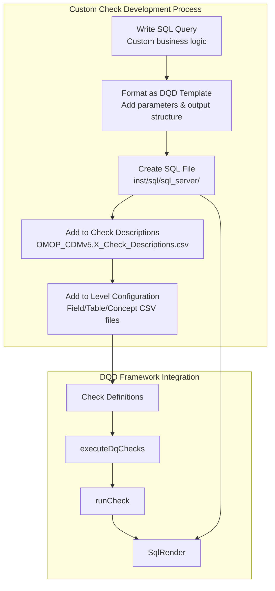
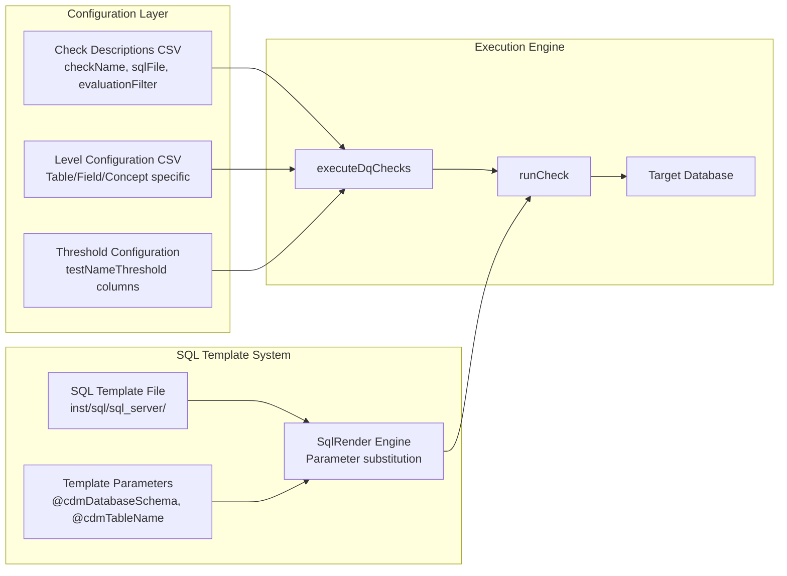
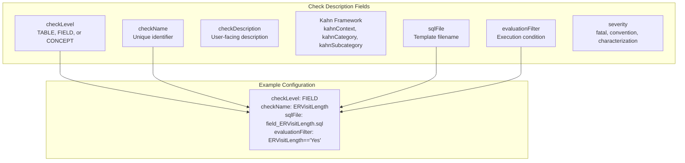
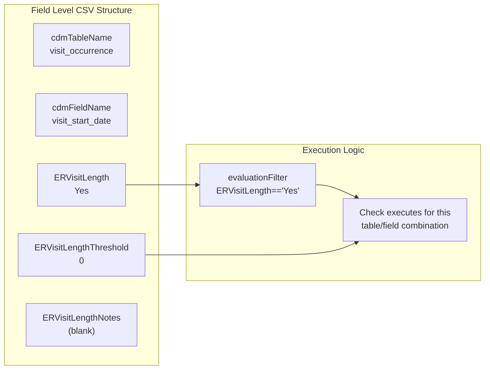
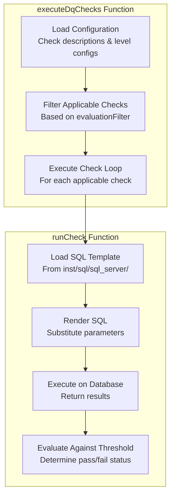

# Page: Adding Custom Checks

# Adding Custom Checks

<details>
<summary>Relevant source files</summary>

The following files were used as context for generating this wiki page:

- [docs/articles/AddNewCheck.html](docs/articles/AddNewCheck.html)
- [docs/articles/CheckStatusDefinitions.html](docs/articles/CheckStatusDefinitions.html)
- [docs/articles/SqlOnly.html](docs/articles/SqlOnly.html)
- [docs/reference/dot-writeResultsToCsv.html](docs/reference/dot-writeResultsToCsv.html)
- [docs/reference/writeJsonResultsToCsv.html](docs/reference/writeJsonResultsToCsv.html)
- [inst/csv/OMOP_CDMv5.2_Check_Descriptions.csv](inst/csv/OMOP_CDMv5.2_Check_Descriptions.csv)
- [inst/csv/OMOP_CDMv5.3_Check_Descriptions.csv](inst/csv/OMOP_CDMv5.3_Check_Descriptions.csv)
- [inst/csv/OMOP_CDMv5.4_Check_Descriptions.csv](inst/csv/OMOP_CDMv5.4_Check_Descriptions.csv)
- [inst/sql/sql_server/field_within_visit_dates.sql](inst/sql/sql_server/field_within_visit_dates.sql)

</details>


This document provides a comprehensive guide for adding new data quality checks to the DataQualityDashboard system. It covers the complete process from writing SQL queries to integrating them into the framework's execution engine and configuration system.

For information about the existing check types and their implementations, see [Check Implementation](#5). For details about threshold configuration and evaluation, see [Status Evaluation and Thresholds](#6.1).

## Overview

The DataQualityDashboard allows extension through custom checks that follow the same architectural patterns as the built-in checks. Custom checks integrate with the existing framework through configuration files and parameterized SQL templates.



**Sources:** [docs/articles/AddNewCheck.html:207-348](), [inst/csv/OMOP_CDMv5.4_Check_Descriptions.csv:1-28]()

## Check Development Architecture

The custom check system integrates with the core execution engine through a structured configuration and template system:



**Sources:** [docs/articles/AddNewCheck.html:280-307](), [inst/csv/OMOP_CDMv5.4_Check_Descriptions.csv:1-28]()

## Step 1: Writing the SQL Query

Custom checks begin with writing SQL queries that identify data quality violations. The query should return a count of rows that fail the quality criterion.

### Query Structure Requirements

All DQD check queries must return three specific columns:
- `num_violated_rows`: Count of records that fail the check
- `pct_violated_rows`: Percentage of violated rows relative to denominator  
- `num_denominator_rows`: Total count of applicable records

### Template Pattern

```sql
SELECT num_violated_rows,
    CASE 
        WHEN denominator.num_rows = 0 THEN 0 
        ELSE 1.0*dqd_check.num_violated_rows/denominator.num_rows 
    END AS pct_violated_rows, 
    denominator.num_rows as num_denominator_rows
FROM (
    -- Your violation detection query here
    SELECT COUNT(*) AS num_violated_rows
    FROM @cdmDatabaseSchema.@cdmTableName
    WHERE [violation_condition]
) dqd_check
CROSS JOIN (
    SELECT COUNT_BIG(*) AS num_rows
    FROM @cdmDatabaseSchema.@cdmTableName cdmTable
) denominator;
```

**Sources:** [docs/articles/AddNewCheck.html:234-263](), [inst/sql/sql_server/field_within_visit_dates.sql:17-22]()

## Step 2: SQL Template Configuration

### Parameter System

DQD uses `SqlRender` for parameter substitution in SQL templates. Standard parameters include:

| Parameter | Description | Example |
|-----------|-------------|---------|
| `@cdmDatabaseSchema` | CDM database schema name | `"my_cdm"` |
| `@cdmTableName` | Target table name | `"visit_occurrence"` |
| `@cdmFieldName` | Target field name | `"visit_start_date"` |
| `@vocabDatabaseSchema` | Vocabulary schema | `"my_vocab"` |

### Cohort Integration

For cohort-based checks, use conditional SQL blocks:

```sql
{@cohort & '@runForCohort' == 'Yes'}?{
    JOIN @cohortDatabaseSchema.@cohortTableName c
        ON cdmTable.person_id = c.subject_id
        AND c.cohort_definition_id = @cohortDefinitionId
}
```

**Sources:** [inst/sql/sql_server/field_within_visit_dates.sql:9-13](), [inst/sql/sql_server/field_within_visit_dates.sql:32-36]()

## Step 3: Check Descriptions Configuration

### Check Descriptions CSV Structure

Add your check to the appropriate CDM version's check descriptions file:



### Configuration Fields

| Field | Purpose | Example Values |
|-------|---------|----------------|
| `checkLevel` | Determines which level CSV file controls execution | `TABLE`, `FIELD`, `CONCEPT` |
| `checkName` | Unique identifier used in code and configuration | `"ERVisitLength"` |
| `evaluationFilter` | Condition determining when check executes | `"ERVisitLength=='Yes'"` |
| `severity` | Impact classification | `"fatal"`, `"convention"`, `"characterization"` |

**Sources:** [docs/articles/AddNewCheck.html:286-306](), [inst/csv/OMOP_CDMv5.4_Check_Descriptions.csv:1-28]()

## Step 4: Level-Specific Configuration

### Field Level Configuration

For field-level checks, add three columns to the Field Level CSV:
- `{checkName}`: Execution flag (`"Yes"` to enable)
- `{checkName}Threshold`: Failure threshold (0-100)
- `{checkName}Notes`: Optional documentation



### Table and Concept Levels

Similar patterns apply for `TABLE` and `CONCEPT` level checks, using their respective configuration CSV files.

**Sources:** [docs/articles/AddNewCheck.html:308-347]()

## SQL File Organization

### File Naming Convention

SQL template files follow the pattern: `{checkLevel}_{checkName}.sql`
- Field level: `field_ERVisitLength.sql`
- Table level: `table_ERVisitLength.sql`  
- Concept level: `concept_ERVisitLength.sql`

### File Location

All SQL templates are stored in: [inst/sql/sql_server/]()

The `SqlRender` package translates SQL Server syntax to other database dialects during execution.

**Sources:** [docs/articles/AddNewCheck.html:277-278](), [inst/sql/sql_server/field_within_visit_dates.sql:1-57]()

## Integration with Execution Engine

### Check Execution Flow



### Parameter Resolution

During execution, the framework:
1. Loads the appropriate SQL template file
2. Resolves database schema parameters
3. Substitutes table and field names from level configuration
4. Executes the rendered SQL against the target database
5. Evaluates results against configured thresholds

**Sources:** [docs/articles/AddNewCheck.html:345-347]()

## Testing and Validation

### Using SqlRender Developer Tool

The `SqlRender` package provides `launchSqlRenderDeveloper()` for testing SQL templates:
1. Paste your complete SQL template
2. Define parameter values
3. Review rendered output for target database dialect
4. Test execution against your OMOP CDM instance

### Isolated Check Execution

Test individual checks using the `checkNames` parameter:

```r
DataQualityDashboard::executeDqChecks(
  checkNames = c("ERVisitLength"),
  # ... other parameters
)
```

**Sources:** [docs/articles/AddNewCheck.html:260-277](), [docs/articles/AddNewCheck.html:345-347]()

## Best Practices

### SQL Template Design
- Use parameterized queries for database portability
- Include cohort filtering blocks when applicable
- Follow the standard three-column output format
- Test against multiple database dialects

### Configuration Management
- Use descriptive check names that indicate purpose
- Set appropriate severity levels based on business impact
- Document complex checks in the `Notes` columns
- Consider threshold values carefully based on expected data patterns

### Integration Considerations
- Verify check descriptions are added to all relevant CDM version files
- Ensure level configuration is complete for target tables/fields
- Test execution in both live and SQL-only modes

**Sources:** [docs/articles/AddNewCheck.html:207-348](), [inst/csv/OMOP_CDMv5.4_Check_Descriptions.csv:1-28]()