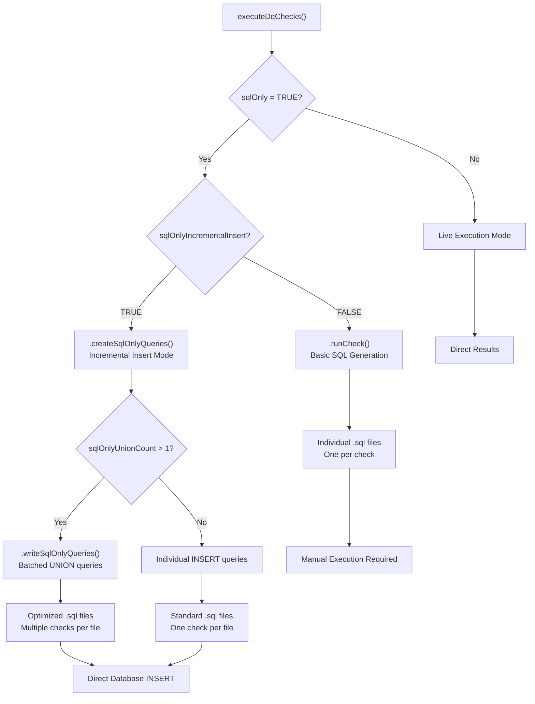
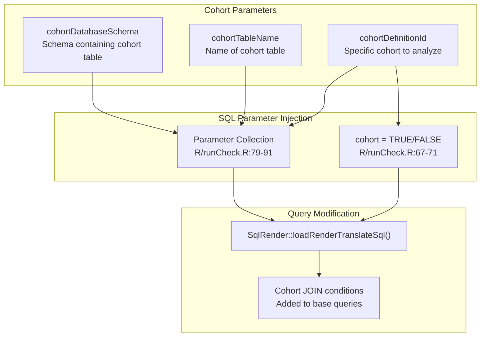
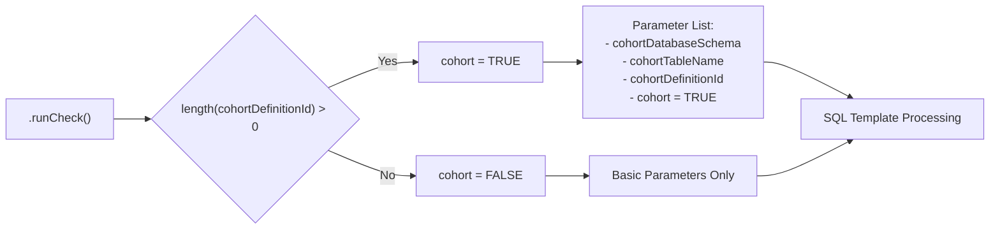
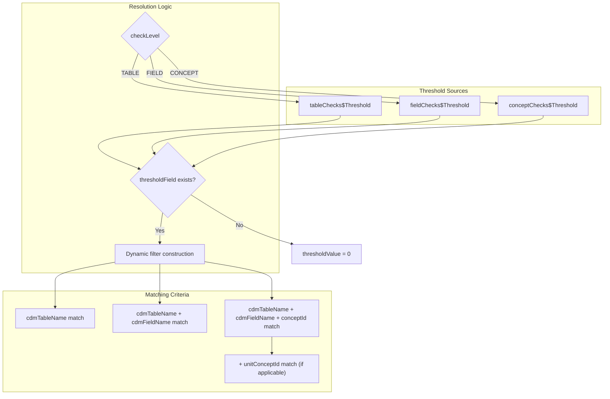
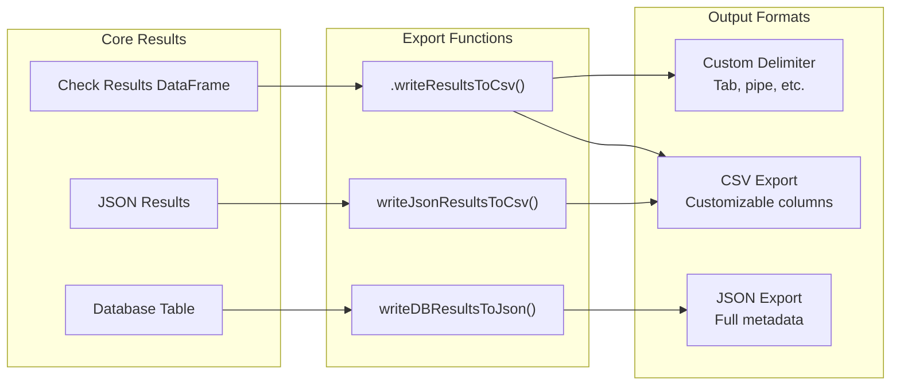
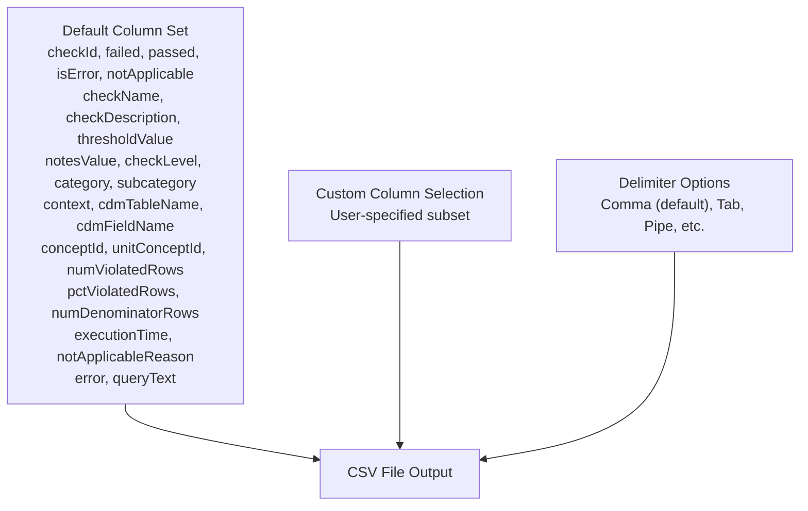
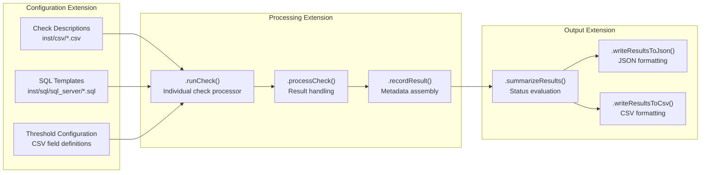

# Page: Advanced Usage

# Advanced Usage

Relevant source files

The following files were used as context for generating this wiki page:

- [R/runCheck.R](R/runCheck.R)
- [R/sqlOnly.R](R/sqlOnly.R)
- [docs/articles/AddNewCheck.html](docs/articles/AddNewCheck.html)
- [docs/articles/CheckStatusDefinitions.html](docs/articles/CheckStatusDefinitions.html)
- [docs/articles/SqlOnly.html](docs/articles/SqlOnly.html)
- [docs/reference/dot-writeResultsToCsv.html](docs/reference/dot-writeResultsToCsv.html)
- [docs/reference/writeJsonResultsToCsv.html](docs/reference/writeJsonResultsToCsv.html)
- [man/dot-runCheck.Rd](man/dot-runCheck.Rd)

This page covers advanced features and configuration options for the DataQualityDashboard package, including SQL-only execution modes, cohort-based analysis, custom thresholds, performance optimization, and output format customization. For basic usage and getting started, see [Getting Started](#2). For details on adding new data quality checks to the system, see [Adding Custom Checks](#8.2).

## SQL-Only Mode and Performance Optimization

The DataQualityDashboard supports advanced SQL generation modes that allow for optimized execution patterns and deployment flexibility. The primary modes are controlled through the `sqlOnly`, `sqlOnlyIncrementalInsert`, and `sqlOnlyUnionCount` parameters in the `executeDqChecks` function.

### SQL Generation Modes

**SQL-Only Mode Configuration**

Sources: [R/runCheck.R:95-106](), [R/sqlOnly.R:33-89](), [docs/articles/SqlOnly.html:250-314]()

### Incremental Insert Mode

The `sqlOnlyIncrementalInsert` mode generates SQL queries that directly populate a results table in the database. This mode uses the `.createSqlOnlyQueries()` function to wrap individual check queries with metadata insertion logic.

```mermaid
graph LR
    subgraph "Query Generation Pipeline"
        CHECK_DESC["checkDescription"] --> PARAMS["SQL Parameters<br/>@cdmDatabaseSchema<br/>@cdmTableName<br/>@cdmFieldName"]
        PARAMS --> RENDER["SqlRender::loadRenderTranslateSql()"]
        RENDER --> BASE_SQL["Base Check Query"]
    end
    
    subgraph "Incremental Insert Wrapping"
        BASE_SQL --> RECORD_RESULT[".recordResult()<br/>Add metadata shell"]
        RECORD_RESULT --> GET_THRESHOLD[".getThreshold()<br/>Retrieve threshold value"]
        GET_THRESHOLD --> CTE_WRAPPER["CTE Wrapper SQL<br/>cte_sql_for_results_table.sql"]
    end
    
    subgraph "Batch Processing"
        CTE_WRAPPER --> UNION_LOGIC[".writeSqlOnlyQueries()<br/>Union multiple CTEs"]
        UNION_LOGIC --> FINAL_INSERT["INSERT INTO results table"]
    end
```

**Incremental Insert Process**

Sources: [R/sqlOnly.R:68-88](), [R/sqlOnly.R:105-145]()

### Performance Tuning Parameters

| Parameter | Default | Purpose | Performance Impact |
|-----------|---------|---------|-------------------|
| `sqlOnlyUnionCount` | 1 | Number of checks to union in single query | 10x+ improvement on Spark with higher values |
| `sqlOnlyIncrementalInsert` | FALSE | Generate INSERT queries vs. standalone SQL | Enables batch processing |
| `sqlOnly` | FALSE | Generate SQL without execution | Eliminates R-to-database round trips |

Sources: [R/runCheck.R:33-34](), [docs/articles/SqlOnly.html:217-228]()

## Cohort-Based Analysis

The system supports running data quality checks on specific patient cohorts rather than entire CDM databases. This is implemented through cohort filtering parameters that modify the SQL generation process.

### Cohort Configuration

**Cohort Parameter Flow**

### Implementation Details

The cohort filtering is implemented through SQL parameter injection in the `.runCheck()` function. When `cohortDefinitionId` is provided, the system sets `cohort = TRUE` and passes cohort-related parameters to the SQL rendering engine.

**Cohort Logic Flow**

Sources: [R/runCheck.R:67-71](), [R/runCheck.R:85-89]()

## Custom Thresholds and Configuration

The threshold system allows fine-grained control over pass/fail criteria for data quality checks. Thresholds are managed through the `.getThreshold()` function and are hierarchically organized by check level.

### Threshold Resolution Hierarchy

**Threshold Resolution Process**

### Dynamic Threshold Filtering

The `.getThreshold()` function constructs dynamic filter expressions based on the check level and available identifiers:

| Check Level | Filter Pattern | Example |
|-------------|----------------|---------|
| TABLE | `tableChecks$<field>[tableChecks$cdmTableName == '<table>']` | `measurePersonCompletenessThreshold` |
| FIELD | `fieldChecks$<field>[fieldChecks$cdmTableName == '<table>' & fieldChecks$cdmFieldName == '<field>']` | `isRequiredThreshold` |
| CONCEPT | Complex logic handling `conceptId` and optional `unitConceptId` | `plausibleGenderThreshold` |

Sources: [R/sqlOnly.R:196-279](), [R/sqlOnly.R:220-268]()

## Output Format Customization

The system supports multiple output formats through a flexible export system that can be customized for different use cases.

### Output Format Pipeline

**Output Format Options**

### Column Customization

Both CSV export functions support column selection through the `columns` parameter:

**CSV Export Customization**

Sources: [docs/reference/writeJsonResultsToCsv.html:172-181](), [docs/reference/dot-writeResultsToCsv.html:172-181]()

## Performance Optimization Strategies

The system provides several mechanisms for optimizing performance in large-scale deployments.

### Execution Mode Performance Comparison

```mermaid
graph TD
    subgraph "Standard Execution"
        STD_EXEC["executeDqChecks()<br/>sqlOnly = FALSE"]
        STD_SINGLE["Individual R-to-DB calls<br/>One per check"]
        STD_PROCESS["R processing overhead<br/>Status evaluation, formatting"]
    end
    
    subgraph "SQL-Only Basic"
        SQL_BASIC["executeDqChecks()<br/>sqlOnly = TRUE<br/>sqlOnlyIncrementalInsert = FALSE"]
        SQL_FILES["Generated .sql files<br/>Manual execution required"]
    end
    
    subgraph "SQL-Only Incremental"
        SQL_INCR["executeDqChecks()<br/>sqlOnly = TRUE<br/>sqlOnlyIncrementalInsert = TRUE<br/>sqlOnlyUnionCount = 100"]
        SQL_BATCH["Batched INSERT queries<br/>100 checks per statement"]
        SQL_PERF["10x+ performance improvement"]
    end
    
    STD_EXEC --> STD_SINGLE
    STD_SINGLE --> STD_PROCESS
    
    SQL_BASIC --> SQL_FILES
    
    SQL_INCR --> SQL_BATCH
    SQL_BATCH --> SQL_PERF
```

**Performance Mode Comparison**

### Optimization Parameters

| Parameter | Impact | Recommendation |
|-----------|--------|----------------|
| `sqlOnlyUnionCount` | Query batching efficiency | 25-100 for most databases |
| `checkLevels` | Scope reduction | Limit to needed levels only |
| `tablesToExclude` | Reduces check count | Exclude unused CDM tables |
| `checkNames` | Targeted execution | Specify subset for testing |

Sources: [docs/articles/SqlOnly.html:264-289](), [R/sqlOnly.R:122-144]()

## System Extension Points

The DataQualityDashboard provides several extension points for customization and integration with other systems.

### Extension Architecture

**Extension Points**

### Custom Integration Patterns

The system supports several integration patterns for embedding into larger ETL or quality monitoring workflows:

1. **SQL-Only Integration**: Generate SQL for execution within existing ETL processes
2. **Result Export Integration**: Export results in custom formats for downstream processing  
3. **Threshold Override**: Programmatic threshold management for dynamic quality criteria
4. **Custom Output Processing**: Extend output formatters for specific reporting requirements

Sources: [R/runCheck.R:41-139](), [R/sqlOnly.R:17-89](), [docs/articles/AddNewCheck.html:207-347]()