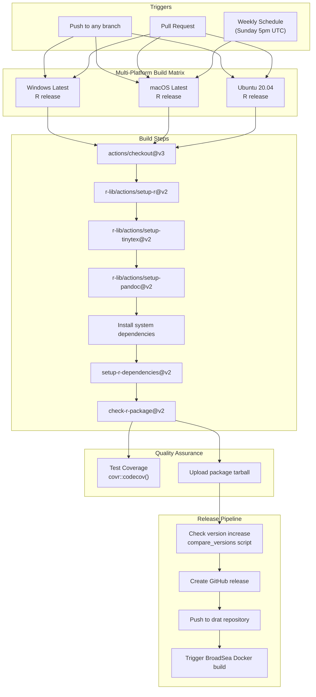
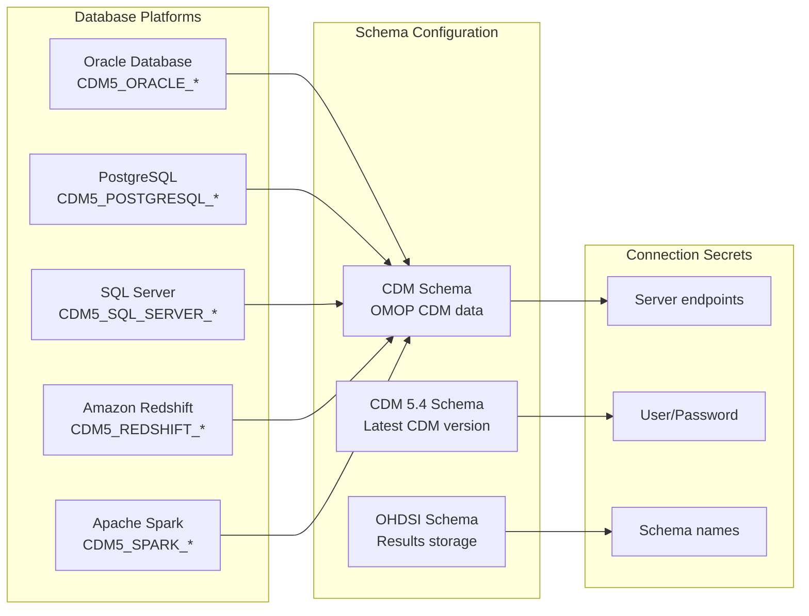
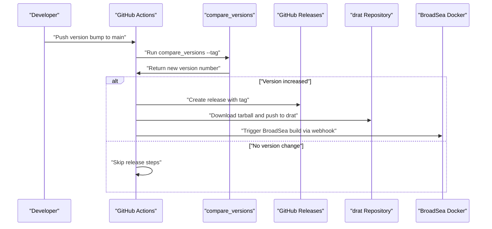

# Page: CI/CD and Build Process

# CI/CD and Build Process

<details>
<summary>Relevant source files</summary>

The following files were used as context for generating this wiki page:

- [.Rbuildignore](.Rbuildignore)
- [.github/.gitignore](.github/.gitignore)
- [.github/workflows/R_CMD_check_Hades.yml](.github/workflows/R_CMD_check_Hades.yml)
- [.github/workflows/R_CMD_check_main_weekly.yaml](.github/workflows/R_CMD_check_main_weekly.yaml)
- [README.md](README.md)

</details>


This page documents the continuous integration, continuous deployment (CI/CD), and build processes for the DataQualityDashboard R package. It covers the GitHub Actions workflows, automated testing across multiple platforms, release automation, and package distribution mechanisms.

For information about the testing framework and test execution, see [Testing Framework](#9.1). For details about package installation and setup, see [Installation and Setup](#2.1).

## CI/CD Pipeline Overview

The DataQualityDashboard repository uses GitHub Actions to implement a comprehensive CI/CD pipeline that ensures code quality, cross-platform compatibility, and automated releases.

### Main CI/CD Workflow Architecture



Sources: [.github/workflows/R_CMD_check_Hades.yml:1-182](), [.github/workflows/R_CMD_check_main_weekly.yaml:1-76]()

## Main Workflow Configuration

The primary CI/CD workflow is defined in `R_CMD_check_Hades.yml` and implements the standard HADES (Health Analytics Data-to-Evidence Suite) build process.

### Build Matrix and Platform Support

| Platform | R Version | Package Manager | Notes |
|----------|-----------|-----------------|-------|
| Windows Latest | release | CRAN | Standard Windows build |
| macOS Latest | release | CRAN | Coverage reporting enabled |
| Ubuntu 20.04 | release | RStudio Package Manager | System dependencies required |

The workflow uses a fail-fast: false strategy, ensuring all platforms are tested even if one fails.

Sources: [.github/workflows/R_CMD_check_Hades.yml:19-26]()

### Database Testing Environment

The CI pipeline includes comprehensive database connectivity testing across multiple platforms:



Each database platform requires three schema configurations for comprehensive testing:
- **CDM Schema**: Contains OMOP CDM v5.3 data
- **CDM54 Schema**: Contains OMOP CDM v5.4 data  
- **OHDSI Schema**: Used for results storage and testing

Sources: [.github/workflows/R_CMD_check_Hades.yml:31-62]()

## Build Process Steps

### System Dependencies Installation

For Ubuntu builds, the workflow installs required system libraries:

```bash
sudo apt-get install -y libssh-dev
```

The process also dynamically installs system requirements using `remotes::system_requirements()`.

Sources: [.github/workflows/R_CMD_check_Hades.yml:74-83]()

### R Package Check Configuration

The `check-r-package` action uses specific arguments for CRAN compliance:

| Parameter | Value | Purpose |
|-----------|-------|---------|
| `args` | `"--no-manual", "--as-cran"` | Skip manual generation, use CRAN checks |
| `build_args` | `"--compact-vignettes=both"` | Compress vignettes for smaller package size |
| `error-on` | `"warning"` | Treat warnings as errors |
| `check-dir` | `"check"` | Output directory for check results |

Sources: [.github/workflows/R_CMD_check_Hades.yml:89-95]()

## Release Automation

The release process is fully automated and triggered when the package version is incremented in the main branch.

### Release Pipeline Flow



Sources: [.github/workflows/R_CMD_check_Hades.yml:114-181]()

### Version Detection and Release Creation

The release job uses a custom `compare_versions` script to detect version changes:

```bash
echo "new_version="$(perl compare_versions --tag) >> $GITHUB_ENV
```

When a new version is detected, the workflow:
1. Creates a GitHub release with the new version tag
2. Downloads the package tarball from the build artifacts
3. Pushes the package to the drat repository via `deploy.sh`
4. Triggers a BroadSea Docker image rebuild

Sources: [.github/workflows/R_CMD_check_Hades.yml:130-180]()

## Build Configuration Files

### Build Exclusions

The `.Rbuildignore` file specifies which files and directories are excluded from the R package build:

| Pattern | Description |
|---------|-------------|
| `^.*\.Rproj$` | RStudio project files |
| `^\.Rproj\.user$` | RStudio user settings |
| `extras` | Additional development files |
| `^\.git` | Git repository metadata |
| `man-roxygen` | Roxygen template files |
| `_pkgdown.yml` | pkgdown website configuration |
| `deploy.sh` | Deployment script |
| `compare_versions` | Version comparison script |
| `.github` | GitHub Actions workflows |
| `docs` | Generated documentation |
| `^LICENSE$` | License file (separate from DESCRIPTION) |
| `^inst/doc/.*\.pdf$` | Generated PDF documentation |
| `.lintr` | Linting configuration |

Sources: [.Rbuildignore:1-13]()

## Code Quality and Coverage

### Coverage Reporting

Test coverage is measured using the `covr` package and reported to Codecov:

```r
covr::codecov()
```

Coverage reporting is only performed on macOS builds to avoid duplicate reporting.

Sources: [.github/workflows/R_CMD_check_Hades.yml:104-112](), [README.md:5]()

### Quality Badges

The repository displays build and coverage status through badges in the README:

- **Build Status**: `[]`
- **Code Coverage**: `[]`

Sources: [README.md:5-6]()

## Weekly Maintenance Builds

A separate workflow runs weekly maintenance builds every Sunday at 5pm UTC to ensure ongoing compatibility:

- **Platform**: macOS only (simplified check)
- **Trigger**: Cron schedule `'0 17 * * 0'`
- **Purpose**: Early detection of dependency changes or platform issues

This provides continuous monitoring between development cycles.

Sources: [.github/workflows/R_CMD_check_main_weekly.yaml:2-3]()

## Integration with OHDSI Ecosystem

### HADES Framework Compliance

The CI/CD process follows HADES (Health Analytics Data-to-Evidence Suite) standards, ensuring compatibility with other OHDSI packages and tools.

### BroadSea Integration

Upon successful releases, the pipeline automatically triggers rebuilds of the BroadSea Docker container, which provides a standardized environment for OHDSI tools:

```bash
curl --data "build=true" -X POST https://registry.hub.docker.com/u/ohdsi/broadsea-methodslibrary/trigger/f0b51cec-4027-4781-9383-4b38b42dd4f5/
```

Sources: [.github/workflows/R_CMD_check_Hades.yml:177-180]()