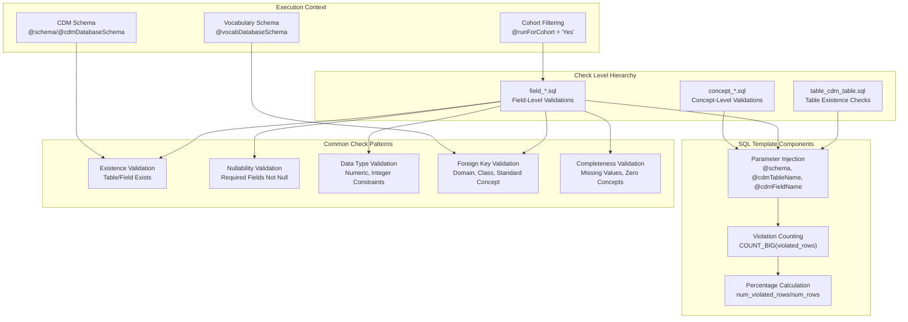
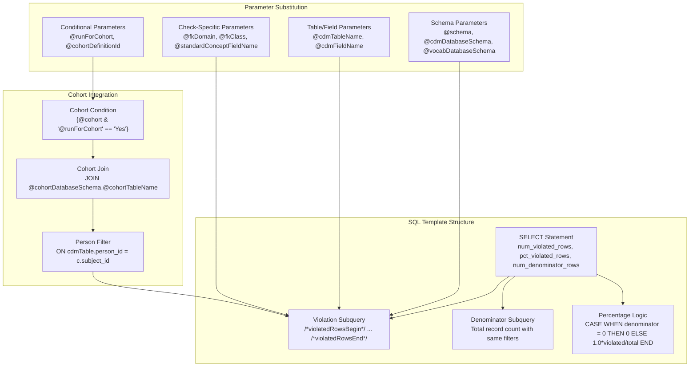
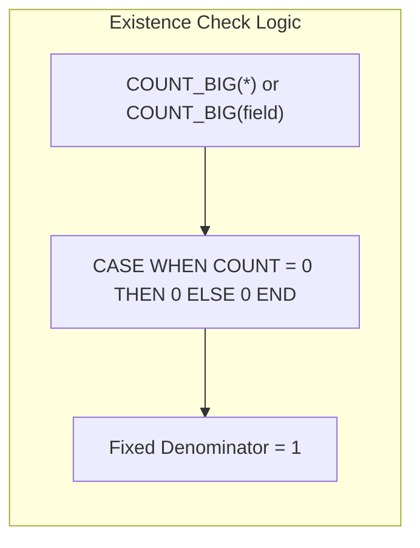
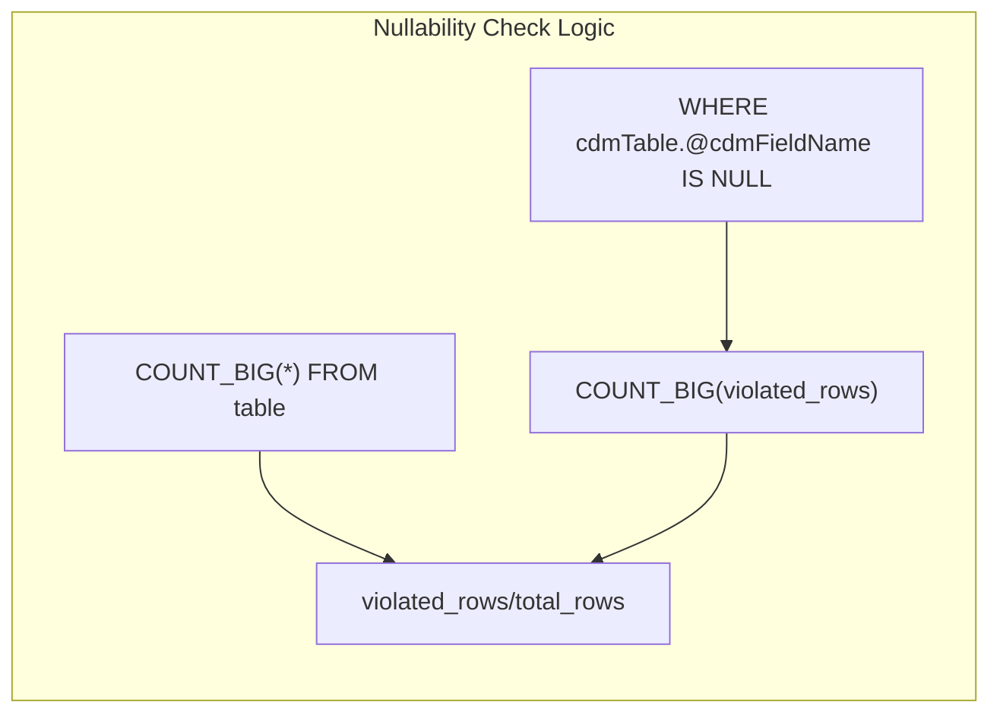
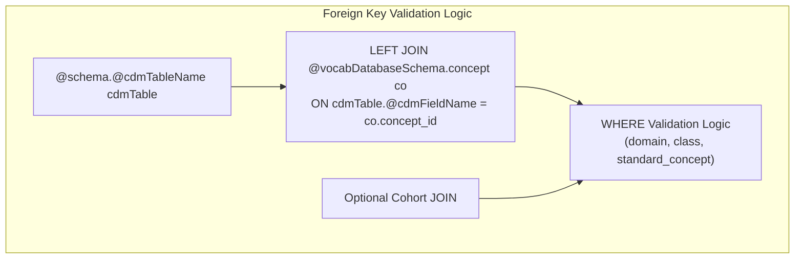
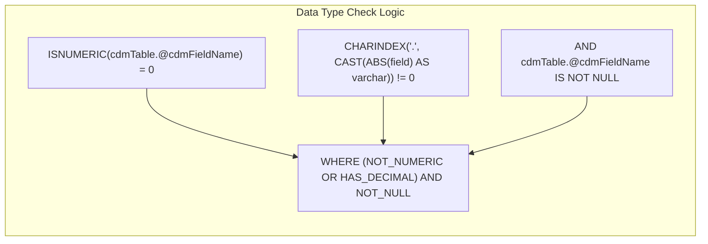
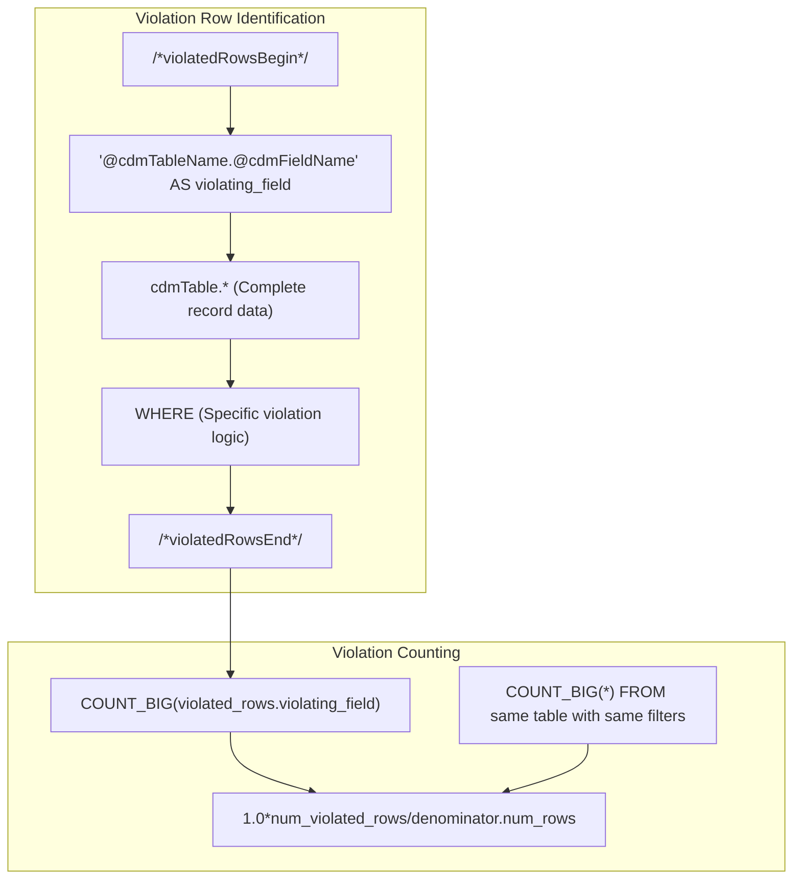

# Page: Check Implementation

# Check Implementation

<details>
<summary>Relevant source files</summary>

The following files were used as context for generating this wiki page:

- [inst/sql/sql_server/field_cdm_datatype.sql](inst/sql/sql_server/field_cdm_datatype.sql)
- [inst/sql/sql_server/field_cdm_field.sql](inst/sql/sql_server/field_cdm_field.sql)
- [inst/sql/sql_server/field_concept_record_completeness.sql](inst/sql/sql_server/field_concept_record_completeness.sql)
- [inst/sql/sql_server/field_fk_class.sql](inst/sql/sql_server/field_fk_class.sql)
- [inst/sql/sql_server/field_fk_domain.sql](inst/sql/sql_server/field_fk_domain.sql)
- [inst/sql/sql_server/field_is_not_nullable.sql](inst/sql/sql_server/field_is_not_nullable.sql)
- [inst/sql/sql_server/field_is_primary_key.sql](inst/sql/sql_server/field_is_primary_key.sql)
- [inst/sql/sql_server/field_is_standard_valid_concept.sql](inst/sql/sql_server/field_is_standard_valid_concept.sql)
- [inst/sql/sql_server/field_measure_value_completeness.sql](inst/sql/sql_server/field_measure_value_completeness.sql)
- [inst/sql/sql_server/field_source_value_completeness.sql](inst/sql/sql_server/field_source_value_completeness.sql)
- [inst/sql/sql_server/table_cdm_table.sql](inst/sql/sql_server/table_cdm_table.sql)

</details>


This document covers the technical implementation of data quality checks within the DataQualityDashboard system. It explains how checks are structured at different levels (table, field, concept), the SQL template system, parameter injection mechanisms, and common execution patterns used across all check types.

For information about specific check types and their business logic, see [Check Types and Categories](#4.1). For details about the main execution orchestration, see [Core Execution Engine](#3).

## Check Implementation Architecture

The DataQualityDashboard implements checks through a hierarchical system of parameterized SQL templates. Each check is implemented as a SQL template that follows standardized patterns for counting violations and calculating percentages.



Sources: [inst/sql/sql_server/table_cdm_table.sql:1-38](), [inst/sql/sql_server/field_cdm_field.sql:1-34](), [inst/sql/sql_server/field_is_not_nullable.sql:1-54]()

## SQL Template Structure

All data quality checks follow a standardized SQL template structure that produces consistent output metrics. The template pattern ensures uniform handling of violation counting, percentage calculations, and denominator management.

### Standard Template Pattern



Sources: [inst/sql/sql_server/field_cdm_datatype.sql:15-46](), [inst/sql/sql_server/field_fk_domain.sql:20-58](), [inst/sql/sql_server/field_measure_value_completeness.sql:18-55]()

## Parameter Injection System

The SQL templates use a sophisticated parameter injection system that allows the same template to be reused across multiple tables, fields, and contexts. Parameters are injected using the `@parameterName` syntax.

### Core Parameter Types

| Parameter Category | Parameters | Purpose |
|-------------------|------------|---------|
| Schema Parameters | `@schema`, `@cdmDatabaseSchema`, `@vocabDatabaseSchema` | Database schema targeting |
| Entity Parameters | `@cdmTableName`, `@cdmFieldName` | Table and field targeting |
| Cohort Parameters | `@cohortDefinitionId`, `@cohortDatabaseSchema`, `@cohortTableName` | Population filtering |
| Check-Specific | `@fkDomain`, `@fkClass`, `@standardConceptFieldName` | Check logic configuration |

### Conditional Parameter Blocks

The templates use conditional parameter blocks to include or exclude code sections based on execution context:

```sql
{@cohort & '@runForCohort' == 'Yes'}?{
    JOIN @cohortDatabaseSchema.@cohortTableName c 
        ON cdmTable.person_id = c.subject_id
        AND c.cohort_definition_id = @cohortDefinitionId
}
```

Sources: [inst/sql/sql_server/field_fk_domain.sql:13-17](), [inst/sql/sql_server/field_fk_class.sql:14-18](), [inst/sql/sql_server/field_is_standard_valid_concept.sql:12-16]()

## Check Implementation Patterns

Different types of checks follow specific implementation patterns based on their validation logic. These patterns are consistently applied across all check templates.

### Existence Validation Pattern

Used by `table_cdm_table.sql` and `field_cdm_field.sql` to verify that database objects exist:



Sources: [inst/sql/sql_server/table_cdm_table.sql:27-33](), [inst/sql/sql_server/field_cdm_field.sql:22-29]()

### Nullability Validation Pattern

Used by `field_is_not_nullable.sql` and `field_measure_value_completeness.sql` to check for missing values:



Sources: [inst/sql/sql_server/field_is_not_nullable.sql:40-53](), [inst/sql/sql_server/field_measure_value_completeness.sql:41-54]()

### Foreign Key Validation Pattern

Used by `field_fk_domain.sql`, `field_fk_class.sql`, and `field_is_standard_valid_concept.sql` for concept validation:



Sources: [inst/sql/sql_server/field_fk_domain.sql:35-44](), [inst/sql/sql_server/field_fk_class.sql:37-46](), [inst/sql/sql_server/field_is_standard_valid_concept.sql:42-45]()

### Data Type Validation Pattern

Used by `field_cdm_datatype.sql` to validate numeric data types:



Sources: [inst/sql/sql_server/field_cdm_datatype.sql:34-37]()

## Violation Identification System

Each check template includes a standardized `violatedRowsBegin` and `violatedRowsEnd` block that identifies specific violating records. This allows for detailed debugging and analysis of data quality issues.



Sources: [inst/sql/sql_server/field_fk_domain.sql:31-45](), [inst/sql/sql_server/field_is_standard_valid_concept.sql:32-46](), [inst/sql/sql_server/field_concept_record_completeness.sql:27-38]()

## Cohort Integration Pattern

Many checks support optional cohort-based filtering to restrict analysis to specific patient populations. This is implemented through conditional SQL blocks.

| Check Template | Cohort Support | Implementation |
|---------------|----------------|----------------|
| `field_fk_domain.sql` | Yes | Conditional JOIN with cohort table |
| `field_fk_class.sql` | Yes | Conditional JOIN with cohort table |
| `field_is_standard_valid_concept.sql` | Yes | Conditional JOIN with cohort table |
| `field_concept_record_completeness.sql` | Yes | Conditional JOIN with cohort table |
| `field_measure_value_completeness.sql` | Yes | Conditional JOIN with cohort table |
| `field_is_not_nullable.sql` | Yes | Conditional JOIN with cohort table |
| `field_is_primary_key.sql` | Yes | Conditional JOIN with cohort table |
| `table_cdm_table.sql` | No | Table-level check, no person filtering |
| `field_cdm_field.sql` | No | Field existence check, no person filtering |

Sources: [inst/sql/sql_server/field_fk_domain.sql:38-42](), [inst/sql/sql_server/field_concept_record_completeness.sql:32-36](), [inst/sql/sql_server/field_measure_value_completeness.sql:36-40]()