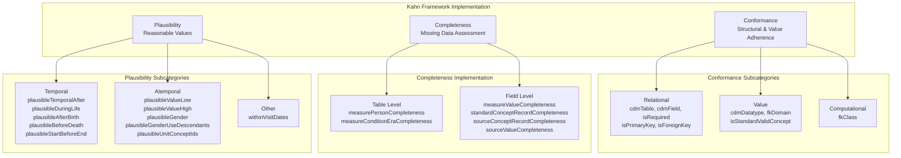
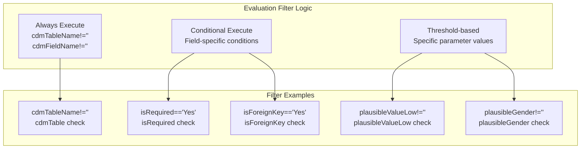

# Page: Check Types and Categories

# Check Types and Categories

Relevant source files

The following files were used as context for generating this wiki page:

- [inst/csv/OMOP_CDMv5.2_Check_Descriptions.csv](inst/csv/OMOP_CDMv5.2_Check_Descriptions.csv)
- [inst/csv/OMOP_CDMv5.3_Check_Descriptions.csv](inst/csv/OMOP_CDMv5.3_Check_Descriptions.csv)
- [inst/csv/OMOP_CDMv5.4_Check_Descriptions.csv](inst/csv/OMOP_CDMv5.4_Check_Descriptions.csv)
- [inst/sql/sql_server/field_within_visit_dates.sql](inst/sql/sql_server/field_within_visit_dates.sql)
- [vignettes/checks/isStandardValidConcept.Rmd](vignettes/checks/isStandardValidConcept.Rmd)
- [vignettes/checks/measurePersonCompleteness.Rmd](vignettes/checks/measurePersonCompleteness.Rmd)
- [vignettes/checks/measureValueCompleteness.Rmd](vignettes/checks/measureValueCompleteness.Rmd)
- [vignettes/checks/plausibleValueHigh.Rmd](vignettes/checks/plausibleValueHigh.Rmd)
- [vignettes/checks/plausibleValueLow.Rmd](vignettes/checks/plausibleValueLow.Rmd)
- [vignettes/checks/sourceConceptRecordCompleteness.Rmd](vignettes/checks/sourceConceptRecordCompleteness.Rmd)
- [vignettes/checks/sourceValueCompleteness.Rmd](vignettes/checks/sourceValueCompleteness.Rmd)
- [vignettes/checks/standardConceptRecordCompleteness.Rmd](vignettes/checks/standardConceptRecordCompleteness.Rmd)
- [vignettes/checks/withinVisitDates.Rmd](vignettes/checks/withinVisitDates.Rmd)

This document provides a comprehensive overview of the 24 data quality check types implemented in the DataQualityDashboard system, their categorization according to the Kahn Framework, and how they are organized across different levels and severity classifications. For specific implementation details of individual checks, see [Check Implementation](#5). For information about threshold configuration and evaluation logic, see [Status Evaluation and Thresholds](#6.1).

## Check Level Hierarchy

The DataQualityDashboard implements checks at three distinct levels, each targeting different aspects of data quality validation:

```mermaid
graph TD
    subgraph "Check Level Hierarchy"
        TABLE["TABLE Level Checks<br/>3 check types"]
        FIELD["FIELD Level Checks<br/>18 check types"] 
        CONCEPT["CONCEPT Level Checks<br/>3 check types"]
    end
    
    subgraph "TABLE Level Implementation"
        TABLE_CDM["cdmTable<br/>table_cdm_table.sql"]
        TABLE_PERSON["measurePersonCompleteness<br/>table_person_completeness.sql"]
        TABLE_CONDITION["measureConditionEraCompleteness<br/>table_condition_era_completeness.sql"]
    end
    
    subgraph "FIELD Level Implementation"
        FIELD_CDM["cdmField<br/>field_cdm_field.sql"]
        FIELD_REQ["isRequired<br/>field_is_not_nullable.sql"]
        FIELD_TYPE["cdmDatatype<br/>field_cdm_datatype.sql"]
        FIELD_PK["isPrimaryKey<br/>field_is_primary_key.sql"]
        FIELD_FK["isForeignKey<br/>is_foreign_key.sql"]
        FIELD_MORE["... 13 more field checks"]
    end
    
    subgraph "CONCEPT Level Implementation"
        CONCEPT_GENDER["plausibleGender<br/>concept_plausible_gender.sql"]
        CONCEPT_GENDER_DESC["plausibleGenderUseDescendants<br/>concept_plausible_gender_use_descendants.sql"]
        CONCEPT_UNIT["plausibleUnitConceptIds<br/>concept_plausible_unit_concept_ids.sql"]
    end
    
    TABLE --> TABLE_CDM
    TABLE --> TABLE_PERSON
    TABLE --> TABLE_CONDITION
    
    FIELD --> FIELD_CDM
    FIELD --> FIELD_REQ
    FIELD --> FIELD_TYPE
    FIELD --> FIELD_PK
    FIELD --> FIELD_FK
    FIELD --> FIELD_MORE
    
    CONCEPT --> CONCEPT_GENDER
    CONCEPT --> CONCEPT_GENDER_DESC
    CONCEPT --> CONCEPT_UNIT
```

**Sources:** [inst/csv/OMOP_CDMv5.4_Check_Descriptions.csv:1-28](), [inst/csv/OMOP_CDMv5.3_Check_Descriptions.csv:1-28](), [inst/csv/OMOP_CDMv5.2_Check_Descriptions.csv:1-28]()

### TABLE Level Checks

TABLE level checks evaluate entire tables for existence, completeness, and overall structural integrity:

| Check Name | Description | SQL File |
|------------|-------------|----------|
| `cdmTable` | Verifies table existence according to OMOP CDM specification | `table_cdm_table.sql` |
| `measurePersonCompleteness` | Measures person-level completeness across CDM tables | `table_person_completeness.sql` |
| `measureConditionEraCompleteness` | Validates condition era derivation completeness | `table_condition_era_completeness.sql` |

### FIELD Level Checks

FIELD level checks constitute the largest category, covering structural conformance, data completeness, and plausibility validation:

| Category | Check Names |
|----------|-------------|
| **Structural** | `cdmField`, `isRequired`, `cdmDatatype`, `isPrimaryKey`, `isForeignKey` |
| **Conformance** | `fkDomain`, `fkClass`, `isStandardValidConcept` |
| **Completeness** | `measureValueCompleteness`, `standardConceptRecordCompleteness`, `sourceConceptRecordCompleteness`, `sourceValueCompleteness` |
| **Plausibility** | `plausibleValueLow`, `plausibleValueHigh`, `plausibleTemporalAfter`, `plausibleDuringLife`, `withinVisitDates`, `plausibleAfterBirth`, `plausibleBeforeDeath`, `plausibleStartBeforeEnd` |

### CONCEPT Level Checks

CONCEPT level checks validate logical relationships between clinical concepts and patient attributes:

| Check Name | Purpose |
|------------|---------|
| `plausibleGender` | Validates gender appropriateness for specific concepts |
| `plausibleGenderUseDescendants` | Extends gender validation to concept hierarchies |
| `plausibleUnitConceptIds` | Validates measurement unit appropriateness |

**Sources:** [inst/csv/OMOP_CDMv5.4_Check_Descriptions.csv:2-28]()

## Kahn Framework Categories

The DataQualityDashboard implements the Kahn Framework for data quality assessment, organizing checks into three primary categories with specific subcategories:

**Sources:** [inst/csv/OMOP_CDMv5.4_Check_Descriptions.csv:1-28]()

### Kahn Context Classification

Each check is also classified by its verification context:

| Context | Purpose | Check Examples |
|---------|---------|----------------|
| **Verification** | Validates against CDM specification | `cdmTable`, `cdmField`, `cdmDatatype`, `isStandardValidConcept` |
| **Validation** | Validates against data expectations | `measurePersonCompleteness`, `plausibleGender` |

**Sources:** [inst/csv/OMOP_CDMv5.4_Check_Descriptions.csv:1-28]()

## Severity Classification System

The system categorizes checks by severity levels that determine their impact on data usability:

```mermaid
graph TD
    subgraph "Severity Level Hierarchy"
        FATAL["Fatal<br/>Critical CDM Violations"]
        CONVENTION["Convention<br/>CDM Best Practices"]
        CHARACTERIZATION["Characterization<br/>Data Profiling"]
    end
    
    subgraph "Fatal Severity Checks"
        FATAL_TABLE["cdmTable<br/>Table existence"]
        FATAL_FIELD["cdmField<br/>Field existence"]
        FATAL_REQ["isRequired<br/>NULL in required fields"]
        FATAL_TYPE["cdmDatatype<br/>Data type validation"]
        FATAL_PK["isPrimaryKey<br/>Primary key uniqueness"]
        FATAL_FK["isForeignKey<br/>Foreign key integrity"]
    end
    
    subgraph "Convention Severity Checks"
        CONV_PERSON["measurePersonCompleteness<br/>Person completeness"]
        CONV_CONDITION["measureConditionEraCompleteness<br/>Condition era completeness"]
        CONV_DOMAIN["fkDomain<br/>Domain conformance"]
        CONV_CLASS["fkClass<br/>Class conformance"]
        CONV_STANDARD["isStandardValidConcept<br/>Standard concept validation"]
        CONV_RECORD["standardConceptRecordCompleteness<br/>sourceConceptRecordCompleteness<br/>sourceValueCompleteness"]
    end
    
    subgraph "Characterization Severity Checks"
        CHAR_VALUE["measureValueCompleteness<br/>Value completeness"]
        CHAR_PLAUS["plausibleValueLow<br/>plausibleValueHigh<br/>All temporal plausibility checks"]
        CHAR_VISIT["withinVisitDates<br/>Visit date alignment"]
        CHAR_CONCEPT["plausibleGender<br/>plausibleGenderUseDescendants<br/>plausibleUnitConceptIds"]
    end
    
    FATAL --> FATAL_TABLE
    FATAL --> FATAL_FIELD
    FATAL --> FATAL_REQ
    FATAL --> FATAL_TYPE
    FATAL --> FATAL_PK
    FATAL --> FATAL_FK
    
    CONVENTION --> CONV_PERSON
    CONVENTION --> CONV_CONDITION
    CONVENTION --> CONV_DOMAIN
    CONVENTION --> CONV_CLASS
    CONVENTION --> CONV_STANDARD
    CONVENTION --> CONV_RECORD
    
    CHARACTERIZATION --> CHAR_VALUE
    CHARACTERIZATION --> CHAR_PLAUS
    CHARACTERIZATION --> CHAR_VISIT
    CHARACTERIZATION --> CHAR_CONCEPT
```

**Sources:** [inst/csv/OMOP_CDMv5.4_Check_Descriptions.csv:1-28]()

## Check Type Implementation Matrix

The following table summarizes all 24 check types with their complete categorization:

| Check Name | Level | Kahn Category | Kahn Subcategory | Severity | SQL Template |
|------------|-------|---------------|------------------|----------|--------------|
| `cdmTable` | TABLE | Conformance | Relational | fatal | `table_cdm_table.sql` |
| `measurePersonCompleteness` | TABLE | Completeness | - | convention | `table_person_completeness.sql` |
| `measureConditionEraCompleteness` | TABLE | Completeness | - | convention | `table_condition_era_completeness.sql` |
| `cdmField` | FIELD | Conformance | Relational | fatal | `field_cdm_field.sql` |
| `isRequired` | FIELD | Conformance | Relational | fatal | `field_is_not_nullable.sql` |
| `cdmDatatype` | FIELD | Conformance | Value | fatal | `field_cdm_datatype.sql` |
| `isPrimaryKey` | FIELD | Conformance | Relational | fatal | `field_is_primary_key.sql` |
| `isForeignKey` | FIELD | Conformance | Relational | fatal | `is_foreign_key.sql` |
| `fkDomain` | FIELD | Conformance | Value | convention | `field_fk_domain.sql` |
| `fkClass` | FIELD | Conformance | Computational | convention | `field_fk_class.sql` |
| `isStandardValidConcept` | FIELD | Conformance | Value | convention | `field_is_standard_valid_concept.sql` |
| `measureValueCompleteness` | FIELD | Completeness | - | characterization | `field_measure_value_completeness.sql` |
| `standardConceptRecordCompleteness` | FIELD | Completeness | - | convention | `field_concept_record_completeness.sql` |
| `sourceConceptRecordCompleteness` | FIELD | Completeness | - | convention | `field_concept_record_completeness.sql` |
| `sourceValueCompleteness` | FIELD | Completeness | - | convention | `field_source_value_completeness.sql` |
| `plausibleValueLow` | FIELD | Plausibility | Atemporal | characterization | `field_plausible_value_low.sql` |
| `plausibleValueHigh` | FIELD | Plausibility | Atemporal | characterization | `field_plausible_value_high.sql` |
| `plausibleTemporalAfter` | FIELD | Plausibility | Temporal | characterization | `field_plausible_temporal_after.sql` |
| `plausibleDuringLife` | FIELD | Plausibility | Temporal | characterization | `field_plausible_during_life.sql` |
| `withinVisitDates` | FIELD | Plausibility | - | characterization | `field_within_visit_dates.sql` |
| `plausibleAfterBirth` | FIELD | Plausibility | Temporal | characterization | `field_plausible_after_birth.sql` |
| `plausibleBeforeDeath` | FIELD | Plausibility | Temporal | characterization | `field_plausible_before_death.sql` |
| `plausibleStartBeforeEnd` | FIELD | Plausibility | Temporal | characterization | `field_plausible_start_before_end.sql` |
| `plausibleGender` | CONCEPT | Plausibility | Atemporal | characterization | `concept_plausible_gender.sql` |
| `plausibleGenderUseDescendants` | CONCEPT | Plausibility | Atemporal | characterization | `concept_plausible_gender_use_descendants.sql` |
| `plausibleUnitConceptIds` | CONCEPT | Plausibility | Atemporal | characterization | `concept_plausible_unit_concept_ids.sql` |

**Sources:** [inst/csv/OMOP_CDMv5.4_Check_Descriptions.csv:1-28]()

## Evaluation Filter System

Each check includes an `evaluationFilter` that determines when the check should be executed based on metadata conditions:

**Sources:** [inst/csv/OMOP_CDMv5.4_Check_Descriptions.csv:1-28]()

This evaluation filter system ensures that checks are only executed when relevant metadata exists and appropriate conditions are met, optimizing performance and avoiding unnecessary check executions.