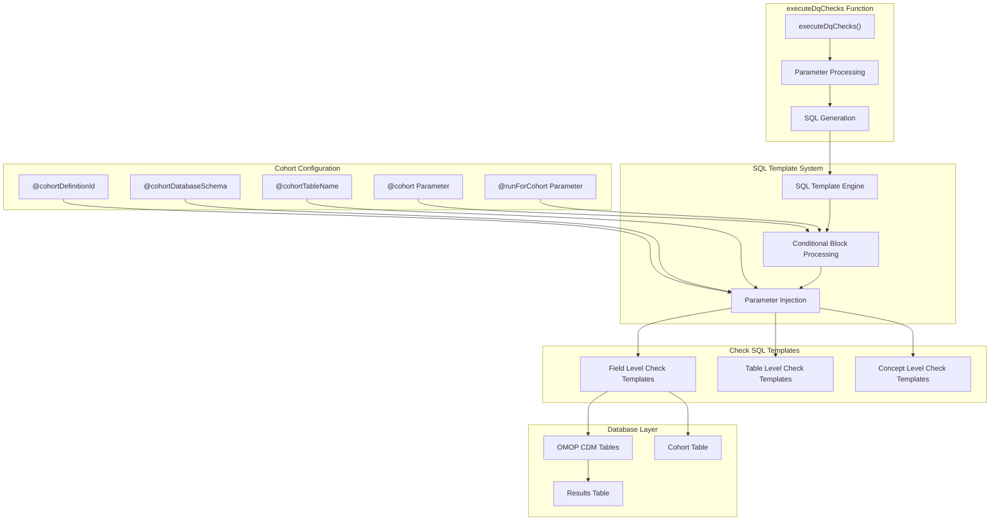
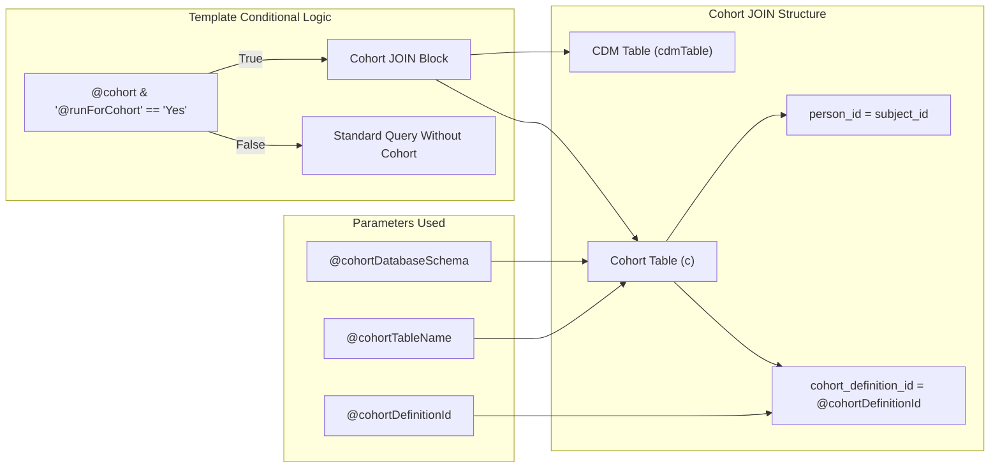
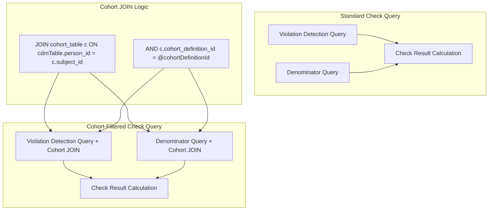

# Page: Cohort-Based Analysis

# Cohort-Based Analysis

<details>
<summary>Relevant source files</summary>

The following files were used as context for generating this wiki page:

- [extras/codeToRun.R](extras/codeToRun.R)
- [inst/sql/sql_server/field_plausible_during_life.sql](inst/sql/sql_server/field_plausible_during_life.sql)
- [inst/sql/sql_server/field_plausible_temporal_after.sql](inst/sql/sql_server/field_plausible_temporal_after.sql)
- [inst/sql/sql_server/field_plausible_value_high.sql](inst/sql/sql_server/field_plausible_value_high.sql)
- [inst/sql/sql_server/field_plausible_value_low.sql](inst/sql/sql_server/field_plausible_value_low.sql)

</details>


The cohort-based analysis functionality allows you to run data quality checks on specific patient populations rather than the entire database. This enables targeted data quality assessment for research studies, clinical trials, or specific patient populations of interest.

For general data quality check execution, see [Core Execution Engine](#3). For information about configuring SQL templates and parameters, see [SQL Templates and Parameterization](#5.4).

## Overview

The DataQualityDashboard supports filtering data quality checks to a specific cohort of patients through conditional SQL template logic. When cohort-based analysis is enabled, all relevant checks are automatically restricted to only include records from patients who are members of the specified cohort.

## Cohort Integration Architecture



Sources: [inst/sql/sql_server/field_plausible_temporal_after.sql:12-16](), [inst/sql/sql_server/field_plausible_value_high.sql:11-15](), [inst/sql/sql_server/field_plausible_value_low.sql:11-15](), [inst/sql/sql_server/field_plausible_during_life.sql:10-14]()

## SQL Template Cohort Logic

The cohort filtering mechanism is implemented through conditional SQL template blocks in the individual check templates. The system uses a consistent pattern across all check types:



Sources: [inst/sql/sql_server/field_plausible_temporal_after.sql:40-44](), [inst/sql/sql_server/field_plausible_value_high.sql:36-40](), [inst/sql/sql_server/field_plausible_value_low.sql:33-37](), [inst/sql/sql_server/field_plausible_during_life.sql:36-40]()

## Cohort Parameters

The cohort functionality requires several parameters to be properly configured in the SQL templates:

| Parameter | Purpose | Example Value |
|-----------|---------|---------------|
| `@cohort` | Boolean flag indicating cohort functionality is available | `TRUE` |
| `@runForCohort` | String flag controlling whether to apply cohort filtering | `"Yes"` |
| `@cohortDefinitionId` | Numeric identifier for the specific cohort | `1001` |
| `@cohortDatabaseSchema` | Database schema containing the cohort table | `"results_schema"` |
| `@cohortTableName` | Name of the cohort table | `"my_study_cohort"` |

## SQL Implementation Details

### Conditional Block Structure

The cohort filtering is implemented using conditional SQL template syntax:

```sql
{@cohort & '@runForCohort' == 'Yes'}?{
    JOIN @cohortDatabaseSchema.@cohortTableName c 
        ON cdmTable.person_id = c.subject_id
        AND c.cohort_definition_id = @cohortDefinitionId
}
```

This pattern appears in both the violation detection query and the denominator calculation query within each check template.

Sources: [inst/sql/sql_server/field_plausible_temporal_after.sql:40-44](), [inst/sql/sql_server/field_plausible_value_high.sql:36-40]()

### Cohort Table Schema Requirements

The cohort table must follow the standard OHDSI cohort table structure:

| Column | Type | Description |
|--------|------|-------------|
| `subject_id` | INTEGER | Person ID from the OMOP CDM |
| `cohort_definition_id` | INTEGER | Identifier for the cohort definition |
| `cohort_start_date` | DATE | Start date for cohort membership |
| `cohort_end_date` | DATE | End date for cohort membership |

### Query Structure Impact

When cohort filtering is enabled, both the numerator (violated rows) and denominator (total eligible rows) queries are modified:



Sources: [inst/sql/sql_server/field_plausible_temporal_after.sql:32-55](), [inst/sql/sql_server/field_plausible_value_high.sql:31-47]()

## Check Types Supporting Cohorts

The cohort filtering functionality is implemented across multiple check types. Based on the available SQL templates, the following check types support cohort-based analysis:

### Field-Level Checks with Cohort Support

- **plausible_temporal_after**: Validates that dates occur after specified reference dates
- **plausible_value_high**: Checks for values exceeding upper thresholds  
- **plausible_value_low**: Checks for values below lower thresholds
- **plausible_during_life**: Validates that events occur before death dates

Each of these checks implements the same cohort filtering pattern in their SQL templates.

Sources: [inst/sql/sql_server/field_plausible_temporal_after.sql:1-68](), [inst/sql/sql_server/field_plausible_value_high.sql:1-61](), [inst/sql/sql_server/field_plausible_value_low.sql:1-58](), [inst/sql/sql_server/field_plausible_during_life.sql:1-62]()

## Configuration and Usage

### Parameter Configuration

To enable cohort-based analysis, the appropriate parameters must be passed to the SQL template system. While the `executeDqChecks` function interface shown in the examples doesn't explicitly expose cohort parameters, they can be configured through the underlying SQL template parameter system.

### Cohort Table Preparation

Before running cohort-based checks, ensure that:

1. The cohort table exists in the specified database schema
2. The cohort table follows the standard OHDSI cohort table structure
3. The cohort definition ID corresponds to your target population
4. All relevant patients have entries in the cohort table

### Integration with Check Execution

When cohort parameters are properly configured, the system automatically:

1. Applies cohort filtering to all supported check types
2. Maintains consistent patient populations across all checks
3. Calculates denominators based on the cohort population
4. Reports results specific to the cohort rather than the entire database

Sources: [extras/codeToRun.R:102-119]()

## Performance Considerations

Cohort-based analysis can impact query performance due to additional JOIN operations. Consider these factors:

- **Index Requirements**: Ensure proper indexing on `person_id` in both CDM tables and cohort tables
- **Cohort Size**: Larger cohorts may require more processing time
- **JOIN Performance**: The cohort JOIN is applied to both violation and denominator queries

The cohort filtering occurs at the SQL level, ensuring that only relevant data is processed during check execution, which can actually improve performance for small cohorts compared to full database scans.

Sources: [inst/sql/sql_server/field_plausible_temporal_after.sql:36-44](), [inst/sql/sql_server/field_plausible_value_high.sql:36-40]()