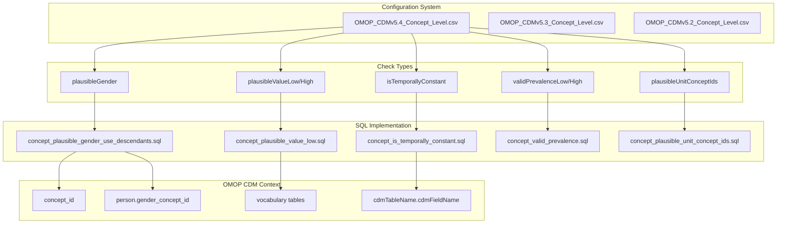
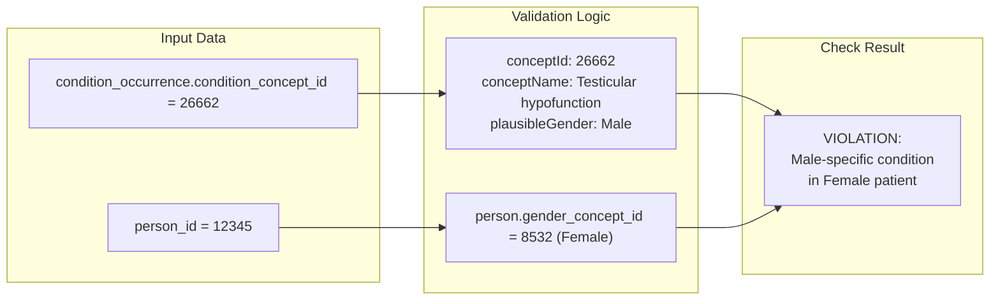
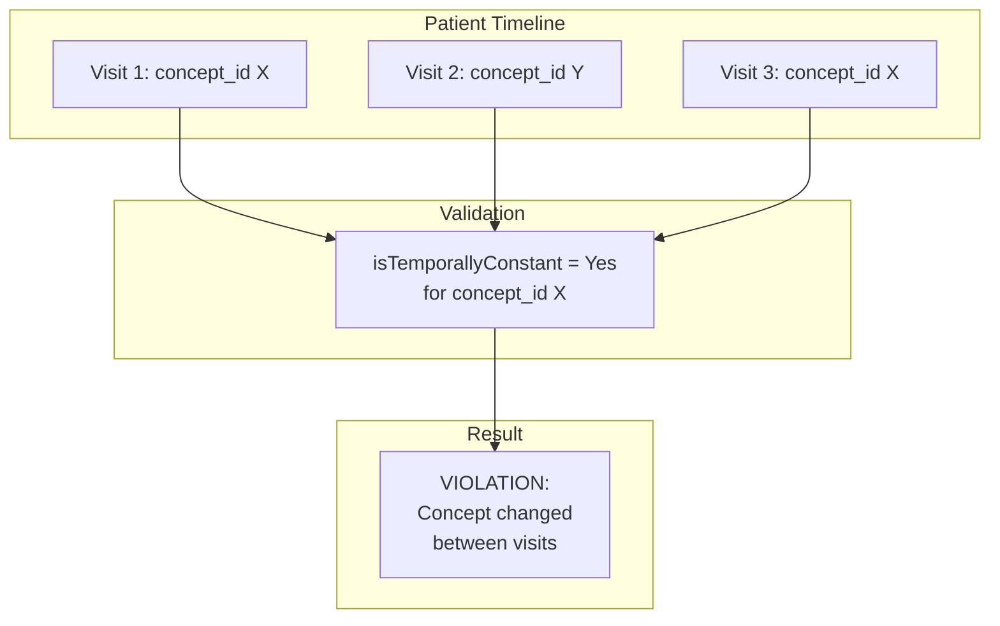
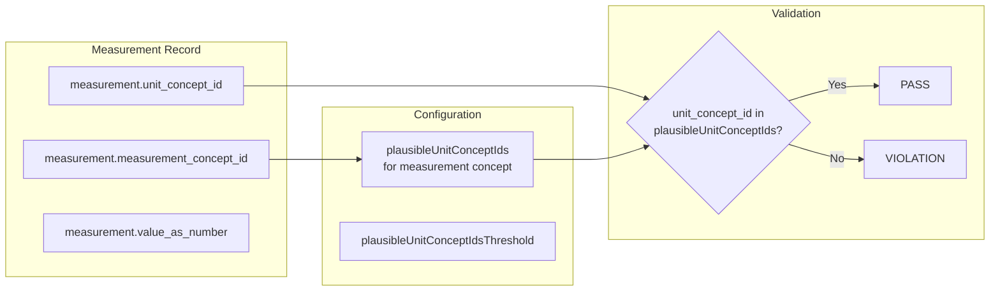
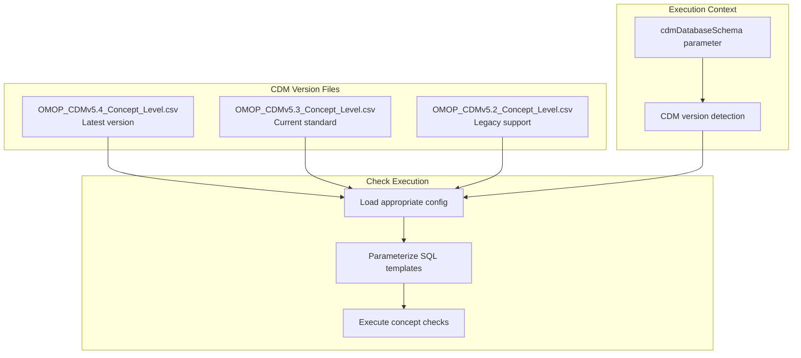

# Page: Concept Level Checks

# Concept Level Checks

<details>
<summary>Relevant source files</summary>

The following files were used as context for generating this wiki page:

- [inst/csv/OMOP_CDMv5.2_Concept_Level.csv](inst/csv/OMOP_CDMv5.2_Concept_Level.csv)
- [inst/csv/OMOP_CDMv5.3_Concept_Level.csv](inst/csv/OMOP_CDMv5.3_Concept_Level.csv)
- [inst/csv/OMOP_CDMv5.4_Concept_Level.csv](inst/csv/OMOP_CDMv5.4_Concept_Level.csv)
- [inst/sql/sql_server/concept_plausible_gender_use_descendants.sql](inst/sql/sql_server/concept_plausible_gender_use_descendants.sql)
- [vignettes/checks/plausibleAfterBirth.Rmd](vignettes/checks/plausibleAfterBirth.Rmd)
- [vignettes/checks/plausibleBeforeDeath.Rmd](vignettes/checks/plausibleBeforeDeath.Rmd)
- [vignettes/checks/plausibleStartBeforeEnd.Rmd](vignettes/checks/plausibleStartBeforeEnd.Rmd)

</details>


Concept Level Checks validate the clinical plausibility and consistency of specific OMOP concepts within the CDM database. These checks operate at the most granular level of the data quality framework, examining individual medical concepts for contextual appropriateness, expected prevalence, plausible value ranges, and temporal consistency.

For information about table-level validation, see [Table Level Checks](#5.1). For field-level validation rules, see [Field Level Checks](#5.2). For overall check framework and categories, see [Check Types and Categories](#4.1).

## Check Architecture

Concept Level Checks are implemented through a configuration-driven system that defines validation rules for specific OMOP concept IDs across different CDM table and field combinations.



**Sources:** [inst/csv/OMOP_CDMv5.4_Concept_Level.csv:1-1000](), [inst/csv/OMOP_CDMv5.3_Concept_Level.csv:1-1000](), [inst/csv/OMOP_CDMv5.2_Concept_Level.csv:1-1000](), [inst/sql/sql_server/concept_plausible_gender_use_descendants.sql:1-64]()

## Configuration Schema

The concept-level configuration files define validation parameters for specific concept-table-field combinations:

| Column | Purpose | Example |
|--------|---------|---------|
| `cdmTableName` | Target OMOP table | `CONDITION_OCCURRENCE` |
| `cdmFieldName` | Target field within table | `CONDITION_CONCEPT_ID` |
| `conceptId` | Specific OMOP concept ID | `26662` (Testicular hypofunction) |
| `conceptName` | Human-readable concept name | `Testicular hypofunction` |
| `plausibleGender` | Expected gender for concept | `Male` |
| `plausibleGenderThreshold` | Failure threshold percentage | `5` |
| `plausibleValueLow/High` | Expected value ranges | Numeric bounds |
| `isTemporallyConstant` | Should remain constant over time | `Yes` |
| `validPrevalenceLow/High` | Expected population prevalence | `0.0584`, `0.5252` |
| `plausibleUnitConceptIds` | Valid measurement units | Concept ID list |

**Sources:** [inst/csv/OMOP_CDMv5.4_Concept_Level.csv:1-2]()

## Check Types

### Gender Plausibility Checks

Gender plausibility validation ensures that gender-specific medical concepts occur in patients with the appropriate biological sex.



The implementation uses concept hierarchies to include descendant concepts:

**Sources:** [inst/sql/sql_server/concept_plausible_gender_use_descendants.sql:33-47](), [inst/csv/OMOP_CDMv5.4_Concept_Level.csv:5-6]()

### Value Range Plausibility

Value range checks validate that measurement values fall within clinically reasonable bounds for specific concepts:

| Concept | Unit | Low Threshold | High Threshold | Clinical Context |
|---------|------|---------------|----------------|------------------|
| `concept_id` with `unitConceptId` | Specific unit | `plausibleValueLow` | `plausibleValueHigh` | Expected clinical range |

**Sources:** [inst/csv/OMOP_CDMv5.4_Concept_Level.csv:1-2]()

### Temporal Consistency Checks

Temporal consistency validation identifies concepts that should remain constant across a patient's timeline:



**Sources:** [inst/csv/OMOP_CDMv5.4_Concept_Level.csv:1-2]()

### Prevalence Validation

Prevalence checks ensure that concept occurrence rates fall within expected population-level ranges:

| Check Component | Configuration | Purpose |
|----------------|---------------|---------|
| `validPrevalenceLow` | Lower bound percentage | Minimum expected prevalence |
| `validPrevalenceHigh` | Upper bound percentage | Maximum expected prevalence |
| `validPrevalenceLowThreshold` | Failure threshold | Allowable deviation |

Examples from the configuration:
- Osteoarthritis: 5.84% - 52.52% prevalence range
- Diabetes mellitus: 3.9% - 35.14% prevalence range
- HIV infection: 0.06% - 0.57% prevalence range

**Sources:** [inst/csv/OMOP_CDMv5.4_Concept_Level.csv:12](), [inst/csv/OMOP_CDMv5.4_Concept_Level.csv:132](), [inst/csv/OMOP_CDMv5.4_Concept_Level.csv:165]()

### Unit Concept Validation

Unit concept checks validate that measurement units are appropriate for specific clinical concepts:



**Sources:** [inst/csv/OMOP_CDMv5.4_Concept_Level.csv:1-2]()

## CDM Version Support

The system supports multiple OMOP CDM versions through separate configuration files:



**Sources:** [inst/csv/OMOP_CDMv5.4_Concept_Level.csv:1-1](), [inst/csv/OMOP_CDMv5.3_Concept_Level.csv:1-1](), [inst/csv/OMOP_CDMv5.2_Concept_Level.csv:1-1]()

## SQL Implementation Pattern

Concept-level checks follow a standardized SQL template pattern with parameterization:

```sql
-- Template parameters from concept_plausible_gender_use_descendants.sql
cdmDatabaseSchema = @cdmDatabaseSchema
vocabDatabaseSchema = @vocabDatabaseSchema  
cdmTableName = @cdmTableName
cdmFieldName = @cdmFieldName
conceptId = @conceptId
plausibleGenderUseDescendants = @plausibleGenderUseDescendants
```

The SQL queries join concept hierarchies, person demographics, and clinical data to perform contextual validation:

**Sources:** [inst/sql/sql_server/concept_plausible_gender_use_descendants.sql:1-17](), [inst/sql/sql_server/concept_plausible_gender_use_descendants.sql:34-47]()

## Integration with Check Execution

Concept-level checks integrate with the broader data quality framework through the main execution engine, contributing to the overall assessment of CDM data quality at the most specific clinical concept level.

**Sources:** [inst/csv/OMOP_CDMv5.4_Concept_Level.csv:1-1000](), [inst/sql/sql_server/concept_plausible_gender_use_descendants.sql:1-64]()