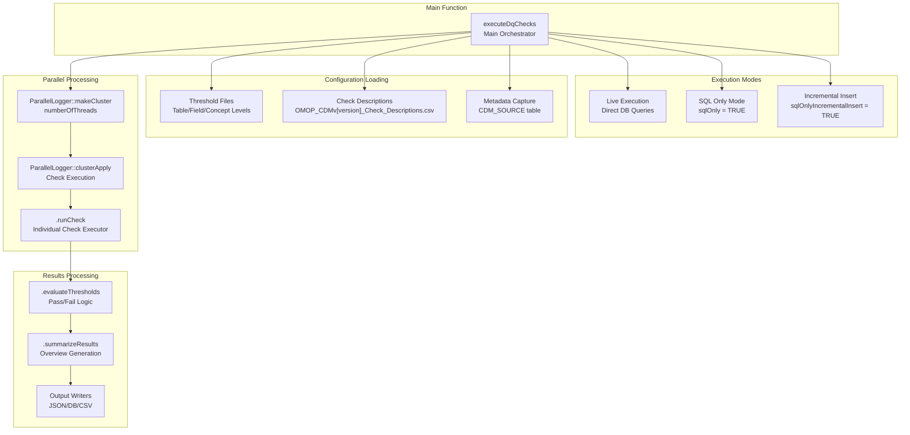
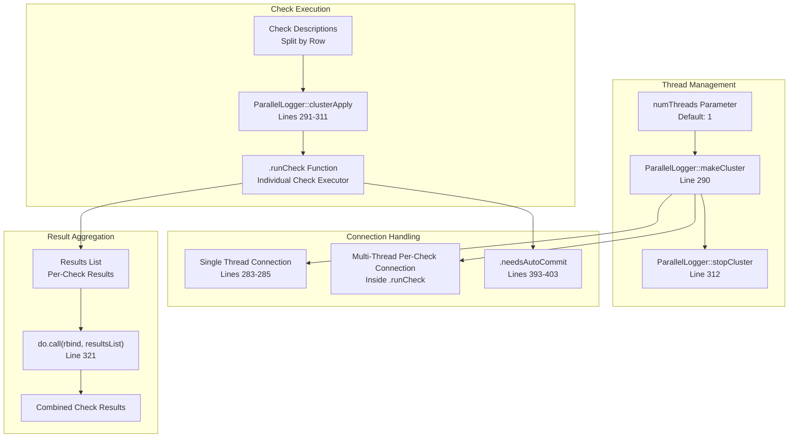
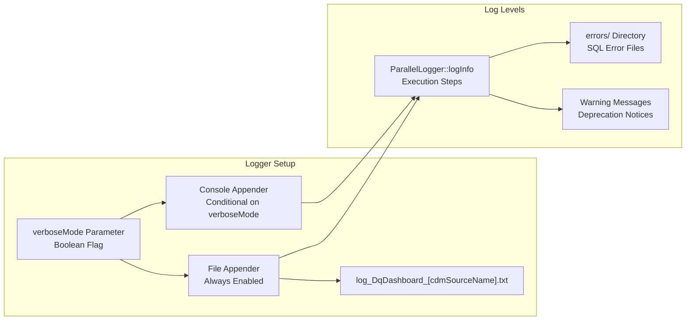

# Page: Core Execution Engine

# Core Execution Engine

Relevant source files

The following files were used as context for generating this wiki page:

- [DESCRIPTION](DESCRIPTION)
- [NAMESPACE](NAMESPACE)
- [NEWS.md](NEWS.md)
- [R/executeDqChecks.R](R/executeDqChecks.R)
- [man/executeDqChecks.Rd](man/executeDqChecks.Rd)
- [man/listDqChecks.Rd](man/listDqChecks.Rd)
- [man/reEvaluateThresholds.Rd](man/reEvaluateThresholds.Rd)
- [man/viewDqDashboard.Rd](man/viewDqDashboard.Rd)
- [man/writeJsonResultsToTable.Rd](man/writeJsonResultsToTable.Rd)

## Purpose and Scope

The Core Execution Engine is the primary orchestration system responsible for coordinating and executing data quality checks across OMOP CDM databases. This document covers the main execution function `executeDqChecks`, its internal architecture, execution modes, and the parallel processing framework that powers the system.

For information about specific data quality check implementations, see [Check Implementation](#5). For details about results processing and output formatting, see [Results Processing](#6). For configuration and threshold management, see [Data Quality Framework](#4).

## Architecture Overview

The Core Execution Engine centers around the `executeDqChecks` function, which serves as the main entry point and orchestrator for all data quality assessment operations.

**Sources:** [R/executeDqChecks.R:63-391]()

## Main Execution Flow

The `executeDqChecks` function follows a structured execution pipeline with distinct phases for setup, execution, and output generation.

```mermaid
graph TD
    subgraph "Phase 1: Validation and Setup"
        ParamValidation["Parameter Validation<br/>Lines 90-130"]
        OutputSetup["Output Folder Setup<br/>Lines 160-169"]
        LoggingSetup["Logging Configuration<br/>Lines 171-197"]
    end
    
    subgraph "Phase 2: Configuration Loading"
        MetadataQuery["CDM_SOURCE Metadata<br/>Lines 136-158"]
        LoadThresholds[".readThresholdFile<br/>Lines 212-225"]
        FilterChecks["Check Filtering<br/>Lines 228-280"]
    end
    
    subgraph "Phase 3: Execution"
        ClusterCreate["makeCluster<br/>Line 290"]
        ParallelExecution["clusterApply<br/>Lines 291-311"]
        ClusterStop["stopCluster<br/>Line 312"]
    end
    
    subgraph "Phase 4: Results Processing"
        CombineResults["rbind Results<br/>Line 321"]
        ThresholdEval[".evaluateThresholds<br/>Lines 324-329"]
        CreateOverview[".summarizeResults<br/>Line 332"]
        BuildResultObject["Create Result List<br/>Lines 338-347"]
    end
    
    subgraph "Phase 5: Output Generation"
        WriteJSON[".writeResultsToJson<br/>Line 355"]
        WriteTable[".writeResultsToTable<br/>Lines 364-372"]
        WriteCSV[".writeResultsToCsv<br/>Lines 376-384"]
    end
    
    ParamValidation --> OutputSetup
    OutputSetup --> LoggingSetup
    LoggingSetup --> MetadataQuery
    MetadataQuery --> LoadThresholds
    LoadThresholds --> FilterChecks
    FilterChecks --> ClusterCreate
    ClusterCreate --> ParallelExecution
    ParallelExecution --> ClusterStop
    ClusterStop --> CombineResults
    CombineResults --> ThresholdEval
    ThresholdEval --> CreateOverview
    CreateOverview --> BuildResultObject
    BuildResultObject --> WriteJSON
    WriteJSON --> WriteTable
    WriteTable --> WriteCSV
```

**Sources:** [R/executeDqChecks.R:63-391]()

## Execution Modes

The Core Execution Engine supports three distinct execution modes, controlled by the `sqlOnly` and `sqlOnlyIncrementalInsert` parameters.

### Live Execution Mode

The default mode where checks are executed directly against the database and results are immediately available.

| Parameter | Value | Description |
|-----------|-------|-------------|
| `sqlOnly` | `FALSE` | Execute queries against database |
| `sqlOnlyIncrementalInsert` | `FALSE` | Not applicable in live mode |

**Key Characteristics:**
- Direct database connection using `DatabaseConnector::connect`
- Real-time query execution
- Immediate result availability
- Metadata captured from `CDM_SOURCE` table

### SQL Generation Mode

Generates SQL scripts without executing them, useful for environments where direct execution is not possible.

| Parameter | Value | Description |
|-----------|-------|-------------|
| `sqlOnly` | `TRUE` | Generate SQL without execution |
| `sqlOnlyIncrementalInsert` | `FALSE` | Legacy SQL generation mode |

**Key Characteristics:**
- No database connection required
- SQL scripts written to output folder
- Metadata object created with minimal information
- DDL generation for results table

### Incremental Insert Mode

Advanced SQL generation mode that creates INSERT statements for batch processing of results.

| Parameter | Value | Description |
|-----------|-------|-------------|
| `sqlOnly` | `TRUE` | Generate SQL without execution |
| `sqlOnlyIncrementalInsert` | `TRUE` | Generate INSERT statements |
| `sqlOnlyUnionCount` | `> 1` | Number of UNIONed queries per batch |

**Key Characteristics:**
- Generates INSERT statements for results
- Supports batching with `sqlOnlyUnionCount` parameter
- Optimized for parallel execution environments
- Enables incremental result loading

**Sources:** [R/executeDqChecks.R:27-29](), [R/executeDqChecks.R:69-71](), [R/executeDqChecks.R:99-101](), [R/executeDqChecks.R:359-360]()

## Parallel Processing Architecture

The Core Execution Engine uses the `ParallelLogger` package to enable concurrent execution of data quality checks across multiple threads.

### Connection Management Strategy

The system handles database connections differently based on thread count:

- **Single Thread (`numThreads = 1`)**: Creates one persistent connection reused across all checks
- **Multi-Thread (`numThreads > 1`)**: Each check creates its own connection to avoid thread conflicts

**Auto-Commit Handling:**
The `.needsAutoCommit` function determines if auto-commit should be enabled for PostgreSQL and Redshift connections to prevent transaction conflicts.

**Sources:** [R/executeDqChecks.R:283-285](), [R/executeDqChecks.R:290-312](), [R/executeDqChecks.R:393-403]()

## Error Handling and Logging

The Core Execution Engine implements comprehensive logging and error handling to support debugging and monitoring of data quality assessments.

### Logging Configuration

### Error Directory Structure

The system creates an `errors/` subdirectory in the output folder to capture SQL execution errors:

- **Directory Creation**: [R/executeDqChecks.R:165-169]()
- **Error File Naming**: Individual SQL files named by check identifier
- **Cleanup**: Existing error directory is removed and recreated on each run

### Validation and Warnings

The function performs extensive parameter validation and issues warnings for common issues:

- **CDM Version Validation**: Checks for supported versions (5.2, 5.3, 5.4)
- **Parameter Type Checking**: Validates data types for all input parameters
- **Check Name Validation**: Warns if required checks for "Not Applicable" status are missing
- **CDM_SOURCE Validation**: Ensures table is populated and handles multiple rows
- **Deprecation Warnings**: Notifies users of deprecated checks

**Sources:** [R/executeDqChecks.R:90-130](), [R/executeDqChecks.R:165-169](), [R/executeDqChecks.R:171-197](), [R/executeDqChecks.R:268-278]()