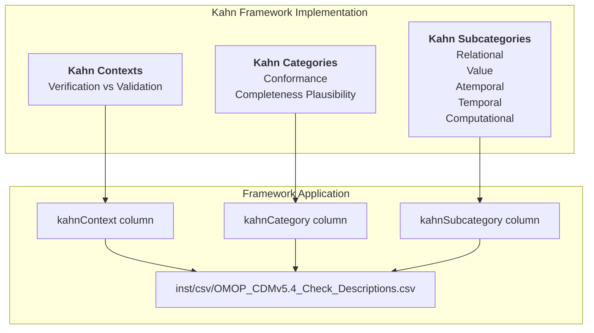
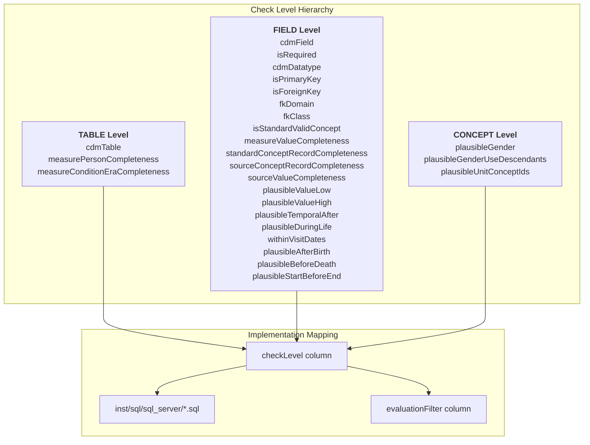
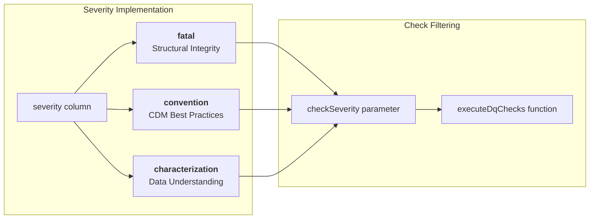
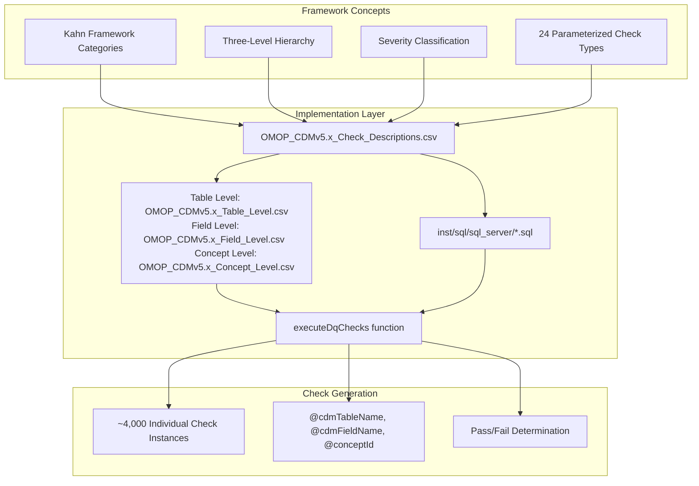
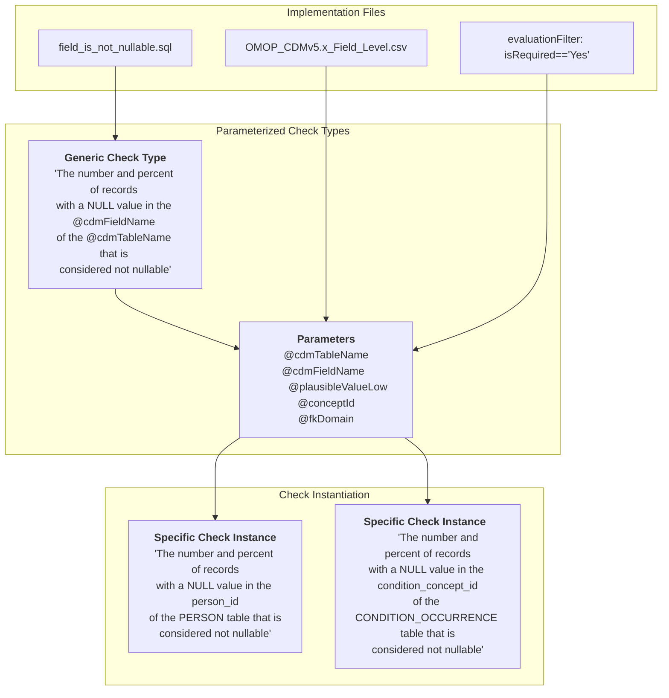

# Page: Data Quality Framework

# Data Quality Framework

Relevant source files

The following files were used as context for generating this wiki page:

- [docs/articles/CheckTypeDescriptions.html](docs/articles/CheckTypeDescriptions.html)
- [docs/articles/DataQualityDashboard.html](docs/articles/DataQualityDashboard.html)
- [docs/articles/DqdForCohorts.html](docs/articles/DqdForCohorts.html)
- [docs/articles/Thresholds.html](docs/articles/Thresholds.html)
- [docs/articles/index.html](docs/articles/index.html)
- [docs/news/index.html](docs/news/index.html)
- [docs/pkgdown.yml](docs/pkgdown.yml)
- [inst/csv/OMOP_CDMv5.2_Check_Descriptions.csv](inst/csv/OMOP_CDMv5.2_Check_Descriptions.csv)
- [inst/csv/OMOP_CDMv5.3_Check_Descriptions.csv](inst/csv/OMOP_CDMv5.3_Check_Descriptions.csv)
- [inst/csv/OMOP_CDMv5.4_Check_Descriptions.csv](inst/csv/OMOP_CDMv5.4_Check_Descriptions.csv)
- [inst/sql/sql_server/field_within_visit_dates.sql](inst/sql/sql_server/field_within_visit_dates.sql)

This document describes the conceptual framework that underpins the DataQualityDashboard's systematic approach to data quality assessment. It covers the Kahn Framework categorization, the three-level check hierarchy, severity classification, and how these concepts map to the actual implementation in code.

For information about specific check implementations, see [Check Types and Categories](#4.1). For details on OMOP CDM integration, see [OMOP CDM Integration](#4.2). For the core execution mechanics, see [Core Execution Engine](#3).

## Kahn Framework Foundation

The DataQualityDashboard implements a systematic approach to data quality assessment based on the Kahn Framework, which provides a standardized taxonomy for categorizing data quality checks. This framework ensures comprehensive coverage of data quality dimensions and enables consistent interpretation of results across different datasets.

**Kahn Context Classification:**
- **Verification**: Checks that validate structural integrity and format compliance (e.g., `cdmTable`, `cdmDatatype`)
- **Validation**: Checks that assess data content accuracy and business rule compliance (e.g., `measurePersonCompleteness`, `plausibleGender`)

**Kahn Category Classification:**
- **Conformance**: Structural and format adherence checks
- **Completeness**: Missing data identification
- **Plausibility**: Reasonable value assessment

Sources: [inst/csv/OMOP_CDMv5.4_Check_Descriptions.csv:1-28](), [inst/csv/OMOP_CDMv5.3_Check_Descriptions.csv:1-28]()

## Three-Level Check Hierarchy

The framework organizes all data quality checks into a three-level hierarchy that corresponds to different granularities of data quality assessment. This hierarchical approach ensures systematic coverage from high-level structural integrity down to specific data value validation.

**Level Characteristics:**
- **TABLE Level**: Evaluates entire tables or cross-table relationships without reference to specific fields
- **FIELD Level**: Focuses on individual field validation within specific tables (majority of checks)
- **CONCEPT Level**: Assesses concept-specific business rules and semantic validity

Sources: [inst/csv/OMOP_CDMv5.4_Check_Descriptions.csv:2-28](), [inst/sql/sql_server/field_within_visit_dates.sql:1-56]()

## Severity Classification System

The framework implements a three-tier severity classification that prioritizes data quality issues based on their impact on data usability and analysis validity. This classification guides remediation efforts and helps users understand the criticality of different check failures.

| Severity Level | Description | Impact | Examples |
|---|---|---|---|
| **fatal** | Critical structural integrity issues that prevent basic data usage | Database unusable for analysis | `cdmTable`, `isRequired`, `cdmDatatype`, `isPrimaryKey`, `isForeignKey` |
| **convention** | OMOP CDM best practice violations that should be resolved when possible | Analysis quality degraded | `measurePersonCompleteness`, `fkDomain`, `fkClass`, `isStandardValidConcept` |
| **characterization** | Data understanding and quality insights | Analysis interpretation affected | `measureValueCompleteness`, `plausibleValueLow`, `plausibleGender` |

Sources: [inst/csv/OMOP_CDMv5.4_Check_Descriptions.csv:1-28]()

## Framework-to-Implementation Mapping

The conceptual framework translates directly to implementation through a structured metadata system that drives check generation and execution. This mapping ensures that the theoretical framework has concrete operational meaning.

**Key Implementation Elements:**
- **Check Descriptions**: Metadata defining each check type's purpose, SQL template, and categorization
- **Threshold Files**: Level-specific configuration controlling which checks run and their failure criteria
- **SQL Templates**: Parameterized queries implementing the actual check logic
- **Parameter Substitution**: Dynamic replacement of placeholders to generate specific check instances

Sources: [inst/csv/OMOP_CDMv5.4_Check_Descriptions.csv:1-28](), [inst/sql/sql_server/field_within_visit_dates.sql:6-13]()

## Check Type Parameterization

The framework's power comes from its parameterized approach, where 24 generic check types expand into thousands of specific check instances through systematic parameter substitution. This approach ensures comprehensive coverage while maintaining manageable complexity.

**Parameterization Benefits:**
- **Scalability**: 24 check types generate ~4,000 specific checks across all CDM versions
- **Maintainability**: Single SQL template supports multiple check instances
- **Flexibility**: Parameters allow customization for different CDM configurations
- **Consistency**: Uniform approach ensures comparable results across different contexts

Sources: [inst/csv/OMOP_CDMv5.4_Check_Descriptions.csv:7-8](), [inst/sql/sql_server/field_within_visit_dates.sql:5-13]()