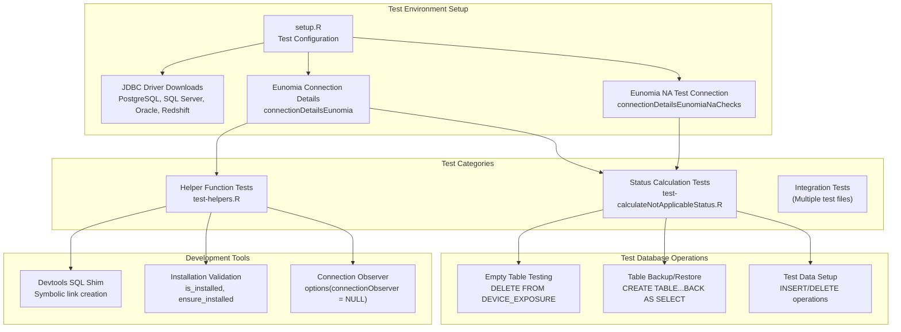
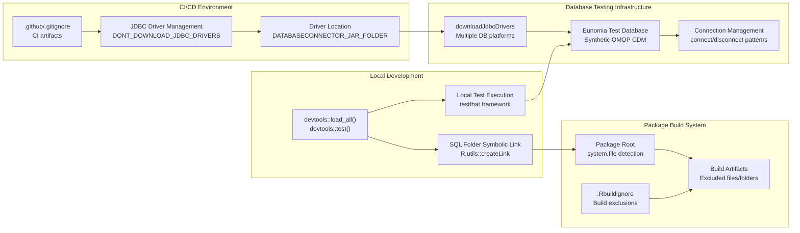
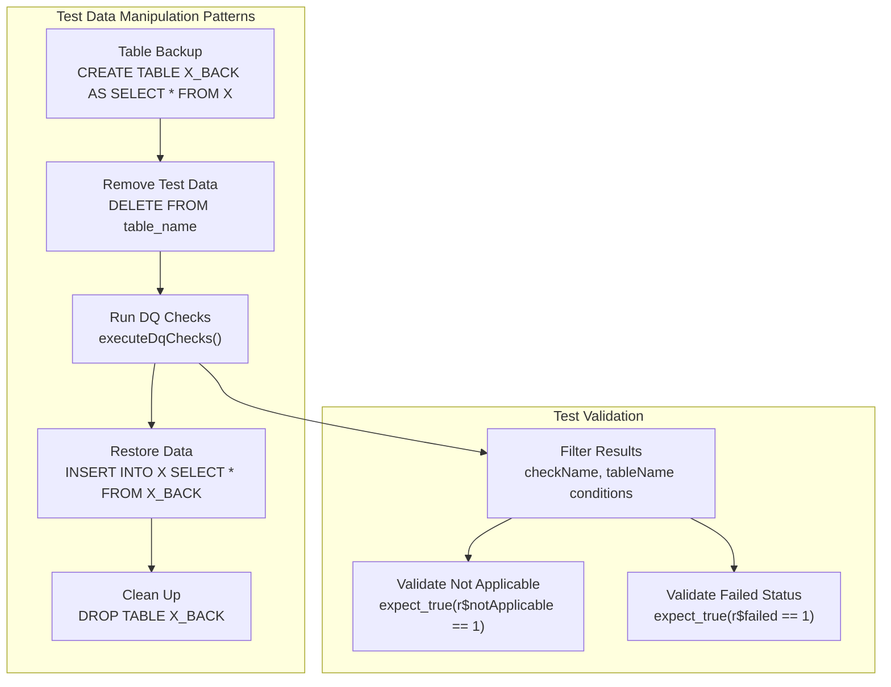

# Page: Development and Testing

# Development and Testing

Relevant source files

The following files were used as context for generating this wiki page:

- [.Rbuildignore](.Rbuildignore)
- [.github/.gitignore](.github/.gitignore)
- [tests/testthat/setup.R](tests/testthat/setup.R)
- [tests/testthat/test-calculateNotApplicableStatus.R](tests/testthat/test-calculateNotApplicableStatus.R)
- [tests/testthat/test-helpers.R](tests/testthat/test-helpers.R)

This page provides an overview of the development environment and testing infrastructure for the DataQualityDashboard package. It covers the testing framework architecture, development workflow, and key configuration files that support package development and maintenance.

For detailed information about the testing framework and test execution, see [Testing Framework](#9.1). For information about continuous integration and build processes, see [CI/CD and Build Process](#9.2).

## Development Environment Overview

The DataQualityDashboard package uses a comprehensive testing framework built on `testthat` with specialized infrastructure for database testing. The development workflow supports both local development using `devtools` and automated testing through continuous integration.

## Testing Architecture

The testing system is designed to validate data quality checks against real OMOP CDM databases using the Eunomia synthetic dataset:

Sources: [tests/testthat/setup.R:1-18](), [tests/testthat/test-calculateNotApplicableStatus.R:1-92](), [tests/testthat/test-helpers.R:1-19]()

## Development Workflow

The development process integrates multiple tools and environments to support both local development and package distribution:

Sources: [tests/testthat/test-helpers.R:9-17](), [tests/testthat/setup.R:1-10](), [.Rbuildignore:1-13](), [.github/.gitignore:1-2]()

## Key Testing Components

### Test Setup and Configuration

The testing infrastructure is initialized through `setup.R`, which handles:

| Component | Purpose | Configuration |
|-----------|---------|---------------|
| JDBC Drivers | Database connectivity | Downloads drivers for PostgreSQL, SQL Server, Oracle, Redshift |
| Eunomia Connections | Test database access | `connectionDetailsEunomia`, `cdmDatabaseSchemaEunomia` |
| NA Test Connections | Isolated testing environment | `connectionDetailsEunomiaNaChecks` for destructive tests |

### Test Categories

The test suite includes several specialized test categories:

- **Status Calculation Tests**: Validate `calculateNotApplicableStatus` logic with empty tables and missing data scenarios
- **Helper Function Tests**: Test utility functions like `is_installed` and `ensure_installed`
- **Integration Tests**: Full workflow testing using `executeDqChecks` with various parameter combinations

### Database Test Patterns

The testing framework employs sophisticated database manipulation patterns:

Sources: [tests/testthat/test-calculateNotApplicableStatus.R:33-58](), [tests/testthat/test-calculateNotApplicableStatus.R:65-91]()

## Development Tools and Configuration

### Package Build Configuration

The `.Rbuildignore` file excludes development and documentation files from the built package:

- Project files (`.Rproj`, `.Rproj.user`)
- Development directories (`extras`, `man-roxygen`, `docs`)
- Version control (`.git`)
- CI/CD configuration (`.github`)
- Documentation artifacts (`inst/doc/*.pdf`)

### Development Environment Detection

The testing framework includes special handling for development environments:

- Detects `devtools::load_all()` usage through `DEVTOOLS_LOAD` environment variable
- Creates symbolic links for SQL resources when running in development mode
- Sets `use.devtools.sql_shim` option for development-specific behavior

Sources: [tests/testthat/test-helpers.R:11-17](), [.Rbuildignore:1-13]()

## Environment Variables and Configuration

The system uses several environment variables to control testing behavior:

| Variable | Purpose | Values |
|----------|---------|---------|
| `DONT_DOWNLOAD_JDBC_DRIVERS` | Skip JDBC driver downloads | `"TRUE"` to skip |
| `DATABASECONNECTOR_JAR_FOLDER` | Pre-existing driver location | Path to JAR files |
| `DEVTOOLS_LOAD` | Development mode detection | `"true"` when using devtools |

Sources: [tests/testthat/setup.R:1-10](), [tests/testthat/test-helpers.R:11-12]()