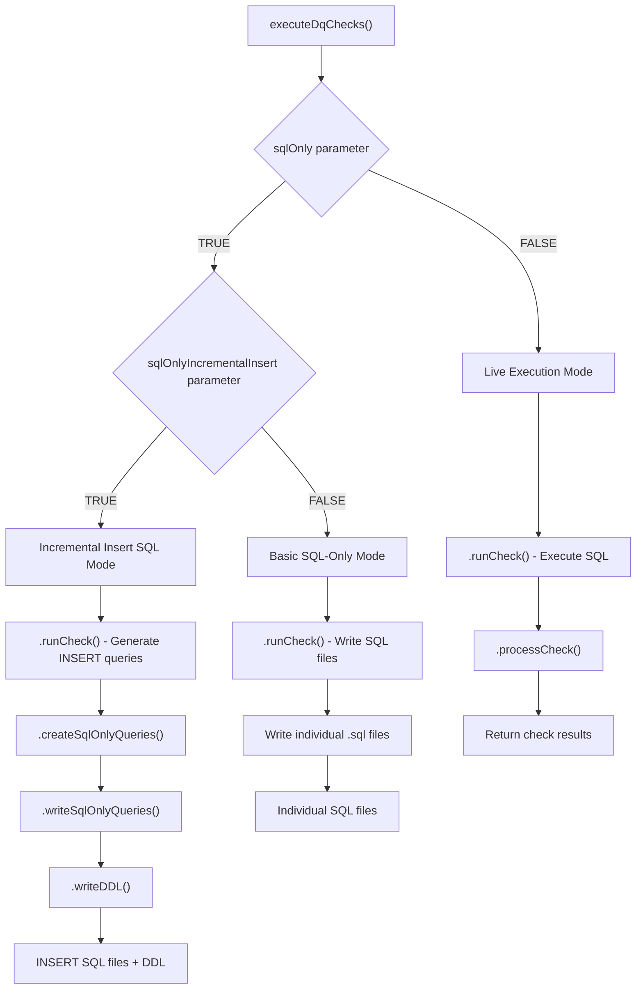
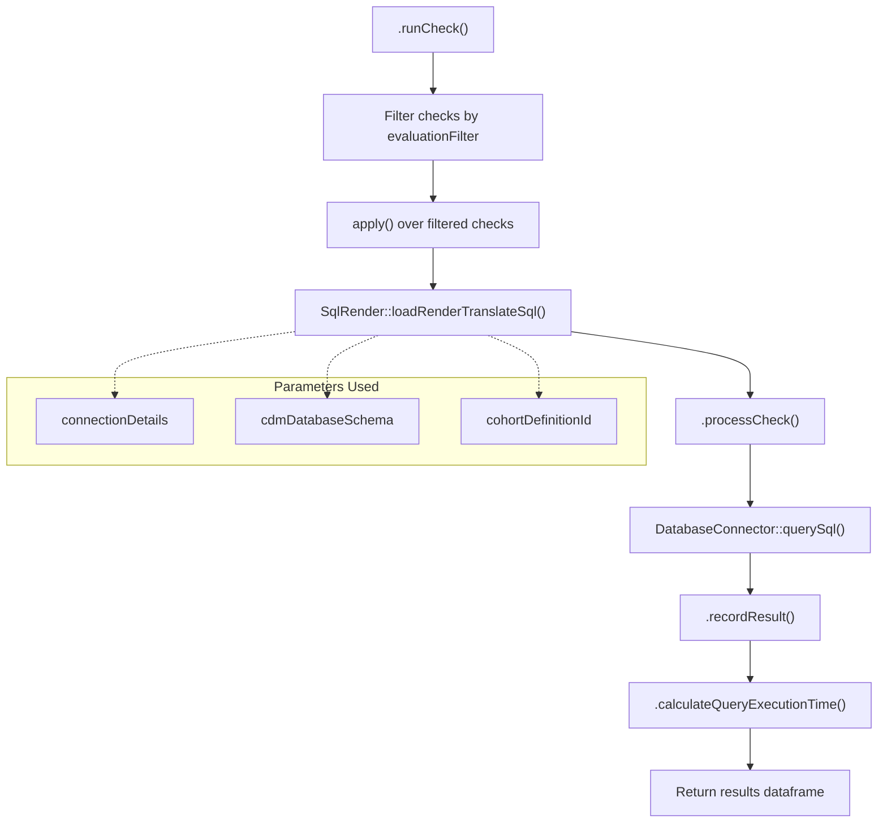
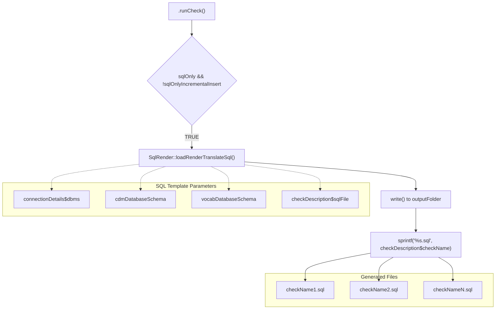
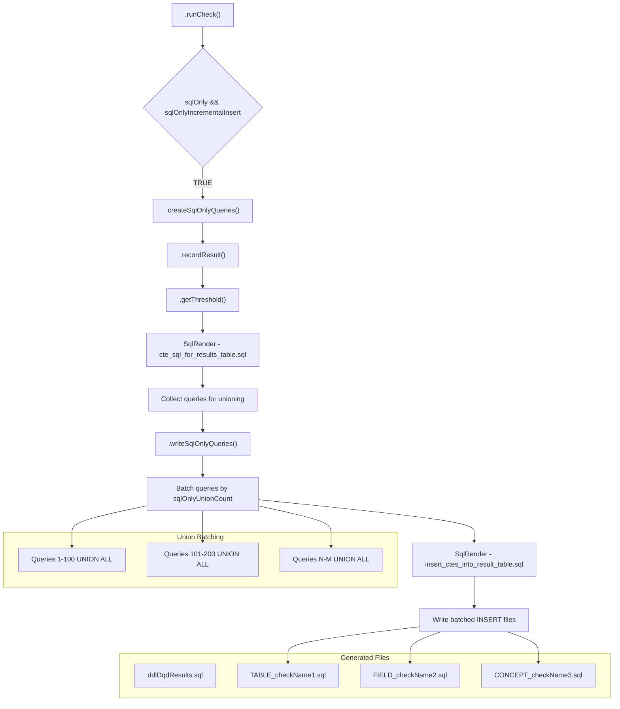
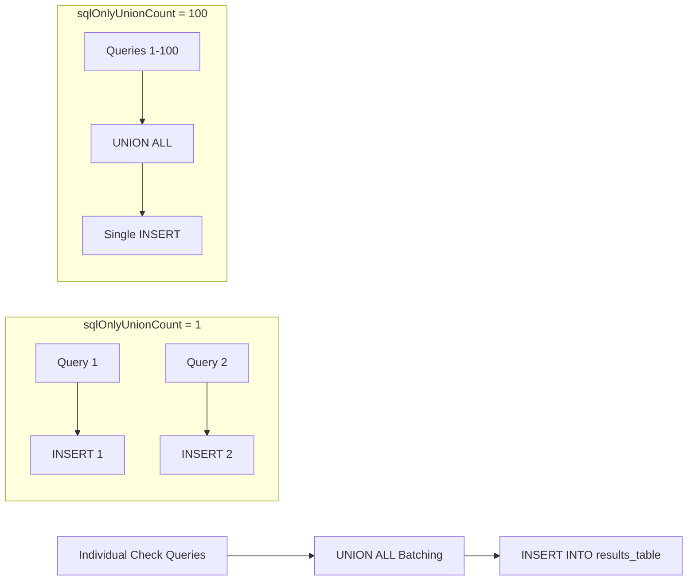
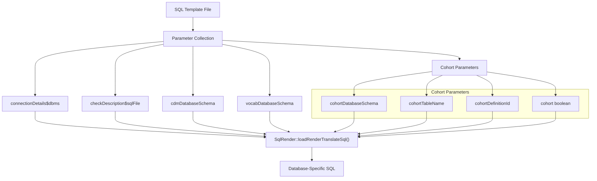
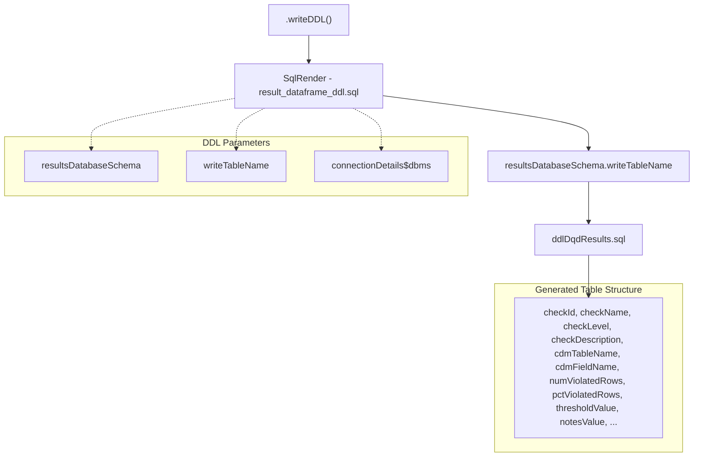
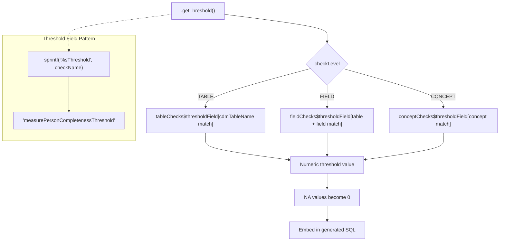

# Page: Execution Modes and SQL Generation

# Execution Modes and SQL Generation

Relevant source files

The following files were used as context for generating this wiki page:

- [R/runCheck.R](R/runCheck.R)
- [R/sqlOnly.R](R/sqlOnly.R)
- [docs/articles/AddNewCheck.html](docs/articles/AddNewCheck.html)
- [docs/articles/CheckStatusDefinitions.html](docs/articles/CheckStatusDefinitions.html)
- [docs/articles/SqlOnly.html](docs/articles/SqlOnly.html)
- [docs/reference/dot-writeResultsToCsv.html](docs/reference/dot-writeResultsToCsv.html)
- [docs/reference/writeJsonResultsToCsv.html](docs/reference/writeJsonResultsToCsv.html)
- [man/dot-runCheck.Rd](man/dot-runCheck.Rd)

This document covers the different execution modes available in the DataQualityDashboard system and how SQL generation works across these modes. The system supports three primary execution modes: live execution, basic SQL-only mode, and incremental insert SQL-only mode. Each mode serves different use cases from immediate database analysis to distributed execution scenarios.

For information about the main execution function and its parameters, see [executeDqChecks Function](#3.1). For details about the underlying check implementation, see [Check Implementation](#5).

## Execution Mode Overview

The DataQualityDashboard system supports three distinct execution modes controlled by the `sqlOnly` and `sqlOnlyIncrementalInsert` parameters:

Sources: [R/runCheck.R:95-134](), [R/sqlOnly.R:33-89](), [R/sqlOnly.R:105-145]()

## Live Execution Mode

Live execution mode (`sqlOnly = FALSE`) is the default behavior where checks are executed immediately against the database and results are processed in memory.

### Live Execution Flow

In live execution mode, the system:
1. Renders SQL templates with actual database parameters
2. Executes queries immediately against the database 
3. Processes results including error handling and timing
4. Returns structured results for threshold evaluation

Sources: [R/runCheck.R:113-122](), [R/runCheck.R:74-94]()

## Basic SQL-Only Mode

Basic SQL-only mode (`sqlOnly = TRUE`, `sqlOnlyIncrementalInsert = FALSE`) generates SQL files without executing them. This mode is useful for manual review, debugging, or execution in external systems.

### Basic SQL Generation Process

Each generated SQL file contains:
- Rendered SQL specific to the target database dialect
- Parameterized queries ready for execution
- Comments indicating the check type and purpose

Sources: [R/runCheck.R:107-112](), [R/runCheck.R:79-93]()

## Incremental Insert SQL Mode

Incremental insert mode (`sqlOnly = TRUE`, `sqlOnlyIncrementalInsert = TRUE`) generates SQL INSERT statements that populate a results table. This mode supports performance optimization through query unioning.

### Incremental Insert Architecture

Sources: [R/runCheck.R:95-106](), [R/runCheck.R:127-131](), [R/sqlOnly.R:33-89](), [R/sqlOnly.R:105-145]()

### SQL Union Optimization

The `sqlOnlyUnionCount` parameter controls performance optimization by batching multiple check queries into single INSERT statements:

| Parameter Value | Behavior | Use Case |
|-----------------|----------|----------|
| 1 | One INSERT per check | Maximum granular control |
| 10-50 | Small batches | Moderate performance gain |
| 100+ | Large batches | Maximum performance on systems like Spark |

Sources: [R/sqlOnly.R:122-144](), [R/sqlOnly.R:106-112]()

## SQL Template System

The SQL generation process relies on a template system that parameterizes queries for different execution contexts.

### Template Parameter Injection

### Key Template Parameters

| Parameter | Purpose | Example Value |
|-----------|---------|---------------|
| `@cdmDatabaseSchema` | CDM database location | `"my_cdm.dbo"` |
| `@vocabDatabaseSchema` | Vocabulary database location | `"my_vocab.dbo"` |
| `@cohortDatabaseSchema` | Cohort table location | `"results.dbo"` |
| `@cohortTableName` | Cohort table name | `"cohort"` |
| `@cohortDefinitionId` | Specific cohort ID | `1001` |
| `@cdmTableName` | Dynamic table name | `"PERSON"` |
| `@cdmFieldName` | Dynamic field name | `"person_id"` |

Sources: [R/runCheck.R:79-91](), [R/runCheck.R:67-71]()

## Results Table Schema

In incremental insert mode, the system generates DDL for a standardized results table structure:

### Results Table Generation

Sources: [R/sqlOnly.R:157-178]()

## Threshold Integration

The SQL generation process includes threshold evaluation logic, particularly in incremental insert mode where thresholds must be embedded in the generated SQL.

### Threshold Retrieval Process

Sources: [R/sqlOnly.R:196-279](), [R/sqlOnly.R:47-58]()

This execution mode and SQL generation system provides flexibility for different deployment scenarios while maintaining consistent check logic across all modes.