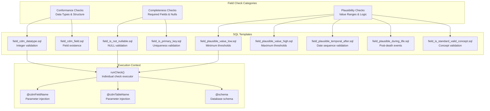
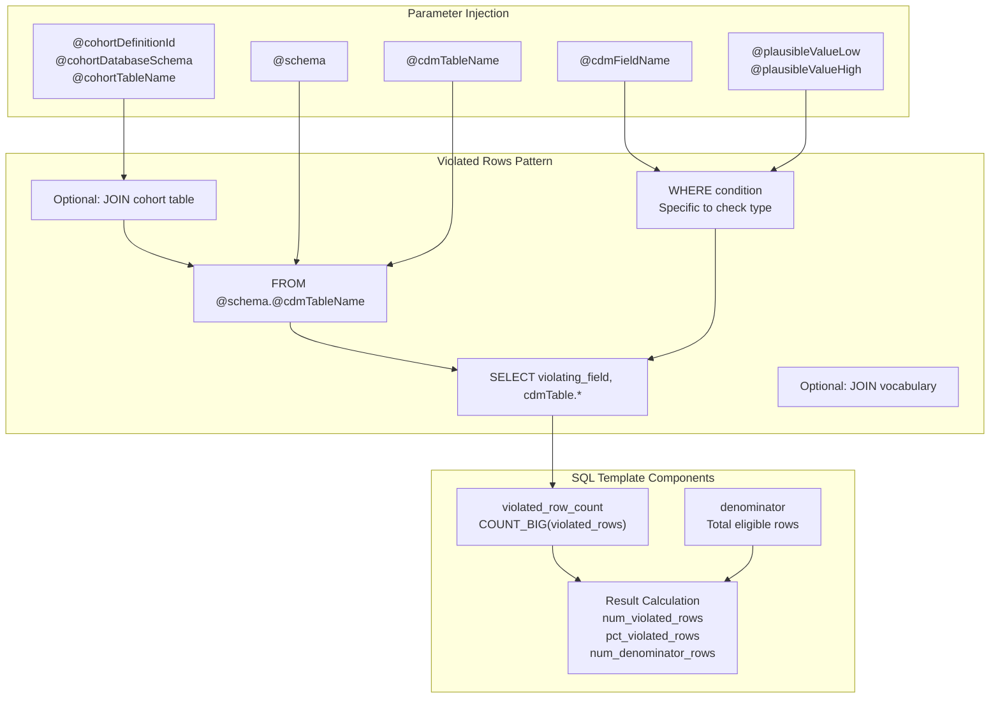

# Page: Field Level Checks

# Field Level Checks

<details>
<summary>Relevant source files</summary>

The following files were used as context for generating this wiki page:

- [inst/sql/sql_server/field_cdm_datatype.sql](inst/sql/sql_server/field_cdm_datatype.sql)
- [inst/sql/sql_server/field_cdm_field.sql](inst/sql/sql_server/field_cdm_field.sql)
- [inst/sql/sql_server/field_is_not_nullable.sql](inst/sql/sql_server/field_is_not_nullable.sql)
- [inst/sql/sql_server/field_is_primary_key.sql](inst/sql/sql_server/field_is_primary_key.sql)
- [inst/sql/sql_server/field_is_standard_valid_concept.sql](inst/sql/sql_server/field_is_standard_valid_concept.sql)
- [inst/sql/sql_server/field_plausible_during_life.sql](inst/sql/sql_server/field_plausible_during_life.sql)
- [inst/sql/sql_server/field_plausible_temporal_after.sql](inst/sql/sql_server/field_plausible_temporal_after.sql)
- [inst/sql/sql_server/field_plausible_value_high.sql](inst/sql/sql_server/field_plausible_value_high.sql)
- [inst/sql/sql_server/field_plausible_value_low.sql](inst/sql/sql_server/field_plausible_value_low.sql)
- [inst/sql/sql_server/table_cdm_table.sql](inst/sql/sql_server/table_cdm_table.sql)

</details>


Field level checks validate individual fields (columns) within OMOP CDM tables, ensuring data quality at the granular level of specific database columns. These checks examine data type conformance, completeness, and plausibility constraints for individual fields across the CDM schema.

For information about table-level validation, see [Table Level Checks](#5.1). For concept-level vocabulary validation, see [Concept Level Checks](#5.3).

## Overview

Field level checks form the core of the DataQualityDashboard validation framework, implementing the majority of the ~4,000 individual check instances. These checks operate on specific field combinations defined in the CDM schema metadata and execute SQL queries that examine field-specific data quality rules.



**Sources:** [inst/sql/sql_server/field_cdm_datatype.sql:1-47](), [inst/sql/sql_server/field_is_not_nullable.sql:1-55](), [inst/sql/sql_server/field_plausible_value_low.sql:1-58]()

## Field Check Types

Field level checks are organized into specific validation patterns, each implemented as parameterized SQL templates that can be applied across different CDM fields.

### Conformance Checks

| Check Type | SQL Template | Purpose | Parameters |
|------------|--------------|---------|------------|
| `cdmDatatype` | `field_cdm_datatype.sql` | Validates integer fields contain only digits without decimals | `@schema`, `@cdmTableName`, `@cdmFieldName` |
| `cdmField` | `field_cdm_field.sql` | Verifies field exists in table schema | `@schema`, `@cdmTableName`, `@cdmFieldName` |
| `isPrimaryKey` | `field_is_primary_key.sql` | Ensures primary key field values are unique | `@schema`, `@cdmTableName`, `@cdmFieldName` |

The `cdmDatatype` check uses SQL Server-specific `ISNUMERIC()` function to validate integer fields:

```sql
WHERE (ISNUMERIC(cdmTable.@cdmFieldName) = 0 
    OR (ISNUMERIC(cdmTable.@cdmFieldName) = 1 
        AND CHARINDEX('.', CAST(ABS(cdmTable.@cdmFieldName) AS varchar)) != 0))
```

**Sources:** [inst/sql/sql_server/field_cdm_datatype.sql:34-36](), [inst/sql/sql_server/field_cdm_field.sql:1-35](), [inst/sql/sql_server/field_is_primary_key.sql:1-63]()

### Completeness Checks

| Check Type | SQL Template | Purpose | Validation Logic |
|------------|--------------|---------|------------------|
| `isRequired` | `field_is_not_nullable.sql` | Identifies NULL values in required fields | `WHERE cdmTable.@cdmFieldName IS NULL` |

The completeness check template includes cohort filtering support through conditional SQL generation:

```sql
{@cohort & '@runForCohort' == 'Yes'}?{
    JOIN @cohortDatabaseSchema.@cohortTableName c
        ON cdmTable.person_id = c.subject_id
        AND c.cohort_definition_id = @cohortDefinitionId
}
```

**Sources:** [inst/sql/sql_server/field_is_not_nullable.sql:35-39](), [inst/sql/sql_server/field_is_not_nullable.sql:40]()

### Plausibility Checks

Plausibility checks validate logical constraints and reasonable value ranges for clinical data fields.

| Check Type | SQL Template | Purpose | Key Logic |
|------------|--------------|---------|-----------|
| `plausibleValueLow` | `field_plausible_value_low.sql` | Values below minimum threshold | Date/numeric comparison with `@plausibleValueLow` |
| `plausibleValueHigh` | `field_plausible_value_high.sql` | Values above maximum threshold | Date/numeric comparison with `@plausibleValueHigh` |
| `plausibleTemporalAfter` | `field_plausible_temporal_after.sql` | Date sequence validation | Cross-table temporal relationships |
| `plausibleDuringLife` | `field_plausible_during_life.sql` | Events after death detection | 60-day grace period after death |
| `isStandardValidConcept` | `field_is_standard_valid_concept.sql` | Standard concept validation | Vocabulary table joins |

The temporal validation implements complex date logic with special handling for PERSON table birth dates:

```sql
{'@plausibleTemporalAfterTableName' == 'PERSON'}?{
    COALESCE(
        CAST(plausibleTable.@plausibleTemporalAfterFieldName AS DATE),
        CAST(CONCAT(plausibleTable.year_of_birth,'0601') AS DATE)
    ) 
}:{
    CAST(cdmTable.@plausibleTemporalAfterFieldName AS DATE)
} > CAST(cdmTable.@cdmFieldName AS DATE)
```

**Sources:** [inst/sql/sql_server/field_plausible_value_low.sql:38-42](), [inst/sql/sql_server/field_plausible_temporal_after.sql:46-53](), [inst/sql/sql_server/field_plausible_during_life.sql:43]()

## SQL Template Structure

All field-level check templates follow a consistent structure that produces standardized result sets for the execution engine.



**Sources:** [inst/sql/sql_server/field_plausible_value_low.sql:18-23](), [inst/sql/sql_server/field_plausible_value_low.sql:28-44]()

## Execution Integration

Field level checks integrate with the broader execution engine through the `runCheck()` function, which handles parameter substitution and result processing.

### Parameter Substitution

The SQL templates use parameter placeholders that are replaced during execution:

| Parameter Pattern | Purpose | Example Values |
|-------------------|---------|----------------|
| `@schema` | Database schema name | `'cdm_database_schema'` |
| `@cdmTableName` | OMOP CDM table name | `'PERSON'`, `'CONDITION_OCCURRENCE'` |
| `@cdmFieldName` | Specific field name | `'person_id'`, `'condition_start_date'` |
| `@plausibleValueLow` | Minimum threshold | `0`, `'1900-01-01'` |
| `@plausibleValueHigh` | Maximum threshold | `150`, `'2099-12-31'` |

### Cohort Filtering

Field checks support optional cohort-based filtering through conditional SQL generation:

```sql
{@cohort & '@runForCohort' == 'Yes'}?{
    JOIN @cohortDatabaseSchema.@cohortTableName c 
        ON cdmTable.person_id = c.subject_id
        AND c.cohort_definition_id = @cohortDefinitionId
}
```

This pattern appears in [inst/sql/sql_server/field_plausible_value_low.sql:33-37](), [inst/sql/sql_server/field_plausible_during_life.sql:36-40](), and other field check templates.

**Sources:** [inst/sql/sql_server/field_plausible_value_low.sql:33-37](), [inst/sql/sql_server/field_plausible_during_life.sql:36-40]()

## Result Processing

Field level checks return standardized result sets that feed into the broader results processing pipeline described in [Results Processing](#6).

### Standard Result Schema

Every field check returns the same three-column result set:

| Column | Type | Purpose |
|--------|------|---------|
| `num_violated_rows` | INTEGER | Count of rows violating the check |
| `pct_violated_rows` | DECIMAL | Percentage of violations (0.0-1.0) |
| `num_denominator_rows` | INTEGER | Total rows eligible for the check |

### Error Handling

Field checks handle empty tables gracefully through denominator logic:

```sql
CASE 
    WHEN denominator.num_rows = 0 THEN 0 
    ELSE 1.0*num_violated_rows/denominator.num_rows 
END AS pct_violated_rows
```

This pattern prevents division by zero errors when tables are empty or when cohort filtering results in no eligible rows.

**Sources:** [inst/sql/sql_server/field_plausible_value_low.sql:19-22](), [inst/sql/sql_server/field_cdm_datatype.sql:17-20]()