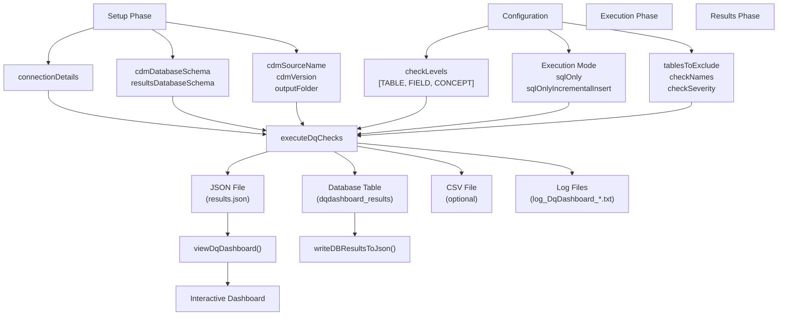
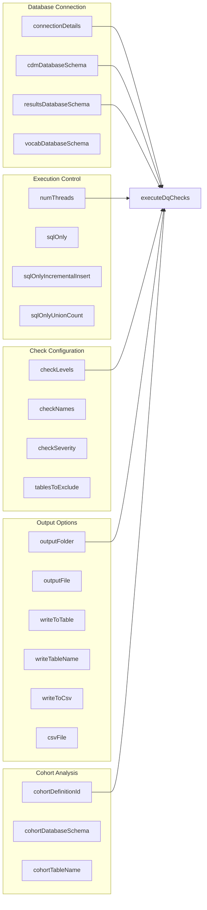
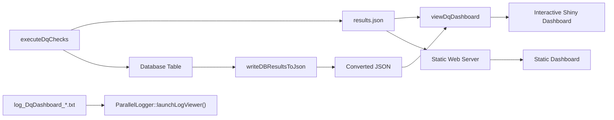

# Page: Getting Started

# Getting Started

Relevant source files

The following files were used as context for generating this wiki page:

- [docs/articles/CheckTypeDescriptions.html](docs/articles/CheckTypeDescriptions.html)
- [docs/articles/DataQualityDashboard.html](docs/articles/DataQualityDashboard.html)
- [docs/articles/DqdForCohorts.html](docs/articles/DqdForCohorts.html)
- [docs/articles/Thresholds.html](docs/articles/Thresholds.html)
- [docs/articles/index.html](docs/articles/index.html)
- [docs/news/index.html](docs/news/index.html)
- [docs/pkgdown.yml](docs/pkgdown.yml)
- [extras/codeToRun.R](extras/codeToRun.R)

This page provides an overview of the DataQualityDashboard R package and guides you through the essential concepts needed to begin assessing data quality in OMOP CDM databases. It covers the basic workflow, key components, and execution modes available in the system.

For detailed installation instructions and system requirements, see [Installation and Setup](#2.1). For a step-by-step walkthrough of running your first data quality assessment, see [Quick Start Guide](#2.2).

## Overview

The DataQualityDashboard package systematically evaluates OMOP CDM database quality by executing over 3,000 parameterized data quality checks across three levels: table, field, and concept. The system generates comprehensive results that can be viewed through an interactive Shiny dashboard or exported to various formats.

## System Architecture

The following diagram illustrates the core execution workflow and how the main components interact:

**DataQualityDashboard Execution Workflow**

Sources: [extras/codeToRun.R:17-131](), [docs/articles/DataQualityDashboard.html:222-337]()

## Key Function Parameters

The `executeDqChecks` function serves as the main orchestrator and accepts the following essential parameter categories:

**Core Function Parameters Mapping**

Sources: [extras/codeToRun.R:21-119](), [docs/articles/DataQualityDashboard.html:225-326]()

## Execution Modes

The system supports three primary execution modes:

| Mode | Purpose | Key Parameters | Output |
|------|---------|----------------|---------|
| **Live Execution** | Run checks directly against database | `sqlOnly = FALSE` | JSON, Database table, CSV |
| **SQL Generation** | Generate SQL scripts for external execution | `sqlOnly = TRUE` | SQL files only |
| **Incremental Insert** | Generate SQL with result insertion | `sqlOnlyIncrementalInsert = TRUE` | SQL files with INSERT statements |

Sources: [extras/codeToRun.R:40-53](), [docs/articles/DataQualityDashboard.html:244-256]()

## Check Levels and Categories

The system organizes data quality checks into three hierarchical levels:

| Level | Description | Example Checks |
|-------|-------------|----------------|
| **TABLE** | Table-level assessments | `measurePersonCompleteness` |
| **FIELD** | Field-level validations | `isRequired`, `cdmDatatype`, `isForeignKey` |
| **CONCEPT** | Concept-specific rules | `plausibleGender`, `plausibleUnitConceptIds` |

Each check is categorized using the Kahn Framework:
- **Conformance**: Structure and format validation
- **Completeness**: Missing data assessment  
- **Plausibility**: Reasonable value verification

Sources: [extras/codeToRun.R:84-87](), [docs/articles/CheckTypeDescriptions.html:227-241]()

## Configuration Files

The system uses CSV configuration files located in the package to define which checks to execute and their failure thresholds:

| File Pattern | Purpose |
|--------------|---------|
| `OMOP_CDMv*.*.x_Check_Descriptions.csv` | Check type definitions and SQL mappings |
| `OMOP_CDMv*.*.x_Table_Level.csv` | Table-level check configurations |
| `OMOP_CDMv*.*.x_Field_Level.csv` | Field-level check configurations |
| `OMOP_CDMv*.*.x_Concept_Level.csv` | Concept-level check configurations |

Sources: [docs/articles/Thresholds.html:240-273]()

## Results and Visualization

After execution, results can be accessed through multiple channels:

**Result Processing Flow**

Sources: [extras/codeToRun.R:122-129](), [docs/articles/DataQualityDashboard.html:342-356]()

## CDM Version Support

The package supports multiple OMOP CDM versions with version-specific configuration files:

- **CDM v5.2**: Legacy support
- **CDM v5.3**: Current standard
- **CDM v5.4**: Latest version

The `cdmVersion` parameter determines which configuration files and validation rules are applied during execution.

Sources: [extras/codeToRun.R:34](), [docs/articles/DataQualityDashboard.html:238]()

## Next Steps

To begin using the DataQualityDashboard:

1. **Installation**: Follow the detailed setup instructions in [Installation and Setup](#2.1)
2. **First Run**: Complete the step-by-step tutorial in [Quick Start Guide](#2.2)
3. **Advanced Features**: Explore execution modes and customization options in [Core Execution Engine](#3)

The system is designed to work with any OMOP CDM-compliant database and provides extensive configuration options for different use cases, from quick assessments to comprehensive data quality audits.

Sources: [extras/codeToRun.R:17-131](), [docs/articles/DataQualityDashboard.html:202-363]()