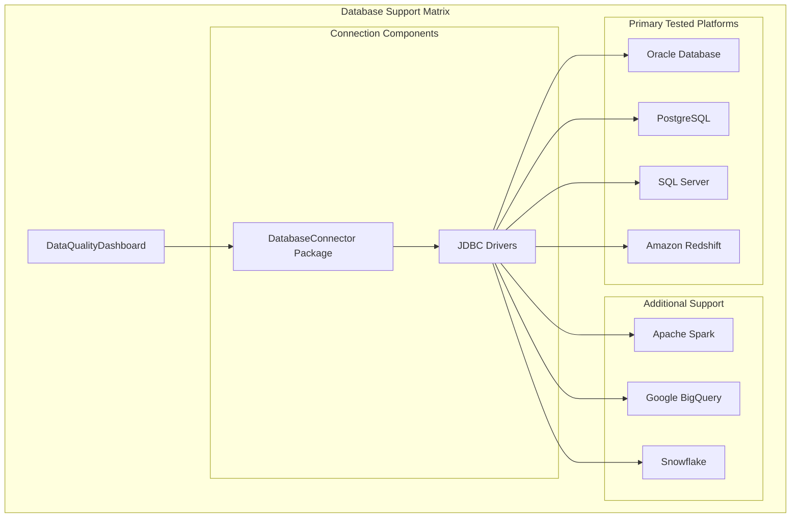
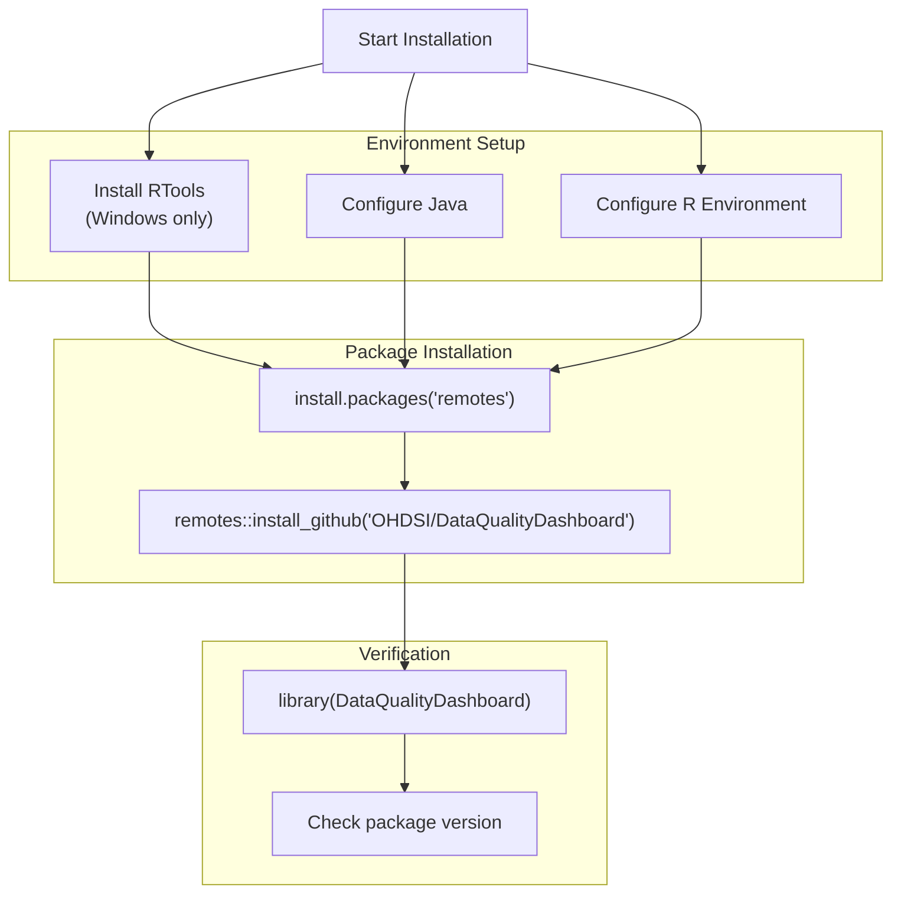
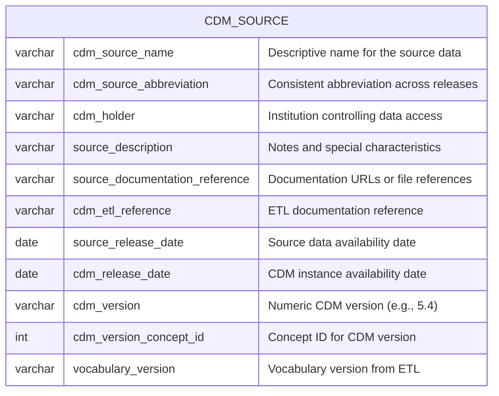
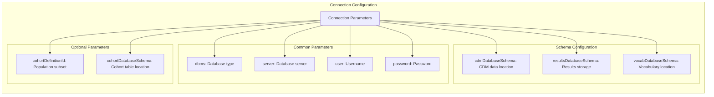

# Page: Installation and Setup

# Installation and Setup

<details>
<summary>Relevant source files</summary>

The following files were used as context for generating this wiki page:

- [.Rbuildignore](.Rbuildignore)
- [.github/.gitignore](.github/.gitignore)
- [.github/workflows/R_CMD_check_Hades.yml](.github/workflows/R_CMD_check_Hades.yml)
- [.github/workflows/R_CMD_check_main_weekly.yaml](.github/workflows/R_CMD_check_main_weekly.yaml)
- [README.md](README.md)

</details>


This document provides comprehensive instructions for installing and configuring the DataQualityDashboard R package. It covers system prerequisites, installation procedures, database requirements, and initial configuration steps needed to run data quality assessments against OMOP CDM instances.

For information about running your first data quality check, see [Quick Start Guide](#2.2). For advanced configuration options and custom thresholds, see [Advanced Usage](#8).

## System Requirements

### Core Dependencies

The DataQualityDashboard package requires several system-level components to function properly:

| Component | Requirement | Purpose |
|-----------|-------------|---------|
| R | Version 3.2.2 or higher | Core runtime environment |
| DatabaseConnector | Version 2.0.2 or higher | Database connectivity layer |
| Java | Compatible version | Required by DatabaseConnector |
| RTools | Platform-specific | Package compilation (Windows) |

### Supported Database Platforms

The package supports multiple database management systems as documented in the OHDSI Hades platform specifications:



**Installation Dependencies Diagram**

Sources: [README.md:72-78](), [.github/workflows/R_CMD_check_Hades.yml:31-57]()

### OMOP CDM Version Compatibility

The package provides data quality check definitions for multiple OMOP CDM versions:

| CDM Version | Support Status | Testing Status |
|-------------|----------------|----------------|
| v5.2 | Supported | Legacy - limited testing |
| v5.3 | Supported | Fully tested |
| v5.4 | Supported | Fully tested |

Sources: [README.md:78]()

## Installation Process

### Step 1: R Environment Configuration

Before installing DataQualityDashboard, ensure your R environment is properly configured:



**Installation Process Flow**

Sources: [README.md:82-89]()

### Step 2: Install Required Dependencies

Execute the following R commands to install the package:

```r
# Install remotes package if not already available
install.packages("remotes")

# Install DataQualityDashboard from GitHub
remotes::install_github("OHDSI/DataQualityDashboard")
```

The installation process will automatically resolve and install all required dependencies including `DatabaseConnector` and other OHDSI packages.

Sources: [README.md:86-89]()

### Step 3: Verify Installation

Confirm successful installation by loading the package:

```r
library(DataQualityDashboard)
packageVersion("DataQualityDashboard")
```

## Database Prerequisites

### CDM_SOURCE Table Requirements

Prior to executing data quality checks, the `CDM_SOURCE` table must be properly populated with metadata about your OMOP CDM instance:



**CDM_SOURCE Table Schema Requirements**

Sources: [README.md:52-67]()

### Required CDM_SOURCE Field Mapping

| Field Name | Required | Validation Logic |
|------------|----------|------------------|
| `cdm_source_name` | Yes | Used in result identification |
| `cdm_source_abbreviation` | Yes | Must be consistent across releases |
| `cdm_version` | Yes | Must match supported versions (5.2, 5.3, 5.4) |
| `cdm_version_concept_id` | Yes | Must reference valid concept |
| `vocabulary_version` | Yes | Retrieved via `SELECT vocabulary_version FROM vocabulary WHERE vocabulary_id = 'None'` |

Sources: [README.md:54-66]()

## Database Connection Configuration

### Connection Parameters

The `executeDqChecks` function requires database connection parameters that vary by platform:



**Database Connection Parameter Structure**

Sources: Based on executeDqChecks function parameters referenced in system architecture

### Platform-Specific Configuration Examples

| Database Platform | DBMS Value | Connection String Format |
|-------------------|------------|-------------------------|
| SQL Server | `"sql server"` | `server/database` |
| PostgreSQL | `"postgresql"` | `host:port/database` |
| Oracle | `"oracle"` | `host:port:sid` |
| Redshift | `"redshift"` | `endpoint:port/database` |

Sources: [.github/workflows/R_CMD_check_Hades.yml:31-57]()

## Initial Configuration Validation

### Configuration Verification Steps

After installation, verify your setup can access the required components:

```mermaid
flowchart TD
    subgraph "Validation Process"
        START["Begin Validation"]
        
        subgraph "Package Verification"
            LOAD_PKG["Load DataQualityDashboard"]
            CHECK_VERSION["Verify package version"]
        end
        
        subgraph "Database Connectivity"
            DB_CONNECT["Test database connection"]
            SCHEMA_ACCESS["Verify schema access"]
            CDM_SOURCE_CHECK["Validate CDM_SOURCE table"]
        end
        
        subgraph "Dependency Verification"
            DB_CONNECTOR["Check DatabaseConnector"]
            JAVA_CONFIG["Verify Java configuration"]
        end
        
        COMPLETE["Configuration Complete"]
    end
    
    START --> LOAD_PKG
    LOAD_PKG --> CHECK_VERSION
    CHECK_VERSION --> DB_CONNECT
    
    DB_CONNECT --> SCHEMA_ACCESS
    SCHEMA_ACCESS --> CDM_SOURCE_CHECK
    
    CDM_SOURCE_CHECK --> DB_CONNECTOR
    DB_CONNECTOR --> JAVA_CONFIG
    JAVA_CONFIG --> COMPLETE
```



**Configuration Validation Workflow**

### Validation Commands

Execute these R commands to verify your installation:

```r
# 1. Package loading verification
library(DataQualityDashboard)

# 2. Database connection test
connectionDetails <- DatabaseConnector::createConnectionDetails(
  dbms = "your_dbms",
  server = "your_server", 
  user = "your_username",
  password = "your_password"
)

# 3. Test connection
connection <- DatabaseConnector::connect(connectionDetails)
DatabaseConnector::disconnect(connection)

# 4. CDM_SOURCE validation query
sql <- "SELECT cdm_version FROM @cdmDatabaseSchema.cdm_source"
result <- DatabaseConnector::renderTranslateQuerySql(
  connection = connection,
  sql = sql,
  cdmDatabaseSchema = "your_cdm_schema"
)
```

Sources: Based on DatabaseConnector usage patterns and CDM_SOURCE requirements

## Common Installation Issues

### Platform-Specific Troubleshooting

| Platform | Common Issue | Resolution |
|----------|--------------|------------|
| Windows | RTools not found | Install appropriate RTools version for your R version |
| macOS | Java configuration | Use `R CMD javareconf` to reconfigure Java paths |
| Linux | System dependencies | Install required system libraries via package manager |
| All | DatabaseConnector issues | Verify JDBC drivers are properly installed |

### Database Connection Troubleshooting

| Error Pattern | Likely Cause | Solution |
|---------------|--------------|----------|
| JDBC driver not found | Missing database drivers | Install appropriate JDBC drivers |
| Schema access denied | Insufficient permissions | Verify database user has read access to CDM schemas |
| CDM_SOURCE empty | Table not populated | Populate CDM_SOURCE table with required metadata |

Sources: [.github/workflows/R_CMD_check_Hades.yml:74-82](), [README.md:72-78]()