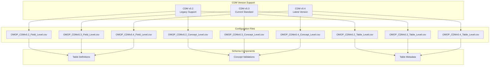
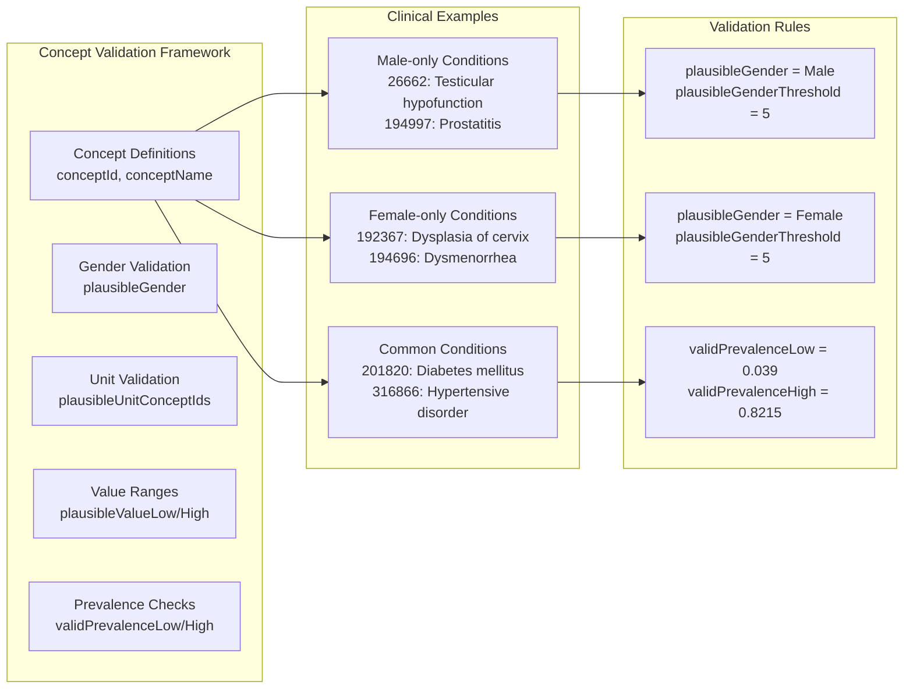
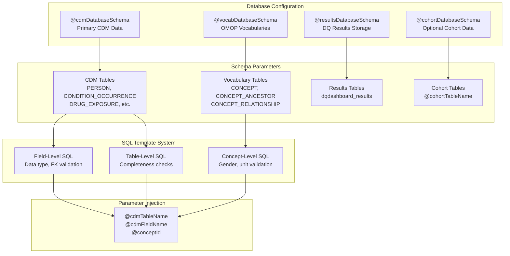
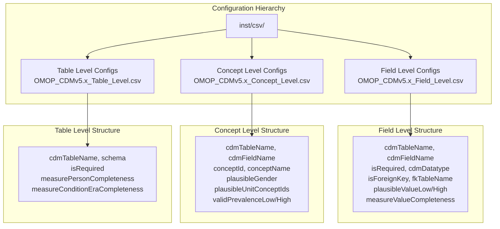

# Page: OMOP CDM Integration

# OMOP CDM Integration

Relevant source files

The following files were used as context for generating this wiki page:

- [inst/csv/OMOP_CDMv5.2_Concept_Level.csv](inst/csv/OMOP_CDMv5.2_Concept_Level.csv)
- [inst/csv/OMOP_CDMv5.2_Field_Level.csv](inst/csv/OMOP_CDMv5.2_Field_Level.csv)
- [inst/csv/OMOP_CDMv5.2_Table_Level.csv](inst/csv/OMOP_CDMv5.2_Table_Level.csv)
- [inst/csv/OMOP_CDMv5.3_Concept_Level.csv](inst/csv/OMOP_CDMv5.3_Concept_Level.csv)
- [inst/csv/OMOP_CDMv5.3_Field_Level.csv](inst/csv/OMOP_CDMv5.3_Field_Level.csv)
- [inst/csv/OMOP_CDMv5.3_Table_Level.csv](inst/csv/OMOP_CDMv5.3_Table_Level.csv)
- [inst/csv/OMOP_CDMv5.4_Concept_Level.csv](inst/csv/OMOP_CDMv5.4_Concept_Level.csv)
- [inst/csv/OMOP_CDMv5.4_Field_Level.csv](inst/csv/OMOP_CDMv5.4_Field_Level.csv)
- [inst/csv/OMOP_CDMv5.4_Table_Level.csv](inst/csv/OMOP_CDMv5.4_Table_Level.csv)
- [inst/sql/sql_server/concept_plausible_gender_use_descendants.sql](inst/sql/sql_server/concept_plausible_gender_use_descendants.sql)
- [inst/sql/sql_server/table_condition_era_completeness.sql](inst/sql/sql_server/table_condition_era_completeness.sql)

This page documents how the DataQualityDashboard integrates with different versions of the OMOP Common Data Model (CDM), including schema requirements, version support, and database configuration. For information about specific data quality check implementations, see [Check Implementation](#5). For details about the execution engine that orchestrates these integrations, see [Core Execution Engine](#3).

## OMOP CDM Version Support

The DataQualityDashboard supports multiple versions of the OMOP CDM through versioned configuration files that define the complete schema structure, validation rules, and quality checks for each version.

### Supported CDM Versions

**Version Evolution:**
- **CDM v5.2**: Original implementation with core tables and basic validation rules
- **CDM v5.3**: Added `VISIT_DETAIL` table and enhanced foreign key relationships  
- **CDM v5.4**: Latest version with expanded field definitions and updated validation thresholds

Sources: [inst/csv/OMOP_CDMv5.2_Field_Level.csv:1-10](), [inst/csv/OMOP_CDMv5.3_Field_Level.csv:1-10](), [inst/csv/OMOP_CDMv5.4_Field_Level.csv:1-10]()

## Schema Definition System

The schema definition system uses a three-tier approach to define complete OMOP CDM validation rules through CSV configuration files.

### Field-Level Definitions

Field-level definitions specify the structure, data types, and validation rules for every field in every OMOP CDM table:

| Configuration Aspect | Example Values | Purpose |
|---------------------|----------------|---------|
| `cdmTableName` | PERSON, CONDITION_OCCURRENCE | Identifies the OMOP table |
| `cdmFieldName` | person_id, condition_concept_id | Specifies the field name |
| `isRequired` | Yes/No | Mandatory field validation |
| `cdmDatatype` | integer, varchar(50), date | Data type enforcement |
| `isForeignKey` | Yes/No | Referential integrity |
| `fkTableName`, `fkFieldName` | CONCEPT, CONCEPT_ID | Foreign key target |

**Key Validation Parameters:**
- **Completeness**: `measureValueCompleteness`, `measureValueCompletenessThreshold`
- **Plausibility**: `plausibleValueLow`, `plausibleValueHigh` with thresholds
- **Temporal**: `plausibleAfterBirth`, `plausibleBeforeDeath`, `plausibleDuringLife`
- **Referential**: `isStandardValidConcept`, `fkDomain`, `fkClass`

Sources: [inst/csv/OMOP_CDMv5.4_Field_Level.csv:1-2]()

### Concept-Level Validations

**Gender-Specific Validation Example:**
For concept `26662` (Testicular hypofunction), the system validates that only male patients have this condition using `plausibleGender = Male` with a threshold of 5% allowable violations.

Sources: [inst/csv/OMOP_CDMv5.4_Concept_Level.csv:5-6](), [inst/sql/sql_server/concept_plausible_gender_use_descendants.sql:45-46]()

### Table-Level Requirements

Table-level definitions specify overall completeness and presence requirements:

| Table | Required | Person Completeness | Threshold | Special Checks |
|-------|----------|-------------------|-----------|----------------|
| `PERSON` | Yes | No | - | Core identity table |
| `OBSERVATION_PERIOD` | Yes | Yes | 0% | Must exist for all persons |
| `CONDITION_OCCURRENCE` | No | Yes | 95% | measureConditionEraCompleteness |
| `DRUG_EXPOSURE` | No | Yes | 95% | - |
| `VISIT_OCCURRENCE` | No | Yes | 95% | - |

Sources: [inst/csv/OMOP_CDMv5.4_Table_Level.csv:2-6](), [inst/sql/sql_server/table_condition_era_completeness.sql:17-24]()

## Database Integration Architecture

The system integrates with OMOP CDM databases through a parameterized SQL template system that adapts to different database schemas and configurations.

**Database Schema Requirements:**

1. **CDM Database Schema**: Contains the complete OMOP CDM tables with patient data
2. **Vocabulary Database Schema**: Contains OMOP standardized vocabularies (may be same as CDM schema)
3. **Results Database Schema**: Where data quality results are stored (may be same as CDM schema)
4. **Cohort Database Schema**: Optional schema for cohort-based analysis

Sources: [inst/sql/sql_server/concept_plausible_gender_use_descendants.sql:6-8](), [inst/sql/sql_server/table_condition_era_completeness.sql:32-38]()

## Configuration Management

The system uses a structured approach to manage different CDM versions and their associated validation rules.

### Configuration File Structure

**Configuration Loading Process:**

1. **Version Detection**: System determines CDM version from database or user input
2. **File Selection**: Loads appropriate CSV files for the detected version
3. **Schema Validation**: Validates that database schema matches CDM version requirements
4. **Check Generation**: Creates SQL templates using the loaded configuration
5. **Parameter Binding**: Binds database schema names and other parameters to templates

### Schema Evolution Handling

The system handles schema differences between CDM versions through conditional logic in configuration files:

**Version 5.3 Additions:**
- `VISIT_DETAIL` table added to table-level configurations
- Enhanced foreign key relationships in field-level definitions
- Additional concept-level validations for new clinical domains

**Version 5.4 Enhancements:**  
- Expanded field definitions with more granular validation thresholds
- Updated concept prevalence ranges based on real-world data
- Enhanced temporal validation rules

Sources: [inst/csv/OMOP_CDMv5.2_Table_Level.csv:1-24](), [inst/csv/OMOP_CDMv5.3_Table_Level.csv:10](), [inst/csv/OMOP_CDMv5.4_Table_Level.csv:19]()

## Integration Points

The OMOP CDM integration system provides several key integration points for the data quality assessment process:

### Schema Validation Integration
- **Field Validation**: Validates data types, nullability, and foreign key constraints
- **Concept Validation**: Ensures clinical concepts meet plausibility and prevalence requirements  
- **Table Validation**: Verifies table presence and completeness thresholds

### Parameterization System
- **Dynamic Schema Binding**: `@cdmDatabaseSchema`, `@vocabDatabaseSchema` parameters
- **Flexible Table Targeting**: `@cdmTableName`, `@cdmFieldName` substitution
- **Cohort Filtering**: Optional `@cohortDatabaseSchema`, `@cohortTableName` integration

### Version Compatibility
- **Backward Compatibility**: Supports legacy CDM v5.2 implementations
- **Forward Compatibility**: Ready for future CDM versions through extensible CSV structure
- **Cross-Version Analysis**: Enables comparison of data quality across different CDM versions

Sources: [inst/csv/OMOP_CDMv5.4_Field_Level.csv:30-47](), [inst/sql/sql_server/concept_plausible_gender_use_descendants.sql:40-44]()