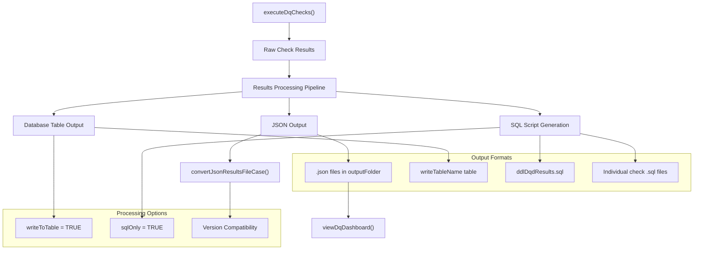
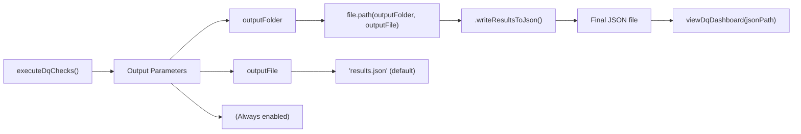
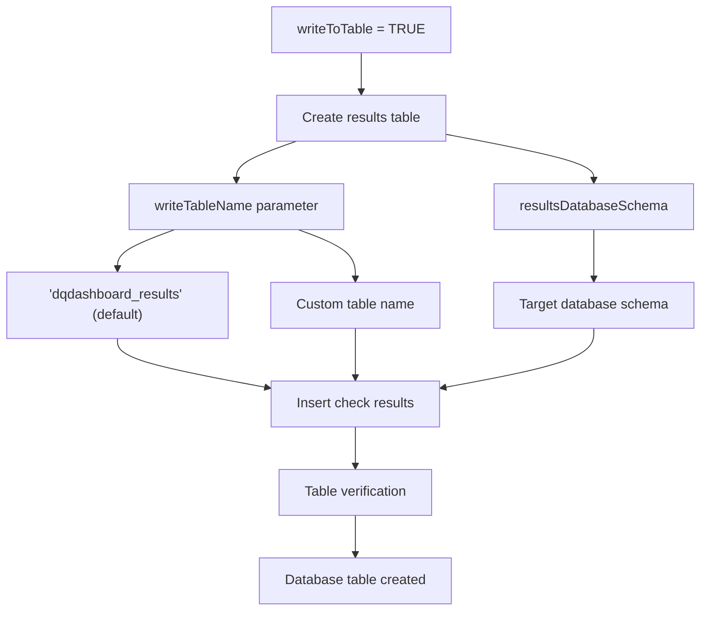
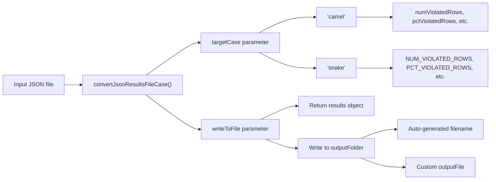
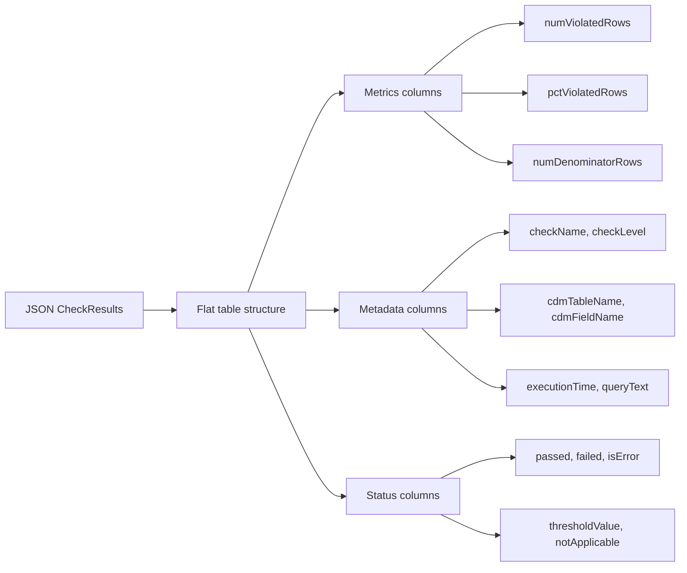
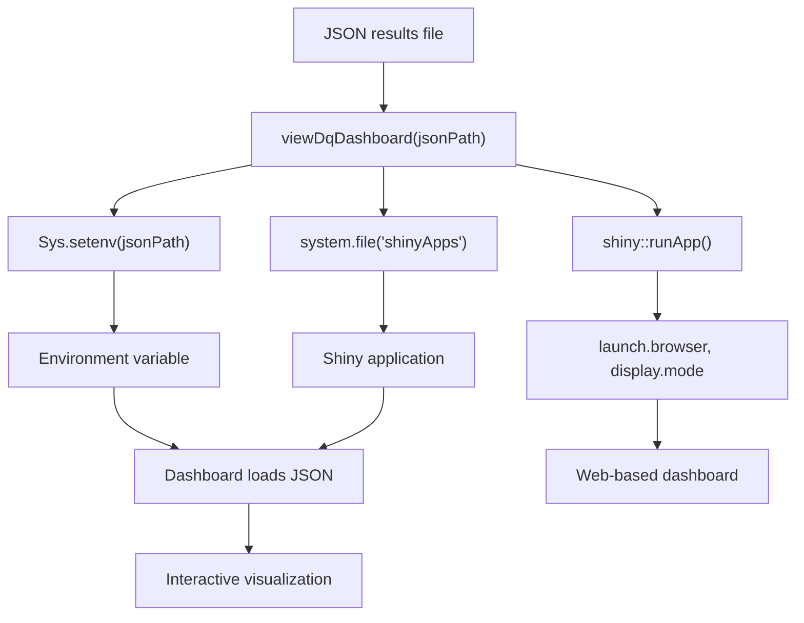

# Page: Output Formats and Export

# Output Formats and Export

<details>
<summary>Relevant source files</summary>

The following files were used as context for generating this wiki page:

- [R/convertResultsCase.R](R/convertResultsCase.R)
- [R/listChecks.R](R/listChecks.R)
- [R/readThresholdFile.R](R/readThresholdFile.R)
- [R/view.R](R/view.R)
- [man/convertJsonResultsFileCase.Rd](man/convertJsonResultsFileCase.Rd)
- [tests/testthat/test-convertResultsCase.R](tests/testthat/test-convertResultsCase.R)
- [tests/testthat/test-executeDqChecks.R](tests/testthat/test-executeDqChecks.R)

</details>


This page covers the various output formats available in the DataQualityDashboard package and utilities for exporting and converting results. The system provides multiple output formats to support different use cases: JSON for programmatic access and archival, database tables for integration with data warehouses, CSV for spreadsheet analysis, and SQL scripts for batch execution.

For information about how results are processed and status evaluation before export, see [Status Evaluation and Thresholds](#6.1). For details about viewing results in the interactive dashboard, see [Visualization and Dashboard](#7).

## Output Pipeline Architecture

The following diagram illustrates how the results processing system generates different output formats:



Sources: [tests/testthat/test-executeDqChecks.R:1-400](), [R/convertResultsCase.R:1-86](), [R/view.R:1-78]()

## JSON Output Format

JSON is the default output format for `executeDqChecks()`. The function writes results to a JSON file in the specified `outputFolder` with the filename controlled by the `outputFile` parameter.

### JSON Structure

The JSON output contains seven main sections:

| Section | Description |
|---------|-------------|
| `CheckResults` | Individual check results with metrics and status |
| `Metadata` | Execution metadata including timestamps and configuration |
| `Overview` | Summary statistics across all checks |
| `CheckSeverity` | Severity classification of failed checks |
| `CheckType` | Categorization by check type (Table, Field, Concept) |
| `CheckStatus` | Distribution of check statuses (Passed, Failed, etc.) |
| `executionTimeSeconds` | Total execution time for the run |

### JSON Configuration



Sources: [tests/testthat/test-executeDqChecks.R:5-22](), [tests/testthat/test-executeDqChecks.R:14-16](), [R/view.R:29-44]()

## Database Table Output

Results can be written directly to a database table by setting `writeToTable = TRUE`. This enables integration with existing data warehouse workflows and automated reporting systems.

### Database Output Configuration

| Parameter | Default | Description |
|-----------|---------|-------------|
| `writeToTable` | `FALSE` | Enable database table output |
| `writeTableName` | `"dqdashboard_results"` | Name of results table |
| `resultsDatabaseSchema` | Required | Schema for results table |

### Database Output Process



Sources: [tests/testthat/test-executeDqChecks.R:184-206](), [tests/testthat/test-executeDqChecks.R:196-198]()

## SQL Script Generation

The `sqlOnly = TRUE` mode generates SQL scripts instead of executing checks directly. This supports batch execution scenarios and environments where direct database execution is not possible.

### SQL Generation Modes

The system supports different SQL generation patterns controlled by the `sqlOnlyIncrementalInsert` parameter:

| Mode | Parameter Value | Output Pattern |
|------|----------------|----------------|
| Legacy | `sqlOnlyIncrementalInsert = FALSE` | Individual SQL files per check |
| Incremental | `sqlOnlyIncrementalInsert = TRUE` | Batch insert SQL with union operations |

### SQL Output Files

```mermaid
flowchart TD
    SQL_ONLY["sqlOnly = TRUE"] --> DDL_GEN["Generate DDL"]
    SQL_ONLY --> CHECK_GEN ["Generate Check SQL"]
    
    DDL_GEN --> DDL_FILE["ddlDqdResults.sql"]
    
    CHECK_GEN --> INCR_MODE{"sqlOnlyIncrementalInsert?"}
    
    INCR_MODE -->|TRUE| BATCH_FILES["Batched SQL files"]
    INCR_MODE -->|FALSE| INDIVIDUAL_FILES["Individual SQL files"]
    
    BATCH_FILES --> UNION_COUNT["sqlOnlyUnionCount parameter"]
    BATCH_FILES --> TABLE_FILES["TABLE_checkName.sql"]
    BATCH_FILES --> FIELD_FILES["FIELD_checkName.sql"]
    BATCH_FILES --> CONCEPT_FILES["CONCEPT_checkName.sql"]
    
    INDIVIDUAL_FILES --> SINGLE_FILES["checkName.sql"]
    
    UNION_COUNT --> BATCH_SIZE["Controls queries per file"]
```

Sources: [tests/testthat/test-executeDqChecks.R:208-235](), [tests/testthat/test-executeDqChecks.R:237-264](), [tests/testthat/test-executeDqChecks.R:295-330]()

## Case Conversion Utilities

The `convertJsonResultsFileCase()` function provides compatibility between different versions of DataQualityDashboard by converting JSON results between camelCase and SNAKE_CASE naming conventions.

### Case Conversion Function



### Conversion Examples

The function handles the following column name transformations:

| camelCase | SNAKE_CASE |
|-----------|------------|
| `numViolatedRows` | `NUM_VIOLATED_ROWS` |
| `pctViolatedRows` | `PCT_VIOLATED_ROWS` |
| `numDenominatorRows` | `NUM_DENOMINATOR_ROWS` |
| `executionTime` | `EXECUTION_TIME` |
| `checkName` | `CHECK_NAME` |
| `cdmTableName` | `CDM_TABLE_NAME` |

Sources: [R/convertResultsCase.R:37-85](), [tests/testthat/test-convertResultsCase.R:26-51]()

## CSV Export Support

While not directly implemented in the core `executeDqChecks()` function, the system supports CSV output through the JSON-to-CSV conversion capabilities. The results structure is designed to be easily flattened into tabular format.

### CSV-Compatible Structure

The `CheckResults` section of the JSON output contains a flat structure suitable for CSV export:



Sources: [tests/testthat/test-convertResultsCase.R:27-28](), [tests/testthat/test-convertResultsCase.R:39-40]()

## Integration with Visualization

The JSON output format is specifically designed to integrate with the Shiny dashboard through the `viewDqDashboard()` function:



Sources: [R/view.R:29-44](), [R/view.R:32-33]()