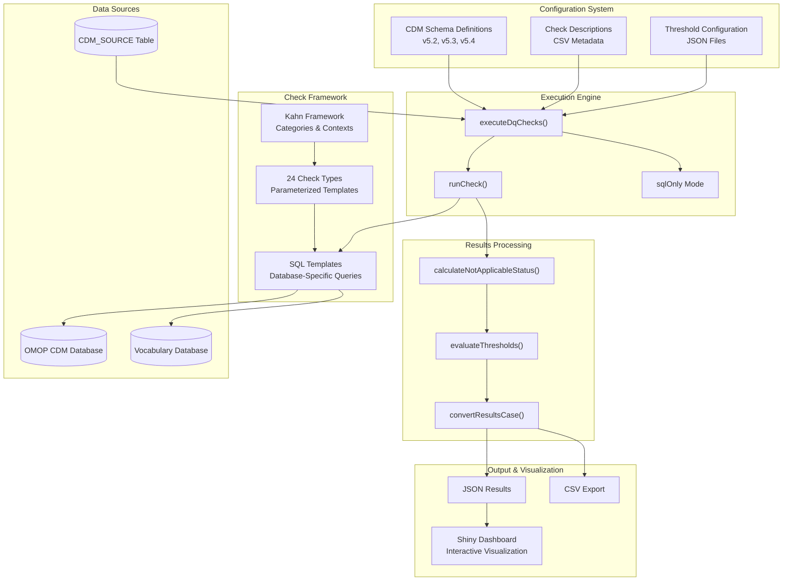
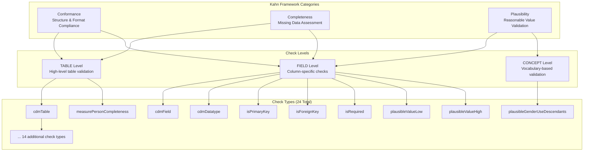
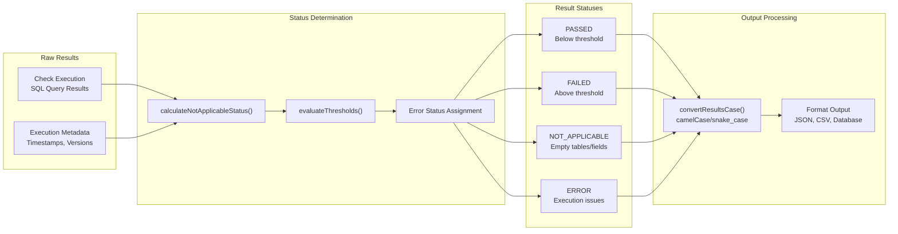

# Page: Overview

# Overview

<details>
<summary>Relevant source files</summary>

The following files were used as context for generating this wiki page:

- [.github/workflows/R_CMD_check_Hades.yml](.github/workflows/R_CMD_check_Hades.yml)
- [.github/workflows/R_CMD_check_main_weekly.yaml](.github/workflows/R_CMD_check_main_weekly.yaml)
- [README.md](README.md)
- [docs/404.html](docs/404.html)
- [docs/index.html](docs/index.html)

</details>


This document provides a comprehensive introduction to the DataQualityDashboard R package, its architecture, and core functionality for assessing data quality in OMOP Common Data Model (CDM) databases. 

For specific implementation details of check types, see [Check Types and Categories](#4.1). For detailed usage instructions, see [Getting Started](#2).

## System Purpose

DataQualityDashboard is an R package designed to systematically evaluate data quality in OMOP CDM instances. The system runs comprehensive data quality assessments using the Kahn Framework, which organizes checks into categories of Conformance, Completeness, and Plausibility across table, field, and concept levels.

The package supports OMOP CDM versions 5.2, 5.3, and 5.4, executing approximately 4,000 individual data quality checks through 24 parameterized check types. Results are evaluated against configurable thresholds and presented through an interactive Shiny dashboard.

**Sources:** [README.md:11-16](), [README.md:21-37]()

## High-Level System Architecture

The DataQualityDashboard system consists of several interconnected components that work together to assess, process, and visualize data quality results:



**System Architecture Overview**

The system follows a layered architecture where the `executeDqChecks` function serves as the main orchestrator, coordinating between configuration management, check execution, and results processing components.

**Sources:** [README.md:23-37](), system diagrams provided

## Core Components

### Execution Engine

| Component | Function | Purpose |
|-----------|----------|---------|
| `executeDqChecks` | Main orchestrator | Coordinates entire data quality assessment process |
| `runCheck` | Individual check executor | Executes single data quality checks against database |
| `sqlOnly` mode | SQL generation | Produces SQL scripts without executing against database |

The execution engine supports multiple operational modes including live database execution, SQL-only script generation, and incremental result insertion for batch processing scenarios.

### Configuration Management

The system uses a multi-layered configuration approach:

- **CDM Schema Definitions**: Version-specific schema metadata for OMOP CDM v5.2, v5.3, and v5.4
- **Check Descriptions**: CSV files containing metadata for each check type
- **Threshold Configuration**: JSON files specifying pass/fail thresholds at table, field, and concept levels

### Data Quality Framework

The system implements the Kahn Framework for systematic data quality assessment:



**Data Quality Check Organization**

The framework organizes checks systematically rather than as individual ad-hoc validations, enabling comprehensive coverage through parameterized templates.

**Sources:** [README.md:21-35](), [docs/index.html:205-212]()

## Check Type System

### Parameterized Check Templates

The system uses 24 parameterized check types that generate approximately 4,000 individual checks. Each check type follows a template pattern where parameters are substituted to create specific validations:

**Example Template:**
```
The number and percent of records with a value in the **cdmFieldName** field 
of the **cdmTableName** table less than **plausibleValueLow**.
```

**Applied to PERSON.YEAR_OF_BIRTH:**
```
The number and percent of records with a value in the **year_of_birth** field 
of the **PERSON** table less than **1850**.
```

### Check Level Distribution

| Level | Description | Example Checks |
|-------|-------------|----------------|
| **TABLE** | High-level table validation | `cdmTable`, `measurePersonCompleteness` |
| **FIELD** | Column-specific validation | `cdmDatatype`, `isRequired`, `plausibleValueLow` |
| **CONCEPT** | Vocabulary-based validation | `plausibleGenderUseDescendants`, `plausibleUnitConceptIds` |

**Sources:** [README.md:23-35](), [docs/index.html:206-212]()

## Results Processing Pipeline

The system processes check results through a multi-stage pipeline:



**Results Processing Flow**

The pipeline ensures consistent status determination and flexible output formatting to support various consumption patterns.

**Sources:** System diagrams provided, [README.md:37]()

## Database Requirements

The system requires proper configuration of the `CDM_SOURCE` table with specific metadata fields:

| Field | Purpose | Example |
|-------|---------|---------|
| `cdm_version` | CDM version identification | "5.4" |
| `cdm_source_name` | Descriptive database name | "MyHospital_CDM_2024" |
| `vocabulary_version` | Vocabulary version used | "v5.0 20-NOV-23" |

**Sources:** [README.md:49-67]()

## Output and Visualization

The system produces multiple output formats:

- **JSON Results**: Default structured output format
- **CSV Export**: Tabular format for external analysis  
- **Database Tables**: Direct insertion into results schemas
- **Shiny Dashboard**: Interactive web-based visualization

The Shiny dashboard provides comprehensive result exploration, filtering, and drill-down capabilities for data quality assessment workflows.

**Sources:** [README.md:37-41](), [docs/index.html:213-214]()