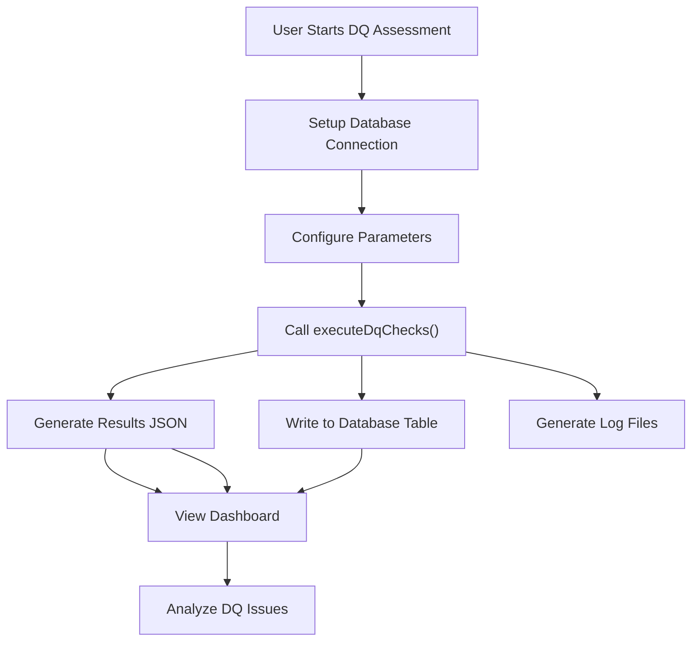
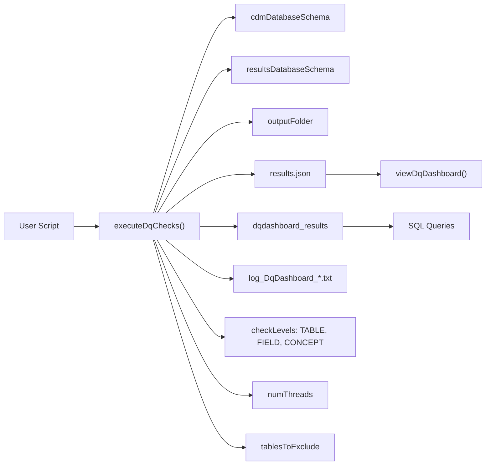
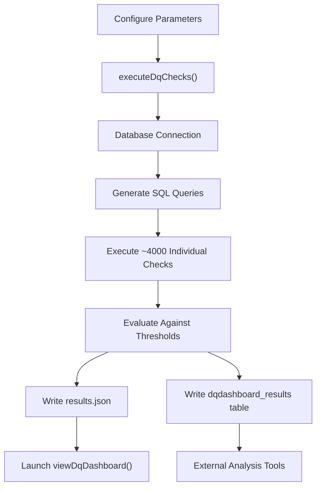

# Page: Quick Start Guide

# Quick Start Guide

<details>
<summary>Relevant source files</summary>

The following files were used as context for generating this wiki page:

- [docs/LICENSE-text.html](docs/LICENSE-text.html)
- [docs/authors.html](docs/authors.html)
- [docs/reference/executeDqChecks.html](docs/reference/executeDqChecks.html)
- [docs/reference/index.html](docs/reference/index.html)
- [docs/reference/viewDqDashboard.html](docs/reference/viewDqDashboard.html)
- [docs/reference/writeJsonResultsToTable.html](docs/reference/writeJsonResultsToTable.html)
- [extras/codeToRun.R](extras/codeToRun.R)

</details>


This document provides a step-by-step walkthrough for running your first data quality assessment using the DataQualityDashboard package. It covers the essential setup, configuration, and execution steps needed to generate data quality results for an OMOP CDM database.

For detailed information about installation and dependencies, see [Installation and Setup](#2.1). For comprehensive documentation of all execution parameters and advanced features, see [Core Execution Engine](#3).

## Overview

The DataQualityDashboard package evaluates OMOP CDM databases against standardized data quality checks organized into three levels: TABLE, FIELD, and CONCEPT. This guide demonstrates the basic workflow using the main `executeDqChecks` function and viewing results through the interactive dashboard.

## Basic Workflow

The following diagram illustrates the essential steps in the data quality assessment process:



**Sources:** [extras/codeToRun.R:1-131]()

## Required Configuration

### Database Connection Setup

The first step involves creating a database connection using the `DatabaseConnector` package:

```r
library(DataQualityDashboard)
library(DatabaseConnector)

connectionDetails <- DatabaseConnector::createConnectionDetails(
  dbms = "postgresql",          # Your database management system
  user = "username",            # Database username
  password = "password",        # Database password
  server = "server/database",   # Server and database name
  port = 5432,                  # Database port
  pathToDriver = "/path/to/driver"
)
```

### Essential Parameters

These parameters must be configured for every data quality assessment:

| Parameter | Description | Example |
|-----------|-------------|---------|
| `cdmDatabaseSchema` | Fully qualified CDM schema name | `"cdm_schema"` |
| `resultsDatabaseSchema` | Schema for writing results | `"results_schema"` |
| `cdmSourceName` | Human-readable name for your CDM | `"My Hospital CDM"` |
| `cdmVersion` | CDM version (5.2, 5.3, or 5.4) | `"5.4"` |
| `outputFolder` | Directory for output files | `"output"` |

**Sources:** [extras/codeToRun.R:21-35]()

## Core Execution Function

The following diagram shows the key code entities involved in executing data quality checks:



**Sources:** [extras/codeToRun.R:102-119](), [docs/reference/executeDqChecks.html:172-201]()

## Minimal Working Example

Here is the simplest configuration to run data quality checks:

```r
# Basic execution with required parameters only
DataQualityDashboard::executeDqChecks(
  connectionDetails = connectionDetails,
  cdmDatabaseSchema = "my_cdm_schema",
  resultsDatabaseSchema = "my_results_schema", 
  cdmSourceName = "My CDM Source",
  cdmVersion = "5.4",
  outputFolder = "output"
)
```

This will:
- Run all check levels (TABLE, FIELD, CONCEPT)
- Use single-threaded execution (`numThreads = 1`)
- Write results to `dqdashboard_results` table
- Generate `results.json` in the output folder
- Exclude vocabulary tables by default

**Sources:** [extras/codeToRun.R:102-119]()

## Common Configuration Options

### Parallel Execution

For faster execution on larger databases:

```r
numThreads <- 3  # Adjust based on your database capacity
```

### Selective Check Execution

To run only specific check levels:

```r
checkLevels <- c("TABLE", "FIELD")  # Skip concept-level checks
```

To exclude additional tables:

```r
tablesToExclude <- c("CONCEPT", "VOCABULARY", "CONCEPT_ANCESTOR", 
                     "CONCEPT_RELATIONSHIP", "CONCEPT_CLASS", 
                     "CONCEPT_SYNONYM", "RELATIONSHIP", "DOMAIN",
                     "NOTE")  # Add custom exclusions
```

### Output Options

```r
verboseMode <- TRUE        # Show detailed execution progress
writeToTable <- TRUE       # Write to database table
writeToCsv <- FALSE        # Skip CSV export
outputFile <- "results.json"  # JSON results filename
```

**Sources:** [extras/codeToRun.R:36-71]()

## Execution and Results

### Running the Assessment

The complete execution pattern follows this structure:



**Sources:** [extras/codeToRun.R:102-119]()

### Viewing Results

After execution completes, launch the interactive dashboard:

```r
# View the dashboard
DataQualityDashboard::viewDqDashboard("output/results.json")
```

### Log Analysis

Check execution logs for any issues:

```r
# Launch log viewer
ParallelLogger::launchLogViewer(
  logFileName = file.path("output", 
                         sprintf("log_DqDashboard_%s.txt", cdmSourceName))
)
```

**Sources:** [extras/codeToRun.R:122-123](), [docs/reference/viewDqDashboard.html:172-192]()

## Understanding Results

The data quality assessment generates results with four possible statuses:

| Status | Meaning | Action Required |
|--------|---------|-----------------|
| `PASSED` | Check passed threshold | None |
| `FAILED` | Check failed threshold | Investigation needed |
| `NOT_APPLICABLE` | No data to evaluate | Expected for empty tables/fields |
| `ERROR` | SQL execution failed | Technical issue to resolve |

Results are organized by:
- **Check Level**: TABLE, FIELD, or CONCEPT
- **Check Category**: Conformance, Completeness, or Plausibility  
- **Severity**: Fatal, Convention, or Characterization

**Sources:** [docs/reference/executeDqChecks.html:315-320]()

## Next Steps

After completing your first data quality assessment:

1. **Analyze Results**: Use the dashboard to identify the most critical data quality issues
2. **Customize Thresholds**: Adjust failure thresholds based on your data quality requirements
3. **Focus Areas**: Run targeted assessments on specific tables or check types
4. **Advanced Features**: Explore cohort-based analysis and custom check development

For advanced configuration options, see [Core Execution Engine](#3). For dashboard usage details, see [Visualization and Dashboard](#7). For cohort-specific analysis, see [Cohort-Based Analysis](#8.1).