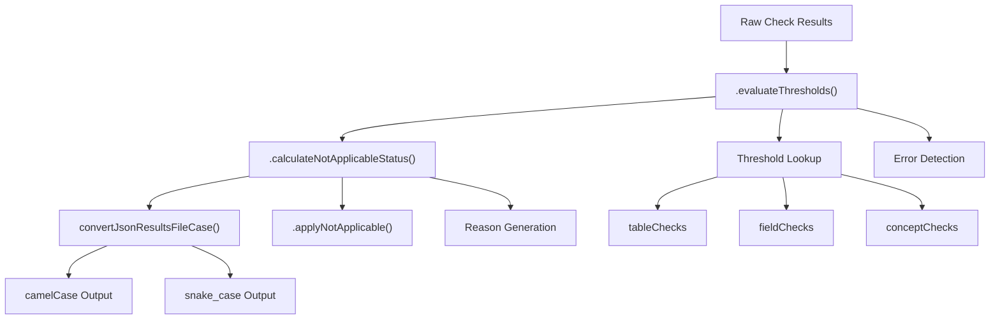
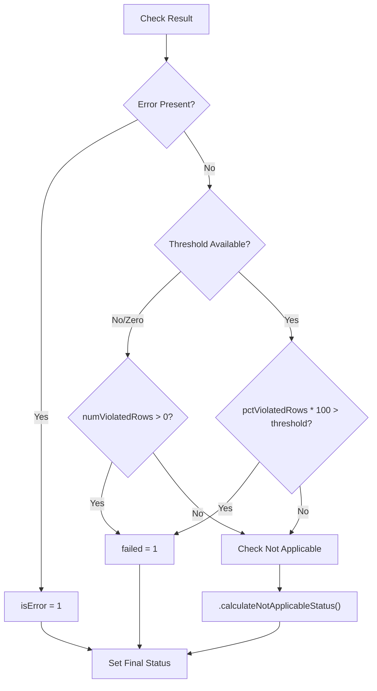
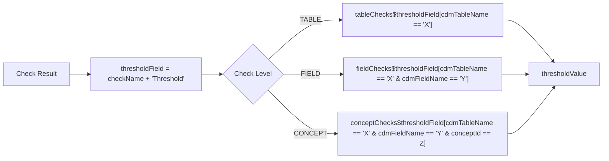
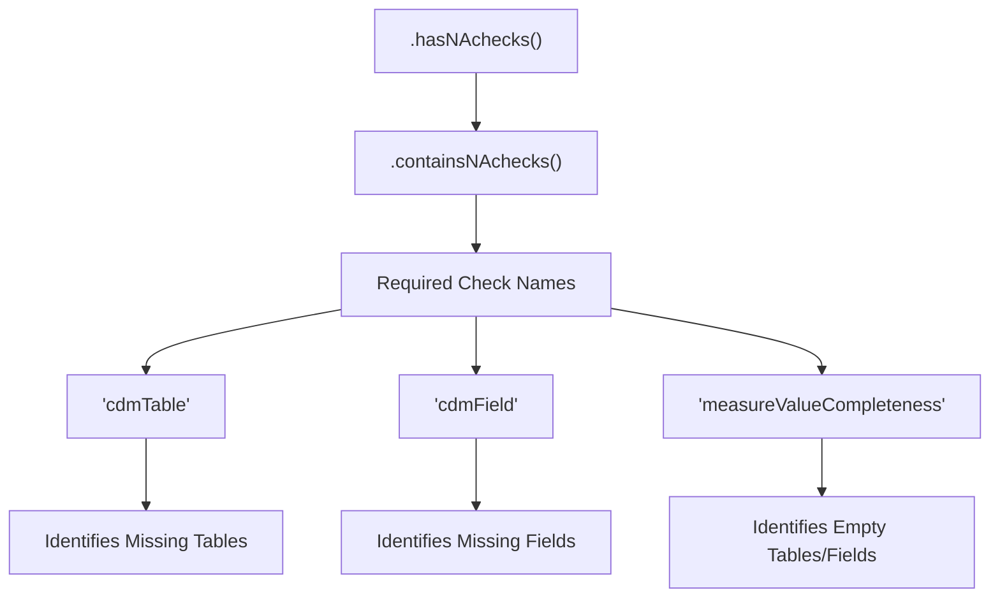
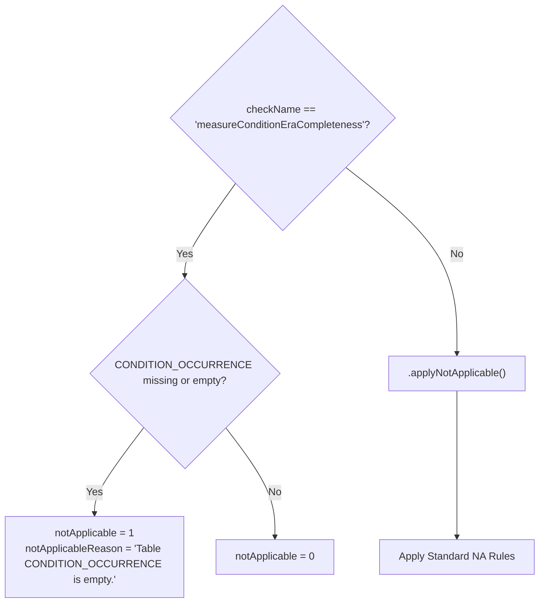
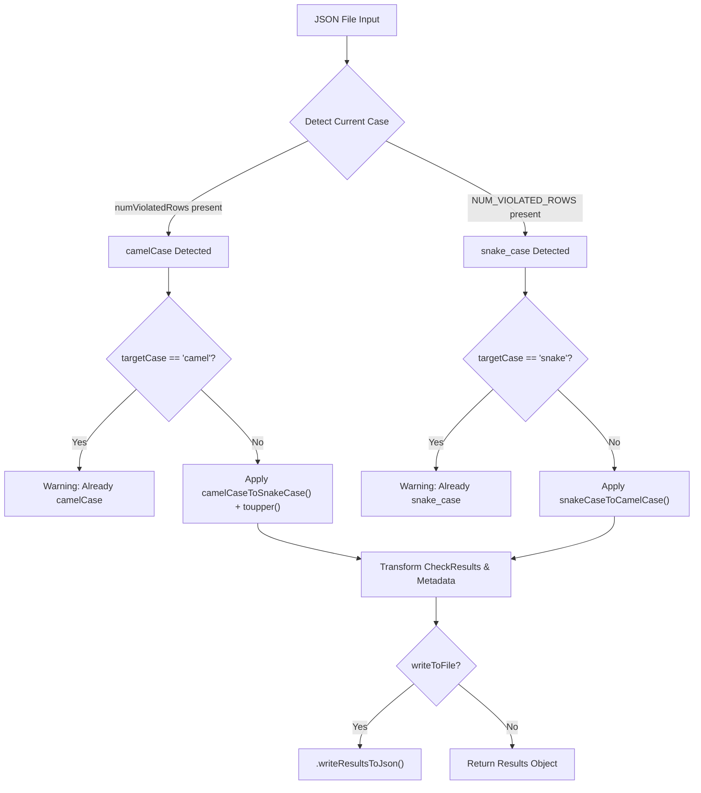

# Page: Results Processing

# Results Processing

Relevant source files

The following files were used as context for generating this wiki page:

- [R/calculateNotApplicableStatus.R](R/calculateNotApplicableStatus.R)
- [R/convertResultsCase.R](R/convertResultsCase.R)
- [R/evaluateThresholds.R](R/evaluateThresholds.R)
- [man/convertJsonResultsFileCase.Rd](man/convertJsonResultsFileCase.Rd)
- [tests/testthat/test-convertResultsCase.R](tests/testthat/test-convertResultsCase.R)
- [tests/testthat/test-executeDqChecks.R](tests/testthat/test-executeDqChecks.R)

This document covers the results processing subsystem of the DataQualityDashboard, which handles the transformation of raw check execution results into final status determinations. This includes threshold evaluation, status assignment logic, and output format conversion utilities.

For information about the actual execution of data quality checks, see [Core Execution Engine](#3). For details on output formats and visualization, see [Output Formats and Export](#6.2).

## Results Processing Pipeline

The results processing system transforms raw check execution data through several stages to produce final status determinations and formatted output. The pipeline consists of three main phases: threshold evaluation, status calculation, and format conversion.

Sources: [R/evaluateThresholds.R:26-171](), [R/calculateNotApplicableStatus.R:78-195](), [R/convertResultsCase.R:37-85]()

## Status Determination Logic

The system assigns one of four possible statuses to each check result: `Passed`, `Failed`, `Not Applicable`, or `Error`. The status determination follows a strict precedence hierarchy implemented in the `.evaluateThresholds()` function.

### Status Precedence

| Status | Precedence | Condition |
|--------|------------|-----------|
| `Error` | 1 (Highest) | `!is.na(checkResults$error)` |
| `Not Applicable` | 2 | Determined by `.calculateNotApplicableStatus()` |
| `Failed` | 3 | `pctViolatedRows * 100 > thresholdValue` |
| `Passed` | 4 (Default) | All other cases |

Sources: [R/evaluateThresholds.R:154-164](), [R/evaluateThresholds.R:166-168]()

## Threshold Evaluation System

The `.evaluateThresholds()` function matches check results against configuration thresholds stored in separate dataframes for each check level. The threshold lookup mechanism uses dynamic field name construction and conditional filtering.

### Threshold Field Resolution

The system constructs threshold field names using the pattern `{checkName}Threshold` and looks up values based on the check level:

Sources: [R/evaluateThresholds.R:39-40](), [R/evaluateThresholds.R:56-79](), [R/evaluateThresholds.R:80-144]()

## Not Applicable Status Calculation

The `.calculateNotApplicableStatus()` function implements complex logic to determine when checks should be marked as "Not Applicable" based on missing tables, fields, or empty data conditions.

### Required Dependencies

The Not Applicable status calculation requires specific checks to be present in the results:

Sources: [R/calculateNotApplicableStatus.R:22-39](), [R/calculateNotApplicableStatus.R:32-38]()

### Not Applicable Logic Matrix

The `.applyNotApplicable()` function applies different rules based on check names and data conditions:

| Condition | Check Names | Action |
|-----------|-------------|--------|
| `isError == 1` | All | Return 0 (Not NA) |
| Missing table/field | `cdmTable`, `cdmField` | Return 0 (Not NA) |
| `tableIsMissing`, `fieldIsMissing`, `tableIsEmpty` | Others | Return 1 (NA) |
| Empty table | `measureValueCompleteness` | Return 0 (Not NA) |
| `fieldIsEmpty`, `conceptIsMissing` | Others | Return 1 (NA) |

Sources: [R/calculateNotApplicableStatus.R:46-71]()

### Special Case: Condition Era Completeness

The system includes special handling for `measureConditionEraCompleteness` checks that depend on the `CONDITION_OCCURRENCE` table:

Sources: [R/calculateNotApplicableStatus.R:161-171]()

## Case Conversion Utilities

The `convertJsonResultsFileCase()` function provides bidirectional conversion between camelCase and snake_case (all-caps) formats for backward compatibility with different DQD versions.

### Conversion Process

Sources: [R/convertResultsCase.R:56-63](), [R/convertResultsCase.R:65-71](), [R/convertResultsCase.R:73-74]()

### Protected Fields

The conversion process preserves certain fields that should not be transformed:

- `checkId` field is excluded from case conversion using `dplyr::rename_with(..., -c("checkId"))`

Sources: [R/convertResultsCase.R:74]()

## Results Data Structure

The processed results maintain a standardized structure across all output formats:

### Core Result Fields

| Field | Type | Description |
|-------|------|-------------|
| `numViolatedRows` | Integer | Count of rows violating the check |
| `pctViolatedRows` | Numeric | Percentage of rows violating the check |
| `numDenominatorRows` | Integer | Total rows evaluated |
| `executionTime` | Numeric | Check execution time in seconds |
| `queryText` | String | SQL query executed |
| `failed` | Integer | 1 if check failed, 0 otherwise |
| `passed` | Integer | 1 if check passed, 0 otherwise |
| `isError` | Integer | 1 if execution error occurred |
| `notApplicable` | Integer | 1 if check not applicable |
| `thresholdValue` | Numeric | Threshold used for evaluation |

Sources: [tests/testthat/test-convertResultsCase.R:27-28](), [tests/testthat/test-convertResultsCase.R:39]()