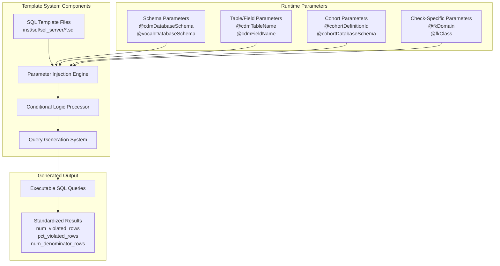
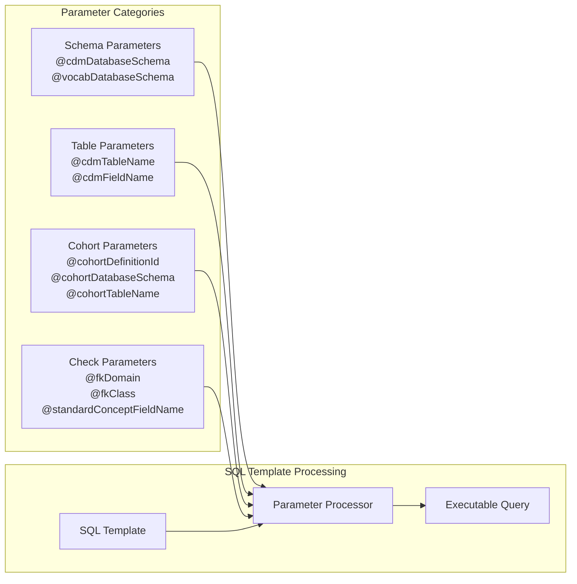
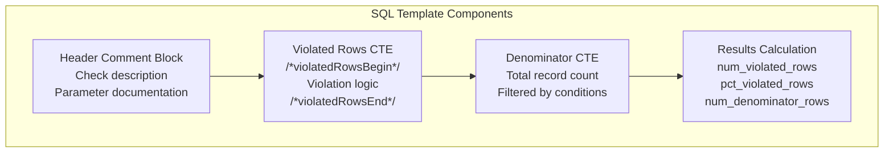
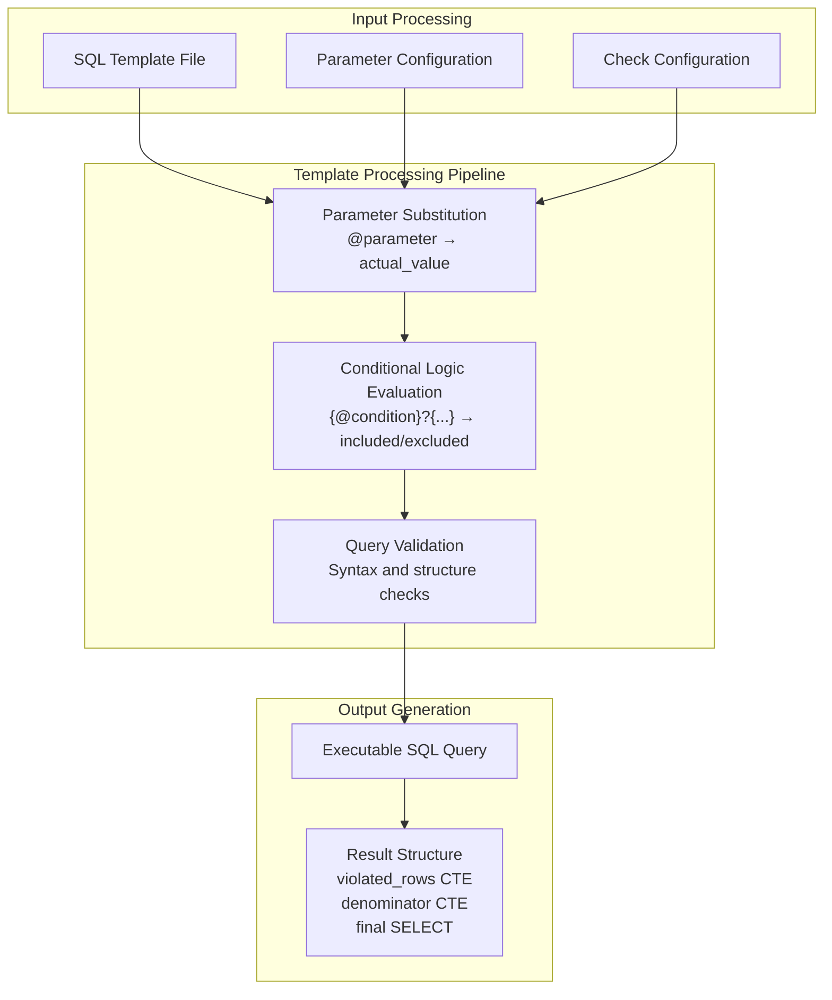

# Page: SQL Templates and Parameterization

# SQL Templates and Parameterization

<details>
<summary>Relevant source files</summary>

The following files were used as context for generating this wiki page:

- [.gitignore](.gitignore)
- [inst/sql/sql_server/field_concept_record_completeness.sql](inst/sql/sql_server/field_concept_record_completeness.sql)
- [inst/sql/sql_server/field_fk_class.sql](inst/sql/sql_server/field_fk_class.sql)
- [inst/sql/sql_server/field_fk_domain.sql](inst/sql/sql_server/field_fk_domain.sql)
- [inst/sql/sql_server/field_measure_value_completeness.sql](inst/sql/sql_server/field_measure_value_completeness.sql)
- [inst/sql/sql_server/field_plausible_after_birth.sql](inst/sql/sql_server/field_plausible_after_birth.sql)
- [inst/sql/sql_server/field_plausible_before_death.sql](inst/sql/sql_server/field_plausible_before_death.sql)
- [inst/sql/sql_server/field_plausible_start_before_end.sql](inst/sql/sql_server/field_plausible_start_before_end.sql)
- [inst/sql/sql_server/field_source_value_completeness.sql](inst/sql/sql_server/field_source_value_completeness.sql)

</details>


This section covers the SQL template system that powers the DataQualityDashboard's data quality check execution. The template system provides parameterized SQL queries that are dynamically generated based on check configuration, database schema information, and runtime parameters. For information about the specific check implementations that use these templates, see [Table Level Checks](#5.1), [Field Level Checks](#5.2), and [Concept Level Checks](#5.3).

## SQL Template Architecture

The DataQualityDashboard uses a sophisticated SQL template system built on parameterized queries that can be dynamically configured for different OMOP CDM schemas, tables, fields, and cohorts. All SQL templates are stored in the `inst/sql/sql_server/` directory and follow a standardized structure for consistency and maintainability.



Sources: [inst/sql/sql_server/field_fk_domain.sql:1-59](), [inst/sql/sql_server/field_fk_class.sql:1-61](), [inst/sql/sql_server/field_concept_record_completeness.sql:1-52]()

## Parameter Injection System

The template system uses a standardized parameter injection approach where placeholders in the SQL templates are replaced with actual values at runtime. Parameters are prefixed with `@` and follow a consistent naming convention.

### Core Parameter Types

| Parameter Category | Examples | Purpose |
|-------------------|----------|---------|
| Schema Parameters | `@cdmDatabaseSchema`, `@vocabDatabaseSchema` | Database schema references |
| Table/Field Parameters | `@cdmTableName`, `@cdmFieldName` | OMOP CDM table and field names |
| Cohort Parameters | `@cohortDefinitionId`, `@cohortDatabaseSchema`, `@cohortTableName` | Cohort filtering configuration |
| Check-Specific Parameters | `@fkDomain`, `@fkClass`, `@standardConceptFieldName` | Parameters specific to individual check types |



Sources: [inst/sql/sql_server/field_fk_domain.sql:7-17](), [inst/sql/sql_server/field_source_value_completeness.sql:5-14](), [inst/sql/sql_server/field_plausible_after_birth.sql:7-15]()

## Template Structure and Patterns

All SQL templates follow a standardized structure that ensures consistent results and maintainable code. Each template includes a header comment block documenting the check purpose and required parameters, followed by a standardized query structure.

### Standard Template Structure

1. **Header Comment Block**: Documents check purpose and parameters
2. **Parameter Documentation**: Lists all required parameters with examples
3. **Main Query Structure**: Standardized CTE pattern with violated rows and denominator calculations
4. **Violated Rows Section**: Marked with `/*violatedRowsBegin*/` and `/*violatedRowsEnd*/` comments
5. **Results Calculation**: Standard format returning `num_violated_rows`, `pct_violated_rows`, `num_denominator_rows`



Sources: [inst/sql/sql_server/field_measure_value_completeness.sql:1-56](), [inst/sql/sql_server/field_plausible_before_death.sql:1-63]()

## Conditional Logic System

The template system includes sophisticated conditional logic that allows templates to adapt their behavior based on runtime parameters and check configuration. This is particularly important for cohort filtering and check-specific logic.

### Cohort Filtering Logic

The most common conditional logic pattern handles optional cohort filtering using the syntax `{@cohort & '@runForCohort' == 'Yes'}?{...}`. When cohort filtering is enabled, additional JOIN clauses are inserted to limit the analysis to specific patient populations.

**Without Cohort Filtering:**
```sql
FROM @cdmDatabaseSchema.@cdmTableName cdmTable
WHERE cdmTable.@cdmFieldName IS NULL
```

**With Cohort Filtering:**
```sql
FROM @cdmDatabaseSchema.@cdmTableName cdmTable
JOIN @cohortDatabaseSchema.@cohortTableName c 
    ON cdmTable.person_id = c.subject_id
    AND c.cohort_definition_id = @cohortDefinitionId
WHERE cdmTable.@cdmFieldName IS NULL
```

### Check-Specific Conditional Logic

Some templates include conditional logic specific to certain field types or tables. For example, unit concept completeness checks have special handling for measurement and observation tables:

```sql
{@cdmFieldName == 'UNIT_CONCEPT_ID' & (@cdmTableName == 'MEASUREMENT' | @cdmTableName == 'OBSERVATION')}?{
    AND cdmTable.value_as_number IS NOT NULL
}
```

Sources: [inst/sql/sql_server/field_concept_record_completeness.sql:32-49](), [inst/sql/sql_server/field_measure_value_completeness.sql:36-53](), [inst/sql/sql_server/field_plausible_after_birth.sql:37-70]()

## Query Generation Process

The template system generates executable SQL queries through a multi-step process that handles parameter substitution, conditional logic evaluation, and query validation.



Sources: [inst/sql/sql_server/field_fk_class.sql:20-61](), [inst/sql/sql_server/field_plausible_start_before_end.sql:19-61]()

## Results Standardization

All SQL templates produce results in a standardized format that enables consistent processing and threshold evaluation across different check types. The standard result structure includes three key metrics:

| Column | Type | Description |
|--------|------|-------------|
| `num_violated_rows` | INTEGER | Count of records that violate the data quality rule |
| `pct_violated_rows` | DECIMAL | Percentage of records that violate the rule (0.0 to 1.0) |
| `num_denominator_rows` | INTEGER | Total count of records evaluated by the check |

### Percentage Calculation Logic

The templates include standardized logic to handle edge cases in percentage calculations:

```sql
CASE 
    WHEN denominator.num_rows = 0 THEN 0 
    ELSE 1.0*num_violated_rows/denominator.num_rows 
END AS pct_violated_rows
```

This ensures that when the denominator is zero (no applicable records), the violation percentage is set to 0 rather than causing a division by zero error.

Sources: [inst/sql/sql_server/field_source_value_completeness.sql:17-22](), [inst/sql/sql_server/field_fk_domain.sql:20-26](), [inst/sql/sql_server/field_plausible_before_death.sql:19-25]()