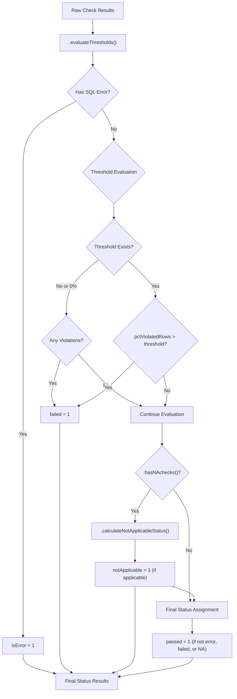
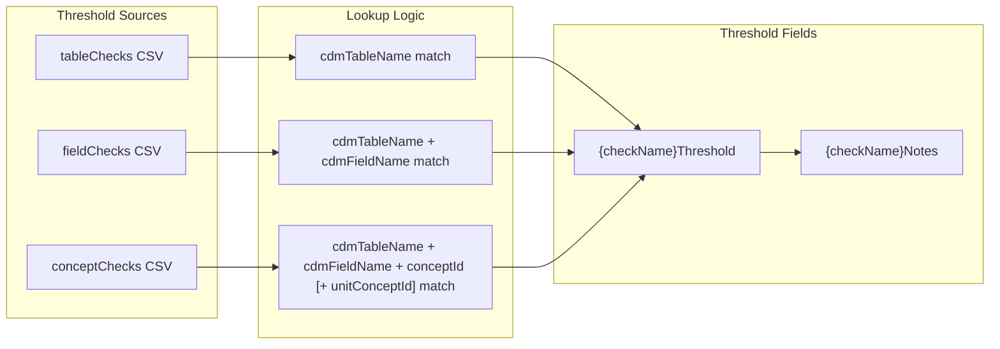
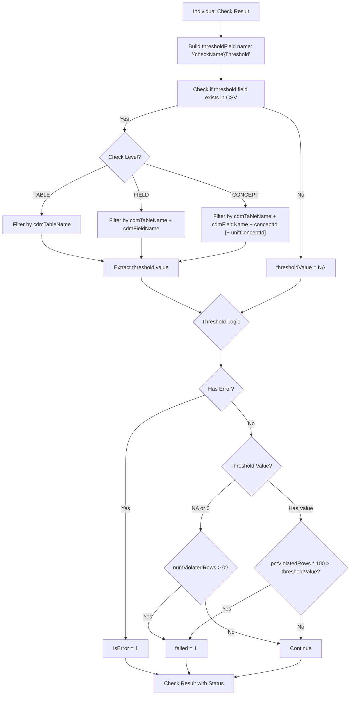
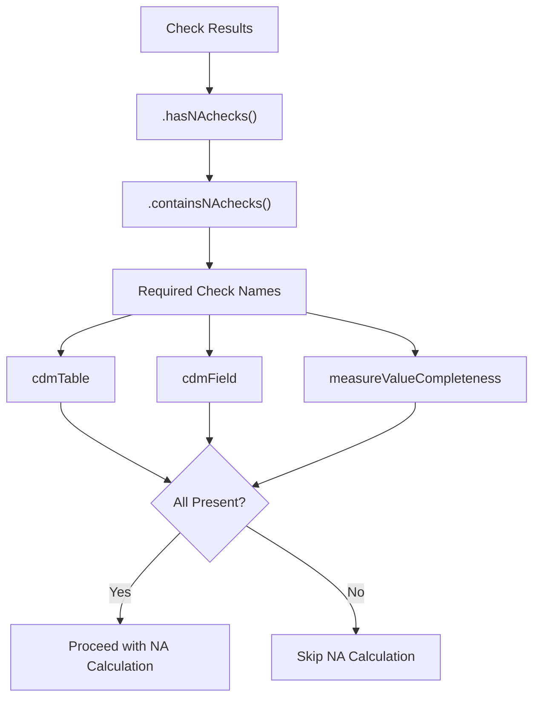
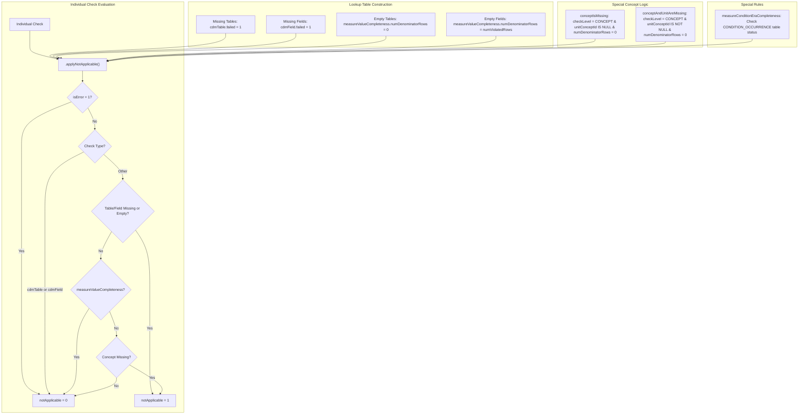
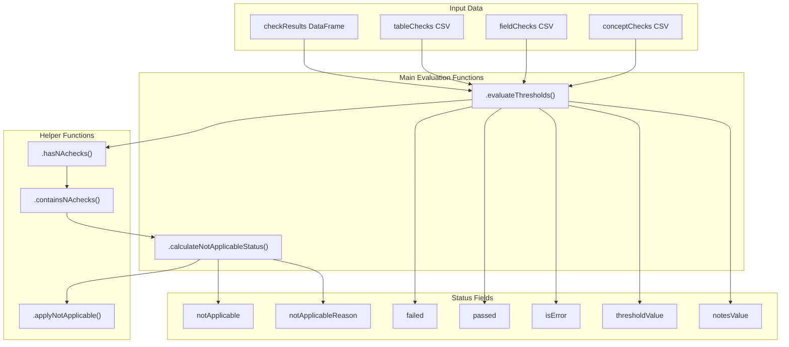
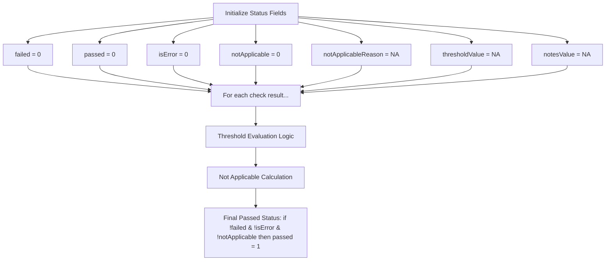
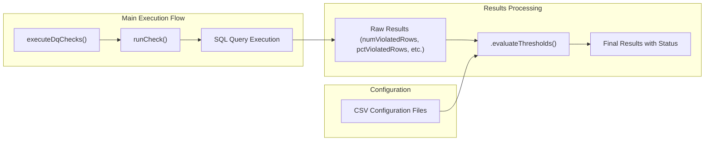

# Page: Status Evaluation and Thresholds

# Status Evaluation and Thresholds

Relevant source files

The following files were used as context for generating this wiki page:

- [R/calculateNotApplicableStatus.R](R/calculateNotApplicableStatus.R)
- [R/evaluateThresholds.R](R/evaluateThresholds.R)
- [docs/articles/AddNewCheck.html](docs/articles/AddNewCheck.html)
- [docs/articles/CheckStatusDefinitions.html](docs/articles/CheckStatusDefinitions.html)
- [docs/articles/SqlOnly.html](docs/articles/SqlOnly.html)
- [docs/reference/dot-writeResultsToCsv.html](docs/reference/dot-writeResultsToCsv.html)
- [docs/reference/writeJsonResultsToCsv.html](docs/reference/writeJsonResultsToCsv.html)

This document covers the status evaluation and threshold system within the DataQualityDashboard, which determines whether data quality checks pass, fail, are not applicable, or encounter errors. This system processes raw check results and applies business logic to assign final status values.

For information about check execution and SQL generation, see [Execution Modes and SQL Generation](#3.2). For details about output formats and result processing, see [Output Formats and Export](#6.2).

## Status Evaluation System Overview

The DataQualityDashboard uses a hierarchical status system with four mutually exclusive states, evaluated in priority order:

| Status | Priority | Description |
|--------|----------|-------------|
| `isError` | 1 (Highest) | SQL execution failed or other system error occurred |
| `notApplicable` | 2 | Check cannot be meaningfully evaluated (missing tables, empty data, etc.) |
| `failed` | 3 | Check executed successfully but violated the threshold |
| `passed` | 4 (Lowest) | Check executed successfully and met the threshold |

### Status Evaluation Flow

Sources: [R/evaluateThresholds.R:26-171](), [R/calculateNotApplicableStatus.R:78-195]()

## Threshold Evaluation System

The threshold evaluation system compares check results against configurable thresholds defined in CSV configuration files. Each check type (TABLE, FIELD, CONCEPT) has its own threshold configuration structure.

### Threshold Configuration Structure

### Threshold Evaluation Process

The `.evaluateThresholds()` function processes each check result individually:

Sources: [R/evaluateThresholds.R:38-164]()

## Not Applicable Status Logic

The Not Applicable status is determined by the `.calculateNotApplicableStatus()` function, which implements complex business rules to identify when checks cannot be meaningfully evaluated.

### Required Checks for Not Applicable Evaluation

Before applying Not Applicable logic, the system verifies that required foundational checks are present:

### Not Applicable Determination Rules

The system builds lookup tables for missing/empty entities and applies rules to determine Not Applicable status:

### Not Applicable Reason Assignment

When a check is marked as Not Applicable, the system assigns a descriptive reason:

| Condition | Reason Format |
|-----------|---------------|
| `tableIsMissing` | "Table {cdmTableName} does not exist." |
| `fieldIsMissing` | "Field {cdmTableName}.{cdmFieldName} does not exist." |
| `tableIsEmpty` | "Table {cdmTableName} is empty." |
| `fieldIsEmpty` | "Field {cdmTableName}.{cdmFieldName} is not populated." |
| `conceptIsMissing` | "{cdmFieldName}={conceptId} is missing from the {cdmTableName} table." |
| `conceptAndUnitAreMissing` | "Combination of {cdmFieldName}={conceptId}, unitConceptId={unitConceptId} and VALUE_AS_NUMBER IS NOT NULL is missing from the {cdmTableName} table." |

Sources: [R/calculateNotApplicableStatus.R:174-193]()

## Implementation Architecture

### Key Functions and Their Roles

### Status Field Initialization and Updates

The `.evaluateThresholds()` function initializes all status fields and updates them through the evaluation process:

Sources: [R/evaluateThresholds.R:30-37](), [R/calculateNotApplicableStatus.R:189-191]()

## Integration with Execution Flow

The status evaluation and threshold system integrates with the main execution engine as a post-processing step:

This system ensures that all data quality check results receive appropriate status assignments based on both their execution outcomes and the business rules encoded in the threshold and Not Applicable logic.

Sources: [R/evaluateThresholds.R:26-171](), [R/calculateNotApplicableStatus.R:78-195]()