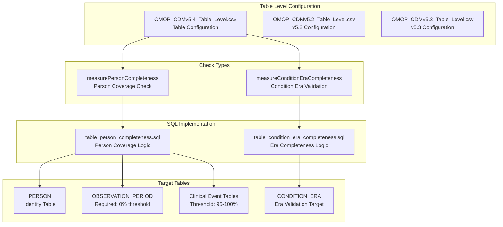
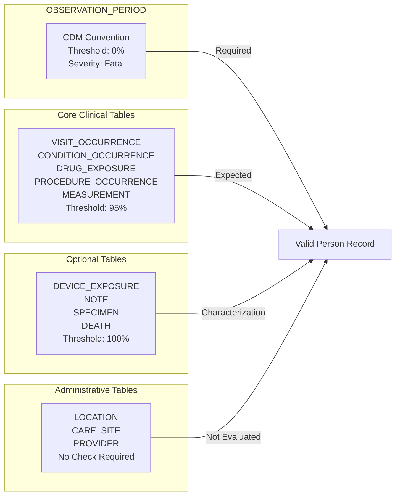
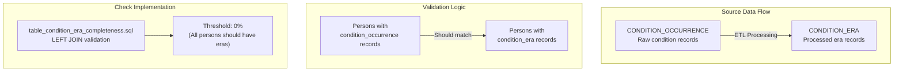
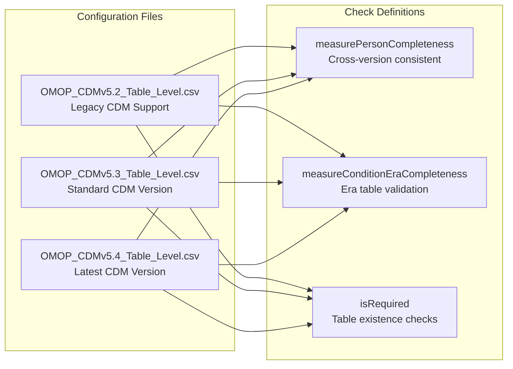
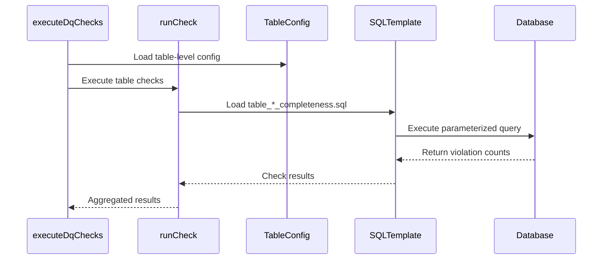

# Page: Table Level Checks

# Table Level Checks

<details>
<summary>Relevant source files</summary>

The following files were used as context for generating this wiki page:

- [inst/csv/OMOP_CDMv5.2_Field_Level.csv](inst/csv/OMOP_CDMv5.2_Field_Level.csv)
- [inst/csv/OMOP_CDMv5.2_Table_Level.csv](inst/csv/OMOP_CDMv5.2_Table_Level.csv)
- [inst/csv/OMOP_CDMv5.3_Field_Level.csv](inst/csv/OMOP_CDMv5.3_Field_Level.csv)
- [inst/csv/OMOP_CDMv5.3_Table_Level.csv](inst/csv/OMOP_CDMv5.3_Table_Level.csv)
- [inst/csv/OMOP_CDMv5.4_Field_Level.csv](inst/csv/OMOP_CDMv5.4_Field_Level.csv)
- [inst/csv/OMOP_CDMv5.4_Table_Level.csv](inst/csv/OMOP_CDMv5.4_Table_Level.csv)
- [inst/sql/sql_server/table_condition_era_completeness.sql](inst/sql/sql_server/table_condition_era_completeness.sql)
- [vignettes/checks/isStandardValidConcept.Rmd](vignettes/checks/isStandardValidConcept.Rmd)
- [vignettes/checks/measurePersonCompleteness.Rmd](vignettes/checks/measurePersonCompleteness.Rmd)
- [vignettes/checks/measureValueCompleteness.Rmd](vignettes/checks/measureValueCompleteness.Rmd)
- [vignettes/checks/plausibleValueHigh.Rmd](vignettes/checks/plausibleValueHigh.Rmd)
- [vignettes/checks/plausibleValueLow.Rmd](vignettes/checks/plausibleValueLow.Rmd)
- [vignettes/checks/sourceConceptRecordCompleteness.Rmd](vignettes/checks/sourceConceptRecordCompleteness.Rmd)
- [vignettes/checks/sourceValueCompleteness.Rmd](vignettes/checks/sourceValueCompleteness.Rmd)
- [vignettes/checks/standardConceptRecordCompleteness.Rmd](vignettes/checks/standardConceptRecordCompleteness.Rmd)
- [vignettes/checks/withinVisitDates.Rmd](vignettes/checks/withinVisitDates.Rmd)

</details>


This document covers the table-level data quality checks in the DataQualityDashboard system. Table level checks evaluate data quality at the granularity of entire OMOP CDM tables, examining properties like completeness across persons and table relationships. For information about field-level validations, see [Field Level Checks](#5.2). For concept-level vocabulary validation, see [Concept Level Checks](#5.3).

## Overview

Table level checks assess data quality characteristics that can only be evaluated by examining entire tables or relationships between tables. These checks are defined in the framework's configuration files and implemented through parameterized SQL templates that examine table-wide patterns and completeness metrics.



Sources: [inst/csv/OMOP_CDMv5.4_Table_Level.csv:1-25](), [inst/sql/sql_server/table_condition_era_completeness.sql:1-54](), [vignettes/checks/measurePersonCompleteness.Rmd:1-77]()

## measurePersonCompleteness Check

The `measurePersonCompleteness` check validates what percentage of persons in the CDM have at least one record in each clinical table. This is the primary table-level completeness metric.

### Configuration Structure

The check configuration is defined in the table-level CSV files with these key columns:

| Column | Purpose |
|--------|---------|
| `cdmTableName` | Target table for evaluation |
| `measurePersonCompleteness` | Boolean flag to enable check |
| `measurePersonCompletenessThreshold` | Failure threshold percentage |
| `measurePersonCompletenessNotes` | Documentation notes |

### Severity Levels and Thresholds



Sources: [vignettes/checks/measurePersonCompleteness.Rmd:30-33](), [inst/csv/OMOP_CDMv5.4_Table_Level.csv:1-25]()

### Implementation Logic

The check compares persons in the `PERSON` table against those with records in each target table:

- **Numerator**: Number of persons with 0 rows in the target table
- **Denominator**: Total number of persons in `PERSON` table  
- **Violated rows query**: LEFT JOIN pattern to identify missing persons

Example SQL pattern from the system:
```sql
SELECT cdmTable.* 
FROM @cdmDatabaseSchema.person cdmTable
    LEFT JOIN @schema.@cdmTableName cdmTable2 
        ON cdmTable.person_id = cdmTable2.person_id
WHERE cdmTable2.person_id IS NULL
```

Sources: [vignettes/checks/measurePersonCompleteness.Rmd:42-50]()

## measureConditionEraCompleteness Check

This specialized table-level check validates that condition era records have been properly generated for persons who have condition occurrence data.

### Purpose and Scope

The check ensures that the ETL process correctly builds `CONDITION_ERA` records from `CONDITION_OCCURRENCE` source data. This is critical for temporal analysis workflows that rely on condition eras.



Sources: [inst/sql/sql_server/table_condition_era_completeness.sql:1-54](), [inst/csv/OMOP_CDMv5.4_Table_Level.csv:22]()

### SQL Implementation

The check uses a LEFT JOIN pattern to identify persons in `CONDITION_OCCURRENCE` who lack corresponding `CONDITION_ERA` records:

Key implementation from [inst/sql/sql_server/table_condition_era_completeness.sql:30-41]():
```sql
SELECT DISTINCT co.person_id
FROM @cdmDatabaseSchema.condition_occurrence co
LEFT JOIN @cdmDatabaseSchema.@cdmTableName cdmTable 
    ON co.person_id = cdmTable.person_id
WHERE cdmTable.person_id IS NULL
```

The SQL template supports cohort filtering when `@runForCohort` parameter is enabled, joining against cohort tables to limit evaluation scope.

Sources: [inst/sql/sql_server/table_condition_era_completeness.sql:1-54]()

## Configuration Management

Table level checks are configured through CDM version-specific CSV files that define which checks run against which tables.

### CDM Version Support



### Schema Configuration

The configuration specifies table schemas and check parameters:

| Parameter | Description |
|-----------|-------------|
| `cdmTableName` | Target OMOP CDM table name |
| `schema` | Database schema identifier (CDM, vocab, cohort) |
| `isRequired` | Whether table must exist in CDM |
| `conceptPrefix` | Prefix for concept-related checks |

Sources: [inst/csv/OMOP_CDMv5.4_Table_Level.csv:1-25](), [inst/csv/OMOP_CDMv5.3_Table_Level.csv:1-25](), [inst/csv/OMOP_CDMv5.2_Table_Level.csv:1-24]()

## Integration with Execution Framework

Table level checks integrate with the core execution engine through the same parameterized SQL template system used by field and concept level checks.

### Execution Flow



The system uses the same parameter injection mechanism as other check levels, supporting:
- `@cdmDatabaseSchema` - Target CDM database schema
- `@cdmTableName` - Specific table being evaluated  
- `@cohortDatabaseSchema` - Cohort restriction schema
- `@runForCohort` - Boolean cohort filtering flag

Sources: [inst/sql/sql_server/table_condition_era_completeness.sql:9-13](), [inst/sql/sql_server/table_condition_era_completeness.sql:33-37]()