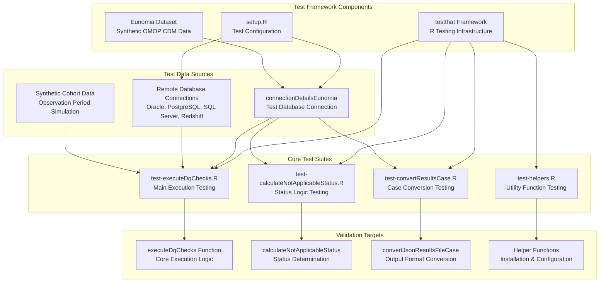
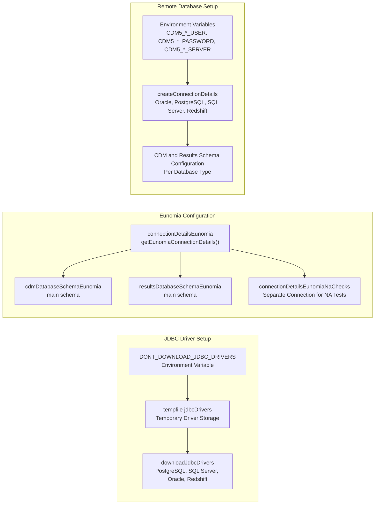
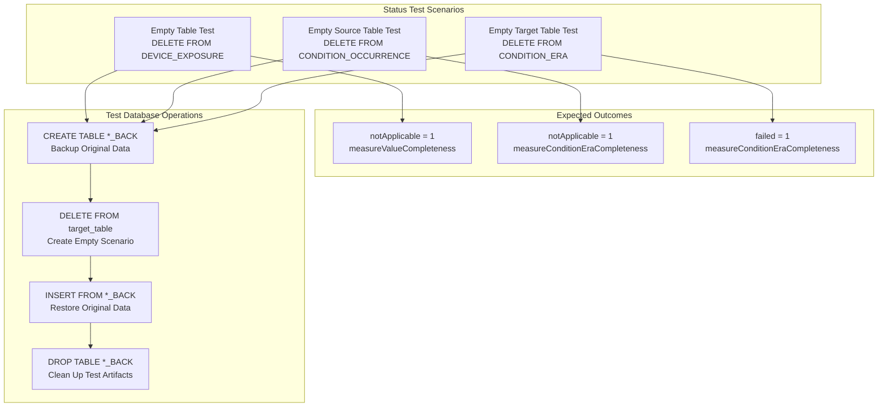

# Page: Testing Framework

# Testing Framework

<details>
<summary>Relevant source files</summary>

The following files were used as context for generating this wiki page:

- [R/convertResultsCase.R](R/convertResultsCase.R)
- [man/convertJsonResultsFileCase.Rd](man/convertJsonResultsFileCase.Rd)
- [tests/testthat/setup.R](tests/testthat/setup.R)
- [tests/testthat/test-calculateNotApplicableStatus.R](tests/testthat/test-calculateNotApplicableStatus.R)
- [tests/testthat/test-convertResultsCase.R](tests/testthat/test-convertResultsCase.R)
- [tests/testthat/test-executeDqChecks.R](tests/testthat/test-executeDqChecks.R)
- [tests/testthat/test-helpers.R](tests/testthat/test-helpers.R)

</details>


This document covers the comprehensive testing framework used in DataQualityDashboard to validate data quality check execution, result processing, and output generation. The testing framework ensures reliability across different database platforms, execution modes, and data scenarios.

For information about the core execution system being tested, see [Core Execution Engine](#3). For details about specific check implementations, see [Check Implementation](#5).

## Test Framework Architecture

The DataQualityDashboard testing framework is built on R's `testthat` package and uses the Eunomia synthetic dataset for reproducible test execution. The framework validates the entire data quality pipeline from check execution to result processing.



Sources: [tests/testthat/setup.R:1-18](), [tests/testthat/test-executeDqChecks.R:1-400](), [tests/testthat/test-calculateNotApplicableStatus.R:1-92](), [tests/testthat/test-convertResultsCase.R:1-66](), [tests/testthat/test-helpers.R:1-19]()

## Test Data Setup and Configuration

The testing framework uses a standardized setup process to ensure consistent test environments across different scenarios and database platforms.



Sources: [tests/testthat/setup.R:1-18](), [tests/testthat/test-executeDqChecks.R:126-143]()

## Test Categories and Execution Patterns

The testing framework covers multiple execution patterns and validation scenarios to ensure comprehensive coverage of the data quality check system.

### Core Execution Tests

| Test Category | Test Function | Purpose | Key Validations |
|--------------|---------------|---------|-----------------|
| Single Check Execution | `test-executeDqChecks.R:4-22` | Validates basic execution flow | `nrow(results$CheckResults) > 1` |
| Check Level Filtering | `test-executeDqChecks.R:24-75` | Tests TABLE, FIELD, CONCEPT level execution | Level-specific result validation |
| Cohort-Based Analysis | `test-executeDqChecks.R:77-113` | Tests cohort filtering functionality | Cohort table creation and cleanup |
| Remote Database Testing | `test-executeDqChecks.R:115-164` | Validates multi-platform compatibility | Oracle, PostgreSQL, SQL Server, Redshift |
| SQL Generation Modes | `test-executeDqChecks.R:208-293` | Tests `sqlOnly` execution modes | File output validation and SQL correctness |
| Database Write Operations | `test-executeDqChecks.R:184-206` | Tests `writeToTable` functionality | Table creation and data persistence |

Sources: [tests/testthat/test-executeDqChecks.R:4-400]()

### Status Calculation Tests

The framework includes specialized tests for the `calculateNotApplicableStatus` function, which determines when checks should be marked as "Not Applicable" based on data availability.



Sources: [tests/testthat/test-calculateNotApplicableStatus.R:3-92]()

### Case Conversion Tests

The framework validates the `convertJsonResultsFileCase` function that handles conversion between camelCase and snake_case result formats for backward compatibility.

| Test Scenario | Function | Validation |
|--------------|----------|------------|
| Camel to Snake Conversion | `convertJsonResultsFileCase` | Field name transformation validation |
| Snake to Camel Conversion | `convertJsonResultsFileCase` | Reverse transformation validation |
| Already Converted Warning | `convertJsonResultsFileCase` | Duplicate conversion prevention |
| Round-trip Consistency | JSON comparison | Original and reconverted results match |
| Invalid Case Error | Error handling | Proper error messages for invalid inputs |

Sources: [tests/testthat/test-convertResultsCase.R:1-66](), [R/convertResultsCase.R:37-85]()

## Test Execution and Validation Patterns

The testing framework uses several consistent patterns for test execution and result validation:

```mermaid
graph TB
    subgraph "Test Execution Pattern"
        TEMP_SETUP["tempfile('dqd_')<br/>Create Temporary Output Folder"]
        ON_EXIT["on.exit(unlink(outputFolder, recursive = TRUE))<br/>Cleanup Registration"]
        EXECUTE["executeDqChecks(...)<br/>Core Function Execution"]
        VALIDATE["expect_* Assertions<br/>Result Validation"]
        CLEANUP["Automatic Cleanup<br/>on.exit Handler"]
    end
    
    subgraph "Database Test Pattern"
        ENV_CHECK["Environment Variable Check<br/>sysUser != '' & sysPassword != ''"]
        CONN_CREATE["createConnectionDetails<br/>Database Connection Setup"]
        TEST_EXEC["Test Execution<br/>With Database-Specific Parameters"]
        RESULT_CHECK["Result Validation<br/>Database-Specific Assertions"]
    end
    
    subgraph "SQL-Only Test Pattern"
        SQL_CONN["Dummy Connection Details<br/>dbms = 'sql server', pathToDriver = '/'"]
        SQL_EXEC["executeDqChecks with sqlOnly = TRUE<br/>SQL Generation Mode"]
        FILE_CHECK["File Existence Validation<br/>expect_true(file %in% list.files())"]
        SNAPSHOT_TEST["expect_snapshot<br/>SQL Content Validation"]
    end
    
    TEMP_SETUP --> ON_EXIT
    ON_EXIT --> EXECUTE
    EXECUTE --> VALIDATE
    VALIDATE --> CLEANUP
    
    ENV_CHECK --> CONN_CREATE
    CONN_CREATE --> TEST_EXEC
    TEST_EXEC --> RESULT_CHECK
    
    SQL_CONN --> SQL_EXEC
    SQL_EXEC --> FILE_CHECK
    FILE_CHECK --> SNAPSHOT_TEST
```



Sources: [tests/testthat/test-executeDqChecks.R:4-330]()

## Running Tests

### Local Test Execution

Tests can be executed using standard R testing commands:

```r
# Run all tests
testthat::test_dir("tests/testthat")

# Run specific test file
testthat::test_file("tests/testthat/test-executeDqChecks.R")

# Run with devtools
devtools::test()
```

### Remote Database Testing

Remote database tests require environment variables to be set:

| Database | Required Environment Variables |
|----------|-------------------------------|
| Oracle | `CDM5_ORACLE_USER`, `CDM5_ORACLE_PASSWORD`, `CDM5_ORACLE_SERVER`, `CDM5_ORACLE_CDM54_SCHEMA`, `CDM5_ORACLE_OHDSI_SCHEMA` |
| PostgreSQL | `CDM5_POSTGRESQL_USER`, `CDM5_POSTGRESQL_PASSWORD`, `CDM5_POSTGRESQL_SERVER`, `CDM5_POSTGRESQL_CDM54_SCHEMA`, `CDM5_POSTGRESQL_OHDSI_SCHEMA` |
| SQL Server | `CDM5_SQL_SERVER_USER`, `CDM5_SQL_SERVER_PASSWORD`, `CDM5_SQL_SERVER_SERVER`, `CDM5_SQL_SERVER_CDM54_SCHEMA`, `CDM5_SQL_SERVER_OHDSI_SCHEMA` |
| Redshift | `CDM5_REDSHIFT_USER`, `CDM5_REDSHIFT_PASSWORD`, `CDM5_REDSHIFT_SERVER`, `CDM5_REDSHIFT_CDM54_SCHEMA`, `CDM5_REDSHIFT_OHDSI_SCHEMA` |

Sources: [tests/testthat/test-executeDqChecks.R:126-143]()

### JDBC Driver Configuration

The framework automatically downloads JDBC drivers unless `DONT_DOWNLOAD_JDBC_DRIVERS=TRUE` is set, in which case it uses the `DATABASECONNECTOR_JAR_FOLDER` environment variable.

Sources: [tests/testthat/setup.R:1-10]()

### Development Testing Setup

For development testing with `devtools`, the framework includes special handling for SQL file access through symbolic links when `DEVTOOLS_LOAD=true` is detected.

Sources: [tests/testthat/test-helpers.R:11-17]()