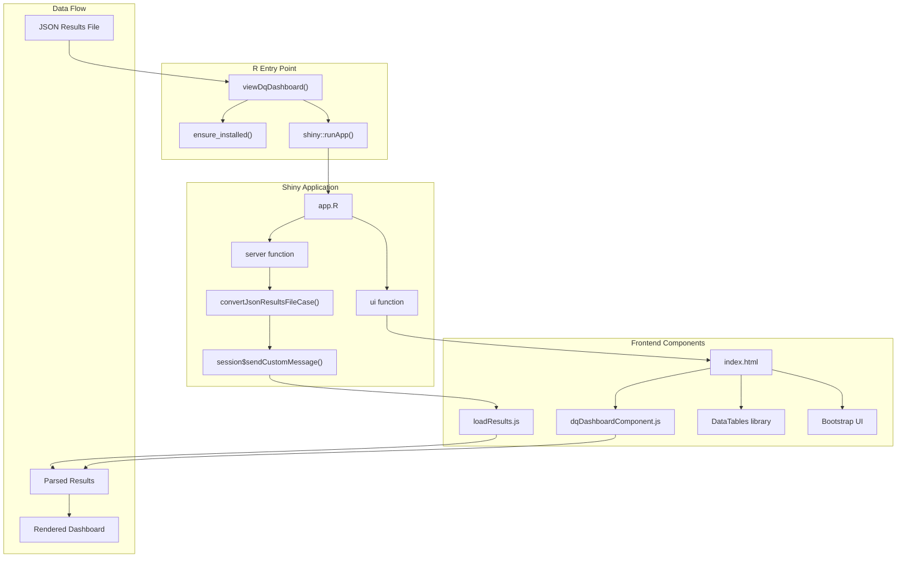
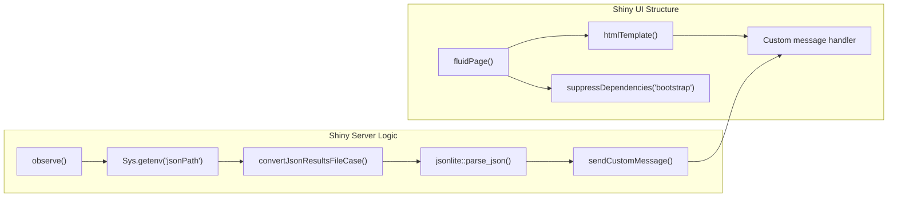
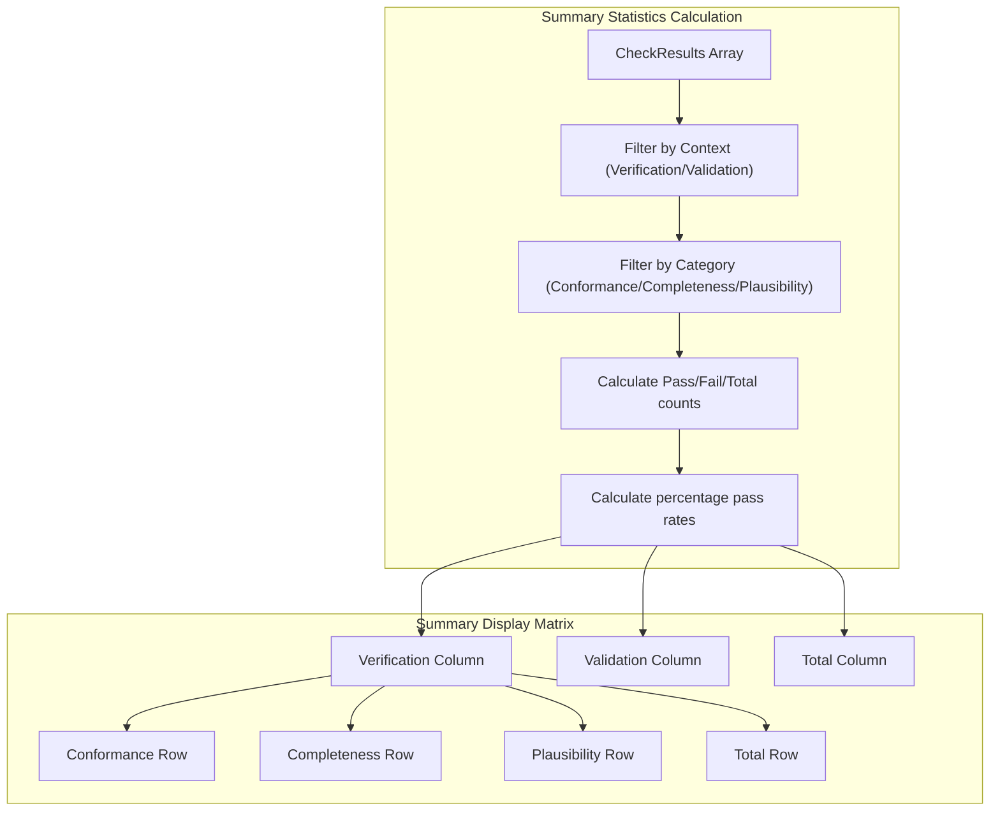
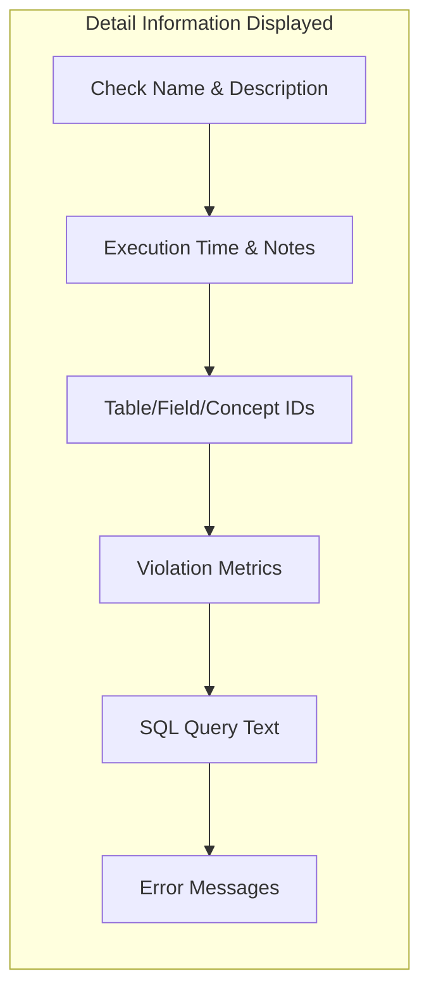
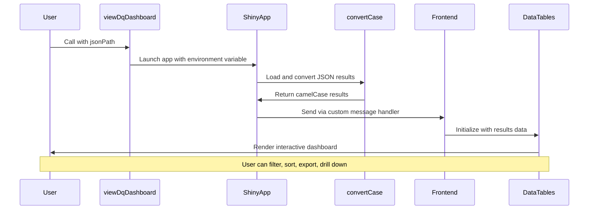

# Page: Visualization and Dashboard

# Visualization and Dashboard

<details>
<summary>Relevant source files</summary>

The following files were used as context for generating this wiki page:

- [R/listChecks.R](R/listChecks.R)
- [R/readThresholdFile.R](R/readThresholdFile.R)
- [R/view.R](R/view.R)
- [extras/PackageMaintenance.R](extras/PackageMaintenance.R)
- [inst/shinyApps/app.R](inst/shinyApps/app.R)
- [inst/shinyApps/www/css/resume.css](inst/shinyApps/www/css/resume.css)
- [inst/shinyApps/www/htmlwidgets/lib/dqDashboardComponent.js](inst/shinyApps/www/htmlwidgets/lib/dqDashboardComponent.js)
- [inst/shinyApps/www/img/close.png](inst/shinyApps/www/img/close.png)
- [inst/shinyApps/www/img/open.png](inst/shinyApps/www/img/open.png)
- [inst/shinyApps/www/index.html](inst/shinyApps/www/index.html)
- [inst/shinyApps/www/js/loadResults.js](inst/shinyApps/www/js/loadResults.js)

</details>


## Purpose and Scope

The Visualization and Dashboard system provides an interactive web-based interface for viewing and analyzing data quality assessment results. This system takes JSON output from data quality check execution and presents it through a responsive dashboard with summary statistics, detailed results tables, and metadata views.

For information about generating the JSON results that feed into this dashboard, see [Results Processing](#6). For details about the underlying data quality checks being visualized, see [Data Quality Framework](#4).

## System Architecture

The visualization system consists of three main layers: the R entry point, the Shiny web application, and the frontend components.



Sources: [R/view.R:1-78](), [inst/shinyApps/app.R:1-22](), [inst/shinyApps/www/index.html:1-159]()

## Core Components

### R Entry Point

The `viewDqDashboard()` function in [R/view.R:29-44]() serves as the main entry point for launching the dashboard:

```r
viewDqDashboard(jsonPath, launch.browser = NULL, display.mode = NULL, ...)
```

Key responsibilities:
- Validates that the `shiny` package is installed via `ensure_installed()`
- Sets the `jsonPath` environment variable for the Shiny app to access
- Launches the Shiny application from the `inst/shinyApps` directory
- Passes through configuration options like `launch.browser` and `display.mode`

### Shiny Application Layer

The Shiny application in [inst/shinyApps/app.R:1-22]() provides the web server functionality:



The server function [inst/shinyApps/app.R:2-9]() reads the JSON file, converts the case format to camelCase for JavaScript compatibility, and sends the processed results to the frontend via a custom message handler.

Sources: [inst/shinyApps/app.R:1-22]()

### Frontend Architecture

The frontend consists of a Bootstrap-based HTML structure with custom JavaScript components:

| Component | File | Purpose |
|-----------|------|---------|
| Main HTML Structure | [inst/shinyApps/www/index.html]() | Bootstrap layout with navigation sections |
| Results Loading | [inst/shinyApps/www/js/loadResults.js]() | DataTables setup and result processing |
| Summary Dashboard | [inst/shinyApps/www/htmlwidgets/lib/dqDashboardComponent.js]() | Custom web component for overview statistics |
| Styling | [inst/shinyApps/www/css/resume.css]() | Custom CSS for dashboard appearance |

## Dashboard Features

### Summary Overview

The summary overview is implemented as a custom web component `<dq-dashboard>` in [inst/shinyApps/www/htmlwidgets/lib/dqDashboardComponent.js:1-495]():



The component renders a 4×4 matrix showing pass/fail statistics broken down by:
- **Context**: Verification vs Validation
- **Category**: Conformance, Completeness, Plausibility
- **Overall Totals**: Combined statistics with corrected percentages for Not Applicable and Error statuses

Sources: [inst/shinyApps/www/htmlwidgets/lib/dqDashboardComponent.js:168-492]()

### Detailed Results Table

The detailed results table is implemented using DataTables in [inst/shinyApps/www/js/loadResults.js:98-194]():

#### Table Configuration

| Feature | Implementation | Purpose |
|---------|---------------|---------|
| Filtering | Column dropdowns [inst/shinyApps/www/js/loadResults.js:122-144]() | Filter by status, table, category, etc. |
| Export | CSV export button [inst/shinyApps/www/js/loadResults.js:104-119]() | Download filtered results |
| Sorting | Multi-column sorting [inst/shinyApps/www/js/loadResults.js:101]() | Order by violation percentage, status |
| Detail Views | Expandable rows [inst/shinyApps/www/js/loadResults.js:180-193]() | Show full check details and SQL |

#### Column Structure

The results table displays the following columns [inst/shinyApps/www/js/loadResults.js:146-177]():

- **STATUS**: Computed from `isError`, `notApplicable`, `failed` flags
- **TABLE**: `cdmTableName` from check results
- **FIELD**: `cdmFieldName` (hidden by default)
- **CHECK**: `checkName` (hidden by default)  
- **CATEGORY**: Kahn framework category
- **SUBCATEGORY**: More specific categorization
- **LEVEL**: Table/Field/Concept level
- **NOTES**: Indicator of whether notes exist
- **DESCRIPTION**: Check description with threshold information
- **% RECORDS**: Percentage violated formatted with 2 decimals

#### Detail View

When a user clicks the expand button, the `format()` function [inst/shinyApps/www/js/loadResults.js:9-96]() displays comprehensive check information:



Sources: [inst/shinyApps/www/js/loadResults.js:1-195]()

### Navigation and Layout

The dashboard uses a Bootstrap-based responsive layout [inst/shinyApps/www/index.html:22-118]() with:

- **Fixed sidebar navigation**: Links to Overview, Metadata, Results, About sections
- **CDM source name display**: Shows the data source being analyzed
- **Responsive design**: Adapts to different screen sizes
- **OHDSI branding**: Consistent with OHDSI visual identity

Sources: [inst/shinyApps/www/index.html:22-118](), [inst/shinyApps/www/css/resume.css:42-231]()

## Data Flow and Integration

The dashboard integrates with the broader DataQualityDashboard system through a well-defined data flow:



### Case Conversion Integration

The dashboard relies on the case conversion functionality from the main package [inst/shinyApps/app.R:5]():

```r
results <- DataQualityDashboard::convertJsonResultsFileCase(
  jsonPath, 
  writeToFile = FALSE, 
  targetCase = "camel"
)
```

This ensures JavaScript compatibility by converting snake_case field names to camelCase.

### Metadata Display

The dashboard includes metadata display components that show execution context:

- **CDM Source Name**: Extracted from metadata and displayed in navigation
- **Execution Details**: Timestamps, versions, and configuration information
- **Check Descriptions**: Detailed information about each data quality check

Sources: [inst/shinyApps/app.R:2-9](), [inst/shinyApps/www/js/loadResults.js:1-8]()

## Standalone Web Deployment

The dashboard can also function as a standalone web application without Shiny. The HTML file includes logic [inst/shinyApps/www/index.html:144-155]() to load results directly from a `results.json` file when served from a web server:

```javascript
if (location.port == 80 || location.port == 8080 || location.port == "") {
  $.ajax({
    dataType: "json",
    url: "results.json", 
    success: function (results) {
      loadResults(results);
    }
  });
}
```

This enables deployment scenarios where the dashboard is hosted as static files alongside the JSON results.

Sources: [inst/shinyApps/www/index.html:144-155]()